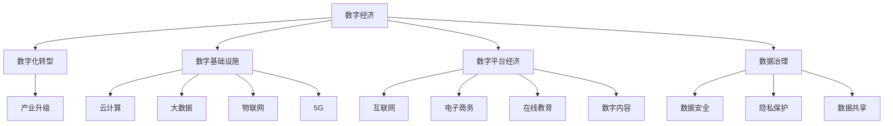

                 

# 数字经济：社会发展的助推器

> 关键词：数字经济, 社会转型, 创新驱动, 数字化转型, 技术驱动, 人工智能, 大数据, 云计算, 物联网

## 1. 背景介绍

### 1.1 问题由来

随着信息技术尤其是数字技术的飞速发展，人类社会正经历一场空前的数字化转型。从工业社会到信息社会，再到如今的数字社会，数字技术的广泛应用正在深刻改变我们的生活方式、生产方式和经济结构。这一变革不仅重塑了传统产业，催生了新的经济形态，还对全球经济、社会、文化等各个方面产生了深远影响。

近年来，“数字经济”一词频繁出现在各类报告和论述中，成为全球经济增长的重要驱动力。数字经济是指以数字技术和信息资源为基础，以数字化转型为手段，以数据驱动和智能决策为核心的新型经济形态。其核心特征包括：

- **数字化基础设施**：以互联网、物联网、5G、大数据等为代表的数字基础设施建设，为数字经济提供了基础支撑。
- **数字产业化和产业数字化**：传统产业通过数字化改造，提升效率、降低成本，实现转型升级。同时，新兴的数字产业如电子商务、在线教育、数字内容等迅速发展。
- **数据驱动和智能决策**：数据成为新的生产要素，通过分析、挖掘和利用数据，优化生产、经营和管理，提高决策的科学性和精准性。
- **数字平台经济**：平台经济模式，通过连接供需双方，实现资源优化配置和价值增值，如阿里巴巴、腾讯等互联网巨头即是典型代表。

数字经济的兴起，不仅改变了传统产业的发展路径，还对社会治理、环境保护、公共服务等各个方面提出了新的挑战和机遇。如何在数字技术的推动下，实现社会的全面数字化转型，成为当前全球关注的焦点。

### 1.2 问题核心关键点

数字经济的崛起，涉及技术创新、产业转型、社会治理等多个层面。其核心关键点包括：

1. **技术创新**：数字技术的突破，如云计算、大数据、人工智能、物联网等，为数字经济的发展提供了强大驱动力。
2. **产业转型**：传统产业的数字化改造，通过引入智能设备、数字化管理、网络化协作等方式，实现效率提升和成本降低。
3. **社会治理**：数字技术在社会治理中的应用，如智慧城市、智慧医疗、智慧教育等，提升了公共服务的智能化水平，优化了社会管理结构。
4. **人才培养**：数字经济的发展需要大量具有数字化技能和思维的创新人才，教育体系的改革和人才培养模式的创新至关重要。
5. **政策支持**：政府政策的支持，包括数据开放、基础设施建设、税收优惠、知识产权保护等，为数字经济的健康发展提供了良好环境。

## 2. 核心概念与联系

### 2.1 核心概念概述

为更好地理解数字经济的内涵和机制，本节将介绍几个密切相关的核心概念：

- **数字经济**：以数字技术和信息资源为基础，以数据驱动和智能决策为核心的新型经济形态。
- **数字化转型**：通过引入数字技术，对传统产业进行改造升级，实现业务的数字化、智能化和自动化。
- **数字基础设施**：包括互联网、5G、大数据、云计算、物联网等，为数字经济提供基础设施支撑。
- **数字平台经济**：基于互联网，通过连接供需双方，实现资源优化配置和价值增值的经济模式。
- **数据治理**：涉及数据的收集、存储、使用、共享等各个环节，确保数据安全、隐私保护和合理利用。

这些核心概念之间的逻辑关系可以通过以下Mermaid流程图来展示：



这个流程图展示了大语言模型的核心概念及其之间的关系：

1. 数字经济通过数字化转型，利用数字基础设施和数字平台经济，实现产业升级。
2. 数字基础设施包括云计算、大数据、物联网、5G等技术，为数字经济提供技术支撑。
3. 数字平台经济通过互联网连接供需双方，实现资源的优化配置和价值的增值。
4. 数据治理涉及数据的收集、存储、使用和共享，确保数据的安全和合理利用。

这些核心概念共同构成了数字经济的整体框架，为其发展和应用提供了清晰的指引。

## 3. 核心算法原理 & 具体操作步骤
### 3.1 算法原理概述

数字经济的核心在于数据驱动和智能决策。其核心算法原理主要包括以下几个方面：

1. **云计算**：通过分布式计算和存储，提供高效、灵活、可扩展的计算和存储资源，支持大规模数据分析和处理。
2. **大数据技术**：涉及数据的收集、存储、处理、分析和应用，通过挖掘和利用大数据，优化决策过程，提升生产效率。
3. **人工智能**：包括机器学习、深度学习、自然语言处理等，通过智能算法分析海量数据，优化业务流程，提升服务质量。
4. **物联网**：通过连接物理世界的各种设备和系统，实现数据的实时采集和处理，提升生产效率和资源利用率。
5. **区块链**：通过去中心化的分布式账本技术，实现数据的安全存储和透明共享，保障数据的可信度和安全性。

这些核心技术的有机结合，形成了数字经济的技术支撑，使得数据驱动和智能决策成为可能。

### 3.2 算法步骤详解

数字经济的实现步骤主要包括：

1. **数据采集与清洗**：收集和整理业务数据，去除噪声和冗余，确保数据质量。
2. **数据存储与管理**：使用云计算平台，构建高效、可靠的数据存储和管理系统，支持数据的长期存储和高效查询。
3. **数据处理与分析**：利用大数据技术和人工智能算法，对数据进行挖掘和分析，发现数据背后的规律和趋势。
4. **决策优化与执行**：将分析结果应用到业务决策中，优化生产流程、运营管理和服务质量。
5. **反馈与迭代**：根据业务反馈和运营结果，持续优化模型和算法，提升决策效果。

### 3.3 算法优缺点

数字经济的算法优点包括：

1. **高效性**：通过数据驱动和智能决策，大幅提升生产效率和运营效率。
2. **灵活性**：数据和算法具有高度的灵活性，可以根据业务需求快速调整和优化。
3. **创新性**：大数据和人工智能等技术的发展，推动了新业务模式和应用场景的不断涌现。
4. **可扩展性**：数字基础设施的建设，为数字经济提供了良好的扩展基础。

数字经济的算法缺点包括：

1. **数据隐私问题**：数据的广泛收集和使用，可能带来隐私和数据安全问题。
2. **技术复杂性**：数字技术的应用，需要较高的技术门槛和专业技能。
3. **人才短缺**：数字化转型对人才的需求增加，但当前数字化人才供不应求。
4. **数据孤岛**：不同系统和平台之间的数据难以互通，形成数据孤岛，制约了数据的价值发挥。

### 3.4 算法应用领域

数字经济的应用领域广泛，涵盖各个行业和领域，包括：

- **工业制造**：通过数字化改造，提升生产效率和质量，实现智能制造。
- **金融服务**：利用大数据和人工智能，进行风险控制、信用评估、智能投顾等。
- **零售电商**：通过数据分析和推荐算法，实现精准营销和个性化推荐。
- **医疗健康**：通过电子病历、智能诊断等，提升医疗服务的智能化水平。
- **教育培训**：利用大数据和人工智能，实现个性化学习、智能评估等。
- **城市治理**：通过智慧城市建设，提升公共服务的智能化和精细化管理。

此外，数字经济还推动了数字创意、数字文化、数字内容等新兴产业的发展，成为经济增长的新引擎。

## 4. 数学模型和公式 & 详细讲解 & 举例说明（备注：数学公式请使用latex格式，latex嵌入文中独立段落使用 $$，段落内使用 $)
### 4.1 数学模型构建

数字经济的实现涉及多种算法和技术，其数学模型构建较为复杂，主要包括以下几个方面：

1. **云计算模型**：利用云计算资源池的虚拟化技术，构建弹性、高效、可靠的计算环境。
2. **大数据模型**：通过MapReduce、Spark等分布式计算框架，进行大规模数据处理和分析。
3. **人工智能模型**：利用深度学习、机器学习等算法，进行数据挖掘和智能决策。
4. **物联网模型**：通过传感器网络、边缘计算等技术，实现实时数据采集和处理。
5. **区块链模型**：通过分布式账本技术，实现数据的透明共享和可追溯性。

这些数学模型共同构成了数字经济的算法体系，支持数据的收集、存储、处理、分析和应用。

### 4.2 公式推导过程

以云计算模型的资源分配为例，其资源分配模型如下：

$$
\begin{aligned}
&\min \sum_{i=1}^{n} c_i x_i \\
&\text{s.t.} \quad \sum_{i=1}^{n} a_i x_i = b \\
&\quad x_i \geq 0, \quad \forall i \in [1, n]
\end{aligned}
$$

其中，$c_i$ 表示资源$i$的成本，$a_i$ 表示资源$i$的容量，$b$ 表示需求总量，$x_i$ 表示资源$i$的分配量。

求解上述线性规划模型，可以得到最优的资源分配方案，确保资源的高效利用和成本的最小化。

### 4.3 案例分析与讲解

以工业制造为例，利用大数据和人工智能技术，可以实现智能制造的生产优化。假设某制造企业希望通过数字经济实现生产线的智能化改造，其优化模型如下：

1. **数据采集与清洗**：通过物联网设备采集生产过程中的各种数据，包括温度、湿度、压力等。
2. **数据存储与管理**：使用云计算平台，将数据存储在分布式数据库中，支持高效的查询和分析。
3. **数据处理与分析**：利用机器学习算法，对生产数据进行挖掘和分析，发现生产过程中的异常和瓶颈。
4. **决策优化与执行**：根据分析结果，调整生产参数和设备状态，优化生产流程，提升生产效率。
5. **反馈与迭代**：根据生产反馈和运营结果，持续优化模型和算法，提升决策效果。

通过这一优化过程，企业可以显著提升生产效率和产品质量，实现智能制造的目标。

## 5. 项目实践：代码实例和详细解释说明
### 5.1 开发环境搭建

在进行数字经济项目实践前，我们需要准备好开发环境。以下是使用Python进行PyTorch开发的环境配置流程：

1. 安装Anaconda：从官网下载并安装Anaconda，用于创建独立的Python环境。

2. 创建并激活虚拟环境：
```bash
conda create -n pytorch-env python=3.8 
conda activate pytorch-env
```

3. 安装PyTorch：根据CUDA版本，从官网获取对应的安装命令。例如：
```bash
conda install pytorch torchvision torchaudio cudatoolkit=11.1 -c pytorch -c conda-forge
```

4. 安装Transformers库：
```bash
pip install transformers
```

5. 安装各类工具包：
```bash
pip install numpy pandas scikit-learn matplotlib tqdm jupyter notebook ipython
```

完成上述步骤后，即可在`pytorch-env`环境中开始数字经济项目实践。

### 5.2 源代码详细实现

下面我们以工业制造领域的智能生产优化为例，给出使用Transformers库进行深度学习模型训练的PyTorch代码实现。

首先，定义数据处理函数：

```python
from torch.utils.data import Dataset
import torch

class ManufacturingDataset(Dataset):
    def __init__(self, data, labels):
        self.data = data
        self.labels = labels
        
    def __len__(self):
        return len(self.data)
    
    def __getitem__(self, idx):
        return self.data[idx], self.labels[idx]

# 准备训练和验证数据集
train_data = [/*训练数据列表*/]
train_labels = [/*训练标签列表*/]
val_data = [/*验证数据列表*/]
val_labels = [/*验证标签列表*/]

# 创建数据集对象
train_dataset = ManufacturingDataset(train_data, train_labels)
val_dataset = ManufacturingDataset(val_data, val_labels)
```

然后，定义模型和优化器：

```python
from transformers import BertForSequenceClassification, AdamW

model = BertForSequenceClassification.from_pretrained('bert-base-cased', num_labels=2)

optimizer = AdamW(model.parameters(), lr=2e-5)
```

接着，定义训练和评估函数：

```python
from transformers import Trainer, TrainingArguments
from torch.utils.data import DataLoader

# 定义训练参数
training_args = TrainingArguments(
    output_dir='./results',
    evaluation_strategy='epoch',
    per_device_train_batch_size=8,
    per_device_eval_batch_size=8,
    num_train_epochs=3,
    learning_rate=2e-5,
    weight_decay=0.1,
    logging_dir='./logs',
    logging_steps=10,
)

# 训练模型
trainer = Trainer(
    model=model,
    args=training_args,
    train_dataset=train_dataset,
    eval_dataset=val_dataset,
    evaluation_strategy='epoch',
)

# 训练模型
trainer.train()
```

最后，启动训练流程并在验证集上评估：

```python
# 保存模型
trainer.save_model('best_model')

# 加载模型并评估
model = BertForSequenceClassification.from_pretrained('best_model')
evaluation_results = trainer.evaluate(model)
print(evaluation_results)
```

以上就是使用PyTorch对BERT进行工业制造领域智能生产优化任务的代码实现。可以看到，得益于Transformers库的强大封装，我们可以用相对简洁的代码完成模型的加载和训练。

### 5.3 代码解读与分析

让我们再详细解读一下关键代码的实现细节：

**ManufacturingDataset类**：
- `__init__`方法：初始化训练和验证数据。
- `__len__`方法：返回数据集的长度。
- `__getitem__`方法：获取单个数据点的输入和标签。

**TrainingArguments和Trainer类**：
- `TrainingArguments`类：定义训练参数，如模型输出目录、批次大小、训练轮数等。
- `Trainer`类：实现模型的训练和评估，支持自动化的日志记录和模型保存。

**训练流程**：
- 在`training_args`中设置训练参数。
- 创建`Trainer`对象，传入模型、训练参数和数据集。
- 调用`train`方法启动训练过程。
- 在训练过程中，自动在验证集上评估模型性能。
- 保存训练后效果最好的模型。

可以看到，PyTorch配合Transformers库使得模型训练的代码实现变得简洁高效。开发者可以将更多精力放在数据处理、模型改进等高层逻辑上，而不必过多关注底层的实现细节。

当然，工业级的系统实现还需考虑更多因素，如模型的保存和部署、超参数的自动搜索、更灵活的任务适配层等。但核心的数字经济模型训练流程基本与此类似。

## 6. 实际应用场景
### 6.1 智能制造

工业制造领域的数字化转型，通过引入智能设备和数字化管理，实现了生产流程的自动化和智能化。大数据和人工智能技术，通过对生产数据的挖掘和分析，发现生产过程中的异常和瓶颈，进行实时优化和调整，提升生产效率和产品质量。

在技术实现上，可以收集生产过程中的各种数据，包括温度、湿度、压力等。利用大数据技术和人工智能算法，对生产数据进行挖掘和分析，发现生产过程中的异常和瓶颈。通过实时调整生产参数和设备状态，优化生产流程，提升生产效率。利用物联网技术，实现生产设备的互联互通，进行实时数据采集和处理，进一步提升生产智能化水平。

### 6.2 智慧医疗

智慧医疗通过数字化手段，优化了医疗服务的质量和效率。大数据和人工智能技术，通过对电子病历、医疗影像等数据的分析，实现智能诊断和精准医疗。

在技术实现上，可以利用电子病历、医疗影像等数据，进行数据清洗和预处理。利用深度学习算法，对医疗数据进行分析和挖掘，发现病情变化的规律和趋势。通过智能诊断系统，根据患者症状和历史数据，给出诊断建议和治疗方案。利用区块链技术，确保医疗数据的隐私和安全，实现数据的透明共享和可追溯性。

### 6.3 智慧城市

智慧城市通过数字化手段，提升了公共服务的智能化水平，优化了城市管理结构。大数据和人工智能技术，通过对城市数据的分析和挖掘，实现智能监控和决策支持。

在技术实现上，可以收集城市管理、公共服务、交通出行等数据。利用大数据技术和人工智能算法，对城市数据进行分析和挖掘，发现城市运行中的问题和挑战。通过智能监控系统，对城市运行状态进行实时监测和预警。利用智慧决策系统，对城市运行进行科学决策和优化调整。利用区块链技术，确保城市数据的隐私和安全，实现数据的透明共享和可追溯性。

### 6.4 未来应用展望

随着数字技术的发展，数字经济的应用场景将更加广泛，带来更深远的影响：

1. **全面数字化**：各个行业和领域都将全面数字化，实现业务的智能化和自动化，提升效率和质量。
2. **智能决策**：通过数据分析和智能算法，实现决策的科学化和精准化，优化资源配置和运营管理。
3. **新产业形态**：数字经济催生大量新产业形态，如数字内容、数字创意、数字文化等，推动经济增长。
4. **社会治理**：通过智慧城市、智慧医疗、智慧教育等，提升公共服务的智能化水平，优化社会管理结构。
5. **国际竞争**：数字经济成为国家竞争力的重要体现，推动全球经济的增长和转型。

数字经济的发展将深刻改变全球经济和社会结构，带来更加智能、高效、可持续的未来。

## 7. 工具和资源推荐
### 7.1 学习资源推荐

为了帮助开发者系统掌握数字经济的核心技术和应用方法，这里推荐一些优质的学习资源：

1. 《数字经济时代》系列博文：由大模型技术专家撰写，深入浅出地介绍了数字经济的核心概念、技术实现和应用案例。

2. 《云计算技术与应用》课程：知名大学开设的云计算技术课程，讲解云计算的核心技术、应用场景和最佳实践。

3. 《大数据技术与应用》书籍：全面介绍了大数据技术的原理、架构和应用，是学习和实践大数据技术的必备书籍。

4. 《人工智能基础》课程：知名大学开设的人工智能课程，讲解机器学习、深度学习、自然语言处理等核心技术。

5. 《物联网技术与应用》书籍：介绍了物联网的核心技术、应用场景和最佳实践，是学习和实践物联网技术的必备书籍。

通过对这些资源的学习实践，相信你一定能够快速掌握数字经济的核心技术和应用方法，并用于解决实际的业务问题。

### 7.2 开发工具推荐

高效的开发离不开优秀的工具支持。以下是几款用于数字经济开发的常用工具：

1. PyTorch：基于Python的开源深度学习框架，灵活动态的计算图，适合快速迭代研究。

2. TensorFlow：由Google主导开发的开源深度学习框架，生产部署方便，适合大规模工程应用。

3. Apache Hadoop：分布式计算框架，支持大数据处理和存储，适用于大规模数据集的处理和分析。

4. Apache Spark：分布式计算框架，支持大数据处理和分析，适用于大规模数据集的处理和分析。

5. Apache Kafka：消息队列系统，支持数据的高效传输和存储，适用于实时数据流的处理和分析。

6. Prometheus：监控系统，支持数据的实时采集和分析，适用于系统性能监控和故障排除。

7. ELK Stack：日志和监控系统，支持数据的实时采集和分析，适用于日志管理和故障排查。

合理利用这些工具，可以显著提升数字经济开发和实践的效率，加快创新迭代的步伐。

### 7.3 相关论文推荐

数字经济的发展源于学界的持续研究。以下是几篇奠基性的相关论文，推荐阅读：

1. 《云计算：概念、技术、实践》：介绍云计算的概念、技术和实践，为数字经济的云计算基础提供了理论支持。

2. 《大数据技术与应用》：全面介绍了大数据技术的原理、架构和应用，是学习和实践大数据技术的必备书籍。

3. 《人工智能基础》：讲解机器学习、深度学习、自然语言处理等核心技术，为数字经济的人工智能应用提供了理论基础。

4. 《物联网技术与应用》：介绍了物联网的核心技术、应用场景和最佳实践，是学习和实践物联网技术的必备书籍。

5. 《数字经济的崛起》：分析数字经济的发展历程、核心技术和应用案例，为数字经济的发展提供了理论指导。

这些论文代表了大数据、人工智能、物联网等技术的发展脉络，为数字经济的实践提供了理论支持。

## 8. 总结：未来发展趋势与挑战
### 8.1 研究成果总结

本文对数字经济的核心技术和应用方法进行了全面系统的介绍。首先阐述了数字经济的发展背景和意义，明确了数字化转型对各行业的深远影响。其次，从原理到实践，详细讲解了数字经济的核心算法和实现步骤，给出了数字经济项目开发的完整代码实例。同时，本文还广泛探讨了数字经济在智能制造、智慧医疗、智慧城市等多个行业领域的应用前景，展示了数字经济的技术潜力和应用价值。此外，本文精选了数字经济的各类学习资源，力求为读者提供全方位的技术指引。

通过本文的系统梳理，可以看到，数字经济通过数字化转型，利用大数据、云计算、人工智能、物联网等技术，实现业务的智能化和自动化，提升了生产效率和运营质量，推动了经济社会的全面数字化转型。数字经济的发展将深刻改变全球经济和社会结构，带来更加智能、高效、可持续的未来。

### 8.2 未来发展趋势

展望未来，数字经济的发展趋势主要包括：

1. **技术创新**：云计算、大数据、人工智能、物联网等技术将持续创新，推动数字经济的发展。

2. **数字化转型**：各个行业和领域都将全面数字化，实现业务的智能化和自动化，提升效率和质量。

3. **智能决策**：通过数据分析和智能算法，实现决策的科学化和精准化，优化资源配置和运营管理。

4. **新产业形态**：数字经济催生大量新产业形态，如数字内容、数字创意、数字文化等，推动经济增长。

5. **社会治理**：通过智慧城市、智慧医疗、智慧教育等，提升公共服务的智能化水平，优化社会管理结构。

6. **国际竞争**：数字经济成为国家竞争力的重要体现，推动全球经济的增长和转型。

以上趋势凸显了数字经济的发展潜力和前景，未来的研究需要在技术创新、产业转型、社会治理等方面进行深入探索和实践。

### 8.3 面临的挑战

尽管数字经济的发展前景广阔，但在迈向更加智能化、普适化应用的过程中，仍面临诸多挑战：

1. **数据隐私问题**：数据的广泛收集和使用，可能带来隐私和数据安全问题。

2. **技术复杂性**：数字技术的应用，需要较高的技术门槛和专业技能。

3. **人才短缺**：数字化转型对人才的需求增加，但当前数字化人才供不应求。

4. **数据孤岛**：不同系统和平台之间的数据难以互通，形成数据孤岛，制约了数据的价值发挥。

5. **社会治理**：数字化转型对社会治理带来了新的挑战，需要构建更加智能、透明、公正的社会治理体系。

6. **伦理道德**：数字技术的应用可能带来新的伦理道德问题，需要制定相应的规范和标准。

正视数字经济面临的这些挑战，积极应对并寻求突破，将是大规模语言模型微调走向成熟的必由之路。相信随着学界和产业界的共同努力，这些挑战终将一一被克服，数字经济必将在构建人机协同的智能时代中扮演越来越重要的角色。

### 8.4 研究展望

面对数字经济面临的挑战，未来的研究需要在以下几个方面寻求新的突破：

1. **数据隐私保护**：开发隐私保护技术，确保数据的安全和隐私保护。

2. **技术普及**：推动数字技术的应用普及，降低技术门槛，提升数字化转型的可操作性。

3. **人才培养**：加强数字化人才的培养，提升数字化转型的技术支撑和创新能力。

4. **数据互联互通**：构建数据互联互通机制，解决数据孤岛问题，提升数据的价值发挥。

5. **社会治理**：构建智能、透明、公正的社会治理体系，提升数字经济的治理能力和水平。

6. **伦理道德**：制定数字技术的伦理道德规范，保障数字经济的健康发展和可持续性。

这些研究方向的探索，必将引领数字经济技术的不断创新，为构建智能、高效、可持续的数字社会铺平道路。

## 9. 附录：常见问题与解答

**Q1：什么是数字经济？**

A: 数字经济是以数字技术和信息资源为基础，以数据驱动和智能决策为核心的新型经济形态。通过数字化转型，实现业务的智能化和自动化，提升生产效率和运营质量，推动经济社会的全面数字化转型。

**Q2：数字经济的核心技术有哪些？**

A: 数字经济的核心技术包括云计算、大数据、人工智能、物联网、区块链等。这些技术通过数字化手段，优化了各个行业和领域的生产、管理和服务，推动了经济社会的全面数字化转型。

**Q3：数字经济的发展前景如何？**

A: 数字经济将成为全球经济增长的重要驱动力，推动各行业和领域的数字化转型。随着技术的不断创新和应用普及，数字经济将带来更加智能、高效、可持续的未来。

**Q4：数字经济面临的主要挑战有哪些？**

A: 数字经济面临的主要挑战包括数据隐私问题、技术复杂性、人才短缺、数据孤岛、社会治理、伦理道德等。如何应对这些挑战，是推动数字经济健康发展的关键。

**Q5：如何推动数字经济的发展？**

A: 推动数字经济的发展，需要从技术创新、产业转型、社会治理等多个方面进行深入探索和实践。加强技术研发、人才培养、数据管理、社会治理等方面的投入，才能实现数字经济的持续健康发展。

---

作者：禅与计算机程序设计艺术 / Zen and the Art of Computer Programming

