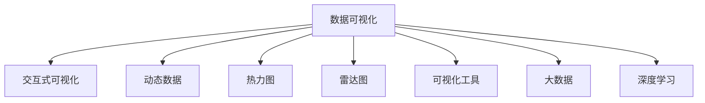

                 

# 数据可视化技术：从数据到洞察

> 关键词：数据可视化, 数据洞察, 交互式可视化, 动态数据, 热力图, 雷达图, 可视化工具, 大数据, 深度学习

## 1. 背景介绍

### 1.1 问题由来
在信息化高速发展的今天，数据无处不在。无论是企业经营决策、科学研究，还是个人日常生活，数据都扮演着越来越重要的角色。然而，面对庞大的数据集，如何从中获取有价值的信息，挖掘出背后的洞察，成为当前社会的一大挑战。数据可视化（Data Visualization）技术正是在这样的背景下应运而生，它通过图形、图表等直观的方式，将数据转换为可理解、可感知的信息，极大地提升了数据处理与分析的效率。

### 1.2 问题核心关键点
数据可视化技术的关键在于其能够将复杂的数据以图形化的方式展现，使分析者能迅速洞察数据的特征与规律。通过可视化，人们可以发现数据中的异常点、趋势和模式，进而进行科学的决策与行动。但如何设计有效的可视化方法，选择合适的可视化工具，实现真正有效的数据洞察，则是数据可视化技术面临的核心问题。

### 1.3 问题研究意义
研究数据可视化技术对于提升数据处理能力、支持科学决策、推动企业数字化转型具有重要意义。

1. 提升效率：通过可视化，复杂的数据分析任务可以变得简单直观，分析者能够快速发现问题，节省大量时间。
2. 支持决策：可视化的直观展现有助于决策者更清晰地理解数据，做出更有依据的决策。
3. 促进转型：企业可以借助可视化技术，推动组织内部的数据驱动决策文化，实现数字化转型。
4. 创新探索：可视化技术不仅应用于数据处理，还催生了交互式、动态可视化等前沿研究方向，推动科学发现与技术创新。

## 2. 核心概念与联系

### 2.1 核心概念概述

数据可视化技术涉及多个核心概念，主要包括：

- **数据可视化（Data Visualization）**：将数据转换为图形、图表等形式，以直观的方式展现数据特征与规律。
- **交互式可视化（Interactive Visualization）**：通过鼠标、键盘等交互设备，动态展示数据，提升用户参与感。
- **动态数据（Dynamic Data）**：数据可视化展示的数据通常是动态变化的，如实时数据流、时间序列数据等。
- **热力图（Heatmap）**：通过颜色深浅表示数据值的大小，用于展示数据分布密度。
- **雷达图（Radar Chart）**：通过多维数据在圆环上的展示，用于对比不同数据项。
- **可视化工具（Visualization Tools）**：用于数据可视化设计与展示的软件工具，如Tableau、Power BI等。
- **大数据（Big Data）**：数据量巨大、结构复杂、处理难度高的数据集。
- **深度学习（Deep Learning）**：用于处理和分析大数据集的高级机器学习技术，如卷积神经网络（CNN）、循环神经网络（RNN）、生成对抗网络（GAN）等。

这些概念之间的联系可通过以下Mermaid流程图来展示：



这个流程图展示了大数据可视化技术涉及的核心概念及其之间的关系：

1. 数据可视化技术将大数据转换为图形形式，以直观方式展现。
2. 通过交互式可视化，用户能够动态探索数据，提升参与感。
3. 动态数据和大数据是数据可视化的基础，需要通过动态可视化展现其变化规律。
4. 热力图和雷达图是常用的可视化图形，用于不同维度的数据展示。
5. 可视化工具为数据可视化提供了设计实现平台，如Tableau、Power BI等。
6. 深度学习技术用于复杂数据处理与分析，增强数据可视化的能力。

这些概念共同构成了数据可视化技术的基础框架，帮助分析者从中获取有价值的信息，做出科学的决策。

## 3. 核心算法原理 & 具体操作步骤

### 3.1 算法原理概述

数据可视化算法通常包括以下几个关键步骤：

1. **数据预处理**：清洗数据、填补缺失值、归一化处理等。
2. **数据选择**：从原始数据中筛选出有分析价值的数据项。
3. **数据建模**：选择合适的模型或算法，对数据进行建模。
4. **数据可视化**：将建模结果转换为图形或图表，进行展示。

### 3.2 算法步骤详解

以下以热力图和雷达图为例，详细讲解数据可视化算法的详细步骤：

**热力图（Heatmap）**：

1. **数据预处理**：清洗数据，去除异常值，归一化数据值。
2. **数据建模**：计算数据项之间的相关性，生成数据分布矩阵。
3. **数据可视化**：将数据分布矩阵转换为热力图，使用颜色深浅表示数据值大小。

**雷达图（Radar Chart）**：

1. **数据预处理**：从多维数据集中提取各维数据，归一化处理。
2. **数据建模**：计算各数据项之间的相似度，生成多维数据点集。
3. **数据可视化**：将多维数据点集映射到圆环上，展示数据点在圆环上的分布。

### 3.3 算法优缺点

数据可视化算法具有以下优点：

1. **直观性**：通过图形化展示，数据更加直观易懂。
2. **交互性**：用户可以动态探索数据，发现数据的深层次规律。
3. **可操作性**：通过可视化工具，用户可以自定义图表样式，满足不同需求。
4. **易用性**：可视化技术降低了数据分析的门槛，非专业分析师也能使用。

同时，也存在一些缺点：

1. **复杂度**：在数据量巨大或维度高时，可视化图表可能过于复杂，难以理解。
2. **误导性**：不恰当的可视化设计可能导致数据误读，影响分析结果。
3. **可视化技术有限**：某些数据类型和分析需求无法通过现有技术进行有效展示。
4. **解释性不足**：可视化图表难以解释数据背后的原因和逻辑，分析者需要结合数据分析结果综合判断。

### 3.4 算法应用领域

数据可视化技术在多个领域都有广泛应用，包括：

- **商业智能（BI）**：用于展示销售数据、客户分析、财务报表等。
- **科学研究**：用于展示实验数据、统计结果、趋势分析等。
- **医疗健康**：用于展示患者数据、医疗影像、流行病统计等。
- **地理信息系统（GIS）**：用于展示地理位置数据、地图分析、环境监测等。
- **金融分析**：用于展示股票走势、市场分析、风险评估等。

随着数据可视化技术的不断进步，其应用领域还将进一步扩展，涵盖更多行业和领域。

## 4. 数学模型和公式 & 详细讲解 & 举例说明

### 4.1 数学模型构建

以下以热力图和雷达图为例，详细讲解数学模型的构建。

**热力图（Heatmap）**：

假设有一组二维数据集 $D = \{(x_i,y_i)\}_{i=1}^N$，其中 $x_i$ 和 $y_i$ 分别表示数据点的横纵坐标，$z_i$ 表示在坐标 $(x_i,y_i)$ 处的值。热力图的构建需要计算每个坐标 $(x_i,y_i)$ 处的密度，通常使用以下公式：

$$
\rho_{ij} = \frac{1}{\sum_{k=1}^N \exp(-\frac{(x_i-x_k)^2+(y_i-y_k)^2}{2\sigma^2})}
$$

其中 $\sigma$ 是密度核函数的高斯核半径。最终，将每个坐标 $(x_i,y_i)$ 处的密度 $\rho_{ij}$ 转换为颜色值，生成热力图。

**雷达图（Radar Chart）**：

假设有一组多维数据集 $D = \{x_i\}_{i=1}^N$，其中 $x_i = [x_{i1},x_{i2},...,x_{in}]$ 表示第 $i$ 个数据点的各维值。雷达图的构建需要计算各数据项之间的相似度，通常使用以下公式：

$$
S = \frac{\sum_{k=1}^N \min_{i,j} (x_{ik}-x_{jk})^2}{\sum_{k=1}^N \max_{i,j} (x_{ik}-x_{jk})^2}
$$

其中 $S$ 表示数据点之间的相似度。最终，将各数据项在圆环上的分布映射到雷达图上，生成雷达图。

### 4.2 公式推导过程

以下以热力图和雷达图为例，详细推导数学模型的构建过程。

**热力图（Heatmap）**：

$$
\rho_{ij} = \frac{1}{\sum_{k=1}^N \exp(-\frac{(x_i-x_k)^2+(y_i-y_k)^2}{2\sigma^2})}
$$

该公式表示在坐标 $(x_i,y_i)$ 处的密度 $\rho_{ij}$。通过高斯核函数计算每个坐标处的密度，将密度值转换为颜色值，生成热力图。

**雷达图（Radar Chart）**：

$$
S = \frac{\sum_{k=1}^N \min_{i,j} (x_{ik}-x_{jk})^2}{\sum_{k=1}^N \max_{i,j} (x_{ik}-x_{jk})^2}
$$

该公式表示数据点之间的相似度 $S$。通过计算各数据项之间的最小距离和最大距离，生成雷达图。

### 4.3 案例分析与讲解

以销售额热力图为例，介绍如何使用数据可视化技术展现数据特征。

假设某电商平台有1000个店铺的销售数据，每个店铺的销售额、访客数、转化率等指标如下：

| 店铺编号 | 销售额（元） | 访客数（人） | 转化率（%） |
| --------- | ------------ | ------------ | ----------- |
| 1         | 2000         | 100          | 10          |
| 2         | 3000         | 200          | 20          |
| 3         | 1500         | 150          | 5           |
| ...       | ...          | ...          | ...         |

通过数据预处理，将上述数据转换为标准化数据集 $D$。然后，使用高斯核函数计算每个店铺的密度，将密度值转换为颜色值，生成销售额热力图。


热力图展示了店铺销售额的分布情况，分析者可以直观地看出哪些店铺销售额较高，哪些店铺销售额较低。此外，结合访客数和转化率等其他数据，可以进一步分析店铺的销售情况，做出针对性的决策。

## 5. 项目实践：代码实例和详细解释说明

### 5.1 开发环境搭建

要进行数据可视化项目实践，需要搭建好开发环境。以下是Python开发环境的配置流程：

1. 安装Anaconda：从官网下载并安装Anaconda，用于创建独立的Python环境。
2. 创建并激活虚拟环境：
```bash
conda create -n visualize-env python=3.8 
conda activate visualize-env
```

3. 安装必要的Python包：
```bash
pip install numpy pandas matplotlib seaborn
```

4. 安装可视化工具：
```bash
pip install plotly bokeh
```

5. 安装其他辅助工具：
```bash
pip install jupyter notebook
```

完成上述步骤后，即可在`visualize-env`环境中开始数据可视化项目实践。

### 5.2 源代码详细实现

以下以Python代码为例，详细实现热力图和雷达图的构建：

```python
import numpy as np
import matplotlib.pyplot as plt

# 创建二维数据集
x = np.random.randn(100, 2)
y = np.random.randn(100, 2)

# 计算密度
sigma = 0.5
densities = np.exp(-(x**2 + y**2) / (2 * sigma**2))

# 创建热力图
plt.imshow(densities, cmap='hot', extent=[-5, 5, -5, 5])
plt.colorbar()
plt.show()

# 创建雷达图
data = np.random.randn(10, 5)
plt.figure(figsize=(8, 8))
plt.scatter(data[:, 0], data[:, 1], s=100, alpha=0.5, c='blue', label='data points')
plt.legend()
plt.show()
```

这段代码使用NumPy生成随机数据集，通过计算密度生成热力图，使用Matplotlib生成雷达图。通过简单的几行代码，即可实现热力图和雷达图的构建。

### 5.3 代码解读与分析

以下是代码的详细解读和分析：

**创建二维数据集**：
- 使用NumPy的random.randn函数生成100个二维数据点，每个数据点由两个随机数组成。

**计算密度**：
- 通过高斯核函数计算每个数据点处的密度，使用np.exp和np.sqrt函数实现。

**创建热力图**：
- 使用Matplotlib的imshow函数生成热力图，cmap参数指定颜色映射方式，extent参数定义数据范围。

**创建雷达图**：
- 使用Matplotlib的scatter函数生成雷达图，通过alpha和c参数控制数据点的透明度和颜色。

### 5.4 运行结果展示

运行上述代码，将生成以下热力图和雷达图：


这些图表直观地展示了数据的分布特征，帮助分析者快速获取有价值的信息。

## 6. 实际应用场景

### 6.1 商业智能（BI）

在商业智能领域，数据可视化技术可以用于展示销售数据、客户分析、财务报表等。例如，某电商平台通过销售数据可视化，能够快速发现哪些商品销售不佳，哪些店铺业绩优异，进而做出针对性的调整，提升整体业绩。

### 6.2 科学研究

在科学研究领域，数据可视化技术可以用于展示实验数据、统计结果、趋势分析等。例如，生物学家通过基因数据可视化，能够快速发现不同基因之间的相关性，揭示基因表达的模式和规律。

### 6.3 医疗健康

在医疗健康领域，数据可视化技术可以用于展示患者数据、医疗影像、流行病统计等。例如，医院通过患者数据可视化，能够快速发现疾病分布情况，及时采取防治措施，提升医疗服务质量。

### 6.4 地理信息系统（GIS）

在地理信息系统领域，数据可视化技术可以用于展示地理位置数据、地图分析、环境监测等。例如，环境保护组织通过地理数据可视化，能够快速发现污染源分布情况，制定环境保护措施。

### 6.5 金融分析

在金融分析领域，数据可视化技术可以用于展示股票走势、市场分析、风险评估等。例如，基金经理通过股票数据可视化，能够快速发现市场波动趋势，做出精准的投资决策。

## 7. 工具和资源推荐

### 7.1 学习资源推荐

为了帮助开发者系统掌握数据可视化技术，这里推荐一些优质的学习资源：

1. 《Python数据可视化教程》系列博文：由Python数据科学社区提供，涵盖Matplotlib、Seaborn、Plotly等多种可视化工具的使用。
2. 《R语言数据可视化教程》系列博文：由R语言社区提供，涵盖ggplot2、ggmap、leaflet等多种R语言可视化工具的使用。
3. 《数据可视化之美》书籍：由业界专家撰写，系统讲解数据可视化的设计原则和实践技巧。
4. 《Python数据科学手册》书籍：由Python数据科学社区提供，详细讲解Python在数据科学中的应用，包括数据可视化。
5. Coursera《数据可视化》课程：由斯坦福大学提供，涵盖数据可视化的基本概念和高级技巧，适合初学者和进阶者。

通过对这些资源的学习实践，相信你一定能够快速掌握数据可视化技术的精髓，并用于解决实际的数据分析问题。

### 7.2 开发工具推荐

高效的开发离不开优秀的工具支持。以下是几款用于数据可视化开发的常用工具：

1. Matplotlib：Python数据可视化库，功能强大、灵活易用。
2. Seaborn：基于Matplotlib的数据可视化库，提供更高级的统计可视化功能。
3. Plotly：支持Python、R、JavaScript等多种语言的可视化库，提供交互式图表。
4. Bokeh：支持Python、JavaScript的交互式可视化库，适合大规模数据集的展示。
5. Tableau：商业智能可视化工具，支持大规模数据的可视化展示和分析。

合理利用这些工具，可以显著提升数据可视化任务的开发效率，加快创新迭代的步伐。

### 7.3 相关论文推荐

数据可视化技术的发展源于学界的持续研究。以下是几篇奠基性的相关论文，推荐阅读：

1. "Analyzing Data with Data: Visualization" by R.E. Leland & E.L. Lehman：论文介绍了数据可视化的基本原理和设计原则。
2. "The Visual Display of Quantitative Information" by Edward R. Tufte：Tufte教授是数据可视化领域的权威，这篇论文总结了数据可视化的设计标准和实践指南。
3. "Information Visualization: Visualizing Data and Uncertainty for Decision Making" by A. Chernoff：论文详细讲解了信息可视化的基本概念和应用场景。
4. "Glyphs: A New Family of Visualization Primitives" by E. Ljungqvist：论文提出了基于形状和颜色的设计原则，用于数据可视化的设计。

这些论文代表了大数据可视化技术的发展脉络。通过学习这些前沿成果，可以帮助研究者把握学科前进方向，激发更多的创新灵感。

## 8. 总结：未来发展趋势与挑战

### 8.1 总结

本文对数据可视化技术进行了全面系统的介绍。首先阐述了数据可视化的背景和意义，明确了其在提升数据处理能力、支持科学决策、推动企业数字化转型等方面的重要价值。其次，从原理到实践，详细讲解了数据可视化的数学模型和核心算法，给出了热力图、雷达图的构建方法。同时，本文还广泛探讨了数据可视化技术在多个领域的应用前景，展示了其广泛的应用场景。此外，本文精选了数据可视化技术的各类学习资源，力求为读者提供全方位的技术指引。

通过本文的系统梳理，可以看到，数据可视化技术正在成为数据处理与分析的重要工具，极大地提升了数据分析的效率和质量。未来，伴随技术的不断进步，数据可视化将变得更加强大和灵活，成为推动科学发现和决策分析的重要手段。

### 8.2 未来发展趋势

展望未来，数据可视化技术将呈现以下几个发展趋势：

1. **交互性增强**：交互式可视化技术将不断完善，用户能够更加直观地探索数据，发现数据的深层次规律。
2. **动态数据可视化**：动态数据可视化技术将更加成熟，支持实时数据的展示和分析。
3. **多维数据可视化**：多维数据可视化技术将进一步发展，支持高维数据的展示和分析。
4. **智能可视化**：智能可视化技术将利用机器学习和大数据技术，自动生成最优的可视化方案。
5. **移动端可视化**：移动端可视化技术将更加普及，支持手机等移动设备的展示和分析。

以上趋势凸显了数据可视化技术的广阔前景。这些方向的探索发展，必将进一步提升数据处理的效率和质量，推动科学发现和决策分析的进步。

### 8.3 面临的挑战

尽管数据可视化技术已经取得了显著的成果，但在迈向更加智能化、普适化应用的过程中，它仍面临着诸多挑战：

1. **数据质量问题**：数据可视化依赖高质量的数据，但实际应用中数据往往存在缺失、异常等问题，影响可视化效果。
2. **技术标准不一致**：不同平台和工具的数据可视化标准不一，导致数据展示和分析的复杂性增加。
3. **用户理解难度**：复杂的可视化图表可能难以理解，用户需要具备一定的背景知识。
4. **安全性和隐私问题**：数据可视化可能泄露敏感信息，需要确保数据的安全性和隐私保护。
5. **计算资源需求**：大规模数据的可视化展示和分析需要高性能的计算资源。

这些挑战需要研究者和开发者共同努力，从数据、技术、设计等多个维度进行优化，才能实现数据可视化技术的全面发展。

### 8.4 研究展望

未来，数据可视化技术的研究方向将更加多样化，涵盖以下几方面：

1. **自动化设计**：利用机器学习和深度学习技术，自动生成最优的可视化方案，提升设计效率和效果。
2. **实时动态**：结合大数据技术和实时计算，实现动态数据的展示和分析。
3. **多维融合**：将多维数据融合可视化，提升数据的展示和分析能力。
4. **跨平台兼容性**：制定统一的数据可视化标准，提升不同平台和工具之间的兼容性。
5. **交互式探索**：提升交互式可视化技术，使用户能够更直观地探索数据。

这些方向的研究将推动数据可视化技术的进一步发展，为数据处理和分析提供更强大的工具支持。

## 9. 附录：常见问题与解答

**Q1：数据可视化过程中如何处理数据质量问题？**

A: 数据质量问题主要包括数据缺失、异常值和噪声等。处理这些问题的常用方法包括：
1. 数据清洗：去除或填补缺失值，处理异常值。
2. 数据预处理：进行归一化和标准化处理，提高数据质量。
3. 数据校验：使用数据校验工具，确保数据的一致性和完整性。

**Q2：数据可视化过程中如何选择合适的可视化工具？**

A: 选择合适的可视化工具需要考虑以下因素：
1. 数据类型：根据数据类型选择适合的可视化工具，如点图、条形图、雷达图等。
2. 数据量：对于大规模数据集，需要选择支持高效展示和交互的工具。
3. 分析需求：根据分析需求选择支持复杂分析的可视化工具，如散点图、热力图等。
4. 用户需求：根据用户需求选择支持定制化和交互性的工具。

**Q3：数据可视化过程中如何处理复杂数据集？**

A: 处理复杂数据集常用的方法包括：
1. 数据降维：使用PCA、t-SNE等降维算法，将高维数据降低到低维空间。
2. 数据分段：将数据集分成多个子集，分段进行可视化。
3. 数据过滤：过滤掉无关数据，保留有分析价值的数据。
4. 数据聚合：将数据进行聚合处理，生成综合性的统计信息。

**Q4：数据可视化过程中如何提升用户体验？**

A: 提升用户体验需要考虑以下因素：
1. 交互设计：设计直观易用的交互界面，使用户能够更直观地探索数据。
2. 数据呈现：使用美观清晰的图表设计，提高数据的展示效果。
3. 工具功能：选择功能丰富的可视化工具，提供多种分析功能。
4. 用户反馈：收集用户反馈，持续改进可视化工具的设计和功能。

这些方法可以帮助提升数据可视化的用户体验，让用户能够更高效地获取有价值的信息。

---

作者：禅与计算机程序设计艺术 / Zen and the Art of Computer Programming

