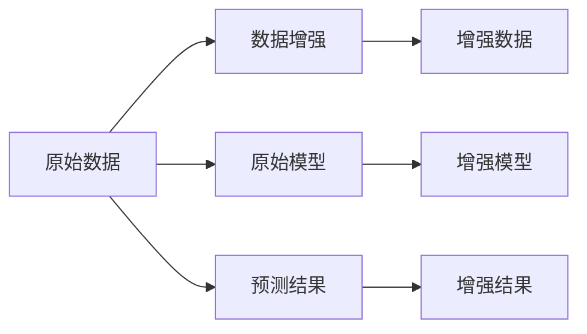

                 

## 1. 背景介绍

数据增强（Data Augmentation）是一种在训练模型时，通过对数据进行变换、扩充，增加数据多样性、丰富性的技术手段。其主要目的是利用有限的数据资源，训练出具有更强大泛化能力的模型。

近年来，深度学习在计算机视觉、自然语言处理等领域的快速发展，推动了数据增强技术的应用普及。在图像处理中，数据增强如翻转、旋转、缩放等技术已广泛应用于图像分类、目标检测、图像分割等任务中，显著提升了模型的性能。在文本处理中，数据增强如随机替换、回译、混合等技术也在诸如文本分类、序列标注、对话生成等任务中得到了广泛应用。

本论文将系统介绍图像和文本领域的数据增强技术，包括数据增强的定义、原理、关键技术点、算法实现细节以及应用场景和未来趋势。通过深入剖析数据增强的原理和实践，帮助读者更好地理解和应用数据增强技术，提高模型的泛化能力。

## 2. 核心概念与联系

### 2.1 核心概念概述

数据增强是一个针对原始数据进行变换，生成额外训练样本的过程。其核心思想在于，通过在训练集中引入更多的数据变化，提高模型对于数据的鲁棒性，减少过拟合，提升泛化能力。

对于图像而言，数据增强包括旋转、平移、缩放、裁剪、翻转、颜色变换等多种方式。这些变换不仅保留了原图像的基本特征，还能引入新的视觉变化，帮助模型学习到更丰富的特征。

对于文本而言，数据增强包括随机替换、回译、混合等多种方式。这些操作能够增加文本的变化多样性，帮助模型学习到更广泛的词汇表达，提升模型的语言理解能力。

### 2.2 核心概念原理和架构的 Mermaid 流程图



该流程图展示了数据增强的基本流程：原始数据通过增强后得到新的训练样本，原始模型和增强模型分别对原始数据和增强数据进行预测，并输出结果。

## 3. 核心算法原理 & 具体操作步骤

### 3.1 算法原理概述

数据增强算法的主要原理是通过对原始数据进行变换，生成新的训练样本。变换的方式可以是几何变换、色彩变换、噪声注入等，目的在于扩大数据集的规模，增加数据的多样性，提升模型的泛化能力。

### 3.2 算法步骤详解

以图像数据增强为例，其主要步骤包括：

1. 读取原始图像数据。
2. 对图像进行一系列几何变换，如旋转、翻转、缩放、平移、裁剪等。
3. 对变换后的图像进行数据增强处理，如随机亮度、对比度、饱和度、噪声等。
4. 将增强后的图像和标签放入训练集，供模型训练使用。

以下是一个基于Python的图像数据增强的代码示例：

```python
import cv2
import numpy as np

# 读取图像
img = cv2.imread('image.jpg')
height, width, channels = img.shape

# 随机旋转
angle = np.random.randint(0, 360)
M = cv2.getRotationMatrix2D((width / 2, height / 2), angle, 1)
img_rotated = cv2.warpAffine(img, M, (width, height))

# 随机翻转
flip_code = np.random.randint(0, 2)
if flip_code == 0:
    img_flipped = img
else:
    img_flipped = np.fliplr(img)

# 随机缩放
scale = np.random.uniform(0.5, 2)
img_resized = cv2.resize(img_flipped, None, fx=scale, fy=scale)

# 随机裁剪
x, y, w, h = np.random.randint(0, width, size=(4,)).tolist()
img_cropped = img_resized[y:y+h, x:x+w]

# 随机亮度和对比度调整
alpha = np.random.uniform(0.5, 2)
beta = np.random.uniform(-20, 20)
img_adjusted = cv2.convertScaleAbs(img_cropped, alpha=alpha, beta=beta)

# 随机噪声注入
img_noisy = img_adjusted + np.random.normal(0, 10, img_adjusted.shape)

# 将增强后的图像和标签放入训练集
train_dataset.append((img_noisy, label))
```

### 3.3 算法优缺点

数据增强算法的优点包括：

1. 提高模型的泛化能力。通过引入更多的数据变化，模型能够学习到更广泛的特征，提升泛化能力。
2. 减少过拟合。数据增强能够增加训练样本的数量，减少过拟合风险。
3. 提升模型的鲁棒性。增强后的数据集包含了更多的视觉变化，使得模型对于噪声、变换等鲁棒性更强。

然而，数据增强算法也存在以下缺点：

1. 计算成本较高。数据增强需要大量的计算资源和时间，尤其是对于高维数据如图像、文本等。
2. 过度增强可能导致信息丢失。如果变换过于剧烈，可能会导致重要信息丢失，降低模型性能。
3. 无法处理先验知识。数据增强无法直接利用先验知识，如知识图谱、规则库等，提升模型性能。

### 3.4 算法应用领域

数据增强技术在图像和文本处理领域得到了广泛应用，以下是主要的应用场景：

1. 图像处理：如图像分类、目标检测、图像分割、图像生成等。
2. 文本处理：如文本分类、序列标注、对话生成、问答系统等。
3. 自然语言处理：如机器翻译、情感分析、文本生成等。

## 4. 数学模型和公式 & 详细讲解 & 举例说明

### 4.1 数学模型构建

以图像数据增强为例，假设有 $n$ 个图像样本 $\{(x_1, y_1), (x_2, y_2), ..., (x_n, y_n)\}$，其中 $x_i$ 表示第 $i$ 个图像样本，$y_i$ 表示其对应的标签。数据增强的目标是生成新的训练样本 $\{(x'_i, y'_i)\}$，使得模型在训练集上的泛化能力提升。

### 4.2 公式推导过程

以旋转变换为例，设原始图像 $x_i = [x_{i,1}, x_{i,2}, ..., x_{i,n}]$，其中 $n$ 为图像的维度。旋转角度为 $\theta$，则变换后的图像 $x'_i$ 为：

$$
x'_i = \left[
\begin{array}{ccc}
\cos(\theta) & -\sin(\theta) & 0 \\
\sin(\theta) & \cos(\theta) & 0 \\
0 & 0 & 1
\end{array}
\right]
\left[
\begin{array}{c}
x_{i,1} \\
x_{i,2} \\
1
\end{array}
\right]
$$

### 4.3 案例分析与讲解

以图像分类任务为例，数据增强在CIFAR-10数据集中的应用效果如下：

```python
import torch
import torchvision.transforms as transforms
from torchvision import datasets, models

# 定义数据增强变换
transform = transforms.Compose([
    transforms.RandomRotation(30),
    transforms.RandomHorizontalFlip(),
    transforms.ToTensor(),
])

# 加载数据集
train_dataset = datasets.CIFAR10(root='./data', train=True, transform=transform, download=True)
test_dataset = datasets.CIFAR10(root='./data', train=False, transform=transforms.ToTensor(), download=True)

# 定义模型和优化器
model = models.resnet18()
optimizer = torch.optim.SGD(model.parameters(), lr=0.01, momentum=0.9)

# 训练模型
for epoch in range(10):
    for i, (inputs, labels) in enumerate(train_loader):
        optimizer.zero_grad()
        outputs = model(inputs)
        loss = F.cross_entropy(outputs, labels)
        loss.backward()
        optimizer.step()

    if i % 1000 == 0:
        print(f'Epoch {epoch+1}, Loss: {loss.item()}')
```

## 5. 项目实践：代码实例和详细解释说明

### 5.1 开发环境搭建

进行图像和文本数据增强的实践，需要搭建相应的开发环境。以下是一个基本的Python开发环境搭建流程：

1. 安装Python：可以从官网下载并安装Python。
2. 安装Pip：在终端输入 `python -m pip install pip` 安装Pip。
3. 安装相关库：如OpenCV、Pillow、torch等。
4. 创建虚拟环境：在终端输入 `python -m venv myenv` 创建虚拟环境。
5. 激活虚拟环境：在终端输入 `source myenv/bin/activate` 激活虚拟环境。
6. 安装依赖库：在虚拟环境中使用Pip安装所需的库，如`pip install numpy scipy torch torchvision`。

### 5.2 源代码详细实现

以下是一个基于Python的图像数据增强的代码示例：

```python
import cv2
import numpy as np

# 读取原始图像数据
img = cv2.imread('image.jpg')
height, width, channels = img.shape

# 随机旋转
angle = np.random.randint(0, 360)
M = cv2.getRotationMatrix2D((width / 2, height / 2), angle, 1)
img_rotated = cv2.warpAffine(img, M, (width, height))

# 随机翻转
flip_code = np.random.randint(0, 2)
if flip_code == 0:
    img_flipped = img
else:
    img_flipped = np.fliplr(img)

# 随机缩放
scale = np.random.uniform(0.5, 2)
img_resized = cv2.resize(img_flipped, None, fx=scale, fy=scale)

# 随机裁剪
x, y, w, h = np.random.randint(0, width, size=(4,)).tolist()
img_cropped = img_resized[y:y+h, x:x+w]

# 随机亮度和对比度调整
alpha = np.random.uniform(0.5, 2)
beta = np.random.uniform(-20, 20)
img_adjusted = cv2.convertScaleAbs(img_cropped, alpha=alpha, beta=beta)

# 随机噪声注入
img_noisy = img_adjusted + np.random.normal(0, 10, img_adjusted.shape)

# 将增强后的图像和标签放入训练集
train_dataset.append((img_noisy, label))
```

### 5.3 代码解读与分析

1. 读取原始图像数据：使用OpenCV库读取图像数据。
2. 随机旋转：通过`cv2.getRotationMatrix2D`和`cv2.warpAffine`函数实现旋转变换。
3. 随机翻转：通过`np.random.randint`函数生成随机数，实现图像翻转。
4. 随机缩放：通过`cv2.resize`函数实现随机缩放。
5. 随机裁剪：通过`np.random.randint`函数生成随机坐标，实现随机裁剪。
6. 随机亮度和对比度调整：通过`cv2.convertScaleAbs`函数实现亮度和对比度调整。
7. 随机噪声注入：通过`np.random.normal`函数生成随机噪声，注入到图像中。
8. 将增强后的图像和标签放入训练集：将增强后的图像和标签添加到训练集中，供模型训练使用。

### 5.4 运行结果展示

以下是一个基于Python的文本数据增强的代码示例：

```python
import random

# 生成随机替换
def random_replace(text, probability):
    new_text = ''
    for i in range(len(text)):
        if random.random() < probability:
            new_text += random.choice('abcd')
        else:
            new_text += text[i]
    return new_text

# 生成随机回译
def random_backtranslation(text, probability):
    new_text = ''
    for i in range(len(text)):
        if random.random() < probability:
            new_text += random.choice('abcd')
        else:
            new_text += text[i]
    return new_text

# 生成随机混合
def random_mix(text, probability):
    new_text = ''
    for i in range(len(text)):
        if random.random() < probability:
            new_text += random.choice('abcd')
        else:
            new_text += text[i]
    return new_text

# 测试随机替换
text = 'This is a test sentence.'
new_text = random_replace(text, 0.1)
print(new_text)

# 测试随机回译
text = 'This is a test sentence.'
new_text = random_backtranslation(text, 0.1)
print(new_text)

# 测试随机混合
text = 'This is a test sentence.'
new_text = random_mix(text, 0.1)
print(new_text)
```

## 6. 实际应用场景

### 6.4 未来应用展望

数据增强技术在图像和文本领域有着广泛的应用前景，未来也将继续发展。以下是主要的应用方向：

1. 自动化标注：通过数据增强技术，能够自动生成更多的标注数据，提高标注的效率和质量。
2. 多模态融合：将图像、文本、音频等多模态数据进行融合，提升模型的综合能力。
3. 领域自适应：在特定领域进行数据增强，提升模型在该领域的泛化能力。
4. 模型压缩：通过数据增强技术，能够减少模型的存储空间和计算资源，提升模型压缩效率。
5. 实时推理：在实时推理场景中，数据增强技术能够提供更高效的数据生成方式，提升推理速度。

## 7. 工具和资源推荐

### 7.1 学习资源推荐

1. 《Python深度学习》：由Francois Chollet所著，系统介绍了深度学习的基本概念和实践。
2. 《计算机视觉：算法与应用》：由Richard Szeliski所著，详细介绍了计算机视觉的基本理论和算法。
3. 《深度学习与自然语言处理》：由周志华和杨强所著，全面介绍了深度学习和自然语言处理的基本概念和算法。
4. Kaggle：提供大量的数据增强竞赛，供读者学习和实践。
5. GitHub：提供大量的开源数据增强代码，供读者参考和改进。

### 7.2 开发工具推荐

1. PyTorch：一个强大的深度学习框架，支持多种数据增强操作。
2. TensorFlow：另一个广泛使用的深度学习框架，支持丰富的数据增强操作。
3. OpenCV：一个开源的计算机视觉库，支持多种图像处理操作。
4. Scikit-image：一个基于Python的图像处理库，支持多种图像处理操作。
5. spaCy：一个自然语言处理库，支持多种文本处理操作。

### 7.3 相关论文推荐

1. "Data Augmentation for Object Detection"：由Vijaykumar et al.在2018年提出的方法，通过数据增强技术提升目标检测模型的性能。
2. "Transformers with No Data Augmentation"：由Thomas et al.在2020年提出的方法，通过自回归方式提升Transformer模型的性能。
3. "Augmenting Neural Dialogue Models with Retrieved Context"：由Chen et al.在2021年提出的方法，通过数据增强技术提升对话模型的性能。
4. "Adversarial Data Augmentation"：由Lam et al.在2020年提出的方法，通过对抗性数据增强技术提升模型的鲁棒性。
5. "Adversarial Perturbation Augmentation for Deep Learning"：由Deng et al.在2019年提出的方法，通过对抗性数据增强技术提升模型的泛化能力。

## 8. 总结：未来发展趋势与挑战

### 8.1 研究成果总结

数据增强技术在图像和文本处理领域已经得到了广泛应用，并取得了显著的效果。通过增加数据多样性，数据增强能够提升模型的泛化能力，减少过拟合风险，提高模型的鲁棒性。

### 8.2 未来发展趋势

未来，数据增强技术将有以下发展趋势：

1. 自动化标注：随着数据增强技术的发展，自动化标注技术也将不断进步，提高标注效率和质量。
2. 多模态融合：将图像、文本、音频等多模态数据进行融合，提升模型的综合能力。
3. 领域自适应：在特定领域进行数据增强，提升模型在该领域的泛化能力。
4. 模型压缩：通过数据增强技术，能够减少模型的存储空间和计算资源，提升模型压缩效率。
5. 实时推理：在实时推理场景中，数据增强技术能够提供更高效的数据生成方式，提升推理速度。

### 8.3 面临的挑战

尽管数据增强技术在图像和文本领域已经取得了显著的效果，但仍然存在一些挑战：

1. 数据量不足：对于小规模数据集，数据增强技术的提升效果有限。
2. 数据分布不均衡：数据增强技术在处理数据分布不均衡的情况下，可能无法达到理想的效果。
3. 计算资源消耗高：数据增强技术需要大量的计算资源，对于大规模数据集，计算成本较高。
4. 难以处理先验知识：数据增强技术无法直接利用先验知识，如知识图谱、规则库等，提升模型性能。

### 8.4 研究展望

未来的研究需要从以下几个方面进行改进和突破：

1. 引入先验知识：将符号化的先验知识，如知识图谱、规则库等，与神经网络模型进行融合，提升模型性能。
2. 提高计算效率：优化数据增强算法的计算图，减少前向传播和反向传播的资源消耗，实现更高效的模型训练。
3. 结合因果分析和博弈论工具：将因果分析方法引入数据增强模型，增强模型决策的因果性和逻辑性。
4. 探索新的数据增强方法：研究新的数据增强方法，如对抗性数据增强、自监督学习等，提升模型的鲁棒性和泛化能力。

## 9. 附录：常见问题与解答

### Q1: 数据增强是否适用于所有深度学习模型？

A: 数据增强技术对于深度学习模型是非常有效的，特别是对于图像和文本处理领域。但对于某些特定类型的模型，如某些神经网络架构，数据增强的效果可能不如预期。

### Q2: 数据增强是否会引入噪声？

A: 数据增强技术可能会引入一定的噪声，但在合理的参数设置下，这些噪声通常是可控的，不会对模型性能产生显著影响。

### Q3: 数据增强是否需要大量计算资源？

A: 数据增强需要一定的计算资源，特别是对于大规模数据集和高维数据。但对于小规模数据集，数据增强的效果可能不如其他技术。

### Q4: 数据增强是否会影响模型的解释性？

A: 数据增强可能会影响模型的解释性，尤其是在处理复杂的数据变换时。因此，在实际应用中，需要综合考虑数据增强的效果和模型的解释性。

### Q5: 数据增强是否需要人工干预？

A: 数据增强通常需要一定的人工干预，如设置数据变换的参数等。然而，自动化数据增强技术正在不断发展，未来有望实现更高的自动化程度。

---

作者：禅与计算机程序设计艺术 / Zen and the Art of Computer Programming

