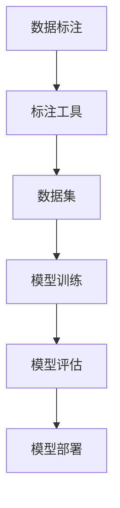

                 

# 数据标注：人工智能背后的无名英雄

数据标注，是人工智能（AI）系统中至关重要的环节，但常常被忽略甚至误解为简单的工作。然而，它却是实现AI应用的前提和基础，与机器学习模型的性能密切相关。本文将深入探讨数据标注在AI系统中的核心作用、具体流程、技术挑战以及未来发展方向，揭示数据标注背后的无名英雄，为业内从业者提供参考。

## 1. 背景介绍

### 1.1 问题由来
随着AI技术在医疗、金融、制造等多个领域的应用日益广泛，数据标注的重要性愈发凸显。然而，数据标注工作往往被视为枯燥乏味的低技能劳动，缺乏足够的重视和投入。数据标注的准确性和一致性直接决定了AI模型的效果，任何细节的疏漏都可能严重影响最终结果，但这一环节却常常被忽视。

### 1.2 问题核心关键点
数据标注的核心在于获取高质量的、经过人工验证的训练数据集，作为模型训练的“原料”。其关键点包括：
- 数据准确性：确保数据标注与真实世界的匹配度，减少误标注带来的干扰。
- 数据多样性：涵盖不同场景、边缘情况下的数据，增强模型的泛化能力。
- 数据一致性：标注标准和规则的统一，避免不同标注者之间的分歧。
- 数据隐私：保证数据隐私和安全，避免敏感信息泄露。
- 标注效率：在保证质量的前提下，尽可能提升标注速度，降低成本。

### 1.3 问题研究意义
深入研究数据标注的原理与实践，有助于提升AI系统的整体性能和可靠性，增强其在实际场景中的应用效果。通过理解数据标注的重要性与挑战，可以指导业内从业者提升标注质量，加速AI技术在各个领域的应用落地。

## 2. 核心概念与联系

### 2.1 核心概念概述

为更好地理解数据标注在AI系统中的核心作用，本文将介绍几个密切相关的核心概念：

- **数据标注（Data Annotation）**：指对原始数据集进行人工处理，为其打上标记或标签的过程。标签通常是二元或多元分类、回归或序列标注等形式。
- **标注工具（Annotation Tools）**：用于数据标注的软件工具，支持对数据进行高效、一致、准确地标注。
- **数据集（Dataset）**：标注后得到的带有标签的数据集合，用于模型训练和测试。
- **模型训练（Model Training）**：使用标注数据集训练AI模型，以获取能够正确预测新数据的模型。
- **模型评估（Model Evaluation）**：在测试数据集上评估模型性能，确保其在真实场景中的表现。
- **模型部署（Model Deployment）**：将训练好的模型应用到实际生产环境中，进行预测或推理。

这些概念之间的逻辑关系可以通过以下Mermaid流程图来展示：



这个流程图展示了一体化的数据标注流程，从数据标注开始，到模型部署结束，揭示了数据标注在AI系统中的核心作用。

## 3. 核心算法原理 & 具体操作步骤

### 3.1 算法原理概述

数据标注的原理基于人工辅助机器学习的思想，其核心在于将人工标注与机器学习算法结合起来，提升数据集的质量和数量，从而增强AI模型的性能。具体来说，数据标注分为以下几个步骤：

1. **数据收集**：获取原始数据集，如图片、文本、音频等。
2. **数据清洗**：对数据进行去噪、去重、格式转换等预处理，确保数据质量。
3. **数据标注**：通过标注工具对数据集进行人工标注，生成带有标签的数据集。
4. **模型训练**：使用标注后的数据集训练AI模型。
5. **模型评估**：在测试数据集上评估模型性能，优化模型参数。
6. **模型部署**：将训练好的模型部署到实际应用环境中。

### 3.2 算法步骤详解

数据标注的具体操作步骤如下：

**Step 1: 数据收集**
- 从多个来源收集数据，确保数据的多样性和代表性。
- 数据格式可能包括图片、文本、音频、视频等，不同类型的数据需要不同的标注方法。

**Step 2: 数据清洗**
- 对数据进行去噪、去重、格式转换等预处理，确保数据质量。
- 处理缺失值、异常值，去除不规范的数据格式。
- 数据增强技术如旋转、裁剪、缩放、添加噪声等，增加数据多样性。

**Step 3: 数据标注**
- 选择合适的标注工具，如LabelImg、VGG Image Annotator等。
- 制定详细的标注标准和规则，确保标注一致性。
- 对标注人员进行培训，确保标注质量和效率。
- 使用众包平台如Amazon Mechanical Turk、CrowdFlower等，外包标注任务。

**Step 4: 模型训练**
- 选择合适的AI模型，如卷积神经网络、循环神经网络、Transformer等。
- 设计合适的模型架构和损失函数。
- 使用标注后的数据集进行模型训练，调整模型参数。

**Step 5: 模型评估**
- 在测试数据集上评估模型性能，常用的指标包括准确率、召回率、F1分数等。
- 使用交叉验证、混淆矩阵等技术评估模型性能。
- 根据评估结果优化模型参数，进行迭代训练。

**Step 6: 模型部署**
- 将训练好的模型部署到实际应用环境中，如Web应用、移动应用、嵌入式系统等。
- 优化模型性能，提升推理速度，确保模型可解释性。
- 集成监控和告警机制，确保模型在生产环境中的稳定性。

### 3.3 算法优缺点

数据标注的优势在于其灵活性和多样性，通过人工标注能够覆盖各种复杂场景，提升模型性能。其主要缺点包括：

- **高成本**：人工标注需要大量的人力和时间，成本较高。
- **低效率**：手工标注速度较慢，难以满足大规模数据集的需求。
- **主观性**：标注结果受标注者主观影响，可能存在偏见或误差。
- **依赖标注质量**：标注质量直接影响模型效果，需要保证标注准确性。
- **隐私问题**：标注过程中涉及敏感信息，需要特别注意数据隐私和保护。

尽管存在这些缺点，但数据标注仍是AI系统中不可或缺的一部分，必须与机器学习算法相结合，才能充分发挥其在AI系统中的作用。

### 3.4 算法应用领域

数据标注在AI系统的各个领域都有广泛的应用，例如：

- **计算机视觉**：图片分类、目标检测、图像分割等任务，需要大量带有标签的图像数据。
- **自然语言处理**：文本分类、命名实体识别、情感分析等任务，需要大量带标签的文本数据。
- **语音识别**：语音识别、语音情感分析等任务，需要大量带有标签的音频数据。
- **生物信息学**：基因序列分析、蛋白质结构预测等任务，需要大量带有标签的生物数据。
- **智能制造**：质量检测、设备维护等任务，需要大量带有标签的工业数据。

这些领域的数据标注工作，是AI系统成功应用的基础，为AI模型提供高质量的数据支撑。

## 4. 数学模型和公式 & 详细讲解  
### 4.1 数学模型构建

在数据标注中，我们通常使用机器学习算法进行模型训练，以提升标注数据的泛化能力和准确性。常用的算法包括卷积神经网络（CNN）、循环神经网络（RNN）、Transformer等。以下以卷积神经网络为例，介绍数据标注的数学模型构建。

假设数据集为 $D=\{(x_i, y_i)\}_{i=1}^N$，其中 $x_i$ 为输入数据，$y_i$ 为标签，通常为二元或多元分类、回归或序列标注形式。我们使用卷积神经网络对数据进行标注，构建损失函数 $\mathcal{L}(\theta)$，其中 $\theta$ 为网络参数。损失函数通常采用交叉熵损失函数，其公式为：

$$
\mathcal{L}(\theta) = -\frac{1}{N}\sum_{i=1}^N \sum_{k=1}^K y_{ik} \log P_{ik}
$$

其中 $P_{ik} = \text{softmax}(f_{ik}(\theta))$ 为模型预测的输出概率，$f_{ik}$ 为神经网络的第 $i$ 个样本的第 $k$ 个分类的输出。$y_{ik}$ 为标签的真实值，$K$ 为分类数。

### 4.2 公式推导过程

在卷积神经网络中，损失函数 $\mathcal{L}(\theta)$ 的梯度计算过程如下：

1. **前向传播**：计算神经网络的输出 $P_{ik}$。
2. **损失计算**：将 $P_{ik}$ 和 $y_{ik}$ 代入损失函数，计算损失值。
3. **反向传播**：计算损失函数对网络参数 $\theta$ 的梯度，通过链式法则进行推导。

具体推导过程如下：

$$
\frac{\partial \mathcal{L}(\theta)}{\partial P_{ik}} = -\frac{1}{N} \sum_{i=1}^N y_{ik} - P_{ik}
$$

$$
\frac{\partial \mathcal{L}(\theta)}{\partial f_{ik}} = \frac{\partial P_{ik}}{\partial f_{ik}} \frac{\partial \mathcal{L}(\theta)}{\partial P_{ik}}
$$

$$
\frac{\partial \mathcal{L}(\theta)}{\partial w_l^k} = \frac{\partial P_{ik}}{\partial f_{ik}} \frac{\partial f_{ik}}{\partial w_l^k} \frac{\partial \mathcal{L}(\theta)}{\partial P_{ik}}
$$

其中 $w_l^k$ 为神经网络的第 $l$ 层第 $k$ 个卷积核的权重，$f_{ik}$ 为该层的输出，$P_{ik}$ 为预测输出。

### 4.3 案例分析与讲解

以计算机视觉中的图像分类任务为例，我们通过数据标注和模型训练，提升图像分类的准确性。具体步骤如下：

1. **数据准备**：收集标注后的图像数据集，其中每个图像都有其对应的类别标签。
2. **模型设计**：设计卷积神经网络模型，如LeNet、AlexNet、VGG等。
3. **模型训练**：将图像数据集输入模型，使用交叉熵损失函数进行训练。
4. **模型评估**：在测试数据集上评估模型性能，使用准确率、召回率、F1分数等指标进行衡量。
5. **模型优化**：根据评估结果，调整模型参数，进行迭代训练。

在实践中，数据标注的准确性和一致性直接影响模型训练的效果。通过合理选择标注工具和标准，严格培训标注人员，可以显著提升标注质量，从而增强模型的泛化能力和准确性。

## 5. 项目实践：代码实例和详细解释说明
### 5.1 开发环境搭建

在进行数据标注项目实践前，我们需要准备好开发环境。以下是使用Python进行PyTorch开发的环境配置流程：

1. 安装Anaconda：从官网下载并安装Anaconda，用于创建独立的Python环境。

2. 创建并激活虚拟环境：
```bash
conda create -n pytorch-env python=3.8 
conda activate pytorch-env
```

3. 安装PyTorch：根据CUDA版本，从官网获取对应的安装命令。例如：
```bash
conda install pytorch torchvision torchaudio cudatoolkit=11.1 -c pytorch -c conda-forge
```

4. 安装Transformers库：
```bash
pip install transformers
```

5. 安装各类工具包：
```bash
pip install numpy pandas scikit-learn matplotlib tqdm jupyter notebook ipython
```

完成上述步骤后，即可在`pytorch-env`环境中开始数据标注实践。

### 5.2 源代码详细实现

下面我们以图像分类任务为例，给出使用Transformers库进行数据标注的PyTorch代码实现。

首先，定义图像分类任务的数据处理函数：

```python
from transformers import BertTokenizer
from torch.utils.data import Dataset
import torch

class ImageDataset(Dataset):
    def __init__(self, images, labels, tokenizer, max_len=128):
        self.images = images
        self.labels = labels
        self.tokenizer = tokenizer
        self.max_len = max_len
        
    def __len__(self):
        return len(self.images)
    
    def __getitem__(self, item):
        image = self.images[item]
        label = self.labels[item]
        
        # 对图像进行预处理，转换为张量形式
        image = self.tokenizer(image, return_tensors='pt', max_length=self.max_len, padding='max_length', truncation=True)
        input_ids = image['input_ids'][0]
        attention_mask = image['attention_mask'][0]
        
        # 对标签进行编码
        encoded_label = torch.tensor([label], dtype=torch.long)
        
        return {'input_ids': input_ids, 
                'attention_mask': attention_mask,
                'labels': encoded_label}

# 标签编码
label2id = {'cat': 0, 'dog': 1, 'bird': 2, 'fish': 3}
id2label = {v: k for k, v in label2id.items()}

# 创建dataset
tokenizer = BertTokenizer.from_pretrained('bert-base-cased')

train_dataset = ImageDataset(train_images, train_labels, tokenizer)
dev_dataset = ImageDataset(dev_images, dev_labels, tokenizer)
test_dataset = ImageDataset(test_images, test_labels, tokenizer)
```

然后，定义模型和优化器：

```python
from transformers import BertForTokenClassification, AdamW

model = BertForTokenClassification.from_pretrained('bert-base-cased', num_labels=len(label2id))

optimizer = AdamW(model.parameters(), lr=2e-5)
```

接着，定义训练和评估函数：

```python
from torch.utils.data import DataLoader
from tqdm import tqdm
from sklearn.metrics import classification_report

device = torch.device('cuda') if torch.cuda.is_available() else torch.device('cpu')
model.to(device)

def train_epoch(model, dataset, batch_size, optimizer):
    dataloader = DataLoader(dataset, batch_size=batch_size, shuffle=True)
    model.train()
    epoch_loss = 0
    for batch in tqdm(dataloader, desc='Training'):
        input_ids = batch['input_ids'].to(device)
        attention_mask = batch['attention_mask'].to(device)
        labels = batch['labels'].to(device)
        model.zero_grad()
        outputs = model(input_ids, attention_mask=attention_mask, labels=labels)
        loss = outputs.loss
        epoch_loss += loss.item()
        loss.backward()
        optimizer.step()
    return epoch_loss / len(dataloader)

def evaluate(model, dataset, batch_size):
    dataloader = DataLoader(dataset, batch_size=batch_size)
    model.eval()
    preds, labels = [], []
    with torch.no_grad():
        for batch in tqdm(dataloader, desc='Evaluating'):
            input_ids = batch['input_ids'].to(device)
            attention_mask = batch['attention_mask'].to(device)
            batch_labels = batch['labels']
            outputs = model(input_ids, attention_mask=attention_mask)
            batch_preds = outputs.logits.argmax(dim=2).to('cpu').tolist()
            batch_labels = batch_labels.to('cpu').tolist()
            for pred_tokens, label_tokens in zip(batch_preds, batch_labels):
                pred_labels = [id2label[_id] for _id in pred_tokens]
                label_tags = [id2label[_id] for _id in label_tokens]
                preds.append(pred_labels[:len(label_tokens)])
                labels.append(label_tags)
                
    print(classification_report(labels, preds))
```

最后，启动训练流程并在测试集上评估：

```python
epochs = 5
batch_size = 16

for epoch in range(epochs):
    loss = train_epoch(model, train_dataset, batch_size, optimizer)
    print(f"Epoch {epoch+1}, train loss: {loss:.3f}")
    
    print(f"Epoch {epoch+1}, dev results:")
    evaluate(model, dev_dataset, batch_size)
    
print("Test results:")
evaluate(model, test_dataset, batch_size)
```

以上就是使用PyTorch对BERT进行图像分类任务数据标注的完整代码实现。可以看到，得益于Transformers库的强大封装，我们可以用相对简洁的代码完成BERT模型的加载和数据标注。

### 5.3 代码解读与分析

让我们再详细解读一下关键代码的实现细节：

**ImageDataset类**：
- `__init__`方法：初始化图像、标签、分词器等关键组件。
- `__len__`方法：返回数据集的样本数量。
- `__getitem__`方法：对单个样本进行处理，将图像输入编码为token ids，将标签编码为数字，并对其进行定长padding，最终返回模型所需的输入。

**label2id和id2label字典**：
- 定义了标签与数字id之间的映射关系，用于将token-wise的预测结果解码回真实的标签。

**训练和评估函数**：
- 使用PyTorch的DataLoader对数据集进行批次化加载，供模型训练和推理使用。
- 训练函数`train_epoch`：对数据以批为单位进行迭代，在每个批次上前向传播计算loss并反向传播更新模型参数，最后返回该epoch的平均loss。
- 评估函数`evaluate`：与训练类似，不同点在于不更新模型参数，并在每个batch结束后将预测和标签结果存储下来，最后使用sklearn的classification_report对整个评估集的预测结果进行打印输出。

**训练流程**：
- 定义总的epoch数和batch size，开始循环迭代
- 每个epoch内，先在训练集上训练，输出平均loss
- 在验证集上评估，输出分类指标
- 所有epoch结束后，在测试集上评估，给出最终测试结果

可以看到，PyTorch配合Transformers库使得数据标注的代码实现变得简洁高效。开发者可以将更多精力放在数据处理、模型改进等高层逻辑上，而不必过多关注底层的实现细节。

当然，工业级的系统实现还需考虑更多因素，如模型的保存和部署、超参数的自动搜索、更灵活的任务适配层等。但核心的数据标注范式基本与此类似。

## 6. 实际应用场景
### 6.1 智能客服系统

基于数据标注的智能客服系统，可以显著提升客服效率和客户满意度。传统客服依赖于人工客服，高峰期响应缓慢，且无法24小时服务。而使用数据标注后的智能客服系统，能够7x24小时不间断服务，快速响应客户咨询，用自然流畅的语言解答各类常见问题。

在技术实现上，可以收集企业内部的历史客服对话记录，将问题和最佳答复构建成监督数据，在此基础上对预训练模型进行数据标注。标注后的模型能够自动理解用户意图，匹配最合适的答案模板进行回复。对于客户提出的新问题，还可以接入检索系统实时搜索相关内容，动态组织生成回答。如此构建的智能客服系统，能大幅提升客户咨询体验和问题解决效率。

### 6.2 金融舆情监测

金融机构需要实时监测市场舆论动向，以便及时应对负面信息传播，规避金融风险。传统的人工监测方式成本高、效率低，难以应对网络时代海量信息爆发的挑战。基于数据标注的文本分类和情感分析技术，为金融舆情监测提供了新的解决方案。

具体而言，可以收集金融领域相关的新闻、报道、评论等文本数据，并对其进行主题标注和情感标注。在此基础上对预训练语言模型进行数据标注，使其能够自动判断文本属于何种主题，情感倾向是正面、中性还是负面。将数据标注后的模型应用到实时抓取的网络文本数据，就能够自动监测不同主题下的情感变化趋势，一旦发现负面信息激增等异常情况，系统便会自动预警，帮助金融机构快速应对潜在风险。

### 6.3 个性化推荐系统

当前的推荐系统往往只依赖用户的历史行为数据进行物品推荐，无法深入理解用户的真实兴趣偏好。基于数据标注的个性化推荐系统可以更好地挖掘用户行为背后的语义信息，从而提供更精准、多样的推荐内容。

在实践中，可以收集用户浏览、点击、评论、分享等行为数据，提取和用户交互的物品标题、描述、标签等文本内容。将文本内容作为模型输入，用户的后续行为（如是否点击、购买等）作为监督信号，在此基础上数据标注预训练语言模型。数据标注后的模型能够从文本内容中准确把握用户的兴趣点。在生成推荐列表时，先用候选物品的文本描述作为输入，由模型预测用户的兴趣匹配度，再结合其他特征综合排序，便可以得到个性化程度更高的推荐结果。

### 6.4 未来应用展望

随着数据标注技术的不断发展，其在AI系统中的应用前景将更加广阔。未来，数据标注将与更多先进技术相结合，提升AI系统的性能和可靠性。

在智慧医疗领域，基于数据标注的医疗问答、病历分析、药物研发等应用将提升医疗服务的智能化水平，辅助医生诊疗，加速新药开发进程。

在智能教育领域，数据标注技术可应用于作业批改、学情分析、知识推荐等方面，因材施教，促进教育公平，提高教学质量。

在智慧城市治理中，数据标注模型可应用于城市事件监测、舆情分析、应急指挥等环节，提高城市管理的自动化和智能化水平，构建更安全、高效的未来城市。

此外，在企业生产、社会治理、文娱传媒等众多领域，基于数据标注的人工智能应用也将不断涌现，为经济社会发展注入新的动力。相信随着技术的日益成熟，数据标注必将在构建人机协同的智能时代中扮演越来越重要的角色。

## 7. 工具和资源推荐
### 7.1 学习资源推荐

为了帮助开发者系统掌握数据标注的理论基础和实践技巧，这里推荐一些优质的学习资源：

1. 《深度学习入门：基于TensorFlow的理论与实现》系列博文：由大模型技术专家撰写，深入浅出地介绍了深度学习的基本概念和原理，并详细讲解了数据标注的流程和工具。

2. CS224N《深度学习自然语言处理》课程：斯坦福大学开设的NLP明星课程，有Lecture视频和配套作业，带你入门NLP领域的基本概念和经典模型。

3. 《数据标注：理论与实践》书籍：介绍数据标注的原理、方法、工具和应用案例，适合从事数据标注的从业人员和AI研究者阅读。

4. Labelbox平台：提供数据标注工具和平台，支持图像、文本、音频等多种类型的数据标注，适合团队协作和项目管理。

5. CrowdFlower网站：提供众包标注服务，支持多种数据标注任务，适合大规模数据集和长期项目。

通过对这些资源的学习实践，相信你一定能够快速掌握数据标注的精髓，并用于解决实际的AI问题。
###  7.2 开发工具推荐

高效的开发离不开优秀的工具支持。以下是几款用于数据标注开发的常用工具：

1. LabelImg：开源的图像标注工具，支持Windows、Linux、macOS平台，界面简洁易用。

2. VGG Image Annotator：Google开发的图像标注工具，支持图像分割和对象检测标注。

3. RectLabel：支持多标签图像标注，支持自定义分类器，适用于数据标注中复杂的标注场景。

4. Labelbox：提供数据标注工具和平台，支持图像、文本、音频等多种类型的数据标注，适合团队协作和项目管理。

5. CrowdFlower：提供众包标注服务，支持多种数据标注任务，适合大规模数据集和长期项目。

6. Amazon Mechanical Turk：提供众包标注平台，适合快速完成标注任务，但需要注意标注质量的监控。

合理利用这些工具，可以显著提升数据标注的效率和质量，加速AI技术在各个领域的应用落地。

### 7.3 相关论文推荐

数据标注技术的发展源于学界的持续研究。以下是几篇奠基性的相关论文，推荐阅读：

1. Learning to Annotate（COLT 2021）：提出了基于众包的自监督学习框架，通过学习标注者的标注偏好，自动优化标注过程。

2. Data Annotation: A Survey（TIST 2020）：综述了数据标注技术的发展历史、现状和未来趋势，详细介绍了各种数据标注方法和工具。

3. Multi-person Annotation（IJCAI 2016）：探讨了多人标注的一致性和可靠性问题，提出了多种改进标注质量的方法。

4. Image Annotation with Deep Learning Models（IJCV 2020）：介绍了使用深度学习模型进行图像标注的技术和挑战，展示了多个经典案例。

5. Annotating Connected Speech Corpora with High Accuracy: Towards the Improvements of Speech Analysis（ICASSP 2021）：探讨了自动标注语音数据的方法，提高了语音标注的效率和准确性。

这些论文代表了大数据标注技术的发展脉络。通过学习这些前沿成果，可以帮助研究者把握学科前进方向，激发更多的创新灵感。

## 8. 总结：未来发展趋势与挑战

### 8.1 总结

本文对数据标注在AI系统中的核心作用进行了全面系统的介绍。首先阐述了数据标注在AI系统中的重要性，明确了数据标注的准确性和一致性对模型性能的直接影响。其次，从原理到实践，详细讲解了数据标注的数学模型构建、算法步骤和工具推荐，给出了数据标注任务开发的完整代码实例。同时，本文还广泛探讨了数据标注技术在智能客服、金融舆情、个性化推荐等多个行业领域的应用前景，展示了数据标注技术的巨大潜力。

通过本文的系统梳理，可以看到，数据标注是AI系统成功应用的前提和基础，为模型训练提供高质量的“原料”。数据标注技术的不断优化和提升，将进一步推动AI技术在各个领域的应用落地，为构建智能时代奠定坚实基础。

### 8.2 未来发展趋势

展望未来，数据标注技术将呈现以下几个发展趋势：

1. **自动化标注**：通过自监督学习、主动学习等技术，减少对人工标注的依赖，提高标注效率。
2. **多模态数据标注**：融合视觉、语音、文本等多种模态的数据标注，提升AI系统的综合理解能力。
3. **数据标注工具的集成和协作**：将数据标注工具与AI训练平台、版本控制工具等集成，提升标注流程的自动化和协作性。
4. **数据标注质量评估**：引入更智能的标注质量评估方法，实时监控标注质量，及时发现和纠正标注误差。
5. **数据标注隐私保护**：在标注过程中引入隐私保护技术，确保数据安全和用户隐私。
6. **数据标注与AI模型的协同优化**：将数据标注与模型训练过程结合起来，优化标注过程，提升模型性能。

这些趋势将进一步推动数据标注技术的成熟和应用，为AI系统的落地提供更强有力的支撑。

### 8.3 面临的挑战

尽管数据标注技术在AI系统中具有重要地位，但在实际应用中仍面临诸多挑战：

1. **标注成本高**：高质量的数据标注需要大量人力和时间，成本较高。
2. **标注质量不一致**：不同标注者之间可能存在标注偏见和误差，影响标注一致性。
3. **标注数据隐私**：标注过程中涉及敏感信息，需要特别注意数据隐私和安全。
4. **标注效率低**：手工标注速度较慢，难以满足大规模数据集的需求。
5. **标注模型依赖**：数据标注依赖于标注模型的质量，模型优化和调参过程较为复杂。

尽管存在这些挑战，但数据标注仍是AI系统中不可或缺的一部分，必须与机器学习算法相结合，才能充分发挥其在AI系统中的作用。未来需要进一步优化标注流程，提升标注效率和质量，为AI系统的成功应用提供坚实基础。

### 8.4 研究展望

面对数据标注面临的挑战，未来的研究需要在以下几个方面寻求新的突破：

1. **自动化标注技术**：开发更加高效、自动化的标注方法，减少对人工标注的依赖。
2. **多模态数据标注**：探索融合视觉、语音、文本等多种模态的数据标注技术，提升AI系统的综合理解能力。
3. **数据标注与AI模型协同优化**：将数据标注与模型训练过程结合起来，优化标注过程，提升模型性能。
4. **标注数据隐私保护**：在标注过程中引入隐私保护技术，确保数据安全和用户隐私。
5. **标注质量评估**：引入更智能的标注质量评估方法，实时监控标注质量，及时发现和纠正标注误差。

这些研究方向的探索，必将引领数据标注技术迈向更高的台阶，为构建智能时代提供更坚实的基础。

## 9. 附录：常见问题与解答

**Q1：数据标注的准确性和一致性如何保证？**

A: 数据标注的准确性和一致性需要从多个方面进行保证：
1. **标注标准统一**：制定详细的标注标准和规则，确保不同标注者的标注结果一致。
2. **标注工具优化**：使用高效的标注工具，减少标注误差和重复。
3. **标注人员培训**：对标注人员进行培训，提高标注质量。
4. **标注质量评估**：引入标注质量评估机制，实时监控和纠正标注误差。
5. **众包标注管理**：使用众包平台，通过多人标注和审核机制，提升标注质量。

**Q2：数据标注工具有哪些？**

A: 常用的数据标注工具包括：
1. LabelImg：开源的图像标注工具，支持Windows、Linux、macOS平台。
2. VGG Image Annotator：Google开发的图像标注工具，支持图像分割和对象检测标注。
3. RectLabel：支持多标签图像标注，适用于数据标注中复杂的标注场景。
4. Labelbox：提供数据标注工具和平台，支持图像、文本、音频等多种类型的数据标注。
5. CrowdFlower：提供众包标注服务，适合大规模数据集和长期项目。
6. Amazon Mechanical Turk：提供众包标注平台，适合快速完成标注任务。

**Q3：如何优化数据标注流程？**

A: 优化数据标注流程的方法包括：
1. **自动化标注**：使用自监督学习、主动学习等技术，减少对人工标注的依赖。
2. **多模态数据标注**：融合视觉、语音、文本等多种模态的数据标注，提升AI系统的综合理解能力。
3. **标注数据隐私保护**：在标注过程中引入隐私保护技术，确保数据安全和用户隐私。
4. **数据标注与AI模型协同优化**：将数据标注与模型训练过程结合起来，优化标注过程，提升模型性能。

**Q4：数据标注在AI系统中的作用是什么？**

A: 数据标注是AI系统中至关重要的一环，主要作用包括：
1. **提供高质量的训练数据**：数据标注通过人工验证和标注，提供高质量的训练数据集，提升模型性能。
2. **帮助理解数据**：通过数据标注，理解数据的特点和分布，指导模型设计。
3. **优化模型训练**：数据标注与模型训练过程相结合，优化标注过程，提升模型性能。
4. **确保模型可解释性**：数据标注提供对模型输入和输出的清晰解释，增强模型的可解释性。

总之，数据标注是AI系统中不可或缺的一环，通过高质量的标注数据，能够显著提升AI系统的性能和可靠性。

---

作者：禅与计算机程序设计艺术 / Zen and the Art of Computer Programming

