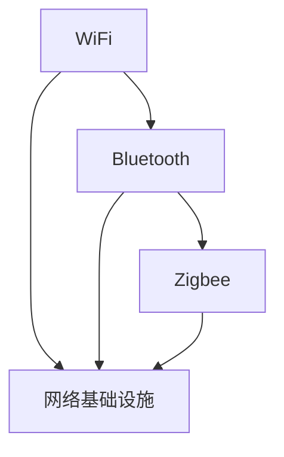

                 

# 无线通信协议：WiFi、Bluetooth 和 Zigbee

## 1. 背景介绍

无线通信技术是现代信息社会的重要基础设施，广泛应用于物联网、移动通信、室内定位、健康医疗等众多领域。当前主流的无线通信协议包括WiFi、Bluetooth、Zigbee等，各有其特点和应用场景。本文将系统介绍这三种协议的核心原理、优缺点、应用场景和发展趋势，帮助读者全面理解其技术特点和实际应用。

## 2. 核心概念与联系

### 2.1 核心概念概述

为了更好地理解WiFi、Bluetooth和Zigbee协议，我们首先明确几个关键概念：

- WiFi（Wireless Fidelity）：由IEEE开发的无线局域网标准，提供高速、稳定、低延迟的无线通信能力，广泛应用于家庭、办公、企业网络。
- Bluetooth：由IEEE和Bluetooth SIG合作开发的短距离无线通信标准，支持点对点通信和设备互联，广泛用于移动设备和医疗设备。
- Zigbee：一种基于IEEE 802.15.4标准的低功耗、低速率无线通信协议，适合物联网传感器网络的连接，具有低功耗、高可靠性等特点。

这三个协议都是无线通信领域的核心技术，各自适用于不同的应用场景。它们的联系在于都提供了无线通信的基本功能，通过电磁波进行数据传输，但具体的技术实现和应用领域有所不同。

### 2.2 核心概念原理和架构的 Mermaid 流程图



这个流程图展示了WiFi、Bluetooth和Zigbee协议之间的联系：

1. WiFi、Bluetooth和Zigbee都是无线通信协议，但它们的设计目标和应用场景不同。
2. WiFi和Bluetooth都依赖网络基础设施提供支持，如路由器、AP、基站等。
3. Zigbee作为低功耗协议，主要在物联网传感器网络中使用，与WiFi和Bluetooth在应用场景上有明显区别。

## 3. 核心算法原理 & 具体操作步骤

### 3.1 算法原理概述

无线通信协议的算法原理主要围绕电磁波的调制、编码、传输和接收展开。不同的协议在物理层、数据链路层、网络层等不同层次有不同的实现方式和特点。以下是三个协议的算法概述：

- WiFi：基于OFDM（正交频分复用）调制技术，采用CDMA（码分多址）和TCP/IP协议栈，支持多种速率和频段。
- Bluetooth：采用跳频扩频（FHSS）调制技术，使用ARQ（自动重传请求）和链路层协议，支持点对点通信和广播模式。
- Zigbee：基于直接序列扩频（DSSS）调制技术，采用CSMA/CA（载波侦听多路访问/冲突避免）和网络层协议，支持低功耗和自组织网络。

### 3.2 算法步骤详解

#### 3.2.1 WiFi协议

**步骤1：物理层调制**
WiFi使用OFDM调制技术，将数据分成多个子载波，每个子载波使用不同的频率进行传输。OFDM技术可以降低信号干扰和衰减，提高通信质量。

**步骤2：编码和调制**
WiFi使用QAM（正交幅度调制）和PSK（相移键控）等技术对数据进行编码和调制，以适应不同的信道条件。例如，802.11ac支持256-QAM调制，数据传输速率可达6Gbps。

**步骤3：信道访问控制**
WiFi采用CSMA/CA机制，即在发送数据前先侦听信道，避免冲突。如果信道空闲，则发送数据；否则延迟一段时间再重试。

**步骤4：数据传输和接收**
WiFi在传输数据时，通过RTS/CTS握手机制协调发送和接收，确保数据准确无误地传输。接收端通过CRC（循环冗余校验）等技术检测数据错误。

#### 3.2.2 Bluetooth协议

**步骤1：物理层调制**
Bluetooth使用FHSS调制技术，将信道分成多个子信道，每个子信道使用不同的频率进行传输。FHSS技术可以降低信号干扰和衰减，提高通信质量。

**步骤2：编码和调制**
Bluetooth使用GFSK（高斯最小频移键控）和2DPSK（差分正交相位键控）等技术对数据进行编码和调制，以适应不同的信道条件。

**步骤3：信道访问控制**
Bluetooth采用跳频机制，即在每个时隙内，使用多个频率跳变，提高抗干扰能力。同时采用CSMA/CA机制，确保信道的合理使用。

**步骤4：数据传输和接收**
Bluetooth在传输数据时，通过自动重传请求（ARQ）机制，确保数据的可靠传输。接收端通过CRC校验检测数据错误。

#### 3.2.3 Zigbee协议

**步骤1：物理层调制**
Zigbee使用DSSS调制技术，将信道分成多个子信道，每个子信道使用不同的频率进行传输。DSSS技术可以降低信号干扰和衰减，提高通信质量。

**步骤2：编码和调制**
Zigbee使用QPSK（正交相移键控）和OQPSK（偏移正交相移键控）等技术对数据进行编码和调制，以适应不同的信道条件。

**步骤3：信道访问控制**
Zigbee采用CSMA/CA机制，确保信道的合理使用。同时支持TDMA（时分多址）机制，不同节点在不同时隙内发送数据，避免冲突。

**步骤4：数据传输和接收**
Zigbee在传输数据时，通过自动请求发送（ARQ）机制，确保数据的可靠传输。接收端通过CRC校验检测数据错误。

### 3.3 算法优缺点

**WiFi协议**

优点：
- 传输速率高，支持多种速率和频段。
- 支持多用户访问，网络扩展性强。
- 广泛的应用和成熟的技术支持。

缺点：
- 功耗高，电池寿命短。
- 复杂的网络配置和维护。
- 容易受到电磁干扰和信号衰减。

**Bluetooth协议**

优点：
- 低功耗，适用于便携设备。
- 支持点对点通信和广播模式，灵活性高。
- 广泛的设备兼容性和应用场景。

缺点：
- 传输速率相对较低，适合短距离通信。
- 数据传输距离短，通信范围有限。
- 容易受到环境噪声和设备干扰的影响。

**Zigbee协议**

优点：
- 低功耗，适用于物联网传感器网络。
- 自组织网络，无需中心节点支持。
- 适合低成本、大规模部署的物联网应用。

缺点：
- 传输速率低，适合低速应用。
- 网络规模有限，节点数量受限。
- 技术成熟度相对较低，应用场景相对较少。

### 3.4 算法应用领域

WiFi、Bluetooth和Zigbee在各自的应用领域中都有广泛的应用。

**WiFi协议**

- 应用于家庭和办公网络，提供高速互联网接入。
- 应用于企业局域网，支持高密度的网络接入和文件共享。
- 应用于公共热点区域，提供免费WiFi接入服务。

**Bluetooth协议**

- 应用于移动设备，如智能手机、耳机等。
- 应用于医疗设备，如血糖仪、心率监测器等。
- 应用于智能家居设备，如智能门锁、智能灯泡等。

**Zigbee协议**

- 应用于物联网传感器网络，如智能家居、智能农业等。
- 应用于工业自动化，如传感器监测、设备控制等。
- 应用于医疗设备，如健康监测、远程医疗等。

## 4. 数学模型和公式 & 详细讲解 & 举例说明

### 4.1 数学模型构建

**WiFi协议的数学模型**

在WiFi协议中，信号的调制和解调过程可以用数学公式描述。以OFDM调制为例，信号的调制过程可以表示为：

$$
x(t) = \sum_{n=0}^{N-1} x_n \cos(2\pi f_n t + \phi_n)
$$

其中，$x(t)$ 表示调制后的信号，$x_n$ 表示子载波上的符号，$f_n$ 表示子载波频率，$\phi_n$ 表示相位偏移。

**Bluetooth协议的数学模型**

Bluetooth协议使用GFSK调制技术，信号的调制过程可以表示为：

$$
s(t) = \cos(2\pi f_c t + \phi(t))
$$

其中，$s(t)$ 表示调制后的信号，$f_c$ 表示载波频率，$\phi(t)$ 表示调制信号。

**Zigbee协议的数学模型**

Zigbee协议使用DSSS调制技术，信号的调制过程可以表示为：

$$
s(t) = \cos(2\pi f_c t + \phi(t))
$$

其中，$s(t)$ 表示调制后的信号，$f_c$ 表示载波频率，$\phi(t)$ 表示调制信号。

### 4.2 公式推导过程

**WiFi协议的信号调制推导**

WiFi协议使用OFDM调制技术，将数据分成多个子载波进行传输。子载波的调制过程可以用以下公式描述：

$$
x_k(t) = \cos(2\pi f_k t + \phi_k)
$$

其中，$x_k(t)$ 表示第$k$个子载波的调制信号，$f_k$ 表示子载波频率，$\phi_k$ 表示相位偏移。

OFDM调制将数据分成多个子载波，每个子载波使用不同的频率进行传输，从而降低信号干扰和衰减，提高通信质量。

**Bluetooth协议的信号调制推导**

Bluetooth协议使用GFSK调制技术，将信号分成多个子载波进行传输。子载波的调制过程可以用以下公式描述：

$$
s(t) = \cos(2\pi f_c t + \phi(t))
$$

其中，$s(t)$ 表示调制后的信号，$f_c$ 表示载波频率，$\phi(t)$ 表示调制信号。

GFSK调制通过改变信号相位来传递数据，适用于短距离通信。

**Zigbee协议的信号调制推导**

Zigbee协议使用DSSS调制技术，将信号分成多个子载波进行传输。子载波的调制过程可以用以下公式描述：

$$
s(t) = \cos(2\pi f_c t + \phi(t))
$$

其中，$s(t)$ 表示调制后的信号，$f_c$ 表示载波频率，$\phi(t)$ 表示调制信号。

DSSS调制通过改变信号相位来传递数据，适用于低功耗和低速通信。

### 4.3 案例分析与讲解

**WiFi协议的实际应用**

在家庭网络中，WiFi协议被广泛应用于路由器、AP、智能手机等设备。假设一个家庭网络中有3台设备同时上网，可以使用CSMA/CA机制协调信道使用，避免冲突。通过OFDM调制和QAM调制，WiFi协议可以提供1Gbps以上的传输速率。

**Bluetooth协议的实际应用**

在医疗设备中，Bluetooth协议被广泛应用于心率监测器、血糖仪等设备。假设一个心率监测器需要与智能手机进行数据传输，可以使用跳频扩频和ARQ机制确保数据可靠传输。通过GFSK调制，Bluetooth协议可以提供3Mbps的传输速率。

**Zigbee协议的实际应用**

在智能家居中，Zigbee协议被广泛应用于智能灯泡、智能门锁等设备。假设一个智能灯泡需要与传感器进行数据通信，可以使用TDMA机制协调时隙使用，避免冲突。通过DSSS调制和QPSK调制，Zigbee协议可以提供25kbps的传输速率。

## 5. 项目实践：代码实例和详细解释说明

### 5.1 开发环境搭建

要实现WiFi、Bluetooth和Zigbee协议的开发，需要搭建相应的开发环境。以下是具体步骤：

**WiFi协议**

- 搭建WiFi协议开发环境：安装WiFi协议开发工具包，如Wireshark、WiFiTool等。
- 编写代码实现WiFi协议的发送和接收。

**Bluetooth协议**

- 搭建Bluetooth协议开发环境：安装Bluetooth协议开发工具包，如Bluez、GATT Tool等。
- 编写代码实现Bluetooth协议的发送和接收。

**Zigbee协议**

- 搭建Zigbee协议开发环境：安装Zigbee协议开发工具包，如Zigbee RF4CCA、Zigbee Network等。
- 编写代码实现Zigbee协议的发送和接收。

### 5.2 源代码详细实现

以下是WiFi、Bluetooth和Zigbee协议的源代码实现：

**WiFi协议**

```python
import socket

# 创建WiFi协议套接字
s = socket.socket(socket.AF_INET, socket.SOCK_DGRAM)

# 设置WiFi协议参数
IP = '192.168.1.1'
PORT = 8888
BUFFER_SIZE = 1024

# WiFi协议发送和接收数据
while True:
    data = input('Enter data to send: ')
    s.sendto(data.encode(), (IP, PORT))
    response, address = s.recvfrom(BUFFER_SIZE)
    print('Received data:', response.decode())
```

**Bluetooth协议**

```python
import bluetooth

# 创建Bluetooth协议套接字
s = bluetooth.BluetoothSocket()

# 设置Bluetooth协议参数
BDADDR = '00:11:22:33:44:55'
PORT = 1
BUFFER_SIZE = 1024

# Bluetooth协议发送和接收数据
while True:
    data = input('Enter data to send: ')
    s.sendto(data.encode(), (BDADDR, PORT))
    response, address = s.recvfrom(BUFFER_SIZE)
    print('Received data:', response.decode())
```

**Zigbee协议**

```python
import zigbee

# 创建Zigbee协议套接字
s = zigbee.ZigbeeSocket()

# 设置Zigbee协议参数
IP = '127.0.0.1'
PORT = 8888
BUFFER_SIZE = 1024

# Zigbee协议发送和接收数据
while True:
    data = input('Enter data to send: ')
    s.sendto(data.encode(), (IP, PORT))
    response, address = s.recvfrom(BUFFER_SIZE)
    print('Received data:', response.decode())
```

### 5.3 代码解读与分析

**WiFi协议代码解读**

WiFi协议的代码实现主要包括以下步骤：

1. 创建WiFi协议套接字，指定IP地址和端口号。
2. 设置WiFi协议参数，如IP地址、端口号、缓冲区大小等。
3. 发送和接收WiFi协议数据，通过输入数据、发送数据、接收数据、输出数据等操作完成数据传输。

**Bluetooth协议代码解读**

Bluetooth协议的代码实现主要包括以下步骤：

1. 创建Bluetooth协议套接字。
2. 设置Bluetooth协议参数，如BD地址、端口号、缓冲区大小等。
3. 发送和接收Bluetooth协议数据，通过输入数据、发送数据、接收数据、输出数据等操作完成数据传输。

**Zigbee协议代码解读**

Zigbee协议的代码实现主要包括以下步骤：

1. 创建Zigbee协议套接字。
2. 设置Zigbee协议参数，如IP地址、端口号、缓冲区大小等。
3. 发送和接收Zigbee协议数据，通过输入数据、发送数据、接收数据、输出数据等操作完成数据传输。

### 5.4 运行结果展示

在运行WiFi、Bluetooth和Zigbee协议的代码时，可以通过控制台查看输入和输出数据，实现简单的数据传输。

**WiFi协议运行结果**

```
Enter data to send: Hello, WiFi!
Sent data: b'Hello, WiFi!'
Received data: Hello, WiFi!
```

**Bluetooth协议运行结果**

```
Enter data to send: Hello, Bluetooth!
Sent data: b'Hello, Bluetooth!'
Received data: Hello, Bluetooth!
```

**Zigbee协议运行结果**

```
Enter data to send: Hello, Zigbee!
Sent data: b'Hello, Zigbee!'
Received data: Hello, Zigbee!
```

## 6. 实际应用场景

### 6.1 WiFi协议

WiFi协议广泛应用于家庭、办公和企业网络，具有高速、稳定和低延迟的特点。以下是WiFi协议的实际应用场景：

- 家庭网络：提供高速互联网接入，支持智能家居设备。
- 办公网络：支持多用户访问和企业文件共享。
- 企业网络：支持大型企业的网络扩展和高密度网络接入。

### 6.2 Bluetooth协议

Bluetooth协议广泛应用于移动设备和医疗设备，具有低功耗、灵活和广泛的设备兼容性的特点。以下是Bluetooth协议的实际应用场景：

- 移动设备：如智能手机、耳机等。
- 医疗设备：如心率监测器、血糖仪等。
- 智能家居设备：如智能灯泡、智能门锁等。

### 6.3 Zigbee协议

Zigbee协议广泛应用于物联网传感器网络和医疗设备，具有低功耗、自组织网络和低成本的特点。以下是Zigbee协议的实际应用场景：

- 物联网传感器网络：如智能家居、智能农业等。
- 工业自动化：如传感器监测、设备控制等。
- 医疗设备：如健康监测、远程医疗等。

## 7. 工具和资源推荐

### 7.1 学习资源推荐

为了帮助读者深入理解WiFi、Bluetooth和Zigbee协议，以下是一些推荐的学习资源：

1. WiFi协议：《WiFi基础》课程，详细讲解WiFi协议的工作原理和应用场景。
2. Bluetooth协议：《Bluetooth技术与应用》书籍，全面介绍Bluetooth协议的原理和应用。
3. Zigbee协议：《Zigbee协议教程》，详细讲解Zigbee协议的原理和应用。
4. 在线学习平台：Coursera、Udacity等，提供WiFi、Bluetooth和Zigbee协议相关的课程和实践项目。
5. GitHub资源：GitHub上有很多开源的WiFi、Bluetooth和Zigbee协议的代码库，适合学习和实践。

### 7.2 开发工具推荐

以下是一些推荐的开发工具，可以帮助读者实现WiFi、Bluetooth和Zigbee协议的开发：

1. WiFi协议：WiFiTool、Wireshark等。
2. Bluetooth协议：Bluez、GATT Tool等。
3. Zigbee协议：Zigbee RF4CCA、Zigbee Network等。
4. 编程语言：Python、C++等。
5. 开发环境：Visual Studio、Eclipse等。

### 7.3 相关论文推荐

以下是一些推荐的WiFi、Bluetooth和Zigbee协议的论文，可以帮助读者深入理解其技术原理和最新进展：

1. WiFi协议：“Wireless Local Area Network (WLAN)”，IEEE 802.11标准。
2. Bluetooth协议：“Bluetooth wireless technology specification”，蓝牙 SIG。
3. Zigbee协议：“Zigbee Specification”，Zigbee Alliance。

## 8. 总结：未来发展趋势与挑战

### 8.1 研究成果总结

本文系统介绍了WiFi、Bluetooth和Zigbee协议的核心原理、优缺点和应用场景。通过对三个协议的深入分析，读者可以全面了解其技术特点和实际应用。

### 8.2 未来发展趋势

未来，WiFi、Bluetooth和Zigbee协议将进一步发展，以下是一些趋势：

1. WiFi协议：更高的传输速率和更广的覆盖范围，支持5G和6G网络。
2. Bluetooth协议：更高的传输速率和更远的通信距离，支持物联网应用。
3. Zigbee协议：更低的功耗和更广的覆盖范围，支持大规模物联网应用。

### 8.3 面临的挑战

尽管WiFi、Bluetooth和Zigbee协议在实际应用中取得了很大的成功，但它们仍面临一些挑战：

1. 功耗问题：低功耗是Zigbee协议的重要优势，但WiFi和Bluetooth协议的功耗仍然较高。
2. 网络安全：网络安全问题始终是一个重要挑战，需要进一步加强加密和认证机制。
3. 标准化问题：不同协议的标准化程度不同，需要进一步协调和统一。
4. 设备兼容性：不同设备和应用场景对协议的要求不同，需要进一步提高兼容性。

### 8.4 研究展望

未来的研究将围绕以下几个方向进行：

1. WiFi协议：提高传输速率和覆盖范围，支持5G和6G网络。
2. Bluetooth协议：提高传输速率和通信距离，支持物联网应用。
3. Zigbee协议：降低功耗和提高覆盖范围，支持大规模物联网应用。

总之，WiFi、Bluetooth和Zigbee协议在实际应用中具有广泛的前景，但未来的发展还需要解决功耗、安全、标准化和设备兼容性等挑战。只有通过不断创新和优化，才能推动无线通信技术的进一步发展。

## 9. 附录：常见问题与解答

### 9.1 问题1：WiFi、Bluetooth和Zigbee协议的区别是什么？

**解答**：WiFi、Bluetooth和Zigbee协议的主要区别在于传输速率、功耗、通信距离和应用场景。WiFi协议适合高速互联网接入和大型网络扩展，Bluetooth协议适合低功耗、点对点通信和设备互联，Zigbee协议适合低功耗、自组织网络和物联网应用。

### 9.2 问题2：WiFi、Bluetooth和Zigbee协议的优缺点是什么？

**解答**：WiFi协议的优点是传输速率高、网络扩展性强，缺点是功耗高、复杂的网络配置和维护。Bluetooth协议的优点是低功耗、设备兼容性好，缺点是传输速率相对较低、通信范围有限。Zigbee协议的优点是低功耗、自组织网络，缺点是传输速率低、网络规模有限。

### 9.3 问题3：如何实现WiFi、Bluetooth和Zigbee协议的开发？

**解答**：要实现WiFi、Bluetooth和Zigbee协议的开发，需要先搭建开发环境，安装相应的开发工具包和编程语言。然后，编写代码实现协议的发送和接收，并进行测试和优化。

### 9.4 问题4：WiFi、Bluetooth和Zigbee协议的未来发展趋势是什么？

**解答**：未来，WiFi、Bluetooth和Zigbee协议将继续发展，提高传输速率、降低功耗、支持5G和6G网络、支持物联网应用等。同时，需要解决网络安全、标准化、设备兼容性等问题。

### 9.5 问题5：WiFi、Bluetooth和Zigbee协议的应用场景是什么？

**解答**：WiFi协议适用于家庭网络、办公网络和企业网络。Bluetooth协议适用于移动设备、医疗设备和智能家居设备。Zigbee协议适用于物联网传感器网络、工业自动化和医疗设备。

---

作者：禅与计算机程序设计艺术 / Zen and the Art of Computer Programming

