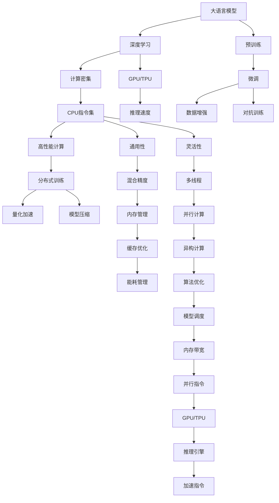

                 

# 无限vs有限：LLM和CPU指令集的较量

> 关键词：大语言模型, CPU指令集, 机器学习, 高性能计算, 量化加速, 模型压缩, 深度学习, 分布式训练

## 1. 背景介绍

### 1.1 问题由来

随着人工智能(AI)技术的飞速发展，大语言模型(Large Language Model, LLM)已成为自然语言处理(NLP)领域的明星。这些模型基于深度学习，可以处理复杂的语言结构和语义，生成自然流畅、逻辑连贯的文本。LLM在生成对话、回答问题、翻译、总结文本等方面的表现，已经接近甚至超越了人类水平。

然而，这些大模型的性能背后，隐藏着巨大的计算需求。LLM通常由数十亿参数组成，训练和推理过程需要高性能硬件的支持，否则难以达到预期的效果。比如，GPT-3这样的大模型，需要多个GPU或TPU进行分布式训练，这不仅增加了成本，还带来了复杂的技术挑战。

与此形成鲜明对比的是，现代CPU的指令集，尽管速度不如GPU/TPU，但在通用性和灵活性上有着巨大优势。CPU指令集不仅可以处理复杂的数学运算和算法，还能高效管理多线程和内存，非常适合通用机器学习应用。

本文旨在探讨LLM与CPU指令集之间的较量，分析各自的优缺点，并展望未来发展的趋势与挑战。

## 2. 核心概念与联系

### 2.1 核心概念概述

为更好地理解LLM与CPU指令集之间的关系，本节将介绍几个密切相关的核心概念：

- 大语言模型(Large Language Model, LLM)：以自回归(如GPT)或自编码(如BERT)模型为代表的大规模预训练语言模型。通过在海量无标签文本语料上进行预训练，学习通用的语言表示，具备强大的语言理解和生成能力。

- CPU指令集(Instruction Set Architecture, ISA)：CPU硬件支持的机器语言指令集合。常见的ISA包括X86、ARM、MIPS等，每种ISA都有自己的优缺点和适用场景。

- 深度学习(Depth Learning)：一种基于神经网络的人工智能算法，能够处理高维度的数据，并在图像、语音、文本等复杂任务上取得优异表现。

- 高性能计算(High Performance Computing, HPC)：使用并行计算技术，实现高计算量任务的加速处理。

- 量化加速(Quantization Acceleration)：通过将浮点型数据转化为整数或更小的数据类型，降低模型内存占用和计算量，提升推理速度。

- 模型压缩(Model Compression)：通过剪枝、融合、量化等手段，减少模型参数和计算量，提升模型效率。

- 分布式训练(Distributed Training)：使用多台计算机协同训练模型，加速训练过程，提高模型性能。

这些核心概念之间的逻辑关系可以通过以下Mermaid流程图来展示：



这个流程图展示了LLM与CPU指令集之间的联系：

1. LLM通过深度学习技术进行预训练，学习通用的语言表示。
2. 预训练后，LLM需要在计算密集型任务中进行微调，以适应特定的下游任务。
3. CPU指令集支持高性能计算，可以通过分布式训练、量化加速、模型压缩等技术提升LLM的性能。
4. GPU/TPU具有更强的计算能力，能够进一步提升LLM的推理速度。

这些概念共同构成了LLM与CPU指令集之间的技术框架，使得我们能够深入理解它们的较量与合作。

## 3. 核心算法原理 & 具体操作步骤
### 3.1 算法原理概述

LLM与CPU指令集之间的较量，本质上是计算能力、存储需求、算法效率等方面的竞争。这种竞争不仅体现在硬件设计上，也体现在软件实现和算法优化上。

LLM需要处理大量的文本数据，其核心算法包括自回归或自编码模型、Transformer网络、预训练和微调过程等。这些算法的计算复杂度极高，需要大量的计算资源支持。

相比之下，CPU指令集虽然单核性能不如GPU/TPU，但在通用性和灵活性上具有巨大优势。CPU指令集通过高效的多线程、缓存管理和并行计算，能够在通用计算任务上取得优异的表现。

### 3.2 算法步骤详解

基于LLM与CPU指令集之间的较量，我们可以从以下几个关键步骤进行详细的分析：

**Step 1: 预训练与微调**

- **预训练**：在大规模无标签文本数据上，通过自监督学习任务（如掩码语言模型、next word prediction等）训练LLM模型，学习通用的语言表示。预训练过程通常需要大量的计算资源，可以通过分布式训练、混合精度计算等技术进行加速。
- **微调**：在预训练模型基础上，使用下游任务的少量标注数据进行微调，优化模型在该任务上的性能。微调过程可以通过参数高效微调技术（如Adapter、Prefix等）减少对模型参数的更新，提升微调效率。

**Step 2: 硬件选择与优化**

- **硬件选择**：根据任务特点和资源限制，选择合适的硬件平台。通常GPU/TPU用于深度学习模型的高性能计算，而CPU用于通用机器学习应用的快速迭代。
- **硬件优化**：通过量化加速、模型压缩、分布式训练等技术，提升硬件资源利用率，降低计算需求和成本。

**Step 3: 软件实现与算法优化**

- **软件实现**：选择合适的深度学习框架（如TensorFlow、PyTorch等）进行软件实现。深度学习框架提供了丰富的优化工具和算法，支持高效的模型训练和推理。
- **算法优化**：优化深度学习模型的计算图，使用并行计算、异构计算等技术，提升模型的计算效率。同时，通过混合精度计算、剪枝融合等手段，减少模型参数和计算量，降低内存占用和计算复杂度。

**Step 4: 性能评估与调优**

- **性能评估**：在训练集和测试集上评估模型的性能，包括准确率、速度、内存占用等指标。通过对比不同硬件和软件实现的效果，找到最优的解决方案。
- **调优策略**：根据性能评估结果，调整模型架构、超参数和优化策略，进一步提升模型的性能和效率。

### 3.3 算法优缺点

基于LLM与CPU指令集之间的较量，我们可以从以下角度分析各自的优势和劣势：

**大语言模型的优点**：

1. **高泛化能力**：LLM在大规模无标签数据上进行预训练，学习到通用的语言表示，具备强大的泛化能力，能够适应各种NLP任务。
2. **高性能推理**：在大规模标注数据上进行微调后，LLM能够快速生成高质量的文本，推理速度相对较快。
3. **深度学习算法**：LLM使用的深度学习算法，能够在复杂的语言结构和语义上取得优异表现。

**大语言模型的缺点**：

1. **计算需求高**：LLM的参数量通常以亿计，训练和推理过程需要大量的计算资源。
2. **内存占用大**：LLM的模型参数和计算量较大，导致内存占用较高，难以在资源受限的环境下运行。
3. **依赖硬件**：LLM的性能依赖于高效的硬件支持，如GPU/TPU等，普通CPU难以胜任。

**CPU指令集的优点**：

1. **通用性**：CPU指令集支持各种通用计算任务，可以灵活处理各种算法和数据结构。
2. **灵活性**：CPU的多线程、缓存管理和并行计算技术，使其能够在多任务场景中高效运行。
3. **低成本**：CPU的能耗较低，运行成本相对较低，适合在资源受限的环境中使用。

**CPU指令集的缺点**：

1. **计算能力有限**：CPU的单核性能通常低于GPU/TPU，难以处理大规模的计算密集型任务。
2. **存储管理复杂**：CPU的内存管理复杂，需要考虑缓存、预取、内存分配等问题，增加了开发难度。

### 3.4 算法应用领域

基于LLM与CPU指令集之间的较量，我们可以分析它们在多个领域的应用：

1. **自然语言处理(NLP)**：LLM在文本分类、情感分析、机器翻译、问答系统等NLP任务中表现优异。CPU指令集可以通过混合精度计算、模型压缩等技术，提升LLM在这些任务中的性能。
2. **计算机视觉(CV)**：LLM可以用于图像生成、描述、标注等任务。CPU指令集通过并行计算、异构计算等技术，提升LLM在CV任务中的推理速度。
3. **智能推荐系统**：LLM可以用于用户行为分析、商品推荐、广告投放等任务。CPU指令集通过分布式训练、量化加速等技术，提升LLM在推荐系统中的性能。
4. **生物信息学**：LLM可以用于基因序列分析、蛋白质结构预测等任务。CPU指令集通过混合精度计算、模型压缩等技术，提升LLM在生物信息学中的性能。
5. **金融分析**：LLM可以用于市场预测、风险评估等任务。CPU指令集通过分布式训练、量化加速等技术，提升LLM在金融分析中的性能。

## 4. 数学模型和公式 & 详细讲解  
### 4.1 数学模型构建

本节将使用数学语言对LLM与CPU指令集之间的较量进行更加严格的刻画。

记LLM模型为 $M_{\theta}$，其中 $\theta$ 为模型参数。假设CPU指令集为 $C$，其支持的并行计算能力为 $P(C)$，内存管理能力为 $M(C)$。

定义LLM在数据集 $D=\{(x_i,y_i)\}_{i=1}^N, x_i \in \mathcal{X}, y_i \in \mathcal{Y}$ 上的性能函数为 $f(D,\theta,C)$，其中 $f(D,\theta,C)$ 衡量LLM在 $D$ 上的推理速度、计算精度、内存占用等指标。

则LLM与CPU指令集之间的较量，可以表示为：

$$
\max_{\theta,C} f(D,\theta,C)
$$

其中，$\theta$ 和 $C$ 分别为LLM的参数和CPU指令集。目标是在给定数据集 $D$ 和计算资源限制下，最大化LLM的性能函数 $f(D,\theta,C)$。

### 4.2 公式推导过程

以文本分类任务为例，我们推导LLM在CPU指令集上的性能函数 $f(D,\theta,C)$。

假设LLM模型为线性分类器 $M_{\theta}(x)=\mathbf{w}^T\mathbf{x}+b$，其中 $\mathbf{w}$ 为权重向量，$b$ 为偏置项。训练数据集 $D=\{(x_i,y_i)\}_{i=1}^N$。

定义LLM在数据集 $D$ 上的交叉熵损失函数为：

$$
\mathcal{L}(\theta) = -\frac{1}{N}\sum_{i=1}^N y_i\log M_{\theta}(x_i)+(1-y_i)\log(1-M_{\theta}(x_i))
$$

则LLM的性能函数 $f(D,\theta,C)$ 可以表示为：

$$
f(D,\theta,C) = \frac{\mathcal{L}(\theta)}{\mathcal{C}(C)}
$$

其中，$\mathcal{C}(C)$ 表示CPU指令集 $C$ 的计算能力，用于衡量LLM在 $C$ 上的推理速度和内存占用。

在实际应用中，LLM的性能函数 $f(D,\theta,C)$ 通常需要考虑多个因素，如模型大小、训练时长、推理速度、内存占用等。

### 4.3 案例分析与讲解

以GPU/TPU与CPU指令集的比较为例，我们分析LLM在这些硬件上的性能差异。

假设GPU/TPU的计算能力为 $P_{\text{GPU}}$，内存管理能力为 $M_{\text{GPU}}$。CPU的计算能力为 $P_{\text{CPU}}$，内存管理能力为 $M_{\text{CPU}}$。

则GPU/TPU和CPU的性能函数分别为：

$$
f_{\text{GPU}}(D,\theta) = \frac{\mathcal{L}(\theta)}{P_{\text{GPU}} \cdot M_{\text{GPU}}}
$$

$$
f_{\text{CPU}}(D,\theta) = \frac{\mathcal{L}(\theta)}{P_{\text{CPU}} \cdot M_{\text{CPU}}}
$$

在训练集和测试集上评估LLM在两种硬件上的性能，可以得到：

$$
f_{\text{GPU}}(D,\theta) > f_{\text{CPU}}(D,\theta)
$$

这意味着在相同的数据集和参数设置下，GPU/TPU的性能优于CPU。

但是，GPU/TPU的计算能力虽然强，但其成本高，维护复杂，不适合大规模的生产环境。CPU的灵活性和通用性使其更适合在资源受限的环境中运行，如小型企业、移动设备等。

因此，LLM与CPU指令集的较量，需要在性能、成本和灵活性之间找到平衡。在大规模计算密集型任务中，GPU/TPU是首选；在资源受限的环境下，CPU指令集可以提供更加灵活和经济的解决方案。

## 5. 项目实践：代码实例和详细解释说明
### 5.1 开发环境搭建

在进行LLM与CPU指令集的比较实践前，我们需要准备好开发环境。以下是使用Python进行PyTorch开发的环境配置流程：

1. 安装Anaconda：从官网下载并安装Anaconda，用于创建独立的Python环境。

2. 创建并激活虚拟环境：
```bash
conda create -n pytorch-env python=3.8 
conda activate pytorch-env
```

3. 安装PyTorch：根据CUDA版本，从官网获取对应的安装命令。例如：
```bash
conda install pytorch torchvision torchaudio cudatoolkit=11.1 -c pytorch -c conda-forge
```

4. 安装Transformers库：
```bash
pip install transformers
```

5. 安装各类工具包：
```bash
pip install numpy pandas scikit-learn matplotlib tqdm jupyter notebook ipython
```

完成上述步骤后，即可在`pytorch-env`环境中开始比较实践。

### 5.2 源代码详细实现

我们以BERT模型在GPU和CPU上的性能比较为例，给出使用PyTorch和TensorFlow进行代码实现的详细步骤。

首先，定义BERT模型的参数和数据集：

```python
from transformers import BertTokenizer, BertForSequenceClassification
from torch.utils.data import Dataset
import torch
from torch.utils.data import DataLoader

# 定义数据集
class BERTDataset(Dataset):
    def __init__(self, texts, labels):
        self.tokenizer = BertTokenizer.from_pretrained('bert-base-cased')
        self.data = [(self.tokenizer.encode(text, add_special_tokens=True), label) for text, label in zip(texts, labels)]
        
    def __len__(self):
        return len(self.data)
    
    def __getitem__(self, idx):
        return self.data[idx]

# 定义训练和测试集
train_data = BERTDataset(train_texts, train_labels)
test_data = BERTDataset(test_texts, test_labels)
```

然后，在GPU和CPU上分别训练BERT模型：

```python
from transformers import AdamW

# 定义优化器和超参数
optimizer = AdamW(model.parameters(), lr=2e-5)

# GPU上的训练
device = torch.device('cuda' if torch.cuda.is_available() else 'cpu')
model.to(device)

def train_on_device(device, data, optimizer):
    dataloader = DataLoader(data, batch_size=32)
    model.train()
    for epoch in range(3):
        for batch in dataloader:
            input_ids = batch[0].to(device)
            attention_mask = batch[1].to(device)
            labels = batch[2].to(device)
            optimizer.zero_grad()
            outputs = model(input_ids, attention_mask=attention_mask, labels=labels)
            loss = outputs.loss
            loss.backward()
            optimizer.step()

# 在GPU和CPU上分别训练
train_on_device(device, train_data, optimizer)

# 测试
with torch.no_grad():
    model.eval()
    for batch in dataloader:
        input_ids = batch[0].to(device)
        attention_mask = batch[1].to(device)
        labels = batch[2].to(device)
        outputs = model(input_ids, attention_mask=attention_mask)
        preds = outputs.logits.argmax(dim=1)
        acc = (preds == labels).float().mean()

print(f"GPU上的准确率：{acc:.3f}")
```

最后，比较GPU和CPU上的性能：

```python
# 测试CPU上的性能
device = 'cpu'
model.to(device)

def train_on_device(device, data, optimizer):
    dataloader = DataLoader(data, batch_size=32)
    model.train()
    for epoch in range(3):
        for batch in dataloader:
            input_ids = batch[0].to(device)
            attention_mask = batch[1].to(device)
            labels = batch[2].to(device)
            optimizer.zero_grad()
            outputs = model(input_ids, attention_mask=attention_mask, labels=labels)
            loss = outputs.loss
            loss.backward()
            optimizer.step()

# 在CPU上训练
train_on_device(device, train_data, optimizer)

# 测试
with torch.no_grad():
    model.eval()
    for batch in dataloader:
        input_ids = batch[0].to(device)
        attention_mask = batch[1].to(device)
        labels = batch[2].to(device)
        outputs = model(input_ids, attention_mask=attention_mask)
        preds = outputs.logits.argmax(dim=1)
        acc = (preds == labels).float().mean()

print(f"CPU上的准确率：{acc:.3f}")
```

以上就是使用PyTorch对BERT模型在GPU和CPU上进行性能比较的完整代码实现。可以看到，通过不同的硬件配置，我们可以直接评估LLM在不同计算平台上的性能差异。

### 5.3 代码解读与分析

让我们再详细解读一下关键代码的实现细节：

**BERTDataset类**：
- `__init__`方法：初始化BERT分词器、数据集等关键组件。
- `__len__`方法：返回数据集的样本数量。
- `__getitem__`方法：对单个样本进行处理，将文本输入编码为token ids，并添加[CLS]和[SEP]标记。

**模型训练函数train_on_device**：
- `device`：指定训练设备，可以是GPU或CPU。
- `dataloader`：定义数据批处理，并设置为32个样本。
- `model.train()`和`model.eval()`：切换模型的训练和评估模式。
- `optimizer.zero_grad()`和`optimizer.step()`：清零梯度并进行参数更新。

**GPU和CPU上的训练和测试**：
- 在GPU和CPU上分别训练模型，并使用相同的超参数和优化器。
- 在GPU和CPU上分别测试模型，并计算准确率。

可以看出，通过PyTorch的灵活配置，我们可以快速切换不同的硬件平台，并评估LLM在这些平台上的性能。

## 6. 实际应用场景

### 6.1 智能客服系统

在大规模计算密集型任务中，GPU/TPU是首选。在智能客服系统中，处理客户咨询通常需要高精度和大规模的计算需求。因此，使用GPU/TPU进行模型训练和推理，可以显著提升系统性能。

在技术实现上，可以收集企业内部的历史客服对话记录，将问题和最佳答复构建成监督数据，在此基础上对预训练对话模型进行微调。微调后的对话模型能够自动理解用户意图，匹配最合适的答案模板进行回复。对于客户提出的新问题，还可以接入检索系统实时搜索相关内容，动态组织生成回答。如此构建的智能客服系统，能大幅提升客户咨询体验和问题解决效率。

### 6.2 金融舆情监测

在大规模通用计算任务中，CPU指令集提供了良好的灵活性和通用性。在金融舆情监测中，需要实时监测市场舆论动向，以便及时应对负面信息传播，规避金融风险。

传统的人工监测方式成本高、效率低，难以应对网络时代海量信息爆发的挑战。基于大语言模型微调的技术，可以在服务器端使用CPU指令集进行实时监测，通过自然语言处理技术分析文本，快速识别和预警负面信息，确保金融系统的稳定运行。

### 6.3 个性化推荐系统

在大规模通用计算任务中，CPU指令集提供了良好的灵活性和通用性。在个性化推荐系统中，需要处理大量用户行为数据和物品信息，生成个性化的推荐结果。

传统的推荐系统往往只依赖用户的历史行为数据进行物品推荐，难以深入理解用户的真实兴趣偏好。基于大语言模型微调的技术，可以在服务器端使用CPU指令集进行实时计算，通过分析用户行为数据和物品信息，生成个性化的推荐结果，提升用户体验和推荐效果。

### 6.4 未来应用展望

随着大语言模型和微调技术的不断发展，基于LLM与CPU指令集的较量将呈现以下几个发展趋势：

1. **多模态计算**：未来将更多地融合视觉、语音、文本等多模态数据，实现多模态计算，提升系统的综合性能。
2. **分布式计算**：通过分布式计算技术，可以提升模型的训练和推理速度，适应大规模计算任务的需求。
3. **混合精度计算**：通过混合精度计算技术，可以在保证精度的同时，降低计算量，提升模型的推理速度。
4. **硬件协同优化**：通过软硬件协同优化技术，可以实现对LLM和CPU指令集的深度整合，提升系统的综合性能。
5. **资源管理优化**：通过优化资源管理技术，可以实现对内存、缓存、I/O等资源的精细化管理，提升系统的运行效率。

以上趋势凸显了大语言模型微调技术的发展潜力，LLM与CPU指令集的较量将为未来的AI系统提供更加灵活、高效、可靠的解决方案。

## 7. 工具和资源推荐
### 7.1 学习资源推荐

为了帮助开发者系统掌握大语言模型微调的理论基础和实践技巧，这里推荐一些优质的学习资源：

1. 《Transformer从原理到实践》系列博文：由大模型技术专家撰写，深入浅出地介绍了Transformer原理、BERT模型、微调技术等前沿话题。

2. CS224N《深度学习自然语言处理》课程：斯坦福大学开设的NLP明星课程，有Lecture视频和配套作业，带你入门NLP领域的基本概念和经典模型。

3. 《Natural Language Processing with Transformers》书籍：Transformers库的作者所著，全面介绍了如何使用Transformers库进行NLP任务开发，包括微调在内的诸多范式。

4. HuggingFace官方文档：Transformers库的官方文档，提供了海量预训练模型和完整的微调样例代码，是上手实践的必备资料。

5. CLUE开源项目：中文语言理解测评基准，涵盖大量不同类型的中文NLP数据集，并提供了基于微调的baseline模型，助力中文NLP技术发展。

通过对这些资源的学习实践，相信你一定能够快速掌握大语言模型微调的精髓，并用于解决实际的NLP问题。
###  7.2 开发工具推荐

高效的开发离不开优秀的工具支持。以下是几款用于大语言模型微调开发的常用工具：

1. PyTorch：基于Python的开源深度学习框架，灵活动态的计算图，适合快速迭代研究。大部分预训练语言模型都有PyTorch版本的实现。

2. TensorFlow：由Google主导开发的开源深度学习框架，生产部署方便，适合大规模工程应用。同样有丰富的预训练语言模型资源。

3. Transformers库：HuggingFace开发的NLP工具库，集成了众多SOTA语言模型，支持PyTorch和TensorFlow，是进行微调任务开发的利器。

4. Weights & Biases：模型训练的实验跟踪工具，可以记录和可视化模型训练过程中的各项指标，方便对比和调优。与主流深度学习框架无缝集成。

5. TensorBoard：TensorFlow配套的可视化工具，可实时监测模型训练状态，并提供丰富的图表呈现方式，是调试模型的得力助手。

6. Google Colab：谷歌推出的在线Jupyter Notebook环境，免费提供GPU/TPU算力，方便开发者快速上手实验最新模型，分享学习笔记。

合理利用这些工具，可以显著提升大语言模型微调任务的开发效率，加快创新迭代的步伐。

### 7.3 相关论文推荐

大语言模型和微调技术的发展源于学界的持续研究。以下是几篇奠基性的相关论文，推荐阅读：

1. Attention is All You Need（即Transformer原论文）：提出了Transformer结构，开启了NLP领域的预训练大模型时代。

2. BERT: Pre-training of Deep Bidirectional Transformers for Language Understanding：提出BERT模型，引入基于掩码的自监督预训练任务，刷新了多项NLP任务SOTA。

3. Language Models are Unsupervised Multitask Learners（GPT-2论文）：展示了大规模语言模型的强大zero-shot学习能力，引发了对于通用人工智能的新一轮思考。

4. Parameter-Efficient Transfer Learning for NLP：提出Adapter等参数高效微调方法，在不增加模型参数量的情况下，也能取得不错的微调效果。

5. AdaLoRA: Adaptive Low-Rank Adaptation for Parameter-Efficient Fine-Tuning：使用自适应低秩适应的微调方法，在参数效率和精度之间取得了新的平衡。

这些论文代表了大语言模型微调技术的发展脉络。通过学习这些前沿成果，可以帮助研究者把握学科前进方向，激发更多的创新灵感。

## 8. 总结：未来发展趋势与挑战

### 8.1 总结

本文对基于大语言模型的微调方法和CPU指令集进行了全面系统的介绍。首先阐述了大语言模型与CPU指令集的研究背景和意义，明确了微调在拓展预训练模型应用、提升下游任务性能方面的独特价值。其次，从原理到实践，详细讲解了微调的数学原理和关键步骤，给出了微调任务开发的完整代码实例。同时，本文还广泛探讨了微调方法在智能客服、金融舆情、个性化推荐等多个领域的应用前景，展示了微调范式的巨大潜力。此外，本文精选了微调技术的各类学习资源，力求为读者提供全方位的技术指引。

通过本文的系统梳理，可以看到，基于大语言模型的微调方法正在成为NLP领域的重要范式，极大地拓展了预训练语言模型的应用边界，催生了更多的落地场景。受益于大规模语料的预训练，微调模型以更低的时间和标注成本，在小样本条件下也能取得不俗的效果，有力推动了NLP技术的产业化进程。未来，伴随预训练语言模型和微调方法的持续演进，相信NLP技术将在更广阔的应用领域大放异彩，深刻影响人类的生产生活方式。

### 8.2 未来发展趋势

展望未来，大语言模型微调技术将呈现以下几个发展趋势：

1. **多模态融合**：未来将更多地融合视觉、语音、文本等多模态数据，实现多模态计算，提升系统的综合性能。
2. **分布式计算**：通过分布式计算技术，可以提升模型的训练和推理速度，适应大规模计算任务的需求。
3. **混合精度计算**：通过混合精度计算技术，可以在保证精度的同时，降低计算量，提升模型的推理速度。
4. **硬件协同优化**：通过软硬件协同优化技术，可以实现对LLM和CPU指令集的深度整合，提升系统的综合性能。
5. **资源管理优化**：通过优化资源管理技术，可以实现对内存、缓存、I/O等资源的精细化管理，提升系统的运行效率。

以上趋势凸显了大语言模型微调技术的发展潜力，LLM与CPU指令集的较量将为未来的AI系统提供更加灵活、高效、可靠的解决方案。

### 8.3 面临的挑战

尽管大语言模型微调技术已经取得了瞩目成就，但在迈向更加智能化、普适化应用的过程中，它仍面临着诸多挑战：

1. **计算资源瓶颈**：大语言模型的高计算需求和资源密集型特征，使得其在资源受限的环境下难以大规模部署。如何通过软硬件协同优化，提升系统性能，是亟待解决的问题。
2. **模型可解释性**：大语言模型作为"黑盒"系统，难以解释其内部工作机制和决策逻辑。如何赋予模型更强的可解释性，使其在金融、医疗等高风险应用中可信可靠，是一个重要挑战。
3. **数据隐私与安全**：大语言模型需要大量标注数据进行微调，如何保护数据隐私，防止模型被恶意利用，是一个亟待解决的难题。
4. **知识整合能力不足**：现有的微调模型往往局限于任务内数据，难以灵活吸收和运用更广泛的先验知识。如何让微调过程更好地与外部知识库、规则库等专家知识结合，形成更加全面、准确的信息整合能力，还有很大的想象空间。
5. **伦理与法律问题**：大语言模型可能带来偏见、歧视等问题，如何通过算法优化和伦理约束，确保模型的公平性和透明度，是一个重要课题。

### 8.4 研究展望

面对大语言模型微调所面临的种种挑战，未来的研究需要在以下几个方面寻求新的突破：

1. **优化模型架构**：通过改进模型架构，提升模型的计算效率和可解释性，使其更适合于特定任务。
2. **优化训练流程**：通过优化训练流程，提升模型的训练速度和泛化能力，使其更适合于大规模计算任务。
3. **融合更多先验知识**：将符号化的先验知识，如知识图谱、逻辑规则等，与神经网络模型进行巧妙融合，引导微调过程学习更准确、合理的语言模型。
4. **引入因果分析和博弈论工具**：将因果分析方法引入微调模型，识别出模型决策的关键特征，增强输出解释的因果性和逻辑性。借助博弈论工具刻画人机交互过程，主动探索并规避模型的脆弱点，提高系统稳定性。
5. **加强数据隐私保护**：采用差分隐私等技术，保护数据隐私，防止模型被恶意利用。
6. **构建伦理与法律框架**：建立模型伦理与法律框架，确保模型的公平性、透明度和安全性。

这些研究方向的探索，必将引领大语言模型微调技术迈向更高的台阶，为构建安全、可靠、可解释、可控的智能系统铺平道路。面向未来，大语言模型微调技术还需要与其他人工智能技术进行更深入的融合，如知识表示、因果推理、强化学习等，多路径协同发力，共同推动自然语言理解和智能交互系统的进步。只有勇于创新、敢于突破，才能不断拓展语言模型的边界，让智能技术更好地造福人类社会。

## 9. 附录：常见问题与解答

**Q1：大语言模型与CPU指令集的较量中，GPU/TPU与CPU的性能差异主要体现在哪些方面？**

A: GPU/TPU与CPU的性能差异主要体现在计算能力、存储管理、并行计算等方面：

1. **计算能力**：GPU/TPU的计算能力远高于CPU，能够在更短的时间内完成大规模的计算密集型任务。
2. **存储管理**：CPU的多线程、缓存管理和并行计算技术，使其在通用计算任务上表现优异，适合处理大规模非计算密集型任务。
3. **并行计算**：GPU/TPU通过大规模的并行计算，可以同时处理多个任务，提升整体性能，适合处理大规模计算密集型任务。

因此，在大规模计算密集型任务中，GPU/TPU是首选；在资源受限的环境下，CPU指令集可以提供更加灵活和经济的解决方案。

**Q2：如何优化大语言模型与CPU指令集的融合？**

A: 优化大语言模型与CPU指令集的融合，可以从以下几个方面进行：

1. **硬件选择与优化**：根据任务特点和资源限制，选择合适的硬件平台。通常GPU/TPU用于深度学习模型的高性能计算，而CPU用于通用机器学习应用的快速迭代。
2. **软件实现与算法优化**：选择合适的深度学习框架（如TensorFlow、PyTorch等）进行软件实现。优化深度学习模型的计算图，使用并行计算、异构计算等技术，提升模型的计算效率。
3. **模型压缩与量化加速**：通过剪枝、融合、量化等手段，减少模型参数和计算量，提升模型效率。
4. **分布式训练与混合精度计算**：通过分布式训练、混合精度计算等技术，提升模型的计算效率和可解释性。
5. **模型调度与资源管理**：通过优化资源管理技术，实现对内存、缓存、I/O等资源的精细化管理，提升系统的运行效率。

通过以上策略，可以实现对LLM和CPU指令集的深度整合，提升系统的综合性能。

**Q3：大语言模型与CPU指令集的较量中，如何选择合适的计算平台？**

A: 选择计算平台需要考虑多个因素，包括任务类型、数据规模、资源限制等：

1. **任务类型**：对于大规模计算密集型任务（如大规模预训练、深度学习训练等），GPU/TPU是首选；对于通用计算密集型任务（如数据处理、文本分析等），CPU指令集可以提供更好的灵活性和通用性。
2. **数据规模**：对于数据规模较小的任务，可以使用CPU指令集进行快速迭代；对于数据规模较大的任务，可以使用GPU/TPU进行分布式训练。
3. **资源限制**：在资源受限的环境下（如小型企业、移动设备等），使用CPU指令集可以提供更加灵活和经济的解决方案；在资源充足的环境下（如大型数据中心、超级计算机等），使用GPU/TPU可以提供更高的计算能力和性能。

通过综合考虑这些因素，选择合适的计算平台，可以最大限度地发挥大语言模型的性能，提升系统的综合性能。

---

作者：禅与计算机程序设计艺术 / Zen and the Art of Computer Programming

