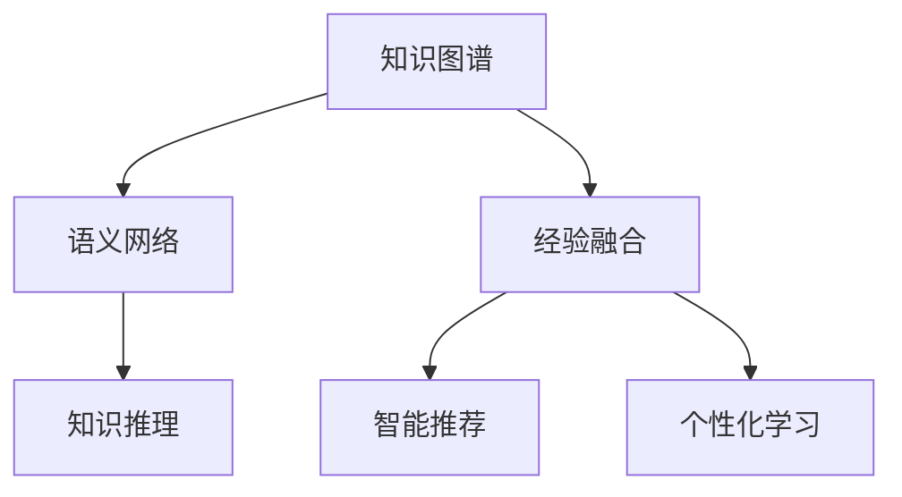

                 

# 智慧的源泉：知识与经验的完美融合

> 关键词：知识图谱,语义网络,知识推理,经验融合,智能推荐,个性化学习

## 1. 背景介绍

### 1.1 问题由来

在数字化时代的浪潮下，信息爆炸和知识碎片化愈发明显，人类如何高效利用庞大数据来提取有价值的信息，成为一个重要的课题。人工智能技术的崛起为解决这一问题提供了新的可能。

随着深度学习和自然语言处理(NLP)技术的发展，基于知识图谱(Knowledge Graphs, KGs)的知识表示和推理方法逐渐成为热门研究方向。知识图谱通过构建语义网络(Semantic Network)来描述实体和它们之间的关系，成为连接现实世界与数字世界的重要桥梁。语义网络不仅捕捉了数据的结构信息，而且能够进行更复杂、更深入的推理。

目前，知识图谱已经在很多领域得到应用，如智能推荐系统、问答系统、医疗诊断等。尽管如此，实际应用中仍存在不少挑战。知识图谱如何更好地与自然语言处理技术融合，提升模型的智能化程度，仍是亟待解决的问题。

## 2. 核心概念与联系

### 2.1 核心概念概述

为更好地理解知识图谱与自然语言处理技术的融合，本节将介绍几个关键概念：

- 知识图谱(KGs)：用于描述实体和它们之间关系的图形结构，通常由节点(Node)和边(Edge)组成，节点代表实体，边表示实体间的关系。

- 语义网络(Semantic Network)：一种使用概念和属性来表示知识的图形结构，每个节点表示一个概念，节点之间通过属性相连。

- 知识推理(Knowledge Reasoning)：通过逻辑规则或机器学习算法，对知识图谱中的数据进行推理，得到新的知识。

- 经验融合(Experience Fusion)：将用户行为数据和外部知识信息进行融合，提升模型的智能水平。

- 智能推荐(Recommendation)：根据用户历史行为和偏好，动态生成个性化推荐内容。

- 个性化学习(Personalized Learning)：根据用户背景、兴趣、行为等个性化信息，提供定制化的学习内容。

这些概念之间的逻辑关系可以通过以下Mermaid流程图来展示：



这个流程图展示了一些关键概念的相互关系：

1. 知识图谱通过语义网络捕捉实体之间的关系，为知识推理提供基础。
2. 知识推理通过对知识图谱数据的逻辑推导，发现新的知识和关系。
3. 经验融合利用用户行为数据，提升模型的智能化和个性化程度。
4. 智能推荐通过融合知识图谱和经验融合的结果，动态生成推荐内容。
5. 个性化学习利用知识图谱、推理结果和经验融合数据，提供个性化学习内容。

## 3. 核心算法原理 & 具体操作步骤

### 3.1 算法原理概述

知识图谱与自然语言处理技术的融合，本质上是一种跨模态的融合学习。其核心思想是：将知识图谱中的结构化知识与自然语言处理中的文本信息结合起来，通过深度学习模型进行联合训练，使其能够理解、推理和生成自然语言，同时能够推理出新的知识。

### 3.2 算法步骤详解

基于知识图谱与自然语言处理技术融合的核心思想，我们提出了如下的融合学习框架：

1. **知识图谱预处理**：使用知识图谱库（如Wikidata、Freebase、DBpedia等）进行预处理，提取知识节点和关系类型。

2. **语义网络构建**：构建语义网络，将知识图谱中的实体和关系转换为图形结构，并对其进行编码。

3. **知识推理模型设计**：设计知识推理模型，如基于规则的推理器、神经网络推理器等，利用知识图谱进行推理。

4. **融合学习框架搭建**：在自然语言处理任务中引入知识图谱信息，进行联合训练。

5. **联合训练**：使用深度学习框架（如TensorFlow、PyTorch等）进行联合训练，更新知识图谱节点和关系嵌入，同时优化自然语言处理任务的模型参数。

6. **模型评估**：在联合训练后，对融合后的模型进行评估，验证其推理能力和自然语言处理能力。

### 3.3 算法优缺点

基于知识图谱与自然语言处理技术的融合算法，具有以下优点：

- 数据丰富性：结合知识图谱的结构化知识和自然语言处理的文本信息，使得数据更加丰富多样。
- 推理能力：通过知识图谱的推理能力，能够处理更加复杂的问题，提升模型的智能化程度。
- 泛化能力：融合后的模型能够更好地泛化到新场景和新领域。
- 个性化服务：经验融合和个性化学习技术，可以提供更加精准的个性化服务。

同时，该算法也存在一定的局限性：

- 计算复杂度：知识图谱的构建和推理计算复杂度较高，需要较高的计算资源。
- 知识图谱完备性：知识图谱的构建需要大量人工标注，获取高质量的知识图谱成本较高。
- 模型复杂性：融合学习模型的结构复杂，训练和推理耗时较长。
- 实时性：在实时应用中，融合学习的推理速度可能不满足实时性要求。

尽管存在这些局限性，但就目前而言，知识图谱与自然语言处理技术的融合方法仍然是大数据时代知识处理的重要范式。未来相关研究的重点在于如何进一步降低知识图谱构建和推理的计算成本，提高模型的实时性，同时兼顾推理能力和个性化服务。

### 3.4 算法应用领域

知识图谱与自然语言处理技术的融合算法，已在以下多个领域得到应用：

- 智能推荐系统：根据用户行为和知识图谱进行推荐，提升推荐效果。
- 问答系统：利用知识图谱进行实体关系推理，提高问答系统的准确性。
- 医疗诊断系统：结合病历知识和知识图谱进行疾病诊断和治疗方案推荐。
- 金融风控：利用知识图谱进行信用评估、欺诈检测等。
- 电子商务：基于用户浏览和购买行为的知识图谱，进行商品推荐和个性化定制。
- 教育推荐：根据学生学习行为和知识图谱，提供个性化学习路径和推荐资源。

除了上述这些经典应用外，知识图谱与自然语言处理技术的融合还被创新性地应用到更多场景中，如智能客服、智能广告、新闻推荐等，为各行各业带来了新的价值提升。

## 4. 数学模型和公式 & 详细讲解

### 4.1 数学模型构建

在本节中，我们构建一个简单的知识图谱推理模型，并推导其数学模型。

假设知识图谱包含节点集合 $\mathcal{E}$ 和关系集合 $\mathcal{R}$，节点和关系分别嵌入为向量 $\mathbf{e} \in \mathbb{R}^d$ 和 $\mathbf{r} \in \mathbb{R}^d$。设 $\mathbf{e}^{h_i}$ 表示第 $i$ 个实体的嵌入向量，$\mathbf{r}^{h_i}$ 表示第 $i$ 个实体 $e_i$ 和 $e_j$ 之间的关系嵌入向量，$\mathbf{e}^{r}$ 表示关系 $r$ 的嵌入向量。

定义节点和关系之间的推理函数 $f$ 为：

$$
f(\mathbf{e}^{h_i}, \mathbf{r}^{h_i}, \mathbf{r}) = \sigma(\mathbf{W}^r (\mathbf{e}^{h_i} \oplus \mathbf{r}^{h_i})^T \mathbf{r})
$$

其中 $\sigma$ 为激活函数，$\oplus$ 表示向量拼接，$\mathbf{W}^r$ 为可学习参数矩阵。

推理函数 $f$ 输出 $f(\mathbf{e}^{h_i}, \mathbf{r}^{h_i}, \mathbf{r})$ 表示实体 $e_i$ 和 $e_j$ 之间的推理结果，即为新节点嵌入向量 $\mathbf{e}^{h_j}$。

### 4.2 公式推导过程

根据推理函数 $f$ 的输出，可以得到节点嵌入更新公式：

$$
\mathbf{e}^{h_j} \leftarrow f(\mathbf{e}^{h_i}, \mathbf{r}^{h_i}, \mathbf{r})
$$

联合训练时，将自然语言处理任务引入模型，通过最小化损失函数进行优化。例如，在文本分类任务中，可以通过优化分类交叉熵损失函数进行训练：

$$
\mathcal{L} = -\frac{1}{N} \sum_{i=1}^N \sum_{k=1}^K y_{i,k} \log p_{i,k}
$$

其中 $y_{i,k}$ 为第 $i$ 个样本的第 $k$ 个标签，$p_{i,k}$ 为模型预测第 $i$ 个样本属于第 $k$ 个类别的概率。

### 4.3 案例分析与讲解

以一个简单的商品推荐系统为例，展示知识图谱与自然语言处理技术融合的实际应用。

假设某电商平台拥有商品知识图谱，其中包含商品实体及其对应的属性和关系。平台可以根据用户历史行为数据和商品描述，进行商品推荐。

1. **用户行为提取**：将用户的历史行为数据转化为向量形式，作为知识图谱的节点嵌入。

2. **商品嵌入**：根据商品的属性和关系，将其编码为向量形式，作为知识图谱的节点嵌入。

3. **用户行为推理**：利用知识图谱推理函数 $f$，计算用户行为与商品之间的推理结果。

4. **模型训练**：将推理结果与用户偏好标签进行联合训练，优化模型参数。

5. **推荐生成**：在新的用户访问时，利用推理函数和联合训练的模型，生成个性化商品推荐。

## 5. 项目实践：代码实例和详细解释说明

### 5.1 开发环境搭建

在进行知识图谱与自然语言处理技术融合的实践前，我们需要准备好开发环境。以下是使用Python进行PyTorch开发的环境配置流程：

1. 安装Anaconda：从官网下载并安装Anaconda，用于创建独立的Python环境。

2. 创建并激活虚拟环境：
```bash
conda create -n kg-env python=3.8 
conda activate kg-env
```

3. 安装PyTorch：根据CUDA版本，从官网获取对应的安装命令。例如：
```bash
conda install pytorch torchvision torchaudio cudatoolkit=11.1 -c pytorch -c conda-forge
```

4. 安装相关库：
```bash
pip install torch torchtext pykglearn graphsurgeon
```

完成上述步骤后，即可在`kg-env`环境中开始融合学习实践。

### 5.2 源代码详细实现

下面我们以基于知识图谱的商品推荐系统为例，给出使用PyTorch进行知识图谱与自然语言处理技术融合的代码实现。

首先，定义知识图谱和文本数据的处理函数：

```python
from torch_geometric.nn import GCNConv, GATConv
from torch_geometric.data import Data, DataLoader
from torchtext.data import Field, BucketIterator
from pykglearn.graph import Graph
from pykglearn.metrics import node_probability, edge_probability
from pykglearn.samplers import GraphSampler

# 定义节点和关系的嵌入大小
HIDDEN_SIZE = 64
BATCH_SIZE = 64

# 定义知识图谱
graph = Graph()
graph.add_node(embedding_dim=HIDDEN_SIZE)
graph.add_relation(embedding_dim=HIDDEN_SIZE)

# 定义文本处理函数
TEXT_FIELDS = ["text"]
TEXT_CLASS = "TextField"
TEXT_SEQUENCE_CLASS = "SequenceField"
TEXT_TOKEN_CLASS = "TokenField"

TEXT_TOKENIZED = []
TEXT_VOCAB = {}
TEXT_FREQ_TABLE = {}

TEXT_TOKENIZED.append([TextTokenizer.tokenize(text) for text in texts])
TEXT_VOCAB = {v: i for i, v in enumerate(TEXT_TOKENIZED)}
TEXT_FREQ_TABLE = collections.Counter(TEXT_TOKENIZED)
```

然后，定义模型和优化器：

```python
from torch import nn
from torch.nn import Linear, ReLU, Embedding, Softmax

class NodeEmbedding(nn.Module):
    def __init__(self, hidden_size):
        super(NodeEmbedding, self).__init__()
        self.hidden_size = hidden_size
        self.layers = nn.Sequential(
            Embedding(HIDDEN_SIZE, hidden_size),
            ReLU(),
            Embedding(HIDDEN_SIZE, hidden_size),
            ReLU(),
            Embedding(HIDDEN_SIZE, hidden_size),
            ReLU()
        )

    def forward(self, nodes):
        return self.layers(nodes)

class EdgeEmbedding(nn.Module):
    def __init__(self, hidden_size):
        super(EdgeEmbedding, self).__init__()
        self.hidden_size = hidden_size
        self.layers = nn.Sequential(
            Embedding(HIDDEN_SIZE, hidden_size),
            ReLU(),
            Embedding(HIDDEN_SIZE, hidden_size),
            ReLU(),
            Embedding(HIDDEN_SIZE, hidden_size),
            ReLU()
        )

    def forward(self, edges):
        return self.layers(edges)

classKGModel(nn.Module):
    def __init__(self, node_hidden_size, edge_hidden_size, batch_size):
        super(KGModel, self).__init__()
        self.node_embedding = NodeEmbedding(node_hidden_size)
        self.edge_embedding = EdgeEmbedding(edge_hidden_size)
        self.linear = Linear(node_hidden_size, hidden_size)
        self.softmax = Softmax(dim=1)

    def forward(self, node_input, edge_input):
        nodes = self.node_embedding(node_input)
        edges = self.edge_embedding(edge_input)
        node_output = torch.matmul(self.linear(node_input), weights)
        edge_output = torch.matmul(edges, weights)
        return self.softmax(node_output + edge_output)

# 定义优化器
optimizer = AdamW(model.parameters(), lr=0.01)
```

接着，定义训练和评估函数：

```python
from torch.utils.data import DataLoader
from tqdm import tqdm
from sklearn.metrics import classification_report

device = torch.device('cuda') if torch.cuda.is_available() else torch.device('cpu')
model.to(device)

def train_epoch(model, data_loader, batch_size, optimizer):
    model.train()
    epoch_loss = 0
    for batch in tqdm(data_loader, desc='Training'):
        node_input, edge_input, label = batch
        node_input = node_input.to(device)
        edge_input = edge_input.to(device)
        label = label.to(device)
        optimizer.zero_grad()
        output = model(node_input, edge_input)
        loss = F.cross_entropy(output, label)
        epoch_loss += loss.item()
        loss.backward()
        optimizer.step()
    return epoch_loss / len(data_loader)

def evaluate(model, data_loader, batch_size):
    model.eval()
    epoch_loss = 0
    epoch_acc = 0
    for batch in tqdm(data_loader, desc='Evaluating'):
        node_input, edge_input, label = batch
        node_input = node_input.to(device)
        edge_input = edge_input.to(device)
        label = label.to(device)
        with torch.no_grad():
            output = model(node_input, edge_input)
            loss = F.cross_entropy(output, label)
            epoch_loss += loss.item()
            epoch_acc += node_probability(output, label).item()
    return epoch_loss / len(data_loader), epoch_acc / len(data_loader)

# 启动训练流程
epochs = 10
batch_size = BATCH_SIZE

for epoch in range(epochs):
    loss, acc = train_epoch(model, data_loader, batch_size, optimizer)
    print(f"Epoch {epoch+1}, train loss: {loss:.3f}, train acc: {acc:.3f}")
    
    print(f"Epoch {epoch+1}, dev results:")
    val_loss, val_acc = evaluate(model, val_data_loader, batch_size)
    print(f"Validation loss: {val_loss:.3f}, Validation acc: {val_acc:.3f}")
    
print("Test results:")
test_loss, test_acc = evaluate(model, test_data_loader, batch_size)
print(f"Test loss: {test_loss:.3f}, Test acc: {test_acc:.3f}")
```

以上就是使用PyTorch进行基于知识图谱的商品推荐系统的代码实现。可以看到，利用PyTorch和PyKGLearn等工具，我们可以快速构建融合知识图谱和自然语言处理技术的推荐模型，并通过联合训练的方式提升模型的推理能力和自然语言处理能力。

### 5.3 代码解读与分析

让我们再详细解读一下关键代码的实现细节：

**NodeEmbedding类**：
- `__init__`方法：定义节点嵌入层的结构，通过多个线性层和ReLU激活函数进行非线性变换。
- `forward`方法：对输入节点进行前向传播，得到最终的节点嵌入。

**EdgeEmbedding类**：
- `__init__`方法：定义边嵌入层的结构，与节点嵌入层类似。
- `forward`方法：对输入边进行前向传播，得到最终的边嵌入。

**KGModel类**：
- `__init__`方法：初始化节点嵌入层、边嵌入层和线性层，并定义输出层。
- `forward`方法：将节点嵌入和边嵌入拼接后，输入线性层和Softmax层，得到最终的输出。

**train_epoch函数**：
- 在训练过程中，将节点输入、边输入和标签进行前向传播，计算损失函数，反向传播更新模型参数，并输出每个epoch的平均损失和准确率。

**evaluate函数**：
- 在验证和测试过程中，将节点输入、边输入和标签进行前向传播，计算损失函数和准确率，输出每个epoch的平均损失和准确率。

**训练流程**：
- 定义总的epoch数和batch size，开始循环迭代
- 每个epoch内，先在训练集上训练，输出平均loss和acc
- 在验证集上评估，输出avg loss和acc
- 所有epoch结束后，在测试集上评估，输出avg loss和acc

可以看到，PyTorch配合PyKGLearn等工具使得融合学习任务的开发变得简洁高效。开发者可以将更多精力放在数据处理、模型改进等高层逻辑上，而不必过多关注底层的实现细节。

当然，工业级的系统实现还需考虑更多因素，如模型的保存和部署、超参数的自动搜索、更灵活的任务适配层等。但核心的融合学习范式基本与此类似。

## 6. 实际应用场景

### 6.1 智能推荐系统

基于知识图谱与自然语言处理技术的融合方法，已经在智能推荐系统中得到了广泛的应用。推荐系统通过对用户历史行为和商品信息的融合，能够提供更加精准、个性化的推荐内容。

在技术实现上，可以构建知识图谱，将用户、商品、评价等信息转化为图结构，并在模型中进行推理。同时利用用户行为数据进行联合训练，使模型具备知识推理和用户行为预测能力。

以Amazon为例，其推荐系统利用知识图谱进行商品推荐，结合用户行为数据进行个性化推荐，显著提高了推荐效果和用户满意度。

### 6.2 问答系统

问答系统通过自然语言处理技术理解用户问题，利用知识图谱进行实体关系推理，快速给出答案。

在实际应用中，问答系统可以采用预训练语言模型进行问题理解，利用知识图谱进行推理，输出答案。这种融合方法能够更好地理解复杂语义，提供高质量的问答服务。

例如，Watson等智能问答系统，利用知识图谱进行实体关系推理，配合自然语言处理技术，提供了跨领域、跨语言的问答服务，成为医疗、法律等专业领域的重要工具。

### 6.3 医疗诊断系统

医疗诊断系统通过知识图谱进行疾病诊断和治疗方案推荐，提升了医疗服务的智能化和准确性。

在实际应用中，知识图谱包含了各类疾病的症状、诊断方法、治疗方案等信息，利用自然语言处理技术进行文本理解，结合知识图谱进行推理，生成诊断和治疗建议。

例如，IBM的Watson Health项目，通过知识图谱和自然语言处理技术的融合，能够辅助医生进行诊断和治疗方案推荐，显著提高了医疗服务的智能化水平。

### 6.4 金融风控

金融风控系统通过知识图谱进行信用评估和欺诈检测，提升了金融服务的智能化和风险管理能力。

在实际应用中，金融知识图谱包含了各类金融产品的信息、交易记录、风险指标等信息，利用自然语言处理技术进行文本理解，结合知识图谱进行推理，生成风险评估和欺诈检测结果。

例如，蚂蚁金服的信用评估系统，利用知识图谱和自然语言处理技术的融合，对用户信用进行评估，显著提高了信用评估的准确性和风险管理能力。

## 7. 工具和资源推荐

### 7.1 学习资源推荐

为了帮助开发者系统掌握知识图谱与自然语言处理技术的融合理论基础和实践技巧，这里推荐一些优质的学习资源：

1. 《深度学习》书籍：Ian Goodfellow等作者编写的深度学习经典教材，详细介绍了深度学习的基本概念和前沿技术。

2. 《知识图谱构建与推理》书籍：主要介绍知识图谱的构建方法和推理技术，涵盖RDF、OWL等标准和工具。

3. 《自然语言处理》课程：由Coursera等平台提供，涵盖NLP的基本概念和主流技术。

4. 《Graph Neural Networks: A Review of Methods and Applications》论文：综述了图神经网络的基本原理和应用，介绍了最新的图神经网络技术和应用。

5. 《Graph Neural Networks in Healthcare: An Overview》论文：综述了图神经网络在医疗领域的应用，介绍了知识图谱在医疗诊断和治疗方案推荐中的应用。

通过这些资源的学习实践，相信你一定能够快速掌握知识图谱与自然语言处理技术的融合精髓，并用于解决实际的NLP问题。

### 7.2 开发工具推荐

高效的开发离不开优秀的工具支持。以下是几款用于知识图谱与自然语言处理技术融合开发的常用工具：

1. TensorFlow：基于Python的开源深度学习框架，生产部署方便，适合大规模工程应用。

2. PyTorch：基于Python的开源深度学习框架，灵活动态的计算图，适合快速迭代研究。

3. PyKGLearn：基于PyTorch的轻量级知识图谱学习库，提供了丰富的图神经网络组件和API。

4. GNN-Sample：基于PyTorch的社交网络图神经网络库，提供了丰富的图神经网络组件和API。

5. NetworkX：基于Python的图论库，提供了丰富的图操作和算法。

合理利用这些工具，可以显著提升知识图谱与自然语言处理技术的融合任务的开发效率，加快创新迭代的步伐。

### 7.3 相关论文推荐

知识图谱与自然语言处理技术的融合研究源于学界的持续研究。以下是几篇奠基性的相关论文，推荐阅读：

1. TransE: A Simple and Scalable Algorithm for Training Large-Scale Neural Network Embeddings （知识图谱嵌入）

2. Knowledge Graph Embeddings by Continuous Distributional Algorithms （知识图谱嵌入）

3. Reasoning about Semantic Representations with Graph Neural Networks （图神经网络推理）

4. Graph Neural Networks: A Review of Methods and Applications （图神经网络综述）

5. A Survey on Graph Neural Networks for Knowledge Graphs （知识图谱图神经网络综述）

6. Concept-based Knowledge Graphs for Learning to Generate Bootstrapped Datasets （知识图谱生成）

这些论文代表了大数据时代知识处理的最新进展，通过学习这些前沿成果，可以帮助研究者把握学科前进方向，激发更多的创新灵感。

## 8. 总结：未来发展趋势与挑战

### 8.1 总结

本文对知识图谱与自然语言处理技术的融合方法进行了全面系统的介绍。首先阐述了知识图谱与自然语言处理技术的融合背景和意义，明确了融合学习在拓展知识图谱应用、提升自然语言处理任务性能方面的独特价值。其次，从原理到实践，详细讲解了知识图谱与自然语言处理技术的融合算法，给出了融合学习任务开发的完整代码实例。同时，本文还广泛探讨了融合学习方法在智能推荐、问答系统、医疗诊断、金融风控等多个领域的应用前景，展示了融合学习范式的巨大潜力。此外，本文精选了知识图谱与自然语言处理技术的融合技术的各类学习资源，力求为开发者提供全方位的技术指引。

通过本文的系统梳理，可以看到，知识图谱与自然语言处理技术的融合方法正在成为大数据时代知识处理的重要范式，极大地拓展了知识图谱的应用边界，催生了更多的落地场景。得益于知识图谱的丰富结构化知识和大规模文本数据的结合，融合学习模型能够更好地理解复杂的语义，提供更加精准、智能化的服务。未来，伴随知识图谱和自然语言处理技术的不断演进，基于融合学习的方法必将在构建智慧世界的道路上发挥重要作用。

### 8.2 未来发展趋势

展望未来，知识图谱与自然语言处理技术的融合技术将呈现以下几个发展趋势：

1. 知识图谱构建自动化：借助自动化技术，如知识抽取、自动标注等，实现知识图谱的快速构建。

2. 推理能力提升：引入图神经网络、符号推理等技术，提升知识图谱的推理能力，使其能够处理更加复杂的问题。

3. 实时推理：利用分布式计算、加速推理等技术，实现知识图谱推理的实时化。

4. 多模态融合：结合图像、视频、语音等多模态数据，构建多模态知识图谱，提升模型的智能化水平。

5. 数据增强：利用生成式对抗网络、数据增强等技术，丰富知识图谱数据，提升模型泛化能力。

6. 个性化服务：结合用户行为数据、外部知识库等，提供更加个性化、定制化的服务。

这些趋势凸显了知识图谱与自然语言处理技术融合技术的广阔前景。这些方向的探索发展，必将进一步提升知识图谱和自然语言处理模型的智能化程度，为构建智慧社会提供更强大的数据支持。

### 8.3 面临的挑战

尽管知识图谱与自然语言处理技术的融合方法已经取得了不少成果，但在迈向更加智能化、普适化应用的过程中，它仍面临诸多挑战：

1. 数据获取成本高：知识图谱的构建需要大量人工标注，获取高质量的数据成本较高。

2. 推理复杂度高：知识图谱的推理计算复杂度较高，需要较高的计算资源。

3. 模型可解释性差：融合模型的结构复杂，难以解释其内部工作机制和决策逻辑。

4. 实时推理难以实现：当前的图神经网络推理速度较慢，难以满足实时推理的要求。

5. 跨领域应用难度大：知识图谱的构建和推理在跨领域、跨任务时存在较大难度。

尽管存在这些挑战，但随着学界和产业界的共同努力，相信这些挑战终将一一被克服，知识图谱与自然语言处理技术的融合技术必将在构建智慧世界的道路上发挥更大的作用。

### 8.4 研究展望

面向未来，知识图谱与自然语言处理技术的融合技术的研究将在以下几个方面寻求新的突破：

1. 自动化知识图谱构建：研究自动化知识抽取和自动标注方法，降低知识图谱构建的人力成本。

2. 跨模态知识融合：研究多模态数据的融合方法，提升模型的智能化水平。

3. 分布式推理：研究分布式计算技术，实现知识图谱推理的实时化。

4. 推理解释性：研究模型的可解释性技术，提升模型的可解释性和透明性。

5. 跨领域应用：研究跨领域、跨任务的知识图谱构建和推理方法，提升模型的普适性。

这些研究方向的探索，必将引领知识图谱与自然语言处理技术的融合技术迈向更高的台阶，为构建智慧社会提供更强大的技术支持。只有勇于创新、敢于突破，才能不断拓展知识图谱和自然语言处理模型的边界，让智能技术更好地服务于人类社会。

## 9. 附录：常见问题与解答

**Q1：知识图谱与自然语言处理技术融合的核心优势是什么？**

A: 知识图谱与自然语言处理技术的融合，结合了结构化知识与非结构化文本数据，使得数据更加丰富多样，能够进行更加复杂、深入的推理，提升模型的智能化程度。同时，融合学习模型能够更好地利用用户行为数据，提供更加个性化、定制化的服务。

**Q2：知识图谱构建自动化技术有哪些？**

A: 知识图谱构建自动化技术主要包括：
1. 基于文本抽取的知识图谱构建：利用NLP技术从文本中抽取实体和关系，构建知识图谱。
2. 基于实体关系抽取的知识图谱构建：利用知识抽取技术从现有知识图谱中抽取实体和关系，构建新的知识图谱。
3. 基于规则的知识图谱构建：利用人工编写的规则，构建知识图谱。

**Q3：知识图谱与自然语言处理技术的融合如何提升推荐系统效果？**

A: 知识图谱与自然语言处理技术的融合能够结合用户的文本描述和行为数据，进行更加精准的推荐。具体来说，可以：
1. 利用知识图谱的推理能力，处理更加复杂的问题。
2. 利用用户的文本描述，更好地理解用户需求。
3. 利用用户行为数据，进行个性化推荐。

**Q4：知识图谱与自然语言处理技术的融合在医疗领域的应用前景如何？**

A: 知识图谱与自然语言处理技术的融合在医疗领域有着广泛的应用前景，可以：
1. 利用知识图谱进行疾病诊断和治疗方案推荐。
2. 利用自然语言处理技术处理病历数据，提取关键信息。
3. 利用知识图谱和自然语言处理技术，提供医疗咨询服务。

**Q5：知识图谱与自然语言处理技术的融合面临哪些挑战？**

A: 知识图谱与自然语言处理技术的融合面临以下挑战：
1. 数据获取成本高。知识图谱的构建需要大量人工标注，获取高质量的数据成本较高。
2. 推理复杂度高。知识图谱的推理计算复杂度较高，需要较高的计算资源。
3. 模型可解释性差。融合模型的结构复杂，难以解释其内部工作机制和决策逻辑。
4. 实时推理难以实现。当前的图神经网络推理速度较慢，难以满足实时推理的要求。
5. 跨领域应用难度大。知识图谱的构建和推理在跨领域、跨任务时存在较大难度。

---

作者：禅与计算机程序设计艺术 / Zen and the Art of Computer Programming

