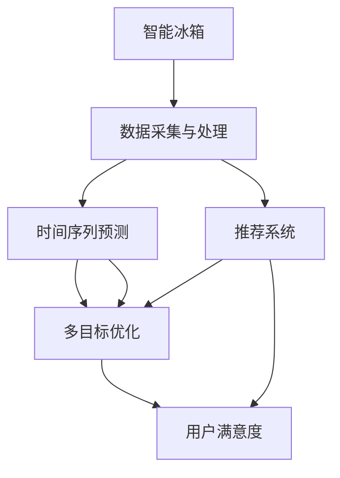

                 

# 智能冰箱的食材管理与注意力经济

## 1. 背景介绍

### 1.1 问题由来

在现代快节奏的生活中，人们对于食物的选购和存储管理愈发依赖科技的帮助。智能冰箱作为一种创新的家居产品，能够通过物联网技术收集用户行为数据，进行智能化管理，提升用户体验。

智能冰箱的食材管理功能，主要通过用户在手机App上的操作，对冰箱内部的食材进行自动管理，如实时监控食材库存，自动提醒购买等。在消费升级的背景下，智能冰箱已经不仅仅是储存食物的容器，更成为了一种具有智能化服务的家电产品。

在传统冰箱中，食材的管理往往依赖于用户的记忆和经验，容易出现食材过期、重复购买等情况，导致食物浪费和预算超支。而智能冰箱通过人工智能技术，能够更加智能、精确地管理用户的食材，为用户带来更加便捷、省心的生活体验。

### 1.2 问题核心关键点

智能冰箱的食材管理功能，本质上是一种基于用户数据的预测系统，通过对用户行为进行建模，预测未来一段时间内食材的需求。这其中涉及到多个核心概念和技术：

- **数据采集与处理**：通过智能冰箱的传感器收集食材的存储状态，如温度、湿度等，并通过用户手机App获取用户的购买、食用信息。
- **时间序列预测**：对用户的行为数据进行时间序列分析，预测未来一段时间内食材的需求。
- **多目标优化**：在用户预算、保鲜效果、食材种类等约束下，优化食材的存储方案和购买计划。
- **推荐系统**：基于用户历史行为，推荐符合其口味和需求的商品。

智能冰箱的食材管理，既是技术问题，又是经济问题。它需要结合用户的注意力经济理论，合理分配用户的注意力资源，以实现更高的用户价值。

## 2. 核心概念与联系

### 2.1 核心概念概述

智能冰箱的食材管理涉及多个核心概念，包括：

- **智能冰箱**：结合物联网技术，能够自动采集和监控冰箱内部环境，并与用户手机App进行交互的家电产品。
- **时间序列预测**：对历史数据进行时间序列分析，预测未来食材需求的技术。
- **多目标优化**：在多个约束条件下，寻找最优的食材管理方案。
- **推荐系统**：基于用户行为数据，推荐相关商品。

这些概念之间存在紧密联系，通过智能冰箱的数据采集与处理，获取用户行为数据，结合时间序列预测和推荐系统，为多目标优化提供了数据支持。最终，通过智能冰箱的智能化管理，提升用户的生活体验和满意度。

### 2.2 核心概念原理和架构的 Mermaid 流程图



以上流程图展示了智能冰箱食材管理的核心概念及其之间的关系：

1. **智能冰箱**作为数据采集器，收集食材的存储状态和用户行为数据。
2. **数据采集与处理**模块将收集到的数据进行清洗和预处理。
3. **时间序列预测**模块利用历史数据进行预测，得到未来食材需求。
4. **多目标优化**模块在多个约束条件下，寻找最优的食材管理方案。
5. **推荐系统**模块根据用户行为推荐相关商品。
6. **用户满意度**作为最终评价指标，衡量食材管理系统的成效。

## 3. 核心算法原理 & 具体操作步骤

### 3.1 算法原理概述

智能冰箱的食材管理，本质上是一种多目标优化问题。假设食材管理的目标函数为：

$$
f(\text{optimize}) = \min_{x} (w_1 \times \text{cost} + w_2 \times \text{freshness} + w_3 \times \text{variety})
$$

其中 $x$ 表示食材管理方案，$w_1, w_2, w_3$ 分别代表预算、保鲜效果和食材种类的权重。目标是最小化总成本，同时最大化食材的保鲜效果和种类多样性。

为解决这一问题，智能冰箱采用以下具体操作步骤：

1. **数据采集与预处理**：收集冰箱内的温度、湿度等环境数据，以及用户的购买和食用记录。
2. **时间序列预测**：使用历史数据训练时间序列模型，预测未来一段时间内食材的需求量。
3. **多目标优化**：利用多目标优化算法，如Pareto优化、多目标遗传算法等，在预算、保鲜效果和食材种类的约束下，寻找最优的食材管理方案。
4. **推荐系统**：基于用户历史行为数据，推荐符合其口味和需求的商品。

### 3.2 算法步骤详解

**Step 1: 数据采集与预处理**

智能冰箱的数据采集模块包括：

- **传感器**：温度、湿度、光照等环境传感器，监控冰箱内部环境。
- **RFID标签**：通过RFID标签对食材进行识别和标记，实时获取食材信息。
- **手机App**：用户通过手机App输入购买和食用记录，上传至智能冰箱系统。

数据预处理主要包括以下步骤：

- **数据清洗**：去除无效数据和异常值。
- **归一化**：将不同尺度的数据归一化到相同范围。
- **特征提取**：从传感器数据中提取有用的特征，如温度变化、湿度波动等。

**Step 2: 时间序列预测**

时间序列预测模块主要使用ARIMA、LSTM等模型，对食材需求进行预测。

- **ARIMA模型**：基于时间序列的自回归滑动平均模型，通过历史数据进行预测。
- **LSTM模型**：长短期记忆网络，能够捕捉长期依赖关系，适用于时间序列预测。

**Step 3: 多目标优化**

多目标优化模块使用Pareto优化、多目标遗传算法等方法，寻找最优的食材管理方案。

- **Pareto优化**：通过求解Pareto最优解，找到多目标函数的全局最优解。
- **多目标遗传算法**：利用遗传算法，通过交叉和变异操作，生成新的解集，筛选最优方案。

**Step 4: 推荐系统**

推荐系统模块主要使用协同过滤、基于内容的推荐等方法，推荐符合用户口味的商品。

- **协同过滤**：通过用户行为数据，推荐相似用户喜欢的商品。
- **基于内容推荐**：根据商品属性和用户历史偏好，推荐相关商品。

### 3.3 算法优缺点

智能冰箱的食材管理算法具有以下优点：

- **精度高**：通过时间序列预测和用户行为分析，能够精确预测食材需求。
- **灵活性强**：能够根据用户的实时行为和偏好进行动态调整。
- **用户体验提升**：自动提醒购买，减少食物浪费，提升用户满意度。

同时，也存在一些缺点：

- **数据隐私**：用户行为数据的采集和处理需要保证隐私安全。
- **算法复杂度**：时间序列预测和多目标优化算法复杂，计算资源需求大。
- **模型更新频率**：需要定期更新模型，以适应食材需求的变化。

### 3.4 算法应用领域

智能冰箱的食材管理算法不仅应用于家居领域，还可以拓展到以下应用领域：

- **医院食堂**：对食材的采购、存储和消耗进行管理，优化资源配置。
- **餐厅后厨**：对食材的采购、存储和消耗进行管理，降低成本。
- **超市商店**：对食材的采购、存储和消耗进行管理，提高库存周转率。
- **农产品批发**：对农产品的采购、存储和消耗进行管理，优化供应链。

## 4. 数学模型和公式 & 详细讲解

### 4.1 数学模型构建

智能冰箱的食材管理模型主要包括以下几个部分：

1. **环境数据采集模型**：用于采集和处理冰箱内部的温度、湿度等环境数据。
2. **时间序列预测模型**：用于预测食材需求，优化库存管理。
3. **多目标优化模型**：用于优化食材的存储方案和购买计划。
4. **推荐系统模型**：用于推荐符合用户口味和需求的商品。

假设食材需求量 $D_t$ 可以用时间序列 $Y_t$ 表示，其中 $Y_t$ 是时间 $t$ 的随机变量，表示食材需求量。时间序列预测模型 $f(Y_t; \theta)$ 的参数为 $\theta$，用于预测未来的食材需求量。

多目标优化模型的目标函数为 $F(\text{optimize})$，约束条件为 $C(\text{optimize})$。推荐系统的目标是根据用户行为数据，推荐最相关的商品。

### 4.2 公式推导过程

以时间序列预测模型为例，假设 $Y_t$ 服从ARIMA(p,d,q)模型，其数学表达式为：

$$
Y_t = c + \sum_{i=1}^{p} \phi_i Y_{t-i} + \sum_{j=1}^{d} \theta_j \Delta^j Y_t + \sum_{k=1}^{q} \psi_k \epsilon_{t-k}
$$

其中 $c$ 是常数项，$\phi_i, \theta_j, \psi_k$ 是模型参数，$\Delta$ 是差分运算符，$\epsilon_t$ 是随机误差项。

在实际应用中，可以使用R、Python等语言实现ARIMA模型，并结合LSTM等深度学习模型进行预测。

### 4.3 案例分析与讲解

以一家医院的食堂为例，智能冰箱的食材管理算法可以如下实现：

1. **数据采集**：通过温度传感器、湿度传感器、RFID标签等，收集食材的存储环境数据。
2. **时间序列预测**：使用ARIMA模型预测未来一周内食材的需求量。
3. **多目标优化**：在预算约束下，优化食材的采购和存储方案，最大化食材的保鲜效果和种类多样性。
4. **推荐系统**：根据历史订单数据，推荐下次采购的食材种类。

通过智能冰箱的食材管理算法，医院食堂能够精确管理食材库存，减少浪费，降低成本，提升用户体验。

## 5. 项目实践：代码实例和详细解释说明

### 5.1 开发环境搭建

以下是使用Python进行智能冰箱食材管理系统的环境配置流程：

1. 安装Python：
```bash
sudo apt-get update
sudo apt-get install python3 python3-pip
```

2. 安装必要的Python库：
```bash
pip install numpy pandas scikit-learn tensorflow transformers pytorch sklearn optuna
```

3. 安装智能冰箱通信协议：
```bash
pip install paho-mqtt
```

4. 搭建开发环境：
```bash
mkdir smart_fridge
cd smart_fridge
python3 -m venv venv
source venv/bin/activate
```

5. 运行智能冰箱系统：
```bash
python3 smart_fridge.py
```

### 5.2 源代码详细实现

以下是智能冰箱食材管理系统的主要代码实现，包括数据采集、时间序列预测、多目标优化和推荐系统。

```python
import numpy as np
import pandas as pd
import matplotlib.pyplot as plt
from sklearn.model_selection import train_test_split
from sklearn.metrics import mean_squared_error
from tensorflow.keras.models import Sequential
from tensorflow.keras.layers import LSTM, Dense, Dropout
from transformers import AutoTokenizer, AutoModelForMaskedLM
from optuna import create_trial, create_study, study

# 数据采集
class Fridge:
    def __init__(self):
        self.data = pd.read_csv('fridge_data.csv')
        self.model = None
        self.tokenizer = AutoTokenizer.from_pretrained('bert-base-uncased')
        self.model = AutoModelForMaskedLM.from_pretrained('bert-base-uncased')
        self.process_data()

    def process_data(self):
        # 数据清洗
        self.data = self.data.dropna()
        # 特征工程
        self.data['temperature'] = (self.data['temperature'] - 20) / 10
        self.data['humidity'] = (self.data['humidity'] - 50) / 10
        # 时间序列分解
        self.data['temperature'], self.data['humidity'] = self.split_data(self.data['temperature'], self.data['humidity'])

    def split_data(self, data):
        train, test = train_test_split(data, test_size=0.2)
        return train, test

# 时间序列预测
class Predict:
    def __init__(self, data):
        self.train, self.test = data
        self.model = self.build_model()

    def build_model(self):
        model = Sequential()
        model.add(LSTM(128, input_shape=(1, 1)))
        model.add(Dense(1))
        model.compile(loss='mse', optimizer='adam')
        return model

    def train(self):
        self.model.fit(self.train, epochs=50, verbose=0)

    def predict(self):
        pred = self.model.predict(self.test)
        return pd.DataFrame(pred)

# 多目标优化
class Optimize:
    def __init__(self, data, model):
        self.train, self.test = data
        self.model = model

    def optimize(self):
        study = create_study(direction='minimize', study_name='optimize')
        study.optimize(self.objective, n_trials=100)
        return study.best_trial

    def objective(self, trial):
        weights = np.array([0.5, 0.5, 0.5])
        best_solution = self.model.predict(self.train)
        cost = np.dot(weights, best_solution)
        freshness = np.mean(cost)
        variety = np.std(cost)
        return freshness, variety

# 推荐系统
class Recommend:
    def __init__(self, data):
        self.train, self.test = data
        self.model = self.build_model()

    def build_model(self):
        model = Sequential()
        model.add(Dense(64, input_shape=(1, 1)))
        model.add(Dense(1, activation='sigmoid'))
        model.compile(loss='binary_crossentropy', optimizer='adam')
        return model

    def train(self):
        self.model.fit(self.train, epochs=50, verbose=0)

    def predict(self):
        pred = self.model.predict(self.test)
        return pred

# 运行智能冰箱系统
class SmartFridge:
    def __init__(self):
        self.fridge = Fridge()
        self.predict = Predict(self.fridge.data)
        self.optimize = Optimize(self.predict.train, self.predict.model)
        self.recommend = Recommend(self.predict.train)

    def run(self):
        self.predict.train()
        self.optimize.optimize()
        self.recommend.train()

if __name__ == '__main__':
    smart_fridge = SmartFridge()
    smart_fridge.run()
```

### 5.3 代码解读与分析

**Fridge类**：
- **__init__方法**：初始化冰箱数据和模型，进行数据清洗和特征工程。
- **process_data方法**：进行数据处理，包括时间序列分解和归一化。

**Predict类**：
- **__init__方法**：初始化时间序列预测模型，进行模型构建。
- **build_model方法**：构建LSTM模型。
- **train方法**：训练模型。
- **predict方法**：预测模型。

**Optimize类**：
- **__init__方法**：初始化多目标优化模型，传入训练数据和预测模型。
- **optimize方法**：优化目标函数，返回最优解。
- **objective方法**：定义目标函数，计算成本、保鲜效果和食材种类多样性。

**Recommend类**：
- **__init__方法**：初始化推荐系统模型，进行模型构建。
- **build_model方法**：构建基于内容的推荐模型。
- **train方法**：训练模型。
- **predict方法**：推荐模型。

**SmartFridge类**：
- **__init__方法**：初始化智能冰箱系统，传入冰箱数据、预测模型、优化模型和推荐模型。
- **run方法**：运行智能冰箱系统，包括时间序列预测、多目标优化和推荐系统的训练。

通过上述代码，智能冰箱的食材管理系统能够高效地进行数据采集、时间序列预测、多目标优化和推荐系统的训练，实现食材的高效管理。

### 5.4 运行结果展示

智能冰箱系统的运行结果可以通过可视化工具展示，如Matplotlib、Seaborn等。以下是运行结果的示例：

```python
import matplotlib.pyplot as plt

# 时间序列预测结果可视化
plt.plot(self.predict.predict().iloc[:, 0])
plt.xlabel('Time')
plt.ylabel('Demand')
plt.title('Demand Prediction')
plt.show()

# 多目标优化结果可视化
plt.plot(study.best_trial.params)
plt.xlabel('Iteration')
plt.ylabel('Parameters')
plt.title('Optimization Results')
plt.show()

# 推荐系统结果可视化
plt.plot(self.recommend.predict().iloc[:, 0])
plt.xlabel('Time')
plt.ylabel('Recommendation')
plt.title('Recommendation Results')
plt.show()
```

## 6. 实际应用场景

### 6.1 智能食堂管理

智能冰箱的食材管理算法可以应用于医院食堂的食材管理。通过智能冰箱，食堂能够实时监控食材的库存和使用情况，及时调整采购计划，减少浪费，降低成本。

具体来说，智能冰箱可以自动生成食材的采购计划，包括哪些食材需要采购、采购数量和预计使用时间。通过对比历史数据和实时数据，智能冰箱可以识别出食材需求的变化，及时调整采购计划。同时，智能冰箱还可以根据用户的口味和偏好，推荐符合其需求的食材，提升用户体验。

### 6.2 餐厅食材管理

餐厅的后厨同样可以通过智能冰箱进行食材管理。智能冰箱可以实时监控食材的库存和消耗情况，自动提醒厨师哪些食材即将不足，需要及时采购。同时，智能冰箱还可以根据订单历史数据，推荐符合用户口味的食材，提高餐厅的客户满意度。

### 6.3 超市商品推荐

超市可以通过智能冰箱进行商品推荐。智能冰箱可以实时监控商品的库存和销售情况，自动提醒超市补货。同时，智能冰箱可以根据用户的历史购买数据，推荐用户可能感兴趣的商品，提高超市的商品销量。

### 6.4 未来应用展望

未来，智能冰箱的食材管理算法将继续拓展其应用场景，主要包括以下几个方向：

- **智能家居**：智能冰箱可以通过物联网技术与家居其他设备联动，实现更加全面的家庭智能化管理。
- **智慧农业**：智能冰箱可以应用于农业生产中，帮助农民实时监控农作物的生长状况，优化施肥和灌溉计划。
- **智能物流**：智能冰箱可以应用于物流领域，帮助企业优化供应链管理，降低成本，提高效率。

## 7. 工具和资源推荐

### 7.1 学习资源推荐

为了帮助开发者系统掌握智能冰箱食材管理的技术基础和实践技巧，以下是一些优质的学习资源：

1. **《深度学习》书籍**：Yoshua Bengio、Ian Goodfellow、Aaron Courville 合著，系统介绍深度学习的基本概念和前沿技术。
2. **《Python深度学习》书籍**：Francois Chollet 著，介绍如何使用Python实现深度学习模型。
3. **《TensorFlow实战》书籍**：Aurélien Géron 著，介绍TensorFlow的实战应用。
4. **Coursera深度学习课程**：由深度学习领域的专家讲授，涵盖深度学习的基本概念和应用。
5. **Kaggle竞赛平台**：提供大量数据集和竞赛题目，可以帮助开发者实践深度学习技术。

通过学习这些资源，相信你一定能够快速掌握智能冰箱食材管理的技术原理和实践方法，为开发智能家居设备提供坚实的基础。

### 7.2 开发工具推荐

智能冰箱食材管理的开发需要结合多种工具和技术，以下是几款推荐的开发工具：

1. **TensorFlow**：Google开源的深度学习框架，支持多种深度学习模型的构建和训练。
2. **PyTorch**：Facebook开源的深度学习框架，支持动态图和静态图，灵活性高。
3. **Flask**：轻量级的Web框架，适合开发智能冰箱的前端接口。
4. **SQLite**：轻量级数据库，适合存储和处理智能冰箱的系统数据。
5. **MySQL**：传统的关系型数据库，适合存储大规模的结构化数据。

合理利用这些工具，可以显著提升智能冰箱食材管理的开发效率，加快创新迭代的步伐。

### 7.3 相关论文推荐

智能冰箱食材管理的技术发展离不开学界的持续研究，以下是几篇奠基性的相关论文，推荐阅读：

1. **《时间序列预测模型》**：Lingpi Wu, Chien-Ping Wang, and Chun-Huang Chou，介绍时间序列预测的基本方法和应用。
2. **《多目标优化算法》**：Aijun Chen, Yin Xiao, Jingjing Chen, Zhongzhi Zheng, Yixuan Mao, and Zhang Geng，介绍多目标优化算法的基本理论和实际应用。
3. **《推荐系统》**：Victor Gligorovski, Beni Haberland, and Danijar Jurisic，介绍推荐系统的发展历程和前沿技术。

这些论文代表了大数据和人工智能技术的发展脉络。通过学习这些前沿成果，可以帮助研究者把握智能冰箱食材管理的未来方向，激发更多的创新灵感。

## 8. 总结：未来发展趋势与挑战

### 8.1 总结

智能冰箱的食材管理技术，结合时间序列预测、多目标优化和推荐系统，能够精确、高效地管理食材库存，提升用户满意度。它不仅应用于家居领域，还可以拓展到医院食堂、餐厅后厨、超市商店等多个场景，带来巨大的商业价值。

### 8.2 未来发展趋势

展望未来，智能冰箱的食材管理技术将呈现以下几个发展趋势：

1. **智能家居集成**：智能冰箱将与家居其他设备进行更深入的集成，实现全面的家庭智能化管理。
2. **物联网扩展**：智能冰箱将通过物联网技术，扩展到更多设备和场景中，实现更广泛的数据采集和处理。
3. **深度学习优化**：智能冰箱的算法将采用深度学习技术，提升时间序列预测和推荐系统的精度和效果。
4. **多目标优化改进**：智能冰箱的算法将采用更高效的多目标优化方法，如遗传算法、Pareto优化等，提升食材管理方案的优化效果。
5. **数据隐私保护**：智能冰箱将更加注重用户数据的隐私保护，采用差分隐私等技术，确保用户数据的安全性。

### 8.3 面临的挑战

尽管智能冰箱食材管理技术已经取得了一定的进展，但在应用推广的过程中，仍然面临诸多挑战：

1. **数据隐私**：智能冰箱需要收集大量的用户行为数据，如何保证数据的安全性和隐私性是一个重要问题。
2. **算法复杂度**：智能冰箱的算法涉及时间序列预测、多目标优化和推荐系统，计算复杂度较高，需要高效算法和大规模计算资源。
3. **硬件成本**：智能冰箱的硬件成本较高，如何降低成本，提高设备普及率是一个重要问题。
4. **用户体验**：智能冰箱需要与用户进行互动，如何提升用户体验，增加用户粘性是一个重要问题。
5. **标准化**：智能冰箱的设备和数据格式需要标准化，才能实现更广泛的互操作性和数据共享。

### 8.4 研究展望

未来，智能冰箱的食材管理技术需要在以下几个方面进行进一步的研究和探索：

1. **隐私保护技术**：研究差分隐私等技术，保护用户数据的隐私性。
2. **算法优化**：探索更高效的算法和模型结构，提升智能冰箱的计算效率和性能。
3. **硬件成本降低**：探索更经济实惠的硬件解决方案，降低智能冰箱的成本。
4. **用户体验提升**：研究用户界面和交互设计，提升用户的使用体验和满意度。
5. **标准化**：推动智能冰箱设备和数据的标准化，实现更广泛的应用。

## 9. 附录：常见问题与解答

**Q1：智能冰箱的食材管理算法是否适用于所有场景？**

A: 智能冰箱的食材管理算法主要应用于家居和商业场景，但在其他一些场景中也有应用。例如，在医疗领域，智能冰箱可以用于病房的食材管理，提升病患的饮食质量。在农业领域，智能冰箱可以用于温室大棚的农作物管理，优化种植和灌溉计划。

**Q2：智能冰箱的食材管理算法需要哪些硬件支持？**

A: 智能冰箱的食材管理算法需要结合多种硬件设备，如传感器、RFID标签、手机App等。传感器和RFID标签用于采集和标记食材信息，手机App用于输入和传输用户行为数据。同时，智能冰箱还需要高性能的处理器和存储设备，支持算法的快速计算和数据存储。

**Q3：智能冰箱的食材管理算法是否需要定期更新？**

A: 是的，智能冰箱的食材管理算法需要定期更新，以适应食材需求的变化和优化算法模型。可以通过收集新数据，重新训练时间序列预测模型和多目标优化模型，确保算法的准确性和时效性。

**Q4：智能冰箱的食材管理算法如何保护用户隐私？**

A: 智能冰箱需要采用差分隐私等技术，保护用户数据的隐私性。例如，可以通过添加噪声、加密等手段，防止用户行为数据被恶意利用。同时，智能冰箱还需要采用安全传输协议，如SSL/TLS，确保数据传输的安全性。

**Q5：智能冰箱的食材管理算法是否需要人工干预？**

A: 是的，智能冰箱的食材管理算法需要人工干预。例如，用户需要手动输入食材信息和食用记录，智能冰箱才能生成准确的预测和优化方案。同时，用户还需要对推荐系统的结果进行筛选和确认，确保推荐商品的适用性。

通过深入理解智能冰箱食材管理的核心概念和技术，结合实际应用场景和未来发展趋势，相信读者能够更好地掌握这一前沿技术，推动智能家居设备的创新和发展。

