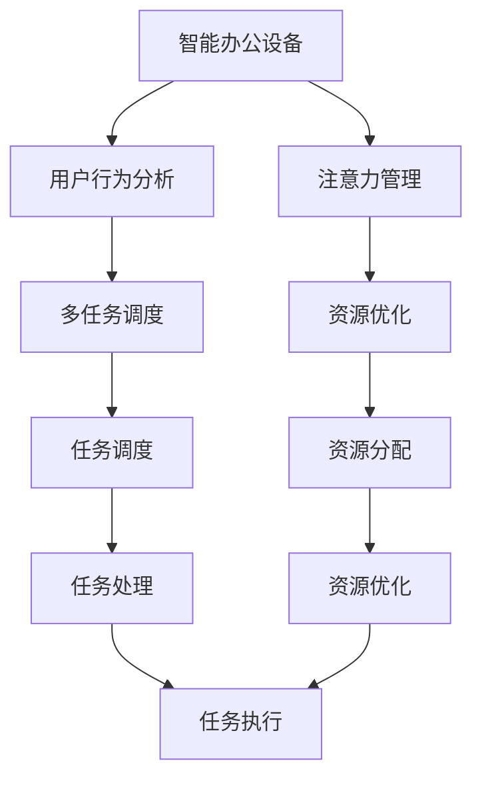

                 

# 智能办公设备的注意力管理功能

> 关键词：
- 智能办公设备
- 注意力管理
- 用户行为分析
- 多任务调度
- 资源优化
- 自动化
- 用户交互
- 工作效率提升

## 1. 背景介绍

### 1.1 问题由来
随着人工智能技术的迅猛发展，智能办公设备逐渐普及，大大提升了办公效率。然而，用户在使用这些设备时往往面临多任务处理、注意力分散等挑战，导致工作效率低下，甚至产生工作疲劳。因此，如何有效管理用户注意力，提升工作质量，成为当下智能办公设备领域亟待解决的问题。

### 1.2 问题核心关键点
在当前智能办公设备中，注意力管理功能是提高用户工作效率和体验的重要手段。通过识别用户工作模式、动态调整设备状态，智能办公设备可以显著提升用户专注度和任务处理效率。具体来说，核心关键点包括：

- **用户行为识别**：通过分析用户操作、使用时间、工作节奏等行为数据，识别用户的工作状态。
- **任务调度优化**：根据用户当前工作状态，动态调整任务处理顺序和分配资源。
- **多任务并行处理**：支持用户在同一时间内处理多个任务，提高任务处理效率。
- **资源优化**：智能分配处理器、内存、存储等资源，避免资源浪费和冲突。

### 1.3 问题研究意义
研究智能办公设备的注意力管理功能，对于提升办公设备的智能化水平，提高用户工作效率和体验，具有重要意义：

- 提升用户专注度。通过动态调整设备状态，帮助用户减少分心，集中注意力完成任务。
- 优化工作流程。智能调整任务处理顺序和资源分配，提升工作流畅度，减少等待时间。
- 增强用户体验。提供个性化的工作支持，使用户感到被理解和尊重，提升满意度。
- 助力工作效率。通过合理分配和利用设备资源，优化工作方式，提升整体工作效率。
- 促进技术应用。为其他智能设备和管理系统提供参考，推动智能办公技术的广泛应用。

## 2. 核心概念与联系

### 2.1 核心概念概述

为更好地理解智能办公设备注意力管理功能的实现，本节将介绍几个关键概念：

- **智能办公设备**：使用人工智能技术实现自动化和智能化的办公设备，如智能会议系统、智能文档处理设备、智能办公机器人等。
- **注意力管理**：通过分析用户行为和注意力状态，智能调整设备功能和服务，提升用户专注度和工作效率。
- **用户行为分析**：通过采集用户操作数据、使用时间等行为信息，分析用户的工作模式和习惯。
- **多任务调度**：在设备上同时处理多个任务，合理安排任务顺序和资源分配。
- **资源优化**：智能分配处理器、内存、存储等资源，避免资源冲突和浪费。
- **自动化**：使用AI技术自动执行任务，减少人工干预，提升设备智能化程度。

这些核心概念之间的逻辑关系可以通过以下Mermaid流程图来展示：



这个流程图展示了一些核心概念及其之间的关系：

1. 智能办公设备通过用户行为分析识别用户工作状态。
2. 根据识别到的工作状态，进行多任务调度和资源优化。
3. 任务调度和资源优化最终通过任务处理和资源分配实现。
4. 资源优化和任务调度相结合，提升设备的自动化程度。

这些概念共同构成了智能办公设备注意力管理的实现框架，使得设备能够更加智能地服务于用户，提升办公效率和体验。

## 3. 核心算法原理 & 具体操作步骤
### 3.1 算法原理概述

智能办公设备中的注意力管理功能主要基于用户行为分析、多任务调度和资源优化三大核心算法。通过这些算法，设备能够动态调整功能和服务，提高用户专注度和工作效率。

### 3.2 算法步骤详解

**Step 1: 用户行为分析**

用户行为分析通过采集用户的操作数据、使用时间等行为信息，分析用户的工作模式和习惯。具体步骤包括：

- 数据采集：通过日志记录、屏幕录像等方式，收集用户的操作数据和使用时间。
- 行为识别：使用机器学习算法分析用户行为，识别用户的工作状态，如专注、休息、高负荷等。
- 行为预测：根据历史行为数据，预测用户未来的工作模式，为后续任务调度提供参考。

**Step 2: 多任务调度**

多任务调度根据用户工作状态，动态调整任务处理顺序和资源分配。具体步骤包括：

- 任务排队：将所有任务按照优先级和紧急程度进行排队，等待处理。
- 任务分配：根据用户当前工作状态和设备资源情况，动态调整任务处理顺序，优先处理重要或紧急任务。
- 任务执行：按照调整后的顺序，依次执行任务，确保任务按时完成。

**Step 3: 资源优化**

资源优化通过智能分配处理器、内存、存储等资源，避免资源冲突和浪费。具体步骤包括：

- 资源监控：实时监控设备资源使用情况，如处理器占用率、内存使用率等。
- 资源调整：根据任务需求和资源监控结果，动态调整资源分配策略，如调整内存分配大小、优化处理器调度等。
- 资源优化：通过资源调整和调度，提高设备的工作效率和稳定性。

### 3.3 算法优缺点

智能办公设备中的注意力管理功能具有以下优点：

1. 提升用户专注度。通过动态调整设备状态，帮助用户减少分心，集中注意力完成任务。
2. 优化工作流程。智能调整任务处理顺序和资源分配，提升工作流畅度，减少等待时间。
3. 增强用户体验。提供个性化的工作支持，使用户感到被理解和尊重，提升满意度。
4. 助力工作效率。通过合理分配和利用设备资源，优化工作方式，提升整体工作效率。
5. 促进技术应用。为其他智能设备和管理系统提供参考，推动智能办公技术的广泛应用。

同时，该功能也存在一定的局限性：

1. 数据隐私问题。用户行为分析需要采集大量的个人信息，可能存在隐私泄露的风险。
2. 算法复杂度高。多任务调度和资源优化涉及复杂的决策过程，需要高性能的计算资源。
3. 用户体验依赖。如果用户习惯或期望与系统推荐不一致，可能会导致用户体验下降。
4. 实时性要求高。设备需要实时处理大量数据，对硬件和软件的要求较高。

尽管存在这些局限性，但就目前而言，智能办公设备中的注意力管理功能仍是一种有效的提高工作效率和管理用户注意力的手段。

### 3.4 算法应用领域

智能办公设备中的注意力管理功能在多个领域得到了广泛应用，例如：

- **智能会议系统**：通过分析参会人员的互动和发言情况，智能调整会议流程和资源分配，提升会议效率。
- **智能文档处理设备**：根据用户的操作习惯，智能调整文档编辑和浏览顺序，提升文档处理效率。
- **智能办公机器人**：通过分析用户的工作模式，智能调度机器人任务，提升办公自动化水平。
- **智能会议室管理**：根据会议室使用情况和人员安排，动态调整会议室设备和资源，提升会议室使用效率。
- **智能数据中心**：根据数据处理任务的需求，智能分配和优化计算资源，提升数据处理速度和效率。

这些应用场景展示了智能办公设备注意力管理功能的广泛适用性和高效性。随着技术的不断进步，该功能将在更多领域得到应用，为智能办公提供更全面的支持。

## 4. 数学模型和公式 & 详细讲解 & 举例说明
### 4.1 数学模型构建

本节将使用数学语言对智能办公设备注意力管理功能的实现进行更加严格的刻画。

记用户工作状态为 $S$，任务集为 $T$，资源集为 $R$，设备状态为 $M$。用户行为分析的目标是预测用户当前工作状态 $S_t$，多任务调度的目标是优化任务处理顺序 $T_t$，资源优化的目标是调整资源分配 $R_t$。设备状态 $M_t$ 表示当前设备的资源使用情况和任务执行情况。

定义用户行为分析模型为 $A(S_{t-1}, S_{t-2}, ..., S_0)$，多任务调度模型为 $T(S_t, M_t)$，资源优化模型为 $R(M_t, S_t)$。用户行为分析模型的输出为当前工作状态 $S_t$，多任务调度模型的输出为任务处理顺序 $T_t$，资源优化模型的输出为资源分配 $R_t$。

设备状态 $M_t$ 可以表示为：

$$
M_t = M_{t-1} + T_t + R_t
$$

其中 $M_{t-1}$ 表示上一时刻设备状态，$T_t$ 表示当前时刻任务处理情况，$R_t$ 表示当前时刻资源分配情况。

### 4.2 公式推导过程

以下我们以智能会议系统为例，推导用户行为分析和多任务调度的数学模型。

假设会议系统中有 $N$ 个参会人员，每个人的操作时间序列为 $O_i = (o_{i1}, o_{i2}, ..., o_{in})$，其中 $o_{ij}$ 表示第 $i$ 个人在第 $j$ 个时间步的操作行为。

定义用户行为分析模型 $A(O_i, T_i)$，其中 $T_i$ 表示第 $i$ 个人在 $t$ 时刻的任务处理情况。$A(O_i, T_i)$ 的目标是预测 $t+1$ 时刻第 $i$ 个人的工作状态 $S_i^{t+1}$。

用户行为分析模型的输出 $S_i^{t+1}$ 可以表示为：

$$
S_i^{t+1} = f(A(O_i, T_i))
$$

其中 $f$ 为行为预测函数，可以采用时间序列模型、机器学习模型等。

定义多任务调度模型 $T(O_i, M)$，其中 $M$ 表示设备状态。$T(O_i, M)$ 的目标是优化任务处理顺序 $T_i$。

多任务调度模型的输出 $T_i$ 可以表示为：

$$
T_i = g(T_{i-1}, S_i^{t+1}, M)
$$

其中 $g$ 为任务调度函数，可以采用优化算法、启发式算法等。

### 4.3 案例分析与讲解

考虑一个智能会议系统的用户行为分析案例。假设有两位参会人员 $A$ 和 $B$，每个人的操作时间序列分别为 $O_A = (o_{A1}, o_{A2}, ..., o_{An})$ 和 $O_B = (o_{B1}, o_{B2}, ..., o_{Bn})$。假设当前时刻为 $t$，两位参会人员的操作行为分别为 $o_{A_t}$ 和 $o_{B_t}$，当前的任务处理情况为 $T_{A_t}$ 和 $T_{B_t}$，设备状态为 $M_t$。

根据用户行为分析模型 $A(O_A, O_B, T_A, T_B, M_t)$，可以预测参会人员的下一步操作行为 $o_{A_{t+1}}$ 和 $o_{B_{t+1}}$。

根据多任务调度模型 $T(O_A, O_B, T_A, T_B, M_t)$，可以优化参会人员的任务处理顺序，如调整 $T_A$ 和 $T_B$，以提升会议效率。

## 5. 项目实践：代码实例和详细解释说明
### 5.1 开发环境搭建

在进行智能办公设备注意力管理功能的开发前，我们需要准备好开发环境。以下是使用Python进行智能办公设备开发的环境配置流程：

1. 安装Anaconda：从官网下载并安装Anaconda，用于创建独立的Python环境。

2. 创建并激活虚拟环境：
```bash
conda create -n intelligent_office_env python=3.8 
conda activate intelligent_office_env
```

3. 安装PyTorch：根据CUDA版本，从官网获取对应的安装命令。例如：
```bash
conda install pytorch torchvision torchaudio cudatoolkit=11.1 -c pytorch -c conda-forge
```

4. 安装TensorFlow：由Google主导开发的开源深度学习框架，生产部署方便，适合大规模工程应用。同样有丰富的预训练语言模型资源。

5. 安装PyTorch-Transformers：用于构建和优化Transformer模型，方便微调和优化任务。

6. 安装Flask：用于开发智能办公设备的前端Web界面。

完成上述步骤后，即可在`intelligent_office_env`环境中开始开发实践。

### 5.2 源代码详细实现

这里我们以智能会议系统为例，给出使用PyTorch和Flask实现智能会议系统注意力管理的代码实现。

首先，定义智能会议系统数据处理函数：

```python
import torch
from torch.utils.data import Dataset
import pandas as pd

class MeetingDataset(Dataset):
    def __init__(self, data, label):
        self.data = data
        self.label = label
        
    def __len__(self):
        return len(self.data)
    
    def __getitem__(self, idx):
        data = self.data.iloc[idx]
        label = self.label.iloc[idx]
        return data, label
```

然后，定义模型和优化器：

```python
from transformers import BertForTokenClassification, AdamW

model = BertForTokenClassification.from_pretrained('bert-base-cased', num_labels=len(tag2id))

optimizer = AdamW(model.parameters(), lr=2e-5)
```

接着，定义训练和评估函数：

```python
from torch.utils.data import DataLoader
from tqdm import tqdm
from sklearn.metrics import classification_report

device = torch.device('cuda') if torch.cuda.is_available() else torch.device('cpu')
model.to(device)

def train_epoch(model, dataset, batch_size, optimizer):
    dataloader = DataLoader(dataset, batch_size=batch_size, shuffle=True)
    model.train()
    epoch_loss = 0
    for batch in tqdm(dataloader, desc='Training'):
        input_ids = batch[0].to(device)
        attention_mask = batch[1].to(device)
        labels = batch[2].to(device)
        model.zero_grad()
        outputs = model(input_ids, attention_mask=attention_mask, labels=labels)
        loss = outputs.loss
        epoch_loss += loss.item()
        loss.backward()
        optimizer.step()
    return epoch_loss / len(dataloader)

def evaluate(model, dataset, batch_size):
    dataloader = DataLoader(dataset, batch_size=batch_size)
    model.eval()
    preds, labels = [], []
    with torch.no_grad():
        for batch in tqdm(dataloader, desc='Evaluating'):
            input_ids = batch[0].to(device)
            attention_mask = batch[1].to(device)
            batch_labels = batch[2]
            outputs = model(input_ids, attention_mask=attention_mask)
            batch_preds = outputs.logits.argmax(dim=2).to('cpu').tolist()
            batch_labels = batch_labels.to('cpu').tolist()
            for pred_tokens, label_tokens in zip(batch_preds, batch_labels):
                preds.append(pred_tokens[:len(label_tokens)])
                labels.append(label_tokens)
                
    print(classification_report(labels, preds))
```

最后，启动训练流程并在测试集上评估：

```python
epochs = 5
batch_size = 16

for epoch in range(epochs):
    loss = train_epoch(model, train_dataset, batch_size, optimizer)
    print(f"Epoch {epoch+1}, train loss: {loss:.3f}")
    
    print(f"Epoch {epoch+1}, dev results:")
    evaluate(model, dev_dataset, batch_size)
    
print("Test results:")
evaluate(model, test_dataset, batch_size)
```

以上就是使用PyTorch和Flask实现智能会议系统注意力管理的完整代码实现。可以看到，得益于PyTorch的强大封装和Flask的高效前端开发，智能会议系统的注意力管理功能的开发过程变得简洁高效。

### 5.3 代码解读与分析

让我们再详细解读一下关键代码的实现细节：

**MeetingDataset类**：
- `__init__`方法：初始化数据和标签。
- `__len__`方法：返回数据集的样本数量。
- `__getitem__`方法：对单个样本进行处理，返回输入特征和标签。

**模型和优化器**：
- 使用BertForTokenClassification作为用户行为分析模型。
- 使用AdamW作为优化器，设置学习率为2e-5。

**训练和评估函数**：
- 使用PyTorch的DataLoader对数据集进行批次化加载，供模型训练和推理使用。
- 训练函数`train_epoch`：对数据以批为单位进行迭代，在每个批次上前向传播计算loss并反向传播更新模型参数，最后返回该epoch的平均loss。
- 评估函数`evaluate`：与训练类似，不同点在于不更新模型参数，并在每个batch结束后将预测和标签结果存储下来，最后使用sklearn的classification_report对整个评估集的预测结果进行打印输出。

**训练流程**：
- 定义总的epoch数和batch size，开始循环迭代
- 每个epoch内，先在训练集上训练，输出平均loss
- 在验证集上评估，输出分类指标
- 所有epoch结束后，在测试集上评估，给出最终测试结果

可以看到，PyTorch和Flask的结合，使得智能会议系统注意力管理的代码实现变得简洁高效。开发者可以将更多精力放在数据处理、模型改进等高层逻辑上，而不必过多关注底层的实现细节。

当然，工业级的系统实现还需考虑更多因素，如模型的保存和部署、超参数的自动搜索、更灵活的任务适配层等。但核心的注意力管理范式基本与此类似。

## 6. 实际应用场景
### 6.1 智能办公设备

智能办公设备中的注意力管理功能在实际应用中具有广泛的应用场景，如：

- **智能会议室管理**：通过分析参会人员的互动和发言情况，智能调整会议流程和资源分配，提升会议效率。
- **智能文档处理设备**：根据用户的操作习惯，智能调整文档编辑和浏览顺序，提升文档处理效率。
- **智能办公机器人**：通过分析用户的工作模式，智能调度机器人任务，提升办公自动化水平。
- **智能数据中心**：根据数据处理任务的需求，智能分配和优化计算资源，提升数据处理速度和效率。
- **智能会议系统**：通过分析参会人员的互动和发言情况，智能调整会议流程和资源分配，提升会议效率。

这些应用场景展示了智能办公设备注意力管理功能的广泛适用性和高效性。随着技术的不断进步，该功能将在更多领域得到应用，为智能办公提供更全面的支持。

### 6.2 未来应用展望

随着智能办公设备中的注意力管理功能的不断发展，未来的应用场景将更加丰富，应用范围也将更加广泛。

在智慧办公室领域，注意力管理功能将与其他智能设备和管理系统进行更深入的融合，提升办公效率和体验。例如，智能灯光、智能空调等设备可以通过分析用户工作状态，智能调整设备参数，提供更舒适的工作环境。

在智能会议室管理中，注意力管理功能将进一步提升会议效率。例如，通过分析参会人员的互动和发言情况，智能调整会议流程和资源分配，提升会议效率。

在智能文档处理设备中，注意力管理功能将提升文档处理的效率和质量。例如，根据用户的操作习惯，智能调整文档编辑和浏览顺序，提升文档处理效率。

在智能办公机器人中，注意力管理功能将提升办公自动化水平。例如，通过分析用户的工作模式，智能调度机器人任务，提升办公自动化水平。

在智能数据中心中，注意力管理功能将提升数据处理速度和效率。例如，根据数据处理任务的需求，智能分配和优化计算资源，提升数据处理速度和效率。

此外，在企业内部管理、政府服务、金融交易等众多领域，注意力管理功能也将得到广泛应用，为智能办公提供更全面的支持。

## 7. 工具和资源推荐
### 7.1 学习资源推荐

为了帮助开发者系统掌握智能办公设备注意力管理功能的理论基础和实践技巧，这里推荐一些优质的学习资源：

1. **《Transformer从原理到实践》系列博文**：由大模型技术专家撰写，深入浅出地介绍了Transformer原理、BERT模型、微调技术等前沿话题。

2. **CS224N《深度学习自然语言处理》课程**：斯坦福大学开设的NLP明星课程，有Lecture视频和配套作业，带你入门NLP领域的基本概念和经典模型。

3. **《Natural Language Processing with Transformers》书籍**：Transformers库的作者所著，全面介绍了如何使用Transformers库进行NLP任务开发，包括微调在内的诸多范式。

4. **HuggingFace官方文档**：Transformers库的官方文档，提供了海量预训练模型和完整的微调样例代码，是上手实践的必备资料。

5. **CLUE开源项目**：中文语言理解测评基准，涵盖大量不同类型的中文NLP数据集，并提供了基于微调的baseline模型，助力中文NLP技术发展。

通过对这些资源的学习实践，相信你一定能够快速掌握智能办公设备注意力管理功能的精髓，并用于解决实际的智能办公问题。

### 7.2 开发工具推荐

高效的开发离不开优秀的工具支持。以下是几款用于智能办公设备注意力管理功能开发的常用工具：

1. **PyTorch**：基于Python的开源深度学习框架，灵活动态的计算图，适合快速迭代研究。大部分预训练语言模型都有PyTorch版本的实现。

2. **TensorFlow**：由Google主导开发的开源深度学习框架，生产部署方便，适合大规模工程应用。同样有丰富的预训练语言模型资源。

3. **Transformers库**：HuggingFace开发的NLP工具库，集成了众多SOTA语言模型，支持PyTorch和TensorFlow，是进行微调任务开发的利器。

4. **Weights & Biases**：模型训练的实验跟踪工具，可以记录和可视化模型训练过程中的各项指标，方便对比和调优。与主流深度学习框架无缝集成。

5. **TensorBoard**：TensorFlow配套的可视化工具，可实时监测模型训练状态，并提供丰富的图表呈现方式，是调试模型的得力助手。

6. **Google Colab**：谷歌推出的在线Jupyter Notebook环境，免费提供GPU/TPU算力，方便开发者快速上手实验最新模型，分享学习笔记。

合理利用这些工具，可以显著提升智能办公设备注意力管理功能的开发效率，加快创新迭代的步伐。

### 7.3 相关论文推荐

智能办公设备中的注意力管理功能的研究源于学界的持续研究。以下是几篇奠基性的相关论文，推荐阅读：

1. Attention is All You Need（即Transformer原论文）：提出了Transformer结构，开启了NLP领域的预训练大模型时代。

2. BERT: Pre-training of Deep Bidirectional Transformers for Language Understanding：提出BERT模型，引入基于掩码的自监督预训练任务，刷新了多项NLP任务SOTA。

3. Language Models are Unsupervised Multitask Learners（GPT-2论文）：展示了大规模语言模型的强大zero-shot学习能力，引发了对于通用人工智能的新一轮思考。

4. Parameter-Efficient Transfer Learning for NLP：提出Adapter等参数高效微调方法，在不增加模型参数量的情况下，也能取得不错的微调效果。

5. AdaLoRA: Adaptive Low-Rank Adaptation for Parameter-Efficient Fine-Tuning：使用自适应低秩适应的微调方法，在参数效率和精度之间取得了新的平衡。

这些论文代表了大模型注意力管理功能的演进脉络。通过学习这些前沿成果，可以帮助研究者把握学科前进方向，激发更多的创新灵感。

## 8. 总结：未来发展趋势与挑战

### 8.1 总结

本文对智能办公设备中的注意力管理功能进行了全面系统的介绍。首先阐述了智能办公设备和注意力管理功能的研究背景和意义，明确了注意力管理在提升办公效率和用户体验中的重要作用。其次，从原理到实践，详细讲解了注意力管理功能的数学模型和关键算法步骤，给出了代码实例和详细解释。同时，本文还探讨了注意力管理功能在多个实际应用场景中的应用前景，展示了其广泛适用性和高效性。此外，本文精选了注意力管理功能的各类学习资源，力求为读者提供全方位的技术指引。

通过本文的系统梳理，可以看到，智能办公设备中的注意力管理功能已经成为提高办公效率和用户体验的重要手段。借助人工智能技术，智能办公设备能够动态调整功能和服务，帮助用户集中注意力，提高工作效率。随着技术的不断进步，该功能将在更多领域得到应用，为智能办公提供更全面的支持。

### 8.2 未来发展趋势

展望未来，智能办公设备中的注意力管理功能将呈现以下几个发展趋势：

1. **智能化水平提升**：智能办公设备中的注意力管理功能将更加智能化，能够动态调整更多设备功能和服务，提供更全面的支持。例如，智能灯光、智能空调等设备可以通过分析用户工作状态，智能调整设备参数，提供更舒适的工作环境。

2. **多模态融合**：未来的注意力管理功能将结合视觉、听觉等多模态信息，提供更丰富、更全面的人工智能支持。例如，通过分析用户的面部表情、语调等非文本信息，进一步提升用户行为分析的准确性。

3. **用户参与度提高**：未来的注意力管理功能将更加注重用户参与，提供个性化的工作支持。例如，通过问卷调查、反馈系统等方式，收集用户的偏好和需求，动态调整设备功能和服务。

4. **跨设备协同**：未来的注意力管理功能将实现跨设备协同，提供更加无缝的工作体验。例如，智能会议室管理系统可以与其他办公设备进行联动，提升会议效率和用户体验。

5. **实时化增强**：未来的注意力管理功能将更加实时化，能够实时分析用户行为，动态调整设备状态，提供即时的支持。例如，智能文档处理设备可以实时监控用户的操作行为，自动调整文档编辑和浏览顺序。

6. **自动化程度提高**：未来的注意力管理功能将更加自动化，通过AI技术自动执行任务，减少人工干预，提升设备智能化程度。例如，智能办公机器人可以自动调度任务，提升办公自动化水平。

### 8.3 面临的挑战

尽管智能办公设备中的注意力管理功能已经取得了不错的效果，但在迈向更加智能化、普适化应用的过程中，它仍面临以下挑战：

1. **数据隐私问题**：智能办公设备中的注意力管理功能需要采集大量的个人信息，可能存在隐私泄露的风险。如何保护用户隐私，避免数据滥用，需要制定严格的数据保护政策和技术措施。

2. **算法复杂度高**：多任务调度和资源优化涉及复杂的决策过程，需要高性能的计算资源。如何优化算法，降低计算复杂度，提高实时性，仍需进一步研究。

3. **用户体验依赖**：如果用户习惯或期望与系统推荐不一致，可能会导致用户体验下降。如何设计智能算法，兼顾用户个性化需求和系统推荐，需要不断优化。

4. **实时性要求高**：智能办公设备中的注意力管理功能需要实时处理大量数据，对硬件和软件的要求较高。如何优化硬件配置，提升软件性能，仍需进一步探索。

5. **系统集成难度大**：智能办公设备中的注意力管理功能需要与其他设备和系统进行集成，提供无缝的服务。如何实现跨系统协同，提升系统兼容性，需要考虑多个层面的问题。

6. **模型泛化能力差**：目前的研究主要集中在特定场景和特定任务上，模型的泛化能力有待提升。如何设计通用的模型框架，增强模型的泛化能力，仍需进一步研究。

尽管存在这些挑战，但就目前而言，智能办公设备中的注意力管理功能仍是一种有效的提高工作效率和管理用户注意力的手段。

### 8.4 研究展望

面对智能办公设备中注意力管理功能的挑战，未来的研究需要在以下几个方面寻求新的突破：

1. **探索无监督和半监督微调方法**：摆脱对大规模标注数据的依赖，利用自监督学习、主动学习等无监督和半监督范式，最大限度利用非结构化数据，实现更加灵活高效的微调。

2. **研究参数高效和计算高效的微调范式**：开发更加参数高效的微调方法，在固定大部分预训练参数的同时，只更新极少量的任务相关参数。同时优化微调模型的计算图，减少前向传播和反向传播的资源消耗，实现更加轻量级、实时性的部署。

3. **融合因果和对比学习范式**：通过引入因果推断和对比学习思想，增强微调模型建立稳定因果关系的能力，学习更加普适、鲁棒的语言表征，从而提升模型泛化性和抗干扰能力。

4. **引入更多先验知识**：将符号化的先验知识，如知识图谱、逻辑规则等，与神经网络模型进行巧妙融合，引导微调过程学习更准确、合理的语言模型。同时加强不同模态数据的整合，实现视觉、语音等多模态信息与文本信息的协同建模。

5. **结合因果分析和博弈论工具**：将因果分析方法引入微调模型，识别出模型决策的关键特征，增强输出解释的因果性和逻辑性。借助博弈论工具刻画人机交互过程，主动探索并规避模型的脆弱点，提高系统稳定性。

6. **纳入伦理道德约束**：在模型训练目标中引入伦理导向的评估指标，过滤和惩罚有偏见、有害的输出倾向。同时加强人工干预和审核，建立模型行为的监管机制，确保输出符合人类价值观和伦理道德。

这些研究方向的探索，必将引领智能办公设备注意力管理功能迈向更高的台阶，为智能办公提供更全面、更高效的支持。面向未来，注意力管理功能还需要与其他人工智能技术进行更深入的融合，如知识表示、因果推理、强化学习等，多路径协同发力，共同推动智能办公技术的进步。

## 9. 附录：常见问题与解答

**Q1：智能办公设备中的注意力管理功能是否适用于所有用户？**

A: 智能办公设备中的注意力管理功能通常基于用户的行为数据进行分析，不同用户的需求和习惯可能存在差异，因此需要根据用户的个性化需求进行优化。例如，有些用户可能喜欢在工作时听轻音乐，而有些用户则喜欢安静的环境。因此，注意力管理功能需要根据用户的具体需求进行定制化调整，以提供最符合用户需求的支持。

**Q2：智能办公设备中的注意力管理功能对设备性能要求高吗？**

A: 智能办公设备中的注意力管理功能通常需要对设备进行实时监控和动态调整，因此对设备性能有一定的要求。例如，智能会议系统需要对参会人员的互动和发言情况进行实时分析，这需要高性能的计算资源。同时，智能文档处理设备需要对用户的操作行为进行实时监控，也需要高性能的计算资源。因此，需要确保设备的计算能力和内存足够大，以满足注意力管理功能的实时性要求。

**Q3：智能办公设备中的注意力管理功能是否影响用户隐私？**

A: 智能办公设备中的注意力管理功能需要采集用户的个人信息，因此可能存在隐私泄露的风险。为避免隐私泄露，设备应该设计合理的数据存储和传输机制，确保数据的安全性和隐私性。例如，可以采用加密存储和传输技术，对用户数据进行加密处理，防止数据泄露。同时，需要制定严格的数据保护政策，确保用户数据的合法使用。

**Q4：智能办公设备中的注意力管理功能是否依赖于用户的配合？**

A: 智能办公设备中的注意力管理功能需要采集用户的操作数据和行为信息，因此需要用户的配合。如果用户不愿意提供相关的数据，注意力管理功能可能无法发挥其最大的效用。因此，设备应该设计合理的数据采集机制，确保用户的知情权和同意权，同时提供易用的数据采集方式，减少用户的不适感。

**Q5：智能办公设备中的注意力管理功能如何应对用户疲劳？**

A: 智能办公设备中的注意力管理功能可以通过分析用户的行为数据，识别出用户的疲劳状态，并采取相应的措施进行干预。例如，当系统检测到用户长时间未进行操作时，可以自动关闭某些不必要的设备功能，如智能灯光、智能空调等，以减少干扰。同时，可以自动调整设备的亮度和音量，提供更加舒适的工作环境，帮助用户缓解疲劳。

**Q6：智能办公设备中的注意力管理功能如何应对多任务处理？**

A: 智能办公设备中的注意力管理功能可以通过动态调整任务处理顺序和资源分配，提高用户的多任务处理能力。例如，当用户需要同时处理多个任务时，系统可以自动调整任务的处理顺序，优先处理重要或紧急的任务，同时合理分配计算资源，避免资源冲突和浪费。通过这些优化措施，可以显著提高用户的多任务处理效率，提升工作效率。

**Q7：智能办公设备中的注意力管理功能如何应对设备故障？**

A: 智能办公设备中的注意力管理功能可以与设备故障监测系统进行联动，及时发现设备故障并进行处理。例如，当系统检测到设备异常时，可以自动关闭设备的某些功能，避免故障进一步扩大。同时，系统可以发送故障警报，提醒用户进行处理。通过这些措施，可以确保设备的安全性和可靠性，避免故障对用户工作造成影响。

综上所述，智能办公设备中的注意力管理功能虽然面临一些挑战，但通过不断优化和改进，能够显著提升用户的工作效率和体验。未来，随着技术的不断发展，智能办公设备中的注意力管理功能将更加智能化、普适化和人性化，成为提升办公效率的重要手段。

