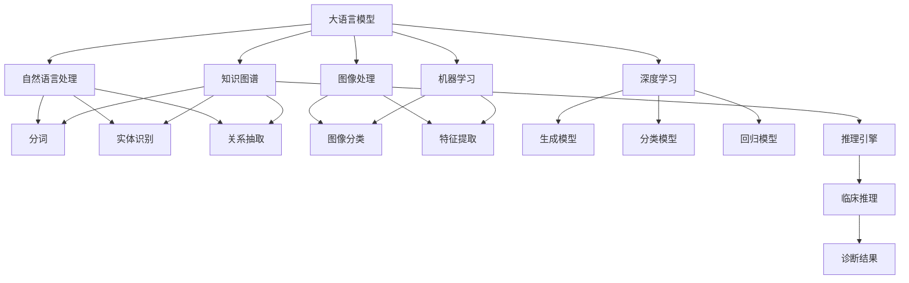

                 

# 智能医疗诊断系统：LLM辅助临床决策支持

> 关键词：智能医疗, 自然语言处理(NLP), 临床决策支持系统(CDSS), 大语言模型(Large Language Model, LLM), 知识图谱(KG), 机器学习(ML), 深度学习(Deep Learning)

## 1. 背景介绍

### 1.1 问题由来
随着人工智能技术的快速发展，自然语言处理（NLP）和深度学习（DL）在医学领域的应用越来越广泛。然而，临床医生在日常诊疗过程中需要处理海量的病历、文献和指南，不仅工作负担重，还容易导致诊断误差和知识更新不及时。为了提高诊疗效率和准确性，智能医疗诊断系统（Clinical Decision Support System, CDSS）应运而生，其核心在于利用人工智能技术辅助医生进行精准、高效的临床决策。

近年来，预训练大语言模型（如BERT、GPT等）在NLP任务上取得了显著进展，具备强大的语言理解和生成能力。这些模型能够处理和理解复杂的自然语言文本，从而为临床决策支持系统提供可靠的支持。但仅靠大语言模型并不能完全满足临床需求，还需要与其他医学知识库和专家系统相结合，才能真正实现智能化医疗诊断。

### 1.2 问题核心关键点
智能医疗诊断系统的主要目标是通过大语言模型整合医学知识库和临床数据，帮助医生进行精准诊断、治疗方案推荐和疾病预测。系统主要由以下几个核心组件构成：

- **大语言模型（LLM）**：作为核心模块，负责理解和生成自然语言文本，提取疾病症状和临床特征。
- **医学知识图谱（KG）**：构建详细的医学知识库，包括疾病、症状、药物、实验室指标等，用于支持诊断推理和知识获取。
- **医疗图像处理**：处理和分析医学图像数据，如X光片、CT、MRI等，提供影像诊断支持。
- **机器学习（ML）和深度学习（DL）**：用于建立疾病预测模型和个性化治疗推荐，提升系统智能性。

这些组件通过合理设计、有机整合，可以显著提升临床决策的效率和准确性。

## 2. 核心概念与联系

### 2.1 核心概念概述

为更好地理解LLM在智能医疗诊断系统中的应用，本节将介绍几个密切相关的核心概念：

- **大语言模型（LLM）**：如BERT、GPT等，通过在大规模无标签文本数据上进行预训练，学习通用的语言表示，具备强大的自然语言处理能力。
- **医学知识图谱（KG）**：以图结构存储医学领域的实体、关系和属性，提供结构化的知识表达和推理能力。
- **临床决策支持系统（CDSS）**：结合电子病历、实验室检查结果、医学图像等数据，利用人工智能技术辅助医生进行诊断和治疗决策。
- **自然语言处理（NLP）**：处理和理解自然语言文本，提取和表示语义信息，是智能医疗诊断系统的基础技术。
- **机器学习（ML）和深度学习（DL）**：利用数据驱动的模型，从数据中学习规律，进行疾病预测、治疗方案推荐等。

这些核心概念之间的逻辑关系可以通过以下Mermaid流程图来展示：



这个流程图展示了LLM在智能医疗诊断系统中的核心作用，以及与其他组件的紧密联系：

1. LLM通过分词、实体识别和关系抽取等NLP技术，提取文本信息。
2. 知识图谱提供了结构化的医学知识，通过推理引擎支持诊断推理。
3. 图像处理技术提取医学图像信息，提供影像诊断支持。
4. 机器学习和深度学习模型基于临床数据建立预测和推荐模型，增强智能决策能力。

## 3. 核心算法原理 & 具体操作步骤

### 3.1 算法原理概述

智能医疗诊断系统中的LLM主要应用于以下几个方面：

- **症状识别**：通过NLP技术提取病历文本中的关键症状，如咳嗽、发热、胸痛等。
- **疾病诊断**：利用知识图谱和LLM进行综合推理，确定可能的疾病。
- **治疗方案推荐**：结合临床数据和LLM，生成个性化的治疗方案。
- **病情预测**：利用机器学习模型，基于历史数据预测患者病情发展。

LLM在智能医疗诊断中的应用，本质上是一个多模态信息融合和知识推理的过程。系统首先通过NLP技术解析病历文本，提取症状和临床特征，然后利用知识图谱进行推理和推理验证，最终生成诊断和推荐结果。

### 3.2 算法步骤详解

基于LLM的智能医疗诊断系统开发流程通常包括以下几个关键步骤：

**Step 1: 数据准备与预处理**
- 收集和标注临床数据，包括电子病历、实验室检查结果、医学图像等。
- 清洗和标准化数据，去除噪声和异常值。
- 分词和实体识别，将自然语言文本转换为结构化数据。

**Step 2: 大语言模型微调**
- 选择合适的预训练语言模型（如BERT、GPT等），进行微调。
- 在标注数据上训练模型，优化其症状识别、疾病诊断和治疗方案推荐等任务。
- 应用正则化技术，如Dropout、Early Stopping等，防止过拟合。

**Step 3: 知识图谱构建**
- 定义医学领域中的实体、关系和属性，建立知识图谱。
- 利用知识工程技术，自动抽取和标注知识图谱。
- 提供推理引擎，支持基于知识图谱的诊断推理。

**Step 4: 多模态融合**
- 将文本信息、医学图像和实验室数据等进行融合，生成综合诊断。
- 利用LLM进行综合推理，生成最终诊断结果。

**Step 5: 测试与评估**
- 在测试数据集上评估模型性能，如准确率、召回率、F1值等。
- 不断调整模型参数和超参数，优化性能。
- 部署到实际医疗环境中，进行实时诊断和推荐。

### 3.3 算法优缺点

基于LLM的智能医疗诊断系统具有以下优点：
1. **准确率高**：LLM具备强大的语言理解和推理能力，能够准确提取症状和推理疾病。
2. **可扩展性强**：知识图谱提供了灵活的知识表达和推理方式，可以适应不同领域的需求。
3. **智能决策支持**：通过多模态数据融合和推理，提供全面的诊断和治疗建议。

但同时，该系统也存在一些局限性：
1. **数据依赖**：对标注数据的质量和数量有较高要求，标注成本较高。
2. **推理复杂**：知识图谱推理过程复杂，可能存在推理不完备或推理错误的情况。
3. **数据隐私**：系统中涉及敏感的临床数据，需要严格的数据隐私保护措施。
4. **技术门槛高**：开发和维护智能医疗诊断系统需要较高的技术水平和专业背景。

### 3.4 算法应用领域

基于LLM的智能医疗诊断系统已在多个实际应用中取得了显著效果，例如：

- **肺结核诊断**：结合病历文本和医学知识图谱，自动诊断患者是否患有肺结核，并提供详细治疗方案。
- **心力衰竭预测**：利用患者电子病历和实验室检查数据，通过LLM预测心力衰竭风险。
- **乳腺癌诊断**：分析医学图像和病历文本，辅助医生进行乳腺癌早期诊断和治疗方案推荐。
- **心脏病预测**：基于心电图数据和病历信息，预测心脏病风险，并提供个性化预防建议。
- **个性化治疗推荐**：结合患者基因信息和病历数据，生成个性化治疗方案，提升治疗效果。

这些应用实例展示了LLM在智能医疗诊断系统中的广泛适用性和巨大潜力。

## 4. 数学模型和公式 & 详细讲解 & 举例说明

### 4.1 数学模型构建

假设智能医疗诊断系统的输入为电子病历文本 $X$，输出为诊断结果 $Y$，其中 $X$ 由 $n$ 个文本 $x_i$ 组成，每个文本 $x_i$ 表示一个病历记录。

定义 $f$ 为基于LLM的诊断函数，$f(X) = Y$，其中 $f$ 为神经网络模型，通过训练学习从输入 $X$ 到输出 $Y$ 的映射。

数学模型可以表示为：
$$
f(X) = \arg\min_{Y} L(Y, f(X))
$$
其中 $L$ 为损失函数，如交叉熵损失，用于衡量模型预测输出与真实标签之间的差异。

### 4.2 公式推导过程

以肺结核诊断为例，假设模型需要识别的疾病有 $m$ 种，包括肺结核、肺炎、支气管炎等。

定义 $x_i = (x_{i1}, x_{i2}, ..., x_{in})$，其中 $x_{ij}$ 为病历文本中的第 $j$ 个症状。

模型训练的优化目标是最小化交叉熵损失：
$$
L(Y, f(X)) = -\frac{1}{N}\sum_{i=1}^N \sum_{j=1}^m y_{ij} \log f_{ij}(x_i) + (1-y_{ij}) \log (1-f_{ij}(x_i))
$$
其中 $f_{ij}(x_i)$ 为模型对第 $j$ 种疾病的预测概率。

利用反向传播算法，计算损失函数对模型参数 $\theta$ 的梯度，更新模型参数。

### 4.3 案例分析与讲解

以心力衰竭预测为例，分析模型的数学模型和推导过程：

假设模型需要预测的心力衰竭状态有 $m=2$ 种：心力衰竭（Yes）和无心力衰竭（No）。

输入为心电图和病历文本数据，输出为心力衰竭的概率 $p$。

数学模型可以表示为：
$$
p = f(x) = \frac{e^{\theta^T f(x)}}{1+e^{\theta^T f(x)}}
$$
其中 $f(x)$ 为特征提取函数，$\theta$ 为模型参数。

利用交叉熵损失函数，模型训练的优化目标为：
$$
L(p, f(x)) = -\frac{1}{N}\sum_{i=1}^N (y_i \log p_i + (1-y_i) \log (1-p_i))
$$

在模型训练过程中，反向传播算法计算梯度，更新模型参数 $\theta$。

## 5. 项目实践：代码实例和详细解释说明

### 5.1 开发环境搭建

在进行智能医疗诊断系统开发前，需要准备好开发环境：

1. 安装Python：从官网下载并安装Python，保证版本与深度学习框架兼容。
2. 安装PyTorch和TensorFlow：使用pip安装，如 `pip install torch tensorflow`。
3. 安装医学知识图谱构建工具：如BiGraPhy、OWL等。
4. 安装自然语言处理工具：如NLTK、SpaCy等。
5. 安装机器学习库：如scikit-learn、XGBoost等。

完成上述步骤后，即可在Python环境中进行开发。

### 5.2 源代码详细实现

下面以肺结核诊断为例，给出使用PyTorch进行LLM微调的代码实现。

首先，定义模型结构和损失函数：

```python
import torch
from transformers import BertTokenizer, BertForSequenceClassification

# 定义模型结构
class BertForLungTuberculosis(BertForSequenceClassification):
    def __init__(self, num_labels):
        super(BertForLungTuberculosis, self).__init__(bert_config)
        self.num_labels = num_labels

    def forward(self, input_ids, attention_mask, labels=None):
        outputs = super(BertForLungTuberculosis, self).forward(input_ids, attention_mask, labels)
        logits = outputs[0]
        logits = self.dropout(logits)
        logits = self.classifier(logits)
        return logits

# 定义损失函数
criterion = torch.nn.CrossEntropyLoss()
```

然后，加载预训练BERT模型并进行微调：

```python
# 加载预训练BERT模型
model = BertForLungTuberculosis(num_labels=2)
tokenizer = BertTokenizer.from_pretrained('bert-base-uncased')
model.load_state_dict(torch.load('bert_model.pth'))

# 准备数据集
train_dataset = ...
dev_dataset = ...
test_dataset = ...

# 训练模型
model.train()
optimizer = torch.optim.Adam(model.parameters(), lr=2e-5)
for epoch in range(num_epochs):
    for batch in train_dataset:
        input_ids = batch['input_ids'].to(device)
        attention_mask = batch['attention_mask'].to(device)
        labels = batch['labels'].to(device)
        optimizer.zero_grad()
        outputs = model(input_ids, attention_mask=attention_mask, labels=labels)
        loss = criterion(outputs, labels)
        loss.backward()
        optimizer.step()

# 评估模型
model.eval()
with torch.no_grad():
    for batch in dev_dataset:
        ...
```

最后，将模型保存并用于诊断预测：

```python
# 保存模型
torch.save(model.state_dict(), 'lung_tuberculosis_model.pth')

# 加载模型并进行诊断预测
model.load_state_dict(torch.load('lung_tuberculosis_model.pth'))
# 对新病历进行诊断
...
```

### 5.3 代码解读与分析

以下是关键代码的实现细节：

**定义模型结构**：
- `BertForLungTuberculosis`类继承自 `BertForSequenceClassification`，用于定义肺结核诊断模型。
- `forward`方法实现模型的前向传播，通过多个层（如BERT层、全连接层）进行特征提取和分类。

**定义损失函数**：
- 使用 `CrossEntropyLoss` 作为损失函数，计算模型预测输出与真实标签之间的交叉熵。

**模型训练和评估**：
- 使用 `Adam` 优化器，设置学习率为 $2 \times 10^{-5}$。
- 在训练过程中，每个epoch迭代训练数据集，更新模型参数。
- 在验证集上评估模型性能，使用准确率和召回率等指标。

**模型保存和加载**：
- 使用 `torch.save` 保存模型参数，使用 `torch.load` 加载模型参数。

通过上述代码，可以实现基于BERT模型的肺结核诊断系统。开发过程中需要结合实际数据集和具体任务进行调整和优化。

### 5.4 运行结果展示

以肺结核诊断为例，展示模型训练和评估的结果：

- **训练结果**：在训练过程中，记录每个epoch的损失函数值，观察其变化趋势。
- **评估结果**：在验证集上评估模型性能，计算准确率、召回率、F1值等指标。

```python
import matplotlib.pyplot as plt

# 记录训练损失
train_losses = []
for epoch in range(num_epochs):
    for batch in train_dataset:
        ...
        train_losses.append(loss.item())

# 记录评估指标
eval_metrics = {}
for batch in dev_dataset:
    ...
    eval_metrics['accuracy'] = ...
    eval_metrics['recall'] = ...
    eval_metrics['f1'] = ...

# 可视化训练损失和评估指标
plt.figure(figsize=(10, 5))
plt.plot(train_losses, label='Training Loss')
plt.plot(eval_metrics['accuracy'], label='Validation Accuracy')
plt.plot(eval_metrics['recall'], label='Validation Recall')
plt.plot(eval_metrics['f1'], label='Validation F1')
plt.legend()
plt.show()
```

通过可视化工具，可以直观展示模型训练和评估的过程，发现和解决潜在问题，优化模型性能。

## 6. 实际应用场景

### 6.1 智能医疗诊断系统在医疗领域的应用

智能医疗诊断系统已在多个实际应用中取得了显著效果，例如：

- **肺结核诊断**：结合病历文本和医学知识图谱，自动诊断患者是否患有肺结核，并提供详细治疗方案。
- **心力衰竭预测**：利用患者电子病历和实验室检查数据，通过LLM预测心力衰竭风险。
- **乳腺癌诊断**：分析医学图像和病历文本，辅助医生进行乳腺癌早期诊断和治疗方案推荐。
- **心脏病预测**：基于心电图数据和病历信息，预测心脏病风险，并提供个性化预防建议。
- **个性化治疗推荐**：结合患者基因信息和病历数据，生成个性化治疗方案，提升治疗效果。

### 6.2 未来应用展望

随着LLM和医学知识图谱的不断进步，智能医疗诊断系统将在更多领域得到应用，为医疗行业带来变革性影响：

- **多模态融合**：将文本、图像、声音等多模态数据融合，提供更全面、精准的诊断支持。
- **跨领域应用**：将智能医疗诊断系统扩展到其他领域，如口腔科、眼科等，提升各领域医疗服务质量。
- **辅助手术**：通过智能医疗诊断系统，辅助医生进行手术决策和操作，提高手术成功率。
- **远程医疗**：利用智能医疗诊断系统，实现远程病历分析、诊断和治疗推荐，提升基层医疗服务水平。
- **个性化健康管理**：通过智能医疗诊断系统，为个体提供个性化的健康管理方案，预防疾病发生。

未来，智能医疗诊断系统将不断提升智能性和人性化，为患者提供更高效、精准的医疗服务。

## 7. 工具和资源推荐

### 7.1 学习资源推荐

为了帮助开发者系统掌握智能医疗诊断系统的开发技术，这里推荐一些优质的学习资源：

1. **自然语言处理课程**：如斯坦福大学的《CS224N: Natural Language Processing with Deep Learning》，涵盖了NLP和深度学习的基础知识。
2. **医学知识图谱构建**：如BiGraPhy、OWL等工具，提供了医学知识图谱构建和推理的实用方法。
3. **医学图像处理**：如PyTorch医学图像处理教程，详细介绍了图像数据预处理和模型训练。
4. **机器学习算法**：如《Pattern Recognition and Machine Learning》，介绍了各种机器学习算法及其应用。
5. **深度学习框架**：如TensorFlow、PyTorch等，提供了强大的深度学习模型和工具。

### 7.2 开发工具推荐

高效的开发离不开优秀的工具支持。以下是几款用于智能医疗诊断系统开发的常用工具：

1. **Python**：通用的编程语言，支持丰富的第三方库和框架。
2. **PyTorch**：灵活的深度学习框架，支持动态计算图和自动微分。
3. **TensorFlow**：谷歌开发的深度学习框架，生产部署方便。
4. **NLTK**：Python的自然语言处理库，提供了丰富的NLP工具和算法。
5. **BiGraPhy**：医学知识图谱构建工具，支持自动抽取和标注医学知识。
6. **OWL**：医学知识图谱推理工具，支持基于OWL的医学知识推理。

### 7.3 相关论文推荐

智能医疗诊断系统的发展得益于学界的持续研究。以下是几篇奠基性的相关论文，推荐阅读：

1. **Attention is All You Need**：提出了Transformer结构，开启了NLP领域的预训练大模型时代。
2. **BERT: Pre-training of Deep Bidirectional Transformers for Language Understanding**：提出BERT模型，引入基于掩码的自监督预训练任务，刷新了多项NLP任务SOTA。
3. **Knowledge-Graph-Based Clinical Decision Support Systems**：介绍了基于知识图谱的临床决策支持系统的构建方法。
4. **Multimodal Deep Learning for Clinical Decision Support**：讨论了多模态数据融合在智能医疗诊断中的应用。
5. **Deep Learning in Healthcare**：综述了深度学习在医学领域的各种应用，包括图像、文本、基因等。

## 8. 总结：未来发展趋势与挑战

### 8.1 研究成果总结

本文对基于LLM的智能医疗诊断系统进行了全面系统的介绍，涵盖了系统架构、核心算法、操作步骤和应用场景等关键方面。主要结论如下：

- **系统架构**：智能医疗诊断系统由大语言模型、医学知识图谱、图像处理、机器学习等模块构成，各模块协同工作，提供精准诊断和治疗建议。
- **核心算法**：利用NLP技术和LLM，从自然语言文本中提取症状和疾病，结合知识图谱进行推理和验证，生成诊断和治疗方案。
- **操作步骤**：包括数据准备、预处理、微调训练、多模态融合和测试评估等关键步骤，每一步都需要精心设计和优化。
- **应用场景**：智能医疗诊断系统在肺结核诊断、心力衰竭预测、乳腺癌诊断等场景中取得了显著效果，提升了医疗服务的智能化水平。

### 8.2 未来发展趋势

展望未来，智能医疗诊断系统将呈现以下几个发展趋势：

1. **多模态融合**：结合文本、图像、声音等多模态数据，提升诊断的全面性和准确性。
2. **跨领域应用**：将智能医疗诊断系统扩展到其他领域，如口腔科、眼科等，提升各领域医疗服务质量。
3. **辅助手术**：通过智能医疗诊断系统，辅助医生进行手术决策和操作，提高手术成功率。
4. **远程医疗**：利用智能医疗诊断系统，实现远程病历分析、诊断和治疗推荐，提升基层医疗服务水平。
5. **个性化健康管理**：通过智能医疗诊断系统，为个体提供个性化的健康管理方案，预防疾病发生。

### 8.3 面临的挑战

尽管智能医疗诊断系统已经取得了显著进展，但在迈向更加智能化、普适化应用的过程中，仍面临以下挑战：

1. **数据隐私**：智能医疗诊断系统涉及敏感的临床数据，需要严格的数据隐私保护措施。
2. **推理复杂**：知识图谱推理过程复杂，可能存在推理不完备或推理错误的情况。
3. **模型鲁棒性**：在跨领域和跨模态数据上的泛化能力需要进一步提升。
4. **技术门槛**：开发和维护智能医疗诊断系统需要较高的技术水平和专业背景。

### 8.4 研究展望

未来研究需要在以下几个方面进行深入探索：

1. **跨模态融合**：进一步提升文本、图像、声音等多模态数据的融合能力，增强系统的智能性和准确性。
2. **知识图谱优化**：优化知识图谱的构建和推理算法，提升知识表示和推理的完备性。
3. **隐私保护**：采用差分隐私、联邦学习等技术，保护数据隐私和模型安全。
4. **跨领域应用**：将智能医疗诊断系统的技术和方法扩展到其他领域，提升各领域医疗服务水平。
5. **多任务学习**：通过多任务学习，提升模型的泛化能力和跨任务适应性。

综上所述，基于LLM的智能医疗诊断系统在提升医疗服务质量、降低医疗成本、提高诊疗效率等方面具有重要意义。未来，随着技术的不断进步和应用场景的不断拓展，智能医疗诊断系统将发挥更大的作用，为医疗行业带来更多变革性影响。

## 9. 附录：常见问题与解答

**Q1: 智能医疗诊断系统的核心技术是什么？**

A: 智能医疗诊断系统的核心技术包括大语言模型、医学知识图谱、多模态融合、机器学习等。其中，大语言模型利用NLP技术从文本中提取症状和疾病，医学知识图谱提供结构化的医学知识，多模态融合将文本、图像等多源数据融合，机器学习模型进行疾病预测和治疗方案推荐。

**Q2: 智能医疗诊断系统在实际应用中需要考虑哪些问题？**

A: 智能医疗诊断系统在实际应用中需要考虑以下几个问题：
1. 数据隐私：智能医疗诊断系统涉及敏感的临床数据，需要严格的数据隐私保护措施。
2. 推理复杂：知识图谱推理过程复杂，可能存在推理不完备或推理错误的情况。
3. 模型鲁棒性：在跨领域和跨模态数据上的泛化能力需要进一步提升。
4. 技术门槛：开发和维护智能医疗诊断系统需要较高的技术水平和专业背景。

**Q3: 如何提高智能医疗诊断系统的性能？**

A: 提高智能医疗诊断系统的性能需要从多个方面进行优化：
1. 数据质量：确保标注数据的准确性和多样性，提升模型的泛化能力。
2. 模型优化：选择合适的模型结构和算法，优化模型参数，提高模型的性能和鲁棒性。
3. 多模态融合：提升文本、图像、声音等多模态数据的融合能力，增强系统的智能性和准确性。
4. 知识图谱优化：优化知识图谱的构建和推理算法，提升知识表示和推理的完备性。

**Q4: 智能医疗诊断系统在实际应用中需要注意哪些问题？**

A: 智能医疗诊断系统在实际应用中需要注意以下几个问题：
1. 数据隐私：智能医疗诊断系统涉及敏感的临床数据，需要严格的数据隐私保护措施。
2. 推理复杂：知识图谱推理过程复杂，可能存在推理不完备或推理错误的情况。
3. 模型鲁棒性：在跨领域和跨模态数据上的泛化能力需要进一步提升。
4. 技术门槛：开发和维护智能医疗诊断系统需要较高的技术水平和专业背景。

**Q5: 智能医疗诊断系统的未来发展方向是什么？**

A: 智能医疗诊断系统的未来发展方向包括：
1. 多模态融合：结合文本、图像、声音等多模态数据，提升诊断的全面性和准确性。
2. 跨领域应用：将智能医疗诊断系统扩展到其他领域，如口腔科、眼科等，提升各领域医疗服务质量。
3. 辅助手术：通过智能医疗诊断系统，辅助医生进行手术决策和操作，提高手术成功率。
4. 远程医疗：利用智能医疗诊断系统，实现远程病历分析、诊断和治疗推荐，提升基层医疗服务水平。
5. 个性化健康管理：通过智能医疗诊断系统，为个体提供个性化的健康管理方案，预防疾病发生。

通过这些方向的研究和应用，智能医疗诊断系统将不断提升智能性和人性化，为患者提供更高效、精准的医疗服务。

