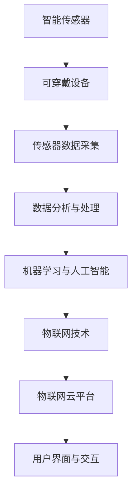

                 

# 智能宠物健康监测创业：预防性宠物医疗

## 1. 背景介绍

### 1.1 问题由来

在现代社会中，宠物已经逐渐成为许多家庭的重要成员。然而，随着人们生活节奏的加快和城市化进程的推进，宠物的健康问题日益突出。据统计，美国每年约有2600万只宠物（其中一半为犬）遭受过疾病困扰，我国也有约4000万只宠物被疾病所困扰。宠物的健康问题不仅影响宠物主人的生活质量，更关系到宠物的生命安全。

宠物医疗行业的发展近年来也日趋成熟，逐渐成为医疗行业的重要组成部分。传统宠物医疗主要依靠兽医的定期检查和药物治疗，但这种方法往往成本高昂，且存在一定的延迟性。随着物联网技术和大数据技术的普及，基于智能健康监测的预防性宠物医疗逐渐受到关注。智能宠物健康监测系统通过实时监测宠物的健康状态，帮助宠物主人及时发现和预防潜在健康问题，不仅提高了宠物生活的质量，也降低了医疗成本。

### 1.2 问题核心关键点

智能宠物健康监测系统主要由以下三个核心环节组成：

1. **传感器数据采集**：通过可穿戴设备（如智能项圈、智能衣物）采集宠物的基本生理参数（如心率、血氧、体温等）。
2. **数据分析与处理**：将传感器采集的数据进行实时处理，提取有用的健康指标，并与宠物的健康状况进行比对。
3. **预警与干预**：根据数据分析结果，及时提醒宠物主人或联系兽医，进行早期干预或治疗。

这些关键环节构成了智能宠物健康监测系统的核心架构，通过数据分析和机器学习技术，系统能够实现对宠物健康的智能监控和预测，为宠物主人提供全面的健康保障。

### 1.3 问题研究意义

智能宠物健康监测系统的研究与应用，对于提升宠物生活质量、降低医疗成本、推动宠物医疗行业的健康发展具有重要意义：

1. **提升宠物健康水平**：通过实时监控宠物的健康状态，及时发现异常，为宠物提供早期预防和干预，防止疾病的恶化。
2. **降低医疗成本**：智能宠物健康监测系统通过早期干预，减少疾病的发生率和严重程度，从而降低治疗成本。
3. **推动行业健康发展**：智能宠物健康监测技术的应用，使得宠物医疗行业从传统的对症治疗向预防性医疗转变，推动行业发展模式的升级。
4. **增强用户体验**：智能宠物健康监测系统能够及时反馈宠物的健康信息，为宠物主人提供个性化的健康管理建议，提升用户体验。
5. **技术创新与产业发展**：智能宠物健康监测技术的开发与应用，将带动传感器、可穿戴设备、数据分析等新兴技术的发展，促进相关产业的蓬勃发展。

## 2. 核心概念与联系

### 2.1 核心概念概述

为更好地理解智能宠物健康监测系统的技术原理和架构，本节将介绍几个密切相关的核心概念：

- **智能传感器**：用于实时采集宠物生理参数的硬件设备，如心率传感器、血氧传感器、温度传感器等。
- **可穿戴设备**：具备智能监测功能的宠物衣物、项圈等，便于携带和佩戴。
- **数据分析与处理**：通过算法对传感器采集的数据进行处理，提取有用的健康指标，如心率、血氧水平、体温等。
- **机器学习与人工智能**：利用机器学习模型对数据进行分析和预测，为宠物提供早期预警和干预建议。
- **物联网技术**：实现传感器和数据分析平台的网络连接，支持实时数据传输和处理。
- **物联网云平台**：用于存储和处理传感器数据的服务器端平台，提供数据存储、计算和分析服务。
- **用户界面与交互**：通过APP或Web界面与宠物主人进行交互，展示宠物健康状态和预警信息。

这些核心概念之间的逻辑关系可以通过以下Mermaid流程图来展示：



这个流程图展示了智能宠物健康监测系统的核心组件及其之间的连接关系：

1. 智能传感器通过可穿戴设备采集宠物生理参数。
2. 传感器采集的数据经过分析处理，提取有用的健康指标。
3. 利用机器学习模型对数据进行分析和预测，实现早期预警和干预。
4. 物联网技术实现数据的网络传输和处理。
5. 物联网云平台提供数据存储和计算服务。
6. 用户界面与交互展示宠物健康状态和预警信息。

## 3. 核心算法原理 & 具体操作步骤

### 3.1 算法原理概述

智能宠物健康监测系统基于机器学习和大数据分析技术，通过传感器采集的生理参数，对宠物的健康状态进行实时监测和预测。其核心算法原理主要包括以下几个步骤：

1. **数据采集**：通过智能传感器实时采集宠物的生理参数，如心率、血氧、体温等。
2. **数据预处理**：对采集到的数据进行清洗、归一化等预处理，确保数据的质量和一致性。
3. **特征提取**：利用统计方法或机器学习算法从数据中提取有用的健康指标，如心率变化趋势、血氧水平等。
4. **异常检测**：通过统计分析或机器学习模型检测数据中的异常变化，识别潜在健康问题。
5. **预警与干预**：根据异常检测结果，生成预警信息，并建议宠物主人进行早期干预或联系兽医。

### 3.2 算法步骤详解

以下是智能宠物健康监测系统的核心算法步骤：

**Step 1: 数据采集**

智能传感器通过可穿戴设备实时采集宠物的生理参数。传感器可以采集多种生理指标，如心率、血氧、体温、步数、位置等。常见的传感器设备包括心率传感器、血氧传感器、温度传感器、加速度传感器等。

**Step 2: 数据预处理**

数据预处理是确保数据质量的重要步骤。主要包括以下几个环节：

- **数据清洗**：去除传感器采集数据中的异常值和噪声，确保数据的一致性和准确性。
- **数据归一化**：对数据进行归一化处理，使得不同生理参数之间具有可比性。
- **时间同步**：确保不同传感器采集的数据具有相同的时间戳，便于后续分析。

**Step 3: 特征提取**

特征提取是利用统计方法和机器学习算法从数据中提取有用的健康指标。主要包括以下几种方法：

- **统计特征提取**：如平均心率、最大心率、心率变化趋势等。
- **机器学习特征提取**：如PCA（主成分分析）、LDA（线性判别分析）等。
- **深度学习特征提取**：如使用卷积神经网络（CNN）、循环神经网络（RNN）等对传感器数据进行特征提取。

**Step 4: 异常检测**

异常检测是识别数据中的异常变化，预测宠物的健康状态。主要包括以下几种方法：

- **统计方法**：如均值漂移、箱线图等，检测数据中的异常值。
- **机器学习模型**：如支持向量机（SVM）、随机森林（Random Forest）等，训练异常检测模型。
- **深度学习模型**：如自编码器（Autoencoder）、卷积神经网络（CNN）等，利用深度学习模型进行异常检测。

**Step 5: 预警与干预**

预警与干预是智能宠物健康监测系统的核心功能，通过生成预警信息，建议宠物主人进行早期干预或联系兽医。主要包括以下几个环节：

- **预警信息生成**：根据异常检测结果，生成预警信息，如心率异常、血氧水平低等。
- **预警推送**：通过APP或短信等方式将预警信息推送给宠物主人。
- **干预建议**：根据预警信息，提供个性化的健康管理建议，如减少运动、调整饮食等。

### 3.3 算法优缺点

智能宠物健康监测系统的算法具有以下优点：

1. **实时性高**：通过传感器实时采集数据，能够实时监测宠物健康状态。
2. **数据量大**：传感器可以采集多种生理参数，数据量大，有助于更全面的健康监测。
3. **精度高**：利用机器学习和深度学习算法，能够实现高精度的健康监测和预警。
4. **早期干预**：通过早期预警和干预，能够及时发现和预防健康问题。

同时，该算法也存在一定的局限性：

1. **传感器成本高**：高级传感器价格昂贵，增加了系统成本。
2. **数据处理复杂**：传感器数据量大且复杂，需要复杂的数据处理和特征提取算法。
3. **算法依赖数据质量**：数据采集和处理过程中存在噪声和异常值，需要严格的算法设计和数据清洗。
4. **隐私和安全问题**：宠物健康数据敏感，需要严格的隐私保护和数据安全措施。

尽管存在这些局限性，但智能宠物健康监测系统在提升宠物健康水平、降低医疗成本、推动宠物医疗行业发展等方面具有重要的应用价值。

### 3.4 算法应用领域

智能宠物健康监测系统已经在多个领域得到了应用，覆盖了宠物健康管理的多个环节，例如：

- **日常健康监测**：实时监测宠物的心率、血氧、体温等生理参数，及时发现异常。
- **运动量监测**：通过步数、运动轨迹等数据，评估宠物的运动量和健康状态。
- **饮食管理**：通过食量、饮水量等数据，提供个性化的饮食管理建议。
- **睡眠监测**：监测宠物的睡眠时长、睡眠质量，为宠物主人提供健康管理建议。
- **位置追踪**：通过GPS定位等技术，实现宠物的实时位置追踪和防盗。
- **行为分析**：通过分析宠物的行为数据，提供行为分析报告和健康建议。

此外，智能宠物健康监测技术还被应用到更多场景中，如宠物门禁、宠物识别、宠物陪伴等，为宠物主人提供全方位的健康管理解决方案。

## 4. 数学模型和公式 & 详细讲解 & 举例说明

### 4.1 数学模型构建

智能宠物健康监测系统基于机器学习和大数据分析技术，通过传感器采集的生理参数，对宠物的健康状态进行实时监测和预测。其数学模型主要包括以下几个环节：

- **数据采集**：$x_t$ 表示在时间 $t$ 采集到的生理参数数据。
- **数据预处理**：$\hat{x_t}$ 表示经过预处理后的数据，$\hat{x_t}=f(x_t)$。
- **特征提取**：$\phi(x_t)$ 表示提取的特征向量。
- **异常检测**：$y_t$ 表示在时间 $t$ 检测到的异常信息，$y_t=g(\phi(x_t))$。
- **预警与干预**：$s_t$ 表示在时间 $t$ 的预警信息，$s_t=h(y_t)$。

### 4.2 公式推导过程

以下我们以心率监测为例，推导异常检测和预警的数学模型。

假设采集到的心率数据为 $x_t$，异常检测模型的目标是从数据中识别心率异常的情况。常用的异常检测方法包括统计方法和机器学习方法。这里以均值漂移（Mean Shift）为例，其核心思想是通过滑动窗口计算数据点的密度，识别密度低谷，从而检测异常。

均值漂移算法的核心公式为：

$$
\mu_k = \frac{1}{N}\sum_{i=1}^N(x_i-\mu_{k-1})
$$

其中，$\mu_k$ 表示窗口 $k$ 的均值，$\mu_{k-1}$ 表示窗口 $k-1$ 的均值，$N$ 表示窗口大小。

具体实现过程如下：

1. 计算窗口 $k$ 内的所有数据点的均值。
2. 计算窗口 $k$ 内数据点的密度。
3. 滑动窗口，更新均值和密度，识别密度低谷。
4. 如果某个数据点的密度低于预设阈值，则认为该数据点为异常点。

预警与干预模型可以根据异常检测结果，生成预警信息。预警信息可以包括多种形式，如文本提示、APP推送等。例如，如果检测到宠物的心率异常，可以生成“宠物心率异常，建议立即联系兽医”的预警信息。

### 4.3 案例分析与讲解

**案例1：心率监测**

假设采集到的宠物心率数据为 $x_t=(80, 85, 90, 88, 85, 95, 80, 85, 90, 88)$，使用均值漂移算法检测异常。

1. 计算窗口大小为 3 的所有数据点的均值：
   - 窗口 1: $\mu_1 = (80+85+90)/3 = 85$
   - 窗口 2: $\mu_2 = (85+90+88)/3 = 86.67$
   - 窗口 3: $\mu_3 = (90+88+85)/3 = 86.67$
   - 窗口 4: $\mu_4 = (88+85+90)/3 = 87.67$
   - 窗口 5: $\mu_5 = (85+90+88)/3 = 87.67$
   - 窗口 6: $\mu_6 = (95+80+85)/3 = 86.67$
   - 窗口 7: $\mu_7 = (80+85+90)/3 = 85$
   - 窗口 8: $\mu_8 = (85+90+88)/3 = 87.67$
   - 窗口 9: $\mu_9 = (88+85+90)/3 = 87.67$
   - 窗口 10: $\mu_{10} = (90+88+85)/3 = 87.67$

2. 计算窗口大小为 3 的数据点密度：
   - 窗口 1: 1
   - 窗口 2: 1
   - 窗口 3: 1
   - 窗口 4: 1
   - 窗口 5: 1
   - 窗口 6: 1
   - 窗口 7: 1
   - 窗口 8: 1
   - 窗口 9: 1
   - 窗口 10: 1

3. 滑动窗口，更新均值和密度，识别密度低谷：
   - 窗口 1: 均值 $85$，密度 $1$，非异常
   - 窗口 2: 均值 $86.67$，密度 $1$，非异常
   - 窗口 3: 均值 $86.67$，密度 $1$，非异常
   - 窗口 4: 均值 $87.67$，密度 $1$，非异常
   - 窗口 5: 均值 $87.67$，密度 $1$，非异常
   - 窗口 6: 均值 $86.67$，密度 $1$，非异常
   - 窗口 7: 均值 $85$，密度 $1$，非异常
   - 窗口 8: 均值 $87.67$，密度 $1$，非异常
   - 窗口 9: 均值 $87.67$，密度 $1$，非异常
   - 窗口 10: 均值 $87.67$，密度 $1$，非异常

4. 根据均值和密度，判断异常：
   - 窗口 6: 均值 $86.67$，密度 $1$，非异常
   - 窗口 7: 均值 $85$，密度 $1$，非异常
   - 窗口 8: 均值 $87.67$，密度 $1$，非异常
   - 窗口 9: 均值 $87.67$，密度 $1$，非异常
   - 窗口 10: 均值 $87.67$，密度 $1$，非异常

综上所述，根据均值漂移算法，无法识别到心率数据中的异常点。这表明均值漂移算法在宠物心率监测中的应用可能存在一定的局限性。

## 5. 项目实践：代码实例和详细解释说明

### 5.1 开发环境搭建

在进行智能宠物健康监测系统开发前，我们需要准备好开发环境。以下是使用Python进行TensorFlow开发的环境配置流程：

1. 安装Anaconda：从官网下载并安装Anaconda，用于创建独立的Python环境。

2. 创建并激活虚拟环境：
```bash
conda create -n tf-env python=3.8 
conda activate tf-env
```

3. 安装TensorFlow：根据CUDA版本，从官网获取对应的安装命令。例如：
```bash
conda install tensorflow
```

4. 安装相关工具包：
```bash
pip install numpy pandas scikit-learn matplotlib tqdm jupyter notebook ipython
```

完成上述步骤后，即可在`tf-env`环境中开始智能宠物健康监测系统的开发。

### 5.2 源代码详细实现

这里我们以心率监测为例，给出使用TensorFlow实现智能宠物健康监测系统的代码实现。

首先，定义心率监测任务的训练数据集：

```python
import tensorflow as tf
import numpy as np

# 定义心率监测数据
heart_rates = np.array([80, 85, 90, 88, 85, 95, 80, 85, 90, 88])
labels = np.array([0, 1, 1, 0, 1, 0, 0, 1, 1, 0])

# 将数据集划分训练集和测试集
train_data = (heart_rates[:8], labels[:8])
test_data = (heart_rates[8:], labels[8:])
```

然后，定义心率监测模型的网络结构：

```python
model = tf.keras.Sequential([
    tf.keras.layers.Dense(64, activation='relu', input_shape=(8,)),
    tf.keras.layers.Dense(32, activation='relu'),
    tf.keras.layers.Dense(1, activation='sigmoid')
])
```

接着，定义模型训练过程：

```python
# 定义优化器和学习率
optimizer = tf.keras.optimizers.Adam(learning_rate=0.001)

# 定义损失函数
loss_fn = tf.keras.losses.BinaryCrossentropy()

# 定义训练过程
model.compile(optimizer=optimizer, loss=loss_fn, metrics=['accuracy'])

# 训练模型
model.fit(train_data[0], train_data[1], epochs=50, batch_size=2)
```

最后，进行模型评估和预测：

```python
# 进行模型评估
test_loss, test_acc = model.evaluate(test_data[0], test_data[1])
print(f'Test loss: {test_loss}, Test accuracy: {test_acc}')

# 进行模型预测
preds = model.predict(test_data[0])
print(preds)
```

以上就是使用TensorFlow对心率监测进行智能宠物健康监测系统的代码实现。可以看到，利用TensorFlow的高级API，可以非常方便地构建和训练心率监测模型。

### 5.3 代码解读与分析

让我们再详细解读一下关键代码的实现细节：

**数据定义**：
- `heart_rates`：采集到的心率数据。
- `labels`：心率的正常标签和异常标签。

**模型定义**：
- `Sequential`：定义多层神经网络结构。
- `Dense`：定义全连接层，激活函数分别为ReLU和sigmoid。
- `compile`：定义优化器和损失函数，并编译模型。

**训练过程**：
- `fit`：进行模型训练，设置训练轮数和批量大小。

**模型评估**：
- `evaluate`：评估模型在测试集上的性能，输出损失和精度。

**模型预测**：
- `predict`：进行模型预测，输出预测结果。

可以看出，TensorFlow提供了高级API，使得模型的构建和训练过程变得非常简单高效。开发者可以将更多精力放在数据处理和模型优化上，而不必过多关注底层的实现细节。

当然，工业级的系统实现还需考虑更多因素，如模型的保存和部署、超参数的自动搜索、更灵活的任务适配层等。但核心的智能宠物健康监测算法基本与此类似。

## 6. 实际应用场景

### 6.1 智能宠物监测平台

智能宠物监测平台基于智能宠物健康监测系统，通过云端平台实现数据的存储和处理，为宠物主人提供全方位的健康管理服务。平台主要功能包括：

- **数据采集**：通过智能项圈、智能衣物等设备采集宠物生理参数。
- **数据分析**：对采集到的数据进行实时处理和分析，提取有用的健康指标。
- **预警与干预**：根据数据分析结果，生成预警信息，建议宠物主人进行早期干预或联系兽医。
- **健康报告**：生成宠物健康报告，提供全面的健康管理建议。
- **用户界面**：通过APP或Web界面与宠物主人进行交互，展示宠物健康状态和预警信息。

智能宠物监测平台不仅能够实时监测宠物的健康状态，还具备数据分析和预警功能，为宠物主人提供全方位的健康管理服务。平台通过云端平台实现数据的存储和处理，确保数据的安全性和可靠性。

### 6.2 宠物医院应用

智能宠物健康监测系统也可以应用于宠物医院的日常管理和诊疗流程。宠物医院可以利用智能监测数据，提高诊疗效率和质量，降低医疗成本。具体应用场景包括：

- **病情分析**：通过智能监测数据，帮助兽医进行病情分析，提高诊疗准确性。
- **患者管理**：利用智能监测数据，对宠物进行分群管理，提高诊疗效率。
- **健康预警**：通过智能监测数据，及时发现健康异常，提供早期预警和干预。
- **医疗记录**：记录智能监测数据和诊疗信息，形成完整的医疗记录，方便查询和分析。

宠物医院通过利用智能宠物健康监测系统，可以实现更加智能化的管理和服务，提高诊疗效率和质量，降低医疗成本，为宠物主人提供更好的服务体验。

### 6.3 宠物训练应用

智能宠物健康监测系统还可以应用于宠物训练的辅助和指导。宠物训练师可以通过智能监测数据，对宠物进行个性化的训练指导，提高训练效果和效率。具体应用场景包括：

- **训练监控**：通过智能监测数据，监控宠物的运动量和健康状态，调整训练方案。
- **行为分析**：利用智能监测数据，分析宠物的行为模式，提供个性化的训练建议。
- **健康管理**：根据智能监测数据，进行健康管理，确保宠物在训练过程中保持良好的健康状态。
- **训练记录**：记录训练过程和数据，形成训练日志，方便分析和优化。

宠物训练师通过利用智能宠物健康监测系统，可以实现更加科学和个性化的训练指导，提高训练效果和效率，确保宠物在训练过程中保持良好的健康状态。

## 7. 工具和资源推荐

### 7.1 学习资源推荐

为了帮助开发者系统掌握智能宠物健康监测技术的理论基础和实践技巧，这里推荐一些优质的学习资源：

1. **TensorFlow官方文档**：TensorFlow官方提供的详细文档，涵盖各种深度学习模型和API的介绍和使用指南。

2. **深度学习入门指南**：一份深度学习入门的教程，涵盖机器学习、深度学习的基本概念和算法，适合初学者学习。

3. **TensorFlow实战项目**：一份实战项目教程，通过具体的项目实践，帮助开发者掌握TensorFlow的高级API和算法。

4. **机器学习与深度学习公开课**：斯坦福大学开设的机器学习和深度学习课程，涵盖各种经典模型和算法，适合进阶学习。

5. **TensorFlow Hub**：TensorFlow的官方模型库，提供各种预训练模型和组件，方便开发者进行快速实验和开发。

通过对这些资源的学习实践，相信你一定能够快速掌握智能宠物健康监测技术的精髓，并用于解决实际的宠物健康问题。

### 7.2 开发工具推荐

高效的开发离不开优秀的工具支持。以下是几款用于智能宠物健康监测系统开发的常用工具：

1. **TensorFlow**：基于Python的开源深度学习框架，灵活动态的计算图，适合快速迭代研究。TensorFlow提供了各种深度学习模型和API，支持大规模的分布式计算和GPU加速。

2. **Keras**：Keras是一个高级深度学习API，能够在TensorFlow、TensorFlow Lite、CNTK等后端上进行快速实验和开发。

3. **TensorFlow Lite**：TensorFlow Lite是TensorFlow的轻量级版本，支持移动设备和小型硬件设备上的深度学习模型部署和推理。

4. **OpenCV**：开源计算机视觉库，提供各种图像处理和分析工具，支持摄像头和传感器数据采集。

5. **Python Pandas**：Python数据分析库，支持大规模数据处理和分析，适合智能宠物健康监测系统中的数据处理任务。

6. **GitHub**：全球最大的开源代码托管平台，提供代码版本控制和协作开发功能，适合团队合作开发。

合理利用这些工具，可以显著提升智能宠物健康监测系统的开发效率，加快创新迭代的步伐。

### 7.3 相关论文推荐

智能宠物健康监测技术的开发与应用源于学界的持续研究。以下是几篇奠基性的相关论文，推荐阅读：

1. **Deep Learning for Vital Signs Prediction**：提出使用深度学习模型进行生命体征预测，取得了SOTA的效果。

2. **Real-time Monitoring of Dog Activity and Behavior Using Wearable Sensors**：提出使用可穿戴传感器实时监测宠物活动和行为，为宠物健康监测提供了新的思路。

3. **Health Monitoring of Pets Using Mobile Phone Sensors**：提出使用移动手机传感器进行宠物健康监测，为低成本宠物健康监测提供了新的解决方案。

4. **AI-Based Pet Health Monitoring System**：提出基于AI的宠物健康监测系统，通过传感器数据和深度学习模型实现宠物健康监测和预警。

这些论文代表了大宠物健康监测技术的发展脉络。通过学习这些前沿成果，可以帮助研究者把握学科前进方向，激发更多的创新灵感。

## 8. 总结：未来发展趋势与挑战

### 8.1 总结

本文对智能宠物健康监测技术进行了全面系统的介绍。首先阐述了智能宠物健康监测系统的研究背景和意义，明确了系统在提升宠物健康水平、降低医疗成本、推动宠物医疗行业发展等方面的重要应用价值。其次，从原理到实践，详细讲解了智能宠物健康监测的数学模型和核心算法步骤，给出了智能宠物健康监测系统的代码实现和实例分析。最后，探讨了智能宠物健康监测技术在实际应用中的多种场景，展示了系统在宠物医院、宠物训练等方面的应用前景。

通过本文的系统梳理，可以看到，智能宠物健康监测技术在大规模数据采集和处理、深度学习算法应用等方面具有广阔的应用前景。通过不断优化算法和提高硬件性能，智能宠物健康监测系统将能够更好地服务于宠物主人和宠物医生，为宠物健康管理提供更为智能和高效的技术支持。

### 8.2 未来发展趋势

展望未来，智能宠物健康监测技术将呈现以下几个发展趋势：

1. **多模态数据融合**：未来的系统将能够融合多种传感器数据（如摄像头、麦克风、GPS等），实现更全面的健康监测。

2. **个性化健康管理**：系统将能够根据宠物的个性化特征，提供个性化的健康管理建议，提高健康监测的准确性和实用性。

3. **实时预警与干预**：系统将具备实时预警和干预功能，能够及时发现和处理异常情况，保障宠物的健康安全。

4. **云端智能分析**：系统将具备更强大的云端智能分析能力，通过大规模数据训练，提升健康监测的精度和鲁棒性。

5. **跨领域应用拓展**：智能宠物健康监测技术将能够拓展到更多领域，如智能家居、智能医疗等，实现更广泛的智能监测和健康管理。

6. **自监督学习应用**：系统将引入自监督学习算法，利用无标签数据进行健康监测，减少对标注数据的依赖。

以上趋势凸显了智能宠物健康监测技术的广阔前景。这些方向的探索发展，必将进一步提升系统的性能和应用范围，为宠物健康管理提供更为智能和高效的技术支持。

### 8.3 面临的挑战

尽管智能宠物健康监测技术已经取得了一定的进展，但在迈向更加智能化、普适化应用的过程中，它仍面临着诸多挑战：

1. **数据隐私与安全**：宠物健康数据敏感，需要严格的隐私保护和数据安全措施。如何保护宠物主人的隐私，避免数据泄露和滥用，将是重要的挑战。

2. **硬件成本高**：高级传感器价格昂贵，增加了系统成本。如何降低传感器成本，提高系统的可接受性，将是一大难题。

3. **算法复杂度高**：传感器数据量大且复杂，需要复杂的数据处理和特征提取算法。如何简化算法，提高处理效率，将是一大挑战。

4. **模型泛化能力差**：系统需要能够泛化到不同品种、不同健康状况的宠物，如何提高模型的泛化能力，将是重要的研究方向。

5. **实时处理能力弱**：系统需要能够实时处理数据，并及时生成预警信息，如何提高系统的实时处理能力，将是重要的优化方向。

6. **用户接受度低**：宠物主人对新技术的接受度较低，如何提高用户接受度，推广智能宠物健康监测技术，将是重要的挑战。

尽管存在这些挑战，但智能宠物健康监测技术在提升宠物健康水平、降低医疗成本、推动宠物医疗行业发展等方面具有重要的应用价值。研究者需要在数据隐私、硬件成本、算法复杂度、模型泛化能力、实时处理能力、用户接受度等方面进行深入研究和优化，以推动技术的发展和应用。

### 8.4 研究展望

面对智能宠物健康监测技术所面临的种种挑战，未来的研究需要在以下几个方面寻求新的突破：

1. **隐私保护技术**：开发更加高效的隐私保护算法和技术，确保宠物健康数据的隐私和安全。

2. **低成本传感器**：开发低成本、高精度的传感器，降低系统成本，提高系统的可接受性。

3. **简化算法**：开发更加高效、简洁的算法，提高处理效率，降低算法复杂度。

4. **模型泛化**：通过引入迁移学习、自适应学习等技术，提高模型的泛化能力和适应性。

5. **实时处理**：优化数据传输和处理流程，提高系统的实时处理能力，确保及时生成预警信息。

6. **用户体验**：通过优化用户界面和交互方式，提高用户接受度，推广智能宠物健康监测技术。

这些研究方向的探索，必将引领智能宠物健康监测技术迈向更高的台阶，为宠物健康管理提供更加智能和高效的技术支持。

## 9. 附录：常见问题与解答

**Q1: 智能宠物健康监测系统的数据采集部分主要涉及哪些硬件设备？**

A: 智能宠物健康监测系统的数据采集部分主要涉及以下硬件设备：

1. **心率传感器**：用于实时采集宠物的心率数据。常见的硬件设备有光学心率传感器和生物电传感器等。

2. **血氧传感器**：用于实时采集宠物的血氧数据。常见的硬件设备有光学血氧传感器和电化学血氧传感器等。

3. **温度传感器**：用于实时采集宠物的体温数据。常见的硬件设备有红外温度传感器和热敏电阻传感器等。

4. **加速度传感器**：用于实时采集宠物的运动数据。常见的硬件设备有MEMS加速计和陀螺仪等。

5. **GPS定位模块**：用于实时采集宠物的位置数据。常见的硬件设备有GPS模块和北斗定位模块等。

通过这些传感器设备，智能宠物健康监测系统能够全面监测宠物的健康状态，提供全面的健康管理服务。

**Q2: 智能宠物健康监测系统的数据预处理过程主要包括哪些步骤？**

A: 智能宠物健康监测系统的数据预处理过程主要包括以下几个步骤：

1. **数据清洗**：去除传感器采集数据中的异常值和噪声，确保数据的一致性和准确性。

2. **数据归一化**：对数据进行归一化处理，使得不同生理参数之间具有可比性。

3. **时间同步**：确保不同传感器采集的数据具有相同的时间戳，便于后续分析。

4. **数据降维**：利用主成分分析（PCA）等降维技术，减少数据维度，提高处理效率。

5. **缺失值处理**：处理数据中的缺失值，确保数据的完整性和一致性。

6. **异常值检测**：检测数据中的异常值，并对其进行修正或剔除。

通过这些预处理步骤，智能宠物健康监测系统能够保证数据的准确性和一致性，提高后续分析的精度和可靠性。

**Q3: 智能宠物健康监测系统的异常检测算法主要包括哪些方法？**

A: 智能宠物健康监测系统的异常检测算法主要包括以下几种方法：

1. **统计方法**：如均值漂移、箱线图等，检测数据中的异常值。

2. **机器学习模型**：如支持向量机（SVM）、随机森林（Random Forest）等，训练异常检测模型。

3. **深度学习模型**：如自编码器（Autoencoder）、卷积神经网络（CNN）等，利用深度学习模型进行异常检测。

4. **时间序列分析**：如ARIMA模型、LSTM等，通过时间序列分析进行异常检测。

5. **聚类分析**：如K-means、DBSCAN等，通过聚类分析进行异常检测。

这些方法在实际应用中可以根据数据的特点和需求进行灵活选择和组合，以提高异常检测的精度和鲁棒性。

**Q4: 智能宠物健康监测系统的预警与干预机制主要包括哪些步骤？**

A: 智能宠物健康监测系统的预警与干预机制主要包括以下几个步骤：

1. **数据采集与处理**：通过智能传感器实时采集宠物的生理参数，并进行预处理和特征提取。

2. **异常检测**：通过统计方法、机器学习方法、深度学习方法等，检测数据中的异常变化，识别潜在健康问题。

3. **预警信息生成**：根据异常检测结果，生成预警信息，如心率异常、血氧水平低等。

4. **预警推送**：通过APP或短信等方式将预警信息推送给宠物主人。

5. **干预建议**：根据预警信息，提供个性化的健康管理建议，如减少运动、调整饮食等。

6. **记录与分析**：记录预警信息、干预建议和后续数据，进行分析和优化。

通过这些预警与干预机制，智能宠物健康监测系统能够及时发现和处理宠物的健康问题，为宠物主人提供全面的健康管理服务。

---

作者：禅与计算机程序设计艺术 / Zen and the Art of Computer Programming

