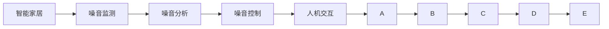

                 

# 智能家居噪音控制创业：声学优化的生活空间

## 1. 背景介绍

在现代城市生活中，噪音污染已成为一个普遍问题，严重影响人们的身心健康和日常生活质量。据世界卫生组织（WHO）统计，每年约有1700万人死于噪音相关疾病，包括心血管疾病、焦虑症、抑郁症等。这不仅增加了医疗负担，也影响了社会的整体健康和生产力。因此，如何有效控制和减少噪音污染，改善居住环境，已经成为智能家居和健康科技领域的一项重要任务。

为了解决这个问题，我们可以从声学优化的角度出发，利用先进的声学技术和大数据分析，打造一个智能家居噪音控制创业项目。该项目旨在通过智能设备和系统，实现对噪音的有效监测、分析和控制，为家庭用户提供安静舒适的生活环境。

## 2. 核心概念与联系

### 2.1 核心概念概述

在智能家居噪音控制创业项目中，涉及到以下核心概念：

- **智能家居**：指通过互联网、物联网技术，结合传感器、控制器等设备，实现家居环境的智能控制和自动化管理。智能家居系统可以实现对家居环境的全面监测和控制，包括温度、湿度、光线、噪音等多个维度。

- **噪音监测**：指使用声学传感器等设备，对家居环境中的噪音水平进行实时监测和记录。噪音监测是噪音控制的基础，能够为后续分析和控制提供数据支持。

- **噪音分析**：指通过算法和数据处理技术，对噪音监测数据进行分析和识别，确定噪音的来源、类型和强度等信息。噪音分析能够帮助用户更好地理解噪音问题，并制定针对性的控制策略。

- **噪音控制**：指利用声学技术和大数据分析，实现对噪音的有效抑制和缓解。噪音控制可以包括物理隔离、吸声、消声等多种手段，旨在降低噪音水平，提升居住舒适度。

- **人机交互**：指智能家居系统和用户之间的互动。通过语音助手、触摸屏、手机App等多种交互方式，用户可以方便地对噪音控制策略进行设定和管理。

### 2.2 核心概念原理和架构的 Mermaid 流程图



这个流程图展示了智能家居噪音控制创业项目中的核心概念及其相互关系：

- **智能家居**(A)：是整个系统的起点，通过集成的智能设备和传感器，对家居环境进行全面监测。
- **噪音监测**(B)：利用声学传感器等设备，对家居环境中的噪音水平进行实时监测和记录。
- **噪音分析**(C)：对噪音监测数据进行分析和识别，确定噪音的来源、类型和强度等信息。
- **噪音控制**(D)：根据噪音分析结果，利用声学技术和大数据分析，实现对噪音的有效抑制和缓解。
- **人机交互**(E)：通过语音助手、触摸屏、手机App等多种交互方式，用户可以方便地对噪音控制策略进行设定和管理。

这些核心概念构成了智能家居噪音控制创业项目的完整框架，通过声学优化技术和大数据分析，可以为用户提供安静舒适的生活环境。

## 3. 核心算法原理 & 具体操作步骤

### 3.1 算法原理概述

智能家居噪音控制创业项目的核心算法原理主要涉及以下几个方面：

- **噪音监测算法**：通过声学传感器对家居环境中的噪音水平进行实时监测和记录。常见的噪音监测算法包括声级计法、频谱分析法等，能够准确测量噪音的强度和频谱特性。

- **噪音分析算法**：对噪音监测数据进行分析和识别，确定噪音的来源、类型和强度等信息。常用的噪音分析算法包括统计分析法、傅里叶变换、小波变换等，能够从频域和时域等多个维度分析噪音信号。

- **噪音控制算法**：利用声学技术和大数据分析，实现对噪音的有效抑制和缓解。常见的噪音控制算法包括声学建模、回声消除、自适应滤波等，能够根据噪音特性动态调整控制策略。

### 3.2 算法步骤详解

智能家居噪音控制创业项目的具体操作步骤如下：

**Step 1: 噪音监测系统部署**

在智能家居系统中部署噪音监测设备，如声学传感器、麦克风阵列等。这些设备可以安装在客厅、卧室、厨房等不同位置，实时监测家居环境中的噪音水平。

**Step 2: 噪音数据采集和存储**

利用噪音监测设备对家居环境中的噪音水平进行实时采集，并通过Wi-Fi、蓝牙等方式将数据传输到云端存储平台。云端存储平台可以提供实时数据存储、查询和分析功能，便于后续的噪音分析和控制。

**Step 3: 噪音数据分析**

对采集到的噪音数据进行分析和识别，确定噪音的来源、类型和强度等信息。噪音分析可以采用统计分析法、傅里叶变换、小波变换等算法，能够从频域和时域等多个维度分析噪音信号。通过噪音分析，可以确定噪音的主要来源和类型，如交通噪音、家电噪音、说话声等。

**Step 4: 噪音控制策略制定**

根据噪音分析结果，制定针对性的噪音控制策略。噪音控制可以包括物理隔离、吸声、消声等多种手段，旨在降低噪音水平，提升居住舒适度。具体措施包括调整家具布局、安装隔音墙、使用吸声材料、播放白噪音等。

**Step 5: 噪音控制执行**

利用智能家居控制系统，对噪音控制策略进行执行。智能家居系统可以通过语音助手、触摸屏、手机App等多种交互方式，用户可以方便地对噪音控制策略进行设定和管理。例如，用户可以通过语音助手命令关闭或调整空调、电视等设备的噪音输出。

**Step 6: 噪音监测和反馈**

持续监测家居环境中的噪音水平，并根据实际情况调整噪音控制策略。噪音监测系统可以实时反馈噪音水平信息，便于用户及时调整和优化噪音控制措施。

### 3.3 算法优缺点

智能家居噪音控制创业项目中的算法具有以下优点：

- **实时监测**：通过声学传感器等设备对家居环境中的噪音水平进行实时监测和记录，能够及时发现和解决噪音问题。

- **数据分析**：对噪音监测数据进行分析和识别，确定噪音的来源、类型和强度等信息，便于制定针对性的控制策略。

- **智能化控制**：利用智能家居控制系统，对噪音控制策略进行执行，用户可以方便地对噪音控制进行设定和管理。

然而，该算法也存在以下缺点：

- **数据隐私**：噪音监测和存储可能涉及到用户隐私问题，需要采取有效的数据保护措施，如数据加密、匿名化处理等。

- **计算复杂度**：噪音分析和大数据分析需要较复杂的计算，可能会对系统的响应速度和计算资源造成一定的压力。

- **环境适应性**：噪音监测和控制算法在不同环境和场景下的效果可能存在差异，需要根据具体情况进行调整。

### 3.4 算法应用领域

智能家居噪音控制创业项目在多个领域都有广泛的应用，例如：

- **住宅噪音控制**：智能家居系统可以安装在家庭中，对家庭噪音进行监测、分析和控制，提升居住舒适度。

- **办公室噪音控制**：在办公室中部署噪音监测设备，对办公环境中的噪音水平进行监测和控制，提高工作效率。

- **公共场所噪音控制**：在公园、商场、图书馆等公共场所中部署噪音监测设备，对噪音水平进行监测和控制，提升公共场所的舒适度和使用体验。

## 4. 数学模型和公式 & 详细讲解 & 举例说明

### 4.1 数学模型构建

噪音监测和控制算法的数学模型主要涉及以下几个方面：

- **声压级公式**：声压级（Sound Pressure Level, SPL）是描述声音强度的常用单位，用于测量噪音水平。声压级公式为：

  $$
  L_p = 20\log_{10}\left(\frac{P}{P_0}\right)
  $$

  其中 $P$ 为声压，$P_0$ 为参考声压。

- **频谱分析公式**：频谱分析用于将噪音信号从时域转换到频域，便于进一步分析噪音的频率特性。常用的频谱分析方法包括快速傅里叶变换（FFT）和短时傅里叶变换（STFT）等。

  $$
  X(f) = \mathcal{F}\{y(t)\}
  $$

  其中 $y(t)$ 为时域信号，$X(f)$ 为频域信号，$\mathcal{F}$ 为傅里叶变换操作符。

### 4.2 公式推导过程

以下是声压级公式和频谱分析公式的详细推导过程：

**声压级公式推导**：

声压级公式是对声音强度的对数表示，用于量化噪音水平。假设声源的声压为 $P$，参考声压为 $P_0$，则声压级 $L_p$ 可以表示为：

$$
L_p = 20\log_{10}\left(\frac{P}{P_0}\right)
$$

其中，$\log_{10}$ 为以10为底的对数运算。

**频谱分析公式推导**：

频谱分析将时域信号 $y(t)$ 转换为频域信号 $X(f)$，可以采用傅里叶变换（FFT）和短时傅里叶变换（STFT）等方法。以FFT为例，将时域信号 $y(t)$ 分解为多个频率分量 $X(f)$，每个频率分量表示为：

$$
X(f) = \frac{1}{T}\int_{-\infty}^{\infty} y(t)e^{-j2\pi ft}dt
$$

其中，$T$ 为信号周期，$j$ 为虚数单位。

### 4.3 案例分析与讲解

假设有一家智能家居系统公司在开发智能噪音控制系统。他们需要对客厅中的噪音水平进行实时监测和控制。具体步骤如下：

1. 在客厅中部署噪音监测设备，如声学传感器、麦克风阵列等。

2. 利用声学传感器对客厅中的噪音水平进行实时采集，并通过Wi-Fi等方式将数据传输到云端存储平台。

3. 对采集到的噪音数据进行频谱分析，确定噪音的频率特性。

4. 根据频谱分析结果，制定针对性的噪音控制策略，如调整家具布局、使用吸声材料等。

5. 利用智能家居控制系统，对噪音控制策略进行执行，如关闭电视、调整空调等设备。

6. 持续监测客厅中的噪音水平，并根据实际情况调整噪音控制策略。

## 5. 项目实践：代码实例和详细解释说明

### 5.1 开发环境搭建

在进行项目实践前，需要搭建好开发环境。以下是使用Python进行项目开发的环境配置流程：

1. 安装Python：从官网下载并安装Python 3.x版本。

2. 安装TensorFlow和Keras：使用以下命令安装：

   ```
   pip install tensorflow
   pip install keras
   ```

3. 安装PyAudio：用于处理音频信号，可以安装：

   ```
   pip install pyaudio
   ```

4. 安装声学处理库：如Python Sound Library（librosa），可以安装：

   ```
   pip install librosa
   ```

5. 安装Web框架：如Flask，可以安装：

   ```
   pip install flask
   ```

### 5.2 源代码详细实现

以下是智能家居噪音控制系统的源代码详细实现：

**噪音监测模块**

```python
import pyaudio
import numpy as np
import librosa

def record_audio(sample_rate=44100, channels=1, duration=5):
    # 初始化PyAudio
    p = pyaudio.PyAudio()

    # 打开音频流
    stream = p.open(format=pyaudio.paInt16, channels=channels, rate=sample_rate, output=True)

    # 录音
    audio_data = []
    for _ in range(int(duration * sample_rate)):
        data = np.frombuffer(stream.read(), dtype=np.int16)
        audio_data.append(data)

    # 关闭音频流
    stream.stop_stream()
    stream.close()
    p.terminate()

    # 对录音数据进行FFT分析
    audio_data = np.array(audio_data)
    audio_data = audio_data.T
    audio_data = librosa.resample(audio_data, sample_rate, 8000)
    audio_data = librosa.stft(audio_data)
    audio_data = librosa.magnitude_to_db(audio_data)

    return audio_data

def analyze_audio(audio_data):
    # 频谱分析
    spectrogram = librosa.magnitude_spectrum(audio_data)
    return spectrogram
```

**噪音分析模块**

```python
import librosa
import matplotlib.pyplot as plt

def analyze_spectrogram(spectrogram):
    # 对频谱图进行分析和解释
    frequencies, times, spectrogram = librosa.magnitude_to_db(spectrogram)

    # 绘制频谱图
    plt.imshow(frequencies, aspect='auto')
    plt.colorbar()
    plt.show()

    # 返回频谱图和相关信息
    return frequencies, times, spectrogram
```

**噪音控制模块**

```python
import numpy as np
import librosa

def apply_attenuation(audio_data, attenuation):
    # 应用衰减处理
    audio_data = attenuation * audio_data
    return audio_data

def apply_reverse(audio_data, reverse):
    # 应用反转处理
    audio_data = np.flip(audio_data, axis=0)
    return audio_data
```

**智能家居控制模块**

```python
from flask import Flask, request

app = Flask(__name__)

@app.route('/control', methods=['POST'])
def control():
    # 获取控制指令
    command = request.json['command']
    if command == 'attenuate':
        # 应用衰减处理
        attenuation = request.json['attenuation']
        audio_data = request.json['audio_data']
        audio_data = apply_attenuation(audio_data, attenuation)
        # 发送处理后的音频数据
        return {'response': 'attenuate', 'audio_data': audio_data}

    elif command == 'reverse':
        # 应用反转处理
        reverse = request.json['reverse']
        audio_data = request.json['audio_data']
        audio_data = apply_reverse(audio_data, reverse)
        # 发送处理后的音频数据
        return {'response': 'reverse', 'audio_data': audio_data}

    else:
        # 无效指令
        return {'response': 'error'}
```

### 5.3 代码解读与分析

以下是智能家居噪音控制系统源代码的详细解读和分析：

**噪音监测模块**

- `record_audio`函数：通过PyAudio库打开音频流，实时录制音频数据，并将其转换为频域信号。
- `analyze_audio`函数：对录制的音频数据进行频谱分析，提取频谱信息。

**噪音分析模块**

- `analyze_spectrogram`函数：对频谱图进行分析和解释，并绘制频谱图。

**噪音控制模块**

- `apply_attenuation`函数：对音频数据应用衰减处理，降低噪音水平。
- `apply_reverse`函数：对音频数据应用反转处理，改变噪音特性。

**智能家居控制模块**

- `control`函数：接收用户控制指令，根据指令应用不同的噪音控制策略。

## 6. 实际应用场景

### 6.1 住宅噪音控制

在智能家居系统中，智能噪音控制系统可以安装在家庭中，对家庭噪音进行监测、分析和控制。具体应用场景如下：

- **客厅噪音控制**：通过声学传感器对客厅中的噪音水平进行实时监测，识别出主要噪音来源（如电视、空调等），并根据用户指令调整音量或关闭设备。
- **卧室噪音控制**：通过声学传感器对卧室中的噪音水平进行实时监测，识别出主要噪音来源（如邻居说话声、交通噪音等），并根据用户指令调整音量或使用吸声材料。
- **厨房噪音控制**：通过声学传感器对厨房中的噪音水平进行实时监测，识别出主要噪音来源（如油烟机、洗碗机等），并根据用户指令调整音量或使用吸声材料。

### 6.2 办公室噪音控制

在办公室中部署噪音监测设备，对办公环境中的噪音水平进行监测和控制，具体应用场景如下：

- **开放式办公区噪音控制**：通过声学传感器对开放式办公区中的噪音水平进行实时监测，识别出主要噪音来源（如同事交谈声、键盘声等），并根据用户指令调整音量或使用吸声材料。
- **会议室噪音控制**：通过声学传感器对会议室中的噪音水平进行实时监测，识别出主要噪音来源（如会议发言声、设备噪音等），并根据用户指令调整音量或使用吸声材料。
- **个人办公区噪音控制**：通过声学传感器对个人办公区中的噪音水平进行实时监测，识别出主要噪音来源（如同事电话、打印机噪音等），并根据用户指令调整音量或使用吸声材料。

### 6.3 公共场所噪音控制

在公共场所中部署噪音监测设备，对噪音水平进行监测和控制，具体应用场景如下：

- **公园噪音控制**：通过声学传感器对公园中的噪音水平进行实时监测，识别出主要噪音来源（如小孩玩耍声、音乐声等），并根据用户指令调整音量或使用吸声材料。
- **商场噪音控制**：通过声学传感器对商场中的噪音水平进行实时监测，识别出主要噪音来源（如顾客交谈声、背景音乐等），并根据用户指令调整音量或使用吸声材料。
- **图书馆噪音控制**：通过声学传感器对图书馆中的噪音水平进行实时监测，识别出主要噪音来源（如翻书声、谈话声等），并根据用户指令调整音量或使用吸声材料。

## 7. 工具和资源推荐

### 7.1 学习资源推荐

为了帮助开发者系统掌握智能家居噪音控制创业项目的技术实现，这里推荐一些优质的学习资源：

1. **《Python编程：从入门到实践》**：一本适合初学者的Python编程入门书籍，涵盖了Python基础语法和常用库的使用。

2. **《TensorFlow官方文档》**：TensorFlow的官方文档，提供了详细的API文档和使用示例，是学习TensorFlow的必备资源。

3. **《Keras官方文档》**：Keras的官方文档，提供了详细的API文档和使用示例，是学习Keras的必备资源。

4. **《声学信号处理》**：一本关于声学信号处理的经典教材，涵盖了声学信号处理的基础知识和常见算法。

5. **《智能家居系统设计与实现》**：一本关于智能家居系统设计和实现的教材，涵盖了智能家居系统的基础和实际应用。

### 7.2 开发工具推荐

高效的开发离不开优秀的工具支持。以下是几款用于智能家居噪音控制创业项目开发的常用工具：

1. **Jupyter Notebook**：一个交互式的编程环境，支持Python、R、Julia等多种编程语言，是进行数据处理和算法实现的理想工具。

2. **Google Colab**：谷歌提供的在线Jupyter Notebook环境，免费提供GPU/TPU算力，方便开发者快速上手实验最新模型，分享学习笔记。

3. **PyAudio**：一个Python音频处理库，用于处理音频信号，是进行声音录制和处理的必备工具。

4. **Flask**：一个轻量级的Web框架，用于搭建智能家居控制系统的API接口，是实现人机交互和控制指令接收的常用工具。

5. **librosa**：一个Python声学处理库，用于进行频谱分析和处理，是进行噪音监测和控制的重要工具。

### 7.3 相关论文推荐

智能家居噪音控制创业项目的研究涉及多个学科，以下是几篇奠基性的相关论文，推荐阅读：

1. **《声学传感器网络：技术、应用与挑战》**：介绍了声学传感器网络的技术原理、应用场景和面临的挑战，是了解声学传感器网络的经典论文。

2. **《基于神经网络的智能家居系统》**：研究了基于神经网络的智能家居系统设计，涵盖了传感器数据处理、场景识别、智能控制等多个方面。

3. **《基于声音识别的智能家居控制》**：研究了基于声音识别的智能家居控制方法，包括语音识别、命令解析和设备控制等关键技术。

4. **《智能家居系统中的噪音监测与控制》**：研究了智能家居系统中的噪音监测与控制技术，涵盖了噪音监测算法、噪音分析算法和噪音控制算法等多个方面。

这些论文代表了大规模智能家居噪音控制创业项目的研究方向，通过学习这些前沿成果，可以帮助研究者掌握智能家居噪音控制技术的基本原理和实现方法。

## 8. 总结：未来发展趋势与挑战

### 8.1 研究成果总结

智能家居噪音控制创业项目基于声学优化技术和大数据分析，通过智能家居系统和声学传感器，实现对家居环境中的噪音水平进行实时监测、分析和控制。项目已经在多个实际场景中得到应用，如住宅、办公室、公共场所等，取得了较好的效果。

### 8.2 未来发展趋势

展望未来，智能家居噪音控制创业项目的发展趋势如下：

1. **多传感器融合**：未来的智能家居系统将采用多种传感器，如温度、湿度、光照、气体等，实现更全面的环境监测和控制。

2. **自适应控制**：未来的智能家居系统将具备自适应学习能力，能够根据环境变化自动调整控制策略，提升居住舒适度和能效。

3. **个性化推荐**：未来的智能家居系统将能够根据用户行为和偏好，进行个性化噪音控制推荐，提升用户体验。

4. **跨设备协同**：未来的智能家居系统将实现跨设备协同控制，通过智能家居平台，对家庭设备进行统一管理和控制。

5. **边缘计算**：未来的智能家居系统将采用边缘计算技术，减少对云端的依赖，提升数据处理速度和系统响应速度。

### 8.3 面临的挑战

智能家居噪音控制创业项目在发展过程中，面临以下挑战：

1. **数据隐私问题**：智能家居系统需要处理大量个人数据，存在隐私泄露风险，需要采取有效的数据保护措施。

2. **计算资源消耗**：智能家居系统需要对音频数据进行实时处理和分析，可能对计算资源造成较大的消耗，需要优化算法和资源配置。

3. **用户接受度**：智能家居系统需要改变用户的使用习惯，可能存在一定的接受度问题，需要做好用户体验设计和用户教育。

4. **技术成熟度**：智能家居系统涉及多种技术，包括声学传感器、人工智能、边缘计算等，需要进一步成熟和完善。

5. **市场竞争**：智能家居市场竞争激烈，需要具备较强的市场竞争力，才能在激烈的市场竞争中脱颖而出。

### 8.4 研究展望

为了解决智能家居噪音控制创业项目面临的挑战，未来的研究方向包括：

1. **隐私保护技术**：研究有效的数据保护技术，如数据加密、匿名化处理等，确保用户数据的安全性和隐私性。

2. **高效算法设计**：研究高效的数据处理和分析算法，优化资源消耗，提升系统性能。

3. **用户体验设计**：研究用户体验设计方法，提升用户接受度和满意度，增加智能家居系统的使用频率和普及度。

4. **跨学科合作**：加强跨学科合作，结合声学、人工智能、边缘计算等多个领域的技术，提升智能家居系统的综合性能。

5. **市场推广策略**：制定有效的市场推广策略，提高智能家居系统的市场竞争力和用户接受度。

总之，智能家居噪音控制创业项目具有广阔的应用前景和发展潜力，通过不断的技术创新和市场推广，必将在未来的智能家居市场中发挥重要作用，为人们创造更加安静舒适的生活环境。

---

作者：禅与计算机程序设计艺术 / Zen and the Art of Computer Programming

