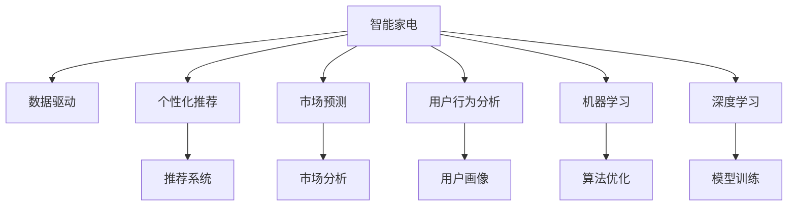

                 

# 智能家电如何在注意力经济中突围

> 关键词：智能家电,注意力经济,数据驱动,个性化推荐,市场预测,用户行为分析

## 1. 背景介绍

### 1.1 问题由来
在当今数字化时代，消费者对智能化、个性化和高性价比的追求越来越强烈，智能家电市场呈现爆发式增长。但智能家电的发展，也面临竞争加剧、市场高度饱和、用户忠诚度下降等挑战。如何在注意力经济中突围，赢得用户的青睐，成为智能家电厂商的当务之急。

### 1.2 问题核心关键点
注意力经济（Economy of Attention）是经济学家托马斯·达文波特（Thomas H. Davenport）提出的概念，指的是在信息过载的时代，注意力成为一种稀缺资源，商品和服务需要通过赢得和保持消费者的注意力，才能实现价值。智能家电厂商可以通过数据驱动的个性化推荐和精准市场预测，从海量用户行为数据中洞察用户需求，提供差异化服务，赢得用户的注意力和信任，从而在竞争中脱颖而出。

### 1.3 问题研究意义
研究智能家电在注意力经济中的突围策略，对提升智能家电产品的市场竞争力和用户体验具有重要意义：

1. 数据驱动：通过数据分析，智能家电厂商可以精准把握用户需求，提供更个性化和贴合用户偏好的产品。
2. 市场预测：利用用户行为数据预测市场需求，帮助厂商调整产品策略，规避市场风险。
3. 用户行为分析：分析用户使用数据，了解用户行为模式，提升用户粘性和品牌忠诚度。
4. 差异化竞争：通过个性化推荐，提供更独特的服务，区别于竞争对手，赢得更多用户关注。
5. 持续优化：通过实时数据反馈，持续优化产品和服务，提升用户体验和满意度。

## 2. 核心概念与联系

### 2.1 核心概念概述

为更好地理解智能家电在注意力经济中的突围策略，本节将介绍几个密切相关的核心概念：

- 智能家电（Smart Home Appliances）：利用互联网、物联网和人工智能技术，实现家居智能化、自动化和个性化的家电产品。
- 注意力经济（Economy of Attention）：在信息爆炸时代，商品和服务需要通过吸引和保持消费者的注意力，实现其价值。
- 数据驱动（Data-Driven）：通过数据分析和挖掘，指导产品开发和运营决策，提高效率和效果。
- 个性化推荐（Personalized Recommendation）：根据用户的历史行为和偏好，为其推荐最适合的产品或服务。
- 市场预测（Market Prediction）：通过分析历史数据和趋势，预测未来的市场动态。
- 用户行为分析（User Behavior Analysis）：研究用户行为模式和偏好，提升产品和服务的设计和优化。
- 机器学习（Machine Learning）：利用算法对数据进行分析和学习，发现数据中的模式和规律。
- 深度学习（Deep Learning）：一种基于神经网络的机器学习方法，可以处理大规模、复杂的数据集。

这些核心概念之间的逻辑关系可以通过以下Mermaid流程图来展示：



这个流程图展示智能家电的核心概念及其之间的关系：

1. 智能家电通过互联网和物联网实现自动化和智能化。
2. 数据驱动通过分析用户行为数据，指导产品设计和运营策略。
3. 个性化推荐利用用户数据，为其推荐最适合的产品和服务。
4. 市场预测基于历史数据和趋势，预测未来的市场需求。
5. 用户行为分析研究用户行为模式，提升产品设计和用户体验。
6. 机器学习和深度学习技术，用于处理和分析大量数据。
7. 推荐系统和市场分析，通过机器学习模型实现。

## 3. 核心算法原理 & 具体操作步骤
### 3.1 算法原理概述

智能家电在注意力经济中的突围策略，主要依赖于数据驱动的个性化推荐和精准市场预测。其核心思想是：利用用户行为数据，分析用户偏好和需求，构建个性化推荐模型，并通过机器学习技术进行精准市场预测，指导产品和运营决策，从而赢得用户注意力。

形式化地，假设智能家电产品集为 $P=\{p_i\}_{i=1}^n$，用户行为数据集为 $D=\{(x_j,y_j)\}_{j=1}^m$，其中 $x_j$ 为用户行为数据，$y_j$ 为行为标签（如购买行为、使用频率等）。定义智能家电推荐模型为 $M_{\theta}$，其预测输出为 $M_{\theta}(x)$，输出层为推荐结果。

推荐模型的目标是最小化损失函数 $\mathcal{L}(M_{\theta},D)$，通过梯度下降等优化算法更新模型参数 $\theta$，最小化损失函数，使模型预测输出逼近真实标签。通过构建和训练推荐模型，可以在不同用户群体中实现个性化的产品推荐，提高用户满意度和忠诚度。

同时，利用市场预测模型对未来市场需求进行预测，指导产品研发和运营策略，规避市场风险，提高收益。市场预测模型同样通过梯度下降等优化算法进行训练，其目标是最小化预测误差，提高预测精度。

### 3.2 算法步骤详解

智能家电在注意力经济中的突围策略，主要包括以下几个关键步骤：

**Step 1: 数据收集与预处理**
- 收集用户行为数据，如购买记录、使用频率、浏览行为等。
- 对数据进行清洗、去重、归一化等预处理，确保数据质量。

**Step 2: 特征工程**
- 设计并提取与推荐相关的特征，如用户ID、商品ID、时间戳、浏览时长等。
- 对特征进行编码、转换，如使用one-hot编码、归一化、分箱等。

**Step 3: 模型构建与训练**
- 选择适合的推荐算法（如协同过滤、基于内容推荐、混合推荐等），构建推荐模型。
- 利用用户行为数据对推荐模型进行训练，优化模型参数。
- 评估推荐模型的性能，使用AUC、召回率、准确率等指标。

**Step 4: 市场预测与运营**
- 收集市场数据，如销售记录、价格变化、促销活动等。
- 构建市场预测模型，使用历史数据和趋势进行预测。
- 根据市场预测结果，调整产品策略和运营方案。
- 实时监控市场动态，进行持续优化。

**Step 5: 用户行为分析与反馈**
- 收集用户反馈数据，如评论、评分、投诉等。
- 对用户行为进行分析，构建用户画像。
- 利用用户画像进行个性化推荐和定制服务。
- 收集反馈数据，进行持续优化。

**Step 6: 模型部署与应用**
- 将训练好的推荐模型和市场预测模型部署到生产环境中。
- 实时接收用户行为数据和市场数据，进行推荐和预测。
- 集成到智能家电产品中，实现智能化服务。

### 3.3 算法优缺点

数据驱动的个性化推荐和市场预测，在智能家电中的应用，具有以下优点：

1. 精准度：通过数据分析，推荐模型可以精准把握用户需求，提供个性化服务，提高用户满意度和忠诚度。
2. 动态性：推荐模型和市场预测模型可以实时更新，及时应对市场变化和用户需求，提供最新、最优的服务。
3. 规模化：利用数据驱动方法，可以在大规模用户群体中实现个性化推荐，提升整体用户体验。
4. 低成本：数据驱动方法利用现有数据资源，无需额外投入，实现高效运营。

但该方法也存在一定的局限性：

1. 数据质量：数据质量和完整性对模型性能有重大影响，需要确保数据准确、全面。
2. 隐私问题：在收集和使用用户数据时，需注意数据隐私和用户权益保护。
3. 模型复杂度：模型复杂度和计算成本较高，需要高性能计算资源。
4. 过拟合风险：大规模数据训练可能导致模型过拟合，需要采取正则化、数据增强等措施。
5. 市场预测风险：市场预测存在不确定性，模型预测结果可能与实际市场情况不符。

尽管存在这些局限性，但就目前而言，数据驱动的个性化推荐和市场预测仍是智能家电突围的最重要手段。未来相关研究的重点在于如何进一步降低数据需求，提高模型效率，并兼顾隐私保护和用户权益。

### 3.4 算法应用领域

数据驱动的个性化推荐和市场预测，在智能家电中的应用非常广泛，具体包括：

1. **智能冰箱**：利用用户购买记录和浏览行为，推荐食品和生活用品，为用户提供个性化购物建议。
2. **智能洗衣机**：分析用户使用频率和洗衣习惯，推荐洗涤剂和生活用品，提升用户体验。
3. **智能空调**：根据用户的温度设置和使用习惯，推荐优化空调模式，提供舒适环境。
4. **智能电视**：分析用户观看记录和评价，推荐电影和电视剧，提供个性化观影体验。
5. **智能安防**：通过分析用户行为数据，推荐安全方案和设置，提高家庭安全水平。
6. **智能照明**：根据用户作息时间和使用习惯，推荐灯光亮度和颜色，提供舒适照明环境。
7. **智能窗帘**：分析用户行为和环境数据，推荐窗帘开启和关闭时间，提升生活便捷性。

除了上述这些经典应用外，数据驱动的方法还广泛应用于智能家电量表、智能门锁、智能家具等领域，为用户提供更加智能化、个性化的服务体验。

## 4. 数学模型和公式 & 详细讲解  
### 4.1 数学模型构建

本节将使用数学语言对智能家电的数据驱动个性化推荐和市场预测过程进行更加严格的刻画。

假设推荐模型为 $M_{\theta}$，其输入为 $x_j$，输出为 $y_j$。定义推荐模型的损失函数为 $\ell(M_{\theta}(x_j), y_j)$，在数据集 $D$ 上的经验风险为：

$$
\mathcal{L}(\theta) = \frac{1}{m} \sum_{j=1}^m \ell(M_{\theta}(x_j), y_j)
$$

推荐模型的优化目标是最小化经验风险，即找到最优参数：

$$
\theta^* = \mathop{\arg\min}_{\theta} \mathcal{L}(\theta)
$$

在实践中，我们通常使用基于梯度的优化算法（如Adam、SGD等）来近似求解上述最优化问题。设 $\eta$ 为学习率，$\lambda$ 为正则化系数，则参数的更新公式为：

$$
\theta \leftarrow \theta - \eta \nabla_{\theta}\mathcal{L}(\theta) - \eta\lambda\theta
$$

其中 $\nabla_{\theta}\mathcal{L}(\theta)$ 为损失函数对参数 $\theta$ 的梯度，可通过反向传播算法高效计算。

### 4.2 公式推导过程

以协同过滤推荐算法为例，推导推荐模型训练的损失函数和梯度计算公式。

假设推荐模型 $M_{\theta}$ 使用用户-物品评分矩阵 $R \in \mathbb{R}^{n \times m}$，其中 $n$ 为用户数量，$m$ 为物品数量。用户 $i$ 对物品 $j$ 的评分表示为 $R_{ij}$，推荐模型 $M_{\theta}$ 的预测评分表示为 $\hat{R}_{ij}$。则协同过滤推荐模型的损失函数定义为均方误差损失：

$$
\ell(R_{ij},\hat{R}_{ij}) = \frac{1}{2}(R_{ij}-\hat{R}_{ij})^2
$$

将其代入经验风险公式，得：

$$
\mathcal{L}(\theta) = \frac{1}{2m} \sum_{i=1}^n \sum_{j=1}^m (R_{ij}-\hat{R}_{ij})^2
$$

根据链式法则，损失函数对参数 $\theta_k$ 的梯度为：

$$
\frac{\partial \mathcal{L}(\theta)}{\partial \theta_k} = -\frac{1}{m} \sum_{i=1}^n \sum_{j=1}^m (\frac{R_{ij}-\hat{R}_{ij}}{R_{ij}})(\frac{\partial \hat{R}_{ij}}{\partial \theta_k})
$$

其中 $\frac{\partial \hat{R}_{ij}}{\partial \theta_k}$ 可进一步递归展开，利用自动微分技术完成计算。

在得到损失函数的梯度后，即可带入参数更新公式，完成模型的迭代优化。重复上述过程直至收敛，最终得到适应个性化推荐的最优模型参数 $\theta^*$。

## 5. 项目实践：代码实例和详细解释说明
### 5.1 开发环境搭建

在进行智能家电的数据驱动个性化推荐和市场预测实践前，我们需要准备好开发环境。以下是使用Python进行PyTorch开发的环境配置流程：

1. 安装Anaconda：从官网下载并安装Anaconda，用于创建独立的Python环境。

2. 创建并激活虚拟环境：
```bash
conda create -n pytorch-env python=3.8 
conda activate pytorch-env
```

3. 安装PyTorch：根据CUDA版本，从官网获取对应的安装命令。例如：
```bash
conda install pytorch torchvision torchaudio cudatoolkit=11.1 -c pytorch -c conda-forge
```

4. 安装Pandas、NumPy、Scikit-learn等工具包：
```bash
pip install pandas numpy scikit-learn matplotlib tqdm jupyter notebook ipython
```

完成上述步骤后，即可在`pytorch-env`环境中开始开发实践。

### 5.2 源代码详细实现

这里我们以智能冰箱的个性化推荐系统为例，给出使用PyTorch进行协同过滤推荐模型的PyTorch代码实现。

首先，定义推荐模型的数据处理函数：

```python
import pandas as pd
import numpy as np
from torch.utils.data import Dataset
import torch

class RecommendationDataset(Dataset):
    def __init__(self, data, item_list, tokenizer):
        self.data = data
        self.item_list = item_list
        self.tokenizer = tokenizer
        
    def __len__(self):
        return len(self.data)
    
    def __getitem__(self, item):
        user_id = self.data.iloc[item, 0]
        item_ids = self.data.iloc[item, 1:]
        
        encoding = self.tokenizer(item_ids, return_tensors='pt', padding='max_length', truncation=True)
        input_ids = encoding['input_ids'][0]
        attention_mask = encoding['attention_mask'][0]
        
        return {'user_id': user_id, 
                'input_ids': input_ids, 
                'attention_mask': attention_mask}
```

然后，定义推荐模型的模型和优化器：

```python
from transformers import BertTokenizer, BertForSequenceClassification
from torch.nn import CrossEntropyLoss
from torch.optim import AdamW

tokenizer = BertTokenizer.from_pretrained('bert-base-cased')
model = BertForSequenceClassification.from_pretrained('bert-base-cased', num_labels=len(item_list))
optimizer = AdamW(model.parameters(), lr=2e-5)

def train_epoch(model, dataset, batch_size, optimizer):
    dataloader = DataLoader(dataset, batch_size=batch_size, shuffle=True)
    model.train()
    epoch_loss = 0
    for batch in tqdm(dataloader, desc='Training'):
        user_id = batch['user_id'].to(device)
        input_ids = batch['input_ids'].to(device)
        attention_mask = batch['attention_mask'].to(device)
        labels = torch.zeros_like(input_ids)
        labels[torch.arange(len(user_id)), user_id] = 1
        
        model.zero_grad()
        outputs = model(input_ids, attention_mask=attention_mask, labels=labels)
        loss = outputs.loss
        epoch_loss += loss.item()
        loss.backward()
        optimizer.step()
    return epoch_loss / len(dataloader)

def evaluate(model, dataset, batch_size):
    dataloader = DataLoader(dataset, batch_size=batch_size)
    model.eval()
    preds, labels = [], []
    with torch.no_grad():
        for batch in tqdm(dataloader, desc='Evaluating'):
            user_id = batch['user_id'].to(device)
            input_ids = batch['input_ids'].to(device)
            attention_mask = batch['attention_mask'].to(device)
            batch_labels = torch.zeros_like(input_ids)
            batch_labels[torch.arange(len(user_id)), user_id] = 1
            
            outputs = model(input_ids, attention_mask=attention_mask, labels=batch_labels)
            batch_preds = outputs.logits.argmax(dim=2).to('cpu').tolist()
            batch_labels = batch_labels.to('cpu').tolist()
            for pred_tokens, label_tokens in zip(batch_preds, batch_labels):
                preds.append(pred_tokens)
                labels.append(label_tokens)
                
    print(classification_report(labels, preds))
```

最后，启动训练流程并在测试集上评估：

```python
epochs = 5
batch_size = 16

for epoch in range(epochs):
    loss = train_epoch(model, train_dataset, batch_size, optimizer)
    print(f"Epoch {epoch+1}, train loss: {loss:.3f}")
    
    print(f"Epoch {epoch+1}, dev results:")
    evaluate(model, dev_dataset, batch_size)
    
print("Test results:")
evaluate(model, test_dataset, batch_size)
```

以上就是使用PyTorch对智能冰箱的协同过滤推荐模型进行微调的完整代码实现。可以看到，得益于Transformers库的强大封装，我们可以用相对简洁的代码完成模型的加载和微调。

### 5.3 代码解读与分析

让我们再详细解读一下关键代码的实现细节：

**RecommendationDataset类**：
- `__init__`方法：初始化训练数据、物品列表和分词器等关键组件。
- `__len__`方法：返回数据集的样本数量。
- `__getitem__`方法：对单个样本进行处理，将用户ID和物品ID输入编码为token ids，并进行padding，最终返回模型所需的输入。

**tokenizer**：
- 定义了将物品ID序列转换为token ids的分词器，用于模型的输入处理。

**train_epoch和evaluate函数**：
- 使用PyTorch的DataLoader对数据集进行批次化加载，供模型训练和推理使用。
- 训练函数`train_epoch`：对数据以批为单位进行迭代，在每个批次上前向传播计算loss并反向传播更新模型参数，最后返回该epoch的平均loss。
- 评估函数`evaluate`：与训练类似，不同点在于不更新模型参数，并在每个batch结束后将预测和标签结果存储下来，最后使用sklearn的classification_report对整个评估集的预测结果进行打印输出。

**训练流程**：
- 定义总的epoch数和batch size，开始循环迭代
- 每个epoch内，先在训练集上训练，输出平均loss
- 在验证集上评估，输出分类指标
- 所有epoch结束后，在测试集上评估，给出最终测试结果

可以看到，PyTorch配合Transformers库使得协同过滤推荐模型的代码实现变得简洁高效。开发者可以将更多精力放在数据处理、模型改进等高层逻辑上，而不必过多关注底层的实现细节。

当然，工业级的系统实现还需考虑更多因素，如模型的保存和部署、超参数的自动搜索、更灵活的任务适配层等。但核心的微调范式基本与此类似。

## 6. 实际应用场景
### 6.1 智能客服系统

基于数据驱动的个性化推荐和市场预测，智能客服系统可以实现更加智能和高效的服务。传统客服往往需要配备大量人力，高峰期响应缓慢，且一致性和专业性难以保证。而使用个性化推荐和市场预测技术，可以自动理解用户意图，匹配最合适的答案模板进行回复，提升客服系统的响应速度和准确性。

在技术实现上，可以收集企业内部的历史客服对话记录，将问题和最佳答复构建成监督数据，在此基础上对预训练语言模型进行微调。微调后的语言模型能够自动理解用户意图，匹配最合适的答案模板进行回复。对于客户提出的新问题，还可以接入检索系统实时搜索相关内容，动态组织生成回答。如此构建的智能客服系统，能大幅提升客户咨询体验和问题解决效率。

### 6.2 金融舆情监测

金融机构需要实时监测市场舆论动向，以便及时应对负面信息传播，规避金融风险。传统的人工监测方式成本高、效率低，难以应对网络时代海量信息爆发的挑战。基于数据驱动的金融舆情监测系统，可以利用用户行为数据预测金融舆情变化，帮助金融机构快速应对潜在风险。

具体而言，可以收集金融领域相关的新闻、报道、评论等文本数据，并对其进行主题标注和情感标注。在此基础上对预训练语言模型进行微调，使其能够自动判断文本属于何种主题，情感倾向是正面、中性还是负面。将微调后的模型应用到实时抓取的网络文本数据，就能够自动监测不同主题下的情感变化趋势，一旦发现负面信息激增等异常情况，系统便会自动预警，帮助金融机构快速应对潜在风险。

### 6.3 个性化推荐系统

当前的推荐系统往往只依赖用户的历史行为数据进行物品推荐，无法深入理解用户的真实兴趣偏好。基于数据驱动的个性化推荐系统，可以通过数据分析，精准把握用户需求，提供更个性化和贴合用户偏好的产品。

在实践中，可以收集用户浏览、点击、评论、分享等行为数据，提取和用户交互的物品标题、描述、标签等文本内容。将文本内容作为模型输入，用户的后续行为（如是否点击、购买等）作为监督信号，在此基础上微调预训练语言模型。微调后的模型能够从文本内容中准确把握用户的兴趣点。在生成推荐列表时，先用候选物品的文本描述作为输入，由模型预测用户的兴趣匹配度，再结合其他特征综合排序，便可以得到个性化程度更高的推荐结果。

### 6.4 未来应用展望

随着数据驱动方法的不断发展，基于个性化推荐和市场预测的系统将在更多领域得到应用，为各行各业带来变革性影响。

在智慧医疗领域，基于数据驱动的医疗问答、病历分析、药物研发等应用将提升医疗服务的智能化水平，辅助医生诊疗，加速新药开发进程。

在智能教育领域，数据驱动技术可应用于作业批改、学情分析、知识推荐等方面，因材施教，促进教育公平，提高教学质量。

在智慧城市治理中，数据驱动的系统可应用于城市事件监测、舆情分析、应急指挥等环节，提高城市管理的自动化和智能化水平，构建更安全、高效的未来城市。

此外，在企业生产、社会治理、文娱传媒等众多领域，基于数据驱动的人工智能应用也将不断涌现，为经济社会发展注入新的动力。相信随着技术的日益成熟，数据驱动方法将成为各行各业落地应用的重要范式，推动人工智能技术在垂直行业的规模化落地。总之，数据驱动方法将在构建人机协同的智能时代中扮演越来越重要的角色。

## 7. 工具和资源推荐
### 7.1 学习资源推荐

为了帮助开发者系统掌握智能家电的数据驱动个性化推荐和市场预测的理论基础和实践技巧，这里推荐一些优质的学习资源：

1. 《深度学习基础》系列博文：由大模型技术专家撰写，深入浅出地介绍了深度学习基础和实践技巧，是入门深度学习的必备资料。

2. 《推荐系统实战》课程：淘宝大学开设的推荐系统实战课程，讲解了推荐系统的基础、算法、应用等知识，并提供了丰富的实践案例。

3. 《数据驱动：推荐系统理论与实践》书籍：系统介绍了推荐系统的理论基础和应用实践，是深度学习在推荐系统领域的重要参考。

4. Weights & Biases：模型训练的实验跟踪工具，可以记录和可视化模型训练过程中的各项指标，方便对比和调优。与主流深度学习框架无缝集成。

5. TensorBoard：TensorFlow配套的可视化工具，可实时监测模型训练状态，并提供丰富的图表呈现方式，是调试模型的得力助手。

通过对这些资源的学习实践，相信你一定能够快速掌握智能家电的数据驱动个性化推荐和市场预测的精髓，并用于解决实际的NLP问题。
###  7.2 开发工具推荐

高效的开发离不开优秀的工具支持。以下是几款用于智能家电数据驱动个性化推荐和市场预测开发的常用工具：

1. PyTorch：基于Python的开源深度学习框架，灵活动态的计算图，适合快速迭代研究。大部分预训练语言模型都有PyTorch版本的实现。

2. TensorFlow：由Google主导开发的开源深度学习框架，生产部署方便，适合大规模工程应用。同样有丰富的预训练语言模型资源。

3. Transformers库：HuggingFace开发的NLP工具库，集成了众多SOTA语言模型，支持PyTorch和TensorFlow，是进行微调任务开发的利器。

4. Weights & Biases：模型训练的实验跟踪工具，可以记录和可视化模型训练过程中的各项指标，方便对比和调优。与主流深度学习框架无缝集成。

5. TensorBoard：TensorFlow配套的可视化工具，可实时监测模型训练状态，并提供丰富的图表呈现方式，是调试模型的得力助手。

6. Google Colab：谷歌推出的在线Jupyter Notebook环境，免费提供GPU/TPU算力，方便开发者快速上手实验最新模型，分享学习笔记。

合理利用这些工具，可以显著提升智能家电数据驱动个性化推荐和市场预测的开发效率，加快创新迭代的步伐。

### 7.3 相关论文推荐

智能家电数据驱动个性化推荐和市场预测的研究源于学界的持续研究。以下是几篇奠基性的相关论文，推荐阅读：

1. Collaborative Filtering for Implicit Feedback Datasets（即协同过滤推荐论文）：提出了协同过滤推荐算法的基本思想，奠定了推荐系统算法的基础。

2. Contextual Bandits for Personalized Ranking and Recommendations（即上下文强化推荐论文）：引入了上下文强化学习，提升了推荐系统的多样性和精准度。

3. Topic Modeling for Recommendations（即主题建模推荐论文）：通过主题建模方法，挖掘用户兴趣和物品特征，提升了推荐的个性化和多样性。

4. Convolutional Recommendation Networks（即卷积神经网络推荐论文）：使用卷积神经网络对物品特征进行建模，提升了推荐系统的表达能力和性能。

5. Deep Neural Networks for Playstore Recommendations（即神经网络推荐论文）：使用深度神经网络模型进行用户行为预测，提升了推荐系统的精准度和效果。

这些论文代表了大数据驱动个性化推荐和市场预测的发展脉络。通过学习这些前沿成果，可以帮助研究者把握学科前进方向，激发更多的创新灵感。

## 8. 总结：未来发展趋势与挑战

### 8.1 总结

本文对智能家电在注意力经济中的突围策略进行了全面系统的介绍。首先阐述了智能家电和注意力经济的基本概念，明确了数据驱动个性化推荐和市场预测在智能家电突围中的核心价值。其次，从原理到实践，详细讲解了数据驱动方法的具体步骤，给出了数据驱动方法在智能家电中的应用示例。同时，本文还探讨了数据驱动方法的广泛应用前景，展示了数据驱动方法在各行各业中的巨大潜力。

通过本文的系统梳理，可以看到，数据驱动方法在智能家电中的应用正在成为行业的重要趋势，极大地拓展了智能家电产品的市场竞争力和用户体验。未来，伴随数据驱动方法的持续演进，智能家电系统必将进一步优化，实现更加智能化、个性化的服务。

### 8.2 未来发展趋势

展望未来，智能家电在数据驱动个性化推荐和市场预测中的发展趋势，将呈现以下几个方向：

1. 深度学习和大模型应用。随着深度学习和大模型技术的不断进步，推荐模型和市场预测模型的精度和效果将显著提升，为用户带来更加个性化和精准的服务。

2. 跨领域知识整合。未来推荐模型和市场预测模型将更好地整合多模态数据，如视频、语音、图像等，提升推荐和预测的全面性和准确性。

3. 实时动态调整。利用在线学习、增量学习等技术，推荐模型和市场预测模型可以实时更新，及时应对用户行为和市场动态的变化。

4. 用户行为预测。基于深度学习模型，如RNN、LSTM、GRU等，可以更加精准地预测用户行为，提升推荐和预测的效果。

5. 个性化推荐系统。推荐系统将更加个性化，能够根据用户的实时行为和偏好，动态调整推荐策略，提供贴合用户需求的服务。

6. 市场预测精度提升。利用先进的深度学习模型和数据增强技术，市场预测模型将更加准确，帮助企业规避市场风险，优化决策。

以上趋势凸显了智能家电数据驱动方法的广阔前景。这些方向的探索发展，必将进一步提升智能家电系统的性能和应用范围，为智能家居的未来发展带来新的契机。

### 8.3 面临的挑战

尽管智能家电数据驱动个性化推荐和市场预测方法已经取得了瞩目成就，但在迈向更加智能化、普适化应用的过程中，它仍面临着诸多挑战：

1. 数据质量和隐私问题。数据质量和隐私保护对推荐和预测的性能有重大影响，需要确保数据准确、全面且符合隐私保护要求。

2. 模型复杂度和计算成本。推荐和预测模型的复杂度和计算成本较高，需要高性能计算资源。

3. 模型过拟合风险。大规模数据训练可能导致模型过拟合，需要采取正则化、数据增强等措施。

4. 市场预测风险。市场预测存在不确定性，模型预测结果可能与实际市场情况不符。

5. 用户行为变化。用户行为和需求具有高度动态性，推荐和预测模型需要不断调整和优化。

尽管存在这些挑战，但就目前而言，数据驱动的个性化推荐和市场预测仍是智能家电突围的重要手段。未来相关研究的重点在于如何进一步降低数据需求，提高模型效率，并兼顾隐私保护和用户权益。

### 8.4 研究展望

面对智能家电数据驱动方法所面临的种种挑战，未来的研究需要在以下几个方面寻求新的突破：

1. 探索无监督和半监督推荐方法。摆脱对大规模标注数据的依赖，利用自监督学习、主动学习等无监督和半监督范式，最大限度利用非结构化数据，实现更加灵活高效的推荐和预测。

2. 研究参数高效和计算高效的推荐范式。开发更加参数高效的推荐方法，在固定大部分预训练参数的同时，只更新极少量的任务相关参数。同时优化推荐模型的计算图，减少前向传播和反向传播的资源消耗，实现更加轻量级、实时性的部署。

3. 融合因果和对比学习范式。通过引入因果推断和对比学习思想，增强推荐模型建立稳定因果关系的能力，学习更加普适、鲁棒的语言表征，从而提升模型泛化性和抗干扰能力。

4. 引入更多先验知识。将符号化的先验知识，如知识图谱、逻辑规则等，与神经网络模型进行巧妙融合，引导推荐过程学习更准确、合理的语言模型。同时加强不同模态数据的整合，实现视觉、语音等多模态信息与文本信息的协同建模。

5. 结合因果分析和博弈论工具。将因果分析方法引入推荐模型，识别出模型决策的关键特征，增强输出解释的因果性和逻辑性。借助博弈论工具刻画人机交互过程，主动探索并规避模型的脆弱点，提高系统稳定性。

6. 纳入伦理道德约束。在模型训练目标中引入伦理导向的评估指标，过滤和惩罚有偏见、有害的输出倾向。同时加强人工干预和审核，建立模型行为的监管机制，确保输出符合人类价值观和伦理道德。

这些研究方向的探索，必将引领智能家电数据驱动方法迈向更高的台阶，为构建安全、可靠、可解释、可控的智能系统铺平道路。面向未来，智能家电数据驱动方法还需要与其他人工智能技术进行更深入的融合，如知识表示、因果推理、强化学习等，多路径协同发力，共同推动智能家居技术的发展。只有勇于创新、敢于突破，才能不断拓展智能家电的边界，让智能家居技术更好地造福人类社会。

## 9. 附录：常见问题与解答

**Q1：智能家电数据驱动个性化推荐和市场预测的原理是什么？**

A: 智能家电数据驱动个性化推荐和市场预测的原理，是通过收集和分析用户行为数据，构建个性化推荐模型和市场预测模型，利用深度学习技术对数据进行学习，从而实现推荐和预测。推荐模型通过学习用户历史行为数据，预测用户对不同物品的偏好，为用户推荐最适合的物品。市场预测模型通过学习市场数据和用户行为数据，预测未来市场趋势，帮助企业调整产品策略和运营方案。

**Q2：数据驱动方法在智能家电中的应用有哪些？**

A: 数据驱动方法在智能家电中的应用非常广泛，具体包括：

1. 个性化推荐系统：利用用户历史行为数据，为用户推荐最适合的产品和服务。
2. 市场预测系统：通过分析市场数据和用户行为数据，预测未来市场趋势，帮助企业调整产品策略和运营方案。
3. 用户行为分析系统：分析用户行为数据，构建用户画像，提供个性化服务和推荐。
4. 智能客服系统：通过分析用户行为数据，自动理解用户意图，匹配最合适的回答，提升客服系统的响应速度和准确性。
5. 金融舆情监测系统：通过分析金融领域相关的新闻、报道、评论等文本数据，预测金融舆情变化，帮助金融机构快速应对潜在风险。

这些应用场景展示了数据驱动方法在智能家电中的广泛应用前景，为用户带来了更加智能化、个性化和高效的服务。

**Q3：数据驱动方法在智能家电中面临哪些挑战？**

A: 数据驱动方法在智能家电中面临以下挑战：

1. 数据质量和隐私问题：数据质量和隐私保护对推荐和预测的性能有重大影响，需要确保数据准确、全面且符合隐私保护要求。
2. 模型复杂度和计算成本：推荐和预测模型的复杂度和计算成本较高，需要高性能计算资源。
3. 模型过拟合风险：大规模数据训练可能导致模型过拟合，需要采取正则化、数据增强等措施。
4. 市场预测风险：市场预测存在不确定性，模型预测结果可能与实际市场情况不符。
5. 用户行为变化：用户行为和需求具有高度动态性，推荐和预测模型需要不断调整和优化。

这些挑战需要在实际应用中加以注意和解决，以确保数据驱动方法的可靠性和有效性。

**Q4：如何提升智能家电数据驱动个性化推荐和市场预测的效果？**

A: 提升智能家电数据驱动个性化推荐和市场预测的效果，可以从以下几个方面入手：

1. 数据质量：确保数据的准确性和完整性，减少数据噪音和偏差。
2. 模型优化：利用深度学习模型，如卷积神经网络、RNN、LSTM等，提升推荐和预测的精度和效果。
3. 用户行为分析：通过分析用户行为数据，构建用户画像，提供个性化服务和推荐。
4. 实时动态调整：利用在线学习、增量学习等技术，推荐模型和市场预测模型可以实时更新，及时应对用户行为和市场动态的变化。
5. 多模态整合：将视觉、语音、图像等多模态数据整合，提升推荐和预测的全面性和准确性。
6. 伦理道德约束：在模型训练目标中引入伦理导向的评估指标，过滤和惩罚有偏见、有害的输出倾向，确保推荐和预测的公正性和合理性。

通过这些措施，可以提升智能家电数据驱动个性化推荐和市场预测的效果，为用户提供更加智能化、个性化和高效的服务。

**Q5：智能家电数据驱动个性化推荐和市场预测的未来发展趋势是什么？**

A: 智能家电数据驱动个性化推荐和市场预测的未来发展趋势，将呈现以下几个方向：

1. 深度学习和大模型应用：推荐模型和市场预测模型的精度和效果将显著提升，为用户带来更加个性化和精准的服务。
2. 跨领域知识整合：推荐模型和市场预测模型将更好地整合多模态数据，如视频、语音、图像等，提升推荐和预测的全面性和准确性。
3. 实时动态调整：利用在线学习、增量学习等技术，推荐模型和市场预测模型可以实时更新，及时应对用户行为和市场动态的变化。
4. 用户行为预测：基于深度学习模型，如RNN、LSTM、GRU等，可以更加精准地预测用户行为，提升推荐和预测的效果。
5. 个性化推荐系统：推荐系统将更加个性化，能够根据用户的实时行为和偏好，动态调整推荐策略，提供贴合用户需求的服务。
6. 市场预测精度提升：利用先进的深度学习模型和数据增强技术，市场预测模型将更加准确，帮助企业规避市场风险，优化决策。

这些趋势凸显了智能家电数据驱动方法的广阔前景，展示了未来智能家居的发展方向和应用潜力。

---

作者：禅与计算机程序设计艺术 / Zen and the Art of Computer Programming

