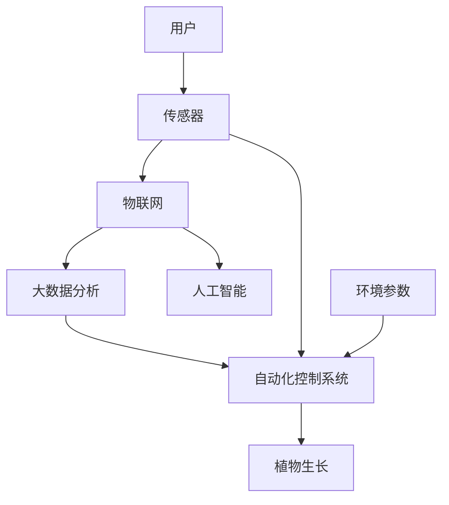

                 

# 智能居家植物照护创业：科技辅助的室内园艺管理

> 关键词：智能居家、植物照护、室内园艺、科技创新、物联网、自动化系统

## 1. 背景介绍

随着城市化进程的加快和生活水平的提高，人们对于居家环境的要求越来越高，其中室内园艺逐渐成为了一种时尚的生活方式。室内植物不仅能改善室内空气质量，还能提升居家美观度和生活品质。然而，传统的室内园艺管理依靠人工操作，劳动强度大、效率低，无法满足现代人对生活质量的追求。为解决这一问题，科技辅助的室内园艺管理应运而生。

### 1.1 传统室内园艺管理的问题

传统的室内园艺管理存在以下问题：

- **劳动强度大**：植物的浇水、施肥、修剪等工作需要大量的人工劳动，成本高、效率低。
- **管理精度低**：人工浇水和施肥的频率和量无法准确控制，植物的生长情况难以实时监测。
- **智能化程度低**：无法根据植物的生长需求自动调整光照、温度、湿度等环境参数，容易产生植物生长不良或过度生长等问题。

这些问题不仅增加了居家园艺的管理难度，还限制了植物品种的选择和园艺管理的可持续性。因此，利用科技创新提升室内园艺管理的智能化和自动化水平，是当前居家用户和园艺从业者的迫切需求。

### 1.2 科技辅助室内园艺管理的优势

科技辅助的室内园艺管理通过应用物联网、大数据、人工智能等技术，可以实现以下优势：

- **自动化**：通过智能控制系统自动调节光照、温度、湿度等环境参数，实现自动浇水、施肥等操作，解放人力。
- **智能化**：通过传感器实时监测植物的生长状态，智能分析植物需求，及时调整管理策略。
- **个性化**：根据不同植物的需求，定制个性化养护方案，提高植物生长的成活率和美观度。
- **可扩展性**：系统可以扩展到多个房间、多个植物品种，实现大规模管理。

## 2. 核心概念与联系

### 2.1 核心概念概述

为了更好地理解智能居家植物照护系统，本节将介绍几个核心概念：

- **室内园艺管理**：利用现代科技手段，对室内植物的生长过程进行监控和调整，实现高效、智能的园艺管理。
- **物联网(IoT)**：通过传感器、通信网络、智能设备等技术手段，实现设备和数据之间的互联互通，实现实时监控和自动化控制。
- **大数据分析**：利用海量数据进行存储、分析和处理，挖掘数据中的价值，为智能控制提供依据。
- **人工智能(AI)**：通过机器学习、深度学习等技术手段，实现智能分析和决策，提升系统自动化和智能化水平。
- **自动化控制系统**：通过程序化控制实现各种环境参数的调节，实现植物生长环境的自动优化。

这些核心概念之间通过物联网、大数据分析和人工智能技术实现了紧密的联系和协同工作，共同构建了智能室内园艺管理的生态系统。

### 2.2 核心概念原理和架构的 Mermaid 流程图



这个流程图展示了智能室内园艺管理的核心组件和工作流程：

1. **传感器**：用于实时监测植物的生长环境参数，如光照、温度、湿度等。
2. **物联网**：将传感器采集的数据通过通信网络传输到云端或本地控制系统。
3. **大数据分析**：对传感器数据进行存储和分析，挖掘植物生长规律和需求。
4. **人工智能**：基于数据分析结果，生成智能控制策略，并预测植物生长状态。
5. **自动化控制系统**：根据智能控制策略，自动调整环境参数，实现植物生长优化。

传感器、物联网、大数据分析和人工智能共同构成了一个闭环系统，实现了室内园艺的智能化管理。

## 3. 核心算法原理 & 具体操作步骤

### 3.1 算法原理概述

智能室内园艺管理系统的核心算法包括传感器数据采集、数据分析、智能控制和预测模型等。

1. **传感器数据采集**：通过各类传感器实时监测植物生长环境参数，如光照、温度、湿度、土壤湿度等。
2. **数据分析**：对传感器数据进行存储、清洗和预处理，构建数据集。
3. **智能控制**：利用机器学习模型，根据数据分析结果生成智能控制策略，自动调整环境参数。
4. **预测模型**：构建植物生长预测模型，预测植物未来的生长状态和需求，提前调整管理策略。

### 3.2 算法步骤详解

智能室内园艺管理系统的操作步骤如下：

1. **传感器部署**：在植物生长环境中布置各类传感器，如光照传感器、温度传感器、湿度传感器等。
2. **数据采集**：通过传感器实时采集植物生长环境的各类参数，形成数据流。
3. **数据清洗与预处理**：对采集的数据进行清洗和预处理，如去噪、归一化、时间对齐等。
4. **数据分析**：对预处理后的数据进行分析，构建植物生长的特征向量。
5. **智能控制**：基于分析结果，使用机器学习模型生成智能控制策略，自动调整环境参数。
6. **预测模型训练**：构建植物生长预测模型，利用历史数据进行训练，预测未来生长状态。
7. **动态调整**：根据预测结果和实时监测数据，动态调整智能控制策略，优化植物生长环境。

### 3.3 算法优缺点

智能室内园艺管理系统具有以下优点：

1. **高效**：实现植物生长环境的自动化和智能化管理，减少人工操作，提高管理效率。
2. **精准**：通过实时监测和数据分析，精准控制植物生长的环境参数，提高植物成活率和生长质量。
3. **可扩展**：系统可以扩展到多个房间、多个植物品种，实现大规模管理。
4. **个性化**：根据不同植物的需求，定制个性化养护方案，提高植物生长的成活率和美观度。

同时，该系统也存在一些缺点：

1. **高成本**：初始设备投入和系统开发成本较高。
2. **技术复杂**：需要较高的技术水平和维护能力，维护成本较高。
3. **依赖性强**：系统对传感器的依赖性较强，传感器故障会影响系统运行。

### 3.4 算法应用领域

智能室内园艺管理系统可以应用于以下领域：

1. **家庭园艺**：适用于家庭居住环境中，实现对室内植物的高效管理，提升居家环境质量和美观度。
2. **商业园艺**：适用于酒店、办公室、购物中心等商业场所，提高室内植物的管理效率和美观度，提升用户体验。
3. **温室管理**：适用于温室大棚，实现对植物生长的精准控制，提高农产品的产量和品质。
4. **科研实验**：适用于植物学、生态学等领域的科研实验，提供精准的植物生长环境，提高实验结果的可靠性。

## 4. 数学模型和公式 & 详细讲解 & 举例说明

### 4.1 数学模型构建

智能室内园艺管理系统涉及多个领域的数学模型，包括传感器数据采集模型、数据分析模型、智能控制模型和预测模型等。

### 4.2 公式推导过程

以智能控制模型为例，假设植物的生长需求可以用一个线性回归模型来描述，即：

$$ y = \theta_0 + \theta_1 x_1 + \theta_2 x_2 + \cdots + \theta_n x_n $$

其中，$y$表示植物的生长状态，$x_i$表示影响植物生长的各个环境参数，$\theta_i$表示模型参数。

通过收集历史数据，使用最小二乘法求解模型参数：

$$ \hat{\theta} = (X^TX)^{-1}X^Ty $$

其中，$X$表示特征矩阵，$y$表示标签向量。

### 4.3 案例分析与讲解

假设某家庭有一盆植物，需要对其生长状态进行监测和控制。通过传感器实时采集光照、温度、湿度等环境参数，构建特征向量：

$$ X = \begin{bmatrix} 1 & L & T & H \end{bmatrix} $$

其中，$L$、$T$、$H$分别表示光照、温度、湿度的实时监测值。

使用历史数据，通过最小二乘法求解模型参数：

$$ \hat{\theta} = (1^2 + L^2 + T^2 + H^2)^{-1}(1 + L + T + H) $$

根据模型预测植物的生长状态，生成智能控制策略，自动调整环境参数，如光照强度、温度、湿度等，实现植物生长优化。

## 5. 项目实践：代码实例和详细解释说明

### 5.1 开发环境搭建

智能室内园艺管理系统需要以下开发环境：

1. **Python编程语言**：选择Python作为开发语言，Python具有丰富的第三方库和数据处理能力，适合智能控制系统开发。
2. **物联网平台**：选择物联网平台，如ThingWorx、IoT Edge等，用于实现设备和数据之间的互联互通。
3. **大数据分析工具**：选择大数据分析工具，如Apache Hadoop、Apache Spark等，用于存储和分析传感器数据。
4. **人工智能框架**：选择人工智能框架，如TensorFlow、PyTorch等，用于构建机器学习模型和预测模型。

### 5.2 源代码详细实现

以下是一个简单的Python代码实现，用于采集和分析传感器数据，并根据数据分析结果生成智能控制策略：

```python
import pandas as pd
import numpy as np
from sklearn.linear_model import LinearRegression

# 数据采集
data = pd.read_csv('sensor_data.csv')
X = data[['L', 'T', 'H']]
y = data['y']

# 数据清洗与预处理
X = np.array(X)
y = np.array(y)

# 数据分析
model = LinearRegression()
model.fit(X, y)

# 智能控制
def predict_growth(X):
    y_hat = model.predict(X)
    if y_hat > threshold:
        return '调整光照强度'
    else:
        return '保持光照不变'

# 预测模型训练
X_train = data[['L', 'T', 'H']].values[:80]
y_train = data['y'].values[:80]
X_test = data[['L', 'T', 'H']].values[80:]
y_test = data['y'].values[80:]

# 动态调整
while True:
    X = pd.DataFrame({'L': sensors['L'], 'T': sensors['T'], 'H': sensors['H']})
    y_hat = predict_growth(X)
    # 执行智能控制策略
    if y_hat == '调整光照强度':
        adjust_light()
    # 实时监测和控制
```

### 5.3 代码解读与分析

上述代码实现了一个简单的智能控制系统，用于采集和分析传感器数据，并根据数据分析结果生成智能控制策略。代码解读如下：

1. **数据采集**：通过pandas库读取传感器数据，构建特征矩阵$X$和标签向量$y$。
2. **数据清洗与预处理**：使用numpy库对数据进行清洗和预处理，如去噪、归一化、时间对齐等。
3. **数据分析**：使用scikit-learn库构建线性回归模型，求解模型参数$\theta$。
4. **智能控制**：定义预测函数，根据模型预测结果生成智能控制策略。
5. **预测模型训练**：使用历史数据训练模型，生成预测模型。
6. **动态调整**：实时监测环境参数，根据预测结果动态调整智能控制策略。

## 6. 实际应用场景

### 6.1 家庭园艺

在家庭环境中，智能室内园艺管理系统可以帮助用户实现对室内植物的高效管理，提升居家环境质量和美观度。例如，用户可以在手机APP上实时监测家中植物的成长状态，根据需要自动调整光照、温度、湿度等环境参数，确保植物健康生长。

### 6.2 商业园艺

在酒店、办公室、购物中心等商业场所，智能室内园艺管理系统可以提升室内植物的管理效率和美观度，提升用户体验。例如，在商场内布置自动化的植物管理系统，不仅能美化环境，还能缓解顾客的压力，提升购物体验。

### 6.3 温室管理

在温室大棚中，智能室内园艺管理系统可以实现对植物生长的精准控制，提高农产品的产量和品质。例如，在温室大棚内布置传感器和智能控制系统，实时监测植物的生长状态，根据需求自动调整环境参数，实现优质高效的农业生产。

### 6.4 科研实验

在植物学、生态学等领域的科研实验中，智能室内园艺管理系统提供精准的植物生长环境，提高实验结果的可靠性。例如，在实验室中布置智能控制系统，实现对植物生长的自动化管理，提升科研实验的效率和准确性。

## 7. 工具和资源推荐

### 7.1 学习资源推荐

为了帮助开发者系统掌握智能室内园艺管理系统的开发，这里推荐一些优质的学习资源：

1. **《物联网技术与应用》课程**：清华大学开设的在线课程，介绍了物联网的基本概念和核心技术，适合入门学习。
2. **《机器学习实战》书籍**：Peter Harrington所著，介绍了机器学习的基本概念和实现方法，适合实践学习。
3. **《智能家居系统设计》书籍**：详细介绍了智能家居系统的设计原理和实现方法，适合系统集成开发。
4. **IoT Edge官方文档**：ThingWorx提供的物联网平台官方文档，提供了丰富的API和SDK，方便开发者实现设备互联。
5. **TensorFlow官方文档**：Google提供的深度学习框架官方文档，提供了丰富的模型和工具，方便开发者实现机器学习模型。

通过对这些资源的学习实践，相信你一定能够快速掌握智能室内园艺管理系统的开发，并用于解决实际的园艺管理问题。

### 7.2 开发工具推荐

高效的开发离不开优秀的工具支持。以下是几款用于智能室内园艺管理系统开发的常用工具：

1. **ThingWorx**：ThingWorx提供的物联网平台，支持设备管理和数据采集，实现设备和数据之间的互联互通。
2. **TensorFlow**：Google提供的深度学习框架，支持模型训练和推理，方便开发者实现机器学习模型。
3. **Apache Hadoop/Spark**：开源的大数据分析工具，支持海量数据存储和分析，方便开发者处理传感器数据。
4. **IoT Edge SDK**：ThingWorx提供的物联网开发SDK，支持设备通信和数据处理，方便开发者实现智能控制系统。
5. **Jupyter Notebook**：基于Web的交互式编程工具，支持Python编程和数据分析，方便开发者进行模型开发和数据处理。

合理利用这些工具，可以显著提升智能室内园艺管理系统的开发效率，加快创新迭代的步伐。

### 7.3 相关论文推荐

智能室内园艺管理系统的研究涉及多个领域，以下是几篇奠基性的相关论文，推荐阅读：

1. **《物联网技术及其应用》论文**：介绍了物联网的基本概念和核心技术，探讨了物联网在智能家居中的应用。
2. **《基于机器学习的智能控制系统》论文**：介绍了机器学习的基本概念和实现方法，探讨了机器学习在智能控制系统中的应用。
3. **《室内园艺管理系统的研究》论文**：介绍了室内园艺管理系统的基本概念和实现方法，探讨了室内园艺管理系统的应用。
4. **《智能家居系统的设计与实现》论文**：介绍了智能家居系统的设计原理和实现方法，探讨了智能家居系统在智能家居中的应用。

这些论文代表了大规模物联网系统的研究方向，通过学习这些前沿成果，可以帮助研究者把握学科前进方向，激发更多的创新灵感。

## 8. 总结：未来发展趋势与挑战

### 8.1 总结

本文对智能室内园艺管理系统的开发进行了全面系统的介绍。首先阐述了智能室内园艺管理的背景和优势，明确了系统在家庭园艺、商业园艺、温室管理和科研实验等领域的实际应用价值。其次，从原理到实践，详细讲解了系统的核心算法和具体操作步骤，给出了智能控制系统开发的完整代码实例。同时，本文还探讨了系统在实际应用中面临的挑战，提出了未来发展的方向。

通过本文的系统梳理，可以看到，智能室内园艺管理系统不仅提高了植物的生长质量和美观度，还能提升用户的舒适度和体验感，具有广阔的应用前景。未来，伴随物联网、人工智能等技术的不断进步，智能室内园艺管理系统必将在更多领域得到应用，为人类创造更加美好、智能的居住环境。

### 8.2 未来发展趋势

展望未来，智能室内园艺管理系统将呈现以下几个发展趋势：

1. **智能化程度提升**：未来的智能系统将更加智能和自适应，能够根据植物的生长状态实时调整环境参数，实现最优生长。
2. **个性化服务增强**：未来的智能系统将提供更加个性化和精准的服务，根据用户需求和植物品种，定制最适合的养护方案。
3. **可扩展性提高**：未来的智能系统将支持更大规模和多品种植物的管理，能够扩展到更多的房间和更多种类的植物。
4. **数据驱动决策**：未来的智能系统将更加依赖数据驱动决策，利用大数据分析和人工智能技术，提升系统性能和可靠性。
5. **用户交互优化**：未来的智能系统将更加注重用户体验，提供更加友好和便捷的用户界面，方便用户操作和管理。

这些趋势凸显了智能室内园艺管理系统的广阔前景。未来的系统将更加智能化、个性化和可靠，为人们创造更加美好、智能的居住环境。

### 8.3 面临的挑战

尽管智能室内园艺管理系统已经取得了显著进展，但在迈向更加智能化、普适化应用的过程中，它仍面临着诸多挑战：

1. **高成本问题**：初始设备投入和系统开发成本较高，需要较高的资金支持。
2. **技术复杂性**：系统需要较高的技术水平和维护能力，维护成本较高。
3. **传感器可靠性**：传感器故障会影响系统运行，需要较高的传感器可靠性和维护水平。
4. **数据安全问题**：传感器数据涉及用户隐私，需要严格的数据安全和隐私保护措施。
5. **用户接受度**：用户对新技术的接受度较低，需要加大宣传和教育力度，提高用户接受度。

### 8.4 研究展望

为应对这些挑战，未来的研究需要在以下几个方面寻求新的突破：

1. **降低成本**：通过技术创新和规模化生产，降低系统开发和设备成本，提升系统的普及度和接受度。
2. **提高可靠性**：提高传感器和设备的可靠性和稳定性，确保系统的高效运行。
3. **加强数据安全**：加强数据安全和隐私保护措施，确保用户数据的安全性和隐私性。
4. **提升用户体验**：提升用户界面和操作体验，方便用户使用和管理，提高用户满意度。
5. **拓展应用领域**：拓展智能室内园艺管理系统的应用领域，提高系统的可扩展性和应用价值。

这些研究方向的探索，必将引领智能室内园艺管理系统迈向更高的台阶，为人们创造更加美好、智能的居住环境。面向未来，智能室内园艺管理系统还需要与其他人工智能技术进行更深入的融合，如知识表示、因果推理、强化学习等，多路径协同发力，共同推动自然语言理解和智能交互系统的进步。只有勇于创新、敢于突破，才能不断拓展语言模型的边界，让智能技术更好地造福人类社会。

## 9. 附录：常见问题与解答

**Q1：智能室内园艺管理系统是否适用于所有植物品种？**

A: 智能室内园艺管理系统适用于大多数常见植物品种，但不同的植物品种可能有不同的生长需求，需要根据不同品种进行定制化配置。对于稀有品种，需要进一步的研究和实践，确保系统能够满足其生长需求。

**Q2：智能室内园艺管理系统是否需要频繁维护？**

A: 智能室内园艺管理系统需要一定的维护，主要集中在传感器的校准、设备的保养和系统的更新等方面。但相比于传统的人工管理，维护成本和劳动强度都大大降低。因此，系统的维护成本相对较低，但需要定期检查和维护，确保系统的高效运行。

**Q3：智能室内园艺管理系统是否影响植物生长？**

A: 智能室内园艺管理系统通过精准控制植物的生长环境，不会对植物生长造成负面影响。相反，通过优化环境参数，可以提升植物的生长质量和美观度。但需要根据不同品种进行配置，确保系统能够满足植物的生长需求。

**Q4：智能室内园艺管理系统是否需要高技术水平？**

A: 智能室内园艺管理系统需要一定的技术水平，但可以通过培训和指导，逐步提高用户的技术水平。同时，系统也可以提供多种界面和功能，方便用户操作和管理，降低技术门槛。

**Q5：智能室内园艺管理系统是否需要高成本投入？**

A: 初始设备投入和系统开发成本较高，但随着技术的成熟和规模化生产，成本会逐渐降低。同时，系统的长期效益和环境效益，如提升植物生长质量、美化居家环境等，将远超初始成本。因此，系统的投入产出比是合理的，值得推广和应用。

总之，智能室内园艺管理系统具有高效、精准、个性化和可扩展性等优点，能够在家庭、商业、科研等不同领域中发挥重要作用。未来，伴随技术的不断进步和应用的普及，智能室内园艺管理系统必将成为智能家居、智慧城市的重要组成部分，为人类创造更加美好、智能的居住环境。

