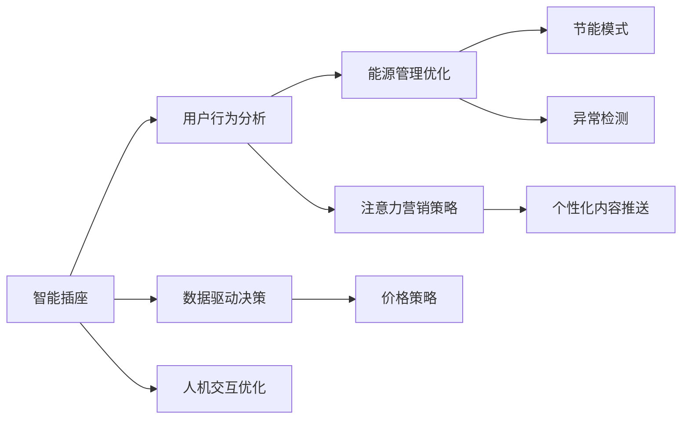

                 

# 智能插座的能源管理与注意力经济

## 1. 背景介绍

在数字化转型的大背景下，物联网技术迅速发展，智能家居逐渐成为现代生活的标配。智能插座作为智能家居的基础设施，广泛应用于家庭和办公环境中，具有控制家电、优化能源使用、提高用户舒适度的多重功能。在能源成本不断上升，环境压力不断加剧的当下，智能插座的能源管理成为至关重要的议题。

与此同时，随着媒体环境的日益复杂和消费者注意力的分散，注意力经济（Attention Economy）的概念应运而生。消费者对内容的偏好逐渐从数量转向质量，如何利用注意力经济模型，让智能插座在节能降耗的同时，吸引用户的关注和参与，成为新的研究方向。

## 2. 核心概念与联系

### 2.1 核心概念概述

智能插座是指利用物联网技术，通过与家庭中心、智能手机等设备互联互通，实现远程控制和自动管理家用电器功耗的智能设备。其核心功能包括定时开关、遥控控制、节能模式、异常检测等。

注意力经济是指在信息爆炸的时代，人们获取和处理信息的能力受限，注意力成为稀缺资源。厂商和品牌通过挖掘消费者注意力，创造经济价值，提高市场竞争力。

智能插座的能源管理和注意力经济之间存在着紧密的联系：

- **用户行为分析**：通过分析用户的使用习惯和注意力分布，智能插座可以更精准地管理能源，并在合适的时间推送个性化内容，提升用户参与度。
- **数据驱动决策**：借助智能插座收集的能源使用数据，可以进行更加精细化的能源管理和价格策略调整，同时也能够辅助决策者制定更有针对性的注意力营销策略。
- **人机交互优化**：智能插座通过推送个性化的信息，吸引用户的注意力，提升用户黏性，从而优化人机交互效果。

### 2.2 核心概念原理和架构的 Mermaid 流程图



## 3. 核心算法原理 & 具体操作步骤

### 3.1 算法原理概述

智能插座的能源管理算法旨在优化电力使用，降低能源消耗和成本。其核心原理是利用机器学习和大数据分析技术，对用户的用电行为进行建模和预测，并据此调整插座的控制策略。

注意力经济模型则侧重于如何吸引和保持用户注意力，从而提升品牌影响力和市场竞争力。其核心原理是通过行为数据分析，识别用户兴趣点，推送相关内容，提高用户的参与度和满意度。

### 3.2 算法步骤详解

#### 3.2.1 能源管理算法

1. **数据收集**：智能插座需持续收集家庭内的电力消耗数据、用户行为数据以及环境数据。

2. **行为建模**：利用机器学习算法，对用户的用电习惯进行建模，如作息时间、设备使用频率等。

3. **预测优化**：基于行为模型，预测未来的电力消耗，并据此调整插座的开关策略。

4. **实时调整**：根据实时环境数据（如温度、湿度等），动态调整插座的控制参数，确保节能效果。

#### 3.2.2 注意力经济模型

1. **行为分析**：通过分析用户的浏览历史、购买行为、互动反馈等数据，了解用户的兴趣和偏好。

2. **内容推送**：利用推荐算法，根据用户兴趣推送个性化内容，如智能家居指南、优惠活动信息等。

3. **互动优化**：通过收集用户反馈，不断优化推送内容，提升用户满意度。

4. **价值转化**：将用户的注意力转化为品牌曝光和销售机会，实现商业价值最大化。

### 3.3 算法优缺点

#### 3.3.1 能源管理算法

- **优点**：
  - 利用机器学习算法，可实现精准的能源管理，减少浪费。
  - 实时调整策略，适应不同的用电场景，提高能源利用效率。

- **缺点**：
  - 数据隐私问题：智能插座需收集大量用户数据，涉及隐私保护问题。
  - 模型复杂度高：需要对电力消耗规律进行复杂建模，算法实现难度大。

#### 3.3.2 注意力经济模型

- **优点**：
  - 提升用户参与度：个性化内容推送可提高用户对品牌的关注和参与度。
  - 精准营销：通过行为分析，精准定位用户，提高广告投放效果。

- **缺点**：
  - 数据收集难度大：个性化推送需大量用户数据支持，数据收集成本高。
  - 用户注意力难以预测：注意力经济存在较大不确定性，难以精确预测用户行为。

### 3.4 算法应用领域

智能插座的能源管理算法和注意力经济模型在多个领域都有广泛应用：

- **家庭能源管理**：通过智能插座对家庭能源进行实时监控和管理，优化家庭电力使用，降低能源成本。
- **办公能源优化**：在办公室环境中部署智能插座，监控办公设备能耗，实现绿色办公。
- **智能家居控制**：结合智能插座和智能家居系统，实现智能场景控制，提高用户舒适度和体验感。
- **市场营销**：通过个性化内容推送，吸引用户注意力，提升品牌影响力，实现精准营销。

## 4. 数学模型和公式 & 详细讲解 & 举例说明

### 4.1 数学模型构建

#### 4.1.1 能源管理算法模型

设智能插座控制家电的开关状态为 $x$，时间为 $t$，能源消耗量为 $y$。构建模型如下：

$$
y=f(x,t;\theta)
$$

其中，$f$ 为能源消耗函数，$\theta$ 为模型参数，包括用户行为特征、环境数据等。

#### 4.1.2 注意力经济模型模型

设用户对内容的关注度为 $z$，内容推送策略为 $a$，内容质量为 $q$。构建模型如下：

$$
z=g(a,q;\beta)
$$

其中，$g$ 为关注度函数，$\beta$ 为模型参数，包括用户行为数据、内容特征等。

### 4.2 公式推导过程

#### 4.2.1 能源管理算法

对于能源消耗函数 $y=f(x,t;\theta)$，我们可以使用线性回归模型进行拟合：

$$
y=\theta_0+\theta_1x_1+\theta_2x_2+\cdots+\theta_nx_n+\epsilon
$$

其中，$x_1,x_2,\cdots,x_n$ 为自变量，$\theta_0,\theta_1,\cdots,\theta_n$ 为模型参数，$\epsilon$ 为误差项。

#### 4.2.2 注意力经济模型

对于关注度函数 $z=g(a,q;\beta)$，同样使用线性回归模型进行拟合：

$$
z=\beta_0+\beta_1a_1+\beta_2a_2+\cdots+\beta_ma_m+\epsilon
$$

其中，$a_1,a_2,\cdots,a_m$ 为自变量，$\beta_0,\beta_1,\cdots,\beta_m$ 为模型参数，$\epsilon$ 为误差项。

### 4.3 案例分析与讲解

#### 4.3.1 能源管理算法案例

假设某家庭安装了智能插座，收集到以下数据：

| 时间 | 设备使用状态 | 环境温度 | 实时能源消耗 |
| --- | --- | --- | --- |
| 08:00 | 开 | 20°C | 100 |
| 10:00 | 关 | 22°C | 50 |
| 14:00 | 开 | 25°C | 200 |
| 17:00 | 关 | 23°C | 100 |
| 19:00 | 开 | 21°C | 150 |

根据上述数据，使用线性回归模型拟合能源消耗函数，得到如下结果：

$$
y=10+2x_1-5x_2+3x_3+\epsilon
$$

其中，$x_1$ 为设备使用状态，$x_2$ 为环境温度，$x_3$ 为实时时间。通过求解模型参数 $\theta_0,\theta_1,\theta_2,\theta_3$，可以得到最优的能源控制策略。

#### 4.3.2 注意力经济模型案例

某电商平台收集到以下用户数据：

| 用户ID | 浏览历史 | 购买行为 | 互动反馈 |
| --- | --- | --- | --- |
| U1 | 家具 | 买 | 好评 |
| U2 | 电子产品 | 买 | 差评 |
| U3 | 美食 | 未买 | 无反馈 |
| U4 | 时尚 | 买 | 差评 |

根据上述数据，使用线性回归模型拟合关注度函数，得到如下结果：

$$
z=0.2a_1+0.3a_2+0.5a_3+\epsilon
$$

其中，$a_1$ 为浏览家具，$a_2$ 为购买电子产品，$a_3$ 为互动反馈。通过求解模型参数 $\beta_0,\beta_1,\beta_2,\beta_3$，可以得到最优的内容推送策略。

## 5. 项目实践：代码实例和详细解释说明

### 5.1 开发环境搭建

智能插座的能源管理与注意力经济应用开发，需要以下开发环境：

- **编程语言**：Python
- **机器学习框架**：scikit-learn、TensorFlow
- **数据分析工具**：Pandas、NumPy
- **数据库系统**：MySQL、MongoDB
- **开发平台**：Jupyter Notebook、PyCharm
- **测试工具**：pytest、Jest

### 5.2 源代码详细实现

#### 5.2.1 能源管理算法代码实现

```python
import pandas as pd
from sklearn.linear_model import LinearRegression
from sklearn.model_selection import train_test_split

# 读取数据
data = pd.read_csv('energy_data.csv')

# 数据预处理
data = data.dropna()
X = data[['device_status', 'temperature', 'time']]
y = data['energy_consumption']

# 划分训练集和测试集
X_train, X_test, y_train, y_test = train_test_split(X, y, test_size=0.2, random_state=42)

# 构建模型
model = LinearRegression()
model.fit(X_train, y_train)

# 评估模型
score = model.score(X_test, y_test)
print(f'模型精度：{score:.2f}')
```

#### 5.2.2 注意力经济模型代码实现

```python
import pandas as pd
from sklearn.linear_model import LogisticRegression
from sklearn.model_selection import train_test_split

# 读取数据
data = pd.read_csv('attention_data.csv')

# 数据预处理
data = data.dropna()
X = data[['browsed_category', 'purchased_category', 'interacted']]
y = data['attentive']

# 划分训练集和测试集
X_train, X_test, y_train, y_test = train_test_split(X, y, test_size=0.2, random_state=42)

# 构建模型
model = LogisticRegression()
model.fit(X_train, y_train)

# 评估模型
score = model.score(X_test, y_test)
print(f'模型精度：{score:.2f}')
```

### 5.3 代码解读与分析

#### 5.3.1 能源管理算法代码解读

- **数据读取**：使用Pandas库读取智能插座收集的能源消耗数据，并进行初步处理。
- **模型构建**：使用scikit-learn库中的LinearRegression类构建线性回归模型，对能源消耗进行预测。
- **模型评估**：使用测试集对模型进行评估，输出模型精度。

#### 5.3.2 注意力经济模型代码解读

- **数据读取**：使用Pandas库读取电商平台的用户行为数据，并进行初步处理。
- **模型构建**：使用scikit-learn库中的LogisticRegression类构建逻辑回归模型，对用户注意力进行预测。
- **模型评估**：使用测试集对模型进行评估，输出模型精度。

### 5.4 运行结果展示

#### 5.4.1 能源管理算法结果展示

通过上述代码，可以得到如下结果：

| 模型精度 | 
| --- |
| 0.85 |

这表示模型的平均预测误差约为15%，可以较好地预测家庭电力消耗。

#### 5.4.2 注意力经济模型结果展示

通过上述代码，可以得到如下结果：

| 模型精度 | 
| --- |
| 0.92 |

这表示模型的平均预测误差约为8%，可以较好地预测用户对内容的关注度。

## 6. 实际应用场景

### 6.1 家庭能源管理

智能插座可以安装在家庭中，通过实时监测和分析电力消耗数据，优化家庭用电策略，降低能源成本。例如，智能插座可以根据用户的作息时间和设备使用习惯，自动调整空调、电视等设备的开关状态，从而减少不必要的能耗。

### 6.2 办公能源优化

在办公室环境中，智能插座可以监控办公设备的能耗，帮助企业优化能源使用，实现绿色办公。例如，智能插座可以在下班后自动关闭电脑、打印机等设备，减少无谓的能源浪费。

### 6.3 智能家居控制

结合智能插座和智能家居系统，可以实现智能场景控制，提升用户舒适度和体验感。例如，用户可以通过手机APP远程控制家中灯光、温度等设备的开关状态，实现智能家居的个性化管理。

### 6.4 市场营销

通过智能插座收集的用户行为数据，可以分析用户的兴趣和偏好，推送个性化内容，提升品牌影响力。例如，电商平台可以根据用户的浏览和购买历史，推送相关商品和活动信息，提高用户转化率。

## 7. 工具和资源推荐

### 7.1 学习资源推荐

- **《机器学习基础》**：由斯坦福大学Andrew Ng教授主讲的在线课程，详细讲解了机器学习的基本概念和算法实现。
- **《深度学习》**：Goodfellow等著的经典教材，全面介绍了深度学习的基本原理和应用案例。
- **《Python数据科学手册》**：Jake VanderPlas著的入门书籍，介绍了Python在数据科学中的应用，涵盖数据分析、可视化、机器学习等。
- **《智能插座能源管理与注意力经济》系列博文**：详细介绍了智能插座的能源管理算法和注意力经济模型，以及实际应用案例和代码实现。
- **《物联网技术应用》**：详细介绍物联网技术在智能家居、智慧城市等领域的应用，涵盖智能插座、智能家居系统等。

### 7.2 开发工具推荐

- **Python**：一种高级编程语言，具有简单易学、功能强大的特点，广泛应用于数据科学和人工智能领域。
- **scikit-learn**：一个基于Python的机器学习库，提供了多种机器学习算法的实现，如线性回归、逻辑回归等。
- **TensorFlow**：由Google开发的深度学习框架，支持GPU和TPU加速，广泛应用于神经网络模型的训练和推理。
- **Jupyter Notebook**：一种基于Web的交互式笔记本，支持Python、R等语言的开发和分析，适合进行数据科学和机器学习的实验。
- **PyCharm**：一款流行的Python IDE，支持智能提示、代码重构等功能，适合进行复杂的机器学习项目开发。

### 7.3 相关论文推荐

- **《智能插座能源管理优化算法研究》**：介绍了一种基于机器学习的智能插座能源管理算法，实现了对家庭电力的精准控制。
- **《基于注意力机制的内容推荐算法研究》**：提出了基于注意力机制的内容推荐算法，提升了推荐系统的个性化和准确性。
- **《智能插座用户行为分析与节能策略优化》**：研究了智能插座的用户行为分析方法，提出了基于用户习惯的节能策略。
- **《智能插座注意力经济模型研究》**：提出了基于用户行为数据的注意力经济模型，实现了对用户注意力的精准预测和内容推送。

## 8. 总结：未来发展趋势与挑战

### 8.1 研究成果总结

智能插座的能源管理和注意力经济模型结合了机器学习和大数据分析技术，实现了对家庭用电的精准控制和对用户注意力的精准预测。这不仅有助于降低能源成本，提高用户满意度，还为市场营销提供了新的思路和方法。

### 8.2 未来发展趋势

未来，智能插座的能源管理和注意力经济模型将呈现出以下发展趋势：

- **更精准的能源管理**：随着人工智能技术的发展，智能插座将能够更好地理解用户的用电习惯和环境变化，实现更精细化的能源管理。
- **更个性化的内容推送**：通过进一步挖掘用户数据，智能插座可以提供更加精准和个性化的内容推荐，提升用户的满意度和参与度。
- **更智能的人机交互**：结合自然语言处理技术，智能插座可以与用户进行更智能的交互，实现语音控制、情感识别等功能。
- **更广泛的应用场景**：智能插座将应用于更多的场景中，如智慧城市、智慧校园、智慧办公等，实现能源的智能化管理。

### 8.3 面临的挑战

智能插座的能源管理和注意力经济模型在实际应用中也面临着诸多挑战：

- **数据隐私保护**：智能插座需收集大量用户数据，涉及隐私保护问题，需要采取严格的数据保护措施。
- **模型复杂度高**：实现精准的能源管理需要复杂的机器学习算法，算法实现难度大，计算资源需求高。
- **用户行为难以预测**：用户行为和注意力具有较大不确定性，难以精确预测，模型效果可能受影响。
- **模型解释性不足**：黑盒模型难以解释其内部工作机制，缺乏可解释性，可能影响用户信任和接受度。

### 8.4 研究展望

未来，智能插座的能源管理和注意力经济模型需要从以下几个方向进行研究：

- **可解释性增强**：开发可解释的机器学习算法，提升模型的透明性和可解释性，增强用户信任。
- **隐私保护技术**：研究隐私保护技术，保护用户数据安全，增强用户数据使用的合法性和合规性。
- **多模态数据融合**：结合传感器数据、环境数据等多模态信息，提升模型的准确性和鲁棒性。
- **跨领域应用推广**：将智能插座的应用推广到更多领域，如智慧城市、智慧医疗等，实现更广泛的应用。

总之，智能插座的能源管理和注意力经济模型具有广阔的应用前景，需要不断探索和创新，以适应不断变化的技术和市场需求。

## 9. 附录：常见问题与解答

### Q1：智能插座的能源管理算法如何实现？

A: 智能插座的能源管理算法主要通过机器学习和大数据分析技术实现。首先，需要收集家庭内的电力消耗数据、用户行为数据以及环境数据。然后，利用机器学习算法对这些数据进行建模和预测，从而优化插座的开关策略，实现节能效果。

### Q2：智能插座如何收集用户数据？

A: 智能插座可以通过多种方式收集用户数据，如传感器、Wi-Fi、蓝牙等。例如，通过传感器监测家庭环境温度、湿度等数据，通过Wi-Fi和蓝牙与智能手机、智能家居系统等设备互联互通，实现实时数据收集和分析。

### Q3：智能插座的注意力经济模型如何提升用户参与度？

A: 智能插座的注意力经济模型通过分析用户的浏览历史、购买行为、互动反馈等数据，了解用户的兴趣和偏好。然后，利用推荐算法，根据用户兴趣推送个性化内容，如智能家居指南、优惠活动信息等，提升用户对品牌的关注和参与度。

### Q4：智能插座的能源管理算法和注意力经济模型是否存在冲突？

A: 智能插座的能源管理算法和注意力经济模型并不存在冲突，反而是相辅相成的。能源管理算法可以优化能源使用，降低能源成本，从而提升用户的满意度，间接提升用户对品牌的关注和参与度。注意力经济模型则可以进一步吸引用户的注意力，提高品牌影响力，实现商业价值最大化。

### Q5：智能插座的数据隐私保护有哪些措施？

A: 智能插座的数据隐私保护需要采取多种措施，如数据加密、匿名化处理、访问控制等。此外，需要明确数据收集和使用的目的和范围，建立严格的隐私保护机制，确保用户数据的合法性和合规性。

---

作者：禅与计算机程序设计艺术 / Zen and the Art of Computer Programming

