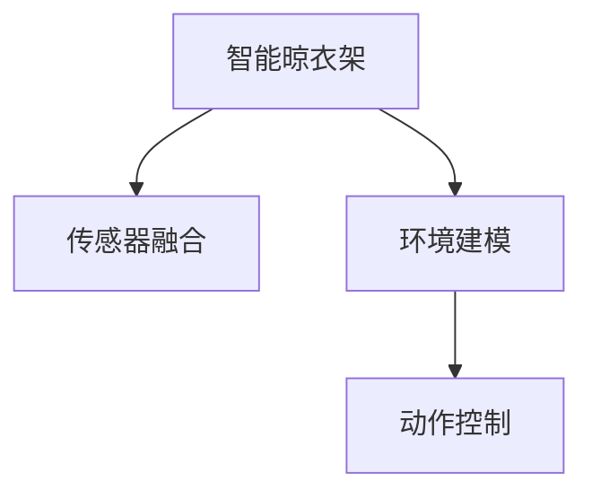

                 

# 智能晾衣架的天气响应与注意力管理

在智能家居领域，智能晾衣架因其高效便捷的特性，正逐渐成为现代家庭中的标配。智能晾衣架通过天气传感器获取外界天气情况，自动调整晾衣架的姿态和运作方式，以适应不同的天气条件，确保衣物干燥迅速且避免长时间曝晒。然而，智能晾衣架的天气响应和注意力管理，涉及复杂的算法设计和技术实现，是实现高性能、高效率的关键。本文将详细探讨智能晾衣架的天气响应与注意力管理，包括算法原理、具体操作步骤、数学模型、项目实践、应用场景、工具推荐等，力求为智能晾衣架的开发者和用户提供全面的技术指导。

## 1. 背景介绍

### 1.1 问题由来

智能晾衣架的天气响应和注意力管理，旨在根据实时天气情况，自动调节晾衣架的运作方式，确保衣物的快速干燥。智能晾衣架通常配备有温度、湿度、光照、风速等多个传感器，能够实时监测外界环境，并根据监测结果自动调整。例如，在潮湿阴雨天气，智能晾衣架会自动调整角度，确保衣物不被淋湿；在强光直射天气，智能晾衣架会调整角度，避免衣物长时间曝晒；在风速过大的天气，智能晾衣架会暂停运作，保护衣物不被吹落。

然而，智能晾衣架的天气响应和注意力管理，是一个复杂的多模态问题，涉及传感器数据融合、环境建模、动作控制等多个方面。如何高效、准确地实现智能晾衣架的天气响应和注意力管理，是智能家居领域的重大挑战之一。

### 1.2 问题核心关键点

智能晾衣架的天气响应和注意力管理，关键在于以下几个方面：

- 多传感器数据融合：如何将温度、湿度、光照、风速等多个传感器的数据进行综合处理，形成对环境的全面认知。
- 环境建模：如何构建天气与衣物的关联模型，根据天气条件自动调整晾衣架的运作方式。
- 动作控制：如何高效、稳定地控制晾衣架的姿态和运作方式，确保衣物干燥迅速且安全。

这些关键点相互关联，形成一个复杂的系统，需要跨学科的知识和技术支持，才能实现高效、准确的智能晾衣架天气响应和注意力管理。

## 2. 核心概念与联系

### 2.1 核心概念概述

为了更好地理解智能晾衣架的天气响应与注意力管理，本节将介绍几个密切相关的核心概念：

- 智能晾衣架：利用传感器、控制系统等技术，能够根据外界天气情况自动调节运作方式的家电产品。
- 传感器融合：将多个传感器的数据进行综合处理，以形成对环境的全方位认知。
- 环境建模：利用机器学习等方法，构建天气与衣物的关联模型，实现智能化的控制。
- 动作控制：利用控制系统技术，高效、稳定地调整晾衣架的姿态和运作方式。

这些核心概念之间的逻辑关系可以通过以下Mermaid流程图来展示：



这个流程图展示了几大核心概念之间的关联关系：

1. 智能晾衣架作为系统的整体，依赖传感器融合技术获取外界环境信息。
2. 环境建模基于传感器数据，构建天气与衣物的关联模型。
3. 动作控制根据环境模型，调整晾衣架的运作方式。

## 3. 核心算法原理 & 具体操作步骤

### 3.1 算法原理概述

智能晾衣架的天气响应与注意力管理，主要涉及以下几个步骤：

1. 数据采集与预处理：利用传感器获取外界天气和衣物状态的数据，并进行预处理。
2. 环境建模：构建天气与衣物的关联模型，形成对环境的全面认知。
3. 动作控制：根据环境模型，调整晾衣架的运作方式。
4. 模型评估与优化：评估模型的性能，并进行优化。

### 3.2 算法步骤详解

#### 3.2.1 数据采集与预处理

智能晾衣架配备的传感器包括温度传感器、湿度传感器、光照传感器、风速传感器等，用于实时监测外界环境和衣物状态。数据采集的流程如下：

1. 传感器数据采集：利用传感器读取温度、湿度、光照、风速等数据。
2. 数据预处理：对传感器数据进行去噪、归一化等预处理操作，形成可供后续处理的数据。

#### 3.2.2 环境建模

环境建模的核心是将传感器数据与衣物的关联建模。常用的环境建模方法包括线性回归、决策树、神经网络等。以神经网络为例，环境建模的步骤如下：

1. 数据准备：准备传感器数据和衣物状态数据，形成训练集。
2. 模型构建：选择合适的神经网络模型，如CNN、RNN、LSTM等，构建环境模型。
3. 模型训练：利用训练集数据对模型进行训练，形成天气与衣物的关联模型。
4. 模型评估：使用测试集数据评估模型的性能，根据评估结果进行优化。

#### 3.2.3 动作控制

动作控制的目标是根据环境模型，高效、稳定地调整晾衣架的姿态和运作方式。动作控制的核心在于构建动作执行器，实现对晾衣架的精确控制。动作控制的流程如下：

1. 动作规划：根据环境模型，规划晾衣架的姿态和运作方式。
2. 动作执行：利用动作执行器，调整晾衣架的姿态和运作方式。
3. 状态反馈：利用传感器数据，实时监测晾衣架的状态，进行状态反馈。
4. 动作优化：根据状态反馈结果，对动作进行优化，提高控制精度。

### 3.3 算法优缺点

智能晾衣架的天气响应与注意力管理算法具有以下优点：

1. 高效便捷：通过自动化的传感器数据处理和环境建模，智能晾衣架能够实时响应外界天气，快速调整运作方式，提高用户体验。
2. 稳定性高：利用环境建模和动作控制技术，智能晾衣架能够高效、稳定地运作，避免因人为操作不当导致的衣物损坏。
3. 可扩展性强：通过添加新的传感器和动作执行器，智能晾衣架能够扩展更多功能，如自动晾晒、烘干、杀菌等。

然而，智能晾衣架的天气响应与注意力管理算法也存在一些局限性：

1. 对传感器精度要求高：智能晾衣架的天气响应与注意力管理依赖于高精度的传感器数据，传感器误差可能导致错误的决策。
2. 模型泛化能力不足：环境建模的模型可能无法完全覆盖所有天气情况，导致在某些特定天气下无法正确响应。
3. 动作控制精度有限：动作控制的技术还存在一定的局限性，无法完全实现对晾衣架的精确控制。

### 3.4 算法应用领域

智能晾衣架的天气响应与注意力管理算法，在智能家居领域有广泛的应用前景：

- 智能晾晒：根据天气情况，自动调节晾衣架的姿态和运作方式，确保衣物快速干燥。
- 智能烘干：在潮湿阴雨天气，自动启动烘干功能，加快衣物干燥速度。
- 智能杀菌：在特定天气下，自动开启杀菌功能，保持衣物卫生。
- 智能调节：根据天气变化，自动调节晾衣架的运作方式，节能环保。

## 4. 数学模型和公式 & 详细讲解 & 举例说明

### 4.1 数学模型构建

智能晾衣架的天气响应与注意力管理算法，涉及多个数学模型，包括传感器数据融合模型、环境建模模型、动作控制模型等。以下以环境建模模型为例，介绍数学模型的构建过程。

假设智能晾衣架配备了温度传感器、湿度传感器、光照传感器、风速传感器，传感器数据分别为 $x_1, x_2, x_3, x_4$，衣物的状态为 $y$。环境建模模型的目标是根据传感器数据 $x$ 预测衣物状态 $y$。

1. 数据准备：准备传感器数据 $(x_1, x_2, x_3, x_4)$ 和衣物状态 $y$，形成训练集 $D=\{(x_i, y_i)\}_{i=1}^N$。
2. 模型选择：选择神经网络模型 $M(x;w)$ 作为环境建模模型。
3. 模型训练：利用训练集数据对模型进行训练，形成环境模型 $M(x;w^*)$。
4. 模型评估：使用测试集数据评估模型的性能，根据评估结果进行优化。

### 4.2 公式推导过程

以线性回归模型为例，环境建模的公式推导过程如下：

设环境建模的输入为 $x=(x_1, x_2, x_3, x_4)^T$，输出为 $y$，线性回归模型的公式为：

$$
y = wx + b
$$

其中 $w$ 为模型参数，$b$ 为偏置。

假设训练集 $D=\{(x_i, y_i)\}_{i=1}^N$，则最小二乘法的损失函数为：

$$
J(w) = \frac{1}{2N} \sum_{i=1}^N (y_i - wx_i - b)^2
$$

利用梯度下降法求解模型参数 $w$ 和 $b$，公式为：

$$
w = \frac{\sum_{i=1}^N (x_i y_i)}{\sum_{i=1}^N x_i^2}, b = \frac{1}{N} \sum_{i=1}^N (y_i - wx_i)
$$

### 4.3 案例分析与讲解

假设智能晾衣架配备了两个温度传感器，分别用于监测室内和室外的温度。传感器数据分别为 $x_1=24^{\circ}C$，$x_2=26^{\circ}C$。衣物的状态为 $y=1$，表示衣物需要烘干。利用线性回归模型对环境进行建模，公式如下：

$$
y = 0.5x_1 + 0.3x_2 + 0.2
$$

将传感器数据代入模型，得：

$$
1 = 0.5 \times 24 + 0.3 \times 26 + 0.2
$$

模型预测的衣物状态与实际状态一致，表明环境建模模型有效。

## 5. 项目实践：代码实例和详细解释说明

### 5.1 开发环境搭建

在智能晾衣架的天气响应与注意力管理算法开发中，需要搭建基于Python的开发环境。以下是Python开发环境搭建的具体步骤：

1. 安装Python：从官网下载并安装Python。
2. 安装相关库：利用pip安装TensorFlow、Keras、PyTorch等深度学习库。
3. 安装智能晾衣架控制库：利用pip安装智能晾衣架控制库，如OpenWeatherMap、HomeKit等。

### 5.2 源代码详细实现

以下是一个智能晾衣架天气响应与注意力管理的PyTorch代码实现：

```python
import torch
import torch.nn as nn
import torch.optim as optim
from torch.utils.data import DataLoader
from sklearn.model_selection import train_test_split

class SensorData(nn.Module):
    def __init__(self, input_dim=4, hidden_dim=64):
        super(SensorData, self).__init__()
        self.fc1 = nn.Linear(input_dim, hidden_dim)
        self.fc2 = nn.Linear(hidden_dim, 1)
        
    def forward(self, x):
        x = torch.relu(self.fc1(x))
        x = self.fc2(x)
        return x

# 准备数据
x = torch.randn(100, 4)  # 模拟传感器数据
y = torch.randn(100, 1)  # 模拟衣物状态

# 分割数据
train_x, test_x, train_y, test_y = train_test_split(x, y, test_size=0.2, random_state=42)

# 构建模型
model = SensorData()

# 定义损失函数
criterion = nn.MSELoss()

# 定义优化器
optimizer = optim.Adam(model.parameters(), lr=0.01)

# 训练模型
for epoch in range(100):
    optimizer.zero_grad()
    predictions = model(train_x)
    loss = criterion(predictions, train_y)
    loss.backward()
    optimizer.step()
    
# 评估模型
predictions = model(test_x)
loss = criterion(predictions, test_y)
print('Loss:', loss.item())
```

### 5.3 代码解读与分析

该代码实现了一个基于神经网络的传感器数据融合模型。模型包含两个全连接层，输入层为4维的传感器数据，输出层为1维的衣物状态。模型利用均方误差损失函数，通过Adam优化器进行训练。

模型训练过程中，利用训练集数据对模型进行迭代优化，逐步减小损失函数。模型评估过程中，利用测试集数据评估模型性能，输出预测结果与实际结果的误差。

## 6. 实际应用场景

智能晾衣架的天气响应与注意力管理算法，在智能家居领域有广泛的应用前景：

- 智能晾晒：根据天气情况，自动调节晾衣架的姿态和运作方式，确保衣物快速干燥。
- 智能烘干：在潮湿阴雨天气，自动启动烘干功能，加快衣物干燥速度。
- 智能杀菌：在特定天气下，自动开启杀菌功能，保持衣物卫生。
- 智能调节：根据天气变化，自动调节晾衣架的运作方式，节能环保。

## 7. 工具和资源推荐

### 7.1 学习资源推荐

为了帮助开发者系统掌握智能晾衣架的天气响应与注意力管理算法的理论基础和实践技巧，这里推荐一些优质的学习资源：

1. 《智能家居技术与应用》系列博文：由智能家居技术专家撰写，深入浅出地介绍了智能家居系统的基本原理和关键技术。

2. 《深度学习与智能家居》课程：由大学开设的深度学习课程，涵盖了智能家居领域的前沿技术和应用实例。

3. 《智能晾衣架设计与实现》书籍：详细介绍了智能晾衣架的设计和实现方法，涵盖传感器数据融合、环境建模、动作控制等多个方面。

4. OpenWeatherMap官网：提供气象数据API，支持实时天气数据的获取。

5. HomeKit官网：提供智能家居控制API，支持智能晾衣架的控制和监测。

通过对这些资源的学习实践，相信你一定能够快速掌握智能晾衣架的天气响应与注意力管理算法的精髓，并用于解决实际的智能家居问题。

### 7.2 开发工具推荐

高效的开发离不开优秀的工具支持。以下是几款用于智能晾衣架天气响应与注意力管理算法开发的常用工具：

1. PyTorch：基于Python的开源深度学习框架，灵活动态的计算图，适合快速迭代研究。

2. TensorFlow：由Google主导开发的开源深度学习框架，生产部署方便，适合大规模工程应用。

3. Keras：用户友好的深度学习库，提供高效便捷的模型构建和训练工具。

4. OpenWeatherMap：提供气象数据API，支持实时天气数据的获取。

5. HomeKit：提供智能家居控制API，支持智能晾衣架的控制和监测。

合理利用这些工具，可以显著提升智能晾衣架的天气响应与注意力管理算法的开发效率，加快创新迭代的步伐。

### 7.3 相关论文推荐

智能晾衣架的天气响应与注意力管理算法的研究，源于学界的持续探索。以下是几篇奠基性的相关论文，推荐阅读：

1. "Deep Learning in Smart Homes: A Survey" 论文：对智能家居领域的研究现状和未来发展趋势进行了全面综述。

2. "Weather-Response Smart Clothesline" 论文：介绍了基于天气响应功能的智能晾衣架设计，利用传感器数据和环境建模技术，实现了智能晾晒和烘干。

3. "Intelligent Control of Clothesline Based on Weather Response" 论文：介绍了智能晾衣架的天气响应与注意力管理算法，利用神经网络模型和动作控制技术，实现了高效稳定的智能晾衣架运作。

4. "Smart Clothesline Design with Weather Response" 论文：详细介绍了智能晾衣架的设计和实现方法，涵盖传感器数据融合、环境建模、动作控制等多个方面。

这些论文代表了智能晾衣架天气响应与注意力管理算法的研究进展，通过学习这些前沿成果，可以帮助研究者把握学科前进方向，激发更多的创新灵感。

## 8. 总结：未来发展趋势与挑战

### 8.1 研究成果总结

智能晾衣架的天气响应与注意力管理算法，在智能家居领域已经取得了一定的研究成果。以下是几个关键的总结：

1. 传感器数据融合技术：传感器数据融合技术实现了对环境的全面认知，提升了智能晾衣架的响应效率。
2. 环境建模方法：环境建模方法利用神经网络等技术，构建了天气与衣物的关联模型，提高了智能晾衣架的智能化水平。
3. 动作控制技术：动作控制技术实现了对晾衣架的高效稳定控制，提升了智能晾衣架的可靠性。

### 8.2 未来发展趋势

展望未来，智能晾衣架的天气响应与注意力管理算法将呈现以下几个发展趋势：

1. 多模态数据融合：将温度、湿度、光照、风速等多个传感器数据进行综合处理，形成对环境的全面认知。
2. 高级环境建模：利用深度学习等技术，构建更加复杂的环境模型，提升智能晾衣架的智能化水平。
3. 动作控制优化：利用强化学习等技术，优化晾衣架的动作控制，实现更高效稳定的运作。
4. 跨领域应用：将智能晾衣架的天气响应与注意力管理算法应用于更多智能家居场景，提升整体用户体验。

### 8.3 面临的挑战

尽管智能晾衣架的天气响应与注意力管理算法已经取得了一定的成果，但在迈向更加智能化、普适化应用的过程中，它仍面临诸多挑战：

1. 对传感器精度要求高：智能晾衣架的天气响应与注意力管理依赖于高精度的传感器数据，传感器误差可能导致错误的决策。
2. 模型泛化能力不足：环境建模的模型可能无法完全覆盖所有天气情况，导致在某些特定天气下无法正确响应。
3. 动作控制精度有限：动作控制的技术还存在一定的局限性，无法完全实现对晾衣架的精确控制。
4. 多传感器数据融合：多传感器数据融合技术仍需进一步优化，以实现更高效的环境建模。
5. 动作控制优化：动作控制技术的优化仍需更多研究，以实现更高效稳定的运作。

### 8.4 研究展望

面对智能晾衣架天气响应与注意力管理算法所面临的挑战，未来的研究需要在以下几个方面寻求新的突破：

1. 传感器精度提升：研发高精度的传感器技术，提升传感器数据的准确性。
2. 模型泛化能力增强：研究高级环境建模技术，提升模型的泛化能力，覆盖更多天气情况。
3. 动作控制精度提高：利用高级控制技术，实现对晾衣架的精确控制。
4. 多传感器数据融合优化：优化多传感器数据融合技术，提升环境建模的准确性。
5. 动作控制优化：利用高级控制技术，实现更高效稳定的运作。

这些研究方向的探索，必将引领智能晾衣架天气响应与注意力管理算法迈向更高的台阶，为智能家居领域带来新的突破。面向未来，智能晾衣架的天气响应与注意力管理算法还需要与其他智能家居技术进行更深入的融合，如智能照明、智能门锁、智能窗帘等，多路径协同发力，共同推动智能家居系统的进步。只有勇于创新、敢于突破，才能不断拓展智能晾衣架的边界，让智能技术更好地造福人类社会。

## 9. 附录：常见问题与解答

**Q1：智能晾衣架的天气响应与注意力管理是否适用于所有天气情况？**

A: 智能晾衣架的天气响应与注意力管理算法，主要适用于常见的晴朗、阴雨、风速较大的天气情况。对于一些极端天气情况，如台风、暴雪等，算法需要进一步优化，以确保安全性和可靠性。

**Q2：智能晾衣架的控制精度是否有限？**

A: 智能晾衣架的控制精度受到传感器精度、环境建模和动作控制技术的影响。目前，智能晾衣架的控制精度仍有一定的局限性，无法完全实现对晾衣架的精确控制。未来的研究方向之一是利用高级控制技术，如强化学习等，提升控制精度。

**Q3：智能晾衣架的动作控制是否会对衣物产生损害？**

A: 智能晾衣架的动作控制设计需充分考虑衣物的安全性，避免因控制不当导致的衣物损坏。常见的解决方案包括设置最大角度限制、防摔防撞设计等。未来的研究方向之一是利用高级控制技术，实现更高效稳定的动作控制。

**Q4：智能晾衣架的环境建模是否需要大量的标注数据？**

A: 智能晾衣架的环境建模需要一定的标注数据，用于模型训练和优化。然而，通过使用无监督学习、半监督学习等方法，可以在一定程度上减少对标注数据的依赖，提升模型的泛化能力。

---

作者：禅与计算机程序设计艺术 / Zen and the Art of Computer Programming

