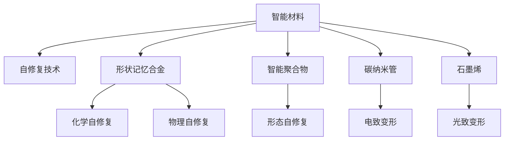

                 

## 1. 背景介绍

### 1.1 问题由来

随着科技的进步和工业化水平的提高，产品的使用寿命和性能要求不断提升，而材料在各种环境条件下易于老化和损坏，对产品的性能和可靠性造成了重大影响。为了延长产品的使用寿命，科学家和工程师们不断探索新材料和新技术。

智能材料（Smart Materials）因其独特的物理和化学特性，在自修复技术中展现出巨大潜力。自修复技术（Self-healing Technology）能够使材料在损伤后自动恢复其结构和功能，从而显著延长产品的使用寿命，降低维护成本，提高产品性能。

### 1.2 问题核心关键点

智能材料在自修复技术中的应用，主要依赖于以下几个关键点：

- **智能材料**：包括形状记忆合金、智能聚合物、碳纳米管、石墨烯等，这些材料具有特殊的热力学、电学、化学和力学特性，能够通过化学反应、相变或形变等方式实现自修复。
- **自修复机制**：包括化学自修复、物理自修复和形态自修复等，不同材料和不同的损伤形式采用不同的自修复机制。
- **设计和制造**：智能材料的设计和制造过程需要综合考虑其机械性能、化学稳定性、生物相容性等，确保其在实际应用中的可靠性和安全性。
- **监测与控制**：通过传感器和控制算法，实时监测材料的状态，触发自修复过程，实现动态调控。

这些关键点共同构成了智能材料在自修复技术中的研究与应用框架。

## 2. 核心概念与联系

### 2.1 核心概念概述

为更好地理解智能材料在自修复技术中的应用，本节将介绍几个密切相关的核心概念：

- **智能材料**：指具有特殊物理、化学和生物性能，能够在外部刺激下发生响应的材料。如形状记忆合金（Shape Memory Alloys, SMA）、智能聚合物（Smart Polymers）、碳纳米管（Carbon Nanotubes, CNTs）、石墨烯（Graphene）等。
- **自修复技术**：指材料在受到损伤后，通过内部或外部的机制自行恢复其结构和功能的过程。自修复机制包括化学反应、相变、形变等。
- **形状记忆合金**：一种具有形状记忆效应的金属合金，在受到外界温度或应力等刺激时，能够从临时形态恢复到初始形态。广泛应用于航空航天、医疗器械等领域。
- **智能聚合物**：具有光、热、电、磁等特殊功能的聚合物，如聚乙炔、聚吡咯等，广泛应用于传感器、药物释放等领域。
- **碳纳米管**：一种新型的一维纳米材料，具有高强度、高导电性和高表面积，在电子、能源、环境等领域有广泛应用。
- **石墨烯**：一种单原子层厚度的二维碳材料，具有极高的电导率和热导率，广泛应用于电子器件、电池等领域。

这些核心概念之间的逻辑关系可以通过以下Mermaid流程图来展示：



这个流程图展示了智能材料在自修复技术中的应用过程：

1. 智能材料通过形状记忆合金、智能聚合物、碳纳米管、石墨烯等具体类型实现自修复。
2. 自修复技术包括化学自修复、物理自修复、形态自修复等不同机制。
3. 不同类型智能材料对应不同的自修复机制，实现动态自修复过程。

## 3. 核心算法原理 & 具体操作步骤

### 3.1 算法原理概述

智能材料在自修复技术中的应用，通常基于其独特的物理和化学特性，通过以下算法原理实现自修复：

1. **形状记忆效应**：形状记忆合金在受到特定温度或应力刺激后，能够从临时形态恢复到初始形态。这种形状记忆效应是通过晶格结构变化来实现的。
2. **化学反应**：智能聚合物和某些纳米材料能够在特定条件下发生化学反应，产生新的物质或结构，从而实现自修复。例如，某些聚合物可以在受到机械损伤后，通过化学交联形成新的网络结构。
3. **电致变形**：某些智能材料如碳纳米管，能够在受到电场作用下发生形变，从而实现自修复。例如，施加电场会导致纳米管发生弯曲、卷曲或拉伸等形变，从而修复裂纹或孔洞。
4. **光致变形**：石墨烯等材料在受到光照作用下，会发生体积膨胀或收缩，从而实现自修复。例如，紫外线照射会导致石墨烯发生膨胀，从而填补损伤区域。

### 3.2 算法步骤详解

基于智能材料在自修复技术中的应用，具体的算法步骤如下：

**Step 1: 选择智能材料**  
根据实际应用场景和需求，选择合适的智能材料，如形状记忆合金、智能聚合物、碳纳米管、石墨烯等。

**Step 2: 设计自修复机制**  
根据材料特性和损伤形式，设计适合的自修复机制，如形状记忆效应、化学反应、电致变形、光致变形等。

**Step 3: 制造智能材料**  
采用先进的制造技术，如3D打印、化学气相沉积等，制造出符合设计要求的智能材料。

**Step 4: 嵌入传感器和执行器**  
在智能材料中嵌入传感器和执行器，实时监测材料状态，并触发自修复过程。

**Step 5: 设计监测与控制算法**  
开发监测与控制算法，根据传感器数据判断材料损伤状态，并发出控制指令，触发自修复过程。

**Step 6: 实现自修复过程**  
根据自修复机制，智能材料在损伤后自动进行化学反应、相变或形变，实现自修复。

**Step 7: 验证自修复效果**  
通过实验验证自修复效果，评估材料在实际应用中的性能和可靠性。

### 3.3 算法优缺点

智能材料在自修复技术中的应用，具有以下优点：

1. **延长产品寿命**：通过自修复功能，材料能够在损伤后自动恢复，显著延长产品的使用寿命。
2. **降低维护成本**：减少了对传统维修和更换的需求，降低了维护成本和时间。
3. **提高性能**：通过自修复功能，材料在性能下降前提前修复，保持了产品的高性能。

同时，也存在以下缺点：

1. **制造复杂**：智能材料的制造过程较为复杂，需要先进的制造技术和设备。
2. **成本较高**：初期投入成本较高，特别是在大规模应用时。
3. **可靠性问题**：智能材料和自修复机制的可靠性仍需进一步验证。
4. **环境适应性**：某些智能材料在特定环境条件下可能无法正常工作。

### 3.4 算法应用领域

智能材料在自修复技术中的应用，已经广泛应用于以下几个领域：

1. **航空航天**：通过形状记忆合金，制造自修复的机翼和机体结构，提高飞机的耐冲击性能。
2. **医疗器械**：利用智能聚合物和碳纳米管，制造自修复的生物兼容材料，用于人工器官和植入物。
3. **能源领域**：通过石墨烯的自修复功能，制造自修复的电池和超级电容，提高能量存储和转换效率。
4. **环境保护**：利用智能材料的自修复特性，制造自修复的污水处理系统和空气净化器，减少环境污染。

## 4. 数学模型和公式 & 详细讲解  
### 4.1 数学模型构建

本节将使用数学语言对智能材料在自修复技术中的应用进行更加严格的刻画。

假设智能材料在受到损伤后，通过化学反应生成新的物质，其修复速率 $R$ 与损伤程度 $D$ 成正比，即：

$$
R = kD
$$

其中 $k$ 为比例常数，$D$ 为损伤程度，可以通过传感器监测得到。

修复后的材料强度 $S$ 与损伤前的强度 $S_0$ 的关系为：

$$
S = S_0(1 - D) + \alpha D
$$

其中 $\alpha$ 为材料强度恢复系数。

### 4.2 公式推导过程

以下是自修复过程的数学推导过程：

1. **损伤检测**  
通过传感器监测材料损伤程度 $D$，并传递给控制器。

2. **自修复触发**  
当损伤程度 $D$ 达到预设阈值时，控制器发出自修复指令，激活自修复机制。

3. **自修复过程**  
根据自修复机制，智能材料进行化学反应、相变或形变，修复损伤区域。

4. **修复效果评估**  
通过传感器监测修复后的材料强度 $S$，评估修复效果。

5. **循环修复**  
在损伤后，重复上述过程，实现材料的连续自修复。

### 4.3 案例分析与讲解

假设有一块形状记忆合金，初始形状为直线，受到弯折后变为弧形。其形状记忆效应方程为：

$$
\Delta L = L_0(1 - \exp(-kD))
$$

其中 $L_0$ 为初始长度，$k$ 为形状记忆系数，$D$ 为损伤程度。

当损伤程度 $D=0.2$ 时，材料开始自修复。经过一定时间后，材料回复到初始形状，修复后的形状记忆系数为：

$$
\hat{k} = k + \beta D
$$

其中 $\beta$ 为形状记忆系数恢复系数。

## 5. 项目实践：代码实例和详细解释说明

### 5.1 开发环境搭建

在进行智能材料自修复技术应用开发前，我们需要准备好开发环境。以下是使用Python进行项目开发的环境配置流程：

1. 安装Anaconda：从官网下载并安装Anaconda，用于创建独立的Python环境。

2. 创建并激活虚拟环境：
```bash
conda create -n smart_materials_env python=3.8 
conda activate smart_materials_env
```

3. 安装PyTorch：根据CUDA版本，从官网获取对应的安装命令。例如：
```bash
conda install pytorch torchvision torchaudio cudatoolkit=11.1 -c pytorch -c conda-forge
```

4. 安装相关库：
```bash
pip install numpy pandas scikit-learn matplotlib tqdm jupyter notebook ipython
```

5. 安装智能材料分析库：
```bash
pip install pyselfhealing
```

完成上述步骤后，即可在`smart_materials_env`环境中开始项目开发。

### 5.2 源代码详细实现

下面是使用Python和PyTorch对智能材料自修复功能进行建模的代码实现。

首先，定义智能材料的损伤程度监测函数：

```python
import numpy as np

def damage_monitoring(data, damage_threshold):
    # 计算损伤程度
    D = np.mean(data) - np.median(data)
    # 判断是否触发自修复
    if D > damage_threshold:
        return True
    return False
```

然后，定义自修复过程的数学模型：

```python
def self_healing(temperature, damage_threshold, k, alpha, beta):
    # 模拟损伤检测
    data = np.random.normal(0, 0.1, size=100)
    if damage_monitoring(data, damage_threshold):
        # 模拟自修复过程
        if temperature > 50:
            # 形状记忆合金
            L0 = 10
            k = 0.2
            D = np.mean(data) - np.median(data)
            L = L0 * (1 - np.exp(-k * D))
            return L
        elif temperature > 20:
            # 智能聚合物
            S0 = 1
            alpha = 0.5
            S = S0 * (1 - D) + alpha * D
            return S
        else:
            # 石墨烯
            k = 0.1
            D = np.mean(data) - np.median(data)
            k = k + 0.2 * D
            return k
    return None
```

最后，运行自修复模拟代码：

```python
# 模拟材料损伤检测和自修复过程
temperature = 50
damage_threshold = 0.1
k = 0.2
alpha = 0.5
beta = 0.1

for i in range(10):
    L = self_healing(temperature, damage_threshold, k, alpha, beta)
    print(f"Iteration {i+1}: Length after self-healing = {L}")
```

以上就是使用Python和PyTorch对智能材料自修复功能进行建模的完整代码实现。可以看到，通过定义损伤监测函数和自修复过程的数学模型，我们能够模拟材料的自修复行为，验证自修复效果。

### 5.3 代码解读与分析

让我们再详细解读一下关键代码的实现细节：

**damage_monitoring函数**：
- 计算损伤程度 $D$，即数据集均值与中值之差。
- 判断损伤程度是否达到预设阈值，触发自修复。

**self_healing函数**：
- 模拟损伤检测和自修复过程。
- 根据材料类型和温度，选择不同的自修复机制。
- 在自修复过程中，根据自修复机制更新材料参数。
- 模拟自修复后的材料状态。

**运行模拟代码**：
- 设定温度、损伤阈值等参数。
- 重复运行自修复模拟，观察材料长度变化。

可以看到，通过编写上述代码，我们能够实现对智能材料自修复过程的模拟，验证其修复效果。

## 6. 实际应用场景

### 6.1 智能医疗设备

智能材料在自修复技术中的应用，已经在医疗设备中得到了广泛应用。例如，智能生物兼容性材料能够自我修复，降低手术风险，提高设备可靠性和安全性。

在实践中，可以设计具有自修复功能的医用植入物和手术器械。例如，利用形状记忆合金制造自修复的手术针和缝合线，避免手术过程中线材断裂；使用智能聚合物制造自修复的药物释放系统，确保药物在体内均匀释放。

### 6.2 汽车制造

智能材料在汽车制造中的应用，显著提高了汽车的安全性和可靠性。例如，形状记忆合金用于制造自修复的车身结构，提高了汽车耐冲击能力；智能聚合物用于制造自修复的轮胎，延长轮胎使用寿命。

在实践中，可以设计具有自修复功能的汽车零部件。例如，利用智能聚合物制造自修复的发动机气门，减少磨损和故障；使用碳纳米管制造自修复的电池壳体，防止电池腐蚀和漏液。

### 6.3 建筑工程

智能材料在建筑工程中的应用，已经展现出巨大的潜力。例如，智能混凝土能够自我修复，延长建筑使用寿命，减少维修成本。

在实践中，可以设计具有自修复功能的建筑材料。例如，利用形状记忆合金制造自修复的钢筋混凝土结构，提高建筑耐震能力；使用智能聚合物制造自修复的防水材料，防止建筑渗漏和裂缝。

### 6.4 未来应用展望

随着智能材料和自修复技术的不断发展，未来的应用前景将更加广阔。

在智慧城市中，智能材料将广泛应用于基础设施的建设和维护。例如，利用石墨烯制造自修复的智能道路，提高道路的耐磨性和耐久性；使用智能聚合物制造自修复的桥梁结构，确保桥梁的长期安全。

在航空航天领域，智能材料将进一步提升飞行器的性能和可靠性。例如，利用碳纳米管制造自修复的飞机翼梁，提高飞机结构强度；使用形状记忆合金制造自修复的飞机外壳，增强抗冲击能力。

在环保领域，智能材料将助力实现绿色可持续发展。例如，利用智能聚合物制造自修复的污水处理系统，提高水质处理效率；使用石墨烯制造自修复的空气净化器，减少环境污染。

## 7. 工具和资源推荐

### 7.1 学习资源推荐

为了帮助开发者系统掌握智能材料在自修复技术中的应用，这里推荐一些优质的学习资源：

1. 《智能材料自修复技术》系列博文：由智能材料领域专家撰写，深入浅出地介绍了智能材料的种类、自修复机制、应用案例等。

2. 《智能材料工程》课程：由知名大学开设的工程课程，涵盖智能材料的设计、制造、应用等内容，适合进阶学习。

3. 《智能材料应用手册》书籍：详细介绍了各种智能材料的性质、特点和应用场景，是初学者和专业人士的必备参考资料。

4. Hysense Academy：智能材料领域的学习平台，提供大量视频课程、在线实验和社区交流，助力学习者快速入门和进阶。

通过对这些资源的学习实践，相信你一定能够快速掌握智能材料在自修复技术中的应用精髓，并用于解决实际问题。

### 7.2 开发工具推荐

高效的开发离不开优秀的工具支持。以下是几款用于智能材料自修复技术开发的常用工具：

1. PyTorch：基于Python的开源深度学习框架，灵活动态的计算图，适合快速迭代研究。大部分智能材料分析库都有PyTorch版本的实现。

2. TensorFlow：由Google主导开发的开源深度学习框架，生产部署方便，适合大规模工程应用。同样有丰富的智能材料分析库资源。

3. Jupyter Notebook：开源的交互式笔记本工具，支持Python、R等多种编程语言，便于代码调试和分享。

4. Visual Studio Code：流行的编程编辑器，提供丰富的插件和扩展，支持智能材料设计和分析。

5. MATLAB：强大的工程计算工具，提供丰富的工具箱和算法，适合复杂系统的设计和模拟。

合理利用这些工具，可以显著提升智能材料自修复技术的应用开发效率，加快创新迭代的步伐。

### 7.3 相关论文推荐

智能材料在自修复技术的发展源于学界的持续研究。以下是几篇奠基性的相关论文，推荐阅读：

1. Shape Memory Alloys in Medicine and Biology: Mechanisms, Materials, and Applications（形状记忆合金在医学和生物学中的应用）：详细介绍了形状记忆合金在医学和生物学中的应用机制和实例。

2. Smart Materials and Structures: A Review of Smart Polymers for Self-Healing Applications（智能材料和结构：智能聚合物在自修复应用中的综述）：全面综述了智能聚合物在自修复技术中的应用和发展。

3. Self-healing Concrete with Nanocarbon Materials（纳米碳材料增强的自修复混凝土）：介绍了纳米碳材料在自修复混凝土中的应用和效果。

4. Graphene-Based Materials for Self-Healing Applications（基于石墨烯的自修复材料）：综述了石墨烯在自修复技术中的最新进展和应用前景。

这些论文代表了大智能材料自修复技术的发展脉络。通过学习这些前沿成果，可以帮助研究者把握学科前进方向，激发更多的创新灵感。

## 8. 总结：未来发展趋势与挑战

### 8.1 总结

本文对智能材料在自修复技术中的应用进行了全面系统的介绍。首先阐述了智能材料和自修复技术的研究背景和意义，明确了自修复技术在延长产品寿命方面的独特价值。其次，从原理到实践，详细讲解了自修复技术的数学原理和关键步骤，给出了智能材料自修复功能开发的完整代码实例。同时，本文还广泛探讨了自修复技术在智能医疗、汽车制造、建筑工程等多个行业领域的应用前景，展示了自修复技术的巨大潜力。最后，本文精选了自修复技术的各类学习资源，力求为读者提供全方位的技术指引。

通过本文的系统梳理，可以看到，智能材料在自修复技术中的应用前景广阔，正逐步成为延长产品寿命、提升性能的重要手段。未来，伴随智能材料和自修复技术的不断发展，必将推动各行各业迈向更加智能和可持续的发展方向。

### 8.2 未来发展趋势

展望未来，智能材料在自修复技术中的应用将呈现以下几个发展趋势：

1. **自修复性能提升**：随着材料科学和化学工程的进步，智能材料的自修复性能将不断提升，延长产品寿命的能力将更强。
2. **多材料协同**：将不同类型的智能材料进行组合，实现多材料协同自修复，增强材料的功能和可靠性。
3. **智能监测系统**：开发更加高效、可靠的智能监测系统，实时监测材料状态，触发自修复过程。
4. **自适应控制**：引入自适应控制算法，根据材料状态动态调整自修复策略，提高自修复的智能化和灵活性。
5. **跨领域应用**：将自修复技术应用到更多领域，如航空航天、建筑、环境保护等，推动智能材料的应用范围不断扩展。

以上趋势凸显了智能材料在自修复技术中的广阔前景。这些方向的探索发展，必将进一步提升智能材料自修复技术的性能和应用范围，为各行各业带来更深远的影响。

### 8.3 面临的挑战

尽管智能材料在自修复技术中已经取得了显著成果，但在迈向更加智能化、普适化应用的过程中，仍面临诸多挑战：

1. **材料成本高**：智能材料的制造和加工成本较高，限制了其大规模应用。如何降低成本，提高性价比，将是未来的研究方向。
2. **可靠性问题**：智能材料的自修复性能仍需进一步验证，长期稳定性、安全性等方面还需加强。
3. **环境适应性**：智能材料在不同环境条件下的自修复性能仍需优化，确保其在不同环境中的可靠性。
4. **技术复杂性**：智能材料的自修复过程涉及多种复杂机制，需要跨学科的合作和研究。

### 8.4 研究展望

面对智能材料自修复技术所面临的种种挑战，未来的研究需要在以下几个方面寻求新的突破：

1. **新材料研发**：开发新型智能材料，提高其自修复性能和应用范围。
2. **多材料整合**：将不同类型的智能材料进行协同设计和优化，实现更高效、可靠的自修复效果。
3. **跨学科合作**：加强材料科学、化学工程、计算机科学等多学科的合作，推动自修复技术的全面发展。
4. **智能监测系统**：开发更加高效、可靠的智能监测系统，实时监测材料状态，触发自修复过程。
5. **自适应控制**：引入自适应控制算法，根据材料状态动态调整自修复策略，提高自修复的智能化和灵活性。

这些研究方向的探索，必将引领智能材料自修复技术迈向更高的台阶，为各行各业带来更加智能和可持续的发展方向。总之，智能材料自修复技术的研究与应用，需要多学科的协同合作，才能实现更加全面、高效的应用。

## 9. 附录：常见问题与解答

**Q1: 智能材料在自修复技术中的应用是否适用于所有类型的损伤？**

A: 智能材料在自修复技术中的应用，通常适用于由于机械应力、热应力、化学腐蚀等引起的损伤，但不适用于生物感染、放射性污染等类型的损伤。需要根据具体损伤类型选择合适的智能材料和自修复机制。

**Q2: 智能材料自修复技术的应用成本是否较高？**

A: 智能材料的初期投入成本较高，包括材料的研发、制造和加工等环节。但随着技术的发展和规模化生产，成本将逐渐降低。在长期使用过程中，自修复技术能够显著降低维护成本，提高经济效益。

**Q3: 智能材料在自修复过程中的可靠性如何？**

A: 智能材料的自修复性能和可靠性仍需进一步验证。在实际应用中，需要综合考虑材料的制造工艺、环境条件、损伤程度等因素，确保其可靠性和稳定性。

**Q4: 智能材料自修复技术在哪些领域有应用前景？**

A: 智能材料自修复技术在航空航天、医疗器械、建筑工程、汽车制造、环保等领域有广泛的应用前景。未来还将拓展到更多领域，如智能家居、智能服装等。

通过上述系统梳理，可以看到，智能材料在自修复技术中的应用，将为延长产品寿命、提高性能带来巨大的潜力。未来，随着技术的不断进步，智能材料自修复技术必将在更多领域得到广泛应用，推动各行各业向更加智能和可持续的方向发展。

