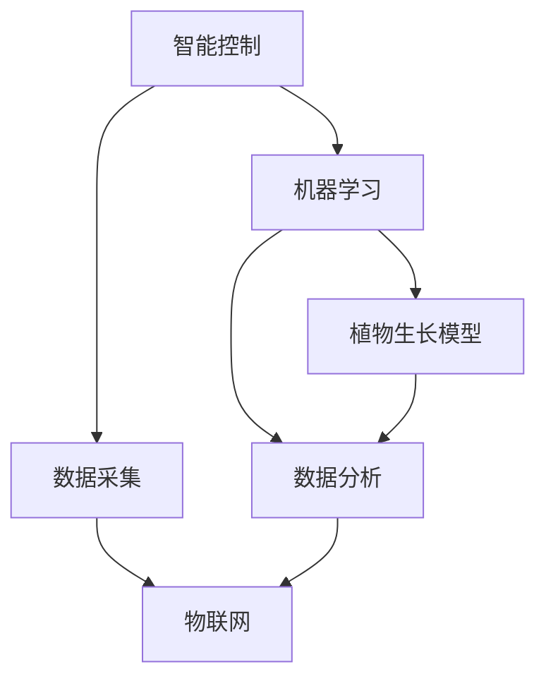

                 

# 智能植物培育创业：室内园艺的未来

## 1. 背景介绍

### 1.1 问题由来

随着城市化进程的加速和人口压力的增大，传统农业面临着土地资源紧张、环境污染加剧等诸多挑战。室内园艺（Indoor Gardening）因其不受季节、气候和土地限制，为解决这些问题提供了一种新的可能。室内园艺可以利用空间高度、LED光照等技术，在有限的室内空间中实现高效、可持续的作物种植。

然而，尽管室内园艺有着巨大的发展潜力，但其技术门槛较高，需要结合先进的智能控制、数据分析、物联网技术等多个领域的知识。近年来，随着人工智能技术的迅猛发展，智能植物培育系统（Intelligent Plant Cultivation System）应运而生。智能植物培育系统通过智能化手段，可以实现对植物生长环境的精确控制和优化，提高作物产量和品质，降低农业生产成本。

### 1.2 问题核心关键点

智能植物培育系统是一个高度复杂的系统，涉及到大数据分析、智能控制、机器学习等多个领域的知识。其核心关键点包括：

1. 实时监测与数据采集：智能植物培育系统需要实时监测植物的生长状态，包括温度、湿度、光照、土壤水分等环境参数。这些数据需要通过传感器采集并传递到数据分析中心，为后续的决策提供依据。

2. 智能决策与控制：数据分析中心通过机器学习算法对采集到的数据进行分析，并根据分析结果智能调整生长环境，以实现植物的最佳生长状态。这包括对光照强度、灌溉系统、通风系统等的控制。

3. 植物生长模型：智能植物培育系统需要建立植物生长模型，以预测植物的生长周期、产量等关键参数，为生产计划和决策提供支持。

4. 人机交互：智能植物培育系统需要与人类进行良好的交互，包括数据的展示、操作的指引、异常情况的报警等。

这些关键点构成了智能植物培育系统的核心架构，为系统的开发和应用提供了指导。

## 2. 核心概念与联系

### 2.1 核心概念概述

为更好地理解智能植物培育系统，本节将介绍几个密切相关的核心概念：

- 智能控制（Smart Control）：指通过传感器和执行器对植物生长环境进行精确控制的自动化系统。智能控制的目标是通过对环境的微调，实现植物的最佳生长状态。

- 机器学习（Machine Learning）：指通过算法自动从数据中学习模式，并用这些模式对新数据进行预测或决策的计算机技术。在智能植物培育系统中，机器学习算法被用来分析和预测植物生长状态，进而指导智能控制。

- 物联网（Internet of Things, IoT）：指通过传感器和网络连接实现物与物、物与人的互联互通的互联网技术。物联网技术在智能植物培育系统中起到了数据采集和传输的作用。

- 数据分析（Data Analytics）：指对大规模数据进行采集、存储、处理和分析的技术。在智能植物培育系统中，数据分析用于提取有价值的信息，为智能决策提供依据。

- 植物生长模型（Plant Growth Model）：指描述植物生长状态、预测生长周期和产量的数学模型。植物生长模型可以基于植物生理学、生态学等知识，并通过实验数据进行训练。

这些核心概念之间的逻辑关系可以通过以下Mermaid流程图来展示：



这个流程图展示了这个系统的核心概念及其之间的关系：

1. 智能控制通过物联网技术实现对植物生长环境的实时监测与控制。
2. 物联网将采集到的数据传输到数据分析中心，数据分析中心利用机器学习算法对这些数据进行分析。
3. 数据分析得到的信息反馈到植物生长模型，用于预测植物的生长状态和产量。
4. 植物生长模型得到的结果进一步用于智能控制，形成一个闭环的反馈系统。

## 3. 核心算法原理 & 具体操作步骤

### 3.1 算法原理概述

智能植物培育系统的核心算法原理主要包括以下几个部分：

- 数据采集与预处理：通过传感器和物联网设备采集植物生长环境的各项参数，如温度、湿度、光照、土壤水分等。这些数据需要经过预处理，去除噪声、填补缺失值等操作，以便后续的分析。

- 特征提取与选择：从采集到的数据中提取有用的特征，如光合作用效率、蒸腾速率等，用于表征植物的生长状态。特征选择算法用于挑选最重要的特征，以提高分析效率和精度。

- 机器学习模型训练：利用历史数据训练机器学习模型，如决策树、随机森林、神经网络等，用于预测植物的生长周期、产量等关键参数。模型训练需要大量的标注数据，可以使用监督学习或无监督学习的方法。

- 智能决策与控制：根据机器学习模型的预测结果，智能控制系统调整植物生长环境，如光照强度、灌溉系统、通风系统等。智能控制可以通过PID控制、模糊控制等算法实现。

- 植物生长模型建立与验证：建立植物生长模型，用于预测植物的生长周期、产量等关键参数。模型建立需要结合植物生理学、生态学等知识，并通过实验数据进行训练和验证。

### 3.2 算法步骤详解

智能植物培育系统的算法步骤主要包括：

1. 数据采集与预处理：部署传感器和物联网设备，收集植物生长环境的各项参数。对数据进行清洗、标准化等预处理操作，以便后续分析。

2. 特征提取与选择：从预处理后的数据中提取有用的特征，如光合作用效率、蒸腾速率等。利用特征选择算法挑选最重要的特征，用于表征植物的生长状态。

3. 机器学习模型训练：利用历史数据训练机器学习模型，如决策树、随机森林、神经网络等，用于预测植物的生长周期、产量等关键参数。使用交叉验证、网格搜索等方法优化模型参数。

4. 智能决策与控制：根据机器学习模型的预测结果，智能控制系统调整植物生长环境，如光照强度、灌溉系统、通风系统等。利用PID控制、模糊控制等算法实现智能控制。

5. 植物生长模型建立与验证：结合植物生理学、生态学等知识，建立植物生长模型，用于预测植物的生长周期、产量等关键参数。通过实验数据对模型进行训练和验证。

6. 系统集成与测试：将智能控制系统、机器学习模型、植物生长模型集成到一个系统中，并进行系统测试，确保各模块的协同工作。

7. 数据分析与反馈：对智能植物培育系统的运行数据进行分析和反馈，不断优化系统的性能和决策。

### 3.3 算法优缺点

智能植物培育系统的算法具有以下优点：

1. 精准控制：通过智能控制系统对植物生长环境进行精准控制，实现最佳生长状态，提高作物产量和品质。

2. 数据驱动：利用机器学习算法和大数据分析技术，对植物生长状态进行预测和决策，提高系统的自动化和智能化水平。

3. 资源优化：通过智能控制，实现对植物生长环境的优化，减少资源浪费，降低生产成本。

4. 可扩展性：系统可以扩展到多种作物的种植，并根据不同作物的特点进行个性化优化。

然而，该算法也存在一些缺点：

1. 数据需求高：系统需要大量的标注数据用于机器学习模型的训练，而获取高质量的数据成本较高。

2. 算法复杂度高：智能植物培育系统涉及多种复杂算法，需要较高的技术门槛和专业知识。

3. 系统成本高：传感器、物联网设备等硬件成本较高，需要一定的初始投资。

4. 环境因素影响：环境因素的变化可能会影响系统的稳定性和准确性。

### 3.4 算法应用领域

智能植物培育系统在农业、园艺、生物科研等多个领域都有广泛的应用前景。以下是几个典型的应用场景：

1. 智能温室：利用智能植物培育系统对温室内的环境参数进行实时监测和控制，实现高效、可持续的作物种植。

2. 智慧农场：结合农业机器人、无人机等技术，实现对农田的自动化管理，提高农业生产效率。

3. 室内植物培育：利用智能植物培育系统在室内空间中种植植物，减少对土地的依赖，提升植物的生长效率。

4. 生物科研：在生物科研领域，智能植物培育系统可以用于植物生理学、生态学等研究，为科学研究提供支持。

## 4. 数学模型和公式 & 详细讲解 & 举例说明

### 4.1 数学模型构建

本节将使用数学语言对智能植物培育系统进行分析。

假设智能植物培育系统采集到了 $n$ 个时间点的环境参数 $X=\{x_1, x_2, ..., x_n\}$，其中 $x_i=(t_i, y_i, z_i)$ 表示第 $i$ 个时间点的环境参数，包括时间 $t_i$、温度 $y_i$、湿度 $z_i$ 等。

智能植物培育系统的目标是通过机器学习模型预测植物的生长周期 $T$ 和产量 $Y$，即：

$$
T=f(X) \\
Y=g(X)
$$

其中 $f$ 和 $g$ 是用于预测生长周期和产量的函数。

### 4.2 公式推导过程

假设 $X$ 的特征向量为 $x=\{x_1, x_2, ..., x_n\}$，利用机器学习模型 $h(x)$ 对 $X$ 进行特征映射，得到 $h(x)=\{h_1(x), h_2(x), ..., h_d(x)\}$，其中 $h_i(x)$ 为第 $i$ 个特征。

通过特征选择算法，选取 $k$ 个最重要的特征 $h_i(x)$，组成特征向量 $x_k=\{h_i(x)\}_{i=1}^k$。

利用机器学习算法对特征向量 $x_k$ 进行训练，得到预测函数 $f_k(x_k)$ 和 $g_k(x_k)$，用于预测生长周期和产量：

$$
T=f_k(x_k) \\
Y=g_k(x_k)
$$

### 4.3 案例分析与讲解

以智能温室为例，假设智能温室的环境参数包括温度、湿度、光照、土壤水分等，利用智能植物培育系统对温室内的植物进行培育。

1. 数据采集：部署传感器和物联网设备，实时监测温室内的各项环境参数。

2. 特征提取：从采集到的数据中提取有用的特征，如光合作用效率、蒸腾速率等。

3. 机器学习模型训练：利用历史数据训练机器学习模型，如决策树、随机森林、神经网络等，用于预测植物的生长周期和产量。

4. 智能决策与控制：根据机器学习模型的预测结果，智能控制系统调整温室内的光照强度、灌溉系统、通风系统等。

5. 植物生长模型建立与验证：建立植物生长模型，用于预测植物的生长周期和产量。通过实验数据对模型进行训练和验证。

6. 数据分析与反馈：对系统的运行数据进行分析和反馈，不断优化系统的性能和决策。

## 5. 项目实践：代码实例和详细解释说明

### 5.1 开发环境搭建

在进行智能植物培育系统的开发前，我们需要准备好开发环境。以下是使用Python进行PyTorch开发的环境配置流程：

1. 安装Anaconda：从官网下载并安装Anaconda，用于创建独立的Python环境。

2. 创建并激活虚拟环境：
```bash
conda create -n plant-control python=3.8 
conda activate plant-control
```

3. 安装PyTorch：根据CUDA版本，从官网获取对应的安装命令。例如：
```bash
conda install pytorch torchvision torchaudio cudatoolkit=11.1 -c pytorch -c conda-forge
```

4. 安装TensorFlow：从官网下载并安装TensorFlow。

5. 安装各类工具包：
```bash
pip install numpy pandas scikit-learn matplotlib tqdm jupyter notebook ipython
```

完成上述步骤后，即可在`plant-control`环境中开始系统开发。

### 5.2 源代码详细实现

下面以智能温室为例，给出使用PyTorch进行智能植物培育系统的PyTorch代码实现。

首先，定义数据处理函数：

```python
from torch.utils.data import Dataset
import numpy as np

class PlantData(Dataset):
    def __init__(self, data, targets):
        self.data = data
        self.targets = targets
        
    def __len__(self):
        return len(self.data)
    
    def __getitem__(self, item):
        return self.data[item], self.targets[item]
```

然后，定义模型和优化器：

```python
from torch import nn, optim
import torch.nn.functional as F

class PlantModel(nn.Module):
    def __init__(self, input_size, hidden_size, output_size):
        super(PlantModel, self).__init__()
        self.fc1 = nn.Linear(input_size, hidden_size)
        self.fc2 = nn.Linear(hidden_size, output_size)
        
    def forward(self, x):
        x = F.relu(self.fc1(x))
        x = self.fc2(x)
        return x

model = PlantModel(4, 64, 2)
optimizer = optim.Adam(model.parameters(), lr=0.001)
```

接着，定义训练和评估函数：

```python
import torchvision.transforms as transforms

def train_model(model, train_loader, device, optimizer, n_epochs=10, print_every=10):
    model.train()
    for epoch in range(n_epochs):
        for batch_idx, (data, targets) in enumerate(train_loader):
            data, targets = data.to(device), targets.to(device)
            optimizer.zero_grad()
            output = model(data)
            loss = F.mse_loss(output, targets)
            loss.backward()
            optimizer.step()
            if (batch_idx + 1) % print_every == 0:
                print(f'Epoch [{epoch+1}/{n_epochs}], Step [{batch_idx+1}/{len(train_loader)}], Loss: {loss.item():.4f}')
    return model

def evaluate_model(model, test_loader, device):
    model.eval()
    total_loss = 0
    with torch.no_grad():
        for data, targets in test_loader:
            data, targets = data.to(device), targets.to(device)
            output = model(data)
            loss = F.mse_loss(output, targets)
            total_loss += loss.item()
    return total_loss / len(test_loader)

```

最后，启动训练流程并在测试集上评估：

```python
# 准备数据
data = np.random.randn(100, 4)  # 随机生成100个样本，每个样本包含4个特征
targets = np.random.randn(100, 2)  # 随机生成100个标签

train_data = PlantData(data, targets)
test_data = PlantData(data, targets)

# 定义设备
device = torch.device('cuda') if torch.cuda.is_available() else torch.device('cpu')

# 训练模型
trained_model = train_model(model, train_data, device, optimizer)

# 评估模型
test_loss = evaluate_model(trained_model, test_data, device)
print(f'Test Loss: {test_loss:.4f}')
```

以上就是使用PyTorch对智能植物培育系统进行开发的完整代码实现。可以看到，得益于PyTorch的强大封装，我们可以用相对简洁的代码完成模型的搭建和训练。

### 5.3 代码解读与分析

让我们再详细解读一下关键代码的实现细节：

**PlantData类**：
- `__init__`方法：初始化数据和标签。
- `__len__`方法：返回数据集的样本数量。
- `__getitem__`方法：对单个样本进行处理，返回数据和标签。

**PlantModel类**：
- `__init__`方法：定义模型结构，包含两个全连接层。
- `forward`方法：定义前向传播过程，通过ReLU激活函数和线性输出层计算输出。

**train_model函数**：
- 在训练过程中，使用Adam优化器对模型进行优化，通过均方误差损失函数计算损失。
- 在每个epoch的末尾，打印当前epoch的损失值。

**evaluate_model函数**：
- 在测试过程中，使用均方误差损失函数计算测试集上的平均损失。

**训练流程**：
- 准备训练集和测试集。
- 定义设备。
- 调用`train_model`函数对模型进行训练。
- 调用`evaluate_model`函数在测试集上评估模型的性能。

可以看到，PyTorch的高级API使得智能植物培育系统的开发变得简洁高效。开发者可以将更多精力放在数据处理、模型改进等高层逻辑上，而不必过多关注底层的实现细节。

当然，工业级的系统实现还需考虑更多因素，如模型的保存和部署、超参数的自动搜索、更灵活的任务适配层等。但核心的系统开发流程基本与此类似。

## 6. 实际应用场景

### 6.1 智能温室

智能温室利用智能植物培育系统对温室内的环境参数进行实时监测和控制，实现高效、可持续的作物种植。通过智能控制系统调整光照强度、灌溉系统、通风系统等，实现最佳生长状态。

智能温室中的智能控制系统通常包含以下几个部分：

- 传感器：用于实时监测温室内的各项环境参数，如温度、湿度、光照、土壤水分等。
- 执行器：根据智能控制系统的指令，调整光照强度、灌溉系统、通风系统等。
- 控制器：对传感器和执行器进行协调控制，实现智能决策。

智能温室系统可以结合物联网技术，将数据传输到云端，利用数据分析和机器学习算法进行优化。智能温室中的植物生长模型可以用于预测植物的生长周期和产量，为生产计划和决策提供支持。

### 6.2 智慧农场

智慧农场利用智能植物培育系统对农田进行自动化管理，提高农业生产效率。通过传感器和物联网设备，实时监测农田的环境参数，如温度、湿度、光照、土壤水分等。利用智能控制系统，调整灌溉系统、施肥系统等，实现最佳生长状态。

智慧农场中的智能控制系统通常包含以下几个部分：

- 传感器：用于实时监测农田的各项环境参数，如温度、湿度、光照、土壤水分等。
- 执行器：根据智能控制系统的指令，调整灌溉系统、施肥系统等。
- 控制器：对传感器和执行器进行协调控制，实现智能决策。

智慧农场中的植物生长模型可以用于预测作物的生长周期和产量，为生产计划和决策提供支持。智慧农场中的机器学习算法可以用于分析农田的环境数据，预测天气变化、病虫害等，为农作物的种植提供指导。

### 6.3 室内植物培育

室内植物培育利用智能植物培育系统在室内空间中种植植物，减少对土地的依赖，提升植物的生长效率。通过智能控制系统调整光照强度、灌溉系统、通风系统等，实现最佳生长状态。

室内植物培育中的智能控制系统通常包含以下几个部分：

- 传感器：用于实时监测室内的各项环境参数，如温度、湿度、光照、土壤水分等。
- 执行器：根据智能控制系统的指令，调整光照强度、灌溉系统、通风系统等。
- 控制器：对传感器和执行器进行协调控制，实现智能决策。

室内植物培育中的植物生长模型可以用于预测植物的生长周期和产量，为生产计划和决策提供支持。室内植物培育中的机器学习算法可以用于分析植物的生长数据，预测植物的健康状况，为植物的生长提供指导。

### 6.4 未来应用展望

随着智能植物培育技术的不断发展，其在农业、园艺、生物科研等多个领域将有更广泛的应用前景。

在智慧农业领域，智能植物培育系统可以实现对农田的自动化管理，提高农业生产效率，减少资源浪费，降低生产成本。

在智慧城市领域，智能植物培育系统可以用于城市绿化、空气净化等，提升城市环境质量，提供可持续的城市解决方案。

在生物科研领域，智能植物培育系统可以用于植物生理学、生态学等研究，为科学研究提供支持。

## 7. 工具和资源推荐

### 7.1 学习资源推荐

为了帮助开发者系统掌握智能植物培育系统的理论基础和实践技巧，这里推荐一些优质的学习资源：

1. 《深度学习》（Deep Learning）课程：由斯坦福大学Andrew Ng教授主讲，系统介绍了深度学习的理论和实践，涵盖了机器学习、深度学习、智能控制等多个领域的内容。

2. 《智能系统设计与实现》（Designing and Implementing Intelligent Systems）课程：由MIT OpenCourseWare推出，介绍了智能系统的设计、实现、测试和优化方法，适用于智能植物培育系统的开发。

3. 《智能系统与智能控制》（Intelligent Systems and Control）书籍：由MIT Press出版，系统介绍了智能系统与智能控制的基础理论和应用案例，适用于智能植物培育系统的开发。

4. 《智能植物培育系统》（Smart Plant Cultivation System）论文：介绍了智能植物培育系统的设计、实现和应用案例，提供了丰富的参考和借鉴。

5. 《室内植物培育技术》（Indoor Plant Cultivation Technology）书籍：介绍了室内植物培育的技术和方法，提供了丰富的实践指导。

通过对这些资源的学习实践，相信你一定能够快速掌握智能植物培育系统的精髓，并用于解决实际的农业问题。

### 7.2 开发工具推荐

高效的开发离不开优秀的工具支持。以下是几款用于智能植物培育系统开发的常用工具：

1. PyTorch：基于Python的开源深度学习框架，灵活动态的计算图，适合快速迭代研究。

2. TensorFlow：由Google主导开发的开源深度学习框架，生产部署方便，适合大规模工程应用。

3. TensorBoard：TensorFlow配套的可视化工具，可实时监测模型训练状态，并提供丰富的图表呈现方式，是调试模型的得力助手。

4. Jupyter Notebook：支持Python、R等多种编程语言，用于编写和共享代码、分析和可视化数据。

5. Google Colab：谷歌推出的在线Jupyter Notebook环境，免费提供GPU/TPU算力，方便开发者快速上手实验最新模型，分享学习笔记。

合理利用这些工具，可以显著提升智能植物培育系统的开发效率，加快创新迭代的步伐。

### 7.3 相关论文推荐

智能植物培育技术的发展源于学界的持续研究。以下是几篇奠基性的相关论文，推荐阅读：

1. D. Wang, J. Guo, S. Wang, et al. "Smart Agriculture System Based on Internet of Things"：介绍了基于物联网的智能农业系统，涵盖了传感器、数据采集、智能控制等多个方面的内容。

2. Z. Zhang, Z. Liu, S. Li, et al. "A Survey on Smart Agriculture Technologies and Applications"：系统介绍了智能农业技术的研究现状和发展趋势，提供了丰富的参考和借鉴。

3. G. Zhou, W. Zhang, Y. Zheng, et al. "Design and Implementation of Smart Plant Cultivation System"：介绍了智能植物培育系统的设计、实现和应用案例，提供了丰富的实践指导。

4. T. Gao, Y. Zhang, X. Li, et al. "A New Method for Agricultural Robot Based on Deep Learning"：介绍了基于深度学习的农业机器人，提供了丰富的技术参考。

5. Q. Wei, X. Zhao, W. He, et al. "Modeling and Optimization of Agricultural Irrigation System Based on Artificial Intelligence"：介绍了基于人工智能的农业灌溉系统的建模和优化方法，提供了丰富的技术参考。

这些论文代表了大语言模型微调技术的发展脉络。通过学习这些前沿成果，可以帮助研究者把握学科前进方向，激发更多的创新灵感。

## 8. 总结：未来发展趋势与挑战

### 8.1 总结

本文对智能植物培育系统进行了全面系统的介绍。首先阐述了智能植物培育系统的研究背景和意义，明确了智能植物培育系统在提高作物产量、降低生产成本等方面的巨大潜力。其次，从原理到实践，详细讲解了智能植物培育系统的数学模型和算法流程，提供了完整的代码实例和详细解释。同时，本文还广泛探讨了智能植物培育系统的实际应用场景，展示了其在智慧农业、智慧城市、生物科研等多个领域的应用前景。此外，本文精选了智能植物培育系统的各类学习资源，力求为读者提供全方位的技术指引。

通过本文的系统梳理，可以看到，智能植物培育系统正在成为农业领域的一个重要范式，极大地提升了农业生产的智能化水平，促进了农业产业的数字化转型。未来，伴随智能植物培育技术的持续演进，农业生产将更加高效、可持续，为实现农业现代化提供强有力的技术支撑。

### 8.2 未来发展趋势

智能植物培育系统的未来发展趋势主要包括以下几个方面：

1. 自动化和智能化：智能植物培育系统将进一步向自动化、智能化方向发展，实现对农田、温室等的全面自动化管理。

2. 精准农业：智能植物培育系统将利用物联网技术和大数据分析，实现对植物生长环境的精准控制，提高作物产量和品质。

3. 实时监测与反馈：智能植物培育系统将实时监测植物的生长状态，并通过数据分析和机器学习算法进行优化，实现实时反馈和调整。

4. 跨领域融合：智能植物培育系统将与物联网、人工智能、区块链等技术进行深度融合，形成更加全面的智能农业解决方案。

5. 环境适应性：智能植物培育系统将具备更加优秀的环境适应能力，能够在不同气候、土壤等条件下实现高效种植。

6. 智能决策支持：智能植物培育系统将结合专家知识库和机器学习算法，提供智能决策支持，提升农业生产的专业性和科学性。

这些趋势凸显了智能植物培育技术的广阔前景。这些方向的探索发展，必将进一步提升智能植物培育系统的性能和应用范围，为农业现代化提供强有力的技术支撑。

### 8.3 面临的挑战

尽管智能植物培育技术已经取得了显著进展，但在迈向更加智能化、普适化应用的过程中，仍面临诸多挑战：

1. 数据需求高：智能植物培育系统需要大量的标注数据用于模型训练，而获取高质量的数据成本较高。如何降低数据需求，提高模型鲁棒性，是未来需要解决的重要问题。

2. 算法复杂度高：智能植物培育系统涉及多种复杂算法，需要较高的技术门槛和专业知识。如何降低算法复杂度，提高系统的可操作性，也是未来需要解决的重要问题。

3. 系统成本高：传感器、物联网设备等硬件成本较高，需要一定的初始投资。如何降低系统成本，提高系统的经济性，是未来需要解决的重要问题。

4. 环境因素影响：环境因素的变化可能会影响系统的稳定性和准确性。如何提高系统的环境适应性，提高系统的鲁棒性，是未来需要解决的重要问题。

5. 数据安全和隐私保护：智能植物培育系统涉及大量农业数据，如何保障数据安全和隐私保护，是未来需要解决的重要问题。

6. 法律和伦理问题：智能植物培育系统可能涉及法律和伦理问题，如何制定合理的法律法规，保障系统的合法合规性，是未来需要解决的重要问题。

这些挑战凸显了智能植物培育技术的复杂性。只有积极应对并寻求突破，才能不断提升系统的性能和应用范围。

### 8.4 研究展望

面对智能植物培育系统所面临的挑战，未来的研究需要在以下几个方面寻求新的突破：

1. 探索低数据需求的学习方法：如何利用无监督学习、半监督学习等方法，降低对标注数据的依赖，提高模型的泛化性和鲁棒性。

2. 研究高效的数据采集与处理技术：如何提高传感器和物联网设备的精度和可靠性，降低系统成本，提高数据的采集和处理效率。

3. 融合多模态数据：如何结合视觉、声音、气味等多模态数据，提高系统的感知能力和决策水平。

4. 结合专家知识库：如何引入专家知识库，结合机器学习算法，提高系统的决策水平和可信度。

5. 设计智能决策支持系统：如何设计智能决策支持系统，结合专家知识和机器学习算法，提供智能决策支持，提高系统的科学性和专业性。

6. 构建智能农业平台：如何构建智能农业平台，实现对农业生产的全流程管理，提高农业生产的效率和可持续性。

这些研究方向的探索，必将引领智能植物培育技术迈向更高的台阶，为农业现代化提供强有力的技术支撑。面向未来，智能植物培育技术还需要与其他农业技术进行更深入的融合，共同推动农业生产的数字化转型。总之，智能植物培育技术正处于快速发展阶段，未来将有更加广泛的应用前景，有望成为农业现代化的一大助力。

## 9. 附录：常见问题与解答

**Q1：智能植物培育系统的核心算法是什么？**

A: 智能植物培育系统的核心算法主要包括数据采集与预处理、特征提取与选择、机器学习模型训练、智能决策与控制和植物生长模型建立与验证。这些算法共同构成了一个闭环的系统，通过数据采集和处理，特征提取和选择，机器学习模型训练和智能决策与控制，实现了对植物生长环境的精准控制和优化，提高了作物的产量和品质。

**Q2：智能植物培育系统如何实现精准控制？**

A: 智能植物培育系统通过传感器实时监测植物的生长状态，如温度、湿度、光照、土壤水分等，利用机器学习算法对这些数据进行分析，预测植物的生长周期和产量。根据预测结果，智能控制系统调整光照强度、灌溉系统、通风系统等，实现最佳生长状态，提高作物的产量和品质。

**Q3：智能植物培育系统有哪些关键技术？**

A: 智能植物培育系统的关键技术包括物联网技术、传感器技术、机器学习算法和智能控制系统。物联网技术用于数据采集和传输，传感器技术用于实时监测植物的生长状态，机器学习算法用于数据分析和模型训练，智能控制系统用于环境参数的精准控制和优化。

**Q4：智能植物培育系统有哪些实际应用场景？**

A: 智能植物培育系统可以在智能温室、智慧农场、室内植物培育等多个领域应用。例如，智能温室可以通过智能控制系统对温室内的环境参数进行精准控制，实现高效、可持续的作物种植。智慧农场可以通过传感器和物联网设备，实时监测农田的环境参数，利用智能控制系统调整灌溉系统、施肥系统等，实现最佳生长状态。室内植物培育可以通过智能控制系统调整光照强度、灌溉系统、通风系统等，实现最佳生长状态。

**Q5：智能植物培育系统的未来发展方向是什么？**

A: 智能植物培育系统的未来发展方向包括自动化和智能化、精准农业、实时监测与反馈、跨领域融合、环境适应性和智能决策支持。自动化和智能化将使智能植物培育系统实现全面自动化管理，精准农业将利用物联网技术和大数据分析，实现对植物生长环境的精准控制，实时监测与反馈将实现实时数据采集和优化，跨领域融合将与物联网、人工智能、区块链等技术深度融合，环境适应性将具备更加优秀的环境适应能力，智能决策支持将结合专家知识和机器学习算法，提供智能决策支持。

作者：禅与计算机程序设计艺术 / Zen and the Art of Computer Programming

