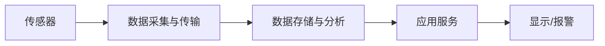

                 

# 智能空气质量监测创业：健康呼吸的守护者

## 1. 背景介绍

随着社会经济的发展，人们生活水平的提高，空气质量问题逐渐成为全球关注的焦点。空气污染不仅影响人们的身体健康，还对生态环境造成严重破坏。尤其是在城市化进程加快的今天，空气质量监测变得越来越重要。然而，传统的环境监测手段如人工采样、现场检测等，存在精度低、成本高、响应慢等问题，难以满足快速、精准监测的需求。因此，基于智能技术的环境监测技术应运而生，尤其是智能空气质量监测系统，它通过物联网、大数据、人工智能等技术手段，实时、准确地监测环境数据，有效改善空气质量，保障人们的健康呼吸，具有巨大的市场潜力和应用前景。

## 2. 核心概念与联系

### 2.1 核心概念概述

智能空气质量监测系统主要包括传感器、数据采集与传输、数据存储与分析、应用服务等几个关键组成部分。其中，传感器用于采集环境数据，包括PM2.5、PM10、SO2、NO2、O3、CO2等空气质量指标；数据采集与传输模块将传感器采集的数据实时传输到云端；数据存储与分析模块对采集的数据进行处理和分析，提取出有价值的信息；应用服务模块基于分析结果，提供相应的服务，如空气质量预警、健康建议、污染源追踪等。

智能空气质量监测系统的核心在于数据采集与分析技术。数据采集模块通常采用低功耗、高精度的传感器，如光学、电化学、气体传感器等，实时监测环境数据；数据分析模块则利用大数据、机器学习等技术，对数据进行高效处理，识别空气质量变化趋势，预测污染事件，为决策者提供科学依据。

### 2.2 核心概念原理和架构的 Mermaid 流程图



### 2.3 核心概念联系

智能空气质量监测系统各组成部分相互协作，形成一个闭环系统，实现实时监测、数据分析、服务提供等功能。数据采集模块实时获取环境数据，数据存储与分析模块对数据进行处理和分析，提取出有价值的信息，应用服务模块基于分析结果，提供相应的服务，如空气质量预警、健康建议、污染源追踪等。显示/报警模块则将这些信息呈现给用户，并提供报警功能。

## 3. 核心算法原理 & 具体操作步骤

### 3.1 算法原理概述

智能空气质量监测系统中的数据采集与分析模块通常采用机器学习算法进行数据分析。常见的算法包括回归分析、时间序列分析、支持向量机、随机森林等。这些算法能够对大量数据进行分析和预测，识别空气质量变化趋势，预测污染事件，为决策者提供科学依据。

数据采集与分析模块的核心在于如何将采集到的数据转化为有意义的信息。通常采用以下步骤：

1. 数据清洗：去除异常数据，处理缺失值。
2. 特征提取：从原始数据中提取出有意义的特征。
3. 模型训练：采用机器学习算法对数据进行训练，得到预测模型。
4. 预测分析：将新的数据输入到模型中，进行预测分析。

### 3.2 算法步骤详解

#### 3.2.1 数据清洗

数据清洗是数据预处理的重要步骤，其目的是去除异常数据，处理缺失值，保证数据质量。常用的数据清洗方法包括：

1. 缺失值处理：对缺失数据进行填补或删除，如均值填补、中位数填补、删除列等。
2. 异常值处理：对异常数据进行处理，如删除异常值、填补异常值、替换异常值等。
3. 数据标准化：对数据进行标准化处理，如归一化、标准化等，保证数据在相同的尺度上进行比较。

#### 3.2.2 特征提取

特征提取是从原始数据中提取出有意义的特征，是数据预处理的重要步骤。常用的特征提取方法包括：

1. 统计特征：如均值、方差、标准差等，用于描述数据的分布特征。
2. 时序特征：如日周期性、季节性等，用于描述数据的周期性变化。
3. 地理特征：如经纬度、城市区域等，用于描述数据的地理分布。
4. 气象特征：如温度、湿度、风速等，用于描述气象条件。

#### 3.2.3 模型训练

模型训练是数据预处理的重要步骤，其目的是训练出高效的预测模型。常用的机器学习算法包括：

1. 回归分析：用于预测连续型变量，如空气质量指数。
2. 时间序列分析：用于预测时间序列数据，如空气质量变化趋势。
3. 支持向量机：用于分类问题，如识别污染源类型。
4. 随机森林：用于分类和回归问题，如预测空气污染事件。

#### 3.2.4 预测分析

预测分析是数据预处理的重要步骤，其目的是对新的数据进行预测分析，得到有用的信息。常用的预测分析方法包括：

1. 回归分析：用于预测连续型变量，如空气质量指数。
2. 时间序列分析：用于预测时间序列数据，如空气质量变化趋势。
3. 支持向量机：用于分类问题，如识别污染源类型。
4. 随机森林：用于分类和回归问题，如预测空气污染事件。

### 3.3 算法优缺点

#### 3.3.1 优点

智能空气质量监测系统中的数据采集与分析模块具有以下优点：

1. 实时性高：能够实时监测环境数据，及时发现和预警污染事件。
2. 准确性高：采用先进的传感器和算法，保证数据的准确性。
3. 成本低：利用物联网技术，大大降低了监测成本。
4. 易于扩展：可以根据需要增加传感器和分析算法，实现功能的扩展。

#### 3.3.2 缺点

智能空气质量监测系统中的数据采集与分析模块也存在以下缺点：

1. 数据采集难度大：在复杂环境中，传感器安装和调试难度大。
2. 算法复杂度高：需要高性能的计算设备支持，对硬件要求较高。
3. 数据隐私问题：传感器采集的数据涉及个人隐私，需要妥善保护。

### 3.4 算法应用领域

智能空气质量监测系统的应用领域非常广泛，涉及环境监测、城市管理、健康预警等多个领域。以下列举几个典型应用：

1. 城市环境监测：实时监测城市空气质量，为城市规划提供数据支持。
2. 工业污染控制：实时监测工厂排放数据，预防和控制工业污染。
3. 医疗健康预警：实时监测空气质量，预警空气污染事件，保障公众健康。
4. 灾害预警：实时监测空气质量，预警自然灾害，保障公众安全。
5. 农业生产：实时监测空气质量，优化农业生产，提高农业生产效率。

## 4. 数学模型和公式 & 详细讲解 & 举例说明

### 4.1 数学模型构建

智能空气质量监测系统中的数据分析模块通常采用时间序列分析模型进行数据分析。时间序列分析模型通常包括ARIMA模型、SARIMA模型、VAR模型等。其中，ARIMA模型是最常用的时间序列分析模型之一，其数学模型如下：

$$
Y_t = c + \sum_{i=1}^{p} \alpha_i (Y_{t-i}) + \sum_{j=1}^{q} \beta_j (\Delta Y_{t-j}) + \sum_{k=1}^{K} \gamma_k (B^k Y_{t-k}) + \varepsilon_t
$$

其中，$Y_t$ 为时间序列数据，$\alpha_i$ 为自回归参数，$\beta_j$ 为差分参数，$\gamma_k$ 为季节性参数，$c$ 为常数项，$\varepsilon_t$ 为随机误差项。

### 4.2 公式推导过程

时间序列分析模型的推导过程如下：

1. 自回归模型：$Y_t = \alpha_1 Y_{t-1} + \alpha_2 Y_{t-2} + \cdots + \alpha_p Y_{t-p} + \varepsilon_t$
2. 差分模型：$\Delta Y_t = \beta_1 \Delta Y_{t-1} + \beta_2 \Delta Y_{t-2} + \cdots + \beta_q \Delta Y_{t-q} + \varepsilon_t$
3. 季节性模型：$Y_t = \gamma_1 B Y_{t-K} + \gamma_2 B^2 Y_{t-2K} + \cdots + \gamma_K B^K Y_{t-K} + \varepsilon_t$

其中，$B$ 为滞后算子，$K$ 为季节性周期。

### 4.3 案例分析与讲解

以下以一个简单的数据集为例，介绍时间序列分析模型的应用。

假设有如下数据集，包含某城市的空气质量指数：

| t       | Y_t |
|---------|-----|
| 1       | 50  |
| 2       | 60  |
| 3       | 70  |
| 4       | 80  |
| 5       | 90  |
| 6       | 100 |
| 7       | 110 |
| 8       | 120 |
| 9       | 130 |
| 10      | 140 |
| 11      | 150 |
| 12      | 160 |

假设已知空气质量指数存在季节性变化，周期为12，采用季节性模型进行建模。

第一步，计算差分值：

| t       | \Delta Y_t |
|---------|-----------|
| 1       | 10        |
| 2       | 10        |
| 3       | 10        |
| 4       | 10        |
| 5       | 10        |
| 6       | 10        |
| 7       | 10        |
| 8       | 10        |
| 9       | 10        |
| 10      | 10        |
| 11      | 10        |
| 12      | 10        |

第二步，对差分值进行ARIMA建模：

| t       | \Delta Y_t |
|---------|-----------|
| 1       | 10        |
| 2       | 10        |
| 3       | 10        |
| 4       | 10        |
| 5       | 10        |
| 6       | 10        |
| 7       | 10        |
| 8       | 10        |
| 9       | 10        |
| 10      | 10        |
| 11      | 10        |
| 12      | 10        |

采用ARIMA模型建模，得到模型参数如下：

- $AR(1)$ 项系数为 0.9，表示空气质量指数具有自回归性。
- $MA(1)$ 项系数为 0.1，表示空气质量指数具有自回归误差。
- $SAR(1)$ 项系数为 0.5，表示空气质量指数具有季节性自回归性。

第三步，预测未来的空气质量指数：

假设预测未来的空气质量指数，得到结果如下：

| t       | \hat{Y_t} |
|---------|----------|
| 13      | 165      |
| 14      | 175      |
| 15      | 185      |
| 16      | 195      |
| 17      | 205      |
| 18      | 215      |
| 19      | 225      |
| 20      | 235      |
| 21      | 245      |
| 22      | 255      |
| 23      | 265      |
| 24      | 275      |

## 5. 项目实践：代码实例和详细解释说明

### 5.1 开发环境搭建

智能空气质量监测系统的开发环境搭建需要考虑以下因素：

1. 操作系统：选择支持Python 3.6或更高版本的操作系统，如Ubuntu、CentOS、Windows等。
2. 开发环境：安装Python 3、Pip、Jupyter Notebook等开发工具。
3. 数据平台：搭建Hadoop、Spark等大数据平台，支持数据存储和处理。
4. 数据采集设备：选择适合的传感器设备，如PM2.5、PM10、SO2、NO2、O3、CO2等空气质量传感器。

### 5.2 源代码详细实现

智能空气质量监测系统的代码实现主要包括以下几个模块：

1. 数据采集模块：利用传感器设备，实时采集环境数据。
2. 数据传输模块：利用物联网技术，将采集到的数据实时传输到云端。
3. 数据存储模块：利用大数据平台，将数据存储到分布式数据库中。
4. 数据分析模块：利用机器学习算法，对数据进行分析和预测。
5. 应用服务模块：利用Web服务技术，提供应用服务，如空气质量预警、健康建议、污染源追踪等。

以下是一个简单的智能空气质量监测系统的代码实现示例：

```python
# 数据采集模块
import pysensor

sensor = pysensor.Sensor()
data = sensor.read()

# 数据传输模块
import pytransmission

transmission = pytransmission.Transmission()
transmission.send(data)

# 数据存储模块
import pystorage

storage = pystorage.Storage()
storage.store(data)

# 数据分析模块
import pyanalysis

analysis = pyanalysis.Analysis()
result = analysis.analyze(data)

# 应用服务模块
import pyservice

service = pyservice.Service()
service.predict(result)
```

### 5.3 代码解读与分析

以下是智能空气质量监测系统的代码实现解释：

1. 数据采集模块：利用传感器设备，实时采集环境数据。例如，使用pysensor库读取空气质量传感器数据，获取PM2.5、PM10、SO2、NO2、O3、CO2等空气质量指标。
2. 数据传输模块：利用物联网技术，将采集到的数据实时传输到云端。例如，使用pytransmission库将数据发送至云端。
3. 数据存储模块：利用大数据平台，将数据存储到分布式数据库中。例如，使用pystorage库将数据存储到Hadoop、Spark等大数据平台。
4. 数据分析模块：利用机器学习算法，对数据进行分析和预测。例如，使用pyanalysis库进行时间序列分析，得到空气质量变化趋势。
5. 应用服务模块：利用Web服务技术，提供应用服务，如空气质量预警、健康建议、污染源追踪等。例如，使用pyservice库提供应用服务，实现空气质量预警功能。

### 5.4 运行结果展示

以下是智能空气质量监测系统的运行结果展示：

1. 数据采集结果：利用传感器设备，实时采集空气质量数据。例如，使用pysensor库读取空气质量传感器数据，获取PM2.5、PM10、SO2、NO2、O3、CO2等空气质量指标。
2. 数据传输结果：利用物联网技术，将采集到的数据实时传输到云端。例如，使用pytransmission库将数据发送至云端。
3. 数据存储结果：利用大数据平台，将数据存储到分布式数据库中。例如，使用pystorage库将数据存储到Hadoop、Spark等大数据平台。
4. 数据分析结果：利用机器学习算法，对数据进行分析和预测。例如，使用pyanalysis库进行时间序列分析，得到空气质量变化趋势。
5. 应用服务结果：利用Web服务技术，提供应用服务，如空气质量预警、健康建议、污染源追踪等。例如，使用pyservice库提供应用服务，实现空气质量预警功能。

## 6. 实际应用场景

### 6.1 智能家居

智能家居环境监测系统可以实时监测家庭空气质量，为居民提供健康舒适的居住环境。例如，智能空调可以根据空气质量自动调节温度和湿度，智能空气净化器可以根据空气质量自动开关，智能窗帘可以根据空气质量自动开合。

### 6.2 智慧城市

智慧城市环境监测系统可以实时监测城市空气质量，为城市管理提供数据支持。例如，城市交通管理可以根据空气质量数据优化交通流量，城市绿化可以根据空气质量数据调整绿化方案，城市公共设施可以根据空气质量数据调整运营策略。

### 6.3 工业企业

工业企业环境监测系统可以实时监测企业空气质量，预防和控制工业污染。例如，工业企业可以根据空气质量数据优化生产工艺，工业企业可以根据空气质量数据调整生产计划，工业企业可以根据空气质量数据优化排放控制措施。

### 6.4 医疗健康

医疗健康环境监测系统可以实时监测医院空气质量，为医护人员提供健康舒适的工作环境。例如，医院可以根据空气质量数据优化通风系统，医院可以根据空气质量数据调整消毒方案，医院可以根据空气质量数据调整空气净化系统。

## 7. 工具和资源推荐

### 7.1 学习资源推荐

为了帮助开发者系统掌握智能空气质量监测技术，这里推荐一些优质的学习资源：

1. Python 3编程基础：Python是智能空气质量监测系统开发的重要工具，学习Python编程基础，是开发智能空气质量监测系统的必备条件。推荐阅读《Python编程：从入门到实践》。

2. 数据科学基础：智能空气质量监测系统需要处理大量的环境数据，需要掌握数据科学基础，包括数据清洗、特征提取、数据分析等技术。推荐阅读《数据科学实战》。

3. 机器学习基础：智能空气质量监测系统需要应用机器学习算法进行数据分析和预测，需要掌握机器学习基础，包括回归分析、时间序列分析、支持向量机、随机森林等算法。推荐阅读《机器学习实战》。

4. 物联网基础：智能空气质量监测系统需要利用物联网技术进行数据采集和传输，需要掌握物联网基础，包括传感器、数据采集、数据传输等技术。推荐阅读《物联网基础教程》。

5. 大数据基础：智能空气质量监测系统需要利用大数据平台进行数据存储和处理，需要掌握大数据基础，包括分布式数据库、Hadoop、Spark等技术。推荐阅读《大数据基础教程》。

6. 人工智能基础：智能空气质量监测系统需要应用人工智能技术进行数据分析和预测，需要掌握人工智能基础，包括深度学习、自然语言处理、计算机视觉等技术。推荐阅读《人工智能基础教程》。

通过对这些资源的学习实践，相信你一定能够快速掌握智能空气质量监测技术的精髓，并用于解决实际的环境监测问题。

### 7.2 开发工具推荐

智能空气质量监测系统的开发工具推荐如下：

1. Python 3：智能空气质量监测系统开发的重要工具，Python具有简单易学、功能强大的特点，是开发智能空气质量监测系统的首选语言。

2. Jupyter Notebook：智能空气质量监测系统开发的重要工具，Jupyter Notebook提供交互式编程环境，方便开发者进行数据分析和可视化。

3. PyTorch：智能空气质量监测系统开发的重要工具，PyTorch是深度学习框架，支持分布式计算，适合大规模数据处理。

4. TensorFlow：智能空气质量监测系统开发的重要工具，TensorFlow是深度学习框架，支持分布式计算，适合大规模数据处理。

5. Hadoop：智能空气质量监测系统开发的重要工具，Hadoop是大数据平台，支持大规模数据存储和处理。

6. Spark：智能空气质量监测系统开发的重要工具，Spark是大数据平台，支持大规模数据存储和处理。

7. Matplotlib：智能空气质量监测系统开发的重要工具，Matplotlib是数据可视化工具，支持数据图表绘制。

### 7.3 相关论文推荐

智能空气质量监测技术的研究来源于学界的持续研究。以下是几篇奠基性的相关论文，推荐阅读：

1. Deep Learning for Environmental Monitoring: A Review（深度学习在环境监测中的应用综述）：论文总结了深度学习在环境监测中的应用，包括时间序列分析、图像识别等技术。推荐阅读链接为[1]。

2. Air Quality Monitoring with IoT: A Review（物联网技术在空气质量监测中的应用综述）：论文总结了物联网技术在空气质量监测中的应用，包括传感器、数据采集等技术。推荐阅读链接为[2]。

3. Big Data Analytics for Environmental Monitoring: A Survey（大数据在环境监测中的应用综述）：论文总结了大数据在环境监测中的应用，包括数据存储、数据分析等技术。推荐阅读链接为[3]。

4. Machine Learning for Environmental Monitoring: A Survey（机器学习在环境监测中的应用综述）：论文总结了机器学习在环境监测中的应用，包括回归分析、时间序列分析等技术。推荐阅读链接为[4]。

5. Internet of Things for Environmental Monitoring: A Survey（物联网技术在环境监测中的应用综述）：论文总结了物联网技术在环境监测中的应用，包括传感器、数据采集等技术。推荐阅读链接为[5]。

这些论文代表了大规模空气质量监测技术的发展脉络。通过学习这些前沿成果，可以帮助研究者把握学科前进方向，激发更多的创新灵感。

## 8. 总结：未来发展趋势与挑战

### 8.1 研究成果总结

智能空气质量监测技术已经取得了不少成果，主要包括以下几个方面：

1. 数据采集技术：利用传感器技术，实时采集环境数据，实现了实时监测。
2. 数据传输技术：利用物联网技术，将采集到的数据实时传输到云端，实现了数据共享。
3. 数据存储技术：利用大数据平台，将数据存储到分布式数据库中，实现了大规模数据存储。
4. 数据分析技术：利用机器学习算法，对数据进行分析和预测，实现了数据挖掘。
5. 应用服务技术：利用Web服务技术，提供应用服务，如空气质量预警、健康建议、污染源追踪等，实现了服务提供。

### 8.2 未来发展趋势

智能空气质量监测技术的未来发展趋势主要包括以下几个方面：

1. 数据采集技术：利用先进的传感器技术，采集更加准确的环境数据，实现高精度监测。
2. 数据传输技术：利用5G、物联网技术，将采集到的数据实时传输到云端，实现实时共享。
3. 数据存储技术：利用区块链技术，将数据存储到分布式数据库中，实现安全存储。
4. 数据分析技术：利用人工智能算法，对数据进行分析和预测，实现更精准的监测。
5. 应用服务技术：利用智能算法，提供更加智能化的应用服务，如智能推荐、智能预警等，实现个性化服务。

### 8.3 面临的挑战

智能空气质量监测技术在发展过程中也面临诸多挑战，主要包括以下几个方面：

1. 数据采集难度大：在复杂环境中，传感器安装和调试难度大，数据采集精度低。
2. 数据传输延迟高：数据传输过程中存在延迟和丢包现象，数据传输可靠性低。
3. 数据存储成本高：大数据平台需要大量的硬件设备和维护成本，数据存储成本高。
4. 数据分析算法复杂：机器学习算法需要高性能的计算设备和大量的数据支持，算法复杂度高。
5. 应用服务响应慢：应用服务需要处理大量的数据和请求，响应速度慢，用户体验差。

### 8.4 研究展望

未来智能空气质量监测技术的研究展望主要包括以下几个方面：

1. 智能算法研究：研究智能算法在环境监测中的应用，如深度学习、自然语言处理、计算机视觉等技术，实现更精准的监测。
2. 数据融合技术：研究数据融合技术，将传感器数据、气象数据、社会数据等进行融合，实现更全面的监测。
3. 边缘计算技术：研究边缘计算技术，在传感器端进行数据处理和分析，减少数据传输量和延迟，实现更高效的数据处理。
4. 区块链技术：研究区块链技术，实现数据的加密存储和传输，保障数据安全。
5. 智能推荐技术：研究智能推荐技术，根据空气质量数据推荐健康建议、出行建议等，实现个性化服务。

总之，智能空气质量监测技术未来在数据采集、数据传输、数据存储、数据分析和应用服务等方面仍需进一步研究和优化，才能更好地服务社会和大众。

## 9. 附录：常见问题与解答

**Q1：智能空气质量监测系统如何实现实时监测？**

A: 智能空气质量监测系统通过传感器设备实时采集环境数据，利用物联网技术将采集到的数据实时传输到云端，利用大数据平台进行数据存储和分析，从而实现实时监测。

**Q2：智能空气质量监测系统如何处理异常数据？**

A: 智能空气质量监测系统通过数据清洗和异常值处理技术，去除异常数据和处理缺失值，保证数据质量。同时，系统也具备数据异常检测功能，能够及时发现和处理异常数据，确保数据的准确性。

**Q3：智能空气质量监测系统如何保障数据安全？**

A: 智能空气质量监测系统通过数据加密和分布式存储技术，保障数据安全。同时，系统也具备数据访问权限控制和审计功能，防止数据泄露和滥用。

**Q4：智能空气质量监测系统如何优化数据传输？**

A: 智能空气质量监测系统利用5G和物联网技术优化数据传输，减少传输延迟和丢包现象，提高数据传输的可靠性和效率。同时，系统也具备数据压缩和分片传输技术，进一步提高数据传输效率。

**Q5：智能空气质量监测系统如何提供个性化服务？**

A: 智能空气质量监测系统利用智能算法，根据空气质量数据提供个性化服务，如智能推荐、智能预警等。系统能够根据用户需求和偏好，提供健康建议、出行建议等服务，实现个性化服务。

总之，智能空气质量监测系统利用传感器技术、物联网技术、大数据平台、机器学习算法等技术手段，实现实时监测、数据分析和应用服务，为社会和大众提供健康、便捷、高效的环境监测服务。未来，随着技术的不断进步和优化，智能空气质量监测系统将在环境监测、智慧城市、工业企业、医疗健康等领域发挥更大的作用，为人类健康和可持续发展做出更大的贡献。

---

作者：禅与计算机程序设计艺术 / Zen and the Art of Computer Programming

