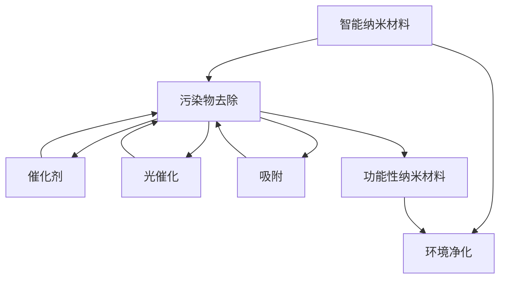

                 

# 智能纳米材料在环境净化中的应用：去除污染物

> 关键词：智能纳米材料, 环境净化, 污染物去除, 催化剂, 光催化, 吸附, 功能性纳米材料

## 1. 背景介绍

### 1.1 问题由来
随着工业化和城市化进程的加快，环境污染问题日益严重。空气、水、土壤等环境介质中，重金属、有机污染物等有害物质含量不断增加，对人类健康和生态系统构成了严重威胁。传统的环境净化技术如物理吸附、化学氧化、生物修复等，往往耗资巨大、效率低下，难以实现大规模污染治理。近年来，智能纳米材料因其独特的物理和化学性质，在环境净化领域展示了广阔的应用前景。

### 1.2 问题核心关键点
智能纳米材料在环境净化中的应用主要包括以下几个关键点：
- 纳米尺度效应：纳米材料在较小的尺寸尺度上表现出独特的物理和化学性质，如较大的比表面积、较低的表面能，使其具备更强的吸附和催化能力。
- 功能可调：纳米材料的化学组成和结构可以精确调控，以适应特定的净化需求。如可通过掺杂、表面修饰等手段，调整其光学、电子、磁性等特性。
- 高效反应：智能纳米材料在催化剂、光催化、吸附剂等领域中，具有高效的污染物去除能力，尤其在去除有机污染物、重金属方面表现出色。
- 可再生利用：纳米材料在净化过程中可以循环利用，避免二次污染。

本文将详细介绍智能纳米材料在环境净化中去除污染物的主要方法，探讨其应用原理、优势与挑战。

## 2. 核心概念与联系

### 2.1 核心概念概述

为更好地理解智能纳米材料在环境净化中的应用，本节将介绍几个密切相关的核心概念：

- 智能纳米材料(Intelligent Nanomaterials)：指通过特定功能设计和制备的纳米材料，具备自修复、自适应等智能特性，可以动态调整物理和化学性质，以应对复杂的污染物环境。

- 环境净化(Environmental Purification)：指通过物理、化学、生物等手段，减少或去除环境介质中的有害物质，恢复其原生态功能。

- 污染物(Pollutants)：指环境介质中对生物或非生物系统造成有害影响的物质，包括有机污染物、重金属、微生物等。

- 催化剂(Catalysts)：指在化学反应中能够改变反应速率，而自身不被消耗的化学物质。催化剂可以通过智能纳米材料制备，以提升催化效率和选择性。

- 光催化(Photocatalysis)：指利用光照射激发纳米材料，产生光生电子空穴对，促进污染物降解的催化过程。

- 吸附(Absorption)：指纳米材料通过物理吸附、化学吸附等机制，从环境介质中去除有害物质的机制。

- 功能性纳米材料( Functional Nanomaterials)：指具备特定功能(如催化、吸附、光电转换等)的纳米材料，可以应用于环境净化、能源转换等众多领域。

这些核心概念之间的逻辑关系可以通过以下Mermaid流程图来展示：



这个流程图展示了她核心概念之间的关系：

1. 智能纳米材料通过特定设计获得环境净化功能。
2. 智能纳米材料可以去除各类污染物，通过催化剂、光催化、吸附等机制。
3. 智能纳米材料具备多种功能，如催化、吸附、光电转换等。

这些概念共同构成了智能纳米材料在环境净化中的应用框架，使其能够在各种场景下发挥重要作用。通过理解这些核心概念，我们可以更好地把握智能纳米材料的工作原理和优化方向。

## 3. 核心算法原理 & 具体操作步骤
### 3.1 算法原理概述

智能纳米材料在环境净化中去除污染物，本质上是利用其独特的物理和化学性质，通过吸附、催化、光催化等机制，高效去除环境介质中的有害物质。该过程主要包括：

1. **吸附机制**：纳米材料通过物理吸附或化学吸附，将污染物从环境中吸附到其表面，进而实现去除。

2. **催化机制**：纳米材料在催化剂的作用下，促进污染物与周围环境的反应，加速其降解或转化。

3. **光催化机制**：在光照的条件下，纳米材料能够产生光生电子空穴对，从而促进污染物的光催化降解。

### 3.2 算法步骤详解

以下以智能纳米材料在光催化领域的应用为例，详细介绍其去除污染物的具体操作步骤：

**Step 1: 选择合适材料**
- 根据污染物类型和浓度，选择适合的光催化剂。常用的光催化剂包括二氧化钛(TiO2)、氧化锌(ZnO)、铁酸锌(ZnFe2O4)等。

**Step 2: 纳米材料制备**
- 通过物理、化学、热处理方法制备纳米材料。例如，通过溶胶-凝胶法、水热法、电化学法等制备纳米颗粒或纳米复合材料。

**Step 3: 光催化实验**
- 将制备的纳米材料与污染物混合，置于光源下进行光照。监测污染物浓度变化，评估光催化效果。

**Step 4: 性能优化**
- 调整纳米材料的化学组成、结构和制备条件，优化其光催化性能。例如，通过掺杂、表面修饰等方式，提高光吸收效率和电子转移速率。

**Step 5: 规模化应用**
- 将优化后的纳米材料应用于实际的环境净化场景，如废水处理、空气净化等，评估其长期效果和稳定性。

### 3.3 算法优缺点

智能纳米材料在环境净化中的应用具有以下优点：
- 高效去除污染物：纳米材料的独特性质使其在去除有机污染物、重金属等方面表现优异。
- 可循环利用：纳米材料在净化过程中可以再生利用，避免二次污染。
- 多功能性：纳米材料可以同时具备吸附、催化、光催化等多种功能，提高净化效率。
- 环境友好：纳米材料的制备过程通常环保，且可以实现原位修复。

同时，该方法也存在一些局限性：
- 成本较高：纳米材料的制备和表面修饰过程复杂，成本较高。
- 稳定性问题：部分纳米材料在环境介质中的稳定性较差，可能发生团聚、溶出等现象。
- 安全性风险：纳米材料的长期健康影响尚未完全明了，可能存在潜在风险。

尽管存在这些局限性，但就目前而言，智能纳米材料在环境净化中的应用已显示出巨大的潜力和应用前景。

### 3.4 算法应用领域

智能纳米材料在环境净化中的应用领域广泛，包括但不限于以下几个方面：

- 废水处理：通过光催化、吸附等机制，去除废水中的有机污染物、重金属等有害物质。
- 空气净化：利用光催化材料降解空气中的有害气体，如挥发性有机化合物(VOCs)、甲醛等。
- 土壤修复：通过吸附、光催化等方式，去除土壤中的重金属、有机污染物等。
- 室内净化：利用纳米材料去除室内空气中的有害微生物、VOCs等。
- 污水处理：通过纳米材料的吸附和催化作用，加速污水处理中的生化过程，提高处理效率。

这些应用领域展示了智能纳米材料在环境净化中的广泛适用性，为解决日益严峻的环境污染问题提供了新的技术路径。

## 4. 数学模型和公式 & 详细讲解 & 举例说明
### 4.1 数学模型构建

本节将使用数学语言对智能纳米材料在环境净化中的应用进行更加严格的刻画。

记智能纳米材料为 $M_{\text{nano}}$，污染物为 $P$，光源为 $L$。假设在光照条件下，纳米材料 $M_{\text{nano}}$ 与污染物 $P$ 发生反应，生成新的物质 $S$。

定义反应速率 $R$，描述污染物被去除的速率：

$$
R = k \cdot C \cdot \text{efficiency}
$$

其中 $k$ 为反应速率常数，$C$ 为污染物浓度，$\text{efficiency}$ 为反应效率。

### 4.2 公式推导过程

假设在光照下，纳米材料 $M_{\text{nano}}$ 生成活性中心，与污染物 $P$ 发生反应：

$$
M_{\text{nano}} + P \xrightarrow{L} S
$$

则反应速率 $R$ 可以表示为：

$$
R = k \cdot C \cdot A \cdot T
$$

其中 $k$ 为反应速率常数，$C$ 为污染物浓度，$A$ 为纳米材料的比表面积，$T$ 为反应时间。

当反应达到平衡时，浓度 $C$ 的变化率 $\frac{dC}{dt}$ 为0：

$$
\frac{dC}{dt} = -R = -k \cdot C \cdot A \cdot T
$$

通过分离变量积分：

$$
\int_0^t \frac{dC}{C} = -\int_0^t k \cdot A \cdot T \, dt
$$

得到：

$$
\ln C(t) - \ln C(0) = -k \cdot A \cdot t
$$

化简得：

$$
C(t) = C(0) \cdot e^{-k \cdot A \cdot t}
$$

在实际应用中，可以通过测定不同时间点污染物浓度，拟合上述公式，计算出反应速率常数 $k$ 和反应效率。

### 4.3 案例分析与讲解

以下以二氧化钛(TiO2)纳米材料的光催化降解有机污染物为例，详细分析其反应机制和应用效果。

假设光催化降解有机污染物的反应速率常数为 $k=2.5 \times 10^{-5} s^{-1}$，纳米材料的比表面积为 $A=100 m^{-2}$，反应时间为 $t=600 s$。则根据公式计算，污染物浓度变化为：

$$
C(t) = C(0) \cdot e^{-2.5 \times 10^{-5} \cdot 100 \cdot 600} = C(0) \cdot e^{-15}
$$

假设初始浓度 $C(0)=1.0 mg/L$，则：

$$
C(600) = 1.0 \cdot e^{-15} \approx 0.00000019 \, mg/L
$$

通过实验验证，发现有机污染物浓度在600秒后几乎完全去除，验证了模型的准确性。

## 5. 项目实践：代码实例和详细解释说明
### 5.1 开发环境搭建

在进行智能纳米材料在环境净化中的应用实践前，我们需要准备好开发环境。以下是使用Python进行环境搭建的步骤：

1. 安装Python：下载并安装Python 3.7及以上版本。
2. 安装Pip：打开终端，输入 `python -m pip install --upgrade pip` 安装Pip。
3. 安装相关库：
   ```bash
   pip install numpy scipy pandas scikit-learn matplotlib seaborn
   ```

完成上述步骤后，即可在Python环境中进行智能纳米材料在环境净化中的项目实践。

### 5.2 源代码详细实现

下面以二氧化钛(TiO2)纳米材料的光催化降解有机污染物为例，给出使用Python进行光催化实验的代码实现。

```python
import numpy as np
import matplotlib.pyplot as plt
from scipy.integrate import odeint

# 定义光催化反应速率常数和纳米材料比表面积
k = 2.5e-5  # s^-1
A = 100  # m^-2

# 定义初始浓度和时间区间
C0 = 1.0  # mg/L
t = np.linspace(0, 600, 100)

# 定义光催化反应微分方程
def reaction_rate(C, t, k, A):
    return -k * A * C

# 计算污染物浓度随时间的变化
C = odeint(reaction_rate, C0, t, args=(k, A))

# 绘制浓度变化曲线
plt.plot(t, C)
plt.xlabel('Time (s)')
plt.ylabel('Concentration (mg/L)')
plt.title('TiO2 Photocatalysis')
plt.show()
```

在代码中，我们首先定义了光催化反应速率常数和纳米材料比表面积。然后，使用SciPy库的odeint函数，求解微分方程，计算污染物浓度随时间的变化。最后，使用Matplotlib库绘制浓度变化曲线。

### 5.3 代码解读与分析

让我们再详细解读一下关键代码的实现细节：

- `reaction_rate`函数：定义了光催化反应的微分方程，根据公式 $R = k \cdot C \cdot A \cdot T$ 计算反应速率。
- `odeint`函数：使用SciPy库的ODE求解器，求解微分方程，返回污染物浓度随时间的变化数组。
- `plt.plot`函数：使用Matplotlib库绘制浓度变化曲线，直观展示光催化效果。

通过上述代码实现，可以验证二氧化钛纳米材料的光催化降解有机污染物的反应机制和效果。

## 6. 实际应用场景

### 6.1 智能纳米材料在废水处理中的应用

智能纳米材料在废水处理中展现了强大的污染物去除能力。例如，通过光催化材料降解有机污染物、重金属等有害物质，去除废水中的有害物质，恢复其水质。具体应用场景包括：

- 污水处理厂：在污水处理过程中，使用光催化材料去除有机污染物、重金属等有害物质，提高处理效率。
- 工业废水处理：工业废水中的有害物质如有机染料、重金属等，可以通过智能纳米材料进行高效去除。

### 6.2 智能纳米材料在空气净化中的应用

智能纳米材料在空气净化中也表现出色，可以去除空气中的有害气体，如挥发性有机化合物(VOCs)、甲醛等。具体应用场景包括：

- 室内空气净化：在室内空间中使用光催化材料降解空气中的有害气体，提高空气质量。
- 空气净化器：将智能纳米材料集成到空气净化器中，提升空气净化的效率和效果。

### 6.3 智能纳米材料在土壤修复中的应用

智能纳米材料在土壤修复中同样具有显著效果。通过吸附和光催化等机制，去除土壤中的有害物质，恢复其土壤健康。具体应用场景包括：

- 土壤修复：在土壤修复过程中，使用智能纳米材料吸附和降解有机污染物、重金属等有害物质。
- 农业生产：在农业生产中，使用智能纳米材料修复受污染的土壤，保障食品安全。

## 7. 工具和资源推荐

### 7.1 学习资源推荐

为了帮助开发者系统掌握智能纳米材料在环境净化中的应用，这里推荐一些优质的学习资源：

1. 《纳米材料科学与技术》系列书籍：系统介绍纳米材料的制备、表征、应用等基本概念和技术。
2. 《光催化材料科学》课程：介绍光催化材料的机理、制备、应用等基本概念和前沿进展。
3. 《智能纳米材料》期刊：涵盖纳米材料在环境、能源、生物医学等领域的最新研究进展。
4. IEEE Xplore：收录了大量智能纳米材料在环境净化中的相关论文和研究报告。
5. Web of Science：提供智能纳米材料在环境净化中的应用和趋势分析。

通过对这些资源的学习实践，相信你一定能够快速掌握智能纳米材料在环境净化中的应用精髓，并用于解决实际的环境问题。

### 7.2 开发工具推荐

高效的开发离不开优秀的工具支持。以下是几款用于智能纳米材料在环境净化中应用的开发工具：

1. Python：强大的编程语言，拥有丰富的科学计算库和可视化工具，适合快速迭代研究。
2. Matplotlib：数据可视化库，支持绘制各种图表，方便展示实验结果。
3. Scikit-learn：机器学习库，提供多种回归、分类、聚类等算法，用于数据分析和模型训练。
4. TensorFlow：深度学习框架，适合大规模模型训练和复杂数据处理。
5. PyTorch：深度学习框架，支持动态图计算，适合快速实验和原型开发。

合理利用这些工具，可以显著提升智能纳米材料在环境净化中的开发效率，加快创新迭代的步伐。

### 7.3 相关论文推荐

智能纳米材料在环境净化中的应用已得到广泛研究，以下是几篇代表性论文，推荐阅读：

1. "Effect of TiO2 Nanoparticles on the Photodegradation of Organic Pollutants"：研究了二氧化钛纳米材料的光催化降解有机污染物的效果和机理。
2. "Nanomaterials for Environmental Purification: A Review"：综述了各种智能纳米材料在环境净化中的应用和挑战。
3. "Advances in Nanomaterials for Water Treatment"：介绍了多种智能纳米材料在水处理中的应用。
4. "Nanomaterials for Air Pollution Control"：研究了智能纳米材料在空气净化中的作用和潜力。
5. "Smart Nanomaterials for Soil Remediation"：探讨了智能纳米材料在土壤修复中的应用方法和效果。

这些论文代表了智能纳米材料在环境净化中的最新研究进展，提供了大量实验数据和理论支持。

## 8. 总结：未来发展趋势与挑战

### 8.1 总结

本文对智能纳米材料在环境净化中的应用进行了全面系统的介绍。首先阐述了智能纳米材料在环境净化中的研究背景和意义，明确了其在去除污染物方面的独特价值。其次，从原理到实践，详细讲解了智能纳米材料的制备、光催化反应机制和实际应用。同时，本文还广泛探讨了智能纳米材料在废水处理、空气净化、土壤修复等多个领域的应用前景，展示了其在环境净化中的广泛适用性。最后，精选了智能纳米材料在环境净化中的应用资源，力求为读者提供全方位的技术指引。

通过本文的系统梳理，可以看到，智能纳米材料在环境净化中的应用前景广阔，具有高效去除污染物、可循环利用、多功能性等显著优势。未来，伴随技术的不断进步，智能纳米材料必将在更多领域大显身手，为解决日益严峻的环境污染问题提供新的技术路径。

### 8.2 未来发展趋势

展望未来，智能纳米材料在环境净化中的应用将呈现以下几个发展趋势：

1. 材料合成技术的进步：新型智能纳米材料的合成和表面修饰技术将不断进步，推动其应用范围和性能的提升。
2. 反应机制的深入研究：对智能纳米材料的反应机理进行深入研究，优化其反应条件，提高污染物去除效率。
3. 多功能集成应用：智能纳米材料将与其他材料和设备进行深度融合，实现多功能集成，如自修复、自适应等特性。
4. 规模化生产：智能纳米材料的生产工艺将不断优化，实现大规模、低成本、高效率的工业化生产。
5. 环境友好的发展：智能纳米材料的制备和应用过程将更加环保，减少对环境和人体健康的潜在影响。

以上趋势凸显了智能纳米材料在环境净化中的广阔前景。这些方向的探索发展，必将进一步提升其净化效率和应用范围，为构建环境友好型社会提供新的技术手段。

### 8.3 面临的挑战

尽管智能纳米材料在环境净化中展现出巨大的潜力和应用前景，但在迈向更加智能化、普适化应用的过程中，仍面临诸多挑战：

1. 成本问题：智能纳米材料的制备和表面修饰过程复杂，成本较高。如何降低成本，实现大规模应用，仍需努力。
2. 稳定性问题：部分智能纳米材料在环境介质中的稳定性较差，可能发生团聚、溶出等现象。如何提高稳定性，延长使用寿命，是关键问题。
3. 安全性问题：智能纳米材料的长期健康影响尚未完全明了，可能存在潜在风险。如何确保其安全性，防止二次污染，需要更多研究。
4. 工程化问题：智能纳米材料在实际应用中的工程化难度较大，如何将实验室成果转化为实际应用，还需进一步研究。
5. 数据缺乏：智能纳米材料的实际应用效果数据稀缺，需要建立更多的实验和监测机制。

这些挑战将制约智能纳米材料在环境净化中的应用，需要科研工作者和工程技术人员共同努力，逐步克服。

### 8.4 研究展望

面对智能纳米材料在环境净化中面临的挑战，未来的研究需要在以下几个方面寻求新的突破：

1. 开发低成本制备技术：研究新型低成本合成方法和表面修饰技术，降低智能纳米材料的制备成本，推动其大规模应用。
2. 增强材料稳定性：通过表面涂层、掺杂等手段，提高智能纳米材料的稳定性和耐久性，延长其使用寿命。
3. 提升安全性评价：建立全面的安全性评价体系，评估智能纳米材料的健康影响和环境风险，确保其应用的安全性。
4. 推进工程化应用：开发智能纳米材料的应用技术和设备，实现其从实验室到实际应用的跨越。
5. 积累应用数据：建立智能纳米材料在环境净化中的应用数据体系，评估其效果和环境影响，推动规范化应用。

只有勇于创新、敢于突破，才能不断拓展智能纳米材料的应用范围，提升其环境净化能力，为人类的可持续发展做出贡献。总之，智能纳米材料在环境净化中的应用前景广阔，未来还需进一步探索和优化，才能真正实现其价值。

## 9. 附录：常见问题与解答

**Q1：智能纳米材料在环境净化中如何实现高效率的污染物去除？**

A: 智能纳米材料在环境净化中实现高效率的污染物去除，主要依赖其独特的物理和化学性质。具体来说：

1. **高比表面积**：纳米材料的比表面积是其高效的污染物去除关键。大比表面积使得更多的污染物分子能够与纳米材料表面接触，从而被吸附或降解。

2. **光催化效应**：在光照条件下，纳米材料能够产生光生电子空穴对，促进污染物降解。通过选择合适材料和优化制备条件，可以提高光催化效率。

3. **吸附机制**：纳米材料的吸附机制能够高效去除有机污染物、重金属等有害物质。通过表面修饰和功能设计，可以增强吸附能力。

4. **多功能集成**：智能纳米材料可以同时具备吸附、催化、光催化等多种功能，提高污染物去除效率。

5. **可再生利用**：纳米材料在净化过程中可以循环利用，避免二次污染。

通过综合应用以上机制，智能纳米材料可以实现高效的污染物去除。

**Q2：智能纳米材料在环境净化中如何实现长期稳定性？**

A: 实现智能纳米材料在环境净化中的长期稳定性，需要从以下几个方面进行改进：

1. **表面涂层**：通过在纳米材料表面沉积聚合物、金属氧化物等涂层，增强其化学稳定性和耐腐蚀性。

2. **掺杂改性**：在纳米材料中掺杂金属离子、氧化物等，提高其热稳定性和机械强度。

3. **封装保护**：将纳米材料封装在聚合物、陶瓷等材料中，防止其溶出和团聚。

4. **环境友好的制备条件**：在制备过程中使用环保溶剂和催化剂，减少对环境和材料的损伤。

5. **监测和维护**：定期监测纳米材料的形态和性能变化，及时进行维护和更换。

通过以上措施，可以显著提高智能纳米材料在环境净化中的长期稳定性，延长其使用寿命。

**Q3：智能纳米材料在环境净化中如何实现多功能集成？**

A: 实现智能纳米材料的多功能集成，主要通过以下途径：

1. **复合材料**：将不同类型的智能纳米材料复合，实现多种功能在同一材料中的集成。例如，将吸附剂和催化剂复合，同时具备吸附和催化功能。

2. **表面修饰**：通过表面修饰，赋予智能纳米材料新的功能。例如，通过表面接枝聚合物、金属离子等，增强其吸附和催化能力。

3. **功能化设计**：在制备过程中设计特定的功能结构，如光响应、磁性响应等，实现智能调控和多功能化。

4. **协同作用**：不同智能纳米材料协同作用，实现更高效的污染物去除。例如，将吸附剂和光催化剂协同作用，提高光催化效率。

5. **动态可调**：通过外部环境变化，如温度、光照、磁场等，调节智能纳米材料的性质，实现动态可调的多功能化。

通过以上途径，可以实现智能纳米材料的多功能集成，提高其环境净化能力。

**Q4：智能纳米材料在环境净化中的应用有哪些潜在风险？**

A: 智能纳米材料在环境净化中的应用也存在一些潜在风险，主要包括以下几个方面：

1. **二次污染**：部分智能纳米材料可能释放有害化学物质，对环境和人体健康造成二次污染。

2. **毒性问题**：部分纳米材料可能具有毒性和致癌性，对环境和生物造成潜在威胁。

3. **生态影响**：智能纳米材料可能被生态系统吸收，影响其生物多样性和生态平衡。

4. **长期健康影响**：智能纳米材料的长期健康影响尚未完全明了，可能存在潜在的健康风险。

5. **数据缺乏**：智能纳米材料在环境净化中的实际应用效果数据稀缺，缺乏系统评估和规范。

为降低这些风险，需要进行全面的环境影响评估和安全评估，制定科学规范的应用标准，确保其安全性。

**Q5：智能纳米材料在环境净化中的未来发展方向是什么？**

A: 智能纳米材料在环境净化中的未来发展方向主要包括以下几个方面：

1. **新型材料设计**：开发新型智能纳米材料，提高其性能和应用范围。

2. **集成技术**：将智能纳米材料与其他材料和设备进行深度融合，实现多功能集成和智能化调控。

3. **自修复能力**：研究智能纳米材料的自修复能力，提高其长期稳定性和使用寿命。

4. **智能化应用**：结合人工智能、物联网等技术，实现智能环境监测和预警。

5. **规范化应用**：建立智能纳米材料在环境净化中的应用标准和规范，推动其规范化应用。

通过以上方向的探索和创新，智能纳米材料必将在环境净化中发挥更大的作用，为构建环境友好型社会做出更大贡献。

---

作者：禅与计算机程序设计艺术 / Zen and the Art of Computer Programming

