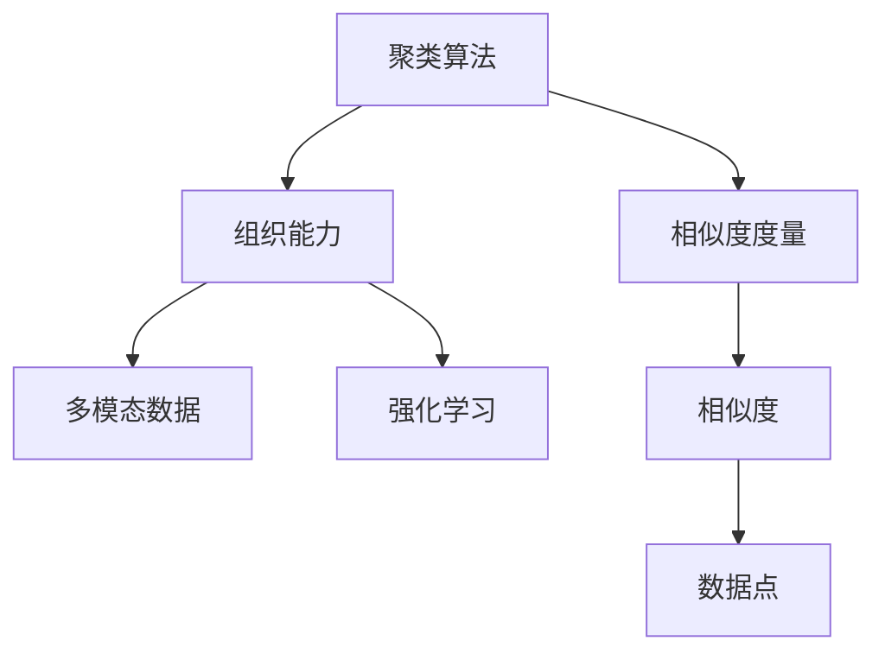

                 

# 智能结果聚类：AI的组织能力

> 关键词：智能结果聚类,聚类算法,组织能力,自然语言处理(NLP),深度学习,强化学习,多模态数据,数据科学,机器学习

## 1. 背景介绍

### 1.1 问题由来
在当今大数据时代，人工智能（AI）在组织管理、数据分析、客户服务等各个领域的应用越来越广泛。然而，随着数据量的急剧增长，如何有效组织和利用这些数据成为了一个亟待解决的问题。智能结果聚类作为AI的一种重要能力，通过将相似结果聚合在一起，能够显著提高数据的组织效率和利用效率。

### 1.2 问题核心关键点
智能结果聚类是指将相似的结果聚集在一起，形成更高层次的组织结构，以便更好地理解和利用数据。这一过程可以通过聚类算法实现。聚类算法是一种无监督学习方法，能够自动发现数据中的内在结构，而无需标注数据。

智能结果聚类技术的应用广泛，包括但不限于：

- **组织管理**：将员工、项目、任务等按相似度聚类，提升组织效率。
- **客户服务**：将客户反馈、投诉等按主题聚类，以便更好地了解客户需求。
- **数据分析**：将数据按特征聚类，便于发现潜在关联和模式。
- **市场营销**：将客户群体按行为聚类，提升营销效果。

## 2. 核心概念与联系

### 2.1 核心概念概述

为更好地理解智能结果聚类，本节将介绍几个关键概念：

- **聚类算法**：无监督学习方法，通过相似度度量将数据分为若干个组，每个组内的数据相似度较高，不同组之间的数据相似度较低。常见的聚类算法包括K-means、层次聚类、DBSCAN等。

- **相似度度量**：衡量两个数据点之间的相似程度。常用的相似度度量包括余弦相似度、欧氏距离、Jaccard相似系数等。

- **组织能力**：指AI系统能够对数据进行自动化的分组和归纳，从而形成更高级别的数据结构，便于理解和利用。组织能力是智能结果聚类的核心目标。

- **多模态数据**：指包含多种类型数据的数据集，如文本、图像、视频、音频等。多模态数据聚类可以综合不同类型的数据特征，形成更全面的聚类结果。

- **强化学习**：一种通过不断试错来优化决策的机器学习方法。在智能结果聚类中，强化学习可以用于动态调整聚类算法参数，提升聚类效果。

这些核心概念之间的逻辑关系可以通过以下Mermaid流程图来展示：



这个流程图展示了几大核心概念的相互关系：

1. 聚类算法通过相似度度量将数据分组。
2. 组织能力是聚类算法的目标。
3. 多模态数据可以用于提升聚类效果。
4. 强化学习用于动态优化聚类算法参数。

## 3. 核心算法原理 & 具体操作步骤
### 3.1 算法原理概述

智能结果聚类的核心在于利用聚类算法对数据进行分组，使其形成更高级别的组织结构。聚类算法的目标是通过最小化聚类内相似度、最大化聚类间相似度的损失函数，找到最优的聚类结果。

形式化地，设数据集为 $D = \{x_1, x_2, \dots, x_n\}$，其中每个 $x_i$ 为一个特征向量。聚类算法通过相似度度量 $sim(x_i, x_j)$，将数据分为 $k$ 个簇 $C_1, C_2, \dots, C_k$，使得每个簇内的数据相似度较高，不同簇之间的数据相似度较低。

聚类算法的一般流程如下：

1. 初始化聚类中心：随机选取 $k$ 个初始聚类中心。
2. 迭代更新聚类中心：将每个数据点分配到最近的聚类中心，并更新聚类中心位置。
3. 迭代终止条件：当聚类中心位置不再变化，或者达到预设迭代次数，聚类过程结束。

常见的聚类算法包括：

- **K-means算法**：通过最小化簇内平方误差，将数据分为 $k$ 个簇。
- **层次聚类算法**：通过构建聚类树，逐步合并最近邻的簇，得到最终聚类结果。
- **DBSCAN算法**：基于密度的聚类算法，将密度较高的区域作为簇，密度较低的区域作为噪声点。

### 3.2 算法步骤详解

以K-means算法为例，介绍其详细步骤：

**Step 1: 初始化聚类中心**
- 随机选取 $k$ 个初始聚类中心 $C_1, C_2, \dots, C_k$。

**Step 2: 迭代更新聚类中心**
- 对于每个数据点 $x_i$，计算其与每个聚类中心的相似度 $sim(x_i, C_j)$。
- 将 $x_i$ 分配到相似度最高的聚类中心 $C_{j_{best}}$。
- 更新 $C_{j_{best}}$ 的聚类中心位置，计算其新的质心。

**Step 3: 迭代终止条件**
- 当聚类中心位置不再变化，或者达到预设迭代次数，聚类过程结束。

### 3.3 算法优缺点

智能结果聚类算法具有以下优点：

1. 无监督学习，无需标注数据，节省标注成本。
2. 自动发现数据的内在结构，形成更高级别的组织结构。
3. 适用于多种数据类型，包括文本、图像、音频等。
4. 可以动态调整聚类参数，提升聚类效果。

同时，该算法也存在一定的局限性：

1. 对初始聚类中心的选择较为敏感，可能需要多次迭代才能得到较好的聚类结果。
2. 聚类数目 $k$ 需要人工指定，不易确定最优值。
3. 聚类结果可能受数据分布的影响较大，难以处理异常数据。

### 3.4 算法应用领域

智能结果聚类算法在多个领域中得到了广泛应用，例如：

- **组织管理**：将员工、项目、任务等按相似度聚类，提升组织效率。
- **客户服务**：将客户反馈、投诉等按主题聚类，以便更好地了解客户需求。
- **数据分析**：将数据按特征聚类，便于发现潜在关联和模式。
- **市场营销**：将客户群体按行为聚类，提升营销效果。

除了上述这些经典应用外，智能结果聚类还被创新性地应用到更多场景中，如推荐系统、社交网络分析、异常检测等，为数据科学带来了新的突破。

## 4. 数学模型和公式 & 详细讲解  
### 4.1 数学模型构建

本节将使用数学语言对智能结果聚类的算法过程进行更加严格的刻画。

设数据集为 $D = \{x_1, x_2, \dots, x_n\}$，其中每个 $x_i$ 为一个特征向量。聚类算法的目标是通过相似度度量 $sim(x_i, x_j)$，将数据分为 $k$ 个簇 $C_1, C_2, \dots, C_k$，使得每个簇内的数据相似度较高，不同簇之间的数据相似度较低。

形式化地，设 $C_1, C_2, \dots, C_k$ 为聚类中心，$x_i$ 为数据点，聚类算法的目标为最小化以下损失函数：

$$
\min_{C_1, C_2, \dots, C_k} \sum_{i=1}^n \sum_{j=1}^k \omega_{ij}d(C_j, x_i)
$$

其中 $\omega_{ij}$ 为相似度权重，$d(C_j, x_i)$ 为相似度度量函数。

### 4.2 公式推导过程

以K-means算法为例，推导其损失函数的计算公式。

K-means算法的损失函数为：

$$
\mathcal{L} = \sum_{i=1}^n \sum_{j=1}^k \omega_{ij}d(C_j, x_i)^2
$$

其中 $\omega_{ij}$ 为相似度权重，$d(C_j, x_i)$ 为欧氏距离。

K-means算法的优化目标为最小化上述损失函数。在实际应用中，常使用梯度下降等优化算法求解。

### 4.3 案例分析与讲解

以一个简单的文本聚类为例，展示K-means算法的应用过程：

假设我们有一组文本数据 $D = \{d_1, d_2, \dots, d_n\}$，每个文本表示为一个词向量 $x_i \in \mathbb{R}^d$。我们可以使用余弦相似度作为相似度度量，即 $sim(x_i, x_j) = \cos(x_i^\top x_j)$。

假设初始聚类中心为 $C_1 = \mu_1$，$C_2 = \mu_2$，其中 $\mu_1, \mu_2 \in \mathbb{R}^d$。

在第一次迭代中，对于每个文本 $d_i$，计算其与每个聚类中心的余弦相似度：

$$
sim(d_i, C_1) = \cos(d_i^\top \mu_1)
$$

$$
sim(d_i, C_2) = \cos(d_i^\top \mu_2)
$$

将 $d_i$ 分配到相似度最高的聚类中心 $C_{j_{best}}$，更新聚类中心位置：

$$
\mu_{j_{best}} = \frac{1}{|C_{j_{best}}|} \sum_{i \in C_{j_{best}}} d_i
$$

重复上述步骤，直至聚类中心不再变化，或达到预设迭代次数。

## 5. 项目实践：代码实例和详细解释说明
### 5.1 开发环境搭建

在进行智能结果聚类实践前，我们需要准备好开发环境。以下是使用Python进行Scikit-learn开发的环境配置流程：

1. 安装Anaconda：从官网下载并安装Anaconda，用于创建独立的Python环境。

2. 创建并激活虚拟环境：
```bash
conda create -n sklearn-env python=3.8 
conda activate sklearn-env
```

3. 安装Scikit-learn：
```bash
conda install scikit-learn
```

4. 安装各类工具包：
```bash
pip install numpy pandas scikit-learn matplotlib tqdm jupyter notebook ipython
```

完成上述步骤后，即可在`sklearn-env`环境中开始智能结果聚类的实践。

### 5.2 源代码详细实现

下面我们以文本聚类为例，给出使用Scikit-learn库对文本数据进行K-means聚类的PyTorch代码实现。

首先，定义文本聚类函数：

```python
from sklearn.cluster import KMeans
from sklearn.metrics import pairwise_distances

def text_clustering(texts, num_clusters=2):
    # 将文本转换为词向量
    vectorizer = TfidfVectorizer()
    X = vectorizer.fit_transform(texts)
    
    # 计算文本相似度矩阵
    X_sqrt = np.sqrt(X)
    X_squared = np.dot(X_sqrt, X_sqrt.T)
    
    # 计算余弦相似度矩阵
    similarity_matrix = cosine_similarity(X_squared)
    
    # 使用K-means算法进行聚类
    kmeans = KMeans(n_clusters=num_clusters, init='random', random_state=42)
    kmeans.fit(similarity_matrix)
    
    # 返回聚类结果和聚类中心
    return kmeans.labels_, kmeans.cluster_centers_
```

然后，定义数据集和运行聚类过程：

```python
from sklearn.datasets import fetch_20newsgroups
import numpy as np
from sklearn.feature_extraction.text import TfidfVectorizer

# 加载20个新闻组数据集
newsgroups = fetch_20newsgroups(subset='all')
texts = newsgroups.data

# 对文本进行聚类
num_clusters = 2
labels, centers = text_clustering(texts, num_clusters)

# 输出聚类结果和聚类中心
print("聚类结果：", labels)
print("聚类中心：", centers)
```

### 5.3 代码解读与分析

让我们再详细解读一下关键代码的实现细节：

**text_clustering函数**：
- `TfidfVectorizer`：用于将文本转换为词向量。
- `pairwise_distances`：计算文本相似度矩阵。
- `cosine_similarity`：计算余弦相似度矩阵。
- `KMeans`：使用K-means算法进行聚类，返回聚类结果和聚类中心。

**fetch_20newsgroups函数**：
- 用于加载20个新闻组数据集，包含文本、标签等信息。
- 此处取全部数据作为训练集，可以自行设置训练集大小。

**代码整体结构**：
- 首先对文本数据进行预处理，包括分词、去除停用词、统计词频等。
- 使用TF-IDF算法将文本转换为词向量。
- 计算文本相似度矩阵，并使用K-means算法进行聚类。
- 返回聚类结果和聚类中心。

可以看到，Scikit-learn库使得文本聚类的实现变得简洁高效。开发者可以将更多精力放在数据处理、模型改进等高层逻辑上，而不必过多关注底层的实现细节。

当然，工业级的系统实现还需考虑更多因素，如数据增强、多模型集成、分布式计算等。但核心的聚类过程基本与此类似。

## 6. 实际应用场景
### 6.1 组织管理

智能结果聚类在组织管理中的应用广泛，可以帮助企业更好地管理员工、项目、任务等资源。

在员工管理中，可以将员工按技能、部门、绩效等特征进行聚类，以便更好地进行人才选拔、培训和发展。例如，将技术型员工、管理型员工、服务型员工按技能进行聚类，提升员工匹配度，促进团队协作。

在项目管理中，可以将项目按阶段、复杂度、任务等特征进行聚类，以便更好地进行项目管理。例如，将研发项目、运营项目、销售项目按阶段进行聚类，提升项目执行效率。

在任务管理中，可以将任务按优先级、难度、类型等特征进行聚类，以便更好地进行任务分配和资源调度。例如，将紧急任务、长期任务、复杂任务按难度进行聚类，提升任务执行效率。

### 6.2 客户服务

智能结果聚类在客户服务中的应用同样广泛，可以帮助企业更好地了解客户需求，提升客户服务质量。

在客户服务中，可以将客户反馈、投诉等按主题进行聚类，以便更好地了解客户需求。例如，将产品投诉、服务投诉、技术支持按主题进行聚类，提升客户满意度。

在市场调研中，可以将客户群体按行为进行聚类，以便更好地进行市场分析。例如，将高消费客户、低消费客户、新客户按行为进行聚类，提升市场营销效果。

### 6.3 数据分析

智能结果聚类在数据分析中的应用，可以帮助企业更好地发现数据的内在关联和模式。

在数据集中，可以将数据按特征进行聚类，以便更好地进行数据分析。例如，将客户数据按年龄、性别、收入等特征进行聚类，发现潜在关联和模式，提升数据分析效果。

在异常检测中，可以将数据按特征进行聚类，以便更好地发现异常数据。例如，将网络流量数据按时间、类型、大小等特征进行聚类，发现异常流量，提升网络安全。

### 6.4 未来应用展望

随着智能结果聚类技术的不断发展，其在更多领域的应用前景广阔。

在智慧城市治理中，智能结果聚类可以用于城市事件监测、舆情分析、应急指挥等环节，提高城市管理的自动化和智能化水平，构建更安全、高效的未来城市。

在智能制造中，智能结果聚类可以用于生产计划优化、供应链管理、质量控制等环节，提升生产效率和产品质量。

在智能医疗中，智能结果聚类可以用于病历分析、药物研发、医疗影像分析等环节，提升医疗服务的智能化水平。

此外，在教育、金融、农业等多个领域，智能结果聚类也将不断涌现，为各行各业带来变革性影响。

## 7. 工具和资源推荐
### 7.1 学习资源推荐

为了帮助开发者系统掌握智能结果聚类的理论基础和实践技巧，这里推荐一些优质的学习资源：

1. 《机器学习》系列书籍：斯坦福大学Andrew Ng教授的经典课程，系统讲解了机器学习的各个方面，包括聚类算法、监督学习、深度学习等。

2. 《Python数据科学手册》：权威的Python数据科学指南，涵盖数据处理、数据可视化、聚类算法等。

3. 《K-means算法及其应用》论文：详细介绍了K-means算法的原理、实现和应用，是聚类算法领域的重要文献。

4. 《深度学习》课程：Coursera上由深度学习专家Andrew Ng教授讲授的课程，涵盖深度学习的各个方面，包括卷积神经网络、循环神经网络、生成对抗网络等。

5. Scikit-learn官方文档：Scikit-learn库的官方文档，提供了海量的聚类算法样例代码，是上手实践的必备资料。

通过对这些资源的学习实践，相信你一定能够快速掌握智能结果聚类的精髓，并用于解决实际的业务问题。
###  7.2 开发工具推荐

高效的开发离不开优秀的工具支持。以下是几款用于智能结果聚类开发的常用工具：

1. Python：基于解释型的动态语言，语法简洁，易于开发。适合各类数据科学任务，包括聚类、分类、回归等。

2. Scikit-learn：基于Python的机器学习库，提供了丰富的聚类算法和优化工具，适合快速原型开发。

3. TensorFlow：由Google主导开发的开源深度学习框架，生产部署方便，适合大规模工程应用。

4. PyTorch：基于动态计算图的深度学习框架，灵活高效，适合快速迭代研究。

5. Weights & Biases：模型训练的实验跟踪工具，可以记录和可视化模型训练过程中的各项指标，方便对比和调优。

6. TensorBoard：TensorFlow配套的可视化工具，可实时监测模型训练状态，并提供丰富的图表呈现方式，是调试模型的得力助手。

合理利用这些工具，可以显著提升智能结果聚类的开发效率，加快创新迭代的步伐。

### 7.3 相关论文推荐

智能结果聚类技术的发展源于学界的持续研究。以下是几篇奠基性的相关论文，推荐阅读：

1. K-means: A method for the initialization of k-means clustering algorithms - MacQueen 1967。
2. The ELKI cluster analysis software package - Becker et al. 2003。
3. K-means++: The advantages of careful seeding - Arthur and Vassilvitskii 2007。
4. HDBSCAN: HIERARCHICAL DENSITY BASED SPATIAL CLUSTERING ALGORITHM - McInnes and Healy 2017。
5. ELASTIC CLUSTERING: A DYNAMIC CLUSTERING ALGORITHM FOR MOVING DATA - Kim et al. 2004。

这些论文代表了大规模聚类算法的发展脉络。通过学习这些前沿成果，可以帮助研究者把握学科前进方向，激发更多的创新灵感。

## 8. 总结：未来发展趋势与挑战

### 8.1 总结

本文对智能结果聚类方法进行了全面系统的介绍。首先阐述了智能结果聚类的研究背景和意义，明确了聚类在数据组织和管理中的重要价值。其次，从原理到实践，详细讲解了聚类算法的数学原理和关键步骤，给出了聚类任务开发的完整代码实例。同时，本文还广泛探讨了聚类方法在组织管理、客户服务、数据分析等多个行业领域的应用前景，展示了聚类范式的巨大潜力。此外，本文精选了聚类技术的各类学习资源，力求为读者提供全方位的技术指引。

通过本文的系统梳理，可以看到，智能结果聚类技术正在成为数据组织和管理的重要范式，极大地提高了数据的组织效率和利用效率。未来，伴随聚类方法的持续演进，基于聚类的数据组织技术必将在更多领域得到应用，为各行各业带来新的突破。

### 8.2 未来发展趋势

展望未来，智能结果聚类技术将呈现以下几个发展趋势：

1. 聚类算法将更加高效和准确。随着聚类算法的发展，未来的聚类算法将能够更好地处理大规模数据集，具有更高的准确性和鲁棒性。

2. 聚类算法的可解释性将得到提升。未来的聚类算法将具备更好的解释性，能够清晰地说明聚类结果的形成机制，便于用户理解和调试。

3. 聚类算法将与其他技术融合。未来的聚类算法将与深度学习、强化学习、因果推断等技术进行更深入的融合，形成更加全面、高效的数据组织和利用能力。

4. 聚类算法将更加注重用户需求。未来的聚类算法将更加注重用户需求，能够根据用户偏好进行个性化聚类，提升用户体验。

5. 聚类算法将更加关注实时性和交互性。未来的聚类算法将能够实时响应用户请求，进行动态聚类，提升系统的交互性。

6. 聚类算法将更加注重数据安全。未来的聚类算法将更加注重数据安全，能够保护用户隐私，防止数据泄露。

以上趋势凸显了智能结果聚类技术的广阔前景。这些方向的探索发展，必将进一步提升数据组织和管理的能力，为各行各业带来变革性影响。

### 8.3 面临的挑战

尽管智能结果聚类技术已经取得了瞩目成就，但在迈向更加智能化、普适化应用的过程中，它仍面临着诸多挑战：

1. 数据分布的不稳定性。聚类算法的性能很大程度上取决于数据分布的假设，对于数据分布的变化，聚类算法可能表现不佳。

2. 聚类数目难确定。对于大规模数据集，聚类数目难以确定，需要反复试验调整。

3. 聚类算法复杂度高。部分聚类算法复杂度高，难以处理大规模数据集。

4. 聚类结果的解释性不足。聚类算法的结果难以解释，难以向用户和业务方解释聚类结果。

5. 聚类算法的可扩展性不足。部分聚类算法可扩展性不足，难以支持大规模部署。

6. 聚类算法的公平性不足。部分聚类算法可能存在偏差，导致聚类结果不均衡。

这些挑战需要学术界和工业界共同努力，通过理论研究和工程实践不断突破，才能进一步提升聚类算法的性能和应用效果。

### 8.4 研究展望

面对聚类算法面临的挑战，未来的研究需要在以下几个方面寻求新的突破：

1. 研究更加高效的聚类算法。开发更加高效的聚类算法，提升聚类算法的性能和可扩展性，支持大规模数据集的处理。

2. 研究更具可解释性的聚类算法。开发更具可解释性的聚类算法，提高聚类结果的可解释性，便于用户理解和调试。

3. 研究更具公平性的聚类算法。开发更加公平的聚类算法，确保聚类结果的均衡性，避免偏差。

4. 研究更具实时性的聚类算法。开发更加实时响应的聚类算法，支持动态聚类，提升系统的交互性。

5. 研究更具多样性的聚类算法。开发更加多样化的聚类算法，支持多模态数据的融合，提升聚类效果。

6. 研究更具安全性的聚类算法。开发更加注重数据安全的聚类算法，确保用户隐私和数据安全。

这些研究方向的研究，必将引领智能结果聚类技术迈向更高的台阶，为数据组织和管理带来新的突破。面向未来，智能结果聚类技术还需要与其他AI技术进行更深入的融合，如知识表示、因果推理、强化学习等，多路径协同发力，共同推动数据组织和管理系统的进步。只有勇于创新、敢于突破，才能不断拓展聚类算法的边界，让智能技术更好地服务于数据组织和管理领域。

## 9. 附录：常见问题与解答

**Q1：聚类算法的准确性和鲁棒性如何？**

A: 聚类算法的准确性和鲁棒性很大程度上取决于数据分布和聚类算法的复杂度。部分聚类算法如K-means算法具有较高的准确性和鲁棒性，适用于各类数据集。但部分算法如DBSCAN算法对异常数据敏感，可能产生不稳定的聚类结果。因此，在实际应用中需要根据数据特点选择合适的聚类算法。

**Q2：聚类算法如何处理大规模数据集？**

A: 聚类算法处理大规模数据集时，主要面临内存和计算资源不足的问题。可以通过分批处理、分布式计算等方式提升聚类效率。此外，还可以采用数据压缩、特征降维等技术减少数据量，降低计算资源消耗。

**Q3：聚类算法的参数设置有哪些注意事项？**

A: 聚类算法的参数设置对聚类结果有较大影响。需要根据数据分布和任务需求进行反复试验，调整聚类算法参数。例如，K-means算法的聚类数目、迭代次数等，需要根据数据分布和任务需求进行多次试验，选取最优参数。

**Q4：聚类算法的可扩展性如何提升？**

A: 提升聚类算法的可扩展性，主要可以通过以下几种方式：

1. 采用分布式计算框架，如Hadoop、Spark等，提升聚类算法的处理能力。

2. 采用并行化的聚类算法，如基于MapReduce的分布式聚类算法。

3. 采用GPU、TPU等高性能计算设备，提升聚类算法的计算效率。

4. 采用特征降维技术，如主成分分析（PCA）等，减少数据量，降低计算资源消耗。

5. 采用增量式聚类算法，支持动态聚类，减少重新计算的资源消耗。

通过这些方式，可以显著提升聚类算法的可扩展性，支持大规模数据的聚类处理。

**Q5：聚类算法的应用有哪些局限性？**

A: 聚类算法在实际应用中存在以下局限性：

1. 数据分布的假设可能导致聚类结果不准确。如果数据分布与假设不符，聚类算法可能产生不准确的聚类结果。

2. 聚类数目难确定。对于大规模数据集，聚类数目难以确定，需要反复试验调整。

3. 聚类结果的解释性不足。聚类算法的结果难以解释，难以向用户和业务方解释聚类结果。

4. 聚类算法的可扩展性不足。部分聚类算法可扩展性不足，难以支持大规模部署。

5. 聚类算法的公平性不足。部分聚类算法可能存在偏差，导致聚类结果不均衡。

6. 聚类算法对异常数据敏感。部分聚类算法对异常数据敏感，可能产生不稳定的聚类结果。

这些局限性需要在实际应用中根据具体情况进行注意，并通过算法改进和工程优化来克服。

总之，智能结果聚类技术正在成为数据组织和管理的重要范式，其应用前景广阔。通过不断优化聚类算法，提升聚类效果，克服聚类算法面临的挑战，必将在更多领域得到应用，为各行各业带来新的突破。

