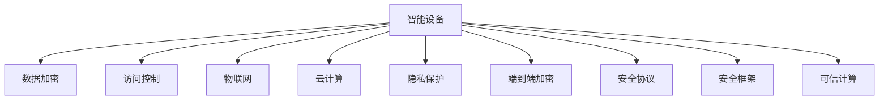

                 

# 智能设备安全：保护个人信息

> 关键词：智能设备, 隐私保护, 数据安全, 信息加密, 访问控制, 物联网(IoT), 云计算

## 1. 背景介绍

### 1.1 问题由来

在数字化和智能化的浪潮中，智能设备（Smart Devices）如智能家居、智能穿戴设备、智能手机、智能电视等迅速普及。这些设备不仅提升了生活质量，还带来了前所未有的便利性和效率。然而，智能设备同样面临安全威胁，用户的个人信息和个人隐私面临巨大风险。诸如设备漏洞、网络钓鱼、恶意软件、数据泄漏等问题日益突出，严重威胁用户的隐私安全。

### 1.2 问题核心关键点

智能设备的安全问题主要体现在以下几个方面：

1. **数据泄漏**：智能设备采集的各类敏感数据，如位置信息、通话记录、浏览习惯等，可能被未经授权的第三方获取，造成隐私泄露。

2. **设备漏洞**：智能设备往往存在软件漏洞或设计缺陷，容易被黑客利用攻击，导致设备被远程控制或数据被窃取。

3. **网络攻击**：智能设备通过无线网络进行通信，容易受到中间人攻击、钓鱼攻击等，导致用户信息被截获或篡改。

4. **数据存储安全**：智能设备上的数据存储往往缺乏必要的加密保护，容易被物理或电子窃取。

5. **远程控制风险**：远程控制功能为智能设备带来便利，但也可能被恶意用户利用，进行远程监视或控制。

6. **跨设备安全**：智能设备通常需要与云平台和服务器进行数据交换，数据在传输和存储过程中存在被截获或篡改的风险。

### 1.3 问题研究意义

研究智能设备的安全问题，对于保护用户个人信息、保障网络空间安全、提升用户对智能设备的信任度具有重要意义。有效的安全保护措施不仅能防范潜在的攻击，还能增强用户对智能设备的使用信心，推动智能设备的普及和应用。

## 2. 核心概念与联系

### 2.1 核心概念概述

为更好地理解智能设备的安全机制，本节将介绍几个核心概念：

- **智能设备(Smart Devices)**：指通过无线网络或蓝牙等短距离通信方式，与互联网连接的各类设备，如智能家居设备、智能手机、可穿戴设备等。

- **数据加密(Data Encryption)**：指对数据进行加密处理，防止未经授权的第三方获取或篡改数据内容。

- **访问控制(Access Control)**：指对智能设备进行身份认证和权限管理，确保只有授权用户或设备能够访问和操作设备。

- **物联网(IoT)**：指通过互联网将各类智能设备连接起来的生态系统，涉及设备间的通信和数据共享。

- **云计算(Cloud Computing)**：指通过网络将数据和计算资源集中到云端，提供按需服务。

- **隐私保护(Privacy Protection)**：指在数据采集、传输、存储和使用过程中，采取措施保护用户的个人信息和个人隐私。

- **端到端加密(End-to-End Encryption)**：指在智能设备之间或智能设备与云平台之间的通信过程中，采用端到端的加密方式，确保数据在整个传输过程中的安全性。

- **安全协议(Security Protocols)**：指在智能设备中实现安全通信的协议和算法，如SSL/TLS、IPSec、WPA2等。

- **安全框架(Security Framework)**：指一套综合性的安全机制和标准，涵盖数据加密、访问控制、隐私保护等多个方面。

- **可信计算(Trusted Computing)**：指利用硬件或软件模块，实现对设备运行环境的持续监控和管理，确保设备在可信状态下运行。

这些核心概念之间的逻辑关系可以通过以下Mermaid流程图来展示：



这个流程图展示了一些核心概念及其之间的关系：

1. 智能设备通过数据加密、访问控制等措施，保护设备上的数据安全。
2. 物联网设备通过端到端加密、安全协议等措施，保障数据在网络传输中的安全性。
3. 云计算平台通过隐私保护、安全框架等措施，确保数据存储和使用过程中的安全性。
4. 可信计算技术用于监控和保障设备的运行环境，确保设备在可信状态下运行。

这些概念共同构成了智能设备的安全保障体系，使智能设备能够在复杂的数字化环境中提供可靠的、安全的用户体验。

## 3. 核心算法原理 & 具体操作步骤
### 3.1 算法原理概述

智能设备的安全保护通常涉及多个层次，包括设备端的本地安全、网络传输的安全、云端服务的安全等。其核心思想是：在数据采集、传输、存储和使用过程中，采用一系列安全技术和措施，确保数据的安全性和隐私性。

### 3.2 算法步骤详解

智能设备的安全保护可以分为以下几个关键步骤：

**Step 1: 设备端安全保护**
- 对设备上的数据进行加密处理，防止未授权访问。
- 实施访问控制，限制用户的访问权限。
- 利用可信计算技术，监控设备的运行环境，确保设备在可信状态下运行。

**Step 2: 网络传输安全保护**
- 在设备与云平台之间，采用端到端加密方式保护数据传输的安全性。
- 使用安全协议（如SSL/TLS）保障网络通信的机密性和完整性。
- 对网络传输的数据进行监控和分析，防范网络钓鱼和中间人攻击。

**Step 3: 云端服务安全保护**
- 对存储在云端的数据进行加密保护，防止数据泄露。
- 实施访问控制，限制对数据的访问权限。
- 定期审计和评估云端服务的安全性，防范数据泄漏和篡改。

**Step 4: 用户隐私保护**
- 明确告知用户数据采集和使用范围，并获得用户同意。
- 对用户的个人信息进行匿名化和去标识化处理，保护用户隐私。
- 定期更新隐私政策，及时告知用户数据处理的变化。

**Step 5: 安全监控与响应**
- 实施持续的安全监控，及时发现和响应安全威胁。
- 建立应急响应机制，快速处理安全事件。
- 定期进行安全培训和演练，提升员工的安全意识和应急处理能力。

### 3.3 算法优缺点

智能设备的安全保护算法具有以下优点：
1. 提供了多层次的安全保障，有效防范各类安全威胁。
2. 利用现代加密技术和访问控制机制，提高了数据和设备的安全性。
3. 有助于建立用户对智能设备的信任，推动智能设备的普及应用。

同时，该算法也存在一定的局限性：
1. 实施成本较高，需要投入大量资源进行安全保护措施的部署和维护。
2. 安全技术依赖于硬件和软件的安全性，一旦设备或系统存在漏洞，安全保护措施可能失效。
3. 用户对安全措施的接受度不一，部分用户可能因操作复杂而忽视安全保护。
4. 不同设备和服务之间的互联互通性可能受到影响，需要设计兼容性和互操作性方案。

### 3.4 算法应用领域

智能设备的安全保护算法在多个领域得到了广泛应用，例如：

1. **智能家居**：智能家居设备（如智能门锁、智能摄像头、智能电视等）需要对用户的个人信息进行加密保护，防止未经授权的访问和数据泄露。

2. **可穿戴设备**：可穿戴设备（如智能手表、智能眼镜等）采集的生物识别数据（如心率、血压、运动轨迹等）需要高度安全保护，防止数据被窃取或篡改。

3. **智能手机**：智能手机作为智能设备的核心，需要对用户的通话记录、短信内容、定位信息等敏感数据进行加密保护，防范数据泄漏和恶意软件攻击。

4. **物联网（IoT）**：物联网设备（如智能冰箱、智能门禁等）需要在设备间通信和数据交换过程中，确保数据的安全性和隐私性。

5. **云平台**：云平台需要对存储在云端的数据进行加密保护，防止数据泄露和篡改，同时确保数据的访问控制和隐私保护。

6. **跨平台通信**：智能设备之间的跨平台通信（如手机与智能家居设备）需要端到端加密，确保数据在传输过程中的安全性。

除了上述这些领域外，智能设备的安全保护算法还在智能办公、智能交通、智能医疗等众多领域得到应用，保障了数据和设备的安全。

## 4. 数学模型和公式 & 详细讲解 & 举例说明
### 4.1 数学模型构建

智能设备的安全保护涉及多个层次的安全措施，包括数据加密、访问控制、隐私保护等。以下是一些常见的安全保护数学模型：

1. **数据加密模型**
   - **对称加密**：如AES、DES等，使用相同的密钥进行加密和解密。公式如下：
     $$
     E_k(m) = c
     D_k(c) = m
     $$
   - **非对称加密**：如RSA、ECC等，使用公钥加密、私钥解密。公式如下：
     $$
     E_{pub}(m) = c
     D_{priv}(c) = m
     $$

2. **访问控制模型**
   - **基于角色的访问控制(RBAC)**：根据用户角色分配访问权限，简化管理。公式如下：
     $$
     P(U,R,P,W) = \begin{cases}
     1 & \text{如果 } U \in R \\ 
     0 & \text{否则}
     \end{cases}
     $$
   - **基于属性的访问控制(ABAC)**：根据用户属性（如年龄、性别、职业等）分配访问权限。公式如下：
     $$
     P(U,A,P,W) = \begin{cases}
     1 & \text{如果 } A \in P \\ 
     0 & \text{否则}
     \end{cases}
     $$

3. **隐私保护模型**
   - **差分隐私(Differential Privacy)**：在数据发布时加入噪声，保护个人隐私。公式如下：
     $$
     Q(x) = Q(x) + \epsilon \cdot N(x)
     $$
   - **去标识化(De-identification)**：通过匿名化和去标识化技术，保护个人隐私。公式如下：
     $$
     A_{priv}(D) = D \cdot P
     $$

### 4.2 公式推导过程

以下是一些常见的安全保护公式的推导过程：

1. **对称加密推导**
   - **AES算法推导**：AES算法使用密钥和轮函数进行加密和解密，公式如下：
     - **加密**：
       $$
       E_k(m) = F_k(m_0, m_1, ..., m_{r-1}) \oplus m_r
       $$
     - **解密**：
       $$
       D_k(c) = F_k(c_0, c_1, ..., c_{r-1}) \oplus c_r
       $$
   - **DES算法推导**：DES算法使用56位的密钥和16轮加密，公式如下：
     - **加密**：
       $$
       E_k(m) = E_k(F_k(m, k_1)) \oplus k_2
       $$
     - **解密**：
       $$
       D_k(c) = D_k(F_k(c, k_2)) \oplus k_1
       $$

2. **非对称加密推导**
   - **RSA算法推导**：RSA算法使用公钥加密、私钥解密，公式如下：
     - **加密**：
       $$
       E_{pub}(m) = m^e \bmod N
       $$
     - **解密**：
       $$
       D_{priv}(c) = c^d \bmod N
       $$

3. **访问控制推导**
   - **RBAC推导**：基于角色的访问控制模型，公式如下：
     - **角色分配**：
       $$
       R(U) = \{ R_1, R_2, ..., R_n \}
       $$
     - **权限分配**：
       $$
       P(R) = \{ P_1, P_2, ..., P_m \}
       $$
     - **权限判断**：
       $$
       P(U,P,W) = \begin{cases}
       1 & \text{如果 } R(U) \in P(W) \\ 
       0 & \text{否则}
       \end{cases}
       $$

4. **隐私保护推导**
   - **差分隐私推导**：差分隐私模型，公式如下：
     - **差分隐私**：
       $$
       Q(x) = Q(x) + \epsilon \cdot N(x)
       $$
   - **去标识化推导**：去标识化模型，公式如下：
     - **去标识化**：
       $$
       A_{priv}(D) = D \cdot P
       $$

### 4.3 案例分析与讲解

**案例1：对称加密在智能设备中的应用**
- **场景**：智能家居设备通过Wi-Fi连接到互联网，需要对用户隐私数据进行加密保护。
- **方法**：使用AES算法对数据进行加密保护。
- **流程**：
  1. 智能家居设备采集用户隐私数据。
  2. 使用AES算法对数据进行加密，生成密文。
  3. 将密文发送到云端服务器进行存储和分析。
  4. 用户需要访问数据时，使用相同的密钥对密文进行解密。

**案例2：非对称加密在云平台中的应用**
- **场景**：智能设备与云平台进行数据交换，需要对数据进行加密保护。
- **方法**：使用RSA算法对数据进行加密保护。
- **流程**：
  1. 智能设备采集用户数据。
  2. 生成RSA算法中的公钥和私钥，公钥用于加密数据，私钥用于解密数据。
  3. 使用公钥对数据进行加密，生成密文。
  4. 将密文发送到云端服务器进行存储和分析。
  5. 用户需要访问数据时，使用私钥对密文进行解密。

**案例3：差分隐私在智能设备中的应用**
- **场景**：智能设备采集用户的地理位置数据，需要对数据进行隐私保护。
- **方法**：使用差分隐私对数据进行隐私保护。
- **流程**：
  1. 智能设备采集用户地理位置数据。
  2. 对数据加入噪声，生成扰动数据。
  3. 将扰动数据发送到云端服务器进行存储和分析。
  4. 用户需要访问数据时，对扰动数据进行处理，还原真实数据。

## 5. 项目实践：代码实例和详细解释说明
### 5.1 开发环境搭建

在进行智能设备安全实践前，我们需要准备好开发环境。以下是使用Python进行OpenSSL库开发的环境配置流程：

1. 安装Anaconda：从官网下载并安装Anaconda，用于创建独立的Python环境。

2. 创建并激活虚拟环境：
```bash
conda create -n openssl-env python=3.8 
conda activate openssl-env
```

3. 安装OpenSSL库：
```bash
pip install OpenSSL
```

4. 安装各类工具包：
```bash
pip install numpy pandas scikit-learn matplotlib tqdm jupyter notebook ipython
```

完成上述步骤后，即可在`openssl-env`环境中开始安全实践。

### 5.2 源代码详细实现

下面我们以智能设备的数据加密实践为例，给出使用OpenSSL库进行对称加密的PyTorch代码实现。

首先，定义对称加密函数：

```python
from Crypto.Cipher import AES
from Crypto.Random import get_random_bytes
import base64

def encrypt_data(data, key):
    cipher = AES.new(key, AES.MODE_EAX)
    nonce = cipher.nonce
    ciphertext, tag = cipher.encrypt_and_digest(data)
    return base64.b64encode(nonce + tag + ciphertext)

def decrypt_data(enc_data, key):
    enc_data = base64.b64decode(enc_data)
    nonce = enc_data[:16]
    tag = enc_data[16:32]
    ciphertext = enc_data[32:]
    cipher = AES.new(key, AES.MODE_EAX, nonce)
    return cipher.decrypt_and_verify(ciphertext, tag)
```

然后，定义密钥生成和加密解密流程：

```python
def generate_key():
    key = get_random_bytes(32)
    return key

def encrypt_decrypt(data, key):
    encrypted_data = encrypt_data(data.encode(), key)
    decrypted_data = decrypt_data(encrypted_data, key)
    return decrypted_data.decode()
```

最后，启动加密解密实践：

```python
data = "Hello, world!"
key = generate_key()
encrypted_data = encrypt_decrypt(data, key)
print(f"Original data: {data}")
print(f"Encrypted data: {encrypted_data}")
```

以上就是使用PyTorch对智能设备数据进行对称加密的完整代码实现。可以看到，利用OpenSSL库，开发者可以轻松实现数据加密和解密，确保设备数据的安全。

### 5.3 代码解读与分析

让我们再详细解读一下关键代码的实现细节：

**generate_key()函数**：
- 使用`get_random_bytes`生成一个32位的随机密钥，用于对称加密。

**encrypt_data()函数**：
- 使用AES算法进行加密，生成加密数据。
- 使用`Crypto.Cipher.AES`模块的`new`方法创建AES加密对象。
- 使用`encrypt_and_digest`方法加密数据并生成密钥，返回加密后的数据和密钥。
- 使用`base64.b64encode`将加密后的数据和密钥进行Base64编码。

**decrypt_data()函数**：
- 使用AES算法进行解密，还原原始数据。
- 使用`Crypto.Cipher.AES`模块的`new`方法创建AES解密对象。
- 使用`decrypt_and_verify`方法解密数据并验证密钥，返回解密后的数据。
- 使用`base64.b64decode`将Base64编码的加密数据和密钥解码为原始数据和密钥。

**encrypt_decrypt()函数**：
- 生成随机密钥。
- 调用`encrypt_data`函数加密原始数据。
- 调用`decrypt_data`函数解密加密数据。

可以看到，OpenSSL库提供了强大的加密和解密功能，方便开发者进行智能设备的数据保护。结合Python的简洁语法，可以轻松实现数据加密和解密过程。

当然，工业级的系统实现还需考虑更多因素，如密钥管理和密钥分发、性能优化、安全性评估等。但核心的数据加密过程基本与此类似。

## 6. 实际应用场景
### 6.1 智能家居安全

智能家居设备（如智能门锁、智能摄像头等）需要对用户隐私数据进行加密保护，防止未授权访问和数据泄露。通过对称加密或非对称加密技术，对数据进行加密保护，确保数据在传输和存储过程中的安全性。

**实际案例**：某智能门锁设备在本地采集用户的指纹数据，使用AES算法对数据进行加密处理，防止未授权用户访问指纹数据。同时，将加密后的数据发送到云端服务器进行存储和分析，使用公钥加密、私钥解密的方式保护数据传输过程中的安全性。

### 6.2 可穿戴设备安全

可穿戴设备（如智能手表、智能眼镜等）采集的生物识别数据（如心率、血压、运动轨迹等）需要高度安全保护，防止数据被窃取或篡改。通过差分隐私技术，对采集的数据进行扰动处理，保护用户隐私。

**实际案例**：某智能手表设备在本地采集用户的心率数据，使用差分隐私技术对数据进行扰动处理，确保数据的隐私性和安全性。同时，将扰动后的数据发送到云端服务器进行存储和分析，使用去标识化技术对数据进行处理，防止用户被识别。

### 6.3 智能手机安全

智能手机作为智能设备的核心，需要对用户的通话记录、短信内容、定位信息等敏感数据进行加密保护，防范数据泄漏和恶意软件攻击。通过端到端加密技术，对数据进行加密保护，确保数据在传输和存储过程中的安全性。

**实际案例**：某智能手机设备在本地采集用户的通话记录和短信内容，使用RSA算法对数据进行加密处理，确保数据在传输过程中的安全性。同时，将加密后的数据发送到云端服务器进行存储和分析，使用公钥加密、私钥解密的方式保护数据传输过程中的安全性。

### 6.4 云平台安全

云平台需要对存储在云端的数据进行加密保护，防止数据泄露和篡改，同时确保数据的访问控制和隐私保护。通过对称加密和非对称加密技术，对数据进行加密保护，确保数据在存储和传输过程中的安全性。

**实际案例**：某云平台在存储用户数据时，使用AES算法对数据进行加密处理，确保数据在存储过程中的安全性。同时，使用RSA算法对数据进行加密处理，确保数据在传输过程中的安全性。用户访问数据时，使用公钥加密、私钥解密的方式保护数据传输过程中的安全性。

## 7. 工具和资源推荐
### 7.1 学习资源推荐

为了帮助开发者系统掌握智能设备安全技术的理论基础和实践技巧，这里推荐一些优质的学习资源：

1. 《网络安全原理与实践》系列博文：由网络安全专家撰写，深入浅出地介绍了网络安全的基本概念和经典技术。

2. 《数据加密与隐私保护》课程：清华大学开设的密码学课程，涵盖了数据加密、隐私保护等核心内容。

3. 《Python网络编程》书籍：介绍Python在网络编程中的应用，包括HTTP、SSL/TLS、IPSec等安全协议。

4. 《智能设备安全标准与实践》报告：IEEE等国际组织发布的标准和最佳实践，涵盖智能设备安全的多方面内容。

5. 《智能设备安全技术》课程：美国麻省理工学院开设的智能设备安全课程，讲解智能设备的安全架构和实现技术。

通过对这些资源的学习实践，相信你一定能够快速掌握智能设备安全技术的精髓，并用于解决实际的智能设备安全问题。
###  7.2 开发工具推荐

高效的开发离不开优秀的工具支持。以下是几款用于智能设备安全开发的常用工具：

1. OpenSSL库：提供强大的加密和解密功能，方便开发者实现数据加密和解密。

2. PyCryptodome库：Python编写的加密库，支持对称加密、非对称加密、哈希等安全算法。

3. OpenSSH：用于安全地远程访问和管理设备，提供数据加密和用户认证功能。

4. Wireshark：网络协议分析工具，用于捕获和分析网络流量，发现潜在的安全威胁。

5. GnuPG：用于生成和管理公钥加密的密码工具，方便开发者实现公钥加密和私钥解密。

6. PyNaCl库：Python编写的安全库，提供加密、哈希、数字签名等功能。

合理利用这些工具，可以显著提升智能设备安全开发的效率，加快创新迭代的步伐。

### 7.3 相关论文推荐

智能设备安全技术的发展得益于学界的持续研究。以下是几篇奠基性的相关论文，推荐阅读：

1. "Data Encryption Standard (DES)"：由IBM设计，是早期对称加密算法的代表。

2. "Public Key Cryptography Standards (PKCS)"：由RSA实验室制定的公钥加密标准，包括RSA算法、数字签名等。

3. "Diffie-Hellman Key Exchange"：由Diffie和Hellman提出的密钥交换算法，是公钥加密的基础。

4. "Transport Layer Security (TLS)"：由IETF制定的安全传输协议，广泛用于网络通信中的加密保护。

5. "Homomorphic Encryption"：一种能够在不解密的情况下，在加密数据上进行计算的加密技术，具有广阔的应用前景。

6. "Trusted Platform Module (TPM)"：一种硬件模块，用于实现可信计算，保障设备的安全运行。

这些论文代表了大规模安全技术的发展脉络。通过学习这些前沿成果，可以帮助研究者把握学科前进方向，激发更多的创新灵感。

## 8. 总结：未来发展趋势与挑战
### 8.1 总结

本文对智能设备的安全保护机制进行了全面系统的介绍。首先阐述了智能设备安全问题的由来和核心关键点，明确了安全保护的重要性和必要性。其次，从原理到实践，详细讲解了智能设备安全保护的数学模型和关键步骤，给出了智能设备数据加密的代码实现。同时，本文还广泛探讨了智能设备安全在智能家居、可穿戴设备、智能手机等实际应用场景中的应用，展示了安全保护范式的广泛适用性。最后，本文精选了智能设备安全的学习资源、开发工具和相关论文，力求为读者提供全方位的技术指引。

通过本文的系统梳理，可以看到，智能设备的安全保护技术在智能化社会的建设中具有重要地位。有效的安全保护措施不仅能防范潜在的攻击，还能增强用户对智能设备的信任，推动智能设备的普及和应用。

### 8.2 未来发展趋势

展望未来，智能设备安全保护技术将呈现以下几个发展趋势：

1. **多层次安全保护**：未来的智能设备安全保护将涵盖设备端、网络传输、云端服务等多个层次，形成立体化的安全防护体系。

2. **自动化安全管理**：利用人工智能技术，实现智能设备的安全自动化管理，提升安全防护的效率和精确度。

3. **零信任架构**：实施零信任安全策略，对所有访问请求进行严格的身份认证和权限控制，确保安全防护的可靠性。

4. **区块链技术应用**：利用区块链技术的不可篡改和透明特性，保障智能设备数据的安全性和隐私性。

5. **跨设备协同保护**：通过设备间的协同保护，提升整体的安全防护水平，如设备间的加密通信、数据共享等。

6. **边缘计算安全**：在边缘计算环境中，利用本地计算和存储，提升数据处理和保护的安全性，减少数据传输风险。

以上趋势凸显了智能设备安全保护技术的广阔前景。这些方向的探索发展，必将进一步提升智能设备的安全性和用户体验，推动智能社会的健康发展。

### 8.3 面临的挑战

尽管智能设备安全保护技术已经取得了显著进展，但在迈向更加智能化、普适化应用的过程中，仍面临诸多挑战：

1. **资源消耗大**：智能设备的安全保护需要大量的计算和存储资源，设备性能和成本仍是重要瓶颈。

2. **安全技术依赖于硬件**：安全技术依赖于硬件的安全性，硬件的安全性不足将导致整体安全防护的脆弱。

3. **用户隐私意识薄弱**：部分用户对数据安全和隐私保护的意识薄弱，容易因操作不当导致数据泄露。

4. **跨平台兼容性问题**：不同设备和服务之间的互联互通性可能受到影响，需要设计兼容性和互操作性方案。

5. **安全技术复杂性**：安全技术的复杂性和实现难度较高，需要跨学科的协同合作。

6. **恶意软件的演进**：随着攻击技术的不断演进，智能设备的安全防护需要持续更新和优化。

正视智能设备安全保护面临的这些挑战，积极应对并寻求突破，将是大规模安全技术走向成熟的必由之路。相信随着学界和产业界的共同努力，这些挑战终将一一被克服，智能设备安全保护技术必将为智能社会的安全健康发展提供重要保障。

### 8.4 研究展望

面对智能设备安全保护所面临的种种挑战，未来的研究需要在以下几个方面寻求新的突破：

1. **高效能安全算法**：开发更加高效、低成本的安全算法，如多模态安全算法、轻量级安全算法等。

2. **安全技术与人工智能融合**：利用人工智能技术提升安全防护的智能化水平，如异常检测、威胁预测等。

3. **跨设备协同安全保护**：建立跨设备、跨服务的安全保护体系，提升整体安全防护水平。

4. **区块链与智能设备结合**：利用区块链技术实现智能设备的数据安全存储和传输。

5. **用户隐私保护与隐私计算**：结合隐私计算技术，实现数据共享和隐私保护的平衡。

6. **安全技术与硬件融合**：利用硬件安全模块（如TPM）实现安全防护的可靠性和效率。

这些研究方向的探索，必将引领智能设备安全保护技术迈向更高的台阶，为智能设备的普及和应用提供坚实的技术保障。面向未来，智能设备安全保护技术还需要与其他人工智能技术进行更深入的融合，如知识表示、因果推理、强化学习等，多路径协同发力，共同推动智能设备的广泛应用和健康发展。

## 9. 附录：常见问题与解答
----------------------------------------------------------------
> **Q1: 智能设备安全技术如何应对各种安全威胁？**
A: 智能设备安全技术通常采用多种安全措施应对各类安全威胁。例如，数据加密技术可以防止数据在传输和存储过程中被未授权访问；访问控制技术可以限制用户的访问权限，防止非法操作；安全协议技术可以确保网络通信的安全性；可信计算技术可以监控设备的运行环境，确保设备在可信状态下运行。通过综合应用这些技术，可以有效防范各类安全威胁。

> **Q2: 如何实现智能设备的端到端加密？**
A: 智能设备的端到端加密可以通过公钥加密、私钥解密的方式实现。具体流程如下：
1. 设备生成一对公钥和私钥，公钥用于加密数据，私钥用于解密数据。
2. 设备将数据加密后发送到云端服务器。
3. 云端服务器收到加密数据后，使用私钥解密数据。
4. 设备使用公钥加密数据，发送给云端服务器。
5. 云端服务器使用私钥解密数据，处理完成后再加密数据。
6. 设备使用公钥加密数据，发送给云端服务器。
7. 云端服务器使用私钥解密数据，处理完成后再加密数据，发送回设备。
通过这种方式，数据在传输过程中始终处于加密状态，确保数据的安全性和隐私性。

> **Q3: 智能设备安全技术的应用场景有哪些？**
A: 智能设备安全技术广泛应用于各类智能设备和场景，包括智能家居设备（如智能门锁、智能摄像头）、可穿戴设备（如智能手表、智能眼镜）、智能手机、智能办公设备（如智能办公桌、智能会议室）等。这些设备采集的各类敏感数据（如生物识别数据、地理位置数据、隐私数据等）需要高度安全保护，以防止数据泄露和攻击。智能设备安全技术可以确保数据在采集、传输、存储和使用过程中的安全性，保障用户隐私和数据安全。

> **Q4: 智能设备安全技术的未来发展方向是什么？**
A: 智能设备安全技术的未来发展方向包括：
1. 多层次安全保护：未来的智能设备安全保护将涵盖设备端、网络传输、云端服务等多个层次，形成立体化的安全防护体系。
2. 自动化安全管理：利用人工智能技术，实现智能设备的安全自动化管理，提升安全防护的效率和精确度。
3. 零信任架构：实施零信任安全策略，对所有访问请求进行严格的身份认证和权限控制，确保安全防护的可靠性。
4. 区块链技术应用：利用区块链技术的不可篡改和透明特性，保障智能设备数据的安全性和隐私性。
5. 跨设备协同保护：通过设备间的协同保护，提升整体的安全防护水平，如设备间的加密通信、数据共享等。
6. 边缘计算安全：在边缘计算环境中，利用本地计算和存储，提升数据处理和保护的安全性，减少数据传输风险。

通过这些方向的探索发展，智能设备安全技术必将为智能社会的安全健康发展提供重要保障。

> **Q5: 智能设备安全技术如何确保数据在传输和存储过程中的安全性？**
A: 智能设备安全技术通常采用数据加密技术确保数据在传输和存储过程中的安全性。具体措施包括：
1. 数据加密：使用对称加密或非对称加密技术对数据进行加密处理，防止未授权访问和数据泄露。
2. 端到端加密：在设备与云平台之间，采用端到端加密方式保护数据传输的安全性，确保数据在传输过程中的完整性和机密性。
3. 访问控制：实施访问控制策略，限制用户的访问权限，防止非法操作。
4. 安全协议：使用安全协议（如SSL/TLS、IPSec）保障网络通信的机密性和完整性。
5. 差分隐私：在数据发布时加入噪声，保护个人隐私。
6. 去标识化：对用户的个人信息进行匿名化和去标识化处理，保护用户隐私。

通过这些措施，可以确保数据在传输和存储过程中的安全性，保障用户隐私和数据安全。

> **Q6: 智能设备安全技术如何保护用户的隐私？**
A: 智能设备安全技术通常采用隐私保护技术保护用户的隐私。具体措施包括：
1. 差分隐私：在数据发布时加入噪声，保护个人隐私，防止用户被识别。
2. 去标识化：对用户的个人信息进行匿名化和去标识化处理，保护用户隐私。
3. 访问控制：实施访问控制策略，限制用户的访问权限，防止非法操作。
4. 数据加密：使用对称加密或非对称加密技术对数据进行加密处理，防止未授权访问和数据泄露。
5. 安全协议：使用安全协议（如SSL/TLS、IPSec）保障网络通信的机密性和完整性。
6. 可信计算：利用硬件或软件模块，实现对设备运行环境的持续监控和管理，确保设备在可信状态下运行。

通过这些措施，可以保护用户的隐私，确保用户数据的安全性和隐私性。

> **Q7: 智能设备安全技术如何应对恶意软件攻击？**
A: 智能设备安全技术通常采用多种安全措施应对恶意软件攻击。具体措施包括：
1. 数据加密：使用对称加密或非对称加密技术对数据进行加密处理，防止恶意软件获取用户数据。
2. 访问控制：实施访问控制策略，限制恶意软件对设备的访问权限，防止恶意软件执行非法操作。
3. 安全协议：使用安全协议（如SSL/TLS、IPSec）保障网络通信的机密性和完整性，防止恶意软件截获或篡改数据。
4. 安全框架：建立综合性的安全机制和标准，涵盖数据加密、访问控制、隐私保护等多个方面，防止恶意软件攻击。
5. 可信计算：利用硬件或软件模块，实现对设备运行环境的持续监控和管理，确保设备在可信状态下运行，防止恶意软件控制设备。

通过这些措施，可以有效防范恶意软件攻击，保障智能设备的安全性和用户的隐私。

> **Q8: 智能设备安全技术如何保护设备的运行环境？**
A: 智能设备安全技术通常采用可信计算技术保护设备的运行环境。具体措施包括：
1. 安全框架：建立综合性的安全机制和标准，涵盖数据加密、访问控制、隐私保护等多个方面，确保设备在可信状态下运行。
2. 可信计算：利用硬件或软件模块，实现对设备运行环境的持续监控和管理，确保设备在可信状态下运行。
3. 安全协议：使用安全协议（如SSL/TLS、IPSec）保障设备间的通信安全，防止恶意软件控制设备。
4. 访问控制：实施访问控制策略，限制设备的访问权限，防止未授权操作。
5. 数据加密：使用对称加密或非对称加密技术对数据进行加密处理，防止未授权访问和数据泄露。

通过这些措施，可以保护设备的运行环境，确保设备在可信状态下运行，防止恶意软件攻击。

> **Q9: 智能设备安全技术如何保护用户数据的安全性和隐私性？**
A: 智能设备安全技术通常采用多种安全措施保护用户数据的安全性和隐私性。具体措施包括：
1. 数据加密：使用对称加密或非对称加密技术对数据进行加密处理，防止未授权访问和数据泄露。
2. 访问控制：实施访问控制策略，限制用户的访问权限，防止非法操作。
3. 安全协议：使用安全协议（如SSL/TLS、IPSec）保障网络通信的机密性和完整性，防止数据被截获或篡改。
4. 差分隐私：在数据发布时加入噪声，保护个人隐私，防止用户被识别。
5. 去标识化：对用户的个人信息进行匿名化和去标识化处理，保护用户隐私。
6. 可信计算：利用硬件或软件模块，实现对设备运行环境的持续监控和管理，确保设备在可信状态下运行。

通过这些措施，可以确保用户数据的安全性和隐私性，防止未授权访问和数据泄露，保障用户隐私。

> **Q10: 智能设备安全技术的实现需要哪些关键技术？**
A: 智能设备安全技术的实现需要多种关键技术的支持，包括：
1. 数据加密技术：使用对称加密或非对称加密技术对数据进行加密处理，防止未授权访问和数据泄露。
2. 访问控制技术：实施访问控制策略，限制用户的访问权限，防止非法操作。
3. 安全协议技术：使用安全协议（如SSL/TLS、IPSec）保障网络通信的机密性和完整性，防止数据被截获或篡改。
4. 差分隐私技术：在数据发布时加入噪声，保护个人隐私，防止用户被识别。
5. 去标识化技术：对用户的个人信息进行匿名化和去标识化处理，保护用户隐私。
6. 可信计算技术：利用硬件或软件模块，实现对设备运行环境的持续监控和管理，确保设备在可信状态下运行。
7. 端到端加密技术：在设备与云平台之间，采用端到端加密方式保护数据传输的安全性，确保数据在传输过程中的完整性和机密性。
8. 安全框架技术：建立综合性的安全机制和标准，涵盖数据加密、访问控制、隐私保护等多个方面，确保设备在可信状态下运行。

通过这些技术的综合应用，可以确保智能设备的安全性和用户的隐私，提升智能设备的安全防护水平。

> **Q11: 智能设备安全技术如何保护用户的隐私？**
A: 智能设备安全技术通常采用隐私保护技术保护用户的隐私。具体措施包括：
1. 差分隐私：在数据发布时加入噪声，保护个人隐私，防止用户被识别。
2. 去标识化：对用户的个人信息进行匿名化和去标识化处理，保护用户隐私。
3. 访问控制：实施访问控制策略，限制用户的访问权限，防止非法操作。
4. 数据加密：使用对称加密或非对称加密技术对数据进行加密处理，防止未授权访问和数据泄露。
5. 安全协议：使用安全协议（如SSL/TLS、IPSec）保障网络通信的机密性和完整性。
6. 可信计算：利用硬件或软件模块，实现对设备运行环境的持续监控和管理，确保设备在可信状态下运行。

通过这些措施，可以保护用户的隐私，确保用户数据的安全性和隐私性。

> **Q12: 智能设备安全技术的实现需要哪些关键技术？**
A: 智能设备安全技术的实现需要多种关键技术的支持，包括：
1. 数据加密技术：使用对称加密或非对称加密技术对数据进行加密处理，防止未授权访问和数据泄露。
2. 访问控制技术：实施访问控制策略，限制用户的访问权限，防止非法操作。
3. 安全协议技术：使用安全协议（如SSL/TLS、IPSec）保障网络通信的机密性和完整性，防止数据被截获或篡改。
4. 差分隐私技术：在数据发布时加入噪声，保护个人隐私，防止用户被识别。
5. 去标识化技术：对用户的个人信息进行匿名化和去标识化处理，保护用户隐私。
6. 可信计算技术：利用硬件或软件模块，实现对设备运行环境的持续监控和管理，确保设备在可信状态下运行。
7. 端到端加密技术：在设备与云平台之间，采用端到端加密方式保护数据传输的安全性，确保数据在传输过程中的完整性和机密性。
8. 安全框架技术：建立综合性的安全机制和标准，涵盖数据加密、访问控制、隐私保护等多个方面，确保设备在可信状态下运行。

通过这些技术的综合应用，可以确保智能设备的安全性和用户的隐私，提升智能设备的安全防护水平。

> **Q13: 智能设备安全技术如何保护用户的隐私？**
A: 智能设备安全技术通常采用隐私保护技术保护用户的隐私。具体措施包括：
1. 差分隐私：在数据发布时加入噪声，保护个人隐私，防止用户被识别。
2. 去标识化：对用户的个人信息进行匿名化和去标识化处理，保护用户隐私。
3. 访问控制：实施访问控制策略，限制用户的访问权限，防止非法操作。
4. 数据加密：使用对称加密或非对称加密技术对数据进行加密处理，防止未授权访问和数据泄露。
5. 安全协议：使用安全协议（如SSL/TLS、IPSec）保障网络通信的机密性和完整性。
6. 可信计算：利用硬件或软件模块，实现对设备运行环境的持续监控和管理，确保设备在可信状态下运行。

通过这些措施，可以保护用户的隐私，确保用户数据的安全性和隐私性。

> **Q14: 智能设备安全技术如何确保数据在传输和存储过程中的安全性？**
A: 智能设备安全技术通常采用数据加密技术确保数据在传输和存储过程中的安全性。具体措施包括：
1. 数据加密：使用对称加密或非对称加密技术对数据进行加密处理，防止未授权访问和数据泄露。
2. 端到端加密：在设备与云平台之间，采用端到端加密方式保护数据传输的安全性，确保数据在传输过程中的完整性和机密性。
3. 访问控制：实施访问

