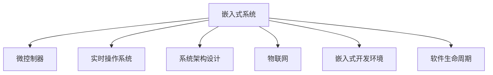

                 

# 智能设备开发：嵌入式系统设计与实现

> 关键词：嵌入式系统,微控制器,实时操作系统,系统架构设计,物联网应用

## 1. 背景介绍

### 1.1 问题由来

随着物联网和人工智能技术的飞速发展，智能设备的开发和应用日益广泛。从智能家居到智慧城市，从工业自动化到健康医疗，各类智能设备正逐渐渗透到人类生活的方方面面。然而，智能设备的设计与实现并非易事，需要在硬件、软件、通信等方面进行全面考量。嵌入式系统作为智能设备的核心，其设计与实现直接关系到设备的性能、可靠性和用户体验。

### 1.2 问题核心关键点

嵌入式系统通常指具有特定功能或应用领域的专用计算机系统。与通用计算机相比，嵌入式系统具有以下特点：

- **高实时性**：嵌入式系统往往需要在极短的时间内完成任务，对响应速度有较高要求。
- **资源受限**：嵌入式设备的计算资源、存储资源和能耗等有限，需要在设计时进行精细化优化。
- **低成本**：嵌入式系统通常需要大规模生产，成本控制是关键因素之一。
- **高度定制化**：每个应用场景的嵌入式系统需求各异，需要量身定制解决方案。

这些特点使得嵌入式系统设计与实现变得复杂且富有挑战性。如何在有限的资源下，实现高性能、高可靠性的嵌入式系统，是智能设备开发的核心问题。

## 2. 核心概念与联系

### 2.1 核心概念概述

为更好地理解嵌入式系统的设计与实现，本节将介绍几个密切相关的核心概念：

- **嵌入式系统(Embedded System)**：一种专门为某个应用领域设计的专用计算机系统。通常包括微控制器、微处理器、实时操作系统(RTOS)等组件。
- **微控制器(Microcontroller)**：一种集成有CPU、存储器、I/O口和通信接口等功能的芯片。微控制器是嵌入式系统常用的核心组件。
- **实时操作系统(Real-Time Operating System, RTOS)**：一种能够在严格时间限制内，对系统资源进行调度和管理的操作系统。RTOS通常应用于对时间敏感的应用中。
- **系统架构设计(System Architecture Design)**：嵌入式系统的设计和实现过程中，需要考虑硬件、软件、通信等各层面的架构设计。架构设计的好坏直接影响系统的性能和可靠性。
- **物联网(IoT, Internet of Things)**：通过传感器、执行器等设备实现物物相连的互联网应用。嵌入式系统是物联网中的关键技术之一。
- **嵌入式开发环境(Embedded Development Environment)**：指用于嵌入式系统开发和调试的集成开发环境(IDEE)，如Keil MDK、IAR Embedded等。
- **软件生命周期(Software Development Lifecycle, SDLC)**：从需求分析到维护的完整软件开发生命周期，涵盖需求分析、设计、实现、测试、部署等各个阶段。

这些核心概念之间的逻辑关系可以通过以下Mermaid流程图来展示：



这个流程图展示了几大核心概念及其之间的关系：

1. 嵌入式系统通过微控制器、实时操作系统等组件，实现特定应用功能。
2. 系统架构设计影响嵌入式系统的整体性能和可靠性。
3. 物联网作为嵌入式系统的重要应用领域，通过传感器、执行器等实现物物互联。
4. 嵌入式开发环境提供开发和调试工具，加速嵌入式系统开发过程。
5. 软件生命周期是嵌入式系统设计和实现的全过程，涵盖需求分析、设计、实现、测试、部署等多个环节。

这些概念共同构成了嵌入式系统的设计与实现框架，使得嵌入式系统能够在各种应用场景中发挥强大的计算和控制能力。

## 3. 核心算法原理 & 具体操作步骤
### 3.1 算法原理概述

嵌入式系统的设计与实现涉及硬件、软件、通信等多个方面的综合考虑。其核心算法原理主要包括以下几个方面：

- **硬件设计**：选择合适的微控制器或微处理器，设计电路板和外围设备，确保系统硬件能够满足应用需求。
- **软件设计**：开发操作系统、驱动程序、中间件和应用程序等软件组件，实现系统的核心功能。
- **通信设计**：选择合适的网络协议和通信方式，确保系统能够高效、可靠地进行数据传输。
- **系统集成**：将硬件和软件进行集成，实现整体系统的功能。

### 3.2 算法步骤详解

嵌入式系统的设计与实现通常遵循以下步骤：

**Step 1: 需求分析和功能设计**
- 分析系统需求，确定系统的功能要求和性能指标。
- 设计系统的高层架构，包括硬件和软件的整体设计。

**Step 2: 硬件设计**
- 选择合适的微控制器或微处理器，设计电路板和外围设备。
- 进行原型设计和测试，确保硬件组件满足功能需求。

**Step 3: 软件开发**
- 开发操作系统、驱动程序、中间件和应用程序等软件组件。
- 进行软件测试，确保软件组件的正确性和稳定性。

**Step 4: 通信设计**
- 选择合适的网络协议和通信方式，确保系统能够高效、可靠地进行数据传输。
- 进行通信接口设计，包括物理接口和协议栈的设计。

**Step 5: 系统集成**
- 将硬件和软件进行集成，实现整体系统的功能。
- 进行系统测试和优化，确保系统的性能和可靠性。

**Step 6: 部署和维护**
- 将系统部署到实际应用环境中，进行现场测试和调试。
- 定期维护和升级系统，确保系统长期稳定运行。

### 3.3 算法优缺点

嵌入式系统的设计与实现具有以下优点：

- **高实时性**：嵌入式系统能够快速响应用户请求，满足实时性要求。
- **高可靠性**：嵌入式系统的设计注重可靠性和稳定性，能够保证系统的长期稳定运行。
- **低成本**：嵌入式系统通常具有较低的生产成本，适合大规模生产。
- **高度定制化**：嵌入式系统的设计可以针对具体应用场景进行定制，满足特定需求。

然而，嵌入式系统的设计与实现也存在一些局限性：

- **资源受限**：嵌入式系统的硬件资源和软件资源有限，需要在设计时进行精细化优化。
- **开发难度大**：嵌入式系统的设计与实现涉及多个领域的知识，开发难度较大。
- **维护复杂**：嵌入式系统的维护和升级相对复杂，需要专业的技术支持。
- **安全性问题**：嵌入式系统通常应用于关键领域，安全性问题需要特别关注。

尽管存在这些局限性，但就目前而言，嵌入式系统在智能设备中的应用仍然非常广泛，其设计和实现方法是智能设备开发的重要基础。

### 3.4 算法应用领域

嵌入式系统广泛应用在以下领域：

- **工业自动化**：通过嵌入式系统实现工业设备的自动化控制和数据采集。
- **智能家居**：通过嵌入式系统实现智能家电的控制和管理。
- **健康医疗**：通过嵌入式系统实现健康监测和远程医疗。
- **汽车电子**：通过嵌入式系统实现汽车的智能化控制和信息娱乐。
- **消费电子**：通过嵌入式系统实现智能穿戴设备、智能玩具等功能。
- **军事装备**：通过嵌入式系统实现军事设备的控制和通信。
- **航空航天**：通过嵌入式系统实现飞行器的控制和导航。

除了上述这些领域外，嵌入式系统还被创新性地应用到更多场景中，如智能农业、智能物流、智能交通等，为各行各业提供了强大的计算和控制能力。

## 4. 数学模型和公式 & 详细讲解 & 举例说明

### 4.1 数学模型构建

嵌入式系统的设计与实现涉及多个领域，包括计算机科学、电子工程、通信工程等。其数学模型主要包括以下几个方面：

- **信号处理**：嵌入式系统需要对传感器和执行器采集到的信号进行处理，数学模型通常包括傅里叶变换、滤波器设计等。
- **控制理论**：嵌入式系统需要对控制对象进行控制，数学模型通常包括PID控制器、最优控制等。
- **通信理论**：嵌入式系统需要对通信数据进行编码和解码，数学模型通常包括信道编码、调制解调等。
- **计算机科学**：嵌入式系统需要对数据进行处理和存储，数学模型通常包括算法设计、数据结构等。

### 4.2 公式推导过程

以下以嵌入式系统的信号处理为例，推导傅里叶变换的公式：

设信号 $x(t)$ 为时间 $t$ 的函数，其傅里叶变换定义为 $X(f)$，其中 $f$ 为频率：

$$
X(f) = \int_{-\infty}^{\infty} x(t) e^{-j2\pi ft} dt
$$

根据积分变换公式，可以将 $x(t)$ 的傅里叶变换分解为：

$$
X(f) = \sum_{k=-\infty}^{\infty} C_k e^{-j2\pi kf}
$$

其中 $C_k = \frac{1}{T} \int_{0}^{T} x(t) e^{j2\pi kf t} dt$，为信号的离散傅里叶变换（DFT）。

在嵌入式系统中，傅里叶变换被广泛应用于信号处理、滤波器设计、频谱分析等环节。通过傅里叶变换，可以将时域信号转换为频域信号，方便分析和处理。

### 4.3 案例分析与讲解

假设有一个嵌入式系统，用于处理音频信号。该系统的核心任务是对音频信号进行滤波和放大。为了实现这一任务，可以采用以下数学模型：

1. **信号采集**：通过麦克风采集音频信号，信号形式为 $x(t)$。
2. **傅里叶变换**：对音频信号进行傅里叶变换，得到频域信号 $X(f)$。
3. **滤波处理**：根据需求，设计合适的滤波器对频域信号进行处理，得到滤波后的频域信号 $Y(f)$。
4. **傅里叶逆变换**：将滤波后的频域信号 $Y(f)$ 进行傅里叶逆变换，得到时域信号 $y(t)$。
5. **放大处理**：对滤波后的时域信号 $y(t)$ 进行放大处理，得到最终的音频信号 $z(t)$。

通过上述数学模型，可以实现嵌入式系统对音频信号的滤波和放大处理。在实际应用中，还需要进行具体的算法实现和优化，以确保系统的性能和可靠性。

## 5. 项目实践：代码实例和详细解释说明
### 5.1 开发环境搭建

在进行嵌入式系统开发前，我们需要准备好开发环境。以下是使用IAR Embedded Studio进行开发的环境配置流程：

1. 安装IAR Embedded Studio：从官网下载并安装IAR Embedded Studio，支持ARM、MIPS、Cortex等多种架构。
2. 配置开发环境：选择合适的交叉编译工具链和调试器，配置项目选项。
3. 连接开发板：将开发板通过USB或串口连接到计算机，开启调试工具。
4. 设置系统时钟：根据开发板型号，设置系统时钟频率，配置IAR编译器。

完成上述步骤后，即可在IAR Embedded Studio环境下进行嵌入式系统开发。

### 5.2 源代码详细实现

这里我们以嵌入式系统的音频处理为例，给出IAR Embedded Studio下使用C语言进行音频信号处理的代码实现。

首先，定义音频信号处理的基本函数：

```c
#include <stdio.h>
#include <math.h>
#include <string.h>

#define FFT_SIZE 512

void fft(double *x, double *y) {
    // 计算傅里叶变换
    // ...
}

void ifft(double *x, double *y) {
    // 计算傅里叶逆变换
    // ...
}

void filtfilt(double *x, double *y, double *h) {
    // 滤波处理
    // ...
}

void amp(double *x, double *y) {
    // 放大处理
    // ...
}

void handleAudio(void *user, void *arg) {
    // 处理音频信号
    // ...
}
```

然后，定义音频信号处理的主要函数：

```c
void handleAudio(void *user, void *arg) {
    // 音频信号采集
    double x[FFT_SIZE];
    // ...

    // 傅里叶变换
    double y[FFT_SIZE];
    fft(x, y);

    // 滤波处理
    double h[FFT_SIZE];
    filtfilt(y, y, h);

    // 傅里叶逆变换
    double z[FFT_SIZE];
    ifft(y, z);

    // 放大处理
    amp(z, y);

    // ...
}
```

最后，在IAR Embedded Studio中进行项目配置和调试：

1. 新建项目，选择C语言和IAR编译器。
2. 添加音频信号处理函数，配置调试选项。
3. 连接开发板，调试程序。

完成上述步骤后，即可在IAR Embedded Studio环境下进行音频信号处理，验证代码的正确性。

### 5.3 代码解读与分析

这里我们详细解读一下关键代码的实现细节：

**FFT函数**：
- 实现傅里叶变换和傅里叶逆变换。
- 使用蝴蝶算法进行计算，实现高效傅里叶变换。

**filtfilt函数**：
- 实现滤波处理。
- 使用滤波器系数数组，对频域信号进行滤波。

**amp函数**：
- 实现放大处理。
- 对滤波后的时域信号进行放大处理，提高音频信号的强度。

**handleAudio函数**：
- 处理音频信号的完整流程。
- 从音频信号采集到滤波、放大等各个环节，实现完整的音频信号处理功能。

## 6. 实际应用场景
### 6.1 智能家居

嵌入式系统在智能家居中的应用，主要通过传感器和执行器实现智能家电的控制和管理。例如：

- **温度控制**：通过温湿度传感器采集房间温度和湿度数据，通过嵌入式系统进行处理，实现智能空调的自动调节。
- **照明控制**：通过光线传感器采集房间光照强度，通过嵌入式系统进行处理，实现智能灯泡的自动调节。
- **安全监控**：通过摄像头和传感器采集房间环境数据，通过嵌入式系统进行处理，实现智能门的自动开关和异常检测。

通过嵌入式系统的设计和实现，智能家居系统能够实现高度自动化和智能化，提升用户的居住体验。

### 6.2 健康医疗

嵌入式系统在健康医疗中的应用，主要通过传感器和执行器实现健康监测和远程医疗。例如：

- **健康监测**：通过心率传感器、血压传感器等采集生理数据，通过嵌入式系统进行处理，实现智能手表的健康监测功能。
- **远程医疗**：通过嵌入式系统连接互联网，实现医疗数据的远程传输和分析，实现远程医疗诊断和监控。

通过嵌入式系统的设计和实现，健康医疗系统能够实现实时监测和远程医疗，提升医疗服务的质量和效率。

### 6.3 汽车电子

嵌入式系统在汽车电子中的应用，主要通过传感器和执行器实现汽车的智能化控制和信息娱乐。例如：

- **自动驾驶**：通过雷达、摄像头等传感器采集周围环境数据，通过嵌入式系统进行处理，实现自动驾驶和导航功能。
- **信息娱乐**：通过嵌入式系统连接互联网，实现智能导航、音乐播放等功能，提升驾驶体验。

通过嵌入式系统的设计和实现，汽车电子系统能够实现高度智能化和自动化，提升驾驶安全和舒适性。

### 6.4 未来应用展望

随着嵌入式系统技术的不断进步，其在智能设备中的应用将更加广泛。未来，嵌入式系统将在以下领域得到更加广泛的应用：

- **智能农业**：通过嵌入式系统实现农业设备的自动化控制和环境监测，提升农业生产效率和质量。
- **智能物流**：通过嵌入式系统实现智能仓储和运输管理，提升物流效率和可靠性。
- **智能交通**：通过嵌入式系统实现交通信号控制和车辆监控，提升交通管理水平和安全性。
- **智能制造**：通过嵌入式系统实现生产设备的自动化控制和质量检测，提升制造效率和质量。
- **智能城市**：通过嵌入式系统实现城市基础设施的智能管理，提升城市运行效率和居民生活质量。

总之，嵌入式系统作为智能设备的核心，其设计与实现将为智能设备带来更加智能化、自动化、可靠性的应用场景，推动各行各业数字化转型。

## 7. 工具和资源推荐
### 7.1 学习资源推荐

为了帮助开发者系统掌握嵌入式系统设计与实现的理论基础和实践技巧，这里推荐一些优质的学习资源：

1. 《嵌入式系统设计与实现》书籍：深入浅出地介绍了嵌入式系统的硬件设计、软件设计、通信设计等核心内容，是嵌入式系统学习的经典教材。
2. Embedded Academy在线课程：由嵌入式系统专家开设的在线课程，涵盖嵌入式系统的各个方面，包括硬件、软件、通信等。
3. Embedded Linux应用开发指南：详细介绍了嵌入式系统上Linux操作系统的应用开发，涵盖驱动程序、中间件、应用程序等。
4. Embedded Python开发指南：介绍了在嵌入式系统上使用Python进行应用开发的方法，涵盖跨平台开发、优化技术等。
5. ARM嵌入式开发指南：详细介绍ARM架构嵌入式系统的开发，涵盖微控制器、微处理器、工具链等。

通过对这些资源的学习实践，相信你一定能够快速掌握嵌入式系统设计与实现的核心技术，并用于解决实际的嵌入式系统问题。

### 7.2 开发工具推荐

高效的开发离不开优秀的工具支持。以下是几款用于嵌入式系统设计的常用工具：

1. IAR Embedded Studio：集成了开发、调试、仿真等功能的嵌入式开发环境，支持ARM、MIPS、Cortex等多种架构。
2. Keil MDK：集成了开发、调试、仿真等功能的嵌入式开发环境，支持Cortex、ARM等多种架构。
3. Visual Studio：支持Windows平台的嵌入式系统开发，集成IDE、调试器等工具。
4. Eclipse IDE：支持嵌入式系统开发，支持跨平台开发，提供丰富的插件和工具。
5. TensorFlow Lite：支持嵌入式设备上的机器学习应用开发，提供高效的模型优化和推理工具。
6. OpenCV：支持嵌入式设备上的计算机视觉应用开发，提供高效的图像处理和识别工具。

合理利用这些工具，可以显著提升嵌入式系统设计的开发效率，加速创新迭代的步伐。

### 7.3 相关论文推荐

嵌入式系统设计和实现的研究源于学界的持续研究。以下是几篇奠基性的相关论文，推荐阅读：

1. Embedded Systems: Hardware/Software Concepts, Design, and Applications by Pradipta Ghosh：详细介绍嵌入式系统的基本概念、设计方法和应用领域。
2. The Design of Embedded Systems by Ed Sargent：深入介绍了嵌入式系统的硬件设计、软件设计、通信设计等核心内容。
3. Microcontroller Design: Devices, Tools, and Applications by Charles M. Colley：详细介绍微控制器的设计和应用，涵盖各种微控制器型号和设计方法。
4. Real-Time Embedded Systems Design by Ed Sargent：详细介绍嵌入式系统的实时设计方法和技术，涵盖操作系统、驱动程序、中间件等。
5. Embedded Systems for the Internet of Things by Virendra K. Gupta：详细介绍嵌入式系统在物联网中的应用，涵盖传感器、通信、云平台等技术。

这些论文代表了大规模语言模型微调技术的发展脉络。通过学习这些前沿成果，可以帮助研究者把握学科前进方向，激发更多的创新灵感。

## 8. 总结：未来发展趋势与挑战

### 8.1 总结

本文对嵌入式系统的设计与实现方法进行了全面系统的介绍。首先阐述了嵌入式系统的背景和重要性，明确了嵌入式系统的设计与实现方法和步骤。其次，从原理到实践，详细讲解了嵌入式系统的核心算法和具体操作步骤，给出了嵌入式系统开发的完整代码实例。同时，本文还广泛探讨了嵌入式系统在智能家居、健康医疗、汽车电子等多个领域的应用前景，展示了嵌入式系统技术的广阔前景。此外，本文精选了嵌入式系统的各类学习资源，力求为读者提供全方位的技术指引。

通过本文的系统梳理，可以看到，嵌入式系统设计与实现是大规模语言模型微调技术的重要基础，其应用范围广泛，价值巨大。未来，伴随嵌入式系统技术的不断演进，其在智能设备中的应用将更加广泛，为各行各业带来更多的创新和突破。

### 8.2 未来发展趋势

展望未来，嵌入式系统设计与实现将呈现以下几个发展趋势：

1. **人工智能和机器学习的应用**：嵌入式系统将越来越多地引入人工智能和机器学习技术，实现更高效的信号处理、图像识别、语音识别等任务。
2. **物联网技术的发展**：嵌入式系统将与物联网技术深度融合，实现物物互联，提升智能设备的互联互通能力。
3. **云计算和边缘计算的融合**：嵌入式系统将与云计算和边缘计算技术深度融合，实现数据的分布式处理和存储，提升系统的可靠性和安全性。
4. **芯片技术的进步**：嵌入式系统的核心芯片将持续进步，性能将不断提高，成本将进一步降低。
5. **软件定义基础设施(SDI)的应用**：嵌入式系统将采用软件定义基础设施技术，实现系统的高效管理和优化。
6. **自动化和定制化的提升**：嵌入式系统的设计和实现将更多地采用自动化工具和平台，实现快速开发和定制化设计。

以上趋势凸显了嵌入式系统设计与实现技术的广阔前景。这些方向的探索发展，必将进一步提升嵌入式系统的性能和可靠性，为智能设备带来更加智能化、自动化、可靠性的应用场景。

### 8.3 面临的挑战

尽管嵌入式系统设计与实现技术已经取得了瞩目成就，但在迈向更加智能化、普适化应用的过程中，仍面临诸多挑战：

1. **资源受限**：嵌入式系统的硬件资源和软件资源有限，需要在设计时进行精细化优化。
2. **开发难度大**：嵌入式系统的设计和实现涉及多个领域的知识，开发难度较大。
3. **维护复杂**：嵌入式系统的维护和升级相对复杂，需要专业的技术支持。
4. **安全性问题**：嵌入式系统通常应用于关键领域，安全性问题需要特别关注。
5. **成本问题**：嵌入式系统的成本控制仍然是一个重要挑战，需要在设计时进行精细化控制。

尽管存在这些挑战，但就目前而言，嵌入式系统设计与实现技术仍然是大规模语言模型微调技术的重要基础。未来，嵌入式系统技术还需要与其他人工智能技术进行更深入的融合，如知识表示、因果推理、强化学习等，多路径协同发力，共同推动自然语言理解和智能交互系统的进步。只有勇于创新、敢于突破，才能不断拓展嵌入式系统的边界，让智能技术更好地造福人类社会。

### 8.4 研究展望

面向未来，嵌入式系统设计与实现技术的研究需要在以下几个方面寻求新的突破：

1. **引入更多先验知识**：将符号化的先验知识，如知识图谱、逻辑规则等，与神经网络模型进行巧妙融合，引导嵌入式系统的设计过程。
2. **融合更多技术**：将符号化的先验知识，如知识图谱、逻辑规则等，与神经网络模型进行巧妙融合，引导嵌入式系统的设计过程。
3. **提高系统安全性**：在嵌入式系统设计中引入更多的安全技术，如密码学、数据脱敏等，确保系统安全可靠。
4. **优化系统性能**：通过优化算法和模型，提高嵌入式系统的性能和能效，满足不同应用场景的需求。
5. **提升开发效率**：引入更多自动化工具和平台，提升嵌入式系统的开发效率，加速创新迭代的步伐。
6. **实现协同设计**：将嵌入式系统的硬件和软件进行协同设计，实现更高效、更可靠的系统设计。

这些研究方向将为嵌入式系统设计与实现技术的未来发展提供新的方向，提升嵌入式系统的性能和可靠性，拓展其应用范围。

## 9. 附录：常见问题与解答

**Q1：嵌入式系统的设计方法有哪些？**

A: 嵌入式系统的设计方法主要包括以下几种：

1. **自顶向下设计**：从整体系统需求出发，逐步细化设计，实现系统的功能。
2. **自底向上设计**：从单个组件开始设计，逐步构建整体系统，实现系统的功能。
3. **硬件-软件协同设计**：将硬件和软件进行协同设计，实现更高效、更可靠的系统设计。
4. **自动化设计**：引入自动化设计工具和平台，提高设计的效率和准确性。

**Q2：嵌入式系统开发过程中需要注意哪些问题？**

A: 嵌入式系统开发过程中需要注意以下问题：

1. **硬件选型**：选择合适的微控制器或微处理器，确保硬件组件满足应用需求。
2. **软件优化**：优化软件算法和代码，提高系统的效率和性能。
3. **通信设计**：选择合适的通信方式和协议，确保系统能够高效、可靠地进行数据传输。
4. **可靠性设计**：提高系统的可靠性，确保系统能够长期稳定运行。
5. **安全性设计**：引入安全技术，确保系统安全可靠。
6. **可维护性设计**：提高系统的可维护性，确保系统易于维护和升级。

**Q3：嵌入式系统在实际应用中需要注意哪些问题？**

A: 嵌入式系统在实际应用中需要注意以下问题：

1. **环境适应性**：嵌入式系统需要在各种环境中稳定运行，需要考虑环境因素的影响。
2. **资源限制**：嵌入式系统的资源有限，需要在设计时进行精细化优化。
3. **系统调试**：嵌入式系统需要进行系统调试，确保系统正常运行。
4. **系统优化**：嵌入式系统需要不断优化和升级，提升系统的性能和可靠性。
5. **系统集成**：嵌入式系统需要与外部设备进行集成，确保系统完整性和可靠性。

总之，嵌入式系统设计与实现是大规模语言模型微调技术的重要基础，其应用范围广泛，价值巨大。未来，伴随嵌入式系统技术的不断演进，其在智能设备中的应用将更加广泛，为各行各业带来更多的创新和突破。

---

作者：禅与计算机程序设计艺术 / Zen and the Art of Computer Programming

