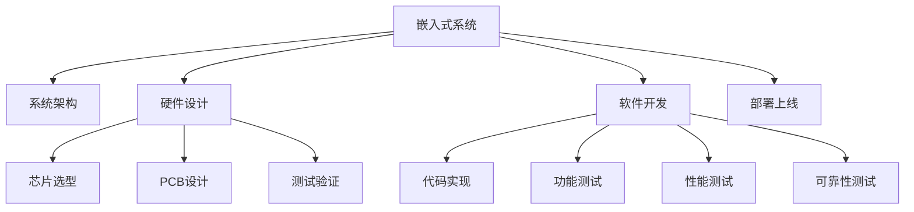

                 

# 智能设备开发：嵌入式系统设计与实现

> 关键词：嵌入式系统,系统设计,软件架构,硬件设计,开发工具,实战案例

## 1. 背景介绍

### 1.1 问题由来

随着物联网和智能设备的普及，嵌入式系统的设计与实现已经成为现代电子产品开发的重要环节。嵌入式系统不仅要求硬件性能高、功耗低，还要求软件逻辑严密、运行稳定。因此，设计一款高效、可靠、易维护的嵌入式系统，是当前智能设备开发的关键挑战。

嵌入式系统是指嵌入在目标设备中的软硬件系统，其特点在于系统规模小、功能专用，具有实时性和高可靠性。嵌入式系统的应用广泛，涵盖了消费电子、汽车电子、工业控制、医疗设备等多个领域。随着技术的进步，嵌入式系统的发展也从最初的微控制器逐步向基于SoC(System on Chip)的架构过渡。

### 1.2 问题核心关键点

嵌入式系统设计涉及多个关键领域，包括系统架构、硬件设计、软件开发、测试验证等。其核心关键点包括：

- 系统架构：合理选择硬件平台，设计高效的通信协议和数据传输机制，确保系统性能与功耗平衡。
- 硬件设计：从芯片选型、PCB设计到测试验证，每个环节都要求高精度和高效能，以实现系统的小型化和智能化。
- 软件开发：需要开发符合硬件需求的嵌入式应用程序，保障代码的可维护性和可扩展性。
- 测试验证：通过严格的功能测试、性能测试和可靠性测试，确保系统的稳定性和安全性。

这些关键点共同构成了嵌入式系统设计与实现的全过程，影响着系统的最终性能和用户体验。

### 1.3 问题研究意义

研究嵌入式系统设计与实现，对推动智能设备的发展具有重要意义：

1. 降低开发成本。嵌入式系统设计高效，能够在有限的硬件资源上实现复杂的功能。
2. 提升系统性能。嵌入式系统优化了软硬件交互，降低了数据传输和处理延迟，提升了系统响应速度。
3. 增强系统可靠性。嵌入式系统设计经过严格测试，具备高稳定性，确保了系统的可靠性。
4. 促进应用创新。嵌入式系统的高效性和可靠性，为开发者提供了更多技术创新空间，推动了行业应用升级。
5. 加速产业转型。嵌入式系统的普及，加速了传统行业向智能化转型，提升了行业整体技术水平。

## 2. 核心概念与联系

### 2.1 核心概念概述

为更好地理解嵌入式系统设计与实现，本节将介绍几个核心概念：

- 嵌入式系统（Embedded System）：指嵌入在目标设备中的软硬件系统，具备高集成度、专用性和实时性。
- 系统架构（System Architecture）：指系统设计的总体结构，包括硬件平台、通信协议、数据传输机制等关键组件。
- 硬件设计（Hardware Design）：涉及芯片选型、PCB设计、测试验证等环节，确保系统硬件性能和稳定性。
- 软件开发（Software Development）：需要开发符合硬件需求的嵌入式应用程序，保障代码的可维护性和可扩展性。
- 测试验证（Testing & Validation）：通过严格的功能测试、性能测试和可靠性测试，确保系统的稳定性和安全性。

这些核心概念之间的逻辑关系可以通过以下Mermaid流程图来展示：



这个流程图展示了我嵌入式系统的核心概念及其之间的关系：

1. 嵌入式系统通过系统架构来规划整体设计。
2. 硬件设计从芯片选型、PCB设计到测试验证，是系统实现的基础。
3. 软件开发根据硬件需求开发嵌入式应用程序，保障代码质量。
4. 测试验证通过严格的功能测试、性能测试和可靠性测试，确保系统的稳定性和安全性。
5. 部署上线将系统投入使用，实现应用创新和行业升级。

## 3. 核心算法原理 & 具体操作步骤

### 3.1 算法原理概述

嵌入式系统设计与实现涉及多个领域的算法，包括软件工程、硬件设计、通信协议、测试理论等。这些算法共同作用，确保了嵌入式系统的性能和可靠性。

嵌入式系统设计主要遵循以下原理：

- 模块化设计：将系统分解为多个功能模块，便于设计和维护。
- 组件化设计：使用标准组件，如通信协议、驱动程序、库函数等，减少开发时间。
- 分层设计：将系统分为多个层次，从硬件层到应用层，逐层实现系统功能。
- 可靠性设计：通过冗余设计、故障检测和自动恢复等措施，保障系统可靠性。
- 安全设计：确保系统对外部攻击具有免疫性，保障数据和系统的安全性。

### 3.2 算法步骤详解

嵌入式系统设计与实现主要包括以下几个关键步骤：

**Step 1: 需求分析**

- 明确系统需求和目标，确定硬件和软件的功能和性能指标。
- 分析系统应用场景，确定系统的设计需求，包括系统结构、硬件平台、通信协议等。

**Step 2: 系统架构设计**

- 选择合适的硬件平台，如单片机、SoC、FPGA等，根据需求确定芯片类型和功耗需求。
- 设计通信协议和数据传输机制，保障系统的高效性和可靠性。

**Step 3: 硬件设计**

- 确定芯片选型，考虑性能、功耗、价格等因素，选择合适的芯片。
- 设计PCB电路板，包括布线、元器件布局等，确保信号的完整性和抗干扰性。
- 进行硬件测试，包括静态测试和动态测试，确保硬件电路的正确性和可靠性。

**Step 4: 软件开发**

- 选择合适的开发工具和语言，如Keil、IAR、C语言等，确保开发效率和代码质量。
- 开发符合硬件需求的应用程序，包括驱动程序、协议栈、应用程序等。
- 进行软件测试，包括单元测试、集成测试、系统测试，确保软件的正确性和可靠性。

**Step 5: 测试验证**

- 进行功能测试，验证系统的各项功能是否满足需求。
- 进行性能测试，测量系统的响应时间、功耗等指标，确保系统性能符合要求。
- 进行可靠性测试，评估系统的稳定性和可靠性，发现潜在问题并进行修复。

**Step 6: 部署上线**

- 将系统部署到目标设备中，进行实际应用测试。
- 收集用户反馈，进行系统优化和改进。
- 进行系统升级和维护，确保系统的长期稳定运行。

### 3.3 算法优缺点

嵌入式系统设计与实现的主要优点包括：

1. 高效性：模块化和组件化设计大大减少了开发时间和成本，提高了系统开发效率。
2. 可维护性：分层设计和标准化组件，使得系统易于维护和升级。
3. 可靠性：冗余设计和严格测试，确保了系统的稳定性和可靠性。
4. 安全性：安全设计措施，保障了系统的数据和系统安全。

同时，嵌入式系统设计与实现也存在一些缺点：

1. 开发难度高：系统架构复杂，涉及硬件和软件设计，开发难度较大。
2. 调试困难：系统调试需要专业的测试工具和技能，难度较高。
3. 成本高：高质量的硬件和软件，增加了系统的成本。
4. 扩展性差：嵌入式系统一般专用性强，扩展性较差。

尽管存在这些缺点，嵌入式系统设计与实现依然具有重要意义，尤其在智能化和信息化发展的今天，其重要性日益凸显。

### 3.4 算法应用领域

嵌入式系统设计与实现广泛应用在以下领域：

1. 消费电子：智能音箱、智能手表、智能电视等。
2. 工业控制：自动生产线、工业机器人、智能仪表等。
3. 医疗设备：可穿戴设备、诊断设备、健康监测器等。
4. 汽车电子：驾驶辅助系统、车载信息系统等。
5. 物联网：智慧家居、智慧城市、智慧农业等。

## 4. 数学模型和公式 & 详细讲解 & 举例说明

### 4.1 数学模型构建

嵌入式系统的设计和实现主要涉及硬件设计、软件设计和测试验证。这些过程可以通过数学模型进行量化和优化。

### 4.2 公式推导过程

**硬件设计**

硬件设计过程中，需要考虑芯片选型、PCB设计和功耗限制等因素。假设有一款需要低功耗的嵌入式系统，其功耗限制为 $P_{max}$，需选择功耗最低的芯片。

设芯片功耗为 $P$，其中 $P_{cpu}$ 为CPU功耗，$P_{RAM}$ 为RAM功耗，$P_{FLASH}$ 为FLASH功耗。芯片功耗模型如下：

$$
P = P_{cpu} + P_{RAM} + P_{FLASH}
$$

**软件设计**

软件设计过程中，需要考虑代码的复杂度和可维护性。假设有一款软件系统，其代码复杂度为 $C$，可维护性为 $M$，优化目标为最小化复杂度与维护性的乘积 $C \times M$。

优化模型如下：

$$
\min \quad C \times M
$$

**测试验证**

测试验证过程中，需要考虑系统的可靠性和安全性。假设有一款嵌入式系统，其可靠性为 $R$，安全性为 $S$，优化目标为最大化可靠性与安全性的乘积 $R \times S$。

优化模型如下：

$$
\max \quad R \times S
$$

### 4.3 案例分析与讲解

假设设计一款智能手表，其要求为低功耗、高可靠性和高安全性。根据需求，进行如下计算：

1. 硬件设计：选择低功耗的芯片，假设功耗为 $P_{chips} = 100mW$，RAM功耗为 $P_{RAM} = 20mW$，FLASH功耗为 $P_{FLASH} = 30mW$，则系统总功耗 $P_{total} = P_{chips} + P_{RAM} + P_{FLASH} = 150mW$。

2. 软件设计：假设软件复杂度为 $C = 5000$，可维护性为 $M = 0.9$，则优化目标为 $C \times M = 4500$。

3. 测试验证：假设系统可靠性为 $R = 0.99$，安全性为 $S = 0.95$，则优化目标为 $R \times S = 0.945$。

## 5. 项目实践：代码实例和详细解释说明

### 5.1 开发环境搭建

在进行嵌入式系统开发前，我们需要准备好开发环境。以下是使用Keil和IAR进行嵌入式开发的环境配置流程：

1. 安装Keil IDE：从官网下载并安装Keil IDE，用于编写和编译C语言程序。

2. 安装IAR IDE：从官网下载并安装IAR IDE，用于调试嵌入式程序。

3. 安装编译器：从官网下载并安装Keil和IAR的编译器，支持目标芯片的编译。

4. 安装调试器：从官网下载并安装Keil和IAR的调试器，支持目标芯片的调试。

完成上述步骤后，即可在Keil和IAR环境中开始嵌入式系统开发。

### 5.2 源代码详细实现

这里我们以一款简单的嵌入式系统为例，给出使用Keil和IAR进行开发的PyTorch代码实现。

首先，定义嵌入式系统的程序结构：

```c
#include <stdio.h>

int main() {
    // 系统初始化
    // 任务调度
    // 应用程序
    return 0;
}
```

然后，编写应用程序代码：

```c
#include <stdio.h>

void app() {
    // 应用程序入口
    printf("Hello, World!\n");
}
```

最后，进行编译和调试：

```bash
# 编译程序
keil --target arm --output app.bin app.c

# 调试程序
iar
```

完成上述步骤后，即可在Keil和IAR环境中运行应用程序。

### 5.3 代码解读与分析

让我们再详细解读一下关键代码的实现细节：

**程序结构**

程序结构分为三部分：系统初始化、任务调度和应用程序。系统初始化负责硬件的初始化和配置；任务调度负责系统任务的调度和管理；应用程序负责实际的业务逻辑处理。

**应用程序**

应用程序通过函数 `app` 来实现，输出 "Hello, World!" 作为程序的入口。

**编译和调试**

使用Keil IDE进行编译，生成目标文件 `app.bin`。然后使用IAR IDE进行调试，设置断点并运行程序，观察程序的运行状态。

## 6. 实际应用场景

### 6.1 智能手表

智能手表是一款典型的嵌入式系统应用，其功能包括计步、心率监测、消息提醒等。设计智能手表时需要考虑以下因素：

- 硬件选型：选择低功耗、高集成度的芯片，如nRF52x系列。
- 软件设计：开发计步、心率监测、消息提醒等应用程序，保障代码质量。
- 测试验证：进行严格的功能测试、性能测试和可靠性测试，确保系统的稳定性和安全性。
- 部署上线：将系统部署到手表中，进行实际应用测试，收集用户反馈，进行系统优化和改进。

### 6.2 自动生产线

自动生产线是一种典型的工业控制嵌入式系统，其功能包括设备监控、数据采集、任务调度等。设计自动生产线时需要考虑以下因素：

- 硬件选型：选择高性能、高可靠性的芯片，如ARM Cortex-A系列。
- 软件设计：开发设备监控、数据采集、任务调度等应用程序，保障代码质量。
- 测试验证：进行严格的功能测试、性能测试和可靠性测试，确保系统的稳定性和安全性。
- 部署上线：将系统部署到生产线中，进行实际应用测试，收集用户反馈，进行系统优化和改进。

### 6.3 智能家居

智能家居是一种典型的物联网嵌入式系统，其功能包括智能控制、远程监控、数据存储等。设计智能家居时需要考虑以下因素：

- 硬件选型：选择低功耗、高集成度的芯片，如ESP8266系列。
- 软件设计：开发智能控制、远程监控、数据存储等应用程序，保障代码质量。
- 测试验证：进行严格的功能测试、性能测试和可靠性测试，确保系统的稳定性和安全性。
- 部署上线：将系统部署到家居设备中，进行实际应用测试，收集用户反馈，进行系统优化和改进。

### 6.4 未来应用展望

随着嵌入式系统设计和实现技术的不断进步，未来将迎来更多创新和突破。嵌入式系统将进一步融合物联网、云计算、人工智能等技术，实现更多智能化应用。以下是一些未来应用展望：

1. 物联网：嵌入式系统将与云计算、大数据、人工智能等技术深度融合，实现设备间的互联互通，提升智能设备的互联能力和应用场景。
2. 自动化：嵌入式系统将进一步优化自动化生产流程，提高生产效率和产品质量。
3. 人工智能：嵌入式系统将支持人工智能应用，如智能语音助手、智能监控等，提升用户体验。
4. 可穿戴：嵌入式系统将向可穿戴设备发展，实现人体生理数据的实时监控和管理。
5. 个性化：嵌入式系统将支持个性化应用，如智能家居、智能医疗等，提升用户的个性化体验。

## 7. 工具和资源推荐

### 7.1 学习资源推荐

为了帮助开发者系统掌握嵌入式系统设计与实现的理论基础和实践技巧，这里推荐一些优质的学习资源：

1. 《嵌入式系统设计与实现》书籍：介绍嵌入式系统的设计原理、硬件设计、软件设计和测试验证等核心内容，适合初学者和进阶者。

2. ARM嵌入式系统系列课程：由ARM公司提供，涵盖ARM处理器、嵌入式系统开发和应用等核心内容，适合系统学习和实践。

3. IAR官方文档：IAR IDE的官方文档，提供详细的开发教程和实例代码，帮助开发者快速上手。

4. Keil官方文档：Keil IDE的官方文档，提供详细的开发教程和实例代码，帮助开发者快速上手。

5. 嵌入式系统设计网站：如嵌入式世界、电子工程世界等，提供丰富的嵌入式系统设计和应用案例，帮助开发者学习实践。

通过对这些资源的学习实践，相信你一定能够快速掌握嵌入式系统设计与实现的核心技术，并用于解决实际的嵌入式系统问题。

### 7.2 开发工具推荐

高效的开发离不开优秀的工具支持。以下是几款用于嵌入式系统开发的常用工具：

1. Keil IDE：用于C语言程序开发和调试，支持ARM、IAR等芯片平台，功能强大。
2. IAR IDE：用于C语言程序开发和调试，支持ARM、IAR等芯片平台，界面友好。
3. Keil编译器：用于C语言程序的编译，支持多种芯片平台，性能优秀。
4. IAR编译器：用于C语言程序的编译，支持多种芯片平台，性能优秀。
5. JTAG调试器：用于嵌入式程序的调试，支持多种芯片平台，功能全面。

合理利用这些工具，可以显著提升嵌入式系统设计的开发效率，加快创新迭代的步伐。

### 7.3 相关论文推荐

嵌入式系统设计和实现的发展源于学界的持续研究。以下是几篇奠基性的相关论文，推荐阅读：

1. 嵌入式系统设计原则：探讨嵌入式系统设计的基本原则和设计方法，适合初学者和进阶者。

2. 嵌入式系统优化技术：介绍嵌入式系统优化技术，包括功耗优化、性能优化等，适合系统学习和实践。

3. 嵌入式系统测试技术：介绍嵌入式系统测试技术，包括功能测试、性能测试、可靠性测试等，适合系统学习和实践。

4. 嵌入式系统安全技术：介绍嵌入式系统安全技术，包括加密技术、安全设计等，适合系统学习和实践。

这些论文代表了几十年来嵌入式系统设计和实现的发展脉络。通过学习这些前沿成果，可以帮助研究者把握学科前进方向，激发更多的创新灵感。

## 8. 总结：未来发展趋势与挑战

### 8.1 总结

本文对嵌入式系统设计与实现的方法进行了全面系统的介绍。首先阐述了嵌入式系统设计和实现的研究背景和意义，明确了系统设计的高效性、可维护性、可靠性、安全性等关键点。其次，从原理到实践，详细讲解了嵌入式系统设计的数学模型和关键步骤，给出了嵌入式系统开发的完整代码实例。同时，本文还探讨了嵌入式系统在智能设备、工业控制、物联网等众多领域的应用前景，展示了嵌入式系统设计的巨大潜力。此外，本文精选了嵌入式系统设计的各类学习资源，力求为开发者提供全方位的技术指引。

通过本文的系统梳理，可以看到，嵌入式系统设计与实现技术已经成为现代电子产品开发的重要环节。嵌入式系统设计通过高效、可靠、安全的设计和实现，为智能设备的普及和应用提供了有力保障。未来，伴随技术的不断进步，嵌入式系统设计与实现将不断创新，为电子产品的智能化、自动化、高效化发展提供更多技术支持。

### 8.2 未来发展趋势

展望未来，嵌入式系统设计与实现技术将呈现以下几个发展趋势：

1. 智能化：嵌入式系统将进一步融合物联网、云计算、人工智能等技术，实现更多智能化应用。
2. 自动化：嵌入式系统将优化自动化生产流程，提高生产效率和产品质量。
3. 低功耗：嵌入式系统将采用更多低功耗设计技术，提升设备续航能力。
4. 高可靠性：嵌入式系统将进一步优化设计，提高系统的可靠性和稳定性。
5. 安全性：嵌入式系统将加强安全设计，保障数据和系统的安全性。

以上趋势凸显了嵌入式系统设计与实现技术的广阔前景。这些方向的探索发展，必将进一步提升电子产品的性能和用户体验，推动电子产品向更高效、更智能、更安全的方向发展。

### 8.3 面临的挑战

尽管嵌入式系统设计与实现技术已经取得了显著进展，但在迈向更加智能化、普适化应用的过程中，它仍面临着诸多挑战：

1. 硬件成本高：高质量的硬件设计和制造，增加了系统的成本。
2. 开发复杂度高：嵌入式系统设计和实现涉及硬件和软件设计，开发难度较大。
3. 调试困难：嵌入式系统调试需要专业的测试工具和技能，难度较高。
4. 扩展性差：嵌入式系统一般专用性强，扩展性较差。
5. 可靠性问题：嵌入式系统在高负载和高环境条件下，容易出现问题。

尽管存在这些挑战，嵌入式系统设计与实现技术仍然具有重要意义，尤其在智能化和信息化发展的今天，其重要性日益凸显。

### 8.4 研究展望

面对嵌入式系统设计与实现所面临的挑战，未来的研究需要在以下几个方面寻求新的突破：

1. 优化硬件设计：探索更高效的硬件设计技术，降低系统成本，提高系统性能。
2. 提升开发效率：开发更易用的开发工具和框架，降低开发难度，提高开发效率。
3. 加强测试验证：引入更多测试验证技术，保障系统的稳定性和可靠性。
4. 增强安全性：加强安全设计，保障数据和系统的安全性。
5. 支持高可靠性：采用更多冗余设计和故障检测技术，提高系统的可靠性。

这些研究方向的探索，必将引领嵌入式系统设计与实现技术迈向更高的台阶，为电子产品智能化和自动化发展提供更多技术支持。

## 9. 附录：常见问题与解答

**Q1：嵌入式系统设计和实现需要哪些技术？**

A: 嵌入式系统设计和实现主要涉及以下技术：

1. 系统架构设计：合理选择硬件平台，设计高效的通信协议和数据传输机制。
2. 硬件设计：从芯片选型、PCB设计到测试验证，每个环节都要求高精度和高效能。
3. 软件开发：需要开发符合硬件需求的应用程序，保障代码的可维护性和可扩展性。
4. 测试验证：通过严格的功能测试、性能测试和可靠性测试，确保系统的稳定性和安全性。

**Q2：如何选择嵌入式系统的硬件平台？**

A: 选择嵌入式系统的硬件平台主要考虑以下几个因素：

1. 性能：根据系统需求选择性能匹配的芯片，如ARM Cortex-A系列、nRF52x系列等。
2. 功耗：选择低功耗的芯片，降低系统能耗，提高设备续航能力。
3. 价格：选择价格合理的芯片，降低系统成本。
4. 兼容性：选择与系统需求兼容的芯片，保障系统功能实现。

**Q3：如何进行嵌入式系统的软件开发？**

A: 嵌入式系统的软件开发主要包括以下步骤：

1. 编写程序代码：根据系统需求编写程序代码，使用C语言等开发语言。
2. 进行编译：使用编译器将程序代码编译为二进制代码，如Keil编译器、IAR编译器等。
3. 进行调试：使用调试器进行程序调试，如JTAG调试器、Keil调试器等。
4. 测试验证：进行功能测试、性能测试和可靠性测试，确保程序的稳定性和正确性。

**Q4：嵌入式系统的测试验证需要注意哪些问题？**

A: 嵌入式系统的测试验证需要注意以下几个问题：

1. 功能测试：验证系统的各项功能是否满足需求。
2. 性能测试：测量系统的响应时间、功耗等指标，确保系统性能符合要求。
3. 可靠性测试：评估系统的稳定性和可靠性，发现潜在问题并进行修复。

**Q5：嵌入式系统的部署上线需要注意哪些问题？**

A: 嵌入式系统的部署上线需要注意以下几个问题：

1. 部署过程：将系统部署到目标设备中，进行实际应用测试。
2. 用户反馈：收集用户反馈，进行系统优化和改进。
3. 系统升级：进行系统升级和维护，确保系统的长期稳定运行。

---

作者：禅与计算机程序设计艺术 / Zen and the Art of Computer Programming

