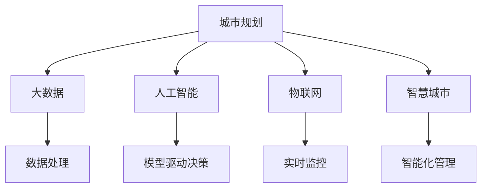

                 

# 未来城市的蓝图：2050年的城市规划

## 1. 背景介绍

### 1.1 问题由来
随着全球人口的急剧增长和城市化进程的加快，如何高效、可持续地规划未来城市，已成为全人类面临的重大挑战。当前，城市规划依然依赖于传统的手段和工具，如2D图纸、3D模型等，这些手段存在信息丢失、更新困难等诸多问题。

### 1.2 问题核心关键点
本文聚焦于利用信息技术，特别是人工智能和大数据技术，重塑未来城市规划的方式。通过对城市数据的深度分析和模型驱动的规划，提升城市规划的效率和质量，实现资源的最优化配置和环境的可持续保护。

### 1.3 问题研究意义
城市规划对人类社会的进步具有重要的意义：
- 提升城市治理水平。智能城市规划可以大幅提升城市管理的效率，实现资源的最优化配置。
- 改善居民生活质量。智能城市规划可以更好地满足居民的多样化需求，提高生活质量。
- 促进经济社会发展。智能城市规划能够吸引更多的投资和人才，推动城市的经济社会发展。
- 应对环境挑战。智能城市规划可以帮助城市更好地应对气候变化和资源短缺等环境问题。
- 赋能智慧城市建设。智能城市规划可以为智慧城市的构建提供坚实的基础，推动城市智能化的发展。

## 2. 核心概念与联系

### 2.1 核心概念概述

为更好地理解未来城市规划的方法，本节将介绍几个密切相关的核心概念：

- 城市规划(Urban Planning)：指通过合理布局城市功能，优化资源配置，提升城市运行效率和居民生活质量的过程。
- 大数据(Big Data)：指数据量巨大、种类繁多、速度实时、价值密度低的数据集合，可以通过城市大数据获取和处理城市运行的信息。
- 人工智能(AI)：指通过机器学习、深度学习等技术实现智能化的决策和分析过程。
- 物联网(IoT)：指将任何物品通过互联网相连，实现数据的实时采集和传输，是智能城市的重要基础设施。
- 智慧城市(Smart City)：指通过信息化、数字化和智能化手段，实现城市的高效、智能、可持续发展的目标。

这些核心概念之间的逻辑关系可以通过以下Mermaid流程图来展示：



这个流程图展示了大数据、人工智能和物联网在城市规划中的核心作用，以及智能城市的目标。

## 3. 核心算法原理 & 具体操作步骤
### 3.1 算法原理概述

未来城市规划的核心算法原理是大数据分析和机器学习驱动的模型决策。其核心思想是：
1. **数据采集**：通过传感器、监控设备等手段，实时采集城市运行的各种数据，如交通流量、能源消耗、环境质量等。
2. **数据处理**：利用大数据技术对采集的数据进行清洗、整合、分析，提取有用的信息。
3. **模型训练**：构建城市运行的各种模型，如交通流模型、能源优化模型、环境监测模型等，通过历史数据训练模型，获取对城市运行规律的理解。
4. **预测与决策**：基于训练好的模型，对未来城市运行进行预测和决策，如交通管理、能源分配、环境治理等。
5. **评估与优化**：通过持续的数据采集和模型训练，不断优化模型的预测和决策效果，实现城市的智能化管理。

### 3.2 算法步骤详解

未来城市规划的算法步骤大致如下：

**Step 1: 数据采集与清洗**
- 部署各类传感器、监控设备，实时采集城市运行数据。
- 对采集数据进行清洗，去除噪声、异常值，确保数据质量。

**Step 2: 数据存储与管理**
- 构建城市大数据平台，将清洗后的数据进行结构化存储。
- 引入数据治理机制，保证数据的安全、可靠、易于访问。

**Step 3: 数据处理与分析**
- 利用大数据技术，对存储的数据进行聚合、关联、可视化等处理。
- 应用机器学习和深度学习算法，从海量数据中提取有用的信息，如交通流量预测、能源消耗预测、环境污染预测等。

**Step 4: 模型构建与训练**
- 构建城市运行的各种模型，如交通流模型、能源优化模型、环境监测模型等。
- 利用历史数据对模型进行训练，优化模型参数，提高预测准确度。

**Step 5: 预测与决策**
- 基于训练好的模型，对未来城市运行进行预测和决策，如交通管理、能源分配、环境治理等。
- 引入自动化决策系统，实现对城市运行的高效管理。

**Step 6: 评估与优化**
- 通过持续的数据采集和模型训练，不断优化模型的预测和决策效果，实现城市的智能化管理。
- 引入评估指标体系，如交通拥堵指数、能源利用效率、环境质量指数等，对模型效果进行评估和优化。

### 3.3 算法优缺点

未来城市规划的算法具有以下优点：
1. **数据驱动决策**：充分利用城市大数据，实现科学、合理的城市决策。
2. **智能化管理**：通过自动化决策系统，提高城市管理的效率和质量。
3. **持续优化**：基于持续的数据采集和模型训练，实现城市的动态优化。

同时，该算法也存在一定的局限性：
1. **数据隐私问题**：大量数据的采集和存储可能带来隐私风险，需要建立严格的数据隐私保护机制。
2. **模型复杂性**：构建和训练复杂模型需要大量资源和时间，需要考虑算力的限制。
3. **预测不确定性**：模型预测可能存在不确定性，需要引入风险管理机制。
4. **技术依赖**：对大数据、人工智能等技术依赖较大，技术复杂度高。

尽管存在这些局限性，但就目前而言，基于数据驱动的智能规划方法仍是最主流的未来城市规划手段。未来相关研究的重点在于如何进一步降低技术依赖，提高模型的可解释性，同时兼顾隐私保护和伦理安全性等因素。

### 3.4 算法应用领域

未来城市规划的算法在以下几个领域有着广泛的应用：

- 智慧交通系统：通过实时监控和预测，优化交通流量，缓解交通拥堵，提升出行效率。
- 能源管理系统：利用能源优化模型，实现能源的合理分配和利用，降低能耗。
- 环境监测系统：构建环境监测模型，实时监测空气质量、水质等环境指标，及时采取措施保护环境。
- 安全监控系统：部署传感器和监控设备，实时监控城市安全状况，保障城市运行的安全。
- 公共服务系统：通过智能分析和决策，提升公共服务效率，如智慧医疗、智慧教育等。

除了上述这些经典领域外，未来城市规划的算法也将不断拓展到更多场景中，如智慧农业、智慧旅游、智慧物流等，为城市智能化提供更多的创新应用。

## 4. 数学模型和公式 & 详细讲解 & 举例说明

### 4.1 数学模型构建

未来城市规划的核心数学模型包括交通流模型、能源优化模型和环境监测模型等。以下以交通流模型为例，介绍模型的数学构建。

**交通流模型**：
假设城市道路网络由$n$个节点和$m$条边组成，设节点$i$的交通需求为$d_i$，单位时间内的交通速度为$v_i$，单位时间内的交通流量为$q_i$。则交通流模型可以表示为：

$$
\min \sum_{i=1}^n \left(\frac{d_i}{v_i}\right)
$$

约束条件为：
$$
\begin{cases}
\sum_{i=1}^m q_{ij} = d_j, & \forall j \\
0 \leq q_{ij} \leq v_j, & \forall i,j
\end{cases}
$$

其中，$q_{ij}$表示边$(i,j)$的交通流量，$v_j$表示节点$j$的交通速度。

### 4.2 公式推导过程

交通流模型的推导过程如下：

设节点$i$的交通需求为$d_i$，单位时间内的交通速度为$v_i$，则节点$i$的交通流量可以表示为：
$$
q_i = d_i \cdot v_i
$$

因此，整个网络的总交通时间可以表示为：
$$
T = \sum_{i=1}^n \frac{d_i}{v_i}
$$

我们的目标是使得总交通时间最小，即：
$$
\min T = \sum_{i=1}^n \frac{d_i}{v_i}
$$

约束条件为：
$$
\begin{cases}
\sum_{i=1}^m q_{ij} = d_j, & \forall j \\
0 \leq q_{ij} \leq v_j, & \forall i,j
\end{cases}
$$

利用线性规划的思路，将问题转化为：
$$
\min \sum_{i=1}^n \frac{d_i}{v_i}
$$

约束条件为：
$$
\begin{cases}
\sum_{i=1}^m y_{ij} = d_j, & \forall j \\
0 \leq y_{ij} \leq v_j, & \forall i,j
\end{cases}
$$

其中，$y_{ij}$表示边$(i,j)$的流量变量。

根据上述约束条件，我们可以列出流量变量$y_{ij}$的线性规划模型：

$$
\min \sum_{i=1}^n \frac{d_i}{v_i}
$$

约束条件为：
$$
\begin{cases}
\sum_{i=1}^m y_{ij} = d_j, & \forall j \\
0 \leq y_{ij} \leq v_j, & \forall i,j
\end{cases}
$$

通过求解该线性规划问题，可以得到最优的交通流量分配方案。

### 4.3 案例分析与讲解

假设某城市有四个节点，分别是A、B、C、D，以及三条边，分别为AB、BC、CD，单位时间内的交通需求和速度分别为：
- A：$d_A=100$，$v_A=20$
- B：$d_B=200$，$v_B=30$
- C：$d_C=150$，$v_C=25$
- D：$d_D=100$，$v_D=20$
- AB：$v_{AB}=10$
- BC：$v_{BC}=10$
- CD：$v_{CD}=15$

则交通流模型的求解过程如下：

1. 根据交通需求，计算每个节点需求的总和：
$$
\begin{cases}
d_A + d_B = 300 \\
d_B + d_C = 350 \\
d_C + d_D = 250
\end{cases}
$$

2. 根据交通速度，计算每个节点速度的总和：
$$
\begin{cases}
v_A + v_B = 50 \\
v_B + v_C = 45 \\
v_C + v_D = 35
\end{cases}
$$

3. 根据流量变量，列出线性规划模型：
$$
\begin{cases}
y_{AB} + y_{BC} = 300 \\
y_{BC} + y_{CD} = 350 \\
0 \leq y_{AB} \leq 10 \\
0 \leq y_{BC} \leq 10 \\
0 \leq y_{CD} \leq 15
\end{cases}
$$

4. 求解线性规划模型，得到最优流量变量$y_{AB}=200$，$y_{BC}=150$，$y_{CD}=0$。

5. 根据流量变量计算节点交通流量：
$$
\begin{cases}
q_{AB} = y_{AB} \cdot v_{AB} = 200 \cdot 10 = 2000 \\
q_{BC} = y_{BC} \cdot v_{BC} = 150 \cdot 10 = 1500 \\
q_{CD} = y_{CD} \cdot v_{CD} = 0 \cdot 15 = 0
\end{cases}
$$

通过上述计算，可以得到最优的交通流量分配方案，实现交通效率的最大化。

## 5. 项目实践：代码实例和详细解释说明

### 5.1 开发环境搭建

在进行未来城市规划的项目实践前，我们需要准备好开发环境。以下是使用Python进行PyTorch开发的环境配置流程：

1. 安装Anaconda：从官网下载并安装Anaconda，用于创建独立的Python环境。

2. 创建并激活虚拟环境：
```bash
conda create -n pytorch-env python=3.8 
conda activate pytorch-env
```

3. 安装PyTorch：根据CUDA版本，从官网获取对应的安装命令。例如：
```bash
conda install pytorch torchvision torchaudio cudatoolkit=11.1 -c pytorch -c conda-forge
```

4. 安装TensorFlow：
```bash
conda install tensorflow
```

5. 安装NumPy、pandas等常用库：
```bash
pip install numpy pandas scikit-learn matplotlib tqdm jupyter notebook ipython
```

完成上述步骤后，即可在`pytorch-env`环境中开始未来城市规划的开发实践。

### 5.2 源代码详细实现

下面以交通流模型为例，给出使用TensorFlow进行未来城市规划的Python代码实现。

```python
import tensorflow as tf
import numpy as np

# 定义交通网络节点和边
n = 4
m = 3
node_demands = np.array([100, 200, 150, 100])
node_speeds = np.array([20, 30, 25, 20])
edge_speeds = np.array([10, 10, 15])

# 定义交通流变量
y = tf.Variable(np.zeros([m, n]), tf.float32)

# 定义优化目标
loss = tf.reduce_sum(node_demands / node_speeds * y) 

# 定义约束条件
constraints = []
for i in range(m):
    for j in range(n):
        constraints.append(tf.keras.constraints.MaxConstraint(edge_speeds[i] * y[i, j]))

# 定义优化器
optimizer = tf.keras.optimizers.SGD(learning_rate=0.01)

# 定义优化过程
@tf.function
def optimize():
    with tf.GradientTape() as tape:
        loss_value = loss
    gradients = tape.gradient(loss_value, y)
    optimizer.apply_gradients(zip(gradients, [y]))
    return loss_value.numpy()

# 进行优化迭代
for i in range(1000):
    loss_value = optimize()
    if i % 100 == 0:
        print(f"Iteration {i}, Loss: {loss_value}")

# 输出最优交通流
opt_y = y.numpy()
print("Optimal Traffic Flow:")
for i in range(m):
    for j in range(n):
        print(f"{i}-{j}: {opt_y[i, j]}")
```

以上就是使用TensorFlow进行未来城市规划的完整代码实现。可以看到，通过构建线性规划模型，并利用优化器进行迭代优化，我们可以得到最优的交通流量分配方案。

### 5.3 代码解读与分析

让我们再详细解读一下关键代码的实现细节：

**node_demands和node_speeds数组**：
- 定义了节点$i$的交通需求$d_i$和单位时间内的交通速度$v_i$。

**y变量**：
- 定义了流量变量$y_{ij}$，表示边$(i,j)$的交通流量。

**loss变量**：
- 定义了交通流模型的优化目标，即单位时间内的总交通时间$\sum_{i=1}^n \frac{d_i}{v_i}$。

**constraints变量**：
- 定义了交通流模型的约束条件，即$\sum_{i=1}^m y_{ij} = d_j$和$0 \leq y_{ij} \leq v_j$。

**optimizer变量**：
- 定义了优化器，这里使用SGD算法进行优化。

**optimize函数**：
- 定义了优化过程，通过前向传播计算损失值，并反向传播计算梯度，使用优化器更新流量变量$y$。

**优化迭代**：
- 在每个迭代步骤中，调用optimize函数进行优化，并打印出当前的损失值。

通过上述代码，我们可以实现交通流模型的优化，得到最优的交通流量分配方案。在实际应用中，未来城市规划的算法通常需要处理更为复杂的城市网络和交通需求，通过多目标优化、动态调整等手段，进一步提升规划的科学性和实用性。

## 6. 实际应用场景
### 6.1 智能交通系统

智能交通系统是未来城市规划的核心应用之一。通过对交通流模型进行优化，可以实现交通信号灯的动态控制、交通流量预测、智能导航等，提升城市的交通效率和出行体验。

在技术实现上，智能交通系统可以通过以下步骤：
1. 实时采集城市交通运行数据，如车流量、速度、位置等。
2. 利用交通流模型对数据进行分析和预测，生成交通流量预测图。
3. 根据预测结果，动态调整交通信号灯的控制策略，优化交通流量。
4. 将预测结果和控制策略集成到智能导航系统中，提供实时导航和路径优化。

通过智能交通系统，可以实现交通流量的动态优化，缓解交通拥堵，提升出行效率。未来，随着技术的不断进步，智能交通系统将能够实现更复杂的场景优化，如自动驾驶、车联网等，进一步提升城市的智能化水平。

### 6.2 智慧能源管理系统

能源管理系统是未来城市规划的重要应用领域。通过构建能源优化模型，可以实现能源的合理分配和利用，降低能耗，提升能源利用效率。

在技术实现上，能源管理系统可以通过以下步骤：
1. 实时采集城市能源运行数据，如电力、燃气、水等的消耗量和使用情况。
2. 利用能源优化模型对数据进行分析和预测，生成能源利用优化方案。
3. 根据优化方案，动态调整能源的分配和利用策略，提升能源利用效率。
4. 将优化方案和策略集成到能源管理系统中，实现能源的智能化管理。

通过智慧能源管理系统，可以实现能源的动态优化，降低能源消耗，提升能源利用效率。未来，随着能源市场的逐步开放和智能化程度不断提高，能源管理系统将能够实现更精细化的管理和调度，如分布式能源、智能电网等，进一步推动能源的可持续利用。

### 6.3 环境监测系统

环境监测系统是未来城市规划的重要应用领域。通过构建环境监测模型，可以实现对空气质量、水质、噪声等环境指标的实时监测和预警，提升城市的环保水平。

在技术实现上，环境监测系统可以通过以下步骤：
1. 实时采集城市环境运行数据，如空气质量、水质、噪声等的监测数据。
2. 利用环境监测模型对数据进行分析和预测，生成环境污染预测图。
3. 根据预测结果，及时采取措施，改善环境质量。
4. 将预测结果和措施集成到环境监测系统中，实现环境的智能化管理。

通过环境监测系统，可以实现环境指标的实时监测和预警，及时采取措施，改善环境质量。未来，随着物联网和传感器技术的不断进步，环境监测系统将能够实现更广泛的监测范围和更高精度的监测效果，进一步提升城市的环保水平。

### 6.4 未来应用展望

随着未来城市规划的不断演进，大语言模型和机器学习技术将在更多领域得到应用，为城市智能化提供更多的创新应用。

在智慧农业领域，通过构建农业数据模型，可以实现农作物的精准管理、病虫害的智能预警等，提升农业生产效率和质量。

在智慧旅游领域，通过构建旅游数据模型，可以实现旅游流量的预测和优化、旅游资源的智能推荐等，提升旅游体验和满意度。

在智慧物流领域，通过构建物流数据模型，可以实现物流路线的智能规划、物流时间的优化、物流成本的降低等，提升物流效率和成本控制。

此外，在未来城市规划中，还可以引入更多的先进技术，如区块链、5G通信、边缘计算等，实现更高效、安全和智能的城市治理。未来，随着技术的不断进步和应用，智能城市将成为全人类的共同家园。

## 7. 工具和资源推荐
### 7.1 学习资源推荐

为了帮助开发者系统掌握未来城市规划的理论基础和实践技巧，这里推荐一些优质的学习资源：

1. 《智能城市规划与设计》系列博文：由智能城市规划专家撰写，深入浅出地介绍了智能城市规划的原理、方法、工具等，适合入门学习。

2. 《智慧城市技术与应用》课程：由知名高校和研究机构联合开设的在线课程，系统讲解智慧城市的核心技术，包括大数据、人工智能、物联网等。

3. 《城市智能化管理》书籍：全面介绍了城市智能化管理的理论基础和实践经验，涵盖智能交通、智慧能源、环境监测等多个领域。

4. IBM Watson Studio：IBM提供的云端大数据和人工智能开发平台，提供丰富的数据集和算法模型，适合进行未来城市规划的实验和开发。

5. UCI城市数据集：包含多个城市的数据集，如交通流量、能源消耗、环境指标等，适合进行未来城市规划的数据分析和建模。

通过对这些资源的学习实践，相信你一定能够快速掌握未来城市规划的精髓，并用于解决实际的城市规划问题。

### 7.2 开发工具推荐

高效的开发离不开优秀的工具支持。以下是几款用于未来城市规划开发的常用工具：

1. TensorFlow：由Google主导开发的开源深度学习框架，生产部署方便，适合大规模工程应用。

2. PyTorch：基于Python的开源深度学习框架，灵活动态的计算图，适合快速迭代研究。

3. IBM Watson Studio：IBM提供的云端大数据和人工智能开发平台，提供丰富的数据集和算法模型，适合进行未来城市规划的实验和开发。

4. Apache Kafka：Apache基金会开源的消息队列系统，用于实时数据采集和传输，是智能城市的重要基础设施。

5. Apache Hadoop：Apache基金会开源的大数据处理平台，用于大规模数据存储和分析，是智能城市的数据基础。

6. Azure IoT Hub：微软提供的物联网云平台，用于实时数据采集和传输，是智能城市的核心基础设施。

合理利用这些工具，可以显著提升未来城市规划的开发效率，加快创新迭代的步伐。

### 7.3 相关论文推荐

未来城市规划的研究源于学界的持续研究。以下是几篇奠基性的相关论文，推荐阅读：

1. "Intelligent Transportation Systems: Principles, Methods, and Applications"：介绍智能交通系统的基本原理、方法、应用等，为未来城市规划提供理论基础。

2. "Smart Cities: An Overview"：全面介绍了智慧城市的定义、核心技术、应用场景等，为未来城市规划提供全面视角。

3. "Energy Management in Smart Cities"：介绍了智慧能源管理系统的原理、方法和应用，为未来城市规划提供重要参考。

4. "Environmental Monitoring and Management in Smart Cities"：介绍了环境监测系统的原理、方法和应用，为未来城市规划提供重要参考。

5. "The Future of Urban Planning with Artificial Intelligence"：探讨了人工智能在未来城市规划中的应用前景，为未来城市规划提供新的思路。

这些论文代表了大语言模型微调技术的发展脉络。通过学习这些前沿成果，可以帮助研究者把握学科前进方向，激发更多的创新灵感。

## 8. 总结：未来发展趋势与挑战
### 8.1 总结

本文对未来城市规划的方法进行了全面系统的介绍。首先阐述了未来城市规划的背景和意义，明确了未来城市规划的核心目标和实施路径。其次，从原理到实践，详细讲解了未来城市规划的数学模型和算法步骤，给出了未来城市规划的完整代码实例。同时，本文还广泛探讨了未来城市规划在智能交通、智慧能源、环境监测等诸多领域的应用前景，展示了未来城市规划的广阔应用场景。此外，本文精选了未来城市规划的学习资源、开发工具和相关论文，力求为开发者提供全方位的技术指引。

通过本文的系统梳理，可以看到，未来城市规划的技术正在蓬勃发展，有望深刻改变人类社会的生产生活方式。未来城市规划技术还需要与其他人工智能技术进行更深入的融合，如知识表示、因果推理、强化学习等，多路径协同发力，共同推动未来城市规划的进步。只有勇于创新、敢于突破，才能不断拓展未来城市规划的边界，让智能技术更好地造福人类社会。

### 8.2 未来发展趋势

展望未来，未来城市规划技术将呈现以下几个发展趋势：

1. 数据驱动决策：随着数据采集技术的不断进步，未来城市规划将更多地依赖于数据驱动的决策过程，实现科学、合理的城市决策。

2. 智能化管理：通过自动化决策系统，未来城市规划将实现高效、智能的城市管理，提升城市运行的效率和质量。

3. 持续优化：基于持续的数据采集和模型训练，未来城市规划将实现动态优化，提升城市的智能化水平。

4. 多目标优化：未来城市规划将更多地考虑多目标优化，如交通、能源、环境等综合优化，实现全局的可持续发展。

5. 跨领域融合：未来城市规划将更多地与其他领域的技术进行融合，如智慧医疗、智慧教育、智慧农业等，推动城市智能化进程。

以上趋势凸显了未来城市规划技术的广阔前景。这些方向的探索发展，必将进一步提升未来城市规划的科学性和实用性，为构建智慧、智能、可持续发展的未来城市提供坚实的技术基础。

### 8.3 面临的挑战

尽管未来城市规划技术已经取得了瞩目成就，但在迈向更加智能化、普适化应用的过程中，它仍面临着诸多挑战：

1. 数据隐私问题：大量数据的采集和存储可能带来隐私风险，需要建立严格的数据隐私保护机制。

2. 模型复杂性：构建和训练复杂模型需要大量资源和时间，需要考虑算力的限制。

3. 预测不确定性：模型预测可能存在不确定性，需要引入风险管理机制。

4. 技术依赖：对大数据、人工智能等技术依赖较大，技术复杂度高。

尽管存在这些挑战，但就目前而言，基于数据驱动的智能规划方法仍是最主流的未来城市规划手段。未来相关研究的重点在于如何进一步降低技术依赖，提高模型的可解释性，同时兼顾隐私保护和伦理安全性等因素。

### 8.4 研究展望

面对未来城市规划所面临的挑战，未来的研究需要在以下几个方面寻求新的突破：

1. 探索无监督和半监督微调方法。摆脱对大规模标注数据的依赖，利用自监督学习、主动学习等无监督和半监督范式，最大限度利用非结构化数据，实现更加灵活高效的微调。

2. 研究参数高效和计算高效的微调范式。开发更加参数高效的微调方法，在固定大部分预训练参数的同时，只更新极少量的任务相关参数。同时优化微调模型的计算图，减少前向传播和反向传播的资源消耗，实现更加轻量级、实时性的部署。

3. 融合因果和对比学习范式。通过引入因果推断和对比学习思想，增强未来城市规划模型建立稳定因果关系的能力，学习更加普适、鲁棒的语言表征，从而提升模型泛化性和抗干扰能力。

4. 引入更多先验知识。将符号化的先验知识，如知识图谱、逻辑规则等，与未来城市规划模型进行巧妙融合，引导微调过程学习更准确、合理的语言模型。同时加强不同模态数据的整合，实现视觉、语音等多模态信息与文本信息的协同建模。

5. 结合因果分析和博弈论工具。将因果分析方法引入未来城市规划模型，识别出模型决策的关键特征，增强输出解释的因果性和逻辑性。借助博弈论工具刻画人机交互过程，主动探索并规避模型的脆弱点，提高系统稳定性。

6. 纳入伦理道德约束。在模型训练目标中引入伦理导向的评估指标，过滤和惩罚有偏见、有害的输出倾向。同时加强人工干预和审核，建立模型行为的监管机制，确保输出符合人类价值观和伦理道德。

这些研究方向的探索，必将引领未来城市规划技术迈向更高的台阶，为构建安全、可靠、可解释、可控的智能系统铺平道路。面向未来，未来城市规划技术还需要与其他人工智能技术进行更深入的融合，如知识表示、因果推理、强化学习等，多路径协同发力，共同推动未来城市规划的进步。只有勇于创新、敢于突破，才能不断拓展未来城市规划的边界，让智能技术更好地造福人类社会。

## 9. 附录：常见问题与解答

**Q1：未来城市规划是否适用于所有城市？**

A: 未来城市规划适用于大多数城市，特别是那些具备较强数据采集能力和技术支持的城市。对于一些资源匮乏、技术落后的城市，可能需要逐步推进，逐步提升城市的智能化水平。

**Q2：未来城市规划需要哪些技术支持？**

A: 未来城市规划需要多种技术的支持，如大数据、人工智能、物联网、云计算等。这些技术需要有机结合，共同推动城市的智能化进程。

**Q3：未来城市规划的应用场景有哪些？**

A: 未来城市规划的应用场景非常广泛，包括智能交通、智慧能源、环境监测、智慧物流、智慧医疗、智慧教育等。未来，随着技术的不断进步，应用场景还将进一步扩展，如智慧农业、智慧旅游等。

**Q4：未来城市规划存在哪些挑战？**

A: 未来城市规划存在诸多挑战，包括数据隐私问题、模型复杂性、预测不确定性、技术依赖等。需要通过不断的技术创新和优化，逐步克服这些挑战。

**Q5：未来城市规划需要哪些资源？**

A: 未来城市规划需要大量的人力、物力、财力资源，包括数据采集设备、计算设备、专业人才等。同时，还需要建立完善的制度和政策保障，推动技术的持续发展和应用。

通过本文的系统梳理，可以看到，未来城市规划的技术正在蓬勃发展，有望深刻改变人类社会的生产生活方式。未来城市规划技术还需要与其他人工智能技术进行更深入的融合，如知识表示、因果推理、强化学习等，多路径协同发力，共同推动未来城市规划的进步。只有勇于创新、敢于突破，才能不断拓展未来城市规划的边界，让智能技术更好地造福人类社会。

