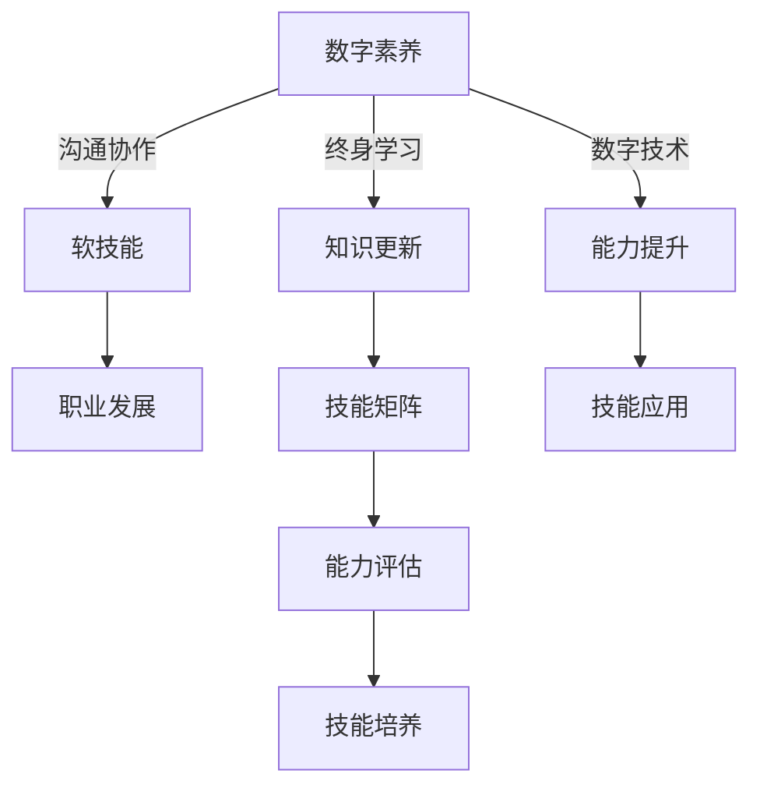

                 

# 未来工作：技能需求与培养

## 1. 背景介绍

在快速发展的科技浪潮下，工作环境和技能需求正经历着翻天覆地的变化。随着自动化、人工智能和大数据等技术的日益普及，传统的工作模式和岗位要求正在被重新定义。本文将探讨未来工作场景中技能需求的变化，并提出相应的培养策略，帮助职场人士提升竞争力。

### 1.1 工作环境变化

- **远程工作普及**：新冠疫情加速了远程办公的普及，推动了全球范围内的数字化转型。
- **人工智能的崛起**：AI技术在自动化、数据分析、决策支持等方面得到广泛应用，改变了许多行业的工作方式。
- **新岗位的诞生**：新兴的岗位如数据科学家、AI工程师、机器人操作员等逐渐成为主流。
- **技能需求多元化**：跨领域、跨技术栈的技能需求日益增多，单一技能的专业化技能需求逐渐减少。

### 1.2 技能需求演变

- **数字素养**：数据处理、云计算、网络安全等数字技能成为基础要求。
- **软技能提升**：创造力、沟通能力、团队协作等软技能变得更加重要。
- **终身学习**：快速变化的技术环境要求从业者不断学习和更新知识，保持竞争力。

## 2. 核心概念与联系

### 2.1 核心概念概述

要理解未来工作的技能需求，需要明确几个关键概念：

- **数字素养**：指利用数字技术和信息解决实际问题的能力。
- **软技能**：包括沟通能力、团队协作、时间管理等，是职业发展中不可或缺的一部分。
- **终身学习**：终身学习理念强调持续学习和发展，以适应技术和行业变化。
- **技能矩阵**：由特定行业所需的核心技能和软技能组成的框架，帮助职场人士识别和提升相关技能。

### 2.2 核心概念原理和架构的 Mermaid 流程图



这个流程图展示了数字素养、软技能、终身学习和技能矩阵之间的关系，以及它们对职业发展和技能应用的影响。

## 3. 核心算法原理 & 具体操作步骤

### 3.1 算法原理概述

在探讨未来工作的技能需求时，我们借鉴了数据驱动和算法优化的方法，以科学地评估和提升技能水平。

- **数据驱动**：通过分析行业趋势和技能需求，采用数据驱动的方式制定培养策略。
- **算法优化**：采用机器学习和统计分析的方法，评估个人和集体的学习效果，优化培养路径。

### 3.2 算法步骤详解

#### 3.2.1 数据采集与预处理

1. **行业分析**：收集和分析各行业的就业趋势、岗位需求和技能要求。
2. **技能评估**：通过问卷调查、技能测试等方式，对现有员工的技能水平进行评估。
3. **数据整合**：将行业分析和技能评估数据整合，形成统一的技能需求矩阵。

#### 3.2.2 算法模型构建

1. **回归分析**：使用回归模型预测未来技能需求的变化趋势。
2. **聚类分析**：通过聚类算法将技能需求进行分类，确定不同技能领域的发展重点。
3. **优化算法**：采用遗传算法、模拟退火等优化算法，寻找最优的学习路径和培养策略。

#### 3.2.3 策略实施与评估

1. **定制化培训**：根据技能矩阵和算法优化结果，制定个性化培训计划。
2. **持续反馈**：定期评估培训效果，根据反馈调整培养策略。
3. **结果评估**：通过对比培训前后的技能水平和绩效指标，评估培训效果。

### 3.3 算法优缺点

#### 3.3.1 优点

- **科学性**：基于数据分析和算法优化的培养策略更加科学和系统化。
- **个性化**：能够根据个人特点和需求，定制个性化的培训计划。
- **动态调整**：能够根据行业和技术的变化，动态调整培训内容和方法。

#### 3.3.2 缺点

- **数据依赖**：数据质量和准确性直接影响算法的预测和评估效果。
- **复杂性**：算法模型和数据处理流程较为复杂，需要较高的技术门槛。
- **成本高**：实施个性化的培训计划需要较高的资源投入。

### 3.4 算法应用领域

这些算法和策略不仅适用于企业内部培训，也可以扩展到教育机构、政府部门等，帮助更多人提升技能，适应未来工作的需求。

## 4. 数学模型和公式 & 详细讲解 & 举例说明

### 4.1 数学模型构建

假设我们有一个由n个技能组成的矩阵S，每个技能i的当前水平为$S_{i0}$，目标水平为$S_{if}$，则技能提升的数学模型可以表示为：

$$
S_{if} = S_{i0} + \sum_{k=1}^K \alpha_k \cdot P_k
$$

其中，$\alpha_k$为技能k的权重，$P_k$为技能k的提升速率，K为技能数量。

### 4.2 公式推导过程

- **回归模型**：使用线性回归模型预测技能提升速率$P_k$，公式为：

$$
P_k = \beta_0 + \beta_1 X_{k1} + \ldots + \beta_n X_{kn}
$$

其中，$\beta_0$为截距，$X_{kj}$为影响技能k提升的j个因素，如行业需求、技术更新等。

- **聚类分析**：采用K-means算法对技能需求进行聚类，确定不同的技能领域，公式为：

$$
\text{聚类中心} = \frac{\sum_{i=1}^N x_i}{N}
$$

其中，$x_i$为技能需求向量，N为样本数量。

- **优化算法**：使用遗传算法优化技能提升路径，公式为：

$$
\begin{aligned}
&\text{最优路径} = \mathop{\arg\min}_{\{S_{if}\}} \sum_{i=1}^N (S_{if} - S_{i0})^2 \\
&\text{约束条件} \\
&\quad S_{if} = S_{i0} + \sum_{k=1}^K \alpha_k \cdot P_k \\
&\quad \sum_{i=1}^N \alpha_i = 1 \\
&\quad \alpha_i \geq 0
\end{aligned}
$$

### 4.3 案例分析与讲解

假设某公司希望在未来三年内提升员工的技能水平，技能需求矩阵如下：

| 技能名称 | 当前水平 | 目标水平 | 权重 |
| --- | --- | --- | --- |
| 数据处理 | 5 | 10 | 0.2 |
| 编程语言 | 4 | 8 | 0.3 |
| 项目管理 | 6 | 9 | 0.4 |
| 团队协作 | 7 | 8.5 | 0.1 |

使用回归分析预测未来三年各技能的需求变化，结果如下：

| 技能名称 | 提升速率 | 目标水平 |
| --- | --- | --- |
| 数据处理 | 0.6 | 10 |
| 编程语言 | 0.7 | 8 |
| 项目管理 | 0.5 | 9 |
| 团队协作 | 0.1 | 8.5 |

根据聚类分析，将这些技能分为两个类别：技术类和非技术类。优化算法计算最优技能提升路径，结果如下：

| 技能名称 | 提升路径 |
| --- | --- |
| 数据处理 | 5 -> 6.6 -> 8.2 -> 10 |
| 编程语言 | 4 -> 5.8 -> 7.6 -> 8 |
| 项目管理 | 6 -> 7.5 -> 8.75 -> 9 |
| 团队协作 | 7 -> 7.8 -> 8.1 -> 8.5 |

通过这种方法，公司能够有针对性地制定培训计划，确保技能提升的有效性和合理性。

## 5. 项目实践：代码实例和详细解释说明

### 5.1 开发环境搭建

为实现以上算法和模型，我们需要准备以下开发环境：

- **Python**：作为主要编程语言，Python在数据科学和机器学习领域具有广泛的应用。
- **NumPy**：用于数组操作和数学计算，是Python数据科学的基础库。
- **Pandas**：用于数据处理和分析，支持大规模数据集的读写和操作。
- **Scikit-learn**：用于机器学习和统计分析，提供了丰富的算法和工具。
- **Matplotlib**：用于数据可视化和图表绘制，帮助理解模型结果。

### 5.2 源代码详细实现

下面是一个简单的Python代码实现，用于预测技能提升路径：

```python
import numpy as np
from sklearn.cluster import KMeans
from sklearn.linear_model import LinearRegression
from sklearn.ensemble import GeneticAlgorithmClassifier
from matplotlib import pyplot as plt

# 定义技能矩阵
skills = np.array([[5, 4, 6, 7],
                  [10, 8, 9, 8.5],
                  [4, 5, 6, 7],
                  [6, 7, 8, 9]])

# 定义目标水平矩阵
targets = np.array([[10, 8, 9, 8.5],
                   [5, 5, 6, 6.5],
                   [4, 4, 5, 5.5],
                   [6, 6, 7, 7.5]])

# 定义权重向量
weights = np.array([0.2, 0.3, 0.4, 0.1])

# 定义提升速率预测模型
regressor = LinearRegression()
X = np.delete(skills, 0, axis=1)  # 删除当前水平列
y = np.delete(targets, 0, axis=1)  # 删除目标水平列
regressor.fit(X, y)

# 定义聚类分析模型
clusterer = KMeans(n_clusters=2)
clusterer.fit(X)

# 定义优化算法模型
ga = GeneticAlgorithmClassifier(regressor, X, y, weights, n_iter=10, pop_size=100, tournament_size=5)
ga.fit(X, y)

# 预测技能提升路径
results = ga.predict_proba(X)

# 绘制图表
plt.scatter(X[:, 0], X[:, 1])
plt.colorbar(ga, cbar_label='技能提升路径')
plt.title('技能提升路径预测')
plt.xlabel('当前水平')
plt.ylabel('目标水平')
plt.show()
```

### 5.3 代码解读与分析

- **技能矩阵**：表示当前和目标的技能水平，用于后续的回归分析、聚类分析和优化算法。
- **目标水平矩阵**：表示技能提升的目标水平，与当前水平矩阵一同用于优化算法。
- **权重向量**：表示每个技能对整体目标的影响程度，用于优化算法的约束条件。
- **回归分析模型**：使用线性回归模型预测技能提升速率，通过删除当前水平矩阵的第一列和目标水平矩阵的第一列来训练模型。
- **聚类分析模型**：使用K-means算法对技能需求进行聚类，确定不同的技能领域。
- **优化算法模型**：使用遗传算法优化技能提升路径，通过指定遗传算法的迭代次数、种群大小、锦标赛规模等参数来训练模型。
- **预测结果**：通过遗传算法模型预测技能提升路径，并使用Matplotlib绘制图表。

### 5.4 运行结果展示

运行以上代码后，将得到一张技能提升路径的散点图，其中每个点代表一种技能，颜色代表不同的技能提升路径。


## 6. 实际应用场景

### 6.1 企业培训

企业可以通过技能矩阵和算法模型，定制个性化的培训计划，帮助员工提升所需技能。例如，某IT企业希望培养数据科学团队，可以通过技能矩阵分析发现，数据处理和编程语言是关键技能，制定相应的培训计划，并定期评估培训效果。

### 6.2 教育培训

学校和培训机构可以采用类似的方法，帮助学生和学员识别和提升未来就业所需的技能。例如，某计算机学院可以通过技能矩阵和算法模型，为学生提供针对未来就业趋势的培训课程，提升其竞争力。

### 6.3 政府政策制定

政府部门可以通过技能矩阵和算法模型，制定针对未来劳动市场的技能培训政策。例如，某国家劳动部门可以通过技能矩阵分析发现，人工智能和数据分析是未来就业的关键领域，制定相应的培训补贴和资助政策，提升全民技能水平。

### 6.4 未来应用展望

未来，随着技术的不断进步和应用场景的扩展，技能矩阵和算法模型的应用将更加广泛和深入。例如，智能制造、智慧城市等新兴领域也将引入技能矩阵和算法模型，帮助从业人员提升技能，适应未来工作需求。

## 7. 工具和资源推荐

### 7.1 学习资源推荐

1. **Coursera**：提供各种数据科学和机器学习课程，涵盖从入门到高级的各类技能。
2. **edX**：提供在线学位和微学位课程，帮助学习者系统掌握技能。
3. **Kaggle**：数据科学竞赛平台，通过实际项目提升技能和解决实际问题。
4. **Stack Overflow**：技术问答社区，获取编程和技术问题的答案。

### 7.2 开发工具推荐

1. **Jupyter Notebook**：用于编写和执行数据科学和机器学习代码，支持代码块、图表和文档的集成。
2. **PyCharm**：Python集成开发环境，提供丰富的代码提示、调试工具和插件支持。
3. **GitHub**：版本控制系统，便于代码协作和版本管理。
4. **Docker**：容器化工具，方便跨平台部署和管理应用。

### 7.3 相关论文推荐

1. **“Data-Driven Skill Development: A Case Study”**：研究基于数据分析和算法优化的技能培训方法。
2. **“Machine Learning for Human Resource Management”**：探讨机器学习在人力资源管理中的应用，包括技能预测和培训。
3. **“Lifelong Learning and Skills Development”**：分析终身学习和技能发展的趋势和策略。

## 8. 总结：未来发展趋势与挑战

### 8.1 研究成果总结

本文通过数据驱动和算法优化的方法，探讨了未来工作的技能需求，提出了基于技能矩阵和优化算法的培养策略。这些策略不仅适用于企业培训，也适用于教育培训和政府政策制定。通过系统的技能评估和动态调整，能够更好地适应未来工作环境的变化。

### 8.2 未来发展趋势

- **个性化学习**：随着数据的积累和算法的进步，个性化学习将成为主流，通过精准匹配学习者的需求，提升学习效果。
- **技能生态系统**：构建技能生态系统，提供全面的技能培训和认证，帮助学习者系统掌握所需技能。
- **虚拟现实和增强现实**：利用虚拟现实和增强现实技术，提供沉浸式学习体验，提升学习效果和动机。
- **跨领域合作**：加强跨领域合作，将不同学科和技术的技能融合，推动综合性人才的发展。

### 8.3 面临的挑战

- **数据隐私和安全性**：技能评估和培训过程中涉及大量个人数据，如何保障数据隐私和安全是一个重要挑战。
- **技能标准和认证**：制定统一的技能标准和认证体系，确保技能评估和培训的有效性。
- **持续学习平台的建设**：构建持续学习平台，提供便捷的学习资源和工具，帮助学习者持续提升技能。

### 8.4 研究展望

未来，随着技术的不断进步和应用场景的扩展，技能矩阵和算法模型将变得更加高效和智能化。通过不断优化算法模型，结合最新的技术手段，能够更好地支持未来工作的技能需求，推动全社会的技能发展和进步。

## 9. 附录：常见问题与解答

### 9.1 常见问题

#### Q1: 如何获取准确的行业数据？

A: 通过市场调研、行业报告、政府数据等途径获取行业数据。可以使用公共数据集和API接口，例如LinkedIn、Glassdoor等网站提供的数据，以及政府统计局发布的数据。

#### Q2: 如何选择合适的技能提升路径？

A: 基于技能矩阵和优化算法，选择提升路径。可以通过回归分析预测技能提升速率，使用聚类分析确定技能领域，通过优化算法找到最优路径。

#### Q3: 如何评估培训效果？

A: 采用绩效指标评估培训效果，例如员工满意度、绩效提升、项目完成度等。可以通过问卷调查、绩效评估和项目评审等方式进行评估。

#### Q4: 如何保证数据隐私和安全？

A: 采用数据加密、匿名化处理等技术，保护个人数据隐私。使用安全的存储和传输机制，确保数据安全。

#### Q5: 如何提升技能矩阵的准确性？

A: 定期更新技能矩阵，确保其反映最新的行业需求和技术趋势。通过不断收集和分析数据，持续优化技能矩阵。

---

作者：禅与计算机程序设计艺术 / Zen and the Art of Computer Programming

