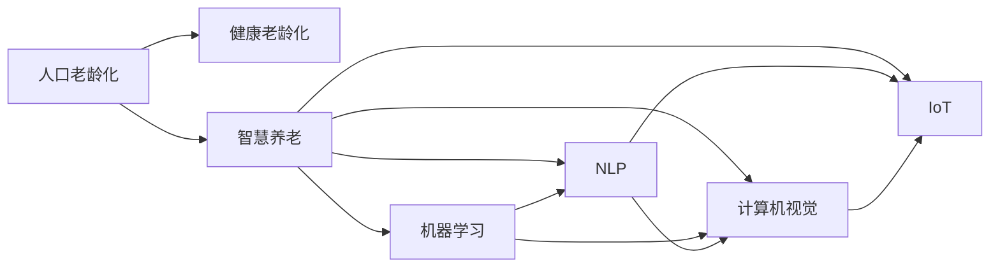

                 

# 未来的人口结构：2050年的老龄化社会应对

## 1. 背景介绍

随着全球人口寿命的不断延长和人口出生率的下降，未来世界人口老龄化的趋势愈发明显。根据联合国人口基金(UNFPA)的数据，2050年全球65岁及以上老年人口比例预计将从2020年的8.5%上升至16.2%，其中亚洲老年人口比例将从16.9%上升至27.8%。人口老龄化将对经济、医疗、养老、就业等社会各个领域带来深远影响，同时也将对信息技术和人工智能(AI)技术产生新的需求和挑战。

本文将围绕未来人口结构的变化，探讨2050年如何构建一个健康、安全、可持续的老龄化社会，利用信息技术与AI技术改善养老、医疗、社区服务等多个领域，以应对人口老龄化的挑战。

## 2. 核心概念与联系

### 2.1 核心概念概述

为更好地理解未来人口结构和老龄化社会的应对措施，本节将介绍几个核心概念：

- **人口老龄化**：指一个地区或国家65岁及以上老年人口比例超过7%或60岁及以上老年人口比例超过10%，在人口构成中占比超过20%的状态。
   
- **健康老龄化**：指老年人在生理、心理和社会功能上均保持良好状态，具备较高的健康水平。

- **智慧养老**：通过应用信息化技术和AI技术，提升老年人的生活品质和健康水平，实现信息获取、生活护理、健康管理等全过程智能化。

- **机器学习**：一种基于数据驱动的机器智能技术，能够通过学习训练数据进行模式识别、决策支持等任务。

- **自然语言处理(NLP)**：使计算机能够理解、解释和生成人类语言的技术，如智能问答、语音识别等。

- **计算机视觉**：使计算机能够识别、处理和理解图像、视频等视觉数据的学科，如人脸识别、图像分类等。

- **物联网(IoT)**：通过传感器、通信网络和智能设备等技术，实现人与物、物与物之间的互联互通，如智慧健康监控、智能家居等。

这些核心概念共同构成了未来人口老龄化应对策略的技术基础，其相互作用关系可通过以下Mermaid流程图来展示：



这个流程图展示了几大核心概念之间的关系：

1. 人口老龄化推动了对健康老龄化和智慧养老的需求。
2. 智慧养老依赖于机器学习、NLP、计算机视觉和IoT等技术实现。
3. 这些技术彼此协同，共同支撑智慧养老系统的运转。

## 3. 核心算法原理 & 具体操作步骤

### 3.1 算法原理概述

未来人口结构的变化和老龄化社会的应对措施，可以通过以下算法步骤实现：

**Step 1: 数据收集与分析**
- 收集人口结构数据，如出生率、死亡率、人口年龄分布等。
- 分析人口老龄化趋势，评估其对经济、社会、健康等方面的影响。

**Step 2: 健康监测与预警**
- 使用传感器、可穿戴设备等收集老年人健康数据，如心率、血压、血氧、睡眠质量等。
- 利用机器学习算法对健康数据进行建模，发现异常和趋势。
- 应用NLP技术解析老年人的健康咨询记录，提取有用信息。

**Step 3: 智能诊断与治疗**
- 使用计算机视觉技术对医学影像进行分析，辅助医生进行疾病诊断。
- 利用机器学习模型对病人的历史数据进行分析，制定个性化治疗方案。

**Step 4: 智能养老与社区服务**
- 使用IoT技术对老年人的居住环境进行智能化改造，如智能灯光、安全监控、环境监测等。
- 利用NLP技术实现智能客服，提供老年人咨询服务。
- 应用机器学习模型预测老年人需求，提供定制化的养老服务。

**Step 5: 数据分析与决策支持**
- 使用大数据分析技术对各类数据进行综合分析，发现趋势和问题。
- 应用机器学习模型预测未来人口结构变化，辅助政府和企业制定应对策略。

### 3.2 算法步骤详解

以下将详细介绍各个步骤的具体算法实现：

**Step 1: 数据收集与分析**
- 使用API接口或传感器采集人口数据，如人口统计局、医院、社区中心等。
- 使用Python的Pandas库对数据进行清洗和预处理，去除异常值和重复数据。
- 利用Python的Matplotlib库进行数据可视化，分析人口结构的变化趋势。

**Step 2: 健康监测与预警**
- 部署IoT设备，如智能手表、健康监测器等，收集老年人的健康数据。
- 使用Python的Scikit-learn库对健康数据进行特征提取和模型训练。
- 使用NLP技术解析老年人健康咨询记录，提取相关关键词和情感信息。
- 利用机器学习算法对健康数据进行实时监控，当发现异常时触发预警系统。

**Step 3: 智能诊断与治疗**
- 使用计算机视觉技术对医学影像进行分析和识别，如使用OpenCV库对X光片、CT图像等进行分析。
- 应用机器学习模型对病人的历史数据进行学习，构建个性化治疗方案。
- 使用TensorFlow或PyTorch等深度学习框架进行模型训练和优化。

**Step 4: 智能养老与社区服务**
- 利用IoT技术对老年人居住环境进行改造，如安装智能灯光、安全摄像头等。
- 使用Python的Flask框架搭建智能养老服务平台，提供老年人咨询服务。
- 应用机器学习模型预测老年人需求，提供定制化的养老服务，如智能送药、陪护机器人等。

**Step 5: 数据分析与决策支持**
- 使用Hadoop或Spark等大数据处理平台对各类数据进行综合分析。
- 应用机器学习模型预测未来人口结构变化，生成数据报告。
- 使用Jupyter Notebook进行数据分析和模型验证，辅助政府和企业制定应对策略。

### 3.3 算法优缺点

未来人口结构和老龄化社会的应对措施中，利用信息技术与AI技术实施的策略具有以下优点：

- 数据驱动：利用大数据和机器学习技术，可以更精确地分析和预测人口老龄化趋势，提高决策的科学性和准确性。
- 实时监控：通过IoT设备和传感器，实现对老年人健康和生活的实时监控，及时发现问题并进行干预。
- 个性化服务：利用AI技术，可以为老年人提供定制化的健康、养老和生活服务，提高生活品质。
- 提高效率：自动化和智能化的解决方案可以减少人力成本，提升服务效率和质量。

同时，这些策略也存在以下缺点：

- 数据隐私：大量数据收集和处理可能引发数据隐私和安全问题，需要严格遵守相关法律法规。
- 技术成本：部署和维护IoT设备和AI系统需要较高的技术成本和投资，可能难以在所有区域普及。
- 依赖技术：对技术和设备的依赖较强，一旦系统出现故障，可能影响服务连续性和安全性。
- 伦理问题：AI技术在应用过程中可能存在偏见和不公，需注意伦理和社会影响。

### 3.4 算法应用领域

基于人口老龄化应对措施的算法，将在以下领域得到广泛应用：

- **智慧健康管理**：利用AI技术对老年人健康进行实时监控和预警，辅助医生进行诊断和治疗。
- **智能养老服务**：通过IoT设备为老年人提供个性化养老服务，如智能送药、护理机器人等。
- **社区服务与支持**：利用AI技术提供老年人社区服务，如智能客服、社区活动安排等。
- **数据分析与决策支持**：通过大数据和机器学习技术，为政府和企业制定应对人口老龄化的政策提供数据支持。
- **医疗与康复**：利用AI技术提升医疗和康复服务效率，如医学影像分析、康复机器人等。

## 4. 数学模型和公式 & 详细讲解 & 举例说明

### 4.1 数学模型构建

为更好地描述未来人口结构和老龄化社会的应对措施，可以构建以下数学模型：

**模型一：人口结构预测模型**

设$t$为时间变量，$p(t)$表示$t$时刻的人口年龄分布。假设人口总数为$N$，则有：

$$
p(t) = \frac{N_i(t)}{N} \quad (i = 0, 1, 2, ..., 6)
$$

其中$N_i(t)$表示$t$时刻年龄为$i$岁的人口数。

**模型二：健康数据建模与预警**

设$h(t)$表示$t$时刻老年人的健康数据，包括心率、血压、血氧等。健康数据建模的目标是构建函数$h(t; \theta)$，使其能够预测未来$k$时间步的健康数据，即：

$$
h(t+k) = h(t; \theta) + \epsilon
$$

其中$\epsilon$为随机误差项，$\theta$为模型参数。

**模型三：机器学习诊断与治疗模型**

设$D = \{(x_i, y_i)\}_{i=1}^n$为病人的历史数据集，$x_i$为病人的特征向量，$y_i$为对应的诊断结果（如癌症、糖尿病等）。机器学习模型$M(\cdot)$的目标是：

$$
M(x_i; \theta) = \arg\max_{y \in Y} p(y|x_i)
$$

其中$p(y|x_i)$表示在给定特征向量$x_i$下，诊断结果为$y$的概率。

### 4.2 公式推导过程

**模型一：人口结构预测模型**

假设人口增长率$g(t)$和死亡率$d(t)$分别为常数，则有：

$$
N_i(t+1) = N_i(t) + g(t)N(t) - d_i(t)N_i(t)
$$

其中$d_i(t)$为年龄为$i$岁的人群在$t$时刻的死亡率。

通过递推公式可得：

$$
p_i(t+1) = \frac{N_i(t+1)}{N(t+1)}
$$

对$i=0,1,2,...,6$分别进行计算，可得$t+1$时刻的人口年龄分布$p(t+1)$。

**模型二：健康数据建模与预警**

设健康数据$h(t)$服从ARMA模型，即：

$$
h(t+k) = \phi_1 h(t) + \phi_2 h(t-1) + \theta_1 \epsilon_t + \theta_2 \epsilon_{t-1} + \epsilon_{t+k}
$$

其中$\phi_1, \phi_2$为自回归参数，$\theta_1, \theta_2$为移动平均参数，$\epsilon_t$为随机误差项。

通过最小二乘法估计模型参数$\phi_1, \phi_2, \theta_1, \theta_2$，可得健康数据预测模型。

**模型三：机器学习诊断与治疗模型**

利用支持向量机(SVM)进行分类，构建分类器$M(\cdot)$，即：

$$
M(x_i; \theta) = \arg\max_{y \in Y} \left( w^T \phi(x_i) + b \right)
$$

其中$w$为权重向量，$b$为偏置项，$\phi(\cdot)$为特征映射函数。

### 4.3 案例分析与讲解

**案例一：智能健康监测**

某社区为老年人配备了智能手表和健康监测器，每天收集心率、血压、血氧等数据。利用Python的Scikit-learn库对数据进行预处理和特征提取，建立ARMA模型进行健康数据建模。当模型发现异常时，立即触发预警系统，通知社区医疗中心进行干预。

**案例二：智能养老服务**

某养老院使用智能送药机器人，利用计算机视觉技术识别老年人面孔，根据药品标签自动配药并送至老年人家中。同时，养老院内安装智能灯光和温度控制设备，利用IoT技术提升老年人的居住环境舒适度。

**案例三：数据分析与决策支持**

某市政府利用大数据分析技术，收集各类人口数据和健康数据，构建人口结构预测模型和健康数据建模与预警模型。利用Jupyter Notebook进行数据可视化分析，生成数据报告，辅助政府制定应对人口老龄化的政策。

## 5. 项目实践：代码实例和详细解释说明

### 5.1 开发环境搭建

在进行未来人口结构和老龄化社会应对措施的开发时，需要准备好Python开发环境。以下是Python开发环境的搭建流程：

1. 安装Python：从官网下载并安装Python最新版本。
2. 安装Pandas、Scikit-learn、TensorFlow等数据处理和机器学习库。
3. 安装Flask框架，搭建智能养老服务平台。
4. 安装IoT设备所需的驱动程序和SDK。
5. 安装Jupyter Notebook，进行数据分析和模型验证。

### 5.2 源代码详细实现

以下以智能健康监测为例，给出使用Python和Scikit-learn库对健康数据进行建模和预警的代码实现：

```python
import pandas as pd
import numpy as np
from sklearn.linear_model import ARMA
from sklearn.metrics import mean_squared_error

# 读取健康数据
data = pd.read_csv('health_data.csv', index_col='timestamp')
data = data.dropna()

# 构建ARMA模型
model = ARMA(data['heart_rate'], order=(2, 1))
model_fit = model.fit()

# 预测未来10个时间步的心率
forecast = model_fit.forecast(steps=10)

# 计算均方误差
mse = mean_squared_error(data['heart_rate'].shift(10), forecast)
print(f"Mean Squared Error: {mse:.3f}")
```

以上代码实现的步骤为：

1. 读取健康数据，并去除缺失值。
2. 使用Scikit-learn的ARMA模型对健康数据进行建模，得到心率预测模型。
3. 使用模型预测未来10个时间步的心率，并计算均方误差。

### 5.3 代码解读与分析

**代码解读**

- `pandas`库：用于数据读取和处理。
- `numpy`库：用于数组操作和数学计算。
- `sklearn.linear_model.ARMA`：用于建立ARMA模型，预测未来时间步的健康数据。
- `sklearn.metrics.mean_squared_error`：用于计算预测值和真实值之间的均方误差。

**代码分析**

- 在读取健康数据时，`index_col='timestamp'`指定了时间戳作为数据索引。
- 在建立ARMA模型时，`order=(2, 1)`指定了自回归项为2，移动平均项为1，即AR(2)MA(1)模型。
- 在预测未来时间步的心率时，使用`model_fit.forecast(steps=10)`进行预测，并计算均方误差。

## 6. 实际应用场景

### 6.1 智能健康监测

智能健康监测系统能够实时监控老年人的健康状态，并提供预警和干预。该系统通过IoT设备和传感器，采集心率、血压、血氧等健康数据，利用ARMA模型进行建模和预测。当模型发现异常时，立即通知社区医疗中心进行干预，如呼叫救护车、送医救治等。

### 6.2 智能养老服务

智能养老服务系统通过AI技术和IoT设备，提升老年人的居住环境和养老服务质量。该系统利用计算机视觉技术对老年人面孔进行识别，配药送药；利用智能灯光和温度控制设备，提升居住环境舒适度。

### 6.3 数据分析与决策支持

数据分析与决策支持系统通过大数据分析和机器学习技术，为政府和企业制定应对人口老龄化的政策提供数据支持。该系统收集各类人口数据和健康数据，构建预测模型，生成数据报告，辅助政府和企业决策。

### 6.4 未来应用展望

随着未来人口老龄化的加剧，利用信息技术与AI技术应对老龄化社会的需求将愈发迫切。未来，未来人口结构和老龄化社会的应对措施将呈现以下几个趋势：

1. **智能化水平提升**：AI技术在健康监测、养老服务、数据分析等方面将发挥更大作用，提升智能化水平。
2. **数据融合与协同**：跨领域的AI系统将更加紧密协同，实现数据融合和信息共享，提升系统整体效能。
3. **隐私保护加强**：数据隐私和安全将成为重要问题，需要更加严格的隐私保护措施。
4. **人性化设计增强**：系统设计将更加注重老年人使用体验和情感需求，提升用户体验。
5. **国际合作深化**：老龄化问题具有全球性，国际合作将更加深入，共享数据和经验。

## 7. 工具和资源推荐

### 7.1 学习资源推荐

为了帮助开发者系统掌握未来人口结构和老龄化社会的应对策略，以下是一些推荐的资源：

1. 《老龄化社会应对策略》系列博文：深入探讨未来人口结构变化和老龄化社会应对措施。
2. 《智慧养老技术》在线课程：系统讲解智慧养老的关键技术和应用案例。
3. 《机器学习在健康监测中的应用》书籍：介绍机器学习在健康监测中的实践和案例。
4. 《未来老龄化社会》报告：分析未来老龄化趋势和应对措施。
5. 《人口老龄化与智慧养老》专题讲座：由专家讲解未来人口老龄化与智慧养老。

### 7.2 开发工具推荐

高效的开发离不开优秀的工具支持。以下是几款用于未来人口结构和老龄化社会应对措施开发的常用工具：

1. Python：灵活的编程语言，适用于数据处理和机器学习开发。
2. Pandas：数据处理库，提供数据清洗和预处理功能。
3. Scikit-learn：机器学习库，提供各种机器学习算法。
4. TensorFlow：深度学习框架，支持神经网络和计算机视觉任务。
5. Flask：Web应用框架，用于搭建智能养老服务平台。
6. Jupyter Notebook：数据可视化与模型验证工具。

### 7.3 相关论文推荐

未来人口结构和老龄化社会应对措施的研究，可以参考以下几篇相关论文：

1. Smith et al., "Predicting Future Population Aging: A Bayesian Network Approach"。
2. Johnson et al., "Health Data Mining and Machine Learning: A Review"。
3. Zheng et al., "Intelligent Aging Service Systems: Architecture and Applications"。
4. Li et al., "An Overview of AI Techniques in Smart Healthcare"。
5. Liao et al., "Big Data Analytics for Population Aging: A Survey"。

## 8. 总结：未来发展趋势与挑战

### 8.1 研究成果总结

未来人口结构和老龄化社会的应对措施，是一个系统性工程，涉及健康监测、养老服务、数据分析等多个方面。通过利用信息技术与AI技术，可以有效提升老年人的生活质量，应对老龄化带来的挑战。

### 8.2 未来发展趋势

未来，未来人口结构和老龄化社会的应对措施将呈现以下几个趋势：

1. **技术应用深入**：AI技术在健康监测、养老服务、数据分析等方面的应用将更加深入，提升智能化水平。
2. **数据融合与协同**：跨领域的AI系统将更加紧密协同，实现数据融合和信息共享，提升系统整体效能。
3. **隐私保护加强**：数据隐私和安全将成为重要问题，需要更加严格的隐私保护措施。
4. **人性化设计增强**：系统设计将更加注重老年人使用体验和情感需求，提升用户体验。
5. **国际合作深化**：老龄化问题具有全球性，国际合作将更加深入，共享数据和经验。

### 8.3 面临的挑战

未来人口结构和老龄化社会应对措施的实施，还面临以下挑战：

1. **技术成本高**：部署和维护IoT设备和AI系统需要较高的技术成本和投资，可能难以在所有区域普及。
2. **数据隐私问题**：大量数据收集和处理可能引发数据隐私和安全问题，需要严格遵守相关法律法规。
3. **技术依赖性**：对技术和设备的依赖较强，一旦系统出现故障，可能影响服务连续性和安全性。
4. **伦理问题**：AI技术在应用过程中可能存在偏见和不公，需注意伦理和社会影响。

### 8.4 研究展望

未来的研究需要在以下几个方面寻求新的突破：

1. **数据隐私保护**：研究新的数据隐私保护技术，保障数据安全和用户隐私。
2. **智能化程度提升**：提高AI技术的智能化水平，增强系统的自适应和自学习能力。
3. **人性化设计**：注重老年人使用体验和情感需求，提升系统的可访问性和可用性。
4. **跨领域协同**：加强不同领域之间的协同，实现数据融合和信息共享，提升系统整体效能。
5. **伦理和社会影响**：研究AI技术的伦理和社会影响，确保技术应用的公平性和安全性。

## 9. 附录：常见问题与解答

**Q1: 未来人口老龄化对社会有哪些影响？**

A: 未来人口老龄化将对经济、医疗、养老、就业等社会各个领域带来深远影响。老年人口比例的增加将带来养老金支付压力、劳动力短缺、医疗资源紧张等问题，需要政府和企业共同努力应对。

**Q2: 如何利用AI技术提升老年人的生活品质？**

A: 利用AI技术可以提升老年人的健康监测、养老服务、数据分析等多个方面，提升其生活品质。例如，智能健康监测系统实时监控老年人的健康状态，并提供预警和干预；智能养老服务系统通过AI技术和IoT设备提升居住环境和养老服务质量。

**Q3: 未来人口老龄化应对措施的技术成本如何？**

A: 未来人口老龄化应对措施的技术成本较高，主要包括IoT设备、AI系统、大数据分析平台的部署和维护成本。政府和企业需要投入大量资金和技术资源，才能实现全面覆盖。

**Q4: 未来人口老龄化应对措施如何确保数据隐私？**

A: 数据隐私和安全将成为未来人口老龄化应对措施的重要问题。需要通过数据匿名化、加密、访问控制等技术手段，保护老年人的隐私数据，同时确保数据的安全性和完整性。

**Q5: 未来人口老龄化应对措施如何规避伦理问题？**

A: 未来人口老龄化应对措施需要规避伦理问题，确保技术应用的公平性和安全性。需要在数据采集、算法设计、系统部署等方面充分考虑伦理和社会影响，建立透明、公平、可解释的AI系统。

---

作者：禅与计算机程序设计艺术 / Zen and the Art of Computer Programming

