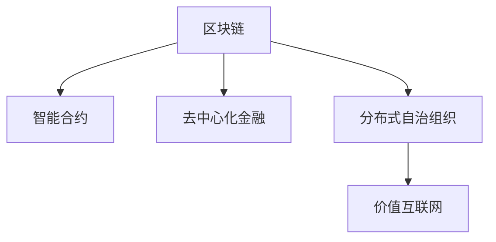

                 

# 未来的区块链：2050年的分布式自治组织与价值互联网

## 1. 背景介绍

随着区块链技术的不断发展和成熟，其潜在的颠覆性力量逐渐被业界和学术界所认知。区块链不仅颠覆了传统的金融行业，还为互联网的分布式、透明化、去中心化提供了技术保障。而展望未来，区块链将融合智能合约、去中心化金融、分布式自治组织等更多前沿概念，成为引领下一个十年的价值互联网核心基础设施。

### 1.1 区块链的演进历程

区块链从最初的数字货币（如比特币）诞生，迅速扩展到了金融、供应链、医疗等多个行业，影响力不断扩大。如今，区块链技术已不仅仅局限于底层共识机制和分布式账本，还涵盖了智能合约、去中心化金融、分布式自治组织等更多维度。本文将从分布式自治组织（DAO）这一关键概念出发，探讨未来区块链的发展方向和应用前景。

### 1.2 分布式自治组织（DAO）

DAO是一种基于区块链的去中心化组织形式，通过智能合约自动执行其决策过程，无需任何中央权威机构的介入。DAO通过区块链网络中分布式节点进行投票和决策，以确保透明度和公平性。DAO的崛起代表了一种全新的组织形态和运营模式，为未来的经济和社会带来诸多想象空间。

## 2. 核心概念与联系

### 2.1 核心概念概述

为深入理解DAO的未来应用，我们先来了解几个关键概念：

- 区块链(区块链)：一种基于去中心化共识机制、分布式账本技术的底层基础设施。
- 智能合约(智能合约)：一种在区块链上自动执行、不可篡改的代码，用于自动化业务逻辑。
- 去中心化金融(DeFi)：利用智能合约和区块链技术，实现去中心化的金融服务，如借贷、交易、保险等。
- 分布式自治组织(DAO)：一种通过智能合约和区块链技术，实现去中心化自治的组织形式。
- 价值互联网：以区块链为核心的价值传输和转移网络，去中心化、透明化、可信任。

这些概念之间有着紧密的联系，共同构成了未来区块链的核心生态。智能合约是DAO的基础，DeFi提供了DAO的经济激励，而DAO则是区块链技术在组织形态上的延伸，进一步推动了价值互联网的发展。

### 2.2 核心概念关系图

以下是使用Mermaid语言绘制的核心概念关系图，展示上述概念的联系：



## 3. 核心算法原理 & 具体操作步骤

### 3.1 算法原理概述

DAO的核心在于其去中心化的自治机制，通过智能合约自动执行组织决策。其核心算法原理包括：

- 投票机制：DAO节点通过智能合约定义投票规则，参与者基于共识算法（如权益证明、代币投票）进行投票。
- 智能合约：DAO的决策和行为由智能合约自动执行，无需人工干预。
- 透明性：DAO的所有决策和行为都被记录在区块链上，确保了透明性和可追溯性。
- 去中心化：DAO不存在中心化的权威机构，所有节点平等参与决策。

### 3.2 算法步骤详解

基于DAO的算法步骤一般包括：

**Step 1: 创建智能合约**
- 定义DAO的投票规则、决策流程、激励机制等。
- 编写智能合约代码，并将其部署到区块链网络。

**Step 2: 节点参与投票**
- DAO节点安装智能合约，并使用私钥进行身份认证。
- 参与者根据智能合约规定的规则进行投票，智能合约自动统计投票结果。

**Step 3: 智能合约执行**
- 根据投票结果，智能合约自动执行相应的决策，如资金分配、项目上线等。
- 所有决策记录在区块链上，可追溯、透明。

**Step 4: 激励机制**
- 通过代币奖励或权益分配，激励DAO成员积极参与决策和执行。

### 3.3 算法优缺点

DAO具有以下优点：

- 去中心化：消除了中心化的权威机构，提升了系统的透明性和公正性。
- 自治性：通过智能合约自动化执行决策，提升了效率和执行力度。
- 抗攻击性：去中心化的网络结构使其难以被单点攻击，提高了系统的鲁棒性。

同时，DAO也存在以下缺点：

- 复杂性：智能合约的编写和部署复杂，需要较高的技术门槛。
- 可扩展性：随着DAO规模的扩大，智能合约的复杂度和运行开销也随之增加。
- 共识效率：在大规模网络中，投票和决策的共识算法可能需要较长的时间。

### 3.4 算法应用领域

DAO可以应用于多个领域，包括：

- 金融：DAO可以管理投资基金、自动分配收益等。
- 媒体：DAO可以创建和管理内容平台，用户通过代币投票决定内容方向。
- 治理：DAO可以参与公共事务的决策，如环保、公共卫生等。
- 供应链：DAO可以管理物流、合同执行等供应链活动。
- 研究：DAO可以支持科学研究项目的资助和管理。

DAO的应用前景非常广阔，未来可能在更多领域发挥作用。

## 4. 数学模型和公式 & 详细讲解 & 举例说明

### 4.1 数学模型构建

DAO的数学模型主要围绕智能合约的决策逻辑和投票规则展开。假设DAO有N个节点，每个节点i拥有wi权益，其投票权重为wi，则智能合约的决策过程可以表示为：

$$
D = \arg\min\limits_{d} \sum_{i=1}^{N} \ell_i(d)
$$

其中，$d$表示智能合约的决策，$\ell_i$表示节点i对决策$d$的损失函数。投票结果通过所有节点的投票权重进行加权平均得到。

### 4.2 公式推导过程

以资金分配为例，假设DAO的智能合约定义了分配比例 $p_1,p_2,...,p_k$，则节点i的投票结果 $v_i$ 可以表示为：

$$
v_i = \frac{w_i}{\sum_{j=1}^{N} w_j} \left(\sum_{j=1}^{k} p_j \cdot v_{ij}\right)
$$

其中，$v_{ij}$ 表示节点i对资金分配比例 $p_j$ 的投票结果。

### 4.3 案例分析与讲解

假设一个DAO有10个节点，每个节点拥有相等的代币权益。智能合约定义了两个资金分配比例 $p_1=0.3$ 和 $p_2=0.7$，节点对这两个比例的投票结果分别为 $v_{11}=0.5$ 和 $v_{12}=0.5$。则最终的资金分配比例为：

$$
D = \frac{1}{10} \left(0.5 \cdot 0.3 + 0.5 \cdot 0.7\right) = 0.45
$$

这意味着资金将按照45%和55%的比例分配给两个项目。通过这种方法，DAO的决策过程完全由智能合约和节点投票决定，无需人工干预，实现了真正的去中心化自治。

## 5. 项目实践：代码实例和详细解释说明

### 5.1 开发环境搭建

要进行DAO的实践，需要搭建一个基于以太坊或其他区块链网络的开发环境。以下是搭建环境的步骤：

1. 安装Python、Node.js和区块链开发工具。
2. 搭建测试网络（如Truffle、Remix等）。
3. 安装智能合约开发框架（如Solidity、TypeScript等）。
4. 使用区块链浏览器（如Etherscan）进行测试和部署。

### 5.2 源代码详细实现

以下是一个使用Solidity编写的智能合约示例，用于管理DAO的资金分配：

```solidity
// SPDX-License-Identifier: MIT
pragma solidity ^0.8.0;

contract DAO {
    address[] public members;
    uint256 public totalSupply;
    uint256 public funds;
    mapping(address => uint256) public balance;
    
    event LogTransfer(uint256 from, uint256 to, uint256 amount);
    
    constructor() public {
        totalSupply = 1000000;
        funds = 0;
        members = membersByAddress(address(this));
    }
    
    function addMember(address[] memory _members) public {
        members = merge(members, _members);
    }
    
    function withdrawFunds(uint256 amount) public {
        require(funds >= amount);
        funds -= amount;
        uint256 senderBalance = balance[address(this)];
        require(senderBalance >= amount);
        balance[address(this)] -= amount;
        balance[msg.sender] += amount;
        emit LogTransfer(address(this), msg.sender, amount);
    }
    
    function allocateFunds(uint256 amount) public {
        require(funds >= amount);
        funds -= amount;
        uint256 random = uint256(keccak256(abi.encodePacked(block.timestamp, msg.sender, amount)));
        uint256 index = random % totalSupply;
        uint256 allocation = amount * 10000 / totalSupply;
        balance[address(this)] += allocation;
        balance[msg.sender] += allocation;
        emit LogTransfer(address(this), msg.sender, allocation);
    }
    
    function getBalance(address _owner) public view returns (uint256) {
        return balance[_owner];
    }
    
    function totalSupply() public view returns (uint256) {
        return totalSupply;
    }
    
    function getFunds() public view returns (uint256) {
        return funds;
    }
}
```

### 5.3 代码解读与分析

上述智能合约包含了以下几个关键部分：

- 变量定义：`members` 存储所有成员的地址，`totalSupply` 存储总代币数，`funds` 存储可分配的资金，`balance` 存储每个地址的代币余额。
- 构造函数：初始化总代币数和可分配的资金。
- 成员管理：通过 `addMember` 函数添加新成员。
- 资金分配：通过 `withdrawFunds` 函数提取资金，通过 `allocateFunds` 函数进行资金分配。
- 事件日志：通过 `LogTransfer` 事件记录资金转移记录。
- 查询函数：通过 `getBalance` 和 `totalSupply` 函数查询余额和总代币数，通过 `getFunds` 函数查询可分配的资金。

### 5.4 运行结果展示

使用上述智能合约，我们可以在测试网络上进行如下操作：

- 添加成员：`addMember(address[] _members)`
- 提取资金：`withdrawFunds(uint256 amount)`
- 分配资金：`allocateFunds(uint256 amount)`
- 查询余额：`getBalance(address _owner)`
- 查询总代币数：`totalSupply()`
- 查询可分配的资金：`getFunds()`

通过这些操作，我们可以实现一个简单的DAO，用于管理资金分配和成员管理。

## 6. 实际应用场景

### 6.1 金融

DAO在金融领域的应用非常广泛，可以用于管理投资基金、自动化收益分配等。例如，一个DAO可以用于管理一个基金，通过智能合约自动决定资金投向和收益分配。

### 6.2 媒体

DAO也可以用于创建和管理内容平台，用户通过代币投票决定内容方向。例如，一个DAO可以用于管理一个社交媒体平台，用户可以通过代币投票决定内容审核和推荐算法。

### 6.3 治理

DAO可以参与公共事务的决策，如环保、公共卫生等。例如，一个DAO可以用于管理一个环保项目，通过智能合约自动决定资金使用和项目进展。

### 6.4 供应链

DAO可以管理物流、合同执行等供应链活动。例如，一个DAO可以用于管理一个供应链网络，通过智能合约自动决定货物运输和合同执行。

### 6.5 研究

DAO可以支持科学研究项目的资助和管理。例如，一个DAO可以用于管理一个科学基金，通过智能合约自动决定资金分配和研究项目评估。

## 7. 工具和资源推荐

### 7.1 学习资源推荐

为了帮助开发者系统掌握DAO的理论基础和实践技巧，这里推荐一些优质的学习资源：

- 《以太坊智能合约编程》书籍：系统讲解了智能合约的编写、部署和调试。
- 《以太坊开发者手册》文档：提供了以太坊平台的使用指南和开发工具。
- 《DAO101》课程：通过实例讲解DAO的基本原理和实现方法。
- 《Solidity教程》网站：提供Solidity语言的入门教程和实践案例。
- 《DAO设计模式》论文：讨论了DAO设计中常用的模式和策略。

通过这些资源的学习实践，相信你一定能够快速掌握DAO的精髓，并用于解决实际的区块链问题。

### 7.2 开发工具推荐

高效的开发离不开优秀的工具支持。以下是几款用于DAO开发的常用工具：

- Truffle：基于Solidity的区块链开发框架，提供了丰富的插件和测试工具。
- Remix：一个在线IDE，支持Solidity、TypeScript等多种语言。
- MetaMask：一个区块链浏览器和钱包，支持以太坊等区块链网络。
- Etherscan：一个区块链浏览器，提供智能合约的部署和调试功能。
- Web3.js：一个JavaScript库，用于在客户端与以太坊网络进行交互。

合理利用这些工具，可以显著提升DAO的开发效率，加快创新迭代的步伐。

### 7.3 相关论文推荐

DAO技术的发展源于学界的持续研究。以下是几篇奠基性的相关论文，推荐阅读：

- 《Decentralized Autonomy》论文：讨论了DAO的定义和应用场景。
- 《The Economics of Decentralized Autonomy》论文：从经济学角度分析了DAO的激励机制。
- 《Towards a Decentralized Autonomy Theory》论文：构建了DAO理论的框架。
- 《Blockchain and the Rise of Decentralized Autonomy》论文：讨论了DAO在区块链中的崛起。
- 《DAO Design Patterns》论文：提供了DAO设计中常用的模式和策略。

这些论文代表了大DAO技术的发展脉络。通过学习这些前沿成果，可以帮助研究者把握学科前进方向，激发更多的创新灵感。

## 8. 总结：未来发展趋势与挑战

### 8.1 总结

本文对基于DAO的区块链发展进行了全面系统的介绍。首先阐述了DAO的概念和背景，明确了DAO在去中心化自治、智能合约自动化执行等方面的核心价值。其次，从原理到实践，详细讲解了DAO的数学模型和核心算法步骤，给出了DAO任务开发的完整代码实例。同时，本文还广泛探讨了DAO在金融、媒体、治理等诸多领域的应用前景，展示了DAO范式的广阔潜力。此外，本文精选了DAO技术的各类学习资源，力求为读者提供全方位的技术指引。

通过本文的系统梳理，可以看到，DAO作为未来区块链的重要形态，具有巨大的应用前景和发展空间。DAO将使去中心化的理念进一步深入到经济和社会各个领域，成为构建新一轮价值互联网的关键基础设施。未来，DAO技术还需要与其他区块链技术进行更深入的融合，如跨链互操作、隐私保护等，方能更好地实现其去中心化自治的目标。

### 8.2 未来发展趋势

展望未来，DAO技术将呈现以下几个发展趋势：

1. 规模化应用：DAO将广泛应用于金融、媒体、供应链、治理等多个领域，成为重要的组织形态和运营模式。
2. 多链协同：DAO将支持跨链互操作，实现不同区块链网络之间的价值流通。
3. 智能合约生态：DAO将与其他智能合约、DeFi等技术进行融合，构建完善的智能合约生态。
4. 隐私保护：DAO将引入隐私计算、零知识证明等技术，保护用户数据隐私和安全。
5. 可扩展性：DAO将支持分布式存储、链上链下协同等技术，提升系统的可扩展性。
6. 自动化执行：DAO将支持复杂的自动化执行逻辑，提升系统的智能水平。

以上趋势凸显了DAO技术的巨大潜力和未来发展方向。这些方向的探索发展，必将进一步提升DAO的应用场景和效果，为构建更安全、可靠、高效的智能系统提供坚实基础。

### 8.3 面临的挑战

尽管DAO技术已经取得了显著成就，但在迈向更加智能化、普适化应用的过程中，仍面临诸多挑战：

1. 技术复杂性：DAO的设计和实现需要高度复杂的智能合约和共识算法，技术门槛较高。
2. 安全问题：DAO的自治机制使其容易成为攻击目标，需要应对各类安全威胁。
3. 治理困境：DAO的去中心化治理机制可能导致决策效率低下，需要有效的治理机制和激励机制。
4. 隐私风险：DAO的透明性使其容易暴露用户隐私，需要严格的隐私保护措施。
5. 可扩展性：DAO的规模化应用可能带来网络拥堵和性能瓶颈，需要有效的可扩展性解决方案。
6. 合规问题：DAO的去中心化特性可能面临监管合规的挑战，需要制定合适的合规策略。

解决这些挑战需要学界和产业界的共同努力，才能使DAO技术真正落地应用，实现其去中心化自治的目标。

### 8.4 研究展望

未来，DAO技术需要在以下几个方面寻求新的突破：

1. 引入区块链之外的技术：DAO可以与其他技术（如隐私计算、零知识证明等）进行融合，提升系统的隐私保护和安全水平。
2. 设计高效治理机制：DAO需要引入高效、公正的治理机制，避免治理困境。
3. 优化智能合约生态：DAO需要与其他智能合约、DeFi等技术进行深度融合，构建完善的智能合约生态。
4. 支持多链互操作：DAO需要支持跨链互操作，实现不同区块链网络之间的价值流通。
5. 提升系统可扩展性：DAO需要引入分布式存储、链上链下协同等技术，提升系统的可扩展性。
6. 增强系统智能水平：DAO需要支持复杂的自动化执行逻辑，提升系统的智能水平。

这些研究方向的探索，必将引领DAO技术迈向更高的台阶，为构建安全、可靠、可扩展的智能系统提供坚实基础。面向未来，DAO技术还需要与其他区块链技术进行更深入的融合，如跨链互操作、隐私保护等，多路径协同发力，共同推动智能系统的进步。只有勇于创新、敢于突破，才能不断拓展DAO技术的边界，让智能技术更好地造福人类社会。

## 9. 附录：常见问题与解答

**Q1：DAO是否适用于所有组织形态？**

A: DAO适用于去中心化自治的组织形态，但并非所有组织都可以通过DAO来实现。DAO适用于有明确自治需求、能够通过智能合约进行决策的组织。对于一些需要高度集中决策和控制的组织，DAO可能并不适用。

**Q2：DAO的智能合约代码是否容易编写和调试？**

A: DAO的智能合约代码编写和调试需要一定的技术门槛，尤其是对于初学者来说。但DAO的智能合约生态提供了丰富的开发工具和资源，如Truffle、Remix等，大大降低了开发难度。同时，DAO社区也积极推动智能合约的安全审计和代码复审，提升代码质量。

**Q3：DAO如何保证公平和公正？**

A: DAO的公平和公正是通过智能合约和投票机制来实现的。智能合约定义了投票规则和决策流程，确保了决策过程的透明性和可追溯性。投票机制通过所有节点的权益进行加权平均，确保了投票结果的公正性。

**Q4：DAO的扩展性如何？**

A: DAO的扩展性取决于其智能合约和共识算法的设计。高效、可扩展的智能合约和共识算法可以大大提升DAO的性能和可用性。例如，使用分片技术、权益证明等共识算法，可以提升DAO的扩展性。

**Q5：DAO的隐私保护措施有哪些？**

A: DAO的隐私保护措施主要包括隐私计算、零知识证明等技术。隐私计算可以保护用户的隐私数据，防止数据泄露。零知识证明可以在不暴露数据的情况下，验证数据的正确性。

---

作者：禅与计算机程序设计艺术 / Zen and the Art of Computer Programming

