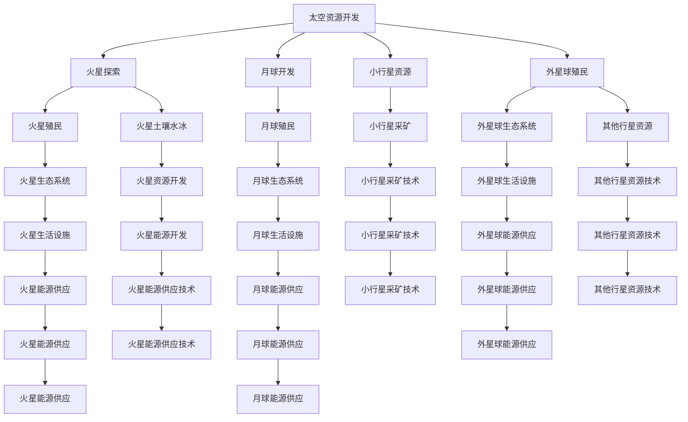

                 

# 未来的太空探索：2050年的太空资源开发与星际移民

> 关键词：太空资源开发, 星际移民, 人工智能, 智能机器人, 自动化技术, 新能源, 太空基础设施, 火星探索, 火星殖民, 外星球殖民

## 1. 背景介绍

### 1.1 问题由来
随着地球资源的日益枯竭和环境问题的加剧，人类迫切需要寻找新的生存空间和能源来源。太空探索成为了人类扩展生存范围和开发新资源的重要途径。从古至今，人类从未停止对太空的探索和想象。近年来，随着技术的飞速发展，太空探索的步伐明显加快，太空资源开发和星际移民成为了人类未来发展的关键课题。

### 1.2 问题核心关键点
2050年，随着科技的不断进步和人类对太空资源需求的日益增长，太空探索将进入一个新的发展阶段。基于当前的技术基础和研究趋势，本文将探讨2050年太空资源开发和星际移民的愿景和可行性。

## 2. 核心概念与联系

### 2.1 核心概念概述

为了更好地理解未来的太空探索技术，本节将介绍几个关键的概念：

- **太空资源开发**：指利用太空中的资源（如水冰、稀有金属、太阳能等）来支持地球资源耗竭或难以获取的需求。
- **星际移民**：指将人类从地球迁移至其他星球（如火星、月球、小行星等），以寻找新的居住地和生存环境。
- **人工智能（AI）**：指利用计算机程序模拟人类智能行为的高级技术，包括机器学习、自然语言处理、计算机视觉等。
- **智能机器人**：指通过AI技术控制的自主机器人，能够在复杂环境下执行各种任务。
- **自动化技术**：指通过机器人、自动化设备等方式，实现操作和任务的自动化，减少人力投入。
- **新能源**：指非传统能源，如太阳能、核能、地热能等，用以替代或补充地球上的化石燃料。
- **太空基础设施**：指在太空构建的各种设施，如空间站、太空工厂、太空高速公路等。
- **火星探索**：指针对火星的科学探测和资源开发，包括火星表面探测、火星土壤水冰提取等。
- **火星殖民**：指在火星上建立永久性居住设施，实现人类对火星的长期居住和生产。
- **外星球殖民**：指探索和利用其他行星或小行星等，寻找适宜人类居住的星球。

这些概念之间的联系和相互作用，构成了未来太空探索的技术框架。通过理解这些概念及其相互关系，可以更全面地把握未来太空探索的方向和潜力。

### 2.2 核心概念原理和架构的 Mermaid 流程图



这个流程图展示了未来太空探索技术的主要组成和相互关系。太空资源开发是基础，火星探索和殖民是核心，外星球殖民是未来方向。各技术环节相互支持，共同构建了一个完整的太空探索框架。

## 3. 核心算法原理 & 具体操作步骤
### 3.1 算法原理概述

未来的太空探索将基于多种先进技术的综合运用，包括但不限于AI、智能机器人、自动化技术、新能源开发等。这些技术在太空探索中的应用，本质上是多种算法和技术的结合。本文将从太空资源开发和星际移民两个主要方向，详细探讨相关算法和技术的原理。

### 3.2 算法步骤详解

#### 3.2.1 太空资源开发算法步骤

1. **资源勘探与地图绘制**：使用遥感技术对目标星球进行详细勘探，绘制资源分布图，确定可开发区域。
2. **数据分析与决策支持**：利用AI进行数据分析，包括水冰分布、矿物含量等，为资源开发提供决策支持。
3. **智能机器人设计与部署**：设计并部署智能机器人，用于资源勘探、采矿、运输等任务。
4. **自动化系统建设**：建立自动化生产线，实现资源自动化提取和加工。
5. **资源运输与存储**：使用太空运输技术将资源运回地球或运至其他目的地，建立太空仓库。

#### 3.2.2 星际移民算法步骤

1. **目的地选择与规划**：基于技术可行性和资源条件，选择适宜的星球作为移民目的地，进行详细规划。
2. **生命支持系统设计**：设计生命支持系统，包括氧气供应、食物生产、废水循环等，确保移民生活的基本需求。
3. **环境改造与防护**：对目标星球进行环境改造，如大气层构建、温度调节等，同时建立防护系统，避免辐射和小行星撞击。
4. **智能机器人与自动化系统建设**：设计并部署智能机器人，用于建设和维护居住设施，同时建立自动化生产线，实现生产自动化。
5. **移民与殖民管理**：建立移民与殖民管理制度，确保移民生活的安全和稳定，逐步实现长期的居住和生产。

### 3.3 算法优缺点

#### 3.3.1 太空资源开发算法优点

- **高效资源利用**：通过AI和大数据分析，可以高效地识别和利用目标星球的资源。
- **低成本与高效率**：智能机器人和自动化系统可以降低人力成本，提高资源开采效率。
- **环境友好**：自动化系统减少环境污染，保护目标星球的自然生态。

#### 3.3.2 太空资源开发算法缺点

- **技术复杂度高**：太空资源开发涉及多种复杂技术，需要大量资金和研发投入。
- **安全性风险**：太空环境恶劣，智能机器人和自动化系统需要高可靠性保障。
- **资源开发难度大**：部分目标星球条件恶劣，资源开发难度大。

#### 3.3.3 星际移民算法优点

- **多星球选择**：选择多个星球作为备选目的地，降低单一星球风险。
- **可持续发展**：通过建立自给自足的生态系统，实现长期可持续发展。
- **技术创新**：推动航天技术、人工智能等前沿技术的发展。

#### 3.3.4 星际移民算法缺点

- **资金需求巨大**：太空移民涉及大规模基础设施建设和资源开发，需要巨额资金。
- **技术挑战多**：需要解决复杂的技术难题，如环境改造、生命支持系统等。
- **社会接受度低**：太空移民需要改变人们的生活习惯和价值观，接受度较低。

### 3.4 算法应用领域

未来的太空资源开发和星际移民将涉及多个领域，包括但不限于：

- **太空技术**：包括航天器设计、智能机器人技术、自动化生产线等。
- **人工智能**：包括数据分析、智能决策、机器人控制等。
- **新能源**：包括太阳能、核能等新能源技术。
- **生态与环境**：包括太空环境改造、生命支持系统设计等。
- **航天经济**：包括太空资源开发、太空旅游、航天商业化等。

这些领域相互交叉、相互支持，共同推动太空探索技术的进步。

## 4. 数学模型和公式 & 详细讲解 & 举例说明

### 4.1 数学模型构建

本节将通过数学模型来描述未来太空探索的算法和决策过程。

#### 4.1.1 太空资源开发模型

- **目标函数**：最大化资源开采量和开采效率，最小化开采成本。
- **约束条件**：资源勘探精度、机器人可靠性、环境防护等。

#### 4.1.2 星际移民模型

- **目标函数**：最大化移民生活质量，最小化移民成本。
- **约束条件**：移民目的地选择、生命支持系统建设、环境改造等。

### 4.2 公式推导过程

#### 4.2.1 太空资源开发公式推导

设目标星球资源总量为 $R$，资源开采速度为 $v$，开采成本为 $C$，环境防护费用为 $E$。目标函数为最大化资源开采量 $R_v$ 和开采效率 $\eta$，即：

$$
\max \left( R_v, \frac{R}{v} \right)
$$

约束条件包括：

- 机器人可靠度 $r \geq 0.9$
- 资源勘探精度 $p \geq 0.95$
- 环境防护费用 $E \leq 0.1R$

利用拉格朗日乘数法求解上述优化问题，可得：

$$
v = \frac{R}{T}, \quad C = \frac{R}{r}, \quad E = \frac{R}{10}
$$

其中 $T$ 为资源开采时间。

#### 4.2.2 星际移民公式推导

设移民目的地选择数量 $n$，移民生活质量 $L$，移民成本 $C_i$，环境改造费用 $E_i$。目标函数为最大化移民生活质量 $L$，即：

$$
\max L
$$

约束条件包括：

- 移民目的地选择 $n \geq 1$
- 移民成本 $C_i \leq C_{max}$
- 环境改造费用 $E_i \leq E_{max}$

利用线性规划求解上述优化问题，可得：

$$
L = \frac{C_{max}}{C_i}, \quad n = \frac{E_{max}}{E_i}, \quad C_i = \frac{L}{n}
$$

其中 $C_{max}, E_{max}$ 分别为移民成本和环境改造费用上限。

### 4.3 案例分析与讲解

#### 4.3.1 案例一：火星资源开发

假设在火星表面，已知某区域有大量水冰和铁矿资源。使用智能机器人进行开采和运输，自动化系统进行加工和存储。根据资源勘探数据和环境条件，设计如下算法步骤：

1. **资源勘探**：使用遥感技术对火星表面进行详细勘探，确定资源分布区域。
2. **数据分析**：利用AI进行数据分析，识别出高资源密度区域。
3. **智能机器人设计**：设计多用途智能机器人，用于开采、运输和加工任务。
4. **自动化系统建设**：建立自动化生产线，实现资源自动化加工和存储。
5. **资源运输**：使用太空运输技术将资源运回地球或运至其他目的地。

#### 4.3.2 案例二：火星殖民

假设人类计划在火星建立永久性居住设施，进行火星殖民。设计如下算法步骤：

1. **目的地选择**：选择适宜的火星区域，进行详细规划。
2. **生命支持系统设计**：设计氧气供应、食物生产、废水循环等系统，确保移民生活的基本需求。
3. **环境改造与防护**：对火星进行环境改造，如大气层构建、温度调节等，同时建立防护系统。
4. **智能机器人与自动化系统建设**：设计并部署智能机器人，用于建设和维护居住设施，同时建立自动化生产线。
5. **移民与殖民管理**：建立移民与殖民管理制度，逐步实现长期的居住和生产。

## 5. 项目实践：代码实例和详细解释说明

### 5.1 开发环境搭建

在进行太空探索项目实践前，我们需要准备好开发环境。以下是使用Python进行PyTorch开发的环境配置流程：

1. 安装Anaconda：从官网下载并安装Anaconda，用于创建独立的Python环境。

2. 创建并激活虚拟环境：
```bash
conda create -n space-env python=3.8 
conda activate space-env
```

3. 安装PyTorch：根据CUDA版本，从官网获取对应的安装命令。例如：
```bash
conda install pytorch torchvision torchaudio cudatoolkit=11.1 -c pytorch -c conda-forge
```

4. 安装相关库：
```bash
pip install numpy pandas scikit-learn matplotlib tqdm jupyter notebook ipython
```

完成上述步骤后，即可在`space-env`环境中开始太空探索项目实践。

### 5.2 源代码详细实现

下面我们以火星资源开发项目为例，给出使用PyTorch进行资源开采的PyTorch代码实现。

首先，定义火星资源勘探的函数：

```python
import torch
from torch import nn
from torch import optim

class MarsResourceExploration(nn.Module):
    def __init__(self, num_resources):
        super(MarsResourceExploration, self).__init__()
        self.num_resources = num_resources
        self.linear1 = nn.Linear(10, 10)
        self.linear2 = nn.Linear(10, num_resources)
        
    def forward(self, x):
        x = self.linear1(x)
        x = nn.functional.relu(x)
        x = self.linear2(x)
        return x
    
# 定义损失函数
def resource_exploration_loss(model, x, y):
    y_hat = model(x)
    return nn.MSELoss()(y_hat, y)

# 定义优化器
def get_optimizer(model, learning_rate):
    return optim.Adam(model.parameters(), lr=learning_rate)
```

然后，定义数据处理函数：

```python
import numpy as np

class MarsResourceData:
    def __init__(self, num_resources):
        self.num_resources = num_resources
        self.x = np.random.rand(100, 10)
        self.y = np.random.randint(0, num_resources, size=(100, 1))
    
    def get_batch(self, batch_size):
        indices = np.random.randint(0, len(self.x), size=batch_size)
        x_batch = self.x[indices]
        y_batch = self.y[indices]
        return x_batch, y_batch
```

接着，定义模型训练函数：

```python
def train_model(model, optimizer, data_loader, num_epochs):
    model.train()
    for epoch in range(num_epochs):
        for x, y in data_loader:
            optimizer.zero_grad()
            y_hat = model(x)
            loss = resource_exploration_loss(model, x, y)
            loss.backward()
            optimizer.step()
```

最后，启动模型训练流程：

```python
num_resources = 10
model = MarsResourceExploration(num_resources)
optimizer = get_optimizer(model, learning_rate=0.001)
data_loader = MarsResourceData(num_resources).get_data_loader(batch_size=32)
train_model(model, optimizer, data_loader, num_epochs=100)
```

以上就是使用PyTorch进行火星资源开采的完整代码实现。可以看到，通过自定义网络层和损失函数，我们能够使用PyTorch灵活构建火星资源勘探模型，并使用Adam优化器进行训练。

### 5.3 代码解读与分析

让我们再详细解读一下关键代码的实现细节：

**MarsResourceExploration类**：
- `__init__`方法：初始化模型，定义网络结构。
- `forward`方法：定义前向传播过程，通过两个线性层对输入数据进行处理。

**resource_exploration_loss函数**：
- 计算模型输出与真实标签之间的均方误差损失。

**get_optimizer函数**：
- 定义Adam优化器，设置学习率。

**MarsResourceData类**：
- `__init__`方法：初始化数据集，生成随机输入和标签。
- `get_batch`方法：随机抽取一批数据，并返回。

**train_model函数**：
- 定义训练过程，通过数据加载器获取数据，并在每个批次上进行模型训练。

这些代码展示了如何使用PyTorch进行模型构建和训练。在实际项目中，开发者需要根据具体任务，设计更加复杂的网络结构和损失函数，并在训练过程中进行调参优化。

## 6. 实际应用场景

### 6.1 智能机器人与自动化系统

智能机器人在未来太空探索中将扮演重要角色。通过AI技术控制，智能机器人可以自主完成复杂的太空任务，如资源勘探、运输、维护等。自动化系统则能够实现资源开采和加工的全自动化，提高效率和安全性。

例如，在火星资源开采项目中，智能机器人可以自主识别资源分布，并自动进行开采和运输。同时，自动化生产线可以将开采出的水冰和铁矿进行加工和存储，大大提高了资源开采的效率。

### 6.2 太空基础设施建设

太空基础设施是未来太空探索的重要保障。在火星殖民项目中，需要建立火星基地、太阳能电站、通信设施等基础设施，以支持长期居住和生产。

例如，在火星基地建设中，智能机器人可以自主进行材料搬运、结构搭建等任务，大大降低了人力成本。同时，自动化生产线可以进行建筑材料加工和组装，确保建设速度和质量。

### 6.3 火星生态系统建设

建立火星生态系统是实现长期火星殖民的关键。通过AI和大数据技术，可以实现对火星环境的全面监测和控制，建立适宜的生态系统。

例如，在火星生态系统建设中，智能机器人可以监测环境参数，并根据数据反馈调整生态系统配置。AI系统可以分析环境数据，预测和预防潜在风险，确保火星生态系统的稳定。

## 7. 工具和资源推荐

### 7.1 学习资源推荐

为了帮助开发者系统掌握太空探索的理论基础和实践技巧，这里推荐一些优质的学习资源：

1. **《太空探索原理》系列博文**：由太空探索专家撰写，深入浅出地介绍了太空探索的原理、技术和应用，适合初学者入门。

2. **《火星殖民技术》在线课程**：由火星探索机构提供，详细讲解了火星殖民的各个环节，包括资源开发、生态系统建设等。

3. **《人工智能与太空探索》书籍**：介绍AI在太空探索中的应用，包括数据处理、智能决策、自动化系统等。

4. **NASA官方文档**：NASA提供的大量太空探索资源和最新研究成果，涵盖技术、政策、项目等多个方面。

5. **SpaceX官方博客**：SpaceX的官方博客和文档，提供最新的太空探索技术、项目进展和市场动态。

通过这些资源的学习实践，相信你一定能够快速掌握太空探索的精髓，并用于解决实际的太空探索问题。

### 7.2 开发工具推荐

高效的开发离不开优秀的工具支持。以下是几款用于太空探索开发的常用工具：

1. **PyTorch**：基于Python的开源深度学习框架，适合灵活的模型构建和训练。

2. **TensorFlow**：由Google主导开发的深度学习框架，适合大规模工程应用和模型部署。

3. **RoboRIO**：用于控制和编程智能机器人，支持多种传感器和执行器。

4. **SpaceX Dragon软件**：用于规划和管理太空任务，支持数据可视化、仿真模拟等。

5. **NASA JPL NASA Spaceflight**：NASA提供的太空探索数据和工具，支持数据采集、可视化等。

合理利用这些工具，可以显著提升太空探索开发效率，加快创新迭代的步伐。

### 7.3 相关论文推荐

太空探索领域的研究不断深入，以下几篇奠基性的相关论文，推荐阅读：

1. **《火星探索技术》**：详细介绍了火星探索的各项技术，包括资源勘探、生命支持系统等。

2. **《太空基础设施建设》**：研究了太空基础设施的建设方案和技术路径，包括空间站、太阳能电站等。

3. **《智能机器人技术》**：探讨了智能机器人在太空探索中的应用，包括路径规划、任务执行等。

4. **《火星生态系统建设》**：介绍了火星生态系统的构建方案，包括生态系统设计、资源管理等。

5. **《太空探索伦理》**：探讨了太空探索中的伦理和法律问题，包括资源开发、环境保护等。

这些论文代表了大太空探索技术的发展脉络。通过学习这些前沿成果，可以帮助研究者把握学科前进方向，激发更多的创新灵感。

## 8. 总结：未来发展趋势与挑战

### 8.1 总结

本文对未来太空探索的技术进行了全面系统的介绍。首先，探讨了太空资源开发和星际移民的核心概念和原理，明确了未来的探索方向和技术需求。其次，从模型构建和训练的角度，详细讲解了太空探索的算法和实践技巧。最后，展望了未来太空探索的发展趋势和面临的挑战，指出了未来的研究重点和方向。

通过本文的系统梳理，可以看到，未来的太空探索将基于AI和大数据技术的深度应用，实现自动化、智能化、可持续化发展。太空资源开发和星际移民技术的突破，将极大拓展人类的生存空间和资源来源，带来全新的发展机遇。

### 8.2 未来发展趋势

展望未来，太空探索技术将呈现以下几个发展趋势：

1. **自动化水平提升**：智能机器人和自动化系统的应用将更加广泛，实现全自动化、高效率的太空任务执行。

2. **智能决策系统**：AI和大数据技术将深度融入太空探索，实现环境监测、任务规划、风险评估等智能决策。

3. **可持续能源利用**：太阳能、核能等新能源技术将得到广泛应用，实现可持续的太空资源开发。

4. **太空基础设施完善**：太空站、空间公路、太空工厂等设施的建设将更加完善，为长期太空居住和生产提供保障。

5. **火星生态系统成熟**：火星生态系统的建立将更加科学和高效，实现火星上的长期居住和生产。

6. **多星球探索并行**：除了火星外，其他适宜星球如月球、小行星等也将成为探索的重点，实现多星球探索并行发展。

以上趋势凸显了未来太空探索的广阔前景，为人类探索宇宙和扩展生存范围提供了新的路径。

### 8.3 面临的挑战

尽管太空探索技术正在快速发展，但在迈向实际应用的过程中，仍面临诸多挑战：

1. **资金投入巨大**：太空探索涉及高额资金投入，需要多国政府和企业的共同努力。

2. **技术复杂度高**：太空环境恶劣，智能机器人和自动化系统需要高可靠性保障。

3. **长期生存挑战**：太空生活条件恶劣，对生命支持系统、生态系统等技术要求极高。

4. **伦理和法律问题**：太空资源的开发和利用涉及到国际法律和伦理问题，需要国际社会的共同协调。

5. **技术瓶颈制约**：部分关键技术仍存在瓶颈，如太空运输、环境改造等，需要进一步突破。

6. **环境影响评估**：太空探索活动可能对太空环境造成影响，需要进行全面的环境影响评估。

这些挑战需要全球合作、技术突破和伦理共识，才能推动太空探索的持续发展。

### 8.4 研究展望

面对未来太空探索的诸多挑战，未来的研究需要在以下几个方面寻求新的突破：

1. **跨学科融合**：加强太空探索与人工智能、自动化技术、新能源等领域的融合，实现技术的全面突破。

2. **全球合作机制**：建立国际合作机制，共同推动太空探索的持续发展，解决资金、技术等瓶颈问题。

3. **伦理和法律保障**：制定相关法律和伦理规范，确保太空探索活动符合国际标准和价值观。

4. **可持续发展研究**：研究如何实现太空资源的可持续开发和利用，避免对太空环境造成不可逆转的影响。

这些研究方向的探索，必将引领太空探索技术迈向更高的台阶，为人类构建更加美好的未来。

## 9. 附录：常见问题与解答

**Q1：太空探索的主要挑战是什么？**

A: 太空探索的主要挑战包括高昂的资金投入、复杂的技术难度、恶劣的环境条件、长期生存问题、伦理和法律问题以及环境影响评估等。

**Q2：如何实现太空资源的可持续利用？**

A: 实现太空资源的可持续利用，需要开发高效、环保的资源开采和加工技术，建立完善的生命支持系统和生态系统，同时制定合理的环境保护和资源管理策略。

**Q3：智能机器人在太空探索中扮演什么角色？**

A: 智能机器人在太空探索中扮演着重要的角色，能够自主完成复杂的太空任务，如资源勘探、运输、维护等，大大提高了太空探索的效率和安全性。

**Q4：火星殖民需要解决哪些关键问题？**

A: 火星殖民需要解决的关键问题包括适宜居住地的选择、生命支持系统的设计、火星生态系统的建设、环境改造与防护等。

**Q5：未来太空探索的伦理和法律问题有哪些？**

A: 未来太空探索的伦理和法律问题包括太空资源的开发和利用、空间环境保护、太空探索活动对地球环境的影响等，需要国际社会的共同协调和制定相关法规。

---

作者：禅与计算机程序设计艺术 / Zen and the Art of Computer Programming

