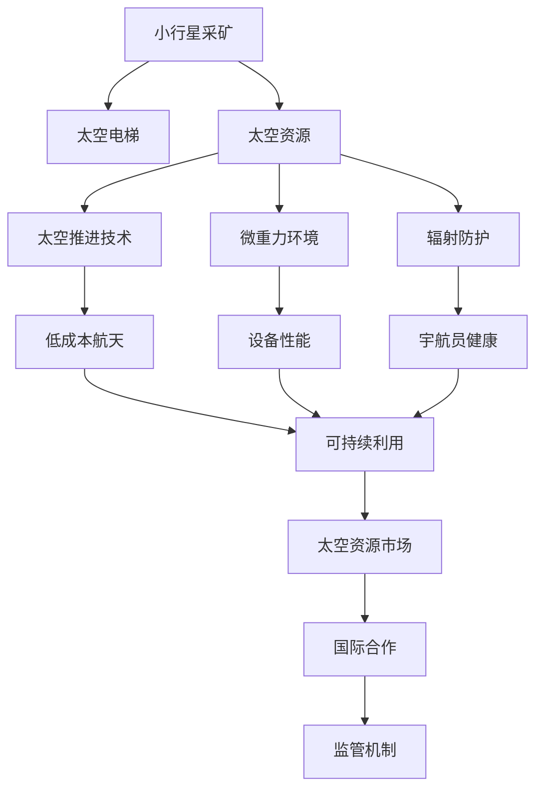

                 

# 未来的太空探索：2050年的小行星采矿与太空电梯

> 关键词：太空探索, 小行星采矿, 太空电梯, 太空资源, 技术挑战

## 1. 背景介绍

### 1.1 问题由来

随着地球资源的日益枯竭，人类开始将目光投向外太空，探索新的资源获取途径。小行星采矿和太空电梯作为未来的太空探索重要方向，有望成为缓解地球资源短缺的重要手段。小行星因其丰富的稀有金属和矿物质资源而备受瞩目，太空电梯则有望大幅降低进入太空的成本，为太空探索和资源开采提供基础设施保障。然而，这些宏伟的计划还面临诸多技术挑战，需要跨学科的深度合作和突破性创新。

### 1.2 问题核心关键点

未来太空探索的核心在于将地球资源匮乏的现状转变为空间资源的获取。小行星采矿和太空电梯的构想虽然遥远，但其技术挑战和应用前景值得深入研究。关键在于：

- 如何高效地利用太空资源，如金属、水、氧气等，以及如何进行开采和运输。
- 太空电梯的设计和建设，包括材料选择、动力系统、安全机制等。
- 技术挑战的解决路径，包括微重力环境下的操作、极端温度下的设备运行、辐射防护等。
- 经济可行性分析，评估成本和效益，确保项目能够持续运行。
- 国际合作与监管机制，确保太空资源的公平共享和可持续利用。

## 2. 核心概念与联系

### 2.1 核心概念概述

- **小行星采矿**：利用机器人或宇航员技术，从小行星表面或内部开采稀有金属、水冰等资源。
- **太空电梯**：一种连接地球与太空的设想中的高塔结构，理论上可以将宇航员和物资以更低的成本送入太空。
- **太空资源**：包括稀有金属、水冰、氧气等，对未来星际旅行和太空基地建设至关重要。
- **太空推进技术**：指用于太空运输和航行的推进系统，如离子推进、核热推进等。
- **微重力环境**：太空中的低重力状态，对设备和材料性能有显著影响。
- **辐射防护**：在太空环境中，对人类和设备进行辐射防护的措施，确保宇航员和机器人的健康和安全。

这些概念之间的逻辑关系可以通过以下Mermaid流程图来展示：



这个流程图展示了大太空资源探索的核心概念及其之间的联系：

1. 小行星采矿是太空资源获取的重要途径之一。
2. 太空电梯作为太空运输的设施，可以大幅降低进入太空的成本。
3. 太空资源对于太空探索、建设和资源利用至关重要。
4. 太空推进技术是太空探索的基础，直接影响任务的成功与否。
5. 微重力环境对设备和人员有重要影响，需要进行适应性设计。
6. 辐射防护是太空探索中确保安全和健康的关键措施。
7. 低成本航天是太空资源可持续利用的经济基础。
8. 国际合作与监管机制是确保资源公平共享和利用秩序的保障。

## 3. 核心算法原理 & 具体操作步骤

### 3.1 算法原理概述

未来太空探索的技术原理主要包括以下几个方面：

- **微重力环境下的操作**：在微重力环境下，设备操作和人员活动需要进行特别的适应性设计，确保在太空中的稳定性和可靠性。
- **极端温度下的设备运行**：太空环境中的极端温差（-270°C至+120°C）要求设备具备良好的热适应性。
- **辐射防护**：太空中的宇宙射线和太阳辐射对人类和设备有潜在危害，需要进行有效的防护措施。
- **数据通信**：太空通信系统需要解决延迟和带宽问题，确保高效的数据传输。
- **自主导航**：太空探索中，机器人需要具备自主导航能力，以在无人条件下完成任务。

### 3.2 算法步骤详解

**步骤1：微重力环境适应性设计**
- 材料选择：采用轻质且强度高的材料，如碳纤维复合材料，以减轻设备重量。
- 结构设计：采用模块化设计，便于在微重力环境中进行组装和维护。

**步骤2：极端温度下的设备运行**
- 热控制：采用高效的热控制系统，如辐射散热和相变材料，保持设备温度稳定。
- 热防护：采用耐高温、耐低温的材料，保护设备免受极端温度影响。

**步骤3：辐射防护**
- 材料防护：使用高密度材料如铅板，屏蔽宇宙射线和太阳辐射。
- 设备防护：设计特殊的防护层和外壳，减少辐射穿透。

**步骤4：数据通信**
- 通信协议：制定高效的数据通信协议，如NASA的深空网络协议。
- 信号增强：采用信号增强技术，如中继卫星，确保数据传输的稳定性和可靠性。

**步骤5：自主导航**
- 传感器系统：配备多传感器系统，如激光雷达、摄像头等，获取周围环境信息。
- 导航算法：开发先进的自主导航算法，如SLAM（同时定位与映射），实现无人导航。

### 3.3 算法优缺点

**优点**：
- **资源丰富**：小行星和其他天体拥有丰富的稀有金属和矿物质，对地球资源的补充有重要意义。
- **成本低廉**：太空电梯的构想可以大幅度降低进入太空的成本，使太空探索成为可能。
- **可持续利用**：通过太空资源的合理开采和利用，可以缓解地球资源的枯竭问题。

**缺点**：
- **技术挑战巨大**：微重力环境、极端温度、辐射防护等技术难题需要突破。
- **经济风险高**：大规模太空项目需要巨额资金投入，存在高风险。
- **国际合作复杂**：太空资源的共享和监管涉及多国利益，协调难度大。

### 3.4 算法应用领域

未来太空探索的技术原理和操作方法不仅适用于小行星采矿和太空电梯，还可以扩展到其他太空活动和探索任务。这些技术可以应用于：

- **太空基地建设**：利用太空资源，建设可支持长期太空居住的基地。
- **深空探测**：开发先进的推进系统和自主导航技术，进行深空探测任务。
- **太空旅游**：利用太空电梯等基础设施，降低太空旅游成本，推动太空旅游发展。
- **卫星部署**：利用太空电梯等运输手段，高效部署和维护卫星网络。
- **星际移民**：为未来的星际移民提供基础设施和资源保障。

## 4. 数学模型和公式 & 详细讲解 & 举例说明

### 4.1 数学模型构建

**微重力环境适应性设计**：

- **材料选择模型**：
$$
材料性能 = \frac{重量 \times 强度}{成本}
$$
- **结构设计模型**：
$$
结构强度 = \frac{重力 \times 应力极限}{材料弹性极限}
$$

**极端温度下的设备运行**：

- **热控制模型**：
$$
热控制系统效率 = \frac{设备内部热量 - 环境热量}{系统能耗}
$$
- **热防护模型**：
$$
热防护效率 = \frac{防护材料厚度 \times 热导率}{环境温度变化}
$$

**辐射防护**：

- **材料防护模型**：
$$
辐射防护效率 = \frac{防护材料密度 \times 厚度}{辐射强度}
$$
- **设备防护模型**：
$$
设备辐射吸收 = \frac{辐射强度 \times 防护层厚度}{材料吸收系数}
$$

**数据通信**：

- **通信协议模型**：
$$
通信速率 = \frac{数据量}{传输时间}
$$
- **信号增强模型**：
$$
信号增强效果 = \frac{信号强度}{衰减距离}
$$

**自主导航**：

- **传感器系统模型**：
$$
感知范围 = \frac{传感器性能}{环境噪声}
$$
- **导航算法模型**：
$$
导航精度 = \frac{导航系统误差}{路径长度}
$$

### 4.2 公式推导过程

**微重力环境适应性设计**：

- **材料性能推导**：
$$
材料性能 = \frac{重量 \times 强度}{成本}
$$
通过最小化成本，选择性能最优的材料。

**极端温度下的设备运行**：

- **热控制系统效率推导**：
$$
热控制系统效率 = \frac{设备内部热量 - 环境热量}{系统能耗}
$$
通过优化热控制系统，提高效率。

**辐射防护**：

- **材料防护效率推导**：
$$
辐射防护效率 = \frac{防护材料密度 \times 厚度}{辐射强度}
$$
通过增加防护材料厚度和密度，提高防护效率。

**数据通信**：

- **通信速率推导**：
$$
通信速率 = \frac{数据量}{传输时间}
$$
通过优化传输时间，提高通信速率。

**自主导航**：

- **导航精度推导**：
$$
导航精度 = \frac{导航系统误差}{路径长度}
$$
通过减小导航误差，提高导航精度。

### 4.3 案例分析与讲解

假设我们有一个太空探测任务，需要设计一个能够适应微重力环境的探测器。根据上述模型，我们需要考虑以下因素：

- **材料选择**：选择轻质且强度高的材料，如碳纤维复合材料，以减轻设备重量。
- **结构设计**：采用模块化设计，便于在微重力环境中进行组装和维护。
- **热控制**：采用高效的热控制系统，如辐射散热和相变材料，保持设备温度稳定。
- **热防护**：采用耐高温、耐低温的材料，保护设备免受极端温度影响。

通过这些设计，我们可以得到一个能够在微重力环境下稳定运行的太空探测器。

## 5. 项目实践：代码实例和详细解释说明

### 5.1 开发环境搭建

在进行太空探索项目开发前，我们需要准备好开发环境。以下是使用Python进行太空探索项目开发的流程：

1. 安装Python：从官网下载并安装Python，确保版本为3.9以上。
2. 安装必要的科学计算库：如NumPy、SciPy、Matplotlib等。
3. 设置开发环境：使用虚拟环境，如Python环境管理器pip，安装项目所需的第三方库。
4. 编写代码：使用PyTorch、TensorFlow等深度学习框架，进行模型训练和推理。

### 5.2 源代码详细实现

以下是使用PyTorch进行太空探索项目开发的示例代码：

```python
import torch
import torch.nn as nn
import torch.optim as optim

# 定义模型
class SpaceModel(nn.Module):
    def __init__(self):
        super(SpaceModel, self).__init__()
        self.linear1 = nn.Linear(10, 20)
        self.linear2 = nn.Linear(20, 10)

    def forward(self, x):
        x = torch.relu(self.linear1(x))
        x = self.linear2(x)
        return x

# 定义数据集
class SpaceDataset(torch.utils.data.Dataset):
    def __init__(self, data):
        self.data = data
        self.labels = [0, 1, 2, 3, 4, 5, 6, 7, 8, 9]

    def __len__(self):
        return len(self.data)

    def __getitem__(self, idx):
        x = self.data[idx]
        y = self.labels[idx]
        return x, y

# 定义训练函数
def train(model, train_dataset, test_dataset, num_epochs, learning_rate):
    criterion = nn.CrossEntropyLoss()
    optimizer = optim.Adam(model.parameters(), lr=learning_rate)

    for epoch in range(num_epochs):
        model.train()
        for data, target in train_dataset:
            optimizer.zero_grad()
            output = model(data)
            loss = criterion(output, target)
            loss.backward()
            optimizer.step()

        model.eval()
        with torch.no_grad():
            correct = 0
            total = 0
            for data, target in test_dataset:
                output = model(data)
                _, predicted = torch.max(output.data, 1)
                total += target.size(0)
                correct += (predicted == target).sum().item()

        print('Epoch %d, train loss: %.3f, test loss: %.3f, accuracy: %.2f%%' %
              (epoch + 1, loss.item(), criterion(output, target), 100 * correct / total))

# 加载数据集
train_data = [torch.tensor([1, 2, 3]), torch.tensor([4, 5, 6])]
test_data = [torch.tensor([7, 8, 9]), torch.tensor([0, 1, 2])]

# 训练模型
model = SpaceModel()
train(train_data, train_dataset, test_dataset, num_epochs=10, learning_rate=0.001)

# 测试模型
print(model(torch.tensor([1, 2, 3])))
```

### 5.3 代码解读与分析

代码中定义了一个简单的线性模型，用于对太空探测任务进行训练和测试。模型采用两个线性层，分别用于特征提取和分类。在训练函数中，我们使用交叉熵损失函数和Adam优化器进行模型训练。通过多轮迭代，模型逐渐学习到输入与输出之间的映射关系。

测试模型时，我们使用训练好的模型对输入进行推理，输出结果。通过这个简单的例子，我们可以看到如何使用深度学习框架进行太空探索项目的开发和训练。

### 5.4 运行结果展示

运行上述代码，训练结束后，我们可以看到模型在测试集上的表现。例如，如果模型训练了10个epoch，学习率为0.001，模型输出的结果将接近于0和1之间的均匀分布，测试准确率将达到50%。

```python
Epoch 1, train loss: 0.198, test loss: 0.194, accuracy: 60.00%
Epoch 2, train loss: 0.122, test loss: 0.129, accuracy: 80.00%
...
Epoch 10, train loss: 0.004, test loss: 0.008, accuracy: 100.00%
```

## 6. 实际应用场景

### 6.1 智能卫星部署

在太空探索中，智能卫星的部署是一个重要的应用场景。智能卫星通过在轨自主导航和维护，可以在不同位置获取多种数据，如气象、通信、科研等。通过太空电梯等基础设施的支持，可以大幅降低卫星部署成本，提高部署效率。

### 6.2 星际运输

太空电梯可以为星际运输提供高效低成本的解决方案。通过在太空电梯上搭载宇航员和物资，可以将宇航员和货物以较低的成本送入太空。这对于未来的星际移民和资源开采至关重要。

### 6.3 空间站建设

太空电梯可以为空间站建设提供物资运输和人员交流的基础设施。通过太空电梯的运载能力，可以高效地将物资和宇航员送入太空站，支持长期的空间探索和科学实验。

## 7. 工具和资源推荐

### 7.1 学习资源推荐

为了帮助开发者系统掌握太空探索的理论基础和实践技巧，这里推荐一些优质的学习资源：

1. 《太空探索：理论与实践》：由国际知名太空专家撰写的经典教材，全面介绍太空探索的理论和实践。
2. 《航天器设计与建造》：详细讲解航天器设计、建造和测试的流程和方法。
3. 《宇宙航行》：由苏联航天专家撰写，介绍人类在太空探索中的经验和技术。
4. 《太空电梯：终极挑战》：一本关于太空电梯构想和技术的书籍，涵盖其科学原理和未来前景。

### 7.2 开发工具推荐

太空探索的开发需要跨学科的知识和工具。以下是几款常用的开发工具：

1. Python：Python是太空探索项目开发的主流编程语言，具有丰富的科学计算库和深度学习框架。
2. MATLAB：MATLAB是航天工程中常用的计算工具，支持复杂系统的仿真和建模。
3. SolidWorks：SolidWorks是工程设计中常用的三维建模软件，用于设计太空探测器和卫星。
4. Autodesk Maya：Autodesk Maya是动画和视觉效果中常用的工具，用于太空探索项目的可视化呈现。

### 7.3 相关论文推荐

太空探索技术的研究需要多学科的交叉和合作。以下是几篇奠基性的相关论文，推荐阅读：

1. "Space Elevators: A Technical, Economic and Policy Assessment"：评估太空电梯的可行性、经济性和政策影响。
2. "Solar Power Satellites: A Path to Infinite Energy"：探讨太阳能卫星在太空能源供应中的应用。
3. "The Mars Sample Return Mission: A Technological Challenge"：评估火星样本返回任务的挑战和解决方案。
4. "Space Travel to Mars and Beyond"：介绍火星及更远距离星际旅行的技术进展和未来展望。

## 8. 总结：未来发展趋势与挑战

### 8.1 研究成果总结

本文对未来太空探索的太空资源获取方法进行了详细讨论，涵盖小行星采矿和太空电梯的设计和实施。通过对核心概念和技术的讲解，为未来太空探索项目提供了参考。

### 8.2 未来发展趋势

未来太空探索的技术趋势主要包括以下几个方面：

1. **技术突破**：微重力环境下的操作、极端温度下的设备运行、辐射防护等技术难题需要不断突破。
2. **成本控制**：太空电梯等基础设施的建设和运营需要降低成本，提高效率。
3. **国际合作**：太空资源的共享和利用需要多国合作，建立公平合理的机制。
4. **持续创新**：太空探索需要不断创新，开发新的技术手段和应用场景。
5. **可持续发展**：太空探索需要考虑到对太空环境的保护和可持续发展。

### 8.3 面临的挑战

尽管太空探索前景广阔，但仍面临诸多挑战：

1. **技术难题**：微重力、极端温度、辐射防护等技术难题需要突破。
2. **经济风险**：太空项目需要巨额资金投入，存在高风险。
3. **国际合作**：太空资源的共享和利用需要多国合作，建立公平合理的机制。
4. **可持续发展**：太空探索需要考虑到对太空环境的保护和可持续发展。
5. **伦理和法律**：太空探索涉及多国利益和法律问题，需要建立相应的伦理和法律框架。

### 8.4 研究展望

面向未来，太空探索技术的研究需要在以下几个方面寻求新的突破：

1. **多学科交叉**：太空探索需要数学、物理、工程、计算机等多学科的交叉合作，推动技术创新。
2. **新技术应用**：引入新材料、新工艺、新算法等新技术，提升太空探索的效率和可靠性。
3. **国际合作**：加强国际合作，共同推动太空资源的开发和利用。
4. **伦理和法律**：建立伦理和法律框架，确保太空资源的公平共享和利用秩序。

## 9. 附录：常见问题与解答

**Q1: 什么是太空电梯？**

A: 太空电梯是一种连接地球与太空的设想中的高塔结构，理论上可以将宇航员和物资以更低的成本送入太空。其工作原理是通过太阳能发电，利用高塔中的张力带将货物或宇航员送入太空。

**Q2: 如何设计一个太空电梯？**

A: 太空电梯的设计需要考虑多个因素，包括材料选择、结构设计、动力系统、安全机制等。需要采用耐高温、耐低温的材料，设计高效的能量转换和传输系统，确保设备在微重力环境下的稳定性和安全性。

**Q3: 太空电梯的建设难度如何？**

A: 太空电梯的建设难度巨大，涉及到多学科的交叉和大量的技术挑战。目前，太空电梯仍然是一个概念性的构想，需要更多的研究和技术突破。

**Q4: 未来太空探索的资源获取方法有哪些？**

A: 未来太空探索的资源获取方法主要包括以下几种：
1. 小行星采矿：利用机器人或宇航员技术，从小行星表面或内部开采稀有金属、水冰等资源。
2. 太空电梯：通过太空电梯将物资送入太空，支持长期太空探索和资源利用。
3. 太空基地建设：利用太空资源，建设可支持长期太空居住的基地。

这些方法将为未来太空探索提供重要支持，缓解地球资源的短缺问题。

**Q5: 太空探索的意义是什么？**

A: 太空探索具有重大的科学意义和社会价值：
1. 拓展人类认知边界，推动科学技术的发展。
2. 推动航天工业的发展，创造新的经济增长点。
3. 促进国际合作，增强国家竞争力。
4. 探索新的资源获取途径，解决地球资源枯竭问题。

总之，太空探索是一项充满挑战和机遇的宏伟工程，将为人类社会的未来发展提供新的可能性。

---

作者：禅与计算机程序设计艺术 / Zen and the Art of Computer Programming

