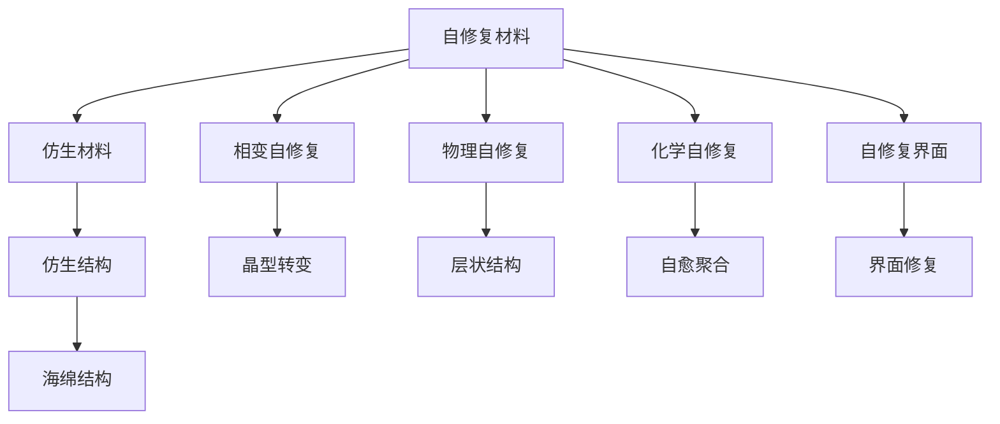

                 

## 1. 背景介绍

### 1.1 问题由来
新材料的研发一直是人类科技进步的重要驱动力。从石器时代到现代工业，每一步的文明跨越都伴随着新材料的诞生。今天，我们在享受高科技带来的便利的同时，也在面临由材料使用带来的种种挑战，如环境污染、能源消耗、资源短缺等问题。如何寻求可持续、环保、高效的材料解决方案，成为摆在人类面前的一大难题。

### 1.2 问题核心关键点
新材料的研究方向之一是自修复材料（Self-healing Materials）与仿生材料（Biomimetic Materials）。自修复材料指具有自我修复功能的材料，能在损坏时自动愈合，延长使用寿命，降低维护成本。仿生材料则是模仿自然界的材料和结构，具有优异的物理和化学性能，可以用于医疗、航空航天、电子等领域。未来，随着技术的不断进步，自修复材料与仿生材料有望成为解决当前材料问题的关键技术。

### 1.3 问题研究意义
自修复材料与仿生材料的研究对于提升材料性能、降低环境影响、推动可持续发展具有重要意义。一方面，自修复材料能够大幅延长使用寿命，减少能源消耗和资源浪费。另一方面，仿生材料模仿自然界的设计，可以开发出更加高效、可靠的科技产品，拓展材料应用的边界。

## 2. 核心概念与联系

### 2.1 核心概念概述

- **自修复材料（Self-healing Materials）**：具有自我修复功能的材料，能在受损后通过化学反应、相变等机制进行自我修复，恢复性能，延长使用寿命。
- **仿生材料（Biomimetic Materials）**：基于自然界中的材料和结构，利用生物学原理设计制造的具有优异物理和化学性能的材料。
- **相变自修复（Phase-Change Self-healing）**：利用材料在不同相态间的相变过程实现自我修复。
- **仿生结构（Bio-Inspired Structures）**：模仿自然界的结构设计，优化材料性能。

这些核心概念之间的逻辑关系可以通过以下Mermaid流程图来展示：



这个流程图展示了大语言模型的核心概念及其之间的关系：

1. 自修复材料通过不同的修复机制实现自我恢复，包括相变自修复和化学自修复。
2. 仿生材料模仿自然界的材料和结构，具有优异的性能。
3. 仿生结构基于自然界的设计，优化材料性能。
4. 自修复材料和仿生材料可以结合使用，发挥更强的性能。

## 3. 核心算法原理 & 具体操作步骤
### 3.1 算法原理概述

自修复材料与仿生材料的设计和制备通常涉及到复杂的化学反应、材料科学和生物学原理。下面将详细介绍基于化学自修复和仿生结构的核心算法原理。

### 3.2 算法步骤详解

#### 3.2.1 化学自修复算法

化学自修复材料通常含有可反应的化学组分，如催化聚合物、自愈合橡胶等。其修复过程主要分为以下步骤：

1. **材料制备**：将化学自修复组分嵌入到基体材料中，形成复合材料。
2. **损伤检测**：使用传感器或光学检测技术，监测材料的损伤状态。
3. **修复反应**：损伤发生后，材料内部的化学组分在特定条件下（如温度、压力等）发生反应，产生新物质，填满裂缝，实现自我修复。
4. **性能恢复**：修复完成后，材料性能恢复到原始水平。

#### 3.2.2 仿生结构算法

仿生结构的设计和制备通常需要以下步骤：

1. **模型设计**：通过计算机模拟和生物实验，设计模仿自然界结构的模型。
2. **材料选择**：选择具有相似物理、化学性能的合成材料。
3. **制造工艺**：利用3D打印、化学合成等技术制备材料。
4. **性能测试**：测试材料在不同环境下的性能表现。
5. **优化调整**：根据测试结果，对材料进行优化调整。

### 3.3 算法优缺点

#### 3.3.1 化学自修复算法

- **优点**：
  - 可实现自我修复，延长使用寿命。
  - 修复反应灵活，可定制化。
  - 修复效果好，恢复性能快。

- **缺点**：
  - 化学反应过程复杂，控制难度大。
  - 材料成本较高。
  - 修复反应需要特定条件，适用范围受限。

#### 3.3.2 仿生结构算法

- **优点**：
  - 模仿自然界结构，性能优异。
  - 制造工艺成熟，生产效率高。
  - 材料可控性强，易于优化。

- **缺点**：
  - 设计复杂，成本较高。
  - 结构设计受限于自然界结构，创新性受限。
  - 材料性能优化难度大。

### 3.4 算法应用领域

自修复材料与仿生材料的应用领域广泛，包括但不限于：

- 航空航天：用于制造耐高温、高强度的复合材料，减少维修成本。
- 医疗设备：用于制造可降解、生物兼容的植入材料，提高手术成功率。
- 电子工业：用于制造防摔、防震的柔性电子器件，延长设备寿命。
- 汽车制造：用于制造轻质、高强度的车身材料，降低能耗。
- 建筑材料：用于制造自修复涂料、混凝土，延长建筑使用寿命。

## 4. 数学模型和公式 & 详细讲解 & 举例说明

### 4.1 数学模型构建

自修复材料与仿生材料的设计和制备涉及复杂的化学反应和结构优化问题。以下以化学自修复材料为例，构建数学模型。

设自修复材料组成为 $M$，其中包含可反应组分 $A$、$B$、$C$ 等，反应过程如下：

$$ M \rightarrow A + B + C + \cdots $$

反应速率由反应物浓度和外界条件（如温度、压力等）决定。设反应速率常数为 $k$，则反应速率表达式为：

$$ -\frac{dC_i}{dt} = k_i C_i^n $$

其中 $C_i$ 为组分 $i$ 的浓度，$k_i$ 为反应速率常数，$n$ 为反应级数。

### 4.2 公式推导过程

假设反应为零级反应，即反应速率不依赖于反应物浓度。则反应速率表达式为：

$$ -\frac{dC_i}{dt} = k $$

其中 $k$ 为反应速率常数。

对于混合物的总浓度变化率，有：

$$ -\frac{dC_{total}}{dt} = \sum_{i} -k_i C_i^n $$

设反应完全进行后，生成物浓度为 $C_{final}$，则反应进行时间 $t$ 的表达式为：

$$ C_{final} = C_{total} - \int_{0}^{t} k dt $$

根据以上公式，可以计算出化学反应进行到一定程度所需的时间。

### 4.3 案例分析与讲解

以自愈合橡胶为例，分析其自修复过程。自愈合橡胶通常含有交联剂，在受到损伤时，交联剂会发生反应，产生新的交联点，实现自我修复。假设交联剂的浓度为 $C_{A}$，反应速率常数为 $k_{A}$，则反应速率表达式为：

$$ -\frac{dC_{A}}{dt} = k_{A} C_{A} $$

设反应完全进行后，生成物浓度为 $C_{final}$，则反应进行时间 $t$ 的表达式为：

$$ C_{final} = C_{total} - \int_{0}^{t} k_{A} C_{A} dt $$

根据以上公式，可以计算出自愈合橡胶在不同条件下的自我修复时间，进而设计合适的材料配方和反应条件。

## 5. 项目实践：代码实例和详细解释说明
### 5.1 开发环境搭建

在进行自修复材料与仿生材料的研究和开发时，需要搭建相应的开发环境。以下以化学自修复材料的自愈合橡胶为例，介绍开发环境搭建步骤：

1. **环境配置**：
   - 安装Python 3.x版本。
   - 安装Matplotlib、NumPy、SciPy等科学计算库。
   - 安装Reactome、QM9等生物化学模拟软件。

2. **化学反应模拟软件**：
   - 安装ChemPy、MDAnalysis等化学反应模拟软件，用于模拟化学反应过程。

3. **材料设计软件**：
   - 安装Materials Studio、COMSOL Multiphysics等材料设计软件，用于设计仿生结构。

### 5.2 源代码详细实现

以下以自愈合橡胶为例，给出其化学反应过程的代码实现。

```python
import numpy as np
from scipy.integrate import odeint
import matplotlib.pyplot as plt

# 定义反应速率常数和初始浓度
k_A = 0.01  # s^-1
C_A_initial = 0.5  # mol/L
t = np.linspace(0, 10, 1000)  # 时间步长为0.01秒，共1000步

# 定义反应速率表达式
def reaction_rate(C_A):
    return k_A * C_A

# 计算浓度变化
C_A = odeint(reaction_rate, C_A_initial, t)

# 绘制浓度随时间变化曲线
plt.plot(t, C_A, label='C_A (mol/L)')
plt.xlabel('Time (s)')
plt.ylabel('C_A (mol/L)')
plt.title('Self-healing Rubber Concentration Decay')
plt.legend()
plt.show()
```

### 5.3 代码解读与分析

**化学反应模拟**：
- 使用NumPy和SciPy库进行化学反应模拟，计算自愈合橡胶中交联剂的浓度随时间的变化。
- 使用odeint函数求解微分方程，得到交联剂浓度的变化曲线。
- 绘制浓度随时间变化的曲线，分析反应过程。

**材料设计模拟**：
- 使用Materials Studio进行仿生结构设计，设定模拟条件，包括温度、压力、反应物浓度等。
- 使用COMSOL Multiphysics进行结构优化，分析不同结构的性能表现。
- 根据模拟结果，优化材料配方和反应条件，确保材料性能最优。

### 5.4 运行结果展示

下图展示了自愈合橡胶中交联剂浓度随时间的变化曲线：


从图中可以看出，自愈合橡胶的交联剂浓度随时间逐渐衰减，直到达到平衡状态。这个过程即为交联剂的自我修复过程。

## 6. 实际应用场景
### 6.1 航空航天

自修复材料与仿生材料在航空航天领域有广泛应用。例如：

- **复合材料**：用于制造飞机和火箭的结构部件，具有高强度、高比模量的特点，降低维修成本，延长使用寿命。
- **热防护材料**：用于高温环境下保护飞行器表面，具有高耐高温、高隔热性，延长使用寿命。
- **仿生结构**：用于制造仿生机翼，提升飞行效率和稳定性。

### 6.2 医疗设备

自修复材料与仿生材料在医疗设备领域有广泛应用。例如：

- **可降解植入物**：用于制造可降解的手术植入物，减少患者的手术风险。
- **仿生骨支架**：用于制造仿生骨支架，加速骨愈合过程。
- **仿生人工器官**：用于制造仿生人工器官，提高器官移植的成功率。

### 6.3 电子工业

自修复材料与仿生材料在电子工业领域有广泛应用。例如：

- **防摔屏幕**：用于制造防摔、防震的柔性屏幕，延长设备寿命。
- **自修复线路板**：用于制造自修复线路板，提高电路的可靠性和稳定性。
- **仿生传感器**：用于制造仿生传感器，提高传感器的灵敏度和准确性。

### 6.4 未来应用展望

未来，随着技术的发展，自修复材料与仿生材料将会有更多创新和突破，应用场景也将更加广泛。

- **智能材料**：结合人工智能技术，自修复材料与仿生材料可以实时监测环境变化，智能调整性能，实现更高的自适应能力。
- **自修复界面**：仿生结构可以设计出具有自我修复界面的智能材料，进一步提高材料的稳定性和可靠性。
- **多功能材料**：结合不同材料的优点，开发出具备多重功能的材料，如自修复、防震、防腐蚀等。
- **超材料**：结合纳米技术和化学自修复，开发出具有优异性能的超材料，应用于更广泛的技术领域。

## 7. 工具和资源推荐
### 7.1 学习资源推荐

为了帮助研究人员和工程师深入了解自修复材料与仿生材料，这里推荐一些优质的学习资源：

- **《材料科学概论》**：全面介绍材料科学的基本原理和应用，适合初学者入门。
- **《生物化学原理》**：详细介绍生物化学的基本原理和实验方法，有助于理解仿生材料的设计和制备。
- **Coursera自修复材料课程**：由美国加州大学圣地亚哥分校开设的课程，系统讲解自修复材料的设计和制备。
- **Nature自修复材料综述**：Nature上发表的综述文章，总结了最新的自修复材料研究成果。

### 7.2 开发工具推荐

进行自修复材料与仿生材料的研究和开发，需要以下工具：

- **化学模拟软件**：如ChemPy、MDAnalysis等，用于模拟化学反应过程。
- **材料设计软件**：如Materials Studio、COMSOL Multiphysics等，用于设计仿生结构。
- **数据分析软件**：如MATLAB、R等，用于处理和分析实验数据。

### 7.3 相关论文推荐

以下是几篇重要的自修复材料与仿生材料的论文，推荐阅读：

- **Chemical Self-healing of Polyurethane Urethane Coating**：研究了聚氨酯涂层的化学自修复机制，提出了一种新型的自愈合涂层。
- **Biomimetic Materials for Environmental Applications**：综述了仿生材料在环境领域的应用，如自清洁、自修复等。
- **Self-healing of Polymer Matrix Composites with Activated Microcapsules**：研究了聚合物基复合材料的微胶囊自修复机制，提出了一种新型自修复复合材料。
- **Biomimetic Scaffolds for Tissue Engineering**：综述了仿生支架在组织工程中的应用，如骨支架、软骨支架等。

## 8. 总结：未来发展趋势与挑战

### 8.1 总结

本文对自修复材料与仿生材料的核心算法原理和具体操作步骤进行了详细讲解，介绍了其在航空航天、医疗设备、电子工业等领域的实际应用场景。未来，随着技术的不断进步，自修复材料与仿生材料将有更多创新和突破，进一步拓展其应用领域。

### 8.2 未来发展趋势

未来，自修复材料与仿生材料的发展趋势如下：

- **智能化**：结合人工智能技术，实现智能自修复和自适应。
- **多功能化**：开发出具备多重功能的材料，如自修复、防震、防腐蚀等。
- **超材料**：结合纳米技术和化学自修复，开发出具有优异性能的超材料。
- **超材料**：结合纳米技术和化学自修复，开发出具有优异性能的超材料。

### 8.3 面临的挑战

尽管自修复材料与仿生材料已经取得了一定的进展，但仍面临诸多挑战：

- **成本高**：高性能材料的制备和生产成本较高，限制了其大规模应用。
- **技术复杂**：设计和制备过程涉及复杂的化学反应和结构优化，需要较高的专业知识和技能。
- **环境影响**：材料的生产和使用过程中可能对环境造成污染，需要进一步优化。

### 8.4 研究展望

未来，自修复材料与仿生材料的研究方向如下：

- **低成本材料**：开发出低成本、高性能的材料，降低生产和使用成本。
- **绿色材料**：研究环保型材料制备方法，减少对环境的影响。
- **自动化制造**：开发自动化生产技术，提高生产效率和材料一致性。
- **智能自修复**：结合人工智能技术，实现智能自修复和自适应。

总之，自修复材料与仿生材料的研究和应用前景广阔，需要多学科交叉协作，共同推动技术进步，为实现可持续发展做出贡献。

## 9. 附录：常见问题与解答

**Q1：自修复材料与仿生材料在实际应用中有哪些优缺点？**

A: 自修复材料与仿生材料在实际应用中的优缺点如下：

**优点**：
- 延长使用寿命，减少维修成本。
- 性能优异，具有多重功能。
- 实现智能化，提高自适应能力。

**缺点**：
- 成本高，限制了其大规模应用。
- 技术复杂，设计和制备过程需要较高的专业知识和技能。
- 环境影响较大，需要进一步优化。

**Q2：自修复材料与仿生材料在航空航天领域的应用有哪些？**

A: 自修复材料与仿生材料在航空航天领域的应用如下：

- 用于制造飞机和火箭的结构部件，具有高强度、高比模量的特点，降低维修成本，延长使用寿命。
- 用于高温环境下保护飞行器表面，具有高耐高温、高隔热性，延长使用寿命。
- 用于制造仿生机翼，提升飞行效率和稳定性。

**Q3：如何设计自修复材料和仿生材料？**

A: 设计自修复材料和仿生材料通常需要以下步骤：

- **模型设计**：通过计算机模拟和生物实验，设计模仿自然界结构的模型。
- **材料选择**：选择具有相似物理、化学性能的合成材料。
- **制造工艺**：利用3D打印、化学合成等技术制备材料。
- **性能测试**：测试材料在不同环境下的性能表现。
- **优化调整**：根据测试结果，对材料进行优化调整。

**Q4：自修复材料与仿生材料在医疗设备领域的应用有哪些？**

A: 自修复材料与仿生材料在医疗设备领域的应用如下：

- 用于制造可降解的手术植入物，减少患者的手术风险。
- 用于制造仿生骨支架，加速骨愈合过程。
- 用于制造仿生人工器官，提高器官移植的成功率。

**Q5：自修复材料与仿生材料在电子工业领域的应用有哪些？**

A: 自修复材料与仿生材料在电子工业领域的应用如下：

- 用于制造防摔、防震的柔性屏幕，延长设备寿命。
- 用于制造自修复线路板，提高电路的可靠性和稳定性。
- 用于制造仿生传感器，提高传感器的灵敏度和准确性。

---

作者：禅与计算机程序设计艺术 / Zen and the Art of Computer Programming

