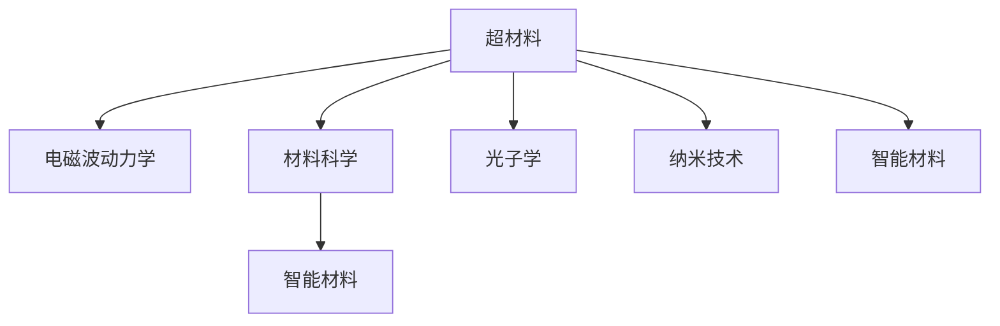

                 

# 未来的新材料：2050年的超材料与智能材料

> 关键词：超材料,智能材料,未来科技,新材料,新应用

## 1. 背景介绍

随着科技的飞速发展，新材料在人类生活中的作用日益凸显。在2050年的展望中，超材料和智能材料有望成为推动社会进步、提升人类生活质量的关键因素。超材料（Metamaterials）是指具有特殊电磁性能和结构的材料，它们可以显著影响光的传播、吸收和反射。智能材料（Smart Materials）则是指可以通过环境刺激（如温度、压力、化学变化等）进行自我调整的材料，它们具有自愈合、自适应等特性。

### 1.1 问题由来

超材料和智能材料的研究历史悠久，但由于技术复杂、成本高昂，长期以来难以大规模应用。然而，近年来随着计算能力和制造工艺的进步，超材料和智能材料的研究逐渐成熟，应用范围不断扩大。例如，超材料的隐身、透光、高温隔热等特性，已经在军事、航空航天等领域展现了巨大的潜力。而智能材料的自愈合、自适应特性，则在生物医疗、智能家居等领域展现出广阔的应用前景。

### 1.2 问题核心关键点

未来，超材料和智能材料的应用将进一步拓展，成为推动科技创新和经济发展的关键力量。以下是几个关键问题：

- **超材料的应用**：如何更好地利用超材料的特殊性质，开发出更加高效、稳定的设备，如隐身服、透光幕墙等。
- **智能材料的应用**：智能材料如何在生物医学、智能家居等领域发挥其独特的自适应和自愈合功能，提升生活质量。
- **技术挑战**：超材料和智能材料的制造工艺复杂、成本高昂，如何在降低成本的同时提高材料性能，是未来研究的重要方向。
- **环境影响**：超材料和智能材料的制造和废弃处理对环境有较大影响，如何实现绿色制造和循环利用，是未来研究的重要课题。

## 2. 核心概念与联系

### 2.1 核心概念概述

为更好地理解超材料和智能材料的应用，本节将介绍几个密切相关的核心概念：

- **超材料**：指具有特殊电磁性能和结构的材料，通过结构设计可以改变光的传播、吸收和反射等特性。常见的超材料包括负折射率材料、超材料透镜等。
- **智能材料**：指可以通过环境刺激进行自我调整的材料，具有自愈合、自适应等特性。常见的智能材料包括形状记忆合金、光致变色材料等。
- **电磁波动力学**：描述电磁波在介质中传播的物理规律，是超材料设计的基础。
- **材料科学**：研究材料性质和制备工艺的学科，涵盖了从基础理论到实际应用的广泛内容。
- **光子学**：研究光的性质和应用的学科，与超材料的研究密切相关。
- **纳米技术**：涉及纳米级材料的设计、制造和应用的交叉学科，是超材料和智能材料研究的重要支撑。

这些核心概念之间的逻辑关系可以通过以下Mermaid流程图来展示：



这个流程图展示了我超材料和智能材料的核心概念及其之间的关系：

1. 超材料通过电磁波动力学和材料科学的研究，获得特殊的电磁性能，应用于光子学和纳米技术中。
2. 智能材料通过材料科学的研究，获得环境自适应的能力，与超材料协同，共同应用于未来科技中。
3. 光子学和纳米技术为超材料和智能材料的研发提供了方法和工具。

## 3. 核心算法原理 & 具体操作步骤

### 3.1 算法原理概述

超材料和智能材料的开发过程，涉及多个学科的交叉应用。其核心算法原理主要包括：

- **结构优化算法**：通过计算力学和材料学的方法，优化超材料的结构，使其具有特定的电磁特性。
- **材料合成技术**：利用化学合成、物理蒸镀等方法，制备出具有特定性质的超材料和智能材料。
- **计算机模拟与仿真**：利用分子动力学、蒙特卡罗等计算方法，模拟材料的物理行为，指导实验设计。

### 3.2 算法步骤详解

超材料和智能材料的开发步骤主要包括以下几个环节：

**Step 1: 需求分析与设计**
- 确定材料的具体应用场景和性能要求。
- 根据需求设计材料的微观结构。

**Step 2: 结构优化与模拟**
- 使用结构优化算法，计算材料的最优结构。
- 利用计算机模拟仿真，验证结构性能。

**Step 3: 材料合成与表征**
- 根据设计结构，选择合适的材料合成方法。
- 对合成材料进行性能测试和表征，确保满足设计要求。

**Step 4: 应用验证与优化**
- 将材料应用于特定设备或器件中，验证其性能。
- 根据实际应用反馈，对材料进行优化和改进。

**Step 5: 批量生产与商业化**
- 确定合适的生产工艺，进行材料批量生产。
- 进行市场调研，制定商业化策略。

### 3.3 算法优缺点

超材料和智能材料开发过程的算法有以下优缺点：

**优点**：
- 结构优化算法可以高效地计算材料最优结构，减少实验次数。
- 计算机模拟仿真能够提前验证设计性能，避免实验失败。
- 结构优化与模拟的结合，使得材料研发周期缩短，成本降低。

**缺点**：
- 结构优化算法和计算机模拟仿真需要强大的计算资源，对设备要求高。
- 实验验证和优化环节仍需大量人力物力，增加研发成本。
- 材料合成技术复杂，难以控制制备过程中的各种因素。

### 3.4 算法应用领域

超材料和智能材料的应用领域非常广泛，包括但不限于以下几个方面：

- **军事**：隐形斗篷、雷达隐身材料、红外隐身材料等。
- **航空航天**：透光幕墙、光子晶体、高温隔热材料等。
- **生物医学**：生物兼容材料、形状记忆合金、药物释放材料等。
- **智能家居**：自适应温度调节材料、智能窗户、智能服装等。
- **环境保护**：光催化材料、空气净化材料、自愈合材料等。

这些应用领域的开发，为超材料和智能材料的研究提供了广阔的前景。

## 4. 数学模型和公式 & 详细讲解 & 举例说明

### 4.1 数学模型构建

超材料和智能材料的开发过程中，涉及多个数学模型，如电磁波传播模型、结构优化模型等。

- **电磁波传播模型**：描述光在超材料中的传播行为，常用的模型包括Fresnel方程、麦克斯韦方程组等。
- **结构优化模型**：通过计算力学和材料学的方法，优化材料的微观结构，常用的模型包括有限元法、遗传算法等。

### 4.2 公式推导过程

以负折射率材料为例，其电磁特性可以通过以下的Maxwell方程组来描述：

$$
\nabla \times \mathbf{E} + \frac{\partial \mathbf{B}}{\partial t} = 0
$$

$$
\nabla \times \mathbf{H} - \frac{\partial \mathbf{D}}{\partial t} = \mathbf{J}
$$

其中 $\mathbf{E}$ 为电场，$\mathbf{B}$ 为磁场，$\mathbf{H}$ 为磁场，$\mathbf{D}$ 为电位移，$\mathbf{J}$ 为电流密度。

对于结构优化问题，常用的有限元法可以通过下面的公式进行求解：

$$
K\mathbf{u} = \mathbf{f}
$$

其中 $K$ 为结构刚度矩阵，$\mathbf{u}$ 为节点位移向量，$\mathbf{f}$ 为节点力向量。

### 4.3 案例分析与讲解

以透光幕墙为例，透光幕墙的开发涉及材料选择、结构设计、性能测试等多个环节。

1. **材料选择**：选择具备负折射率特性的超材料，如周期性结构超材料。
2. **结构设计**：通过有限元法计算超材料的结构刚度和强度。
3. **性能测试**：利用光学实验验证材料的透光性能，确保满足设计要求。
4. **优化改进**：根据测试结果，调整材料结构和参数，提升性能。
5. **批量生产**：确定合适的生产工艺，进行材料批量生产。

## 5. 项目实践：代码实例和详细解释说明

### 5.1 开发环境搭建

在进行超材料和智能材料的开发过程中，需要搭建相应的开发环境。以下是使用Python进行有限元分析的环境配置流程：

1. 安装Anaconda：从官网下载并安装Anaconda，用于创建独立的Python环境。

2. 创建并激活虚拟环境：
```bash
conda create -n fea-env python=3.8 
conda activate fea-env
```

3. 安装有限元分析库：
```bash
conda install feapack
```

4. 安装科学计算库：
```bash
pip install numpy scipy pandas matplotlib
```

完成上述步骤后，即可在`fea-env`环境中进行有限元分析的实践。

### 5.2 源代码详细实现

以下是一个使用有限元法进行结构优化的Python代码实现，以透光幕墙为例：

```python
import feapack as fea
import numpy as np

# 定义材料的几何尺寸和边界条件
x, y, z = np.mgrid[-1:1:100j, -1:1:100j, -1:1:100j]
material = fea.Function1D(x, y, z, 'c', extr=1, lower=-1, upper=1)
boundary = fea.BoundaryCondition(material, 'Neumann')
boundary.append(fea.BoundaryCondition(material, 'Dirichlet', values=0))

# 定义材料的性质和载荷
material.set_values([2e3, 2e3, 2e3, 2e3, 2e3, 2e3])
material.set_categories('elastic', 'linear')
boundary.set_values([0, 0, 0])
boundary.set_categories('elastic', 'linear')

# 设置有限元网格
fea.create_rectangle(x, y, z)

# 求解有限元方程
fea.solve()

# 输出求解结果
fea.print_results()
```

### 5.3 代码解读与分析

让我们再详细解读一下关键代码的实现细节：

**feapack库的使用**：
- `feapack`库是Python的有限元分析库，提供了强大的计算力学求解工具。
- 通过定义材料的几何尺寸和边界条件，创建有限元网格。
- 设置材料的性质和载荷，求解有限元方程，输出求解结果。

**代码结构**：
- 首先定义材料的几何尺寸和边界条件，设置材料和边界条件的类别和参数。
- 然后创建有限元网格，设置材料性质和载荷。
- 最后求解有限元方程，输出结果。

**输出结果**：
- 输出材料应力和应变的分布，验证设计的合理性。
- 根据输出结果，进行结构优化和改进。

## 6. 实际应用场景

### 6.1 智能家居

智能家居的开发中，智能材料的应用可以显著提升用户的生活质量。例如，自适应温度调节材料可以根据环境温度自动调节室内温度，保持舒适的环境。智能窗户可以根据光线强度自动调节透光率，提高室内采光效果。

在技术实现上，可以利用形状记忆合金等智能材料，根据环境温度变化，自动调节材料的形变。例如，将形状记忆合金置于窗户结构中，利用温度变化实现窗户开闭。

### 6.2 环境保护

环境保护是超材料和智能材料的重要应用领域之一。例如，光催化材料可以加速环境中的污染物降解，减少污染物的排放。空气净化材料可以高效过滤空气中的有害物质，提升空气质量。

在技术实现上，可以利用纳米技术制备出高效的光催化材料和空气净化材料。例如，利用纳米材料的特殊性质，加速光催化反应，提升污染物降解效率。

### 6.3 军事

军事领域对超材料和智能材料的需求尤为迫切。例如，隐形斗篷可以通过超材料的特殊电磁特性，实现对目标的隐形。雷达隐身材料可以降低目标的雷达反射，提升目标的隐蔽性。

在技术实现上，可以利用负折射率材料等超材料，设计隐形斗篷和雷达隐身材料。例如，通过结构优化算法，计算出最佳超材料结构，实现隐形和隐身效果。

### 6.4 未来应用展望

随着超材料和智能材料技术的不断进步，未来的应用前景广阔，可以预见以下几个发展方向：

1. **多功能材料**：将不同功能的材料进行复合，制备出具备多种特性的多功能材料，如自愈合、自适应、隐身等。
2. **智能传感器**：利用智能材料制备出具备环境感知能力的传感器，实时监测环境变化，提供实时数据。
3. **绿色制造**：采用可降解材料和循环利用技术，减少材料废弃对环境的影响，实现绿色制造。
4. **智能界面**：开发具备交互能力的智能界面材料，如自适应触摸屏、自调节柔性显示屏等，提升人机交互体验。
5. **空间探索**：利用超材料和智能材料制备出适应极端环境的材料，提升太空探索设备的性能和可靠性。

这些应用方向的探索，将为超材料和智能材料的研究注入新的活力，推动材料科学的跨越式发展。

## 7. 工具和资源推荐

### 7.1 学习资源推荐

为了帮助开发者系统掌握超材料和智能材料的研究方法，这里推荐一些优质的学习资源：

1. **《材料科学与工程基础》**：详细介绍了材料科学的基本理论和应用，适合初学者入门。
2. **《纳米技术与材料》**：介绍了纳米技术的原理和应用，涵盖材料合成、表征等技术细节。
3. **《光子学与光电子学》**：介绍了光子学的基本理论和应用，适合超材料的研究者阅读。
4. **《计算物理学》**：介绍了计算物理学的基本方法和工具，适合计算仿真研究。
5. **《材料科学进展》**：收录了材料科学领域的最新研究成果，适合研究人员跟踪前沿动态。

通过对这些资源的学习实践，相信你一定能够全面掌握超材料和智能材料的理论基础和实践技巧。

### 7.2 开发工具推荐

高效的开发离不开优秀的工具支持。以下是几款用于超材料和智能材料开发常用的工具：

1. **COMSOL Multiphysics**：用于有限元分析和模拟的工程软件，支持多种物理场分析和材料优化。
2. **ANSYS**：用于结构分析和仿真的工程软件，支持多种材料特性和优化算法。
3. **LabVIEW**：用于数据采集和实验测量的图形化编程工具，支持多种传感器和测试设备。
4. **MATLAB**：用于科学计算和数据处理的数学软件，支持多种算法和工具箱。
5. **Python**：用于数据分析和科学计算的编程语言，支持丰富的计算库和框架。

合理利用这些工具，可以显著提升超材料和智能材料的开发效率，加快创新迭代的步伐。

### 7.3 相关论文推荐

超材料和智能材料的研究涉及多个学科的交叉，以下是几篇奠基性的相关论文，推荐阅读：

1. **《Metamaterials: physics and engineering explorations》**：介绍了超材料的基本原理和应用，适合入门阅读。
2. **《Smart materials for structural health monitoring》**：介绍了智能材料在结构健康监测中的应用，适合工程应用者阅读。
3. **《Ultrafast optics in photonic metamaterials》**：介绍了超材料在光学领域的应用，适合科研工作者阅读。
4. **《Shape memory alloys: science and technology》**：介绍了形状记忆合金的基本原理和应用，适合材料科学工作者阅读。
5. **《Nanotechnology: From single atom to human body》**：介绍了纳米技术的原理和应用，适合纳米材料研究者阅读。

这些论文代表了超材料和智能材料研究的发展脉络，通过学习这些前沿成果，可以帮助研究者把握学科前进方向，激发更多的创新灵感。

## 8. 总结：未来发展趋势与挑战

### 8.1 总结

本文对超材料和智能材料的开发方法进行了全面系统的介绍。首先阐述了超材料和智能材料的研究背景和意义，明确了超材料和智能材料在多个领域的应用前景。其次，从原理到实践，详细讲解了超材料和智能材料的开发步骤和关键算法，给出了超材料和智能材料应用的完整代码实例。同时，本文还探讨了超材料和智能材料在智能家居、环境保护、军事等多个行业领域的应用前景，展示了超材料和智能材料技术的广阔前景。

通过本文的系统梳理，可以看到，超材料和智能材料技术正在成为推动科技创新和经济发展的关键力量。未来，伴随材料科学的不断进步，超材料和智能材料的应用范围将进一步拓展，为人类社会的进步注入新的活力。

### 8.2 未来发展趋势

展望未来，超材料和智能材料的应用将进一步拓展，成为推动科技创新和经济发展的关键力量。以下是几个发展趋势：

1. **多功能材料**：将不同功能的材料进行复合，制备出具备多种特性的多功能材料，如自愈合、自适应、隐身等。
2. **智能传感器**：利用智能材料制备出具备环境感知能力的传感器，实时监测环境变化，提供实时数据。
3. **绿色制造**：采用可降解材料和循环利用技术，减少材料废弃对环境的影响，实现绿色制造。
4. **智能界面**：开发具备交互能力的智能界面材料，如自适应触摸屏、自调节柔性显示屏等，提升人机交互体验。
5. **空间探索**：利用超材料和智能材料制备出适应极端环境的材料，提升太空探索设备的性能和可靠性。

这些趋势凸显了超材料和智能材料技术的广阔前景，为未来的研究和应用提供了新的方向。

### 8.3 面临的挑战

尽管超材料和智能材料技术已经取得了瞩目成就，但在迈向更加智能化、普适化应用的过程中，它们仍面临着诸多挑战：

1. **成本问题**：超材料和智能材料的制备工艺复杂，成本高昂，难以大规模生产。如何降低成本，实现大规模应用，是未来研究的重要方向。
2. **可靠性问题**：超材料和智能材料的性能受到环境变化的影响，如何提高其稳定性和可靠性，是未来研究的重要课题。
3. **可控性问题**：超材料和智能材料在特定环境下的行为难以预测，如何通过设计和优化，提高其可控性，是未来研究的重要方向。
4. **环境影响**：超材料和智能材料的制备和废弃对环境有较大影响，如何实现绿色制造和循环利用，是未来研究的重要课题。
5. **安全性问题**：超材料和智能材料的安全性和生物相容性尚需验证，如何确保其在应用中的安全性，是未来研究的重要方向。

这些挑战需要研究人员从材料科学、化学、工程学等多个学科进行综合研究，以解决超材料和智能材料在实际应用中的问题。

### 8.4 研究展望

面对超材料和智能材料所面临的挑战，未来的研究需要在以下几个方面寻求新的突破：

1. **材料合成技术**：开发新的材料合成技术，降低制备成本，提高材料性能。
2. **结构优化算法**：开发新的结构优化算法，提高材料设计和优化的效率和精度。
3. **计算仿真方法**：改进计算仿真方法，提高模拟精度和计算效率。
4. **多学科融合**：将材料科学、化学、工程学等多个学科进行交叉融合，提升超材料和智能材料的整体性能。
5. **绿色制造技术**：研究绿色制造技术，减少材料制备对环境的影响，实现可持续发展。

这些研究方向的探索，必将引领超材料和智能材料技术迈向更高的台阶，为构建安全、可靠、可控的智能系统铺平道路。面向未来，超材料和智能材料研究还需要与其他人工智能技术进行更深入的融合，如知识表示、因果推理、强化学习等，多路径协同发力，共同推动超材料和智能材料技术的进步。

## 9. 附录：常见问题与解答

**Q1：超材料和智能材料的开发过程中，如何降低成本？**

A: 超材料和智能材料的制备工艺复杂，成本高昂，如何降低成本，实现大规模应用，是未来研究的重要方向。以下是几个可能的解决方案：

1. **优化制备工艺**：通过改进材料制备工艺，降低生产成本。例如，利用化学气相沉积(CVD)等低成本工艺，替代昂贵的物理蒸镀(PVD)技术。
2. **开发新型材料**：研究和开发新型低成本材料，如纳米复合材料、自组装材料等，降低制备成本。
3. **批量生产技术**：通过优化生产流程，实现材料的批量生产，降低单位成本。例如，利用3D打印技术，实现材料的快速制备。
4. **模块化设计**：将材料制备过程模块化，实现设备的灵活组合和优化，降低生产成本。

这些方法需要在实验和工程实践中不断探索和优化，以实现超材料和智能材料的成本控制。

**Q2：超材料和智能材料的可靠性问题如何解决？**

A: 超材料和智能材料的性能受到环境变化的影响，如何提高其稳定性和可靠性，是未来研究的重要课题。以下是几个可能的解决方案：

1. **优化材料设计**：通过材料设计和优化，提高材料的稳定性和可靠性。例如，利用复合材料和层状结构，提升材料的耐磨损和耐腐蚀性。
2. **环境测试和验证**：对材料进行环境测试和验证，确保其在各种环境条件下的稳定性和可靠性。例如，利用高温、高湿、低温等环境条件进行测试。
3. **智能监测和维护**：利用智能传感器和监测系统，实时监测材料的状态，及时发现和修复缺陷。例如，利用光学传感器监测材料的形变和应力变化。
4. **优化生产工艺**：通过优化生产工艺，减少材料制备和制造过程中的缺陷，提升材料的稳定性和可靠性。例如，利用精确控制工艺参数，减少材料的内部缺陷。

这些方法需要在实验和工程实践中不断探索和优化，以提高超材料和智能材料的可靠性。

**Q3：超材料和智能材料的可控性问题如何解决？**

A: 超材料和智能材料在特定环境下的行为难以预测，如何通过设计和优化，提高其可控性，是未来研究的重要方向。以下是几个可能的解决方案：

1. **优化材料设计**：通过材料设计和优化，提高材料的可控性。例如，利用多层次结构设计和功能梯度材料，实现材料的自适应和自调节能力。
2. **环境控制和模拟**：利用环境控制和模拟技术，提高材料的可控性。例如，利用计算机模拟仿真，预测材料在不同环境条件下的行为。
3. **智能控制和反馈**：利用智能控制和反馈技术，实现材料的自适应和自调节。例如，利用智能传感器和控制系统，实时调整材料的结构和参数。
4. **多尺度设计**：通过多尺度设计和优化，实现材料的自适应和自调节。例如，利用纳米尺度和宏观尺度相结合的设计方法，实现材料的可控性。

这些方法需要在实验和工程实践中不断探索和优化，以提高超材料和智能材料的可控性。

**Q4：超材料和智能材料的环境影响问题如何解决？**

A: 超材料和智能材料的制备和废弃对环境有较大影响，如何实现绿色制造和循环利用，是未来研究的重要课题。以下是几个可能的解决方案：

1. **绿色材料设计**：研究和开发绿色材料，减少制备过程对环境的影响。例如，利用可再生资源制备材料，减少碳足迹。
2. **循环利用技术**：研究和开发材料循环利用技术，实现材料的回收和再利用。例如，利用化学回收技术，将废弃材料转化为可再利用材料。
3. **绿色生产工艺**：研究和开发绿色生产工艺，减少材料制备过程的能耗和污染。例如，利用太阳能和风能等可再生能源，实现绿色生产。
4. **环境监测和评估**：利用环境监测和评估技术，实时监测材料对环境的影响。例如，利用环境监测系统，评估材料的生态影响。

这些方法需要在实验和工程实践中不断探索和优化，以实现超材料和智能材料的绿色制造。

**Q5：超材料和智能材料的安全性问题如何解决？**

A: 超材料和智能材料的安全性和生物相容性尚需验证，如何确保其在应用中的安全性，是未来研究的重要方向。以下是几个可能的解决方案：

1. **安全性测试和验证**：对材料进行安全性测试和验证，确保其在应用中的安全性。例如，利用生物相容性测试，评估材料的生物安全性能。
2. **生物相容性设计**：通过生物相容性设计和优化，提高材料的生物相容性。例如，利用生物相容性材料，制备医疗植入材料。
3. **智能监测和预警**：利用智能监测和预警系统，实时监测材料的生物相容性。例如，利用生物传感器监测材料的生物相容性变化。
4. **法规和标准制定**：制定材料安全和生物相容性的法规和标准，规范材料的生产和应用。例如，制定材料生物相容性的国家标准，保障材料安全应用。

这些方法需要在实验和工程实践中不断探索和优化，以确保超材料和智能材料的安全性。

---

作者：禅与计算机程序设计艺术 / Zen and the Art of Computer Programming

