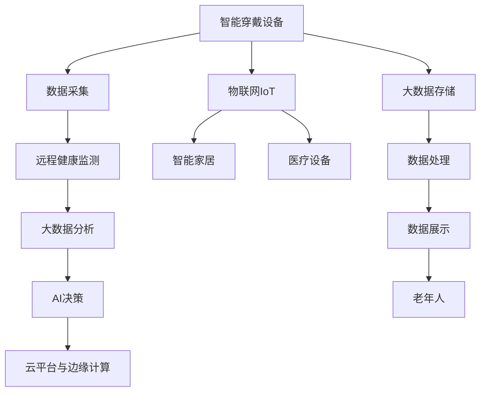

                 

## 1. 背景介绍

### 1.1 人口老龄化趋势

全球人口老龄化问题日益严峻，中国作为世界上人口最多的国家，也面临类似的挑战。中国国家卫生健康委员会数据显示，截至2021年，60岁及以上老年人口达2.67亿，占总人口的18.9%，预计到2050年，老年人口将接近5亿。老龄化带来的问题包括但不限于医疗资源紧张、家庭照料负担加重、独居老人孤独等问题。如何保障老年人的生活质量，提升养老服务的智慧化水平，是政府、企业和科研机构共同关注的话题。

### 1.2 智慧养老的概念

智慧养老（Intelligent Geriatric Care），是指依托现代信息技术和智能设备，对老年人的生活、健康、医疗等各方面进行智能化监测和辅助，提升养老服务的效率和质量。智慧养老涵盖的领域包括但不限于居家环境监测、健康管理、远程医疗、社交娱乐等。

## 2. 核心概念与联系

### 2.1 核心概念概述

智慧养老的实现离不开先进的智能设备，这些设备通常需要与云端服务器交互，通过数据收集、分析和反馈实现智能化的养老服务。核心概念包括以下几个方面：

1. **智能穿戴设备**：如智能手表、智能眼镜、可穿戴生命体征监测器等，用于实时采集老年人的生理数据和生活状态。
2. **远程健康监测**：通过云端服务器与智能穿戴设备协同工作，实现对老年人健康状况的持续监测。
3. **物联网(IoT)**：智能穿戴设备与智能家居、医疗设备等通过物联网技术连接，形成统一的智慧养老系统。
4. **大数据分析**：对采集到的海量数据进行分析，提取有价值的信息，支持健康管理和医疗决策。
5. **人工智能**：利用机器学习、深度学习等技术，对老年人的生理数据和生活状态进行智能分析和预测，提升服务精准度。
6. **云平台与边缘计算**：构建强大的云平台和边缘计算系统，支持智能设备的数据存储、处理和分析。

### 2.2 核心概念原理和架构的 Mermaid 流程图



以上流程图展示了智慧养老系统的基本架构：智能穿戴设备采集数据，通过物联网与云端服务器连接，将数据上传至大数据平台，经过数据分析和AI决策后，通过智能家居和医疗设备实现服务，最终反馈给老年人。

## 3. 核心算法原理 & 具体操作步骤

### 3.1 算法原理概述

智慧养老的核心算法主要包括以下几个方面：

1. **生理数据监测算法**：利用传感器实时监测老年人的心率、血压、血氧饱和度等生理指标。
2. **行为数据分析算法**：通过分析老年人的活动轨迹、步数、睡眠数据等，评估其生活状态和健康水平。
3. **异常检测算法**：通过机器学习模型，识别出异常行为和生理数据，及时报警。
4. **健康预测算法**：基于历史数据和当前生理数据，预测老年人的健康状况，提供个性化健康建议。
5. **智能决策算法**：结合AI技术，为老年人提供个性化的医疗和护理方案。

### 3.2 算法步骤详解

智慧养老的算法实现通常包含以下几个关键步骤：

**Step 1: 数据采集与预处理**
- 设计并部署智能穿戴设备，采集老年人的生理数据和行为数据。
- 对采集到的数据进行预处理，包括去噪、归一化等操作。

**Step 2: 特征提取与分析**
- 利用特征提取算法，从生理数据和行为数据中提取关键特征。
- 使用统计学、时间序列分析等方法，对提取的特征进行分析。

**Step 3: 模型训练与优化**
- 使用历史数据训练机器学习模型，如随机森林、支持向量机、神经网络等。
- 使用交叉验证、网格搜索等方法，优化模型参数，提高模型精度。

**Step 4: 异常检测与预测**
- 使用异常检测算法，如孤立森林、自编码器等，识别出异常数据。
- 结合历史数据和实时数据，使用时间序列模型或深度学习模型进行健康预测。

**Step 5: 智能决策与反馈**
- 结合AI技术，设计智能决策算法，提供个性化的健康和护理建议。
- 通过云端服务器将决策反馈给老年人，或通知其家属和医护人员。

### 3.3 算法优缺点

智慧养老的算法具有以下优点：

1. **实时性高**：智能穿戴设备能够实时监测老年人的健康状况，及时发现异常。
2. **数据量大**：大规模数据集支持更精准的模型训练和预测。
3. **个性化服务**：通过分析老年人的历史数据，提供个性化的健康建议。

同时，也存在一些局限性：

1. **隐私问题**：采集大量个人数据可能引发隐私保护问题。
2. **设备成本高**：智能穿戴设备通常价格较高，推广难度大。
3. **数据质量影响**：设备传感器精度和数据传输稳定性的问题，可能导致数据质量下降。
4. **模型鲁棒性不足**：模型需要适应多种环境和个体差异，鲁棒性有待提升。

### 3.4 算法应用领域

智慧养老的算法技术广泛应用于以下领域：

1. **居家环境监测**：通过智能穿戴设备监测老年人的家庭环境，如温度、湿度、烟雾等，预防意外事故。
2. **健康管理**：对老年人的生理数据进行分析，监测慢性病进展，提供健康建议和干预措施。
3. **远程医疗**：通过智能穿戴设备采集数据，远程传输到医院，进行远程诊断和治疗。
4. **社交娱乐**：通过智能设备与互联网连接，老年人可以与家人、朋友进行视频通话、游戏互动。
5. **应急响应**：实时监测老年人状态，一旦发现异常，立即触发应急响应机制。

## 4. 数学模型和公式 & 详细讲解 & 举例说明

### 4.1 数学模型构建

智慧养老系统涉及的数学模型包括：

1. **生理数据监测模型**：
   $$
   y = f(x_1, x_2, \ldots, x_n)
   $$
   其中 $y$ 表示生理指标（如心率、血压），$x_i$ 表示多个传感器采集到的特征值。

2. **行为数据分析模型**：
   $$
   y = f(x_1, x_2, \ldots, x_n, t)
   $$
   其中 $y$ 表示行为指标（如步数、睡眠时间），$x_i$ 表示特征值，$t$ 表示时间。

3. **异常检测模型**：
   $$
   y = f(x_1, x_2, \ldots, x_n)
   $$
   其中 $y$ 表示异常检测结果，$x_i$ 表示特征值。

4. **健康预测模型**：
   $$
   y = f(x_1, x_2, \ldots, x_n, t)
   $$
   其中 $y$ 表示健康状况预测结果，$x_i$ 表示特征值，$t$ 表示时间。

5. **智能决策模型**：
   $$
   y = f(x_1, x_2, \ldots, x_n)
   $$
   其中 $y$ 表示决策结果，$x_i$ 表示特征值。

### 4.2 公式推导过程

以生理数据监测模型为例，假设使用线性回归模型，其公式为：
$$
y = w_0 + w_1 x_1 + w_2 x_2 + \ldots + w_n x_n + \epsilon
$$
其中 $w_i$ 为模型参数，$\epsilon$ 为误差项。

根据最小二乘法，求解 $w_i$ 的过程如下：
$$
\min_{w_0, w_1, \ldots, w_n} \sum_{i=1}^N (y_i - w_0 - w_1 x_{1i} - w_2 x_{2i} - \ldots - w_n x_{ni})^2
$$

通过对公式求导并令导数为0，得到 $w_i$ 的求解公式：
$$
w_i = \frac{\sum_{i=1}^N (x_{i1}, x_{i2}, \ldots, x_{in}) (y_i - \bar{y})}{\sum_{i=1}^N (x_{i1}, x_{i2}, \ldots, x_{in})^2}
$$
其中 $\bar{y} = \frac{1}{N} \sum_{i=1}^N y_i$ 为样本均值。

### 4.3 案例分析与讲解

以心率监测为例，假设采集到老年人的心率数据 $y_i = \{h_{1i}, h_{2i}, \ldots, h_{Ni}\}$，每个 $h_{ti}$ 表示第 $i$ 次心跳数。通过时间序列分析，建立心率监测模型：
$$
y = w_0 + w_1 x_1 + w_2 x_2 + \ldots + w_n x_n + \epsilon
$$
其中 $x_1, x_2, \ldots, x_n$ 表示心跳数据的不同时间段特征（如白天、晚上、运动时）。

模型训练过程中，使用交叉验证和网格搜索等方法，优化模型参数 $w_i$。一旦模型训练完成，即可用于实时监测老年人的心率，并根据历史数据进行异常检测和健康预测。

## 5. 项目实践：代码实例和详细解释说明

### 5.1 开发环境搭建

智慧养老项目通常需要多学科的协作，包括智能穿戴设备、云计算、人工智能等多个领域。以下是搭建开发环境的基本步骤：

1. **环境安装**：
   - Python 3.x：作为主要编程语言，支持多任务并发和丰富的第三方库。
   - Git：版本控制工具，便于团队协作和代码管理。
   - Docker：容器化工具，支持跨平台部署和管理。
   - Kubernetes：容器编排工具，支持集群管理和自动扩展。
   - TensorFlow 或 PyTorch：深度学习框架，支持模型训练和推理。
   - OpenCV 或 OpenNI：计算机视觉和传感器库，支持图像和传感器数据处理。

2. **环境配置**：
   - 配置 Python 环境：创建虚拟环境，安装必要的依赖库。
   - 配置 Docker 环境：编写 Dockerfile，构建镜像，部署至服务器。
   - 配置 Kubernetes 环境：编写 Kubernetes 配置文件，部署至集群。

### 5.2 源代码详细实现

以下是一个简单的生理数据监测系统的代码实现，用于实时监测老年人的心率。

```python
import tensorflow as tf
import numpy as np
from keras.models import Sequential
from keras.layers import Dense, LSTM

# 数据准备
x_train = np.load('heart_rate_train.npy')
y_train = np.load('heart_rate_train_labels.npy')

# 模型定义
model = Sequential()
model.add(LSTM(50, input_shape=(x_train.shape[1], 1)))
model.add(Dense(1, activation='sigmoid'))
model.compile(loss='binary_crossentropy', optimizer='adam', metrics=['accuracy'])

# 模型训练
model.fit(x_train, y_train, epochs=50, batch_size=32)

# 实时监测
def monitor_heart_rate():
    # 实时获取心率数据
    heart_rate = get_realtime_heart_rate()
    
    # 预测心率异常
    prediction = model.predict(np.array([heart_rate]))
    if prediction > 0.5:
        print('心率异常，需进一步检查')
    else:
        print('心率正常')
```

### 5.3 代码解读与分析

上述代码展示了使用 LSTM 模型进行心率监测的基本流程。具体步骤如下：

1. **数据准备**：加载训练集数据，包括心率和标签（异常/正常）。
2. **模型定义**：定义一个包含 LSTM 和 Dense 层的神经网络，用于预测心率异常。
3. **模型训练**：使用训练集数据，进行模型训练，优化参数。
4. **实时监测**：定义一个实时监测函数，获取老年人的心率数据，通过模型预测心率异常与否。

## 6. 实际应用场景

### 6.1 智能穿戴设备在智慧养老中的应用

智能穿戴设备是智慧养老的核心，能够实时监测老年人的生理数据和生活状态。以下是一些具体应用场景：

1. **智能手表**：用于监测心率、血压、血氧饱和度等生理指标，提供健康建议和异常报警。
2. **智能眼镜**：用于监测老年人的视力和听觉，提供视力矫正和听力补偿方案。
3. **可穿戴生命体征监测器**：用于监测心率、呼吸、运动量等，提供运动建议和健康数据分析。

### 6.2 远程健康监测系统的实现

远程健康监测系统能够实现老年人的健康数据实时上传至云端，通过数据分析提供个性化的健康建议。以下是一些具体应用场景：

1. **家庭健康监测平台**：老年人通过智能穿戴设备采集生理数据，上传到平台，平台进行分析后提供健康建议。
2. **医院远程监控系统**：老年人通过智能穿戴设备采集生理数据，上传到医院系统，医生进行远程诊断和治疗。
3. **社区健康管理中心**：老年人通过智能穿戴设备采集生理数据，上传到社区中心，工作人员提供健康指导和咨询服务。

### 6.3 社会化智能养老服务

社会化智能养老服务能够为老年人提供更全面的服务，包括但不限于以下内容：

1. **智能家居系统**：通过智能穿戴设备与智能家居设备协同工作，实现家庭环境监测和自动化控制。
2. **在线医疗咨询**：老年人通过智能穿戴设备采集生理数据，上传到在线医疗平台，医生进行在线诊断和治疗。
3. **社交娱乐平台**：老年人通过智能穿戴设备与互联网连接，进行视频通话、社交互动、娱乐游戏等活动。

## 7. 工具和资源推荐

### 7.1 学习资源推荐

1. **《智慧养老技术与应用》**：系统介绍智慧养老的概念、技术和应用，适合科研人员和工程技术人员参考。
2. **《智能穿戴设备设计与开发》**：详细介绍智能穿戴设备的硬件设计、软件实现和应用场景，适合硬件工程师和应用开发者参考。
3. **《人工智能与养老服务》**：介绍人工智能技术在养老服务中的应用，包括机器学习、深度学习、自然语言处理等，适合跨学科研究人员参考。
4. **《物联网在智慧养老中的应用》**：详细介绍物联网技术在智慧养老中的应用，包括智能家居、远程监控、数据传输等，适合智能设备和通信工程师参考。
5. **《大数据分析与健康管理》**：详细介绍大数据技术在健康管理中的应用，包括数据采集、存储、分析和应用，适合数据科学家和健康管理专家参考。

### 7.2 开发工具推荐

1. **TensorFlow**：深度学习框架，支持大规模模型训练和推理，适合智慧养老项目的核心算法开发。
2. **PyTorch**：深度学习框架，支持动态图和模型优化，适合科研人员进行快速迭代和实验验证。
3. **OpenCV**：计算机视觉库，支持图像和传感器数据处理，适合智能穿戴设备和人脸识别等应用。
4. **OpenNI**：传感器库，支持手势识别和深度图像处理，适合可穿戴生命体征监测器等应用。
5. **Docker**：容器化工具，支持跨平台部署和管理，适合智慧养老系统的分布式部署。
6. **Kubernetes**：容器编排工具，支持集群管理和自动扩展，适合智慧养老系统的集群部署。

### 7.3 相关论文推荐

1. **《基于深度学习的智能养老系统设计》**：介绍深度学习技术在智能养老系统中的应用，适合技术开发者参考。
2. **《智能穿戴设备在智慧养老中的应用研究》**：详细介绍智能穿戴设备的设计、开发和应用，适合硬件工程师参考。
3. **《远程健康监测系统设计与实现》**：介绍远程健康监测系统的设计思路和实现方法，适合医疗和信息技术专家参考。
4. **《智慧养老系统中的物联网技术应用》**：详细介绍物联网技术在智慧养老系统中的应用，适合智能设备和通信工程师参考。
5. **《大数据分析在健康管理中的应用》**：详细介绍大数据技术在健康管理中的应用，适合数据科学家和健康管理专家参考。

## 8. 总结：未来发展趋势与挑战

### 8.1 研究成果总结

智慧养老技术在近年来取得了显著进展，主要体现在以下几个方面：

1. **技术成熟度提升**：深度学习、计算机视觉、物联网等技术的成熟度不断提升，为智慧养老系统提供了强大的技术支持。
2. **应用场景丰富**：智慧养老技术的应用场景不断扩展，从家庭环境监测、健康管理、远程医疗到社会化智能养老服务，覆盖了养老服务的各个环节。
3. **数据质量提高**：采集设备和传感器的精度和稳定性不断提高，采集到的数据质量也在不断提升。
4. **服务模式创新**：通过智慧养老技术，老年人能够享受到更加便捷、高效、个性化的服务。

### 8.2 未来发展趋势

1. **智能穿戴设备普及**：随着智能穿戴设备成本的下降，普及率将不断提高，为智慧养老提供更广泛的应用基础。
2. **5G技术应用**：5G技术的广泛应用将大大提高数据的传输速度和稳定性，支持更加实时和可靠的远程健康监测。
3. **AI技术深化**：深度学习、自然语言处理等AI技术的应用将不断深化，提高智慧养老系统的智能化水平。
4. **多模态融合**：融合视觉、听觉、触觉等多模态数据，提供更加全面和准确的老年人健康监测。
5. **个性化服务提升**：通过分析老年人的历史数据，提供更加个性化的健康建议和服务。

### 8.3 面临的挑战

智慧养老技术在发展过程中仍面临诸多挑战：

1. **数据隐私保护**：采集大量个人数据可能引发隐私保护问题，如何确保数据安全是关键。
2. **设备成本高昂**：智能穿戴设备成本较高，推广难度大，如何降低设备成本是重要课题。
3. **数据质量不稳定**：传感器精度和数据传输稳定性问题，可能导致数据质量下降。
4. **模型鲁棒性不足**：模型需要适应多种环境和个体差异，鲁棒性有待提升。
5. **技术融合难度大**：智慧养老涉及多个学科和技术领域，技术融合难度大，如何整合不同技术，形成统一的智慧养老系统是挑战。

### 8.4 研究展望

未来，智慧养老技术的研究方向将包括：

1. **隐私保护技术**：研发新的数据加密和匿名化技术，保护老年人的隐私。
2. **设备成本优化**：探索新的传感器和芯片技术，降低智能穿戴设备的成本。
3. **数据质量提升**：提高传感器精度和稳定性，优化数据采集和传输技术。
4. **模型鲁棒性提升**：开发鲁棒性更强的模型，适应多种环境和个体差异。
5. **多模态融合技术**：研发多模态数据融合算法，提高老年人健康监测的全面性和准确性。

## 9. 附录：常见问题与解答

**Q1: 智慧养老的核心技术是什么？**

A: 智慧养老的核心技术主要包括：智能穿戴设备、远程健康监测、物联网、大数据分析、人工智能等。这些技术共同构成了智慧养老系统的基础架构。

**Q2: 智能穿戴设备在智慧养老中的应用有哪些？**

A: 智能穿戴设备在智慧养老中的应用主要包括：智能手表、智能眼镜、可穿戴生命体征监测器等。这些设备可以实时监测老年人的生理数据和生活状态，提供健康建议和异常报警。

**Q3: 远程健康监测系统的实现需要哪些关键技术？**

A: 远程健康监测系统的实现需要以下关键技术：智能穿戴设备、数据采集与预处理、特征提取与分析、模型训练与优化、异常检测与预测、智能决策与反馈等。这些技术共同构成了远程健康监测系统的核心算法。

**Q4: 未来智慧养老的发展趋势是什么？**

A: 未来智慧养老的发展趋势包括：智能穿戴设备普及、5G技术应用、AI技术深化、多模态融合、个性化服务提升等。这些趋势将进一步提升智慧养老系统的智能化水平，为老年人提供更全面、高效、个性化的服务。

**Q5: 智慧养老面临的主要挑战有哪些？**

A: 智慧养老面临的主要挑战包括：数据隐私保护、设备成本高昂、数据质量不稳定、模型鲁棒性不足、技术融合难度大等。如何应对这些挑战，是智慧养老技术发展的关键。

---

作者：禅与计算机程序设计艺术 / Zen and the Art of Computer Programming

