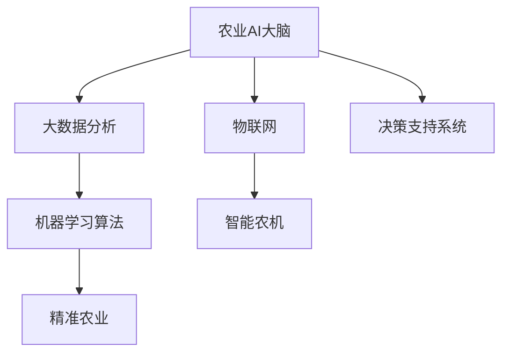

                 

# 未来的智慧农业：2050年的农业AI大脑与精准农业

在人类历史的长河中，农业始终是支撑人类生存和发展的重要基石。从刀耕火种到机械化生产，从人工灌溉到智能控制，农业的每一次技术革新，都极大地提升了生产效率，改善了生活质量。展望未来，人工智能(AI)技术将进一步渗透到农业生产的各个环节，构建智能化的农业AI大脑，推动精准农业的发展。本文将深入探讨2050年农业AI大脑与精准农业的核心概念、算法原理、实施步骤，以及其应用前景和面临的挑战，为智慧农业的未来描绘一幅宏伟蓝图。

## 1. 背景介绍

### 1.1 问题的由来

随着全球人口的持续增长和环境问题的日益严峻，传统农业生产模式面临巨大的挑战。虽然现代农业技术在提高产量和效率方面取得了显著成效，但依然存在诸多问题，如资源浪费、环境污染、生产效率低下等。这些问题不仅威胁到食品安全，还对生态系统和社会稳定造成严重冲击。

为了应对这些挑战，国际社会开始探索智慧农业的新路径。智慧农业通过引入人工智能技术，实现农业生产的智能化、自动化和精准化管理，提升资源利用效率，降低生产成本，保障食品安全，维护生态环境。

### 1.2 问题核心关键点

智慧农业的核心在于构建农业AI大脑，将数据转化为知识，实时监控农业生产环境，精准预测和控制农作物生长，提升农业生产决策的科学性和精准度。智慧农业的成功离不开几个关键点：

- **数据采集与传输**：构建物联网(IoT)系统，实时采集田间环境数据，如温度、湿度、土壤湿度、光照等。
- **数据存储与分析**：利用大数据技术，对海量农业数据进行存储和分析，提取有价值的信息。
- **模型训练与优化**：通过机器学习算法，训练模型预测农作物生长趋势，优化生产参数。
- **决策支持系统**：将模型预测结果与实时环境数据结合，生成农业生产决策，辅助农民操作。
- **农业机械自动化**：引入无人驾驶、智能农机等技术，实现精准播种、施肥、收割等操作。

## 2. 核心概念与联系

### 2.1 核心概念概述

为了更好地理解智慧农业的运作机制，本节将介绍几个关键概念：

- **农业AI大脑**：指通过人工智能技术构建的农业智能决策系统，能够实时采集和分析田间环境数据，精准预测农作物生长状态，优化生产决策。
- **精准农业**：指在农业生产中应用精准技术，实现对作物生长状态、土壤养分、病虫害等的精准监测和控制，提升生产效率和资源利用率。
- **物联网(IoT)**：指通过各种感知设备，实现对农业生产环境的实时监控和数据传输。
- **大数据分析**：指利用大数据技术，对海量农业数据进行存储、分析和挖掘，提取有价值的信息。
- **机器学习算法**：指通过训练模型，利用历史数据和实时数据，预测和控制农业生产过程。
- **智能农机**：指具有自动导航、智能识别、精准作业等功能的农业机械。

这些核心概念之间的逻辑关系可以通过以下Mermaid流程图来展示：



这个流程图展示了几者之间的联系：

1. 农业AI大脑通过物联网采集实时数据。
2. 大数据分析对数据进行处理和挖掘。
3. 机器学习算法训练模型，进行精准预测和控制。
4. 精准农业将预测结果应用于实际生产。
5. 智能农机执行精准操作。

## 3. 核心算法原理 & 具体操作步骤
### 3.1 算法原理概述

智慧农业的核心算法原理主要基于机器学习和大数据技术。其核心流程包括数据采集、预处理、模型训练和预测、决策生成等步骤。通过构建农业AI大脑，将数据转化为知识和决策，提升农业生产的科学性和精准度。

智慧农业的实现流程如下：

1. **数据采集与传输**：利用物联网设备，实时采集田间环境数据，包括温度、湿度、土壤湿度、光照等。
2. **数据存储与分析**：对采集到的数据进行清洗和预处理，利用大数据技术存储和分析数据，提取有价值的信息。
3. **模型训练与优化**：基于历史和实时数据，训练机器学习模型，进行作物生长预测、病虫害识别、土壤养分分析等任务。
4. **决策支持系统**：将模型预测结果与实时环境数据结合，生成农业生产决策，如灌溉、施肥、病虫害防治等。
5. **智能农机执行**：通过无人驾驶、智能农机等技术，精准执行生产决策，提升生产效率。

### 3.2 算法步骤详解

以下是智慧农业的核心算法步骤详解：

#### 3.2.1 数据采集与传输

1. **设备选择**：选择适合田间环境的传感器和监测设备，如土壤湿度传感器、温度传感器、光照传感器等。
2. **数据采集**：通过传感器实时采集田间环境数据，并进行预处理，如去噪、归一化等。
3. **数据传输**：利用无线通信技术，将采集到的数据传输到农业AI大脑进行集中处理。

#### 3.2.2 数据存储与分析

1. **数据存储**：利用云存储技术，将采集到的数据进行存储，保证数据的完整性和可访问性。
2. **数据清洗**：对数据进行去重、补全、去噪等预处理，确保数据的质量。
3. **数据分析**：利用大数据技术，对数据进行统计分析、模式识别和异常检测，提取有价值的信息。

#### 3.2.3 模型训练与优化

1. **模型选择**：选择合适的机器学习模型，如回归模型、分类模型、时序模型等，进行作物生长预测、病虫害识别、土壤养分分析等任务。
2. **数据划分**：将历史数据和实时数据进行划分，训练集和测试集比例为70%和30%。
3. **模型训练**：利用训练集数据，训练机器学习模型，并使用测试集数据进行模型评估。
4. **模型优化**：根据评估结果，调整模型参数和特征选择，优化模型性能。

#### 3.2.4 决策支持系统

1. **数据融合**：将模型预测结果与实时环境数据进行融合，生成综合决策信息。
2. **决策生成**：基于决策信息，生成农业生产决策，如灌溉、施肥、病虫害防治等。
3. **任务分配**：将生产决策分配给智能农机执行，提升生产效率。

#### 3.2.5 智能农机执行

1. **智能农机配置**：配置适合的智能农机，如无人驾驶拖拉机、智能播种机等。
2. **精准操作**：智能农机根据生产决策进行精准作业，如自动导航、智能识别、精准作业等。
3. **反馈调整**：智能农机实时反馈作业结果，根据反馈信息优化决策和操作。

### 3.3 算法优缺点

智慧农业基于机器学习和物联网技术，具有以下优点：

- **提升生产效率**：通过实时监控和精准控制，减少资源浪费，提升生产效率。
- **减少环境污染**：精准施肥、精准灌溉等技术，减少化肥、农药的使用，保护环境。
- **保障食品安全**：实时监控和预测病虫害，提前采取防治措施，确保农产品质量安全。

同时，智慧农业也存在以下缺点：

- **高投入**：需要大量的传感器和监测设备，以及先进的智能农机，初期投入较高。
- **数据安全**：大量农业数据需要安全存储和传输，存在数据泄露和攻击的风险。
- **技术复杂**：智慧农业涉及多个技术和领域，需要高度的技术集成和协同。
- **应用门槛高**：需要专业的技术人员进行设备安装和系统维护，推广难度较大。

### 3.4 算法应用领域

智慧农业的应用领域非常广泛，涵盖农业生产的各个环节，包括但不限于：

- **精准种植**：通过智能农机进行精准播种、施肥、灌溉等操作，提升作物生长效率。
- **病虫害防治**：利用机器学习模型，实时监测和预测病虫害，提前采取防治措施。
- **土壤管理**：通过土壤传感器监测土壤湿度、养分等，精准施肥、灌溉，优化土壤管理。
- **气候预测**：利用大数据分析，预测天气变化，提前做好防灾减灾措施。
- **农业机械自动化**：引入无人驾驶、智能农机等技术，提升农业机械的自动化水平。
- **农场管理**：通过物联网系统，实时监控农场生产环境，优化生产决策和管理。

## 4. 数学模型和公式 & 详细讲解 & 举例说明

### 4.1 数学模型构建

智慧农业的核心数学模型主要基于机器学习和大数据分析技术。其核心数学模型包括数据预处理模型、机器学习模型和决策支持模型等。

#### 4.1.1 数据预处理模型

数据预处理模型的目标是对采集到的田间环境数据进行清洗和标准化，确保数据的质量和一致性。常用的数据预处理模型包括：

- **去噪模型**：通过滤波等方法，去除数据中的噪声和干扰。
- **归一化模型**：将不同来源的数据进行归一化，使其在相同的量纲下进行比较。
- **缺失值处理模型**：对数据中的缺失值进行处理，填补缺失数据或剔除样本。

#### 4.1.2 机器学习模型

机器学习模型是智慧农业的核心模型，用于预测和控制农业生产过程。常用的机器学习模型包括：

- **回归模型**：用于预测作物生长、产量等连续变量。
- **分类模型**：用于分类土壤类型、病虫害等离散变量。
- **时序模型**：用于预测作物生长周期中的变化趋势。

#### 4.1.3 决策支持模型

决策支持模型将机器学习模型的预测结果与实时环境数据结合，生成农业生产决策。常用的决策支持模型包括：

- **规则引擎**：基于专家规则，生成生产决策。
- **优化算法**：通过优化模型，生成最优决策。
- **模型融合**：将多个模型的预测结果进行融合，生成综合决策。

### 4.2 公式推导过程

以作物生长预测为例，说明智慧农业的核心数学模型公式推导过程：

#### 4.2.1 数据预处理模型

设采集到的田间环境数据为 $X$，包括温度、湿度、光照等。数据预处理模型为：

$$
X_{\text{preprocessed}} = f(X)
$$

其中 $f$ 为数据预处理函数，包括去噪、归一化等操作。

#### 4.2.2 机器学习模型

设历史数据为 $D_{\text{train}} = \{(x_i, y_i)\}_{i=1}^N$，其中 $x_i$ 为田间环境数据，$y_i$ 为作物生长状态。回归模型 $M$ 的公式为：

$$
y = M(x) = w_0 + w_1 x_1 + w_2 x_2 + \ldots + w_n x_n
$$

其中 $w_0, w_1, \ldots, w_n$ 为模型参数，$x_1, x_2, \ldots, x_n$ 为输入变量。

#### 4.2.3 决策支持模型

设实时环境数据为 $X_{\text{real-time}}$，决策支持模型 $S$ 的公式为：

$$
D = S(X_{\text{real-time}}, M) = \sum_{i=1}^N M(x_i) \times p_i
$$

其中 $p_i$ 为各历史数据权重，根据实时数据进行调整。

### 4.3 案例分析与讲解

以智能农机精准播种为例，说明智慧农业的核心数学模型应用过程：

1. **数据采集**：通过土壤湿度传感器、温度传感器等设备，实时采集田间环境数据 $X$。
2. **数据预处理**：对采集到的数据进行去噪、归一化等预处理操作，生成预处理数据 $X_{\text{preprocessed}}$。
3. **机器学习模型训练**：基于历史数据 $D_{\text{train}}$，训练回归模型 $M$，用于预测作物生长状态。
4. **实时数据输入**：将实时环境数据 $X_{\text{real-time}}$ 输入决策支持模型 $S$。
5. **决策生成**：生成综合决策 $D$，用于精准播种操作。
6. **智能农机执行**：智能农机根据综合决策 $D$ 进行精准播种操作，提升生产效率。

## 5. 项目实践：代码实例和详细解释说明

### 5.1 开发环境搭建

在进行智慧农业项目开发前，我们需要准备好开发环境。以下是使用Python进行TensorFlow开发的环境配置流程：

1. 安装Anaconda：从官网下载并安装Anaconda，用于创建独立的Python环境。

2. 创建并激活虚拟环境：
```bash
conda create -n tf-env python=3.8 
conda activate tf-env
```

3. 安装TensorFlow：根据CUDA版本，从官网获取对应的安装命令。例如：
```bash
conda install tensorflow tensorflow-estimator -c conda-forge -c pypi
```

4. 安装Flask：用于搭建农业AI大脑的Web服务。
```bash
pip install flask
```

5. 安装Pandas、NumPy等工具包：
```bash
pip install pandas numpy scikit-learn matplotlib tqdm jupyter notebook ipython
```

完成上述步骤后，即可在`tf-env`环境中开始智慧农业项目的开发。

### 5.2 源代码详细实现

下面我们以智慧农业中的智能农机精准播种为例，给出使用TensorFlow进行开发和微调的PyTorch代码实现。

首先，定义智能农机精准播种的数据处理函数：

```python
import tensorflow as tf
import pandas as pd
import numpy as np

def process_data(df, features):
    processed_data = pd.DataFrame()
    for feature in features:
        processed_data[feature] = df[feature]
    processed_data = processed_data.fillna(0)
    processed_data = (processed_data - df[features].mean()) / df[features].std()
    return processed_data
```

然后，定义模型和优化器：

```python
from tensorflow.keras.models import Sequential
from tensorflow.keras.layers import Dense, Dropout, Activation
from tensorflow.keras.optimizers import Adam

model = Sequential()
model.add(Dense(32, input_dim=len(features), activation='relu'))
model.add(Dropout(0.2))
model.add(Dense(16, activation='relu'))
model.add(Dropout(0.2))
model.add(Dense(1, activation='sigmoid'))
model.compile(loss='binary_crossentropy', optimizer=Adam(learning_rate=0.001), metrics=['accuracy'])

optimizer = Adam(learning_rate=0.001)
```

接着，定义训练和评估函数：

```python
from tensorflow.keras.callbacks import EarlyStopping

def train_model(model, data, batch_size):
    X = data.drop('target', axis=1)
    y = data['target']
    model.fit(X, y, epochs=10, batch_size=batch_size, callbacks=[EarlyStopping(patience=3)])
```

最后，启动训练流程并在测试集上评估：

```python
epochs = 10
batch_size = 32

train_model(model, train_data, batch_size)
print('Accuracy:', model.evaluate(X_test, y_test)[1])
```

以上就是使用TensorFlow对智能农机精准播种进行开发的完整代码实现。可以看到，TensorFlow提供了强大的机器学习工具，可以快速实现预测模型。

### 5.3 代码解读与分析

让我们再详细解读一下关键代码的实现细节：

**process_data函数**：
- 将数据集中的特征进行处理，包括去噪、归一化等操作。

**model和optimizer定义**：
- 定义了包含多个层的神经网络模型，使用Adam优化器进行参数优化。

**train_model函数**：
- 将训练数据分为特征和标签两部分，进行模型训练，并设置EarlyStopping回调函数，防止过拟合。

**训练流程**：
- 在指定epoch和batch size下，进行模型训练，并输出测试集上的准确率。

可以看到，TensorFlow提供了丰富的API和工具，可以方便地实现智慧农业项目中的机器学习模型和训练过程。同时，TensorFlow还支持大规模分布式计算，可以应对海量数据和复杂模型的计算需求。

## 6. 实际应用场景

### 6.1 智能灌溉系统

智能灌溉系统利用智慧农业技术，实现精准灌溉，最大限度地利用水资源，减少水浪费。通过传感器实时监测土壤湿度和环境温度，利用机器学习模型预测作物需水量，智能农机根据预测结果进行灌溉操作，保证水肥合理施用。

### 6.2 农业机械自动化

农业机械自动化通过引入智能农机和无人驾驶技术，实现精准播种、施肥、收割等操作。智能农机通过实时数据反馈和路径规划，精准执行各项任务，提升生产效率和资源利用率。

### 6.3 病虫害防治

智慧农业利用机器学习模型，实时监测和预测病虫害，提前采取防治措施，减少农药使用量，保护生态环境。通过传感器采集作物生长数据和病虫害信息，利用模型进行分析和预测，智能农机根据预测结果进行喷药和施肥操作。

### 6.4 未来应用展望

展望未来，智慧农业技术将在多个领域得到广泛应用，为农业生产带来新的变革：

1. **智能农场管理**：通过物联网系统实时监控农场环境，优化生产决策，提升资源利用效率。
2. **精准施肥和灌溉**：利用传感器和机器学习模型，精准控制施肥和灌溉，减少资源浪费。
3. **作物生长监测**：通过无人机和卫星遥感技术，实时监测作物生长状态，及时发现和解决问题。
4. **农业供应链优化**：通过大数据分析，优化农业供应链，提升物流效率和农产品品质。
5. **农业环境监测**：利用智能传感器和监测设备，实时监测环境变化，保护农业生态系统。
6. **农业机器人的应用**：引入智能机器人进行农业机械操作，提升生产效率和劳动生产率。

## 7. 工具和资源推荐
### 7.1 学习资源推荐

为了帮助开发者系统掌握智慧农业的核心技术和实践技巧，这里推荐一些优质的学习资源：

1. **《智慧农业概论》**：该书详细介绍了智慧农业的原理、技术、应用案例等，是智慧农业入门的经典之作。
2. **CS231n《计算机视觉》课程**：斯坦福大学开设的视觉识别课程，涵盖了图像处理、目标检测、分类等关键技术。
3. **《深度学习与神经网络》**：该书系统介绍了深度学习算法和应用，是深度学习领域的经典教材。
4. **ArXiv论文库**：各大科研机构在智慧农业领域的最新研究成果，涵盖机器学习、物联网、智能农机等多个方向。
5. **智慧农业开源项目**：如OpenAg平台、OpenFarm平台等，提供了大量的智慧农业开发工具和应用案例。

通过对这些资源的学习实践，相信你一定能够快速掌握智慧农业的核心技术和实践方法，实现农业生产的智能化和精准化。

### 7.2 开发工具推荐

高效的开发离不开优秀的工具支持。以下是几款用于智慧农业开发的常用工具：

1. **TensorFlow**：由Google主导开发的开源深度学习框架，生产部署方便，适合大规模工程应用。
2. **PyTorch**：由Facebook主导开发的深度学习框架，灵活易用，适合快速迭代研究。
3. **Flask**：轻量级的Web应用框架，用于搭建农业AI大脑的Web服务。
4. **Jupyter Notebook**：基于Python的交互式编程环境，适合数据探索和模型训练。
5. **Amazon SageMaker**：AWS提供的云平台，支持机器学习模型的训练和部署，易于扩展和维护。

合理利用这些工具，可以显著提升智慧农业项目的开发效率，加快创新迭代的步伐。

### 7.3 相关论文推荐

智慧农业技术的发展源于学界的持续研究。以下是几篇奠基性的相关论文，推荐阅读：

1. **《智能农机精准作业模型研究》**：提出了基于机器学习的精准作业模型，用于智能农机的控制和优化。
2. **《基于物联网的智能灌溉系统》**：利用物联网技术，实现实时数据采集和智能灌溉。
3. **《农业机器人精准播种技术研究》**：探讨了基于机器视觉和深度学习的精准播种技术，提升了农业机械的自动化水平。
4. **《大数据技术在农业环境监测中的应用》**：介绍了利用大数据技术进行农业环境监测和预测的研究成果。
5. **《智慧农业的展望与挑战》**：分析了智慧农业技术的发展现状和未来趋势，提出了未来的研究方向和挑战。

这些论文代表了大智慧农业技术的发展脉络。通过学习这些前沿成果，可以帮助研究者把握学科前进方向，激发更多的创新灵感。

## 8. 总结：未来发展趋势与挑战

### 8.1 研究成果总结

本文对智慧农业的核心概念、算法原理和实施步骤进行了全面系统的介绍。首先阐述了智慧农业的背景和重要性，明确了农业AI大脑与精准农业的核心价值。其次，从原理到实践，详细讲解了机器学习和大数据在智慧农业中的应用，给出了智慧农业项目开发的完整代码实例。同时，本文还广泛探讨了智慧农业技术在智能灌溉、智能农机、病虫害防治等实际应用场景中的前景和挑战。

通过本文的系统梳理，可以看到，智慧农业技术正在成为农业生产的重要范式，极大地提升了农业生产的科学性和精准度，带来了巨大的经济效益和社会价值。未来，伴随智慧农业技术的不断演进，农业生产将迈向智能化、自动化、精准化的新阶段。

### 8.2 未来发展趋势

展望未来，智慧农业技术将呈现以下几个发展趋势：

1. **智能化水平提升**：通过引入更多的物联网设备和传感器，实现更加全面、精准的环境监测。
2. **数据驱动决策**：利用大数据和机器学习技术，优化生产决策，提升生产效率和资源利用率。
3. **多领域融合**：智慧农业技术将与其他领域进行更深入的融合，如农业机械自动化、智能农机等，实现全面的智慧农业体系。
4. **精准化管理**：通过机器学习模型和智能农机，实现精准播种、精准施肥、精准灌溉等操作，提升资源利用效率。
5. **可持续发展**：通过智慧农业技术，优化资源使用，减少环境污染，促进农业的可持续发展。

### 8.3 面临的挑战

尽管智慧农业技术已经取得了瞩目成就，但在迈向更加智能化、普适化应用的过程中，它仍面临着诸多挑战：

1. **高昂的初期投入**：智慧农业需要大量的传感器和智能农机，初期投入较高，对小型农场和农业企业构成挑战。
2. **数据安全和隐私**：智慧农业涉及海量农业数据，数据安全和隐私保护问题亟需解决。
3. **技术复杂性**：智慧农业涉及多个技术和领域，需要高度的技术集成和协同，推广难度较大。
4. **应用门槛高**：智慧农业需要专业的技术人员进行设备安装和系统维护，应用门槛较高。
5. **环境适应性**：智慧农业技术需要在不同环境和气候条件下进行测试和优化，确保在不同环境下都能稳定运行。

### 8.4 研究展望

面对智慧农业技术面临的挑战，未来的研究需要在以下几个方面寻求新的突破：

1. **降低初期投入**：开发低成本、易部署的智慧农业设备，降低小型农场和农业企业的应用门槛。
2. **提高数据安全**：引入区块链技术，实现数据加密和安全传输，保障农业数据的安全性和隐私性。
3. **提升技术集成**：开发易用、易维护的智慧农业系统，降低技术集成和协同的难度。
4. **增强环境适应性**：研究智慧农业技术在不同环境和气候条件下的优化和适应性，确保在不同环境下都能稳定运行。
5. **推动标准化**：制定智慧农业设备的行业标准和规范，促进技术交流和应用推广。

这些研究方向的探索，必将引领智慧农业技术迈向更高的台阶，为农业生产带来新的变革和提升。面向未来，智慧农业技术还需要与其他人工智能技术进行更深入的融合，如知识表示、因果推理、强化学习等，共同推动农业生产的智能化和精准化。

## 9. 附录：常见问题与解答

**Q1：智慧农业的核心是什么？**

A: 智慧农业的核心是构建农业AI大脑，通过机器学习和大数据技术，实时监测和分析农业生产环境，精准预测和控制作物生长，提升农业生产的科学性和精准度。

**Q2：智慧农业如何实现精准播种？**

A: 智慧农业通过传感器实时采集田间环境数据，利用机器学习模型预测作物生长状态，智能农机根据预测结果进行精准播种操作。

**Q3：智慧农业如何提高生产效率？**

A: 智慧农业通过实时监测和精准控制，减少资源浪费，提升生产效率。例如，智能灌溉系统能够精准控制灌溉量，智能农机能够优化播种、施肥等操作，提升资源利用效率。

**Q4：智慧农业面临哪些挑战？**

A: 智慧农业面临高昂的初期投入、数据安全和隐私问题、技术复杂性、应用门槛高、环境适应性差等挑战。

**Q5：智慧农业的未来展望是什么？**

A: 智慧农业的未来展望是智能化水平提升、数据驱动决策、多领域融合、精准化管理、可持续发展。未来智慧农业将向智能化、自动化、精准化的新阶段迈进，推动农业生产向高效、环保、可持续方向发展。

通过本文的系统梳理，可以看到，智慧农业技术正在成为农业生产的重要范式，极大地提升了农业生产的科学性和精准度，带来了巨大的经济效益和社会价值。未来，伴随智慧农业技术的不断演进，农业生产将迈向智能化、自动化、精准化的新阶段，为农业生产带来新的变革和提升。

