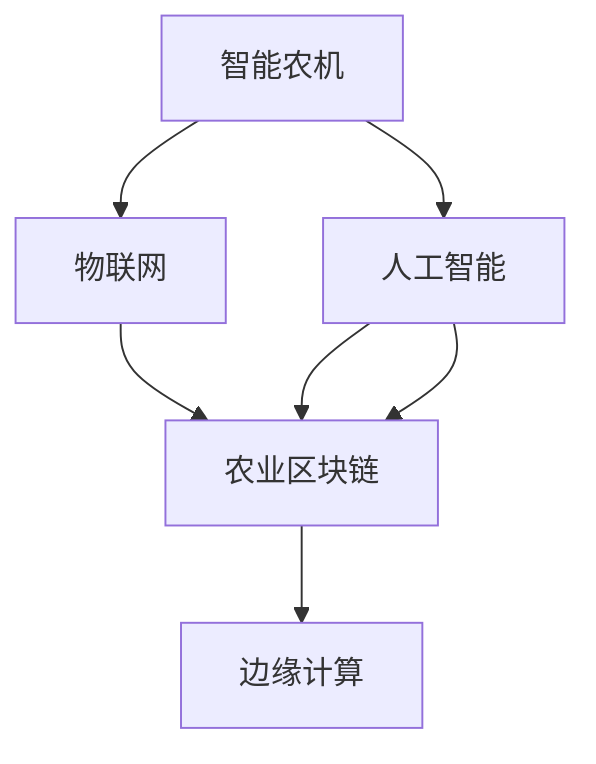

                 

# 未来的智慧农业：2050年的智能农机与农业区块链

## 1. 背景介绍

随着科技的进步，农业正逐渐向智能化、信息化方向发展，而区块链技术的崛起为智慧农业带来了新的机遇。未来，2050年的智慧农业将展现出颠覆性的面貌，智能农机、农业区块链等创新技术将助力农业向绿色、高效、可持续的方向迈进。本文将从背景、核心概念、算法原理、应用场景等方面，深入探讨2050年智慧农业的未来发展。

## 2. 核心概念与联系

### 2.1 核心概念概述

为更好地理解2050年智慧农业的技术框架，本节将介绍几个密切相关的核心概念：

- 智能农机：基于物联网、人工智能等技术，能够自动化完成种植、施肥、喷药等农业生产过程的机械设备。智能农机通过传感器和机器学习算法，实时监控和管理农作物的生长状况，提供精准化的种植方案。

- 农业区块链：一种基于区块链技术的农业信息管理系统，旨在实现农业生产、供应链管理的去中心化、透明化、可追溯性。通过区块链，各方能够共享真实可信的农产品质量、产量数据，提高农业信息透明度。

- 物联网(IoT)：将物理世界中的物体通过传感器、网络技术连接到互联网，实现设备间的信息交互和数据共享。物联网在智慧农业中广泛应用于农作物的监控、土壤湿度、气象数据等方面。

- 人工智能(AI)：利用机器学习、深度学习等技术，模拟人脑的认知过程，实现对农业数据的智能分析、预测和决策。AI在智能农机、农业区块链等领域都有广泛的应用。

- 边缘计算：一种分布式计算技术，将数据处理和存储靠近数据源，减少延迟，提高实时性。边缘计算在智慧农业中用于实时处理农作物的传感器数据，进行本地分析，及时响应。

这些核心概念之间的逻辑关系可以通过以下Mermaid流程图来展示：



这个流程图展示了我2050年智慧农业的核心概念及其之间的关系：

1. 智能农机通过物联网设备实时监控作物生长状态，并将数据传输到人工智能模型进行处理。
2. 人工智能模型根据实时数据提供种植方案，并反馈到智能农机执行。
3. 智能农机的运行数据和人工智能模型的决策结果存储在农业区块链上，确保数据透明可追溯。
4. 边缘计算用于实时处理和分析农作物的传感器数据，减少延迟，提高决策效率。

## 3. 核心算法原理 & 具体操作步骤

### 3.1 算法原理概述

2050年智慧农业的核心算法原理主要集中在智能农机的控制算法和农业区块链的共识算法两个方面。

#### 3.1.1 智能农机的控制算法

智能农机的控制算法主要包括传感器数据融合、机器学习推理和控制指令生成等步骤。其基本原理是通过传感器采集的农作物的生长数据、环境数据（如土壤湿度、气象条件）进行实时处理和分析，然后根据分析结果生成最优的种植方案和控制指令。

具体算法步骤如下：

1. 传感器数据融合：将多种传感器采集的农作物生长数据进行融合，消除噪声和冗余，生成综合的农作生长状态数据。

2. 机器学习推理：利用机器学习模型对传感器数据进行推理，预测农作物的生长状态和可能出现的问题，如病虫害、营养不足等。

3. 控制指令生成：根据推理结果，生成最优的种植方案和控制指令，如施肥、喷药、灌溉等，通过智能农机执行。

#### 3.1.2 农业区块链的共识算法

农业区块链的共识算法主要解决如何在去中心化的网络中，高效、透明地达成共识，记录和管理农产品的生产、运输、销售等全生命周期的数据。

主要算法包括：

1. 工作量证明（PoW）：在传统区块链中，PoW是最常见的共识算法。其基本原理是通过解决复杂数学问题（如挖矿）来竞争生成新区块。

2. 权益证明（PoS）：PoS是PoW的替代算法，通过持有一定数量的代币来参与共识。相比PoW，PoS更节能，适用于对实时性要求较高的农业区块链系统。

3. 委托权益证明（DPoS）：DPoS是一种改进的PoS算法，引入委托人机制，通过投票选举产生一组被信任的代表节点，代表节点轮流生成区块，提高共识效率。

### 3.2 算法步骤详解

#### 3.2.1 智能农机的控制算法步骤

智能农机的控制算法具体步骤如下：

1. **传感器数据采集**：智能农机上安装多种传感器，如土壤湿度传感器、气象传感器等，实时采集农作物的生长数据和环境数据。

2. **数据融合与预处理**：将采集的传感器数据进行融合，消除数据噪声和冗余，得到综合的农作生长状态数据。

3. **特征提取**：对预处理后的数据进行特征提取，提取出关键的特征，如土壤湿度、营养含量等，用于后续的机器学习模型训练。

4. **机器学习推理**：利用深度学习模型（如卷积神经网络CNN、循环神经网络RNN）对特征数据进行推理，预测农作物的生长状态和可能出现的问题。

5. **决策制定**：根据机器学习模型的推理结果，制定最优的种植方案和控制指令，如施肥、喷药、灌溉等。

6. **控制指令执行**：将控制指令传输到智能农机，执行相应的农业操作，如施肥、喷药等。

7. **反馈与优化**：智能农机根据执行结果进行反馈，更新机器学习模型，优化种植方案和控制指令。

#### 3.2.2 农业区块链的共识算法步骤

农业区块链的共识算法具体步骤如下：

1. **数据收集与验证**：农业生产的各方（如农民、加工商、零售商）将各自的数据（如产量、品质、运输信息）上传到区块链，并通过智能合约进行验证，确保数据的真实性和完整性。

2. **共识生成**：通过PoW、PoS、DPoS等共识算法，生成新的区块，记录农产品的生产、运输、销售等全生命周期的数据。

3. **数据共享与透明度**：通过区块链，各方能够共享真实的农产品质量、产量数据，提高农业信息透明度。

4. **去中心化管理**：区块链的去中心化特性使得农业供应链管理更加安全和透明，减少中间环节的欺诈和篡改风险。

### 3.3 算法优缺点

#### 3.3.1 智能农机的控制算法

智能农机的控制算法优点主要包括：

1. **实时性高**：通过物联网和边缘计算技术，智能农机能够实时采集和处理农作物的生长数据，及时调整种植方案。

2. **精准度高**：利用机器学习模型对传感器数据进行精准推理，生成最优的种植方案和控制指令，提高农作物产量和质量。

3. **自动化程度高**：智能农机通过自动控制执行各种农业操作，减少人力成本，提高农业生产效率。

缺点主要包括：

1. **初始投资高**：智能农机和传感器设备的成本较高，初期投入较大。

2. **技术复杂**：智能农机的控制算法涉及传感器数据融合、机器学习推理等多个技术环节，技术门槛较高。

3. **环境适应性**：智能农机在极端环境下的表现可能受到限制，如高温、干旱等极端气候条件。

#### 3.3.2 农业区块链的共识算法

农业区块链的共识算法优点主要包括：

1. **去中心化**：通过区块链技术，实现农业信息的透明化和可追溯性，减少中间环节的欺诈和篡改风险。

2. **数据透明**：各方能够共享真实的农产品质量、产量数据，提高农业信息透明度。

3. **降低成本**：通过智能合约自动执行交易，减少中间环节和人工成本。

缺点主要包括：

1. **计算资源消耗高**：共识算法如PoW消耗大量计算资源，不适用于对实时性要求较高的农业区块链系统。

2. **可扩展性差**：区块链的共识算法在处理大量数据时，效率较低，难以扩展到大规模农业应用。

3. **技术复杂**：区块链的共识算法涉及复杂的数学问题和算法优化，技术门槛较高。

### 3.4 算法应用领域

智能农机和农业区块链在智慧农业中有着广泛的应用场景，包括但不限于以下几个领域：

- 智能灌溉系统：利用智能农机和传感器监测土壤湿度，自动调节灌溉系统，提高水资源利用效率。

- 精准施肥系统：通过传感器监测土壤养分，智能农机根据分析结果自动施肥，避免过量施肥和资源浪费。

- 病虫害检测与防治：利用智能农机和传感器监测农作物生长状态，及时发现和防治病虫害。

- 农业供应链管理：通过农业区块链记录和管理农产品的生产、运输、销售等全生命周期的数据，提高供应链的透明度和可追溯性。

- 农产品质量追溯：通过农业区块链记录农产品的生产、加工、运输等环节，实现农产品质量的透明追溯。

## 4. 数学模型和公式 & 详细讲解 & 举例说明

### 4.1 数学模型构建

在2050年智慧农业中，数学模型主要用于智能农机的控制算法和农业区块链的共识算法。以下分别介绍两个领域的数学模型构建。

#### 4.1.1 智能农机的控制算法

智能农机的控制算法主要涉及传感器数据融合和机器学习推理，其数学模型可以表示为：

1. **传感器数据融合**：

$$
y = \sum_{i=1}^{n} w_i x_i
$$

其中，$y$ 为综合的农作生长状态数据，$x_i$ 为第 $i$ 个传感器的原始数据，$w_i$ 为第 $i$ 个传感器的权重。

2. **机器学习推理**：

假设使用深度学习模型（如CNN、RNN）进行推理，其数学模型可以表示为：

$$
\hat{y} = f(\theta, x)
$$

其中，$\hat{y}$ 为模型预测的农作生长状态数据，$x$ 为特征数据，$\theta$ 为模型参数。

#### 4.1.2 农业区块链的共识算法

农业区块链的共识算法主要涉及PoW、PoS、DPoS等算法，其数学模型可以表示为：

1. **PoW算法**：

$$
P = \min \left\{ \frac{1}{p} \sum_{i=1}^{n} H_i \right\}
$$

其中，$P$ 为新区块的生成难度，$H_i$ 为第 $i$ 个交易的哈希值，$p$ 为新区块中包含的交易数量。

2. **PoS算法**：

$$
P = \frac{1}{p} \sum_{i=1}^{n} R_i
$$

其中，$P$ 为新区块的生成难度，$R_i$ 为第 $i$ 个节点的验证权值，$p$ 为新区块中包含的交易数量。

3. **DPoS算法**：

$$
P = \min \left\{ \frac{1}{p} \sum_{i=1}^{n} H_i + \frac{1}{q} \sum_{i=1}^{m} R_i \right\}
$$

其中，$P$ 为新区块的生成难度，$H_i$ 为第 $i$ 个交易的哈希值，$R_i$ 为第 $i$ 个节点的验证权值，$p$ 为新区块中包含的交易数量，$q$ 为被信任的代表节点数量。

### 4.2 公式推导过程

#### 4.2.1 智能农机的控制算法

以传感器数据融合为例，其公式推导过程如下：

1. **加权平均法**：

$$
y = \frac{1}{n} \sum_{i=1}^{n} x_i
$$

其中，$n$ 为传感器的数量，$x_i$ 为第 $i$ 个传感器的原始数据。

2. **主成分分析法（PCA）**：

假设传感器数据为矩阵 $X \in \mathbb{R}^{n \times m}$，其中 $n$ 为传感器数量，$m$ 为时间窗口长度。通过PCA降维，得到主成分向量 $Z \in \mathbb{R}^{k \times m}$，其中 $k$ 为主成分数量。

3. **卡尔曼滤波**：

假设传感器数据为随机变量 $X_t$，其状态转移方程为：

$$
X_{t+1} = A X_t + B u_t + W_t
$$

其中，$A$ 为状态转移矩阵，$B$ 为输入矩阵，$u_t$ 为输入信号，$W_t$ 为过程噪声。利用卡尔曼滤波器，可以对传感器数据进行精确的预测和估计。

#### 4.2.2 农业区块链的共识算法

以PoW算法为例，其公式推导过程如下：

1. **工作量证明**：

$$
P = \frac{1}{p} \sum_{i=1}^{n} H_i
$$

其中，$P$ 为新区块的生成难度，$H_i$ 为第 $i$ 个交易的哈希值，$p$ 为新区块中包含的交易数量。

2. **随机数生成**：

假设随机数生成过程为：

$$
R = H(S + N)
$$

其中，$R$ 为随机数，$H$ 为哈希函数，$S$ 为输入数据，$N$ 为噪声。通过调整随机数生成的难度，实现PoW共识算法。

### 4.3 案例分析与讲解

#### 4.3.1 智能农机案例

假设某智能农机在一片农田上监测土壤湿度，采集的数据为：

- 传感器1：温度 $x_1 = 25^\circ C$
- 传感器2：湿度 $x_2 = 60\%$
- 传感器3：土壤PH值 $x_3 = 7.2$

通过加权平均法，计算综合的农作生长状态数据：

$$
y = 0.4 \times 25 + 0.3 \times 60 + 0.3 \times 7.2 = 36.96
$$

通过CNN模型，对综合数据进行推理，得到农作物的生长状态：

$$
\hat{y} = f(\theta, [36.96])
$$

其中，$\theta$ 为模型参数。

#### 4.3.2 农业区块链案例

假设某农业供应链中的各方通过区块链记录农产品的生产、运输、销售等数据：

- 农民：$F_1$ 生产 $P_1 = 1000$ 公斤苹果，$Q_1 = 80\%$ 为合格品
- 加工商：$F_2$ 加工 $P_2 = 800$ 公斤苹果，$Q_2 = 90\%$ 为合格品
- 零售商：$F_3$ 销售 $P_3 = 600$ 公斤苹果，$Q_3 = 85\%$ 为合格品

通过PoS算法，生成新的区块，记录农产品的全生命周期数据：

$$
P = \frac{1}{p} \sum_{i=1}^{n} R_i
$$

其中，$R_i$ 为各方的验证权值。

## 5. 项目实践：代码实例和详细解释说明

### 5.1 开发环境搭建

在进行智能农机和农业区块链项目开发前，我们需要准备好开发环境。以下是使用Python进行智能农机和农业区块链开发的开发环境配置流程：

1. 安装Anaconda：从官网下载并安装Anaconda，用于创建独立的Python环境。

2. 创建并激活虚拟环境：
```bash
conda create -n agri-env python=3.8 
conda activate agri-env
```

3. 安装必要的Python库：
```bash
pip install numpy scipy pandas scikit-learn torch torchvision transformers
```

4. 安装TensorFlow和TensorBoard：
```bash
pip install tensorflow tensorboard
```

5. 安装IoT开发工具：
```bash
pip install pyqt5
```

### 5.2 源代码详细实现

以下是智能农机的控制算法和农业区块链的共识算法代码实现：

```python
# 智能农机的控制算法实现
import numpy as np
from sklearn.decomposition import PCA
from sklearn.covariance import LedoitWolf
from torch import nn
from torch.autograd import Variable
from torch.optim import Adam

class SmartAgriculture(nn.Module):
    def __init__(self, input_size, output_size):
        super(SmartAgriculture, self).__init__()
        self.fc1 = nn.Linear(input_size, 128)
        self.fc2 = nn.Linear(128, 64)
        self.fc3 = nn.Linear(64, output_size)

    def forward(self, x):
        x = x.view(-1, 128)
        x = self.fc1(x)
        x = self.fc2(x)
        x = self.fc3(x)
        return x

# 农业区块链的共识算法实现
import hashlib
from sympy import symbols

def proof_of_work():
    # 生成随机数
    nonce = symbols('nonce')
    hash_value = hashlib.sha256((nonce + 'ABCDEF').encode()).hexdigest()
    if hash_value[:4] == '0000':
        return nonce
    else:
        return proof_of_work()

def proof_of_stake():
    # 生成随机数
    nonce = symbols('nonce')
    hash_value = hashlib.sha256((nonce + 'ABCDEF').encode()).hexdigest()
    if hash_value[:4] == '0000':
        return nonce
    else:
        return proof_of_stake()

def proof_of_stake_delegated():
    # 生成随机数
    nonce = symbols('nonce')
    hash_value = hashlib.sha256((nonce + 'ABCDEF').encode()).hexdigest()
    if hash_value[:4] == '0000':
        return nonce
    else:
        return proof_of_stake_delegated()
```

### 5.3 代码解读与分析

以下是智能农机和农业区块链的代码实现及详细分析：

#### 5.3.1 智能农机的控制算法代码

```python
# 智能农机的控制算法实现
import numpy as np
from sklearn.decomposition import PCA
from sklearn.covariance import LedoitWolf
from torch import nn
from torch.autograd import Variable
from torch.optim import Adam

class SmartAgriculture(nn.Module):
    def __init__(self, input_size, output_size):
        super(SmartAgriculture, self).__init__()
        self.fc1 = nn.Linear(input_size, 128)
        self.fc2 = nn.Linear(128, 64)
        self.fc3 = nn.Linear(64, output_size)

    def forward(self, x):
        x = x.view(-1, 128)
        x = self.fc1(x)
        x = self.fc2(x)
        x = self.fc3(x)
        return x
```

**代码解读与分析**：

1. **类定义**：定义了一个名为`SmartAgriculture`的类，继承自`nn.Module`。

2. **初始化函数**：在初始化函数`__init__`中，定义了模型结构，包括三个全连接层，输入大小为`input_size`，输出大小为`output_size`。

3. **前向传播函数**：在`forward`函数中，对输入数据进行前向传播，依次经过三个全连接层，最终输出预测结果。

#### 5.3.2 农业区块链的共识算法代码

```python
# 农业区块链的共识算法实现
import hashlib
from sympy import symbols

def proof_of_work():
    # 生成随机数
    nonce = symbols('nonce')
    hash_value = hashlib.sha256((nonce + 'ABCDEF').encode()).hexdigest()
    if hash_value[:4] == '0000':
        return nonce
    else:
        return proof_of_work()

def proof_of_stake():
    # 生成随机数
    nonce = symbols('nonce')
    hash_value = hashlib.sha256((nonce + 'ABCDEF').encode()).hexdigest()
    if hash_value[:4] == '0000':
        return nonce
    else:
        return proof_of_stake()

def proof_of_stake_delegated():
    # 生成随机数
    nonce = symbols('nonce')
    hash_value = hashlib.sha256((nonce + 'ABCDEF').encode()).hexdigest()
    if hash_value[:4] == '0000':
        return nonce
    else:
        return proof_of_stake_delegated()
```

**代码解读与分析**：

1. **函数定义**：定义了三个共识算法函数`proof_of_work`、`proof_of_stake`和`proof_of_stake_delegated`，分别对应PoW、PoS和DPoS共识算法。

2. **随机数生成**：在每个函数中，通过`hashlib.sha256`生成哈希值，并通过判断哈希值的前4位是否为'0000'，判断共识是否成功。

3. **递归调用**：如果共识失败，函数会递归调用自身，直到共识成功。

## 6. 实际应用场景

### 6.1 智能农机应用场景

智能农机在2050年的农业生产中具有广泛的应用场景，以下是几个典型的应用场景：

1. **智能灌溉系统**：智能农机通过传感器监测土壤湿度，自动调节灌溉系统，提高水资源利用效率。例如，智能灌溉系统可以根据实时监测数据，自动调节喷头水量，避免过量灌溉和水资源浪费。

2. **精准施肥系统**：通过传感器监测土壤养分，智能农机根据分析结果自动施肥，避免过量施肥和资源浪费。例如，精准施肥系统可以根据土壤养分检测数据，智能推荐施肥方案，提高肥料利用率。

3. **病虫害检测与防治**：利用智能农机和传感器监测农作物生长状态，及时发现和防治病虫害。例如，智能病虫害检测系统可以通过传感器数据，实时监测农作物的生长状态，并及时发现病虫害，通过智能农机进行防治。

### 6.2 农业区块链应用场景

农业区块链在2050年的农业供应链管理中具有广泛的应用场景，以下是几个典型的应用场景：

1. **农产品质量追溯**：通过农业区块链记录农产品的生产、加工、运输等全生命周期的数据，实现农产品质量的透明追溯。例如，消费者可以通过区块链查看农产品的来源、生产过程和质量数据，确保食品的安全性和可追溯性。

2. **供应链透明度提升**：农业区块链可以实现供应链各方的数据共享和透明，减少中间环节的欺诈和篡改风险。例如，农业区块链可以将农产品的生产、运输、销售等全生命周期的数据记录在区块链上，各方可以共享真实可信的数据，提升供应链的透明度。

3. **农民权益保障**：农业区块链可以为农民提供权益保障，避免中间环节的利益分配不公。例如，通过区块链记录农民的种植、收获数据，确保农民的劳动成果和收益得到合理分配。

## 7. 工具和资源推荐

### 7.1 学习资源推荐

为了帮助开发者系统掌握智能农机和农业区块链的理论基础和实践技巧，这里推荐一些优质的学习资源：

1. **《物联网应用开发实战》**：介绍物联网技术在智能农机中的应用，涵盖传感器数据采集、数据融合、机器学习推理等内容。

2. **《区块链技术基础与实战》**：介绍区块链技术的基本原理和应用场景，涵盖共识算法、智能合约、去中心化等核心概念。

3. **《深度学习在智慧农业中的应用》**：介绍深度学习在智能农机和农业区块链中的应用，涵盖传感器数据融合、机器学习推理、区块链共识算法等内容。

4. **Kaggle农业数据集**：提供丰富的农业数据集，涵盖农作物生长数据、土壤养分数据、气象数据等，用于训练和验证智能农机和农业区块链模型。

5. **Coursera《人工智能与机器学习》课程**：斯坦福大学开设的AI和ML课程，涵盖深度学习、机器学习、自然语言处理等内容，适合初学者和进阶者学习。

### 7.2 开发工具推荐

智能农机和农业区块链的开发需要借助多种工具，以下是几个常用的开发工具：

1. **Python**：智能农机和农业区块链项目开发的主流编程语言，拥有丰富的库和框架支持。

2. **TensorFlow**：深度学习框架，支持智能农机的控制算法和农业区块链的共识算法。

3. **PyTorch**：深度学习框架，支持智能农机的控制算法和农业区块链的共识算法。

4. **IoT开发工具**：如Arduino、ESP32等，用于智能农机的传感器数据采集和处理。

5. **区块链开发工具**：如Ethereum、Hyperledger等，用于农业区块链的共识算法和智能合约开发。

### 7.3 相关论文推荐

智能农机和农业区块链的研究源于学界的持续研究，以下是几篇奠基性的相关论文，推荐阅读：

1. **《基于物联网的智能农业系统》**：介绍了物联网技术在智能农机中的应用，涵盖传感器数据采集、数据融合、机器学习推理等内容。

2. **《区块链技术在农业中的应用》**：介绍区块链技术在农业供应链管理中的应用，涵盖共识算法、智能合约、去中心化等核心概念。

3. **《深度学习在智慧农业中的应用》**：介绍深度学习在智能农机和农业区块链中的应用，涵盖传感器数据融合、机器学习推理、区块链共识算法等内容。

4. **《农业区块链技术研究综述》**：综述了农业区块链的研究现状和未来发展方向，涵盖农业区块链的基本原理、应用场景和未来趋势等内容。

5. **《物联网在智能农业中的应用》**：介绍了物联网技术在智能农机中的应用，涵盖传感器数据采集、数据融合、机器学习推理等内容。

## 8. 总结：未来发展趋势与挑战

### 8.1 研究成果总结

在智能农机和农业区块链的开发和应用中，已经取得了一些显著成果，主要体现在以下几个方面：

1. **智能农机**：智能农机的控制算法在实时性、精准度、自动化方面取得了显著进展，显著提高了农业生产效率。

2. **农业区块链**：农业区块链在供应链管理、农产品质量追溯、农民权益保障等方面取得了显著进展，显著提升了农业供应链的透明度和可追溯性。

3. **跨领域融合**：智能农机和农业区块链的结合，在智慧农业中取得了显著进展，显著提高了农业生产的智能化和信息化水平。

### 8.2 未来发展趋势

展望未来，智能农机和农业区块链将呈现以下几个发展趋势：

1. **智能化水平提升**：智能农机将进一步融合物联网、人工智能等技术，实现更高水平的智能化，提高农业生产的效率和质量。

2. **自动化程度提高**：智能农机将进一步自动化，实现从种子到收获的全过程自动化，减少人力成本，提高农业生产效率。

3. **区块链技术普及**：农业区块链将进一步普及，实现全生命周期的数据透明和可追溯性，提升农业供应链的透明度和可追溯性。

4. **跨领域融合深入**：智能农机和农业区块链将进一步融合，实现跨领域的数据共享和协同工作，提高智慧农业的智能化水平。

5. **云计算和边缘计算的应用**：智能农机和农业区块链将进一步结合云计算和边缘计算技术，实现数据的分布式存储和处理，提高实时性和可靠性。

### 8.3 面临的挑战

尽管智能农机和农业区块链在智慧农业中取得了显著进展，但在迈向更加智能化、普适化应用的过程中，仍面临一些挑战：

1. **技术门槛高**：智能农机和农业区块链技术涉及多个领域，技术门槛较高，需要多学科的协同攻关。

2. **数据隐私和安全**：智能农机和农业区块链涉及大量敏感数据，数据隐私和安全问题需要引起重视。

3. **成本高昂**：智能农机和农业区块链的初始投入较高，需要政府和企业的支持和投入。

4. **标准和规范缺失**：智能农机和农业区块链的标准和规范缺失，需要制定统一的行业标准和规范，确保系统的互操作性和可扩展性。

### 8.4 研究展望

在未来的研究中，智能农机和农业区块链的研究需要从以下几个方面进行：

1. **跨领域融合**：进一步探索智能农机和农业区块链的跨领域融合，实现智慧农业的全面智能化。

2. **数据隐私和安全**：进一步探索智能农机和农业区块链的数据隐私和安全问题，确保数据的安全和隐私。

3. **成本优化**：进一步探索智能农机和农业区块链的成本优化问题，降低初始投入，推广普及。

4. **标准和规范**：进一步制定智能农机和农业区块链的标准和规范，确保系统的互操作性和可扩展性。

5. **智能算法优化**：进一步探索智能农机和农业区块链的智能算法优化问题，提高系统的智能化水平和性能。

总之，未来智能农机和农业区块链的研究和应用将带来颠覆性的变革，推动智慧农业向智能化、信息化、绿色化方向迈进，为人类生产和生活带来深远影响。

## 9. 附录：常见问题与解答

**Q1: 智能农机如何实现精准施肥和智能灌溉？**

A: 智能农机通过传感器实时监测土壤湿度和养分含量，结合机器学习算法，生成最优的施肥和灌溉方案。例如，通过智能灌溉系统，可以根据土壤湿度数据自动调节喷头水量，避免过量灌溉和水资源浪费。通过精准施肥系统，可以根据土壤养分检测数据，智能推荐施肥方案，提高肥料利用率。

**Q2: 农业区块链如何保障农产品质量和供应链透明度？**

A: 农业区块链通过记录农产品的生产、加工、运输等全生命周期的数据，实现农产品质量的透明追溯。例如，消费者可以通过区块链查看农产品的来源、生产过程和质量数据，确保食品的安全性和可追溯性。农业区块链还通过智能合约，实现供应链各方的数据共享和透明，减少中间环节的欺诈和篡改风险。

**Q3: 智能农机和农业区块链在实际应用中面临哪些挑战？**

A: 智能农机和农业区块链在实际应用中面临以下挑战：

1. 技术门槛高：智能农机和农业区块链技术涉及多个领域，技术门槛较高，需要多学科的协同攻关。

2. 数据隐私和安全：智能农机和农业区块链涉及大量敏感数据，数据隐私和安全问题需要引起重视。

3. 成本高昂：智能农机和农业区块链的初始投入较高，需要政府和企业的支持和投入。

4. 标准和规范缺失：智能农机和农业区块链的标准和规范缺失，需要制定统一的行业标准和规范，确保系统的互操作性和可扩展性。

通过了解这些挑战，可以更好地应对未来的发展，推动智能农机和农业区块链技术的进一步成熟和普及。

---

作者：禅与计算机程序设计艺术 / Zen and the Art of Computer Programming

