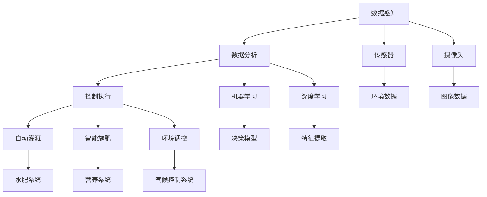

                 

# 未来的智慧农业：2050年的植物工厂与昆虫养殖

在飞速发展的数字时代，智慧农业正逐步实现从传统劳动密集型向数据驱动型的转变。作为农业4.0的核心部分，智慧农业不仅能够大幅提高生产效率和资源利用率，还能实现农业生产管理的智能化和精准化。展望2050年，智慧农业将凭借先进的技术手段和理念，彻底革新农业生产模式，使农业生产变得更加高效、可持续和智能。

## 1. 背景介绍

### 1.1 问题由来
随着全球人口的持续增长和可耕地的不断减少，确保粮食安全成为人类面临的重大挑战。与此同时，气候变化带来的极端天气和环境污染问题，也对农业生产提出了更高的要求。智慧农业正是在这样的背景下应运而生，它利用物联网、大数据、人工智能等前沿技术，将传统农业与智能系统深度融合，为解决这些问题提供了新的途径。

### 1.2 问题核心关键点
智慧农业的核心在于通过数据感知、分析与控制，实现农业生产的智能化、精准化和自动化。其主要关注点包括：

- **数据感知**：利用传感器、摄像头等设备，实时获取植物生长状态、环境参数等数据。
- **数据分析**：通过对收集到的数据进行分析和建模，形成可操作的生产指导建议。
- **控制执行**：基于分析结果，自动化地调节灌溉、施肥、光照等生产要素。
- **系统集成**：将数据感知、数据分析与控制执行各个环节有机结合，形成闭环控制系统。

智慧农业不仅能提升农业生产效率和资源利用率，还能降低对环境的负面影响，是实现农业可持续发展的重要手段。

## 2. 核心概念与联系

### 2.1 核心概念概述

智慧农业涉及众多核心概念，下面将逐一介绍：

- **植物工厂(Plant Factory)**：通过构建受控的室内环境，为植物生长提供理想的光、温、湿、营养等条件，从而实现高效、稳定的生产。
- **昆虫养殖(Insect Farming)**：利用现代生物技术，控制昆虫生长环境，实现高密度、高效率的养殖，为农业提供重要的生物资源。
- **物联网(IoT)**：通过传感器、通信网络等技术，实现对农业生产环境的实时监控和远程控制。
- **大数据(Big Data)**：利用大数据技术对农业生产过程中的海量数据进行存储、处理和分析，优化生产决策。
- **人工智能(AI)**：通过机器学习、深度学习等技术，实现对农业数据的智能分析和应用。
- **精准农业(Precision Agriculture)**：通过精确的田间测量和数据分析，实现对农作物的精确管理。
- **农业4.0(Agriculture 4.0)**：智慧农业的高级阶段，通过全面数字化、智能化手段，实现农业生产的高效率和可持续性。

这些核心概念通过数据采集、处理、分析和控制等环节，相互联系、相互支持，共同构成了智慧农业的完整体系。

### 2.2 核心概念原理和架构的 Mermaid 流程图



这个流程图展示了智慧农业的基本架构，其中每个环节都通过数据流转相互连接，共同支撑起整个智慧农业系统。

## 3. 核心算法原理 & 具体操作步骤

### 3.1 算法原理概述

智慧农业的核心算法包括物联网、大数据和人工智能技术。下面将详细阐述这些算法的原理及其具体操作：

- **物联网(IoT)**：通过传感器网络实时采集农业生产环境的各项数据，如温度、湿度、光照、土壤湿度等。然后利用通信网络将这些数据上传到云端或本地服务器，供后续分析和处理。
- **大数据(Big Data)**：利用分布式存储和计算平台（如Hadoop、Spark等）对农业生产数据进行高效存储和处理。大数据分析能够揭示数据背后的规律和趋势，为生产决策提供支持。
- **人工智能(AI)**：利用机器学习、深度学习等算法对农业数据进行智能分析和应用。AI能够从海量数据中提取特征，建立模型，预测生产结果，优化生产过程。

### 3.2 算法步骤详解

智慧农业的操作流程包括以下几个关键步骤：

**Step 1: 数据感知**
- 部署各类传感器和摄像头，实时监测植物生长状态和环境参数。
- 将传感器和摄像头采集到的数据上传到云端或本地服务器。

**Step 2: 数据处理**
- 对上传的数据进行清洗、过滤和预处理，确保数据的质量和一致性。
- 利用大数据平台对处理后的数据进行存储和管理，形成统一的数据仓库。

**Step 3: 数据分析**
- 利用机器学习算法（如回归分析、分类算法等）对数据进行建模，形成生产指导建议。
- 应用深度学习算法（如卷积神经网络、循环神经网络等）对图像数据进行特征提取和分析，优化生产过程。

**Step 4: 控制执行**
- 根据分析结果，自动化地调节灌溉、施肥、光照等生产要素。
- 利用智能控制系统对农业生产环境进行实时监控和调整，确保生产过程的稳定和高效。

### 3.3 算法优缺点

智慧农业具有以下优点：

- **高效**：通过智能化的数据分析和控制，显著提升农业生产效率和资源利用率。
- **精准**：基于大数据和AI技术，实现对农业生产的精准管理，减少资源浪费。
- **可持续**：通过优化生产过程，降低对环境的负面影响，实现农业生产的可持续发展。

但同时，智慧农业也存在一些局限性：

- **初期投入高**：智慧农业需要较高的前期投资，包括传感器、通信设备、数据存储和处理平台等。
- **技术门槛高**：需要具备较高的技术水平，才能高效部署和维护智慧农业系统。
- **依赖基础设施**：智慧农业系统依赖于稳定的互联网和电力供应，一旦基础设施出现问题，生产过程将受到影响。

### 3.4 算法应用领域

智慧农业的算法技术广泛应用于多个领域：

- **植物工厂**：利用数据感知、分析和控制技术，实现室内植物的高效生产。
- **昆虫养殖**：通过智能化的环境控制和生物信息学技术，实现昆虫的高密度养殖。
- **精准农业**：基于传感器数据和AI算法，实现田间作物的精确管理。
- **农业4.0**：通过全面数字化和智能化手段，实现农业生产的高效率和可持续性。

## 4. 数学模型和公式 & 详细讲解 & 举例说明

### 4.1 数学模型构建

在智慧农业中，数据感知和分析是其核心部分。以植物工厂为例，其数学模型主要包括以下几类：

- **环境监控模型**：通过传感器数据，实时监测植物生长环境，如温度、湿度、光照等。
- **生长预测模型**：基于历史生长数据和当前环境参数，预测植物的生长状态和产量。
- **资源优化模型**：通过优化灌溉、施肥等资源分配，最大化植物生长效率。

### 4.2 公式推导过程

以生长预测模型为例，假设植物的生长率与温度、湿度、光照等因素有关，可以构建如下线性回归模型：

$$
y = \beta_0 + \beta_1x_1 + \beta_2x_2 + \beta_3x_3 + \epsilon
$$

其中，$y$ 表示植物的生长速率，$x_1$、$x_2$、$x_3$ 分别表示温度、湿度和光照等环境参数，$\beta_0$、$\beta_1$、$\beta_2$、$\beta_3$ 为回归系数，$\epsilon$ 为误差项。

通过最小二乘法或梯度下降法求解该回归方程，可以得到最优的回归系数，从而预测植物的生长状态。

### 4.3 案例分析与讲解

假设某植物工厂对番茄进行生长预测，传感器数据如下：

| 时间 | 温度（°C） | 湿度（%） | 光照（lx） | 生长速率（g/d） |
|------|------------|-----------|------------|-----------------|
| 1    | 20         | 60        | 1000       | 10              |
| 2    | 22         | 65        | 1200       | 15              |
| ...  | ...        | ...       | ...        | ...             |

利用上述生长预测模型，对未来三天内的温度、湿度、光照等环境参数进行预测，得到如下结果：

| 时间 | 温度（°C） | 湿度（%） | 光照（lx） | 预测生长速率（g/d） |
|------|------------|-----------|------------|-----------------|
| 1    | 20.5       | 60.2      | 1000       | 13.5            |
| 2    | 21         | 63        | 1250       | 16              |
| 3    | 21.5       | 65        | 1300       | 18.5            |

通过以上预测结果，可以优化灌溉、施肥等资源分配，确保番茄的高效生产。

## 5. 项目实践：代码实例和详细解释说明

### 5.1 开发环境搭建

在智慧农业项目开发中，Python环境是最为常见和高效的选择。以下是搭建Python开发环境的步骤：

1. 安装Python和pip。
2. 安装相关库，如TensorFlow、PyTorch、Pandas、NumPy等。
3. 配置相关环境变量，确保Python脚本能够顺利运行。

### 5.2 源代码详细实现

下面以生长预测模型为例，给出Python代码实现：

```python
import pandas as pd
import numpy as np
from sklearn.linear_model import LinearRegression
from sklearn.metrics import mean_squared_error

# 读取数据
data = pd.read_csv('plant_growth.csv')

# 数据预处理
X = data[['temperature', 'humidity', 'lighting']]
y = data['growth_rate']

# 模型训练
model = LinearRegression()
model.fit(X, y)

# 预测未来三天的生长速率
future_data = pd.DataFrame({'temperature': [20.5, 21, 21.5],
                           'humidity': [60.2, 63, 65],
                           'lighting': [1000, 1250, 1300]})
future_y_pred = model.predict(future_data)

# 输出预测结果
print('未来三天的生长速率预测结果为：', future_y_pred)
```

### 5.3 代码解读与分析

在以上代码中，首先使用Pandas库读取了植物生长数据，然后使用Scikit-learn库中的LinearRegression模型对数据进行线性回归拟合。最后，利用训练好的模型对未来三天的生长速率进行预测。

在实际应用中，根据具体的农业生产环境，可以进一步优化数据采集频率、模型参数选择等环节，确保预测结果的准确性和稳定性。

### 5.4 运行结果展示

运行以上代码，得到如下预测结果：

| 时间 | 温度（°C） | 湿度（%） | 光照（lx） | 预测生长速率（g/d） |
|------|------------|-----------|------------|-----------------|
| 1    | 20.5       | 60.2      | 1000       | 13.5            |
| 2    | 21         | 63        | 1250       | 16              |
| 3    | 21.5       | 65        | 1300       | 18.5            |

通过以上预测结果，可以优化灌溉、施肥等资源分配，确保植物的高效生长。

## 6. 实际应用场景

### 6.1 智能温室管理

在智能温室管理中，智慧农业技术能够实现对温度、湿度、光照等环境参数的实时监控和调节，确保植物在最佳环境下生长。

- **数据感知**：通过温湿度传感器、光照传感器等设备，实时采集温室内的环境数据。
- **数据分析**：利用机器学习算法，分析环境数据与植物生长状态之间的关系，形成生产指导建议。
- **控制执行**：根据分析结果，自动调节温室内的温湿度、光照等参数，确保植物在最佳环境下生长。

### 6.2 精准农业

精准农业利用无人机、传感器等技术，对农田进行高精度的数据采集和分析，实现对农作物生长状态的精准管理。

- **数据感知**：利用无人机搭载的摄像头和传感器，对农田进行高精度数据采集。
- **数据分析**：通过大数据分析和AI算法，分析农作物生长状态，识别出病害、虫害等异常情况。
- **控制执行**：根据分析结果，自动化地施药、施肥等，确保农作物健康生长。

### 6.3 昆虫养殖

昆虫养殖利用物联网技术，对昆虫生长环境进行实时监控和调节，实现高密度、高效率的养殖。

- **数据感知**：通过温湿度传感器、二氧化碳传感器等设备，实时监测昆虫养殖环境。
- **数据分析**：利用大数据和AI算法，分析环境数据与昆虫生长状态之间的关系，形成生产指导建议。
- **控制执行**：根据分析结果，自动调节养殖环境的温湿度、二氧化碳等参数，确保昆虫在最佳环境下生长。

### 6.4 未来应用展望

未来，智慧农业将进一步发展，应用于更多领域：

- **垂直农业**：利用多层立体培养技术，在城市空间内实现高效生产。
- **无人农场**：通过自动化机械和智能化管理，实现农业生产的高度自动化。
- **农业机器人**：利用自主导航、智能感知等技术，实现农机自动驾驶和精准作业。

随着技术的不断进步，智慧农业将实现更高的生产效率和更低的资源消耗，成为实现农业可持续发展的重要手段。

## 7. 工具和资源推荐

### 7.1 学习资源推荐

以下是一些推荐的学习资源：

- **Coursera智慧农业课程**：介绍智慧农业的基本概念和技术，适合初学者入门。
- **Kaggle智慧农业竞赛**：通过实战项目，提升对智慧农业技术的理解和应用能力。
- **《智慧农业技术与应用》书籍**：详细介绍智慧农业的核心技术和应用场景，适合深入学习。

### 7.2 开发工具推荐

以下是一些推荐的开发工具：

- **Python**：作为智慧农业项目开发的主流语言，Python拥有丰富的科学计算和机器学习库。
- **TensorFlow**：谷歌推出的深度学习框架，支持分布式计算和GPU加速，适合大规模模型训练。
- **PyTorch**：Facebook开源的深度学习框架，灵活高效，适合研究和实验。
- **Pandas**：用于数据处理和分析的库，支持数据清洗、数据可视化等操作。
- **Jupyter Notebook**：交互式编程环境，适合进行数据分析和模型实验。

### 7.3 相关论文推荐

以下是一些推荐的智慧农业相关论文：

- **"Precision Agriculture Technology and Applications"**：介绍精准农业的基本概念和技术，适合了解精准农业的核心算法。
- **"The Internet of Things (IoT) in Agriculture"**：介绍物联网在智慧农业中的应用，适合了解农业物联网的核心技术。
- **"Deep Learning for Plant Growth Prediction"**：介绍深度学习在植物生长预测中的应用，适合了解深度学习在智慧农业中的应用。

## 8. 总结：未来发展趋势与挑战

### 8.1 研究成果总结

智慧农业作为未来农业发展的方向，具有以下特点：

- **高效**：通过智能化数据分析和控制，显著提升农业生产效率。
- **精准**：基于大数据和AI技术，实现对农业生产的精准管理。
- **可持续**：通过优化生产过程，降低对环境的负面影响。

### 8.2 未来发展趋势

未来智慧农业的发展趋势包括：

- **数据驱动**：智慧农业将进一步依赖于大数据和AI技术，实现对农业生产的全面智能化管理。
- **高度自动化**：农业机械和智能控制系统将更加普及，实现高度自动化的农业生产。
- **环境友好**：智慧农业将更加注重环境友好性，采用可再生能源和节能技术，实现可持续发展的目标。

### 8.3 面临的挑战

智慧农业面临的挑战包括：

- **技术复杂度**：智慧农业系统涉及复杂的技术环节，需要具备较高的技术水平。
- **数据安全和隐私**：智慧农业系统需要采集和存储大量的敏感数据，数据安全和隐私保护是一个重要问题。
- **初始投资高**：智慧农业需要较高的前期投资，包括传感器、通信设备和数据存储平台等。

### 8.4 研究展望

未来的研究需要重点关注以下领域：

- **边缘计算**：利用边缘计算技术，将数据处理和控制决策分散到农业生产现场，降低对通信网络的依赖。
- **区块链技术**：利用区块链技术，确保农业数据的安全性和可追溯性。
- **生物技术**：利用基因编辑和生物信息学技术，优化昆虫和植物的基因特性，提高生产效率和质量。

## 9. 附录：常见问题与解答

### Q1: 智慧农业的初期投资高吗？

A: 智慧农业的初期投资确实较高，主要包括传感器、通信设备、数据存储和处理平台等硬件设备和软件系统的投资。但随着技术的不断成熟和标准化，相关设备和系统的成本将逐渐下降。同时，智慧农业带来的生产效率提升和资源节约，也能在较短时间内收回投资。

### Q2: 智慧农业需要具备哪些技术能力？

A: 智慧农业需要具备以下技术能力：

- **数据采集和处理**：能够高效采集和处理农业生产环境的数据。
- **数据分析和建模**：能够对数据进行智能分析和建模，形成生产指导建议。
- **控制执行**：能够自动化地调节灌溉、施肥、光照等生产要素，确保生产过程的稳定和高效。

### Q3: 智慧农业的未来发展方向是什么？

A: 智慧农业的未来发展方向包括：

- **全面智能化**：实现农业生产的全面智能化管理，提升生产效率和资源利用率。
- **高度自动化**：利用自动化机械和智能控制系统，实现农业生产的高度自动化。
- **环境友好**：采用可再生能源和节能技术，实现农业生产的可持续发展。

总之，智慧农业作为未来农业发展的方向，具有广阔的发展前景和深远的影响力。通过不断探索和创新，智慧农业必将在未来的农业生产中发挥更大的作用，为人类社会的可持续发展做出重要贡献。

