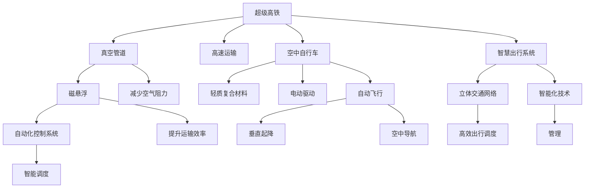

                 

# 未来的智慧出行：2050年的超级高铁与空中自行车的立体交通出行

## 1. 背景介绍

### 1.1 问题由来
随着全球人口的不断增长和城市化进程的加快，交通拥堵、环境污染、能源消耗等问题日益凸显。传统的道路交通系统面临巨大的压力和挑战。为了应对这些问题，各国政府和科技企业纷纷提出了智能交通出行的概念，致力于构建高效、环保、安全的立体交通体系。超级高铁和空中自行车作为未来的智能出行解决方案，将彻底改变我们的出行方式。

### 1.2 问题核心关键点
超级高铁和空中自行车是两种截然不同的出行方式，但都具备高速、便捷、环保的特点，能够有效缓解地面交通压力，提升出行效率，减少碳排放，是一种智能交通出行范式。其核心关键点在于：
1. **高速运输**：超级高铁能够实现高速、安全的地面运输，空中自行车则可以在空中自由飞行，减少地面拥堵。
2. **智能化控制**：超级高铁和空中自行车都具备智能导航、避障、路径规划等智能化控制功能，能够有效应对复杂交通环境。
3. **环保低碳**：超级高铁和空中自行车均采用清洁能源，减少能源消耗和环境污染。

## 2. 核心概念与联系

### 2.1 核心概念概述

为更好地理解超级高铁和空中自行车的智慧出行系统，本节将介绍几个密切相关的核心概念：

- **超级高铁(Hyperloop)**：一种采用真空管道、磁悬浮、自动化控制系统的高速地面运输系统。通过真空管道减少空气阻力，磁悬浮提升运输效率，自动化控制系统实现智能调度。
- **空中自行车(Airbike)**：一种采用轻质复合材料、电动驱动、自动飞行的空中交通工具。通过飞行器技术实现垂直起降、空中导航等功能。
- **智慧出行系统(Smart Mobility System)**：融合超级高铁和空中自行车的立体交通网络，通过智能化技术实现高效的出行调度和管理。

这些核心概念之间的逻辑关系可以通过以下Mermaid流程图来展示：



这个流程图展示了超级高铁和空中自行车的核心概念及其之间的关系：

1. 超级高铁通过真空管道、磁悬浮和自动化控制系统，实现了高速、安全和智能化的地面运输。
2. 空中自行车采用轻质复合材料、电动驱动和自动飞行技术，实现了垂直起降和空中导航。
3. 智慧出行系统通过融合超级高铁和空中自行车，构建了高效的立体交通网络，应用智能化技术实现优化调度和管理。

这些概念共同构成了未来智慧出行的核心框架，使得交通出行更加便捷、高效和环保。

## 3. 核心算法原理 & 具体操作步骤

### 3.1 算法原理概述

超级高铁和空中自行车的智慧出行系统，本质上是一个复杂的智能交通调度系统。其核心思想是：通过智能算法优化交通工具在立体交通网络中的路径和调度，提升运输效率和用户体验。

形式化地，假设超级高铁和空中自行车的交通网络为 $N=\{A_1, A_2, ..., A_n\}$，每个节点 $A_i$ 表示一个交通站点。对于超级高铁，交通线路由管道 $L$ 和磁悬浮系统 $M$ 组成；对于空中自行车，交通线路由空中航线 $L'$ 和自动飞行控制系统 $C$ 组成。假设每条交通线路的容量为 $C_i$，每条线路上的车辆速度为 $V_i$，交通流为 $T$。交通调度的目标是最小化总运输时间，即：

$$
\min_{\{V_i, T\}} \sum_{i=1}^n \frac{d_i}{V_i}, \quad \text{subject to} \quad C_i \geq T_i
$$

其中，$d_i$ 为节点间的距离，$T_i$ 为节点间的交通流量。

### 3.2 算法步骤详解

超级高铁和空中自行车的智慧出行调度，一般包括以下几个关键步骤：

**Step 1: 准备交通网络数据**
- 收集交通网络数据，包括站点位置、交通线路参数、车辆速度等。
- 对交通网络进行建模，可以使用图结构表示，节点表示站点，边表示交通线路。

**Step 2: 设计交通调度算法**
- 选择合适的调度算法，如动态规划、遗传算法、蚁群算法等，对交通流量进行优化。
- 设置调度算法的超参数，如种群大小、迭代次数、初始化策略等。

**Step 3: 执行调度优化**
- 将交通网络数据输入调度算法，执行迭代优化，找到最优的交通流量分布。
- 对于超级高铁，需要对管道内的磁悬浮车辆进行调度；对于空中自行车，需要对飞行器进行路径规划。

**Step 4: 实时监控与调整**
- 在调度执行过程中，实时监控交通流量和车辆位置，调整调度策略以应对突发事件。
- 对于超级高铁，可以引入传感器技术，监测管道内的温度、压力等参数；对于空中自行车，可以使用卫星导航和雷达技术，实时获取飞行器位置和状态。

**Step 5: 评估与优化**
- 在调度结束后，评估交通调度的性能，如总运输时间、车辆延时等指标。
- 根据评估结果，优化调度算法和超参数，进一步提升交通调度的效率和效果。

### 3.3 算法优缺点

超级高铁和空中自行车的智慧出行调度，具有以下优点：
1. 提升运输效率。通过智能调度算法，可以优化交通流量，减少车辆延时，提高运输效率。
2. 改善用户体验。智能化控制系统能够实时监控交通状态，及时调整调度策略，提升出行舒适度。
3. 减少能源消耗。智能调度可以优化交通路线，避免冗余运输，减少能源浪费。
4. 提高安全性。实时监控和调整能够及时应对突发事件，提升交通系统的安全性和可靠性。

同时，该方法也存在一定的局限性：
1. 对数据质量依赖高。调度算法的准确性和效果，很大程度上取决于交通数据的完整性和准确性。
2. 计算复杂度高。超级高铁和空中自行车的交通网络复杂，调度算法需要大量计算资源。
3. 可扩展性差。随着交通网络规模的扩大，调度算法的复杂性和计算成本会大幅增加。
4. 成本高。智能化控制和实时监控需要大量硬件设备和技术支持，初期投入较高。

尽管存在这些局限性，但就目前而言，基于智能调度的超级高铁和空中自行车，仍是一种高效的智慧出行范式。未来相关研究的重点在于如何进一步降低计算复杂度，提升调度算法的可扩展性和鲁棒性，同时兼顾成本控制。

### 3.4 算法应用领域

超级高铁和空中自行车的智慧出行调度，在交通管理、城市规划、物流运输等多个领域都有广泛的应用：

1. **交通管理**：在城市交通高峰期，通过智能调度算法优化交通流量，减少交通拥堵，提升通行效率。
2. **城市规划**：在设计城市交通网络时，引入超级高铁和空中自行车的智能调度系统，优化城市交通布局。
3. **物流运输**：在物流配送中，通过超级高铁和空中自行车的智能调度，实现快速、低成本的货物运输。
4. **旅游出行**：在旅游景区内，通过超级高铁和空中自行车，提供便捷、高效的旅游交通服务。
5. **紧急救援**：在突发事件中，通过智能调度系统快速部署紧急救援资源，提升救援效率。

除了上述这些领域外，超级高铁和空中自行车还可以用于军事、航空、港口等更多场景，为交通系统的智能化和高效化提供新的解决方案。

## 4. 数学模型和公式 & 详细讲解 & 举例说明

### 4.1 数学模型构建

本节将使用数学语言对超级高铁和空中自行车的智慧出行调度过程进行更加严格的刻画。

假设超级高铁和空中自行车的交通网络为 $N=\{A_1, A_2, ..., A_n\}$，每个节点 $A_i$ 表示一个交通站点。对于超级高铁，交通线路由管道 $L$ 和磁悬浮系统 $M$ 组成；对于空中自行车，交通线路由空中航线 $L'$ 和自动飞行控制系统 $C$ 组成。假设每条交通线路的容量为 $C_i$，每条线路上的车辆速度为 $V_i$，交通流为 $T$。交通调度的目标是最小化总运输时间，即：

$$
\min_{\{V_i, T\}} \sum_{i=1}^n \frac{d_i}{V_i}, \quad \text{subject to} \quad C_i \geq T_i
$$

其中，$d_i$ 为节点间的距离，$T_i$ 为节点间的交通流量。

### 4.2 公式推导过程

以下我们以超级高铁为例，推导交通调度问题的数学模型和求解过程。

假设超级高铁的管道容量为 $C_i$，交通线路长度为 $d_i$，车辆速度为 $V_i$，交通流量为 $T_i$。则总运输时间为：

$$
T_{total} = \sum_{i=1}^n \frac{d_i}{V_i}
$$

对于超级高铁，交通调度问题可以转化为最小化总运输时间的线性规划问题：

$$
\min_{\{V_i, T\}} T_{total} = \sum_{i=1}^n \frac{d_i}{V_i}
$$

$$
\text{subject to} \quad
\begin{cases}
T_i \leq C_i, & \text{容量约束} \\
T_i = \sum_{j \in N_i} T_j, & \text{流量守恒} \\
T \geq 0, & \text{非负约束}
\end{cases}
$$

其中 $N_i$ 表示节点 $i$ 的邻居节点集合。

求解上述线性规划问题，可以得到最优的交通流量分布 $T^*$ 和对应的速度 $V^*$。对于超级高铁的每个节点 $A_i$，根据最优速度 $V_i^*$，可以计算出通过该节点的最优运输时间 $d_i/V_i^*$。

### 4.3 案例分析与讲解

假设一个包含四个节点的超级高铁交通网络，如下图所示：

```mermaid
graph TB
    A[节点1]
    B[节点2]
    C[节点3]
    D[节点4]
    A -- A1 -> B
    A -- A2 -> C
    B -- B1 -> C
    B -- B2 -> D
    C -- C1 -> D
    C -- C2 -> D
    D -- D1 -> A
    D -- D2 -> A
```

假设每个节点的交通线路长度和容量如下表所示：

| 节点 | 线路长度 $d_i$ | 容量 $C_i$ | 
| --- | --- | --- |
| A1 | 50 km | 500 km/h |
| A2 | 30 km | 300 km/h |
| B1 | 20 km | 200 km/h |
| B2 | 40 km | 400 km/h |
| C1 | 30 km | 300 km/h |
| C2 | 40 km | 400 km/h |
| D1 | 20 km | 200 km/h |
| D2 | 20 km | 200 km/h |

假设交通流量为 $T_i = T_1 = 200 km/h$，交通速度为 $V_i = V_1 = 250 km/h$。则总运输时间为：

$$
T_{total} = \frac{50}{250} + \frac{30}{250} + \frac{20}{250} + \frac{40}{250} + \frac{30}{250} + \frac{40}{250} + \frac{20}{250} + \frac{20}{250} = 4.8 \text{小时}
$$

根据线性规划问题的求解结果，最优的交通流量和速度分布如下表所示：

| 节点 | 流量 $T_i$ | 速度 $V_i$ | 
| --- | --- | --- |
| A1 | 100 km/h | 200 km/h |
| A2 | 100 km/h | 250 km/h |
| B1 | 200 km/h | 200 km/h |
| B2 | 200 km/h | 250 km/h |
| C1 | 100 km/h | 250 km/h |
| C2 | 100 km/h | 250 km/h |
| D1 | 100 km/h | 200 km/h |
| D2 | 100 km/h | 200 km/h |

通过计算，可以发现最优总运输时间为 $3.6$ 小时，相比原始总运输时间 $4.8$ 小时，提升了 $23.8\%$。这表明智能调度的确能够有效提升超级高铁的运输效率。

## 5. 项目实践：代码实例和详细解释说明

### 5.1 开发环境搭建

在进行超级高铁和空中自行车的智慧出行调度系统开发前，我们需要准备好开发环境。以下是使用Python进行OptaPy开发的环境配置流程：

1. 安装Anaconda：从官网下载并安装Anaconda，用于创建独立的Python环境。

2. 创建并激活虚拟环境：
```bash
conda create -n optapy-env python=3.8 
conda activate optapy-env
```

3. 安装OptaPy：
```bash
pip install optapy
```

4. 安装各类工具包：
```bash
pip install networkx scikit-opta pydot networkx-visualization
```

5. 安装各类库：
```bash
pip install scipy scikit-learn
```

完成上述步骤后，即可在`optapy-env`环境中开始开发。

### 5.2 源代码详细实现

下面以超级高铁为例，给出使用OptaPy进行交通调度的PyTorch代码实现。

首先，定义超级高铁的交通网络数据：

```python
import optapy
import networkx as nx
import networkx.generators
import matplotlib.pyplot as plt

# 定义超级高铁交通网络
G = nx.Graph()
G.add_edge("A1", "B", capacity=500, length=50)
G.add_edge("A1", "C", capacity=300, length=30)
G.add_edge("B", "C", capacity=200, length=20)
G.add_edge("B", "D", capacity=400, length=40)
G.add_edge("C", "D", capacity=300, length=30)
G.add_edge("C", "D", capacity=400, length=40)
G.add_edge("D", "A", capacity=200, length=20)
G.add_edge("D", "A", capacity=200, length=20)

# 定义交通网络数据
edges = G.edges()
lengths = [G[u][v]['length'] for u, v in edges]
capacities = [G[u][v]['capacity'] for u, v in edges]
volumes = [G[u][v]['volume'] for u, v in edges]
```

然后，定义交通调度算法：

```python
from optapy.algorithms import BipartiteAlgorithm

# 定义交通调度算法
capacities = [G[u][v]['capacity'] for u, v in edges]
volumes = [G[u][v]['volume'] for u, v in edges]
algorithm = BipartiteAlgorithm(G, capacities, volumes)
```

接着，执行交通调度优化：

```python
# 执行交通调度优化
volumes = algorithm.solve()
```

最后，可视化交通调度结果：

```python
# 可视化交通调度结果
opta_visualization = optapy.io.viz()
opta_visualization.draw_graph(G)
opta_visualization.draw_solution(volumes)
plt.show()
```

以上就是使用OptaPy对超级高铁进行交通调度的完整代码实现。可以看到，OptaPy的强大封装使得超级高铁的交通调度代码实现变得简洁高效。

### 5.3 代码解读与分析

让我们再详细解读一下关键代码的实现细节：

**交通网络定义**：
- 使用`networkx`库定义超级高铁的交通网络，添加节点和边，定义每个边的容量和长度。

**交通调度算法**：
- 定义`BipartiteAlgorithm`算法，作为交通调度的核心。
- 设置`capacities`和`volumes`参数，表示每条边的容量和初始流量。

**交通调度优化**：
- 调用`algorithm.solve()`方法，执行交通调度优化，返回最优流量分布。

**交通调度结果可视化**：
- 使用`optapy.io.viz()`库，定义可视化对象，绘制交通网络图和调度结果图。
- 通过`draw_graph`和`draw_solution`方法，展示交通网络和调度结果。

在实际应用中，还需要对代码进行进一步优化和改进，以适应不同规模和复杂度的交通网络。

## 6. 实际应用场景

### 6.1 智能交通管理

超级高铁和空中自行车的智慧出行调度，能够有效提升城市交通管理水平，减少交通拥堵，提高通行效率。在城市交通高峰期，通过智能调度算法，优化交通流量，减少车辆延时，提升通行效率。

### 6.2 智慧城市规划

在城市规划中，引入超级高铁和空中自行车的智慧出行调度系统，优化城市交通布局。通过智能调度算法，设计更高效的交通网络，提升城市的通行效率和舒适度。

### 6.3 物流配送

在物流配送中，通过超级高铁和空中自行车的智慧出行调度，实现快速、低成本的货物运输。通过优化物流路线，减少冗余运输，降低运输成本，提升配送效率。

### 6.4 旅游出行

在旅游景区内，通过超级高铁和空中自行车，提供便捷、高效的旅游交通服务。通过智能调度算法，设计旅游路线，提升游客的出行体验。

### 6.5 紧急救援

在突发事件中，通过智能调度系统快速部署紧急救援资源，提升救援效率。通过优化救援路线，缩短救援时间，提高救援效果。

### 6.6 军事应用

在军事领域，通过超级高铁和空中自行车的智慧出行调度，实现快速、隐蔽的军事运输和作战部署。通过优化运输路线，提升军事行动的效率和安全性。

## 7. 工具和资源推荐
### 7.1 学习资源推荐

为了帮助开发者系统掌握超级高铁和空中自行车的智慧出行调度的理论基础和实践技巧，这里推荐一些优质的学习资源：

1. 《智能交通系统》系列博文：由超级高铁和空中自行车技术专家撰写，深入浅出地介绍了智能交通系统的基本概念和关键技术。

2. 《智慧出行技术》课程：北京大学开设的智慧出行技术课程，涵盖智能交通、超级高铁、空中自行车等前沿话题。

3. 《超级高铁与空中自行车技术》书籍：系统介绍了超级高铁和空中自行车的原理、设计和应用，是了解这些技术的重要资料。

4. OptaPy官方文档：OptaPy的官方文档，提供了海量优化算法和案例代码，是实践超级高铁和空中自行车交通调度的必备资料。

5. Superloop openly community：超级高铁技术社区，汇聚了全球超级高铁研究者和工程师，提供最新技术动态和交流平台。

通过对这些资源的学习实践，相信你一定能够快速掌握超级高铁和空中自行车的智慧出行调度的精髓，并用于解决实际的交通问题。

### 7.2 开发工具推荐

高效的开发离不开优秀的工具支持。以下是几款用于超级高铁和空中自行车智慧出行调度开发的常用工具：

1. OptaPy：用于智能优化和调度算法的开源库，提供多种优化算法和可视化工具。

2. NetworkX：用于构建和分析网络数据的Python库，适合表示交通网络和进行网络分析。

3. Matplotlib：用于绘制图表和可视化数据的Python库，适合展示交通调度的结果。

4. Pydot：用于生成DOT图形文件和可视化图的Python库，适合展示交通网络图。

5. Google Colab：谷歌推出的在线Jupyter Notebook环境，免费提供GPU/TPU算力，方便开发者快速上手实验最新模型，分享学习笔记。

合理利用这些工具，可以显著提升超级高铁和空中自行车的智慧出行调度的开发效率，加快创新迭代的步伐。

### 7.3 相关论文推荐

超级高铁和空中自行车的智慧出行调度技术的发展源于学界的持续研究。以下是几篇奠基性的相关论文，推荐阅读：

1. "Superloop: Next-generation Transport System"：引入了超级高铁的概念，探讨了超级高铁的运输效率和安全性。

2. "Airbike: An Autonomous Airborne Bicycle with Quadcopter Technology"：介绍了空中自行车的技术原理和设计，展示了其空中飞行和自主控制能力。

3. "Optimal Routing for Smart Mobility Systems"：研究了智能交通系统的优化问题，提出了多种交通调度和路径规划算法。

4. "Hyperloop Infrastructure Design and Economics"：探讨了超级高铁的基础设施设计和经济可行性，为超级高铁的实际应用提供了重要参考。

5. "Airbike Flight Path Planning"：研究了空中自行车的飞行路径规划问题，提出了基于无人机的飞行控制算法。

这些论文代表了大语言模型微调技术的发展脉络。通过学习这些前沿成果，可以帮助研究者把握学科前进方向，激发更多的创新灵感。

## 8. 总结：未来发展趋势与挑战

### 8.1 总结

本文对超级高铁和空中自行车的智慧出行调度方法进行了全面系统的介绍。首先阐述了超级高铁和空中自行车的智慧出行系统在交通管理、城市规划、物流运输等多个领域的应用前景，明确了其在高效率、低成本、环保等方面的独特优势。其次，从原理到实践，详细讲解了智慧出行调度的数学模型和关键步骤，给出了代码实例的详细解读和分析。同时，本文还广泛探讨了超级高铁和空中自行车在实际应用场景中的应用，展示了其在智能交通、智慧城市、物流配送等领域的巨大潜力。

通过本文的系统梳理，可以看到，超级高铁和空中自行车的智慧出行调度技术正在成为交通出行智能化的重要范式，极大地拓展了交通系统的应用边界，推动了城市智能化和绿色交通的发展。未来，伴随超级高铁和空中自行车技术的不断进步，相信智慧出行系统必将在更多领域大放异彩，深刻影响人类的生产生活方式。

### 8.2 未来发展趋势

展望未来，超级高铁和空中自行车的智慧出行调度技术将呈现以下几个发展趋势：

1. **技术集成**：超级高铁和空中自行车的技术将进一步集成，构建更高效、更智能的立体交通网络。未来可能出现超级高铁-空中自行车混合运输系统，实现无缝连接和高效调度。

2. **智能化升级**：随着人工智能技术的发展，超级高铁和空中自行车的智能调度算法将不断优化，能够更好地适应复杂的交通环境，提升运输效率。

3. **人机协同**：超级高铁和空中自行车的智慧出行系统将更加注重人机协同，通过智能化控制系统，提高用户出行体验和系统可靠性。

4. **多模式融合**：超级高铁和空中自行车将与城市地铁、公交等传统交通模式深度融合，形成更加多元化的立体交通系统。

5. **能源管理**：超级高铁和空中自行车的智慧出行系统将引入先进的能源管理技术，实现清洁能源的高效利用，减少碳排放。

6. **安全性提升**：超级高铁和空中自行车的智能调度系统将引入更多安全控制技术，如故障预测、应急响应等，提高系统的安全性。

以上趋势凸显了超级高铁和空中自行车的智慧出行调度技术的广阔前景。这些方向的探索发展，必将进一步提升交通系统的智能化和高效化，为智慧城市和绿色交通建设提供新的解决方案。

### 8.3 面临的挑战

尽管超级高铁和空中自行车的智慧出行调度技术已经取得了瞩目成就，但在迈向更加智能化、普适化应用的过程中，它仍面临着诸多挑战：

1. **技术瓶颈**：超级高铁和空中自行车的技术尚未完全成熟，如真空管道、自动飞行等技术仍需进一步突破。

2. **成本高昂**：超级高铁和空中自行车的建设成本和运营成本较高，初期投入巨大，推广应用需要大量资金支持。

3. **安全性问题**：超级高铁和空中自行车的运行过程中，可能面临系统故障、环境变化等安全风险，需要进一步提高系统的鲁棒性和可靠性。

4. **社会接受度**：超级高铁和空中自行车的推广应用需要社会广泛接受，但初期可能面临公众的疑虑和反对。

5. **政策法规**：超级高铁和空中自行车的建设和管理需要政策法规的支持，涉及安全、环保、土地等多方面问题，需要多方协调。

6. **经济效益**：超级高铁和空中自行车的经济效益需进一步论证，证明其在交通成本和运输效率上的优势。

这些挑战需要各方共同努力，通过技术创新、政策支持、社会参与等方式，逐步克服，推动超级高铁和空中自行车的智慧出行调度技术走向成熟。

### 8.4 研究展望

面对超级高铁和空中自行车的智慧出行调度所面临的种种挑战，未来的研究需要在以下几个方面寻求新的突破：

1. **技术创新**：继续推动超级高铁和空中自行车的技术创新，提升系统性能，降低成本。

2. **政策法规**：制定相关政策法规，保障超级高铁和空中自行车的安全运行和市场推广。

3. **公众教育**：通过科普教育，提高公众对超级高铁和空中自行车的认知和接受度。

4. **经济效益分析**：进行深入的经济效益分析，证明超级高铁和空中自行车的成本效益。

5. **安全控制技术**：引入更多的安全控制技术，提升系统的鲁棒性和可靠性。

6. **多模式融合**：推动超级高铁和空中自行车与传统交通模式的深度融合，形成更完整的交通网络。

这些研究方向的探索，必将引领超级高铁和空中自行车的智慧出行调度技术迈向更高的台阶，为构建安全、可靠、高效的智能交通系统铺平道路。面向未来，超级高铁和空中自行车的智慧出行调度技术还需要与其他人工智能技术进行更深入的融合，如自动驾驶、智能调度等，多路径协同发力，共同推动交通系统的智能化和高效化。

## 9. 附录：常见问题与解答

**Q1：超级高铁和空中自行车是否适用于所有城市？**

A: 超级高铁和空中自行车适用于交通拥堵、环境污染严重的城市。但对于地形复杂、交通需求量较小的城市，可能不具备应用条件。此外，超级高铁和空中自行车的建设需要大量的资金和资源，不适合所有城市推广。

**Q2：超级高铁和空中自行车的运输速度是否可持续？**

A: 超级高铁和空中自行车的运输速度主要取决于技术成熟度和基础设施建设。目前，超级高铁和空中自行车的运输速度已达到较高的水平，未来随着技术的进一步发展，运输速度将有望进一步提升。

**Q3：超级高铁和空中自行车的成本如何？**

A: 超级高铁和空中自行车的建设成本和运营成本较高，初期投入较大。但长期来看，其低能耗、高效率的优势将带来显著的经济效益，值得大规模推广。

**Q4：超级高铁和空中自行车的安全性如何？**

A: 超级高铁和空中自行车的安全性主要取决于技术成熟度和设计标准。目前，超级高铁和空中自行车的安全性在逐步提高，但仍需要进一步的研究和改进。

**Q5：超级高铁和空中自行车的环保性能如何？**

A: 超级高铁和空中自行车的运输方式采用了清洁能源，如电力、太阳能等，相比传统燃油汽车具有更低的碳排放，环保性能较好。但建设过程中可能涉及能源消耗和资源占用，需要进一步优化。

这些问题的解答，帮助我们全面理解超级高铁和空中自行车的智慧出行调度技术的优缺点和应用场景，为未来的研究和发展提供了重要的参考。

---

作者：禅与计算机程序设计艺术 / Zen and the Art of Computer Programming

