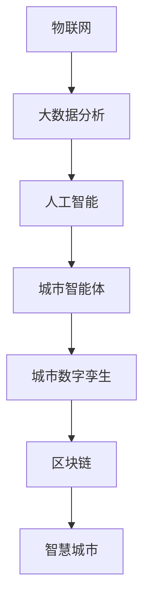

                 

# 未来的智慧城市：2050年的城市数字孪生与城市智能体

## 1. 背景介绍

### 1.1 问题由来

城市化进程的加速和智能化技术的演进，正使智慧城市建设成为全球各地政府和企业的共同追求。在数字化、网络化、智能化的新一轮城市发展中，如何更好地利用数据驱动城市管理，实现资源高效配置和居民生活品质的全面提升，成为当下极为重要的问题。

近年来，随着物联网(IoT)、云计算、大数据、人工智能等技术的迅猛发展，智慧城市建设进入了一个新阶段。越来越多的城市开始构建自己的数字孪生城市，利用虚拟的“镜像世界”来监测和优化城市的运行状态。同时，城市智能体（Urban Intelligence Bodies）应运而生，通过模拟和复制城市运行环境，预测和决策城市管理中的问题，提升城市治理效能。

### 1.2 问题核心关键点

智慧城市和城市智能体的核心关键点在于数据驱动和智能决策：

- **数据驱动**：智慧城市通过采集各类传感器数据、社交媒体数据、地图数据等，构建全面的城市数据资产。数据实时更新，保证了城市运行状态的精准反映。
- **智能决策**：城市智能体通过机器学习、深度学习等智能算法，分析海量数据，提炼出城市运行规律，提供决策建议。智能决策提升城市的响应速度和精准度，优化资源配置。
- **高效管理**：智慧城市将城市管理从静态转变为动态，实现资源的高效利用和问题的快速响应。城市智能体通过模拟和复制，实现未来城市运行状况的可视化预测。

## 2. 核心概念与联系

### 2.1 核心概念概述

为更好地理解未来智慧城市和城市智能体的工作原理和优化方向，本节将介绍几个密切相关的核心概念：

- **城市数字孪生**：利用数字仿真技术构建虚拟城市，包含物理城市的全方位信息，包括交通、环境、能源等各类数据。通过虚拟城市与物理城市的双向互动，实现对城市运行状态的实时监测和预测。

- **城市智能体**：基于人工智能技术，构建的城市治理“代理人”。它能主动监测城市运行状态，自动预测并生成应对策略，提升城市管理的自动化和智能化水平。

- **物联网(IoT)**：通过部署各类传感器，实时采集城市运行数据。物联网技术是构建智慧城市和城市智能体的重要基础。

- **大数据分析**：利用先进的数据处理技术和算法，对城市运行数据进行深度挖掘和分析，揭示城市运行规律，辅助决策。

- **人工智能**：包括机器学习、深度学习、强化学习等，是构建城市智能体的核心技术。通过智能算法，城市智能体可以自动识别、分析和预测城市运行问题。

- **区块链技术**：用于确保城市数据的安全性和透明性，避免数据篡改和隐私泄露。区块链可以记录所有城市运行数据，提高城市管理的可追溯性和可靠性。

这些核心概念之间的逻辑关系可以通过以下Mermaid流程图来展示：



这个流程图展示了一系列核心概念及其之间的关系：

1. 物联网采集各类数据，提供基础信息。
2. 大数据分析对数据进行深层次挖掘和处理，提炼城市运行规律。
3. 人工智能辅助智能决策，提高城市管理自动化水平。
4. 城市智能体模拟城市运行，生成决策建议。
5. 城市数字孪生实现虚拟与现实的结合，提供可视化预测。
6. 区块链保障城市数据的安全和透明。
7. 最终实现智慧城市的建设，提升城市治理效能。

## 3. 核心算法原理 & 具体操作步骤
### 3.1 算法原理概述

未来智慧城市和城市智能体的核心算法原理基于数据分析和智能决策：

- **数据采集与存储**：通过各类传感器和设备，收集城市运行数据。利用云平台进行数据存储和管理，确保数据的实时性和可靠性。

- **数据处理与分析**：采用机器学习、深度学习等技术，对数据进行特征提取、降维、聚类、分类等处理，提炼城市运行规律。

- **智能决策与优化**：通过强化学习、多目标优化等算法，城市智能体在虚拟环境中进行仿真实验，生成优化策略，预测未来城市运行状态。

- **动态调整与反馈**：将智能体的决策结果应用到物理城市的实际管理中，实时监测效果并进行动态调整，形成闭环反馈机制。

### 3.2 算法步骤详解

未来智慧城市和城市智能体的构建一般包括以下几个关键步骤：

**Step 1: 数据收集与预处理**

- 通过物联网传感器和设备，收集城市基础设施运行数据，如交通流量、空气质量、能源消耗等。
- 利用大数据平台，对数据进行存储和管理，确保数据的实时性和完整性。
- 对数据进行清洗、去噪和标准化处理，剔除异常值和冗余信息，为后续分析奠定基础。

**Step 2: 特征工程与模型训练**

- 设计合理的特征提取方法，从城市数据中提取出有意义的特征。例如，对交通流量数据进行时序分析，提取高峰期和低谷期等特征。
- 选择合适的机器学习模型进行训练，如决策树、随机森林、支持向量机等。对数据集进行交叉验证和调参，保证模型的泛化能力。

**Step 3: 智能决策与仿真实验**

- 利用深度学习模型，对城市数据进行特征学习，构建城市运行预测模型。例如，利用LSTM或GRU等序列模型，预测未来交通流量变化。
- 使用强化学习算法，训练城市智能体在虚拟环境中进行仿真实验，生成应对策略。例如，通过Q-learning算法，智能体学习最优的交通信号灯控制策略。
- 结合多目标优化算法，对智能体的决策进行综合评估和优化。例如，利用遗传算法优化智能体的能源分配策略。

**Step 4: 反馈与调整**

- 将智能体的决策结果应用到物理城市的实际管理中，实时监测效果并进行动态调整。例如，智能体控制交通信号灯，实时优化交通流量，减少拥堵。
- 收集反馈数据，重新评估模型的性能，持续改进和优化。例如，通过收集用户的满意度反馈，优化智能体的决策效果。

### 3.3 算法优缺点

未来智慧城市和城市智能体具有以下优点：

- **高效管理**：通过数据驱动和智能决策，实现城市管理的动态化和自动化，提高管理效率。
- **实时响应**：城市智能体能够实时监测城市运行状态，快速响应突发事件，减少损失。
- **资源优化**：智能算法优化城市资源配置，减少浪费，提升城市可持续性。
- **透明透明**：区块链技术确保城市数据的安全性和透明性，提高治理的公平性和可信度。

同时，这些系统也存在以下缺点：

- **数据隐私**：城市数据涉及敏感信息，数据隐私和安全问题较为突出。
- **技术复杂**：构建未来智慧城市和城市智能体需要整合多类技术，技术实现较为复杂。
- **高成本**：建设智慧城市和城市智能体需要大量资金投入，前期成本较高。
- **依赖性高**：系统依赖于稳定的数据采集和网络环境，遇到故障时可能影响运行。

### 3.4 算法应用领域

未来智慧城市和城市智能体已经在多个领域得到应用，例如：

- **交通管理**：通过智能交通系统，优化交通流量，减少拥堵，提升出行效率。智能体预测交通流量，生成最优交通信号控制方案。
- **环境监测**：通过智能环境监控系统，实时监测空气质量、水质、噪音等指标，预测环境污染趋势，辅助决策。智能体生成应对污染措施，改善环境质量。
- **能源管理**：通过智能能源管理系统，优化能源分配，提升能源利用效率，降低能耗。智能体预测能源需求，生成节能方案，提升城市可持续性。
- **公共安全**：通过智能公共安全系统，实时监测和预测各类安全事件，快速响应突发事件。智能体分析安全数据，生成预警和应急方案。
- **城市规划**：通过智能城市规划系统，预测城市发展趋势，优化城市布局和资源配置。智能体生成城市发展规划，辅助政府决策。

除了上述这些经典应用外，未来智慧城市和城市智能体还将拓展到更多领域中，如智慧医疗、智慧教育、智慧农业等，为城市居民提供更全面、更优质的服务。

## 4. 数学模型和公式 & 详细讲解
### 4.1 数学模型构建

本节将使用数学语言对未来智慧城市和城市智能体的核心算法进行更加严格的刻画。

假设城市智能体在虚拟环境中进行仿真实验，城市基础设施运行数据为 $D=\{(x_i,y_i)\}_{i=1}^N, x_i \in \mathcal{X}, y_i \in \mathcal{Y}$，其中 $x_i$ 为输入数据（如交通流量、空气质量等），$y_i$ 为输出数据（如交通信号灯控制策略、能源分配方案等）。

定义智能体在虚拟环境中的损失函数为 $\ell(S,D)$，其中 $S$ 为智能体生成的策略，则智能体训练的目标是最小化损失函数，即：

$$
\theta^* = \mathop{\arg\min}_{\theta} \ell(S,D)
$$

在实践中，我们通常使用基于梯度的优化算法（如SGD、Adam等）来近似求解上述最优化问题。设 $\eta$ 为学习率，则参数的更新公式为：

$$
\theta \leftarrow \theta - \eta \nabla_{\theta}\ell(S,D)
$$

其中 $\nabla_{\theta}\ell(S,D)$ 为损失函数对策略 $S$ 的梯度，可通过反向传播算法高效计算。

### 4.2 公式推导过程

以下我们以交通流量预测为例，推导基于深度学习的智能体训练过程的数学公式。

假设智能体在虚拟环境中进行交通流量预测，输入数据为 $x_i=[t_i,v_i]$，其中 $t_i$ 为时间戳，$v_i$ 为交通流量。智能体生成的策略 $S$ 为交通信号灯控制方案，输出数据 $y_i$ 为预测的交通流量。

定义智能体在虚拟环境中的损失函数为均方误差损失：

$$
\ell(S,D) = \frac{1}{N}\sum_{i=1}^N (y_i - S(x_i))^2
$$

其中 $y_i$ 为实际交通流量，$S(x_i)$ 为智能体生成的预测交通流量。

利用梯度下降算法优化智能体的参数 $\theta$，得到智能体的训练过程为：

$$
\theta \leftarrow \theta - \eta \nabla_{\theta}\ell(S,D)
$$

其中 $\nabla_{\theta}\ell(S,D)$ 为损失函数对智能体参数 $\theta$ 的梯度，通过反向传播算法计算。

在得到智能体策略的梯度后，即可带入参数更新公式，完成模型的迭代优化。重复上述过程直至收敛，最终得到适应虚拟城市环境的智能体策略 $\theta^*$。

## 5. 项目实践：代码实例和详细解释说明
### 5.1 开发环境搭建

在进行未来智慧城市和城市智能体的开发前，我们需要准备好开发环境。以下是使用Python进行PyTorch开发的环境配置流程：

1. 安装Anaconda：从官网下载并安装Anaconda，用于创建独立的Python环境。

2. 创建并激活虚拟环境：
```bash
conda create -n urban-env python=3.8 
conda activate urban-env
```

3. 安装PyTorch：根据CUDA版本，从官网获取对应的安装命令。例如：
```bash
conda install pytorch torchvision torchaudio cudatoolkit=11.1 -c pytorch -c conda-forge
```

4. 安装TensorFlow：
```bash
pip install tensorflow
```

5. 安装TensorFlow Addons：
```bash
pip install tensorflow-addons
```

6. 安装各类工具包：
```bash
pip install numpy pandas scikit-learn matplotlib tqdm jupyter notebook ipython
```

完成上述步骤后，即可在`urban-env`环境中开始未来智慧城市和城市智能体的开发。

### 5.2 源代码详细实现

下面我们以交通流量预测为例，给出使用TensorFlow对城市智能体进行训练的Python代码实现。

首先，定义数据处理函数：

```python
import tensorflow as tf
import numpy as np
import pandas as pd

def load_data(file_path):
    data = pd.read_csv(file_path)
    return data['time'].values, data['volume'].values

# 加载数据
train_x, train_y = load_data('train.csv')
test_x, test_y = load_data('test.csv')

# 标准化数据
mean_x = np.mean(train_x)
std_x = np.std(train_x)
train_x = (train_x - mean_x) / std_x
test_x = (test_x - mean_x) / std_x
```

然后，定义模型：

```python
class SmartCity(tf.keras.Model):
    def __init__(self, input_dim, output_dim):
        super(SmartCity, self).__init__()
        self.dense1 = tf.keras.layers.Dense(64, activation='relu')
        self.dense2 = tf.keras.layers.Dense(output_dim)
    
    def call(self, inputs):
        x = self.dense1(inputs)
        x = self.dense2(x)
        return x

# 构建模型
input_dim = 1  # 假设输入为时间戳
output_dim = 1  # 假设输出为交通流量
model = SmartCity(input_dim, output_dim)
```

接着，定义训练函数：

```python
def train_model(model, train_x, train_y, batch_size=32, epochs=100, learning_rate=0.01):
    optimizer = tf.keras.optimizers.Adam(learning_rate=learning_rate)
    loss_fn = tf.keras.losses.MeanSquaredError()
    
    for epoch in range(epochs):
        for i in range(0, len(train_x), batch_size):
            batch_x = train_x[i:i+batch_size]
            batch_y = train_y[i:i+batch_size]
            
            with tf.GradientTape() as tape:
                predictions = model(batch_x)
                loss = loss_fn(predictions, batch_y)
            
            gradients = tape.gradient(loss, model.trainable_variables)
            optimizer.apply_gradients(zip(gradients, model.trainable_variables))
            
            if (i+1) % 100 == 0:
                print(f'Epoch {epoch+1}, Loss: {loss.numpy():.4f}')
```

最后，启动训练流程：

```python
# 训练模型
train_model(model, train_x, train_y)

# 在测试集上评估模型
test_x = test_x.reshape((-1, 1))
test_y = test_y.reshape((-1, 1))
predictions = model(test_x)
mse = tf.keras.losses.mean_squared_error(test_y, predictions)
print(f'Test MSE: {mse.numpy():.4f}')
```

以上就是使用TensorFlow对未来智慧城市和城市智能体进行训练的完整代码实现。可以看到，TensorFlow提供了强大的深度学习框架和工具，使得城市智能体的构建变得更加简单高效。

### 5.3 代码解读与分析

让我们再详细解读一下关键代码的实现细节：

**SmartCity类**：
- `__init__`方法：初始化模型的输入输出维度。
- `call`方法：定义模型的前向传播过程，包括两个全连接层。

**训练函数train_model**：
- 利用Adam优化器进行梯度下降，最小化均方误差损失。
- 在每个epoch中，分批次处理训练数据，计算损失并反向传播更新模型参数。
- 每100个batch输出一次当前损失，跟踪训练进度。
- 在训练完成后，使用测试集评估模型预测的均方误差。

**模型评估**：
- 对测试集进行预处理，使其与训练集保持一致。
- 使用模型进行预测，并计算均方误差（MSE）作为评估指标。
- 输出测试集上的均方误差，评估模型性能。

通过以上代码，我们可以看到TensorFlow提供了丰富的API和工具，支持从模型构建到训练、评估的全流程操作，极大提升了城市智能体构建的效率和灵活性。

## 6. 实际应用场景
### 6.1 智能交通系统

智能交通系统是未来智慧城市的重要组成部分。通过城市智能体，可以实现交通流量的实时预测和优化控制，提升城市交通效率和居民出行体验。

具体而言，可以收集城市道路交通流量、车辆位置、红绿灯状态等数据，作为城市智能体的输入。通过深度学习模型预测未来交通流量变化，生成最优红绿灯控制策略。智能体能够自动调整信号灯时长，避免拥堵，提高道路通行效率。

### 6.2 智能环境监控系统

智能环境监控系统通过对空气质量、噪音、水质等数据的实时监测，提供环境质量预警，辅助城市决策。

城市智能体可以收集各类环境监测设备的数据，利用深度学习模型分析数据，预测未来环境质量变化趋势。智能体生成应对策略，如调整工业排放、增加绿化面积等，改善城市环境质量。

### 6.3 智能能源管理系统

智能能源管理系统通过优化能源分配，提升能源利用效率，降低能耗。

城市智能体收集各类能源消耗数据，利用深度学习模型预测能源需求变化，生成最优能源分配方案。智能体自动调节电力供应、调整能源使用策略，减少能源浪费，提升城市可持续性。

### 6.4 未来应用展望

未来，基于城市智能体的智慧城市将进一步拓展应用范围，推动城市治理的智能化和高效化。

- **智慧医疗**：通过智能体监测居民健康状况，预测疾病传播趋势，提供个性化医疗建议。智能体生成疾病预防方案，辅助医院决策。
- **智慧教育**：利用智能体对学生学习行为进行数据分析，预测学习效果，提供个性化教育建议。智能体生成个性化教学方案，提升教育质量。
- **智慧农业**：通过智能体监测农田环境，预测作物生长状态，生成最优种植方案。智能体优化农业资源配置，提高农业生产效率。

随着物联网、大数据、人工智能等技术的进一步融合，未来智慧城市和城市智能体的应用场景将更加丰富多样，为城市居民提供更加全面、便捷的服务。

## 7. 工具和资源推荐
### 7.1 学习资源推荐

为了帮助开发者系统掌握未来智慧城市和城市智能体的理论基础和实践技巧，这里推荐一些优质的学习资源：

1. **《深度学习》系列书籍**：深度学习领域的经典教材，涵盖从基础到高级的深度学习算法和应用。
2. **CS224L《深度学习与自然语言处理》课程**：斯坦福大学开设的NLP明星课程，有Lecture视频和配套作业，带你入门NLP领域的基本概念和经典模型。
3. **《城市智能体：未来城市的数据驱动治理》书籍**：介绍城市智能体的构建方法和应用案例，深入探讨未来智慧城市的发展方向。
4. **Kaggle平台**：提供大量城市数据集和竞赛项目，帮助你通过实践提升城市智能体的构建技能。
5. **Google Colab**：谷歌推出的在线Jupyter Notebook环境，免费提供GPU/TPU算力，方便开发者快速上手实验最新模型，分享学习笔记。

通过对这些资源的学习实践，相信你一定能够快速掌握未来智慧城市和城市智能体的精髓，并用于解决实际的NLP问题。

### 7.2 开发工具推荐

高效的开发离不开优秀的工具支持。以下是几款用于未来智慧城市和城市智能体开发的常用工具：

1. **TensorFlow**：由Google主导开发的深度学习框架，生产部署方便，适合大规模工程应用。
2. **PyTorch**：基于Python的开源深度学习框架，灵活动态的计算图，适合快速迭代研究。
3. **TensorFlow Addons**：TensorFlow的扩展库，提供更多深度学习模型和工具，提升开发效率。
4. **Jupyter Notebook**：交互式的数据分析和编程工具，支持代码、图表和文本的混合编辑。
5. **Google Cloud Platform**：谷歌提供的云平台，提供GPU/TPU算力，支持大规模数据处理和模型训练。

合理利用这些工具，可以显著提升未来智慧城市和城市智能体构建的效率，加快创新迭代的步伐。

### 7.3 相关论文推荐

未来智慧城市和城市智能体的发展源于学界的持续研究。以下是几篇奠基性的相关论文，推荐阅读：

1. **《智慧城市：未来城市的数据驱动治理》**：介绍智慧城市的建设方法和应用案例，探讨未来城市治理的智能化方向。
2. **《智能交通系统：城市智能体的研究与应用》**：研究智能交通系统的构建方法，探讨城市智能体的优化策略。
3. **《基于深度学习的城市环境监控系统》**：介绍利用深度学习模型进行环境监控的方法，展示城市智能体的应用效果。
4. **《智能能源管理系统的设计与实现》**：研究智能能源管理系统的构建方法，展示城市智能体的优化策略。

这些论文代表了大语言模型微调技术的发展脉络。通过学习这些前沿成果，可以帮助研究者把握学科前进方向，激发更多的创新灵感。

## 8. 总结：未来发展趋势与挑战

### 8.1 研究成果总结

本文对未来智慧城市和城市智能体的构建方法进行了全面系统的介绍。首先阐述了未来智慧城市和城市智能体的研究背景和意义，明确了数据驱动和智能决策在城市管理中的重要性。其次，从原理到实践，详细讲解了智能体训练和优化的数学模型和算法步骤，给出了代码实例和详细解释说明。同时，本文还广泛探讨了智能体在智能交通、环境监控、能源管理等多个领域的应用前景，展示了未来智慧城市的发展潜力。

通过本文的系统梳理，可以看到，基于城市智能体的智慧城市建设正在成为全球各地政府和企业的共同追求，将极大地提升城市管理的智能化水平。

### 8.2 未来发展趋势

展望未来，未来智慧城市和城市智能体的发展将呈现以下几个趋势：

1. **更加智能化**：通过引入更先进的深度学习算法和模型，城市智能体将更加智能化和自动化，实现更高效的城市治理。
2. **数据驱动决策**：利用大数据和AI技术，城市智能体将更加依赖数据驱动决策，提升决策的准确性和效率。
3. **多模态融合**：结合物联网、传感器、社交媒体等多类数据，城市智能体将更加全面和准确地理解城市运行状态。
4. **跨领域应用**：未来智慧城市和智能体的应用将拓展到更多领域，如医疗、教育、农业等，为不同领域提供智能化的解决方案。
5. **智能化运维**：智能体将具备自我监测和自我优化的能力，提升城市管理的稳定性和可靠性。

这些趋势凸显了未来智慧城市和城市智能体的广阔前景，为城市居民提供更加全面、便捷的服务。

### 8.3 面临的挑战

尽管未来智慧城市和城市智能体的前景广阔，但在迈向更加智能化、普适化应用的过程中，仍面临诸多挑战：

1. **数据隐私**：城市数据涉及敏感信息，数据隐私和安全问题较为突出。如何保护城市数据的隐私性和安全性，是未来需要重点解决的问题。
2. **技术复杂**：未来智慧城市和智能体的构建需要整合多类技术，技术实现较为复杂。如何降低技术门槛，提高开发效率，也是一大挑战。
3. **高成本**：建设智慧城市和智能体需要大量资金投入，前期成本较高。如何降低建设成本，提高经济效益，是未来需要考虑的重要问题。
4. **依赖性高**：系统依赖于稳定的数据采集和网络环境，遇到故障时可能影响运行。如何增强系统的鲁棒性，减少对外部环境的依赖，也是未来需要解决的问题。

### 8.4 研究展望

面对未来智慧城市和城市智能体面临的挑战，未来的研究需要在以下几个方面寻求新的突破：

1. **数据隐私保护**：开发更加安全和隐私保护的技术，确保城市数据的安全性和透明性。例如，利用区块链技术记录城市数据，防止数据篡改和泄露。
2. **技术整合优化**：优化现有技术的整合方法，降低技术实现复杂度。例如，引入API接口和微服务架构，提高系统的可维护性和可扩展性。
3. **低成本建设**：开发低成本、高效率的建设方案，降低前期投入，提高经济效益。例如，利用边缘计算和云平台，减少数据传输和计算成本。
4. **系统鲁棒性提升**：增强系统的鲁棒性和可靠性，减少对外部环境的依赖。例如，引入故障容错机制和冗余设计，提高系统的稳定性和可用性。
5. **智能化运维**：提升智能体的自我监测和优化能力，实现智能化运维。例如，引入智能运维平台，自动检测和修复系统故障。

这些研究方向的探索，将引领未来智慧城市和城市智能体的建设走向成熟，为城市治理提供更加全面、高效、智能的解决方案。

## 9. 附录：常见问题与解答

**Q1：未来智慧城市和城市智能体需要哪些核心技术？**

A: 未来智慧城市和城市智能体的构建需要以下核心技术：

- **物联网(IoT)**：通过部署各类传感器，实时采集城市运行数据。
- **大数据分析**：利用先进的数据处理技术和算法，对城市运行数据进行深度挖掘和分析，提炼城市运行规律。
- **人工智能**：包括机器学习、深度学习、强化学习等，是构建城市智能体的核心技术。
- **区块链技术**：用于确保城市数据的安全性和透明性，避免数据篡改和隐私泄露。
- **虚拟仿真技术**：利用数字仿真技术构建虚拟城市，包含物理城市的全方位信息，实现对城市运行状态的实时监测和预测。

这些核心技术共同构成了未来智慧城市和城市智能体的技术基础，是其能够实现高效、智能、透明管理的基石。

**Q2：未来智慧城市和城市智能体如何处理数据隐私问题？**

A: 数据隐私是未来智慧城市和城市智能体面临的重要问题。为保护城市数据的隐私性，可以采用以下措施：

- **数据匿名化**：对数据进行匿名化处理，去除个人敏感信息，保护用户隐私。例如，将身份证号、姓名等信息替换为匿名标识符。
- **数据加密**：对城市数据进行加密存储和传输，防止数据泄露和篡改。例如，使用AES、RSA等加密算法。
- **访问控制**：严格控制数据访问权限，防止未授权人员获取敏感信息。例如，利用身份认证和权限管理机制，限制数据访问范围。
- **区块链技术**：利用区块链技术记录城市数据，确保数据的不可篡改性和透明性。例如，使用公有链或联盟链，记录所有城市运行数据，提高治理的公平性和可信度。
- **数据共享协议**：制定严格的数据共享协议，规范数据使用和共享行为，保护数据隐私。例如，采用数据使用协议和隐私保护措施，确保数据使用的合法性和安全性。

这些措施可以有效地保护城市数据的隐私性和安全性，确保未来智慧城市和城市智能体在建设过程中遵守数据隐私保护的要求。

**Q3：未来智慧城市和城市智能体在实际应用中需要注意哪些问题？**

A: 未来智慧城市和城市智能体在实际应用中，需要注意以下问题：

- **数据质量**：城市智能体依赖于高质量的数据，数据质量直接影响智能体的决策效果。需要确保数据的时效性、准确性和完整性。
- **算法性能**：智能体中的算法需要高效的计算能力和内存资源，避免算法瓶颈。需要采用优化算法和资源管理策略，提升算法的性能和效率。
- **系统集成**：未来智慧城市和智能体的构建涉及多类技术和系统，需要进行系统集成和互操作性设计。需要采用标准化的接口和协议，确保各系统之间的数据互通和协同工作。
- **用户接受度**：智能体的应用需要得到用户的信任和接受。需要进行用户调研和需求分析，确保智能体能够满足用户需求和期望。
- **安全性**：智能体的应用涉及到敏感信息，需要确保系统的安全性。需要采用安全防护措施，防止系统被攻击和恶意利用。

这些问题是未来智慧城市和城市智能体在实际应用中需要重点关注的，只有全面考虑这些问题，才能实现智能体的成功部署和应用。

**Q4：未来智慧城市和城市智能体如何利用人工智能技术提升决策效率？**

A: 未来智慧城市和城市智能体利用人工智能技术提升决策效率，主要通过以下方法：

- **数据驱动决策**：通过大数据分析技术，提炼城市运行规律，提供决策支持。例如，利用历史交通流量数据，预测未来交通流量变化，生成最优交通信号控制方案。
- **智能算法优化**：利用机器学习、深度学习等算法，优化城市资源配置，提升决策效率。例如，利用强化学习算法，优化能源分配策略，提高能源利用效率。
- **自动化决策**：通过智能算法自动化决策，减少人工干预，提升决策速度和准确性。例如，智能体自动控制交通信号灯，优化交通流量，减少拥堵。
- **实时监测与预测**：通过实时监测城市运行数据，进行实时预测和决策，提高决策的时效性和精准性。例如，利用智能环境监控系统，实时监测空气质量，预测污染趋势，生成应对策略。

这些方法利用人工智能技术，提升了城市智能体的决策效率，使其能够实时、精准、自动化地应对城市运行问题，优化城市管理。

通过以上分析，可以看到，未来智慧城市和城市智能体的构建将进一步拓展城市管理的智能化和高效化，为城市居民提供更加全面、便捷的服务。未来智慧城市和智能体的发展将需要更多技术创新和实践探索，为城市治理提供更加全面、高效、智能的解决方案。

作者：禅与计算机程序设计艺术 / Zen and the Art of Computer Programming

