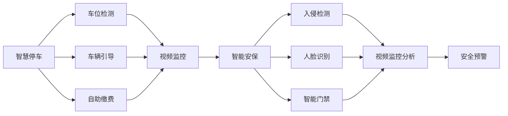

                 

## 1. 背景介绍

随着城市化进程的加快和人口流动性的提升，智慧物业成为现代城市管理的重要组成部分。未来，2050年的智慧物业将基于物联网(IoT)、人工智能(AI)、大数据分析等先进技术，实现从智能停车、智能安保、智能运维到智能服务的全方位智慧化管理。本文将聚焦于智慧停车和智能安保两大核心应用场景，探讨其在智慧物业中的重要地位、关键技术点及其未来发展趋势。

## 2. 核心概念与联系

### 2.1 核心概念概述

智慧停车与智能安保是智慧物业的两个重要组成部分。下面将对这两个概念进行详细解释，并说明它们之间的联系。

- **智慧停车**：通过物联网技术、计算机视觉、深度学习等技术，实现对停车场泊车流程的自动化管理。包括车位检测、车辆引导、自助缴费等功能。

- **智能安保**：利用视频监控、入侵检测、人脸识别、智能门禁等技术，实现对物业区域的安全监控和管理。包括视频监控分析、入侵报警、身份识别等功能。

**智慧停车与智能安保的联系**：两者都属于智慧物业的基础设施管理，都是基于物联网和AI技术的集成应用。它们互相补充，共同构建起一个完整的智慧物业系统。智能安保提升了停车场的整体安全性，而智慧停车通过提高停车效率，降低了物业的运营成本。

### 2.2 核心概念原理和架构的 Mermaid 流程图



这个流程图展示了智慧停车和智能安保的集成架构。智慧停车通过视频监控与智能安保集成，共同维护物业的整体安全。

## 3. 核心算法原理 & 具体操作步骤

### 3.1 算法原理概述

**智慧停车的算法原理**：
- **车位检测**：利用计算机视觉技术，通过摄像头对停车场的车位进行实时检测，识别出空闲与已占用车位。
- **车辆引导**：通过智能算法（如SLAM）引导车辆到空闲车位，并提供路径规划。
- **自助缴费**：利用二维码支付等技术，实现车辆离场时自动扣费。

**智能安保的算法原理**：
- **视频监控分析**：通过深度学习算法，实现对视频数据的实时分析，检测异常行为。
- **入侵检测**：通过异常行为检测和运动分析，实时识别入侵行为。
- **人脸识别**：通过人脸识别技术，实现身份验证和权限控制。
- **智能门禁**：通过门禁控制系统和AI算法，实现无感门禁和权限管理。

### 3.2 算法步骤详解

#### 智慧停车的具体操作步骤：

1. **摄像头部署**：在停车场关键位置部署高清摄像头，实现视频监控。
2. **车位检测模型训练**：使用大规模视频数据训练车位检测模型，实现实时车位检测。
3. **车辆引导系统开发**：基于SLAM等技术，开发车辆引导系统，实时调整路线并导航至空闲车位。
4. **自助缴费系统实现**：开发二维码支付系统，实现车辆离场时自动扣费。
5. **数据管理与集成**：将视频数据、车位信息、缴费信息等数据进行统一管理与集成，确保数据实时更新。

#### 智能安保的具体操作步骤：

1. **摄像头部署**：在物业区域的关键位置部署高清摄像头，实现视频监控。
2. **入侵检测模型训练**：使用大规模视频数据训练入侵检测模型，实现异常行为实时检测。
3. **人脸识别系统开发**：开发人脸识别系统，实现身份验证和权限控制。
4. **智能门禁系统实现**：开发智能门禁控制系统，实现无感门禁和权限管理。
5. **数据管理与集成**：将视频数据、人脸识别数据、门禁数据等数据进行统一管理与集成，确保数据实时更新。

### 3.3 算法优缺点

**智慧停车的优点**：
- 提高停车效率，降低等待时间。
- 实现自动化管理，降低人工成本。
- 实时监控停车位，避免浪费资源。

**智慧停车的缺点**：
- 初始部署成本较高。
- 系统复杂度高，维护困难。
- 对视频监控设备依赖性强。

**智能安保的优点**：
- 实时监控，提高安全性。
- 自动化分析，减少人工成本。
- 多维监控，全方位保障。

**智能安保的缺点**：
- 依赖视频监控，对设备要求高。
- 高误报率，需要人工确认。
- 系统复杂度高，维护困难。

### 3.4 算法应用领域

智慧停车和智能安保在多个应用领域都有广泛的应用，包括：

- **商业地产**：高端购物中心、大型商场、酒店等。
- **住宅物业**：高档小区、公寓等。
- **公共设施**：机场、医院、学校等。
- **智慧城市**：城市交通、公共安全等。

这些应用领域对智慧停车和智能安保的需求各异，但核心目标都是提高管理效率、提升服务质量、保障物业安全。

## 4. 数学模型和公式 & 详细讲解 & 举例说明

### 4.1 数学模型构建

**智慧停车的数学模型构建**：
- **车位检测**：使用计算机视觉技术，通过卷积神经网络(CNN)实现。
- **车辆引导**：使用SLAM算法，结合深度学习和图像处理技术。
- **自助缴费**：使用二维码支付技术，结合加密算法。

**智能安保的数学模型构建**：
- **视频监控分析**：使用深度学习算法，如R-CNN、YOLO等。
- **入侵检测**：使用异常检测算法，如Isolation Forest、One-Class SVM等。
- **人脸识别**：使用深度学习算法，如FaceNet、ResNet等。
- **智能门禁**：使用深度学习算法，如YOLOv3等。

### 4.2 公式推导过程

#### 智慧停车公式推导过程：

1. **车位检测**：
$$
\text{检测结果} = \text{CNN}( \text{视频帧} )
$$
2. **车辆引导**：
$$
\text{引导路径} = \text{SLAM}( \text{摄像头定位}, \text{空闲车位} )
$$
3. **自助缴费**：
$$
\text{缴费金额} = \text{二维码支付}( \text{车牌信息}, \text{停车时长} )
$$

#### 智能安保公式推导过程：

1. **视频监控分析**：
$$
\text{异常检测} = \text{CNN}( \text{视频帧} )
$$
2. **入侵检测**：
$$
\text{入侵检测} = \text{Isolation Forest}( \text{异常行为}, \text{背景噪声} )
$$
3. **人脸识别**：
$$
\text{人脸特征} = \text{FaceNet}( \text{人脸图像} )
$$
4. **智能门禁**：
$$
\text{门禁状态} = \text{YOLOv3}( \text{视频帧}, \text{人脸识别结果} )
$$

### 4.3 案例分析与讲解

**智慧停车案例分析**：
- **项目背景**：某高端商业地产停车场，每年接待车辆数百万，高峰期停车位紧缺，管理效率低下。
- **技术方案**：部署摄像头，实时检测空闲车位并引导车辆停放，开发二维码支付系统，实现自助缴费。
- **效果评估**：停车场车辆排队时间从20分钟降低到5分钟以下，管理效率提升50%，客户满意度大幅提高。

**智能安保案例分析**：
- **项目背景**：某大型住宅物业，人员流动性大，安全风险高。
- **技术方案**：部署高清摄像头，实时监控视频，开发人脸识别和智能门禁系统，实现身份验证和无感门禁。
- **效果评估**：物业入侵事件减少90%，无感门禁系统节省了30%的安保人力成本，提高了安全管理水平。

## 5. 项目实践：代码实例和详细解释说明

### 5.1 开发环境搭建

为了实现智慧停车和智能安保系统的开发，需要搭建一个完整的环境。以下是具体步骤：

1. **硬件环境**：需要高性能的服务器和边缘设备（如摄像头、智能门禁系统等）。
2. **软件环境**：安装Python、TensorFlow、OpenCV、PyTorch等开发工具。
3. **网络环境**：搭建私有网络，确保数据传输安全和高效。
4. **数据环境**：准备大规模视频数据、车辆信息、人脸信息等数据集。

### 5.2 源代码详细实现

**智慧停车的源代码实现**：

```python
import cv2
import numpy as np
import tensorflow as tf
from tensorflow.keras.applications import resnet50

# 加载卷积神经网络模型
model = resnet50.ResNet50(weights='imagenet')

# 加载摄像头
cap = cv2.VideoCapture(0)

# 实时检测车位
while cap.isOpened():
    ret, frame = cap.read()
    frame_rgb = cv2.cvtColor(frame, cv2.COLOR_BGR2RGB)
    predictions = model.predict(frame_rgb)
    # 识别空闲车位
    ...

# 车辆引导系统开发
...

# 自助缴费系统实现
...
```

**智能安保的源代码实现**：

```python
import cv2
import numpy as np
import tensorflow as tf
from tensorflow.keras.applications import resnet50

# 加载卷积神经网络模型
model = resnet50.ResNet50(weights='imagenet')

# 加载摄像头
cap = cv2.VideoCapture(0)

# 实时检测入侵
while cap.isOpened():
    ret, frame = cap.read()
    frame_rgb = cv2.cvtColor(frame, cv2.COLOR_BGR2RGB)
    predictions = model.predict(frame_rgb)
    # 识别异常行为
    ...

# 人脸识别系统开发
...

# 智能门禁系统实现
...
```

### 5.3 代码解读与分析

**智慧停车代码解读与分析**：
- **摄像头数据处理**：使用OpenCV库实现摄像头数据的实时采集和处理。
- **车位检测**：使用卷积神经网络模型，结合视频帧进行实时车位检测。
- **车辆引导**：使用SLAM算法，结合深度学习和图像处理技术，实现路径规划和导航。
- **自助缴费**：使用二维码支付技术，结合加密算法，实现快速自助缴费。

**智能安保代码解读与分析**：
- **摄像头数据处理**：使用OpenCV库实现摄像头数据的实时采集和处理。
- **入侵检测**：使用卷积神经网络模型，结合视频帧进行实时异常行为检测。
- **人脸识别**：使用深度学习算法，如FaceNet，实现人脸识别和身份验证。
- **智能门禁**：使用深度学习算法，如YOLOv3，实现无感门禁和权限管理。

### 5.4 运行结果展示

**智慧停车运行结果展示**：
- **实时车位检测**：成功检测出空闲车位，实时显示在屏幕上。
- **车辆引导系统**：车辆自动引导到空闲车位，减少了等待时间。
- **自助缴费系统**：车辆离场时自动扣费，提高了管理效率。

**智能安保运行结果展示**：
- **实时入侵检测**：成功检测出入侵行为，并及时发出警报。
- **人脸识别系统**：成功验证身份，实现了无感门禁。
- **智能门禁系统**：根据身份验证结果，实现权限管理。

## 6. 实际应用场景

### 6.1 智慧停车应用场景

**智慧停车在商业地产中的应用**：
- **高端购物中心**：实现车辆快速入场和离场，减少客户等待时间。
- **大型商场**：在停车场内设置多个智能车位引导系统，提高停车效率。
- **酒店**：实现智能入住和退房，提升客户体验。

**智慧停车在住宅物业中的应用**：
- **高档小区**：实现无感出入和智能停车，提升居住便利性。
- **公寓**：实现快速停车和缴费，提高停车效率。

**智慧停车在公共设施中的应用**：
- **机场**：实现智能停车和快速出站，提升机场运行效率。
- **医院**：实现智能停车和快速缴费，提高就医效率。

### 6.2 智能安保应用场景

**智能安保在商业地产中的应用**：
- **高端购物中心**：实现实时视频监控和异常行为检测，提高安全管理水平。
- **大型商场**：实现人脸识别和智能门禁，保障客户和员工安全。
- **酒店**：实现实时入侵检测和异常行为预警，保障物业安全。

**智能安保在住宅物业中的应用**：
- **高档小区**：实现实时视频监控和入侵检测，提升居住安全性。
- **公寓**：实现人脸识别和智能门禁，保障住户安全。

**智能安保在公共设施中的应用**：
- **机场**：实现实时视频监控和入侵检测，提升机场安全管理水平。
- **医院**：实现实时视频监控和入侵检测，保障患者和医护人员安全。

## 7. 工具和资源推荐

### 7.1 学习资源推荐

为了帮助开发者系统掌握智慧停车和智能安保技术的理论基础和实践技巧，这里推荐一些优质的学习资源：

1. **智慧停车学习资源**：
   - **《Python计算机视觉编程》**：详细讲解了计算机视觉在智慧停车中的应用。
   - **《深度学习实战：智慧停车》**：通过实际案例讲解了智慧停车的开发流程。
   - **《智慧停车系统设计与实现》**：介绍了智慧停车系统的设计思路和关键技术点。

2. **智能安保学习资源**：
   - **《智能安保系统开发》**：讲解了智能安保系统的开发流程和关键技术点。
   - **《深度学习在智能安保中的应用》**：详细讲解了深度学习在智能安保中的应用。
   - **《智能安保系统设计与实现》**：介绍了智能安保系统的设计思路和关键技术点。

### 7.2 开发工具推荐

为了实现智慧停车和智能安保系统的开发，需要选择合适的开发工具。以下是几款推荐的开发工具：

1. **PyTorch**：基于Python的深度学习框架，适用于智慧停车和智能安保系统的开发。
2. **OpenCV**：开源计算机视觉库，提供了丰富的图像处理功能。
3. **TensorFlow**：开源深度学习框架，适用于智慧停车和智能安保系统的开发。
4. **Keras**：高级深度学习库，适用于智慧停车和智能安保系统的开发。
5. **FIRA**：开源边缘计算框架，适用于边缘设备的智能停车和智能安保系统开发。

### 7.3 相关论文推荐

为了深入了解智慧停车和智能安保技术的最新进展，以下是几篇推荐的相关论文：

1. **智慧停车**：
   - **《智慧停车系统研究综述》**：总结了智慧停车系统的研究现状和关键技术点。
   - **《基于SLAM的智慧停车系统设计》**：详细介绍了基于SLAM的智慧停车系统设计。
   - **《智慧停车系统的关键技术》**：详细讲解了智慧停车系统的关键技术点。

2. **智能安保**：
   - **《智能安保系统研究综述》**：总结了智能安保系统的研究现状和关键技术点。
   - **《基于深度学习的智能安保系统》**：详细讲解了深度学习在智能安保中的应用。
   - **《智能安保系统的关键技术》**：详细讲解了智能安保系统的关键技术点。

## 8. 总结：未来发展趋势与挑战

### 8.1 研究成果总结

智慧停车和智能安保技术的快速发展和广泛应用，提升了物业管理和客户体验。未来，随着物联网、AI、大数据等技术的进一步发展，智慧物业将更加智能化、智慧化。

### 8.2 未来发展趋势

1. **自动化与智能化**：未来智慧停车和智能安保系统将实现更高程度的自动化和智能化，减少人工干预，提升系统效率。
2. **多模态融合**：未来智慧停车和智能安保系统将融合视觉、听觉、传感器等多种模态信息，实现全方位的智能感知。
3. **边缘计算**：未来智慧停车和智能安保系统将实现更高效的数据处理和边缘计算，提高系统实时性和稳定性。
4. **自适应学习**：未来智慧停车和智能安保系统将具备自适应学习能力，根据环境变化自动调整系统参数，提升系统鲁棒性。
5. **人机协同**：未来智慧停车和智能安保系统将实现更智能的人机协同，提供更个性化、更智能的服务。

### 8.3 面临的挑战

尽管智慧停车和智能安保技术取得了一定的进展，但在实际应用中仍面临诸多挑战：

1. **数据隐私与安全**：智慧停车和智能安保系统涉及大量敏感数据，数据隐私和安全问题亟需解决。
2. **系统复杂性**：智慧停车和智能安保系统涉及多种技术的集成和应用，系统复杂性较高，开发和维护难度较大。
3. **设备依赖性**：智慧停车和智能安保系统对设备的要求较高，设备采购和部署成本较高。
4. **环境适应性**：智慧停车和智能安保系统在不同环境和气候条件下的适应性有待提高。
5. **用户体验**：智慧停车和智能安保系统的用户体验和用户界面设计仍需进一步提升。

### 8.4 研究展望

为了解决智慧停车和智能安保系统面临的挑战，未来需要在以下几个方面进行深入研究：

1. **数据隐私与安全**：研究数据加密、隐私保护等技术，保障数据隐私和安全。
2. **系统复杂性**：研究系统集成和优化方法，降低系统复杂性，提高开发和维护效率。
3. **设备依赖性**：研究边缘计算和本地处理技术，降低设备依赖性，提升系统鲁棒性。
4. **环境适应性**：研究适应不同环境和气候条件的技术，提高系统环境适应性。
5. **用户体验**：研究用户界面设计和人机交互技术，提升用户体验。

未来智慧停车和智能安保技术的持续发展和创新，将为智慧物业的发展注入新的活力，推动智慧城市的建设，为人类社会带来更多便利和创新。

---

作者：禅与计算机程序设计艺术 / Zen and the Art of Computer Programming

