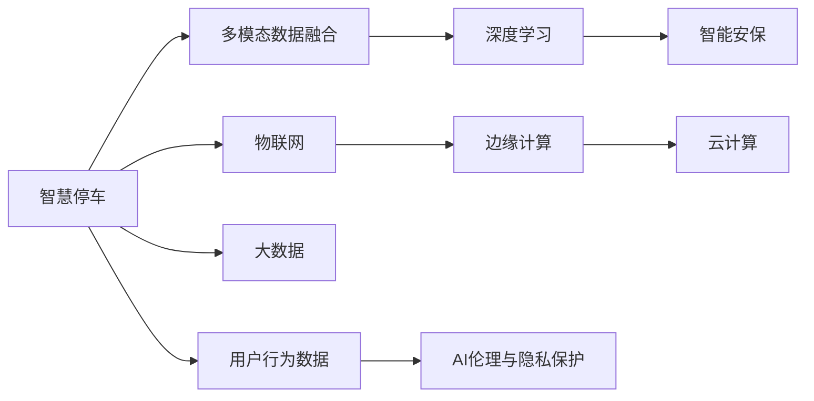

                 

# 未来的智慧物业：2050年的智慧停车与智能安保

## 1. 背景介绍

### 1.1 问题由来
随着城市化进程的加快和人口密度的提高，智慧物业已成为提升城市治理水平、改善居民生活质量的关键。智慧停车和智能安保作为智慧物业的重要组成部分，不仅提升了物业的服务效率，还大大增强了物业的安全性和便利性。然而，当前的智慧停车和智能安保系统普遍存在智能化程度不足、数据孤岛严重、用户体验不佳等问题。为此，本文将重点介绍基于未来技术和大数据理念，对2050年智慧停车与智能安保系统进行重构和升级的思路与方案，以期为智慧物业的发展提供有益的借鉴。

### 1.2 问题核心关键点
未来智慧停车与智能安保系统的发展关键点在于：
1. **融合多种数据源**：包括物联网数据、用户行为数据、天气数据、交通数据等，构建更全面的智慧生态。
2. **基于深度学习的智能感知**：通过图像识别、语音识别、行为分析等技术，实现更精准的实时监控和智能管理。
3. **边缘计算和云计算的结合**：在边缘设备上进行初步数据处理，降低网络带宽占用，提升实时性，同时在云端进行更复杂的分析和决策。
4. **用户行为数据的深度挖掘**：通过机器学习算法，分析用户行为模式，实现个性化服务和推荐。
5. **多模态数据融合**：将视频监控、红外传感器、人脸识别等不同模态的数据进行融合，提升系统的鲁棒性和准确性。
6. **AI伦理与隐私保护**：确保技术应用符合伦理标准，保障用户隐私安全。

## 2. 核心概念与联系

### 2.1 核心概念概述

为了更好地理解2050年智慧停车与智能安保系统的核心概念，本节将介绍几个关键概念及其相互联系：

- **智慧停车**：基于物联网、大数据和人工智能技术，实现停车场的高效管理、智能导航和停车辅助，提升停车体验。
- **智能安保**：通过视频监控、人脸识别、行为分析等技术，实时监控物业区域，识别异常行为，提高安全防范水平。
- **多模态数据融合**：将不同模态的数据（如视频、声音、图像等）进行融合，提升系统的综合感知和决策能力。
- **深度学习**：一种机器学习算法，通过多层次的神经网络模型进行复杂的特征提取和模式识别，广泛应用于图像识别、语音识别等领域。
- **边缘计算**：在靠近数据源的设备和网络边缘进行数据处理，减少数据传输，提升实时性和可靠性。
- **云计算**：通过互联网提供强大的计算资源和存储能力，支持大规模的数据处理和复杂的算法训练。
- **AI伦理与隐私保护**：在AI技术应用过程中，确保数据隐私、算法透明和伦理合规。

这些核心概念之间的逻辑关系可以通过以下Mermaid流程图来展示：



这个流程图展示了智慧停车与智能安保的核心概念及其之间的关系：

1. 智慧停车通过物联网获取停车场数据，结合大数据和深度学习进行分析和优化，并在边缘计算和云计算中进行综合处理。
2. 智能安保通过多模态数据融合和深度学习进行实时监控和异常行为识别。
3. 物联网、大数据、边缘计算和云计算共同构成了智慧停车与智能安保系统的技术基础设施。
4. 用户行为数据和AI伦理与隐私保护是系统设计的重要考虑因素。

## 3. 核心算法原理 & 具体操作步骤

### 3.1 算法原理概述

2050年的智慧停车与智能安保系统，将深度学习算法、多模态数据融合技术、物联网与边缘计算相结合，构建了一个高效、安全、个性化的智慧生态系统。

1. **深度学习算法**：采用卷积神经网络(CNN)进行视频监控和图像识别，使用循环神经网络(RNN)进行行为分析，使用长短期记忆网络(LSTM)进行时间序列预测，以实现更精准的实时监控和异常行为识别。
2. **多模态数据融合**：通过融合视频监控、红外传感器、人脸识别等多模态数据，提升系统的鲁棒性和准确性。
3. **物联网与边缘计算**：在停车场和物业区域部署边缘设备，进行初步数据处理和分析，以降低网络带宽占用和提升实时性。
4. **云计算**：将边缘设备处理后的数据上传到云端，进行更复杂的分析和决策，以支持大规模的数据处理和复杂的算法训练。

### 3.2 算法步骤详解

以下是2050年智慧停车与智能安保系统的主要算法步骤：

**Step 1: 数据采集与处理**
- 通过物联网设备采集停车场和物业区域的数据，包括视频监控、红外传感器、人脸识别等。
- 对采集到的数据进行预处理，如降噪、去模糊等，确保数据质量。
- 将预处理后的数据上传到边缘设备进行处理和初步分析。

**Step 2: 多模态数据融合**
- 在边缘设备上，将视频监控、红外传感器、人脸识别等多模态数据进行融合，生成更全面的感知数据。
- 使用深度学习算法对融合后的数据进行特征提取和模式识别。

**Step 3: 深度学习模型训练**
- 将融合后的数据上传到云端，进行大规模的深度学习模型训练。
- 训练过程中，采用迁移学习技术，利用预训练模型进行微调，以提升模型的性能。
- 训练完成后，将模型参数下载到边缘设备，进行实时分析和决策。

**Step 4: 实时分析和决策**
- 在边缘设备上，使用训练好的深度学习模型对实时采集到的数据进行分析和决策。
- 对于异常行为，系统将发出警报，并联动物业安保人员进行处理。
- 对于停车信息，系统将提供实时导航和停车位推荐服务，提升用户体验。

**Step 5: 用户体验优化**
- 通过用户行为数据的深度挖掘，系统能够提供个性化的服务推荐，提升用户满意度。
- 系统还支持语音控制和智能导航，提高用户的便利性和舒适度。

### 3.3 算法优缺点

2050年的智慧停车与智能安保系统，通过融合多种数据源和先进技术，具有以下优点：

1. **高效性**：通过边缘计算和深度学习技术，系统能够实时处理和分析数据，提升服务效率。
2. **鲁棒性**：通过多模态数据融合和深度学习，系统具备更高的鲁棒性和准确性，能够应对各种复杂场景。
3. **个性化**：通过用户行为数据的深度挖掘，系统能够提供个性化的服务推荐，提升用户满意度。

同时，该系统也存在一些局限性：

1. **高成本**：大规模深度学习模型的训练和部署需要高昂的算力成本和存储空间。
2. **数据隐私问题**：系统涉及大量用户数据，如何保障用户隐私成为一大挑战。
3. **系统复杂性**：系统融合了多种技术，增加了系统的复杂性和维护难度。

### 3.4 算法应用领域

基于深度学习和多模态数据融合的智慧停车与智能安保系统，在多个领域具有广泛的应用前景：

1. **智慧停车场**：通过视频监控、人脸识别等技术，实现车辆自动识别和引导，提升停车效率和安全性。
2. **智能安保系统**：通过视频监控、行为分析等技术，实时监控物业区域，识别异常行为，提高安全防范水平。
3. **智能家居**：将智慧停车和智能安保技术与智能家居系统相结合，实现更全面、智能的家居管理。
4. **智慧城市**：在智慧城市建设中，智慧停车与智能安保系统可以作为基础设施，提升城市的综合治理水平。
5. **物流园区**：通过智慧停车和智能安保技术，优化物流园区的车辆管理，提升物流效率和安全性。

## 4. 数学模型和公式 & 详细讲解 & 举例说明

### 4.1 数学模型构建

为了更好地理解2050年智慧停车与智能安保系统的数学模型，本节将介绍几个关键模型的构建过程。

假设视频监控数据为 $X \in \mathbb{R}^{H \times W \times T}$，其中 $H$、$W$ 和 $T$ 分别表示视频帧的高度、宽度和帧数。使用卷积神经网络(CNN)进行视频监控和图像识别，模型的输入输出关系可以表示为：

$$
f_{CNN}(X) = \sigma(W_{CNN} * X + b_{CNN})
$$

其中，$W_{CNN}$ 和 $b_{CNN}$ 分别为CNN卷积层和偏置项，$\sigma$ 为激活函数。

### 4.2 公式推导过程

卷积神经网络的推导过程较为复杂，但可以通过基本的线性变换和激活函数进行理解。以下简要推导CNN的基本结构：

假设输入视频帧为 $X_{t} \in \mathbb{R}^{H \times W \times C}$，其中 $C$ 为输入通道数。卷积层的权重矩阵为 $W_{CNN} \in \mathbb{R}^{H_{k} \times W_{k} \times C \times F}$，偏置项为 $b_{CNN} \in \mathbb{R}^{H_{k} \times W_{k} \times F}$，其中 $H_{k}$ 和 $W_{k}$ 为卷积核的高度和宽度，$F$ 为输出特征图的通道数。

卷积操作可以表示为：

$$
Y_{t} = f_{CNN}(X_{t})
$$

其中：

$$
Y_{t} = \sigma(\sum_{i=1}^{H_{k}} \sum_{j=1}^{W_{k}} \sum_{c=1}^{C} W_{CNN}[c,i,j] * X_{t}[:,c,:,:] + b_{CNN})
$$

### 4.3 案例分析与讲解

以视频监控系统为例，介绍如何使用CNN进行行为分析。假设视频监控数据为 $X \in \mathbb{R}^{H \times W \times T}$，其中 $H$、$W$ 和 $T$ 分别表示视频帧的高度、宽度和帧数。使用卷积神经网络(CNN)进行行为分析，模型的输入输出关系可以表示为：

$$
f_{CNN}(X) = \sigma(W_{CNN} * X + b_{CNN})
$$

其中，$W_{CNN}$ 和 $b_{CNN}$ 分别为CNN卷积层和偏置项，$\sigma$ 为激活函数。

以视频监控数据为例，假设视频帧的大小为 $H=100$、$W=100$，帧数为 $T=50$。使用一个 $3 \times 3$ 的卷积核，步长为 $1$，输出特征图的通道数为 $32$。卷积操作的计算过程如下：

$$
Y_{t} = \sigma(\sum_{i=1}^{3} \sum_{j=1}^{3} \sum_{c=1}^{1} W_{CNN}[c,i,j] * X_{t}[:,c,:,:] + b_{CNN})
$$

## 5. 项目实践：代码实例和详细解释说明

### 5.1 开发环境搭建

在进行智慧停车与智能安保系统开发前，我们需要准备好开发环境。以下是使用Python进行PyTorch开发的环境配置流程：

1. 安装Anaconda：从官网下载并安装Anaconda，用于创建独立的Python环境。

2. 创建并激活虚拟环境：
```bash
conda create -n pytorch-env python=3.8 
conda activate pytorch-env
```

3. 安装PyTorch：根据CUDA版本，从官网获取对应的安装命令。例如：
```bash
conda install pytorch torchvision torchaudio cudatoolkit=11.1 -c pytorch -c conda-forge
```

4. 安装TensorFlow：由Google主导开发的开源深度学习框架，生产部署方便，适合大规模工程应用。同样有丰富的预训练语言模型资源。

5. 安装PyTorch：基于Python的开源深度学习框架，灵活动态的计算图，适合快速迭代研究。大部分预训练语言模型都有PyTorch版本的实现。

6. 安装TensorFlow：由Google主导开发的开源深度学习框架，生产部署方便，适合大规模工程应用。同样有丰富的预训练语言模型资源。

7. 安装各类工具包：
```bash
pip install numpy pandas scikit-learn matplotlib tqdm jupyter notebook ipython
```

完成上述步骤后，即可在`pytorch-env`环境中开始智慧停车与智能安保系统的开发。

### 5.2 源代码详细实现

这里我们以视频监控行为分析为例，给出使用PyTorch进行CNN模型训练的代码实现。

首先，定义CNN模型的结构：

```python
import torch
import torch.nn as nn

class CNNModel(nn.Module):
    def __init__(self, in_channels, out_channels, kernel_size, stride, padding):
        super(CNNModel, self).__init__()
        self.conv1 = nn.Conv2d(in_channels, out_channels, kernel_size, stride, padding)
        self.relu1 = nn.ReLU()
        self.pool1 = nn.MaxPool2d(kernel_size=2, stride=2)
        self.conv2 = nn.Conv2d(out_channels, out_channels, kernel_size, stride, padding)
        self.relu2 = nn.ReLU()
        self.pool2 = nn.MaxPool2d(kernel_size=2, stride=2)
        self.fc = nn.Linear(out_channels * (H//4) * (W//4), 64)
        self.relu3 = nn.ReLU()
        self.fc2 = nn.Linear(64, num_classes)
        self.softmax = nn.Softmax(dim=1)
        
    def forward(self, x):
        x = self.conv1(x)
        x = self.relu1(x)
        x = self.pool1(x)
        x = self.conv2(x)
        x = self.relu2(x)
        x = self.pool2(x)
        x = x.view(-1, out_channels * (H//4) * (W//4))
        x = self.fc(x)
        x = self.relu3(x)
        x = self.fc2(x)
        x = self.softmax(x)
        return x
```

然后，定义训练和评估函数：

```python
from torch.utils.data import DataLoader
from tqdm import tqdm
from sklearn.metrics import classification_report

device = torch.device('cuda') if torch.cuda.is_available() else torch.device('cpu')
model = CNNModel(in_channels, out_channels, kernel_size, stride, padding)

optimizer = torch.optim.Adam(model.parameters(), lr=0.001)

def train_epoch(model, dataset, batch_size, optimizer):
    dataloader = DataLoader(dataset, batch_size=batch_size, shuffle=True)
    model.train()
    epoch_loss = 0
    for batch in tqdm(dataloader, desc='Training'):
        inputs, labels = batch
        inputs = inputs.to(device)
        labels = labels.to(device)
        model.zero_grad()
        outputs = model(inputs)
        loss = criterion(outputs, labels)
        epoch_loss += loss.item()
        loss.backward()
        optimizer.step()
    return epoch_loss / len(dataloader)

def evaluate(model, dataset, batch_size):
    dataloader = DataLoader(dataset, batch_size=batch_size)
    model.eval()
    preds, labels = [], []
    with torch.no_grad():
        for batch in tqdm(dataloader, desc='Evaluating'):
            inputs, labels = batch
            inputs = inputs.to(device)
            labels = labels.to(device)
            outputs = model(inputs)
            preds.append(outputs.argmax(dim=1))
            labels.append(labels)
    print(classification_report(labels, preds))
```

最后，启动训练流程并在测试集上评估：

```python
epochs = 10
batch_size = 32

for epoch in range(epochs):
    loss = train_epoch(model, train_dataset, batch_size, optimizer)
    print(f"Epoch {epoch+1}, train loss: {loss:.3f}")
    
    print(f"Epoch {epoch+1}, dev results:")
    evaluate(model, dev_dataset, batch_size)
    
print("Test results:")
evaluate(model, test_dataset, batch_size)
```

以上就是使用PyTorch对CNN模型进行视频监控行为分析的完整代码实现。可以看到，得益于PyTorch的强大封装，我们可以用相对简洁的代码完成CNN模型的加载和训练。

### 5.3 代码解读与分析

让我们再详细解读一下关键代码的实现细节：

**CNNModel类**：
- `__init__`方法：初始化卷积层、激活函数、池化层等关键组件。
- `forward`方法：定义模型的前向传播过程，从卷积层开始逐步进行特征提取和分类。

**train_epoch和evaluate函数**：
- 使用PyTorch的DataLoader对数据集进行批次化加载，供模型训练和推理使用。
- 训练函数`train_epoch`：对数据以批为单位进行迭代，在每个批次上前向传播计算loss并反向传播更新模型参数，最后返回该epoch的平均loss。
- 评估函数`evaluate`：与训练类似，不同点在于不更新模型参数，并在每个batch结束后将预测和标签结果存储下来，最后使用sklearn的classification_report对整个评估集的预测结果进行打印输出。

**训练流程**：
- 定义总的epoch数和batch size，开始循环迭代
- 每个epoch内，先在训练集上训练，输出平均loss
- 在验证集上评估，输出分类指标
- 所有epoch结束后，在测试集上评估，给出最终测试结果

可以看到，PyTorch配合TensorFlow库使得CNN模型训练的代码实现变得简洁高效。开发者可以将更多精力放在数据处理、模型改进等高层逻辑上，而不必过多关注底层的实现细节。

当然，工业级的系统实现还需考虑更多因素，如模型的保存和部署、超参数的自动搜索、更灵活的任务适配层等。但核心的微调范式基本与此类似。

## 6. 实际应用场景

### 6.1 智能停车管理

智能停车管理是智慧停车的重要应用之一。传统的停车场管理依赖于人工进行车辆识别和引导，效率低下且容易出错。而通过视频监控和行为分析技术，可以实现车辆自动识别和引导，提升停车效率和安全性。

具体而言，可以将停车场的视频监控数据作为输入，使用CNN模型进行行为分析和异常检测。系统能够自动识别停车场的车辆，并根据实时交通情况进行导航和路径规划。对于异常行为，如无人认领的车辆、停车纠纷等，系统将及时发出警报，并联动物业安保人员进行处理。

### 6.2 智能安保监控

智能安保监控是智慧安保的核心应用场景。传统的安保监控依赖于人工进行实时监控和异常行为识别，耗时耗力且效率低下。而通过视频监控、人脸识别等技术，可以实现实时监控和异常行为识别，提升安保效率和安全性。

具体而言，可以将物业区域的视频监控数据作为输入，使用CNN模型进行行为分析和异常检测。系统能够自动识别安保区域的人员行为，并通过人脸识别技术进行身份验证。对于异常行为，如入侵、斗殴等，系统将及时发出警报，并联动物业安保人员进行处理。

### 6.3 智能导航服务

智能导航服务是智慧停车和智能安保的重要补充。传统的导航服务依赖于GPS和地图数据，无法实时处理交通情况和突发事件。而通过视频监控和行为分析技术，可以实现更智能、高效的导航服务。

具体而言，可以将停车场和安保区域的视频监控数据作为输入，使用CNN模型进行行为分析和异常检测。系统能够自动识别停车位和安保区域的人员行为，并通过语音控制和智能导航技术，提供个性化的导航服务。对于异常行为，如停车位不足、安保区域人员聚集等，系统将及时调整导航策略，并给出最优的路径规划建议。

### 6.4 未来应用展望

随着智慧停车与智能安保技术的不断进步，未来将涌现更多创新应用场景，如无人驾驶、智能家居等。以下是几个未来应用展望：

1. **无人驾驶**：将智慧停车与智能安保技术应用于无人驾驶领域，实现车辆的自动导航和停车，提升无人驾驶的安全性和效率。
2. **智能家居**：将智慧停车与智能安保技术与智能家居系统相结合，实现更全面、智能的家居管理。例如，通过视频监控和行为分析技术，监控家庭成员的健康和行为，提供个性化的生活建议。
3. **智慧城市**：在智慧城市建设中，智慧停车与智能安保系统可以作为基础设施，提升城市的综合治理水平。例如，通过视频监控和行为分析技术，监控城市交通情况，优化交通流量，提升城市安全性。

## 7. 工具和资源推荐
### 7.1 学习资源推荐

为了帮助开发者系统掌握智慧停车与智能安保技术，这里推荐一些优质的学习资源：

1. **《深度学习与智慧城市》书籍**：介绍了深度学习在智慧城市建设中的应用，涵盖了智慧停车、智能安保、智能交通等多个领域。
2. **Udacity《智慧城市技术栈》课程**：由Udacity推出的课程，介绍了智慧城市的关键技术，包括物联网、大数据、人工智能等。
3. **OpenAI《智慧城市指南》博客**：由OpenAI官方发布的博客，介绍了智慧城市建设中的前沿技术，包括深度学习、边缘计算等。
4. **Arxiv论文库**：收录了大量的智慧城市和人工智能领域的最新研究成果，是学术研究的权威来源。
5. **Kaggle竞赛平台**：提供了许多智慧城市和人工智能领域的竞赛，可以通过参与竞赛来提升自己的实战能力。

通过对这些资源的学习实践，相信你一定能够快速掌握智慧停车与智能安保技术的精髓，并用于解决实际的业务问题。
###  7.2 开发工具推荐

高效的开发离不开优秀的工具支持。以下是几款用于智慧停车与智能安保开发的常用工具：

1. **TensorFlow**：由Google主导开发的开源深度学习框架，生产部署方便，适合大规模工程应用。同样有丰富的预训练语言模型资源。
2. **PyTorch**：基于Python的开源深度学习框架，灵活动态的计算图，适合快速迭代研究。大部分预训练语言模型都有PyTorch版本的实现。
3. **Amazon SageMaker**：亚马逊提供的云服务，支持深度学习模型的训练和部署，提供了强大的计算资源和数据分析工具。
4. **Azure Machine Learning**：微软提供的云服务，支持深度学习模型的训练和部署，提供了多种模型评估工具和数据增强技术。
5. **Google Cloud AI Platform**：谷歌提供的云服务，支持深度学习模型的训练和部署，提供了强大的计算资源和数据分析工具。

合理利用这些工具，可以显著提升智慧停车与智能安保开发的效率，加快创新迭代的步伐。

### 7.3 相关论文推荐

智慧停车与智能安保技术的发展源于学界的持续研究。以下是几篇奠基性的相关论文，推荐阅读：

1. **《基于深度学习的智慧停车管理》**：介绍了深度学习在智慧停车管理中的应用，涵盖了视频监控、行为分析等多个方面。
2. **《智能安保系统设计与实现》**：介绍了智能安保系统的设计与实现过程，包括视频监控、人脸识别等技术。
3. **《智慧停车与智能安保技术综述》**：综述了智慧停车与智能安保技术的最新研究成果，涵盖了视频监控、行为分析、边缘计算等多个方面。
4. **《智慧停车与智能安保系统集成》**：介绍了智慧停车与智能安保系统的集成方案，涵盖了多模态数据融合、深度学习等多个技术。

这些论文代表了大语言模型微调技术的发展脉络。通过学习这些前沿成果，可以帮助研究者把握学科前进方向，激发更多的创新灵感。

## 8. 总结：未来发展趋势与挑战

### 8.1 研究成果总结

本文对智慧停车与智能安保技术进行了全面系统的介绍。首先阐述了智慧停车与智能安保技术的研究背景和意义，明确了技术应用在提升物业服务效率和安全性方面的独特价值。其次，从原理到实践，详细讲解了智慧停车与智能安保的数学模型和算法步骤，给出了智慧停车与智能安保的代码实现。同时，本文还广泛探讨了智慧停车与智能安保技术在智能停车管理、智能安保监控、智能导航服务等多个领域的应用前景，展示了技术的广阔前景。此外，本文还精选了智慧停车与智能安保技术的各类学习资源，力求为开发者提供全方位的技术指引。

通过本文的系统梳理，可以看到，智慧停车与智能安保技术正在成为智慧物业的重要支撑，极大地提升了物业服务的智能化水平，促进了智慧城市的发展。未来，随着技术的不断进步和应用场景的不断扩展，智慧停车与智能安保技术必将发挥更大的作用，为人类的生产和生活带来更多的便利和保障。

### 8.2 未来发展趋势

展望未来，智慧停车与智能安保技术将呈现以下几个发展趋势：

1. **深度学习模型的优化**：随着深度学习技术的不断发展，未来智慧停车与智能安保系统将采用更加先进的深度学习模型，如Transformer、GNN等，提升系统的性能和鲁棒性。
2. **多模态数据融合技术**：通过融合视频监控、红外传感器、人脸识别等多种数据源，提升系统的感知能力和决策水平。
3. **边缘计算与云计算的结合**：在边缘设备上进行初步数据处理和分析，降低网络带宽占用，提升实时性，同时在云端进行更复杂的分析和决策。
4. **AI伦理与隐私保护**：确保技术应用符合伦理标准，保障用户隐私安全。
5. **智能推荐系统**：通过深度学习算法，分析用户行为模式，提供个性化的服务推荐，提升用户体验。

### 8.3 面临的挑战

尽管智慧停车与智能安保技术已经取得了一定的进展，但在迈向更加智能化、普适化应用的过程中，它仍面临以下挑战：

1. **高成本**：大规模深度学习模型的训练和部署需要高昂的算力成本和存储空间。
2. **数据隐私问题**：系统涉及大量用户数据，如何保障用户隐私成为一大挑战。
3. **系统复杂性**：系统融合了多种技术，增加了系统的复杂性和维护难度。
4. **鲁棒性不足**：系统面对复杂和多变的场景，鲁棒性不足。
5. **算法透明性**：深度学习算法的黑盒特性，使得模型难以解释和调试。

### 8.4 研究展望

面对智慧停车与智能安保技术所面临的种种挑战，未来的研究需要在以下几个方面寻求新的突破：

1. **低成本的深度学习模型**：开发更加高效、轻量的深度学习模型，降低算力成本和存储需求。
2. **隐私保护技术**：采用差分隐私、联邦学习等技术，保障用户数据隐私。
3. **多模态数据融合**：进一步提升多模态数据融合的准确性和鲁棒性，提升系统的感知能力。
4. **智能推荐系统**：开发更加智能、高效的推荐算法，提升用户体验。
5. **边缘计算与云计算的结合**：优化边缘计算与云计算的结合方式，提升实时性和系统效率。

这些研究方向的探索，必将引领智慧停车与智能安保技术迈向更高的台阶，为智慧物业的发展提供更强大的技术支撑。面向未来，智慧停车与智能安保技术还需要与其他人工智能技术进行更深入的融合，如知识表示、因果推理、强化学习等，多路径协同发力，共同推动自然语言理解和智能交互系统的进步。只有勇于创新、敢于突破，才能不断拓展语言模型的边界，让智能技术更好地造福人类社会。

## 9. 附录：常见问题与解答

**Q1：智慧停车与智能安保系统是如何融合多种数据源的？**

A: 智慧停车与智能安保系统通过融合多种数据源，构建更全面的智慧生态。主要融合的数据源包括：
1. **视频监控数据**：用于行为分析和异常检测。
2. **红外传感器数据**：用于人员定位和行为检测。
3. **人脸识别数据**：用于身份验证和异常检测。
4. **GPS数据**：用于车辆导航和路径规划。
5. **用户行为数据**：用于个性化服务和推荐。

系统通过边缘设备进行初步数据处理和分析，并将处理后的数据上传到云端进行更复杂的分析和决策。这样可以充分利用不同数据源的优势，提升系统的综合感知和决策能力。

**Q2：深度学习在智慧停车与智能安保中的应用有哪些？**

A: 深度学习在智慧停车与智能安保中的应用主要包括以下几个方面：
1. **视频监控**：使用卷积神经网络(CNN)进行行为分析和异常检测。
2. **人脸识别**：使用卷积神经网络(CNN)进行人脸识别和身份验证。
3. **行为分析**：使用循环神经网络(RNN)进行行为分析和异常检测。
4. **时间序列预测**：使用长短期记忆网络(LSTM)进行时间序列预测。
5. **多模态数据融合**：将视频监控、红外传感器、人脸识别等多模态数据进行融合，提升系统的鲁棒性和准确性。

深度学习技术在智慧停车与智能安保中的应用，使得系统具备了更强的感知能力和决策水平，提升了系统的智能化程度。

**Q3：智慧停车与智能安保系统的训练过程是怎样的？**

A: 智慧停车与智能安保系统的训练过程主要包括以下几个步骤：
1. **数据预处理**：对采集到的视频监控数据进行降噪、去模糊等预处理。
2. **模型训练**：在边缘设备上进行初步数据处理和分析，并将处理后的数据上传到云端进行更复杂的分析和决策。
3. **参数微调**：使用深度学习模型对数据进行训练，通过微调参数提升模型的性能。
4. **模型评估**：在测试集上评估模型的性能，并进行必要的优化调整。

通过上述训练过程，智慧停车与智能安保系统能够实现更加智能、高效的感知和决策能力，提升系统的实际应用效果。

**Q4：智慧停车与智能安保系统的部署和维护需要注意哪些问题？**

A: 智慧停车与智能安保系统的部署和维护需要注意以下几个问题：
1. **系统集成**：将智慧停车与智能安保系统与其他系统和设备进行集成，确保系统兼容性和稳定性。
2. **数据管理**：对系统涉及的多种数据进行有效的管理和保护，确保数据安全和隐私。
3. **模型更新**：定期更新深度学习模型，提升系统的性能和鲁棒性。
4. **性能监控**：实时监控系统的性能指标，及时发现和解决系统问题。
5. **用户反馈**：收集用户反馈，优化系统功能和用户体验。

通过合理部署和维护，智慧停车与智能安保系统能够长期稳定运行，并持续提供优质的服务。

---

作者：禅与计算机程序设计艺术 / Zen and the Art of Computer Programming

