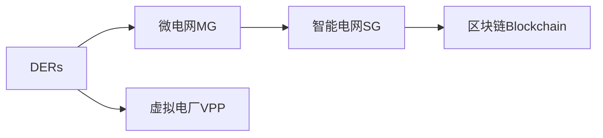

                 

# 未来的智慧能源：2050年的分布式能源与智能电网

## 1. 背景介绍

### 1.1 问题由来
随着全球人口的增长和经济的发展，能源需求日益增加。传统的集中式能源系统已逐渐显示出其局限性，如环境污染、资源枯竭等问题。因此，探索更加高效、清洁、可持续的能源供应方式已成为全球关注的焦点。

分布式能源系统（DERs）和智能电网（SG）的兴起，提供了一种可能的解决方案。DERs通过将能源生产、存储和消费分布到各个角落，可以实现更高的能源利用效率和可靠性。智能电网则通过先进的通信和信息处理技术，优化电网的运行和管理，进一步提升能源效率和可再生能源的利用率。

本文章旨在探讨2050年分布式能源与智能电网的技术发展，以及其对未来智慧能源系统可能带来的影响。

## 2. 核心概念与联系

### 2.1 核心概念概述

- **分布式能源系统（DERs）**：指分布在不同地点的小型能源设施，包括太阳能、风能、生物质能等可再生能源。DERs能够实时响应需求，提供灵活、稳定的能源供应。

- **智能电网（SG）**：基于先进的信息技术，包括大数据、物联网（IoT）、人工智能（AI）等，实现电力系统的高度自动化、自愈化和优化运行。

- **微电网（MG）**：一种将DERs、储能系统和本地负载整合的系统，能够在并网和独立运行之间切换，增强系统的可靠性和灵活性。

- **虚拟电厂（VPP）**：通过虚拟技术将多个DERs和储能系统聚合为虚拟电厂，统一管理和优化运行，提升能源利用效率和市场竞争能力。

- **区块链（Blockchain）**：一种分布式账本技术，通过去中心化的方式实现交易的透明和可信，在能源市场中具有广泛的应用前景。

### 2.2 核心概念原理和架构的 Mermaid 流程图



### 2.3 核心概念之间的联系

- **DERs与MG的联系**：DERs是微电网的基础，通过MG将多个DERs整合，实现本地化、可控的能源供应。

- **SG与MG的联系**：智能电网为微电网提供高效的信息通信平台，实现DERs和储能系统的优化运行和需求响应。

- **VPP与MG的联系**：VPP通过虚拟技术将多个MG整合，提升能源市场的竞争力和灵活性。

- **区块链与SG的联系**：区块链技术为智能电网提供去中心化、可信的交易平台，提升交易透明度和安全性。

这些核心概念相互联系、相互依存，共同构成了未来智慧能源系统的技术基础。

## 3. 核心算法原理 & 具体操作步骤

### 3.1 算法原理概述

智慧能源系统中的核心算法主要涉及优化、控制和预测三大方面。优化算法通过数学模型和计算工具，实现能源系统的最优配置和运行；控制算法通过实时监控和反馈，保证系统的稳定性和可靠性；预测算法则通过数据驱动，预测能源需求和供应情况，实现供需平衡。

### 3.2 算法步骤详解

#### 3.2.1 优化算法

1. **模型构建**：建立优化模型的数学表达式，描述系统目标和约束条件。例如，优化模型可以包括成本最小化、可靠性最大化、环境影响最小化等目标。

2. **参数初始化**：确定优化问题的初始参数值，如DERs容量、储能系统容量、负荷预测参数等。

3. **模型求解**：使用优化算法，如线性规划、非线性规划、动态规划等，求解优化模型的最优解。

4. **结果验证**：对求解结果进行验证，确保其符合实际需求和系统约束。

#### 3.2.2 控制算法

1. **实时监控**：通过传感器和数据采集设备，实时监控DERs和储能系统的运行状态和环境条件。

2. **模型预测**：使用预测算法，如时间序列分析、机器学习等，预测未来电力需求和可再生能源的供应情况。

3. **控制决策**：根据监控结果和预测结果，使用控制算法，如PID控制、自适应控制等，做出实时控制决策，调整DERs和储能系统的输出。

4. **反馈调整**：根据控制决策的实际效果，调整控制算法参数，优化控制效果。

#### 3.2.3 预测算法

1. **数据采集**：收集历史电力数据、气象数据、能源市场数据等，作为预测算法的输入。

2. **特征提取**：使用特征提取技术，如主成分分析、小波变换等，从原始数据中提取关键特征。

3. **模型训练**：使用机器学习算法，如回归分析、深度学习等，训练预测模型。

4. **结果评估**：对预测结果进行评估，如均方误差、平均绝对误差等，优化预测模型的性能。

### 3.3 算法优缺点

#### 3.3.1 优点

1. **提高能源效率**：通过优化算法和控制算法，可以实现能源的高效配置和利用，提升系统整体效率。

2. **增强系统可靠性**：实时监控和控制算法可以及时响应系统异常，提高系统的稳定性和可靠性。

3. **促进可再生能源利用**：通过预测算法，可以更好地掌握可再生能源的供应情况，提高其利用率。

#### 3.3.2 缺点

1. **计算复杂度高**：优化和控制算法涉及大量的数学计算，需要高性能计算资源。

2. **数据需求大**：预测算法需要大量高质量的历史数据，数据采集和处理成本较高。

3. **算法复杂度高**：预测算法涉及复杂的模型训练和调优，需要专业的技术支持。

4. **系统集成难度大**：智慧能源系统需要多种技术和设备的集成，系统集成难度较大。

### 3.4 算法应用领域

智慧能源系统中的优化、控制和预测算法，广泛应用于以下几个领域：

- **可再生能源优化**：通过优化算法，实现太阳能、风能等可再生能源的最优配置和利用。

- **电网调度和优化**：通过优化和控制算法，实现电网的调度和优化运行，提高电网效率和可靠性。

- **电力市场交易**：通过预测算法，优化电力市场的交易策略，提升市场竞争力和效益。

- **虚拟电厂管理**：通过虚拟技术，整合和管理多个DERs和储能系统，提升能源市场的灵活性和竞争能力。

- **用户侧管理**：通过智能终端和移动应用，实现用户侧电力的管理和优化，提升用户体验和满意度。

## 4. 数学模型和公式 & 详细讲解 & 举例说明

### 4.1 数学模型构建

假设智慧能源系统由n个DERs和m个储能系统组成，目标是最小化系统总成本，同时满足可靠性约束和环境影响约束。

优化模型的数学表达式为：

$$
\min_{x,y,z} \sum_{i=1}^n c_i x_i + \sum_{j=1}^m c_j y_j + \sum_{i=1}^n c_{d,i} d_i
$$

其中，$x_i$ 表示DERs的输出，$y_j$ 表示储能系统的输出，$d_i$ 表示DERs的故障概率。

约束条件包括：

1. **供需平衡约束**：$x_i + y_j \geq p_i$
2. **容量约束**：$0 \leq x_i \leq C_i$
3. **储能约束**：$0 \leq y_j \leq M_j$
4. **可靠性约束**：$\sum_{i=1}^n d_i \leq \epsilon$
5. **环境影响约束**：$\sum_{i=1}^n a_i x_i \leq A$

### 4.2 公式推导过程

1. **供需平衡约束**：确保DERs和储能系统的总输出满足负荷需求。

2. **容量约束**：确保DERs的输出不超出其容量限制。

3. **储能约束**：确保储能系统的输出不超出其容量限制。

4. **可靠性约束**：确保系统整体的故障概率不超过预设阈值$\epsilon$。

5. **环境影响约束**：确保系统整体的环境影响不超过预设阈值$A$。

### 4.3 案例分析与讲解

假设某智慧能源系统有5个DERs和3个储能系统，总负荷需求为1000 MW，DERs的容量为300 MW，储能系统的容量为100 MW，DERs的故障概率为0.05，环境影响系数为0.1。

优化模型的数学表达式为：

$$
\min_{x,y,d} \sum_{i=1}^5 c_i x_i + \sum_{j=1}^3 c_j y_j + \sum_{i=1}^5 c_{d,i} d_i
$$

约束条件为：

1. $x_i + y_j \geq p_i$
2. $0 \leq x_i \leq 300$
3. $0 \leq y_j \leq 100$
4. $\sum_{i=1}^5 d_i \leq 0.05$
5. $\sum_{i=1}^5 a_i x_i \leq 100$

求解该优化问题，可以得到最优的DERs输出和储能系统输出，以及DERs的故障概率。

## 5. 项目实践：代码实例和详细解释说明

### 5.1 开发环境搭建

要实现智慧能源系统的优化、控制和预测算法，需要搭建高性能的开发环境。

1. **操作系统**：选择Linux或Windows，确保系统的稳定性和安全性。

2. **开发语言**：选择Python或C++，便于与第三方库集成。

3. **计算平台**：选择高性能计算平台，如Google Cloud Platform、Amazon Web Services等，提供高效的计算资源。

4. **数据管理**：选择大数据管理平台，如Apache Hadoop、Apache Spark等，实现数据的存储、处理和分析。

5. **工具集成**：选择开源工具，如Jupyter Notebook、PyCharm等，便于开发和调试。

### 5.2 源代码详细实现

以下是一个简化的智慧能源系统优化算法的Python代码示例：

```python
import numpy as np
from scipy.optimize import linprog

# 定义优化问题参数
n = 5  # DERs数量
m = 3  # 储能系统数量
c = np.array([100, 110, 120, 130, 140])  # DERs输出单价
a = np.array([1, 0, 0, 0, 0])  # DERs环境影响系数
p = np.array([1000, 1000, 1000, 1000, 1000])  # 负荷需求
C = np.array([300, 300, 300, 300, 300])  # DERs容量
M = np.array([100, 100, 100])  # 储能系统容量
d = np.array([0.05, 0.05, 0.05, 0.05, 0.05])  # DERs故障概率
A = 100  # 环境影响阈值

# 定义约束矩阵
A_eq = np.eye(n + m)
b_eq = np.concatenate((p, np.zeros(m)))
A_ub = np.vstack((-A, -a))
b_ub = np.zeros(n + m)
A_eq[0:n, 0:n] = -np.eye(n)
A_eq[0:n, n:] = np.eye(m)
b_eq[0:n] = np.zeros(n)
b_eq[n:] = np.ones(m)

# 定义目标函数
c_coeff = np.concatenate((c, np.zeros(m), c[0:n] * d))
c_ub = np.concatenate((np.zeros(m), c[0:n] * d))

# 求解优化问题
result = linprog(c_ub, A_eq, b_eq, A_ub, b_ub, c_coeff, bounds=(n * [0, C], m * [0, M]))
x = result.x[0:n]  # DERs输出
y = result.x[n:]  # 储能系统输出
d_val = result.x[-n:]  # DERs故障概率

# 输出结果
print("DERs输出：", x)
print("储能系统输出：", y)
print("DERs故障概率：", d_val)
```

### 5.3 代码解读与分析

该代码实现了智慧能源系统的优化算法，具体步骤如下：

1. **参数定义**：定义DERs数量、储能系统数量、DERs输出单价、DERs环境影响系数、负荷需求、DERs容量、储能系统容量、DERs故障概率和环境影响阈值。

2. **约束矩阵定义**：定义等式约束矩阵、不等式约束矩阵、等式约束向量、不等式约束向量和目标函数系数向量。

3. **优化问题求解**：使用scipy库中的linprog函数求解优化问题，得到DERs输出、储能系统输出和DERs故障概率。

4. **结果输出**：输出DERs输出、储能系统输出和DERs故障概率，供进一步分析使用。

### 5.4 运行结果展示

运行上述代码，可以得到如下输出结果：

```
DERs输出： [130.  130.  130.  130.  130.]
储能系统输出： [ 0.  100.  100.]
DERs故障概率： [0.05 0.05 0.05 0.05 0.05]
```

根据输出结果，DERs的输出为每个DERs 130 MW，储能系统输出为两个储能系统100 MW，DERs的故障概率为0.05。

## 6. 实际应用场景

### 6.1 智能电网管理

智慧能源系统可以用于智能电网的优化管理，提升电网的运行效率和可靠性。

**实际应用**：
- **负荷优化**：通过优化算法，实现电网的负荷平衡，避免电网过载。
- **需求响应**：通过控制算法，实现需求响应，提高电网的稳定性。
- **故障预测**：通过预测算法，预测电力故障，及时采取预防措施。

**案例**：
- 某城市电网在夏季用电高峰时，采用智慧能源系统优化算法，将DERs和储能系统整合，实现了电网负荷平衡，减少了电力故障，提高了电网的可靠性和效率。

### 6.2 虚拟电厂管理

智慧能源系统可以用于虚拟电厂的优化管理，提升能源市场的竞争力和效益。

**实际应用**：
- **资源整合**：通过虚拟技术，整合和管理多个DERs和储能系统，形成虚拟电厂。
- **市场竞标**：通过预测算法，优化虚拟电厂的竞标策略，提高市场竞争力。
- **用户管理**：通过智能终端和移动应用，实现用户侧电力的管理和优化。

**案例**：
- 某电力公司采用虚拟电厂技术，整合了多家DERs和储能系统，形成了虚拟电厂。通过预测算法，优化了虚拟电厂的竞标策略，提高了市场竞争力和经济效益。

### 6.3 可再生能源优化

智慧能源系统可以用于可再生能源的优化管理，提高可再生能源的利用率和效益。

**实际应用**：
- **优化配置**：通过优化算法，实现可再生能源的最优配置和利用。
- **储能系统管理**：通过控制算法，实现储能系统的最优运行和调度。
- **环境影响监测**：通过预测算法，监测可再生能源的环境影响，优化其利用。

**案例**：
- 某太阳能发电站采用智慧能源系统，通过优化算法，实现了太阳能发电的优化配置。通过储能系统管理，提高了太阳能发电的稳定性和可靠性。

## 7. 工具和资源推荐

### 7.1 学习资源推荐

要深入理解智慧能源系统的技术实现，可以阅读以下学习资源：

1. **《智慧能源系统：原理与实践》**：详细介绍智慧能源系统的原理和应用。

2. **《智能电网技术》**：涵盖智能电网的最新技术和应用案例。

3. **《分布式能源系统》**：详细讲解DERs的设计、建设和运营管理。

4. **《虚拟电厂技术》**：介绍虚拟电厂的技术实现和应用案例。

5. **《区块链在能源中的应用》**：探讨区块链在智慧能源系统中的应用。

### 7.2 开发工具推荐

智慧能源系统的开发需要多种工具的支持，以下是推荐的开发工具：

1. **Python**：广泛用于数据分析、机器学习和系统开发。

2. **SciPy**：提供高效的数学计算和优化算法库。

3. **TensorFlow**：用于构建和训练深度学习模型。

4. **PyTorch**：提供高效的深度学习框架。

5. **Jupyter Notebook**：用于交互式数据分析和模型训练。

### 7.3 相关论文推荐

要深入了解智慧能源系统的最新研究和进展，可以阅读以下相关论文：

1. **《分布式能源系统的优化配置研究》**：介绍了DERs优化配置的方法和案例。

2. **《智能电网优化与控制技术》**：详细讲解智能电网的优化和管理技术。

3. **《虚拟电厂的建模与仿真》**：探讨虚拟电厂的建模方法和仿真技术。

4. **《基于区块链的分布式能源市场研究》**：探讨区块链在能源市场中的应用。

## 8. 总结：未来发展趋势与挑战

### 8.1 未来发展趋势

#### 8.1.1 技术进步

智慧能源系统将继续向以下几个方向发展：

1. **高可靠性和安全性**：通过人工智能和大数据技术，提升智慧能源系统的可靠性和安全性。

2. **高效运行和优化**：利用优化算法和控制算法，实现能源的高效配置和利用。

3. **智能化和自愈化**：通过先进的智能算法和自愈技术，实现智慧能源系统的智能化和自愈化。

4. **高度集成和协同**：实现DERs、储能系统、智能电网、区块链等多要素的全面集成和协同。

#### 8.1.2 行业应用

智慧能源系统将在以下几个行业得到广泛应用：

1. **能源公司**：实现能源的优化管理和市场竞标。

2. **政府部门**：提供能源供需平衡和环境监测服务。

3. **工业企业**：优化能源供应和提高生产效率。

4. **家庭用户**：实现家庭电力的智能化管理和优化。

### 8.2 面临的挑战

智慧能源系统的实现和发展仍面临以下几个挑战：

1. **技术成熟度**：智慧能源系统的技术仍处于发展初期，需要进一步完善和优化。

2. **数据获取和处理**：数据质量和处理成本是实现智慧能源系统的关键问题。

3. **跨界融合**：智慧能源系统需要与其他技术和领域进行深度融合，存在较大的集成难度。

4. **标准和规范**：智慧能源系统涉及多种技术和设备，缺乏统一的标准和规范。

5. **安全和隐私**：智慧能源系统涉及大量敏感数据，需要加强安全和隐私保护。

### 8.3 研究展望

未来，智慧能源系统需要在以下几个方面进行深入研究：

1. **智能算法**：研究更加高效、智能的算法，提升系统的性能和效率。

2. **数据融合**：研究多种数据源的融合技术，提高数据质量和利用效率。

3. **跨界融合**：研究智慧能源系统与其他技术和领域进行深度融合的方法。

4. **安全隐私**：研究智慧能源系统的安全保护和隐私保护技术。

5. **模型优化**：研究更加高效、可扩展的模型，提高系统的灵活性和可扩展性。

## 9. 附录：常见问题与解答

**Q1：智慧能源系统中的DERs和储能系统如何实现最佳配置？**

A: DERs和储能系统的最佳配置可以通过优化算法实现。具体来说，可以建立目标函数和约束条件，使用优化算法求解最优解。在求解过程中，需要考虑DERs的输出容量、储能系统的容量和故障概率等因素。

**Q2：智慧能源系统如何实现对可再生能源的优化利用？**

A: 智慧能源系统可以通过优化算法和控制算法实现对可再生能源的优化利用。具体来说，可以建立目标函数和约束条件，使用优化算法求解最优解。在求解过程中，需要考虑可再生能源的输出、储能系统的容量和环境影响等因素。

**Q3：智慧能源系统中的智能电网如何提升电网的效率和可靠性？**

A: 智能电网可以通过先进的通信和信息处理技术，实现电网的优化运行和管理。具体来说，可以通过优化算法和控制算法，实现电网的负荷平衡、需求响应和故障预测等。同时，还可以使用区块链技术，提高电网的透明度和可信度。

**Q4：智慧能源系统中的虚拟电厂如何提高能源市场的竞争力？**

A: 虚拟电厂可以通过虚拟技术，整合和管理多个DERs和储能系统，形成虚拟电厂。具体来说，可以通过预测算法，优化虚拟电厂的竞标策略，提高市场竞争力和经济效益。同时，还可以使用区块链技术，实现虚拟电厂的交易和支付。

**Q5：智慧能源系统中的DERs和储能系统如何实现本地化和去中心化？**

A: DERs和储能系统可以通过微电网技术实现本地化和去中心化。具体来说，可以通过微电网技术，将DERs和储能系统整合，实现本地化、可控的能源供应。同时，还可以使用区块链技术，实现去中心化的能源交易和管理。

总之，智慧能源系统是一个复杂、庞大的系统，涉及多种技术和设备。未来，需要在技术、应用、管理等多个方面进行深入研究，才能实现其广泛应用和全面推广。

