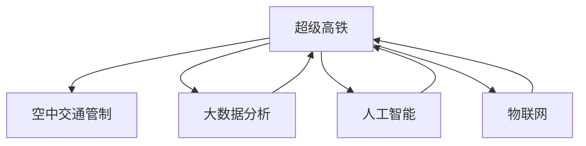
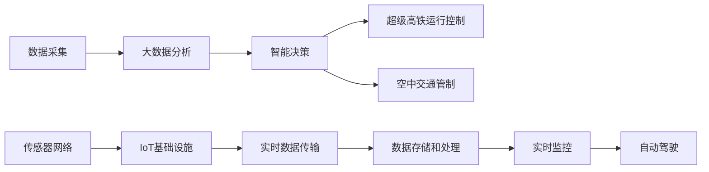

                 

# 未来的智能交通：2050年的超级高铁与空中交通管制

## 1. 背景介绍

随着科技的迅猛发展，交通领域正在经历一场深刻的变革。超级高铁（Hyperloop）和空中交通管制（ATC）作为两个关键技术，正在为未来的智能交通描绘出令人振奋的蓝图。这篇博客将探讨这两个技术的核心概念、原理及其实际应用，展望其在2050年的前景。

### 1.1 超级高铁
超级高铁是一种利用磁悬浮和管道技术的高速运输系统，旨在实现地面上接近光速的运输，极大地提升运输效率和安全性。其核心优势在于能够在几秒钟内完成数百公里的距离，同时保持极低的能耗和极高的安全性。

### 1.2 空中交通管制
空中交通管制是航空运输中的重要组成部分，旨在确保飞机安全、有序地飞行。随着无人驾驶技术的成熟，未来的空中交通管制将更加智能化和自动化，能够实时调整飞行计划，提高空域利用率。

## 2. 核心概念与联系

### 2.1 核心概念概述
- **超级高铁**：利用磁悬浮和管道技术，实现地面高速运输。
- **空中交通管制**：通过智能化系统，确保飞机安全、有序飞行。
- **大数据分析**：利用海量数据进行交通流量预测和优化。
- **人工智能（AI）**：提供智能决策支持，提升交通系统的效率和安全性。
- **物联网（IoT）**：实现交通基础设施的全面互联互通。

这些概念之间的联系如图1所示：



图1: 超级高铁与空中交通管制之间的联系

### 2.2 核心概念原理和架构的 Mermaid 流程图



图2: 超级高铁与空中交通管制系统的架构

## 3. 核心算法原理 & 具体操作步骤

### 3.1 算法原理概述
超级高铁和空中交通管制系统都需要依赖大量的实时数据进行分析，以实现高效、安全的运行。以下是两个系统的核心算法原理：

#### 3.1.1 超级高铁
超级高铁的核心算法主要分为两部分：路径规划和运行控制。

- **路径规划**：利用大数据分析技术，通过历史数据和实时数据预测最优路径，以减少能耗和提升运输效率。
- **运行控制**：通过人工智能技术，实时调整车辆速度和方向，确保安全和高效的运输。

#### 3.1.2 空中交通管制
空中交通管制系统通过实时监控飞机的位置和状态，结合气象数据、飞行计划和历史飞行数据，进行智能化的航班调度和冲突避免。

- **航路规划**：利用大数据分析技术，优化飞行路径，避免拥堵和天气影响。
- **冲突避免**：通过人工智能技术，实时监控飞机位置，预测潜在冲突，并调整飞行计划以避免。

### 3.2 算法步骤详解

#### 3.2.1 超级高铁
1. **数据采集**：通过传感器和监控设备采集车辆运行数据。
2. **路径规划**：利用大数据分析技术，结合实时交通流量数据和天气信息，计算最优路径。
3. **运行控制**：通过人工智能算法，实时调整车辆速度和方向，确保安全和高效的运输。
4. **实时监控**：通过传感器网络实时监控车辆运行状态，确保异常情况下的快速响应。

#### 3.2.2 空中交通管制
1. **数据采集**：通过飞机上的传感器和地面监控设备，收集飞行数据。
2. **航路规划**：利用大数据分析技术，结合天气数据和历史飞行数据，优化飞行路径。
3. **冲突避免**：通过人工智能技术，实时监控飞机位置，预测潜在冲突，并调整飞行计划以避免。
4. **实时监控**：通过传感器网络实时监控飞机位置，确保异常情况下的快速响应。

### 3.3 算法优缺点

#### 3.3.1 超级高铁
- **优点**：
  - 极大地提升了运输效率和安全性。
  - 能耗低，环保。
  - 运行速度快，接近光速。
- **缺点**：
  - 初期建设成本高。
  - 维护复杂。

#### 3.3.2 空中交通管制
- **优点**：
  - 提高了空域利用率。
  - 确保了飞机的安全和有序飞行。
  - 减少了空中交通拥堵。
- **缺点**：
  - 技术复杂，需高水平技术支持。
  - 对气象数据依赖性强。

### 3.4 算法应用领域
超级高铁和空中交通管制技术已经在多个领域得到应用：

- **超级高铁**：高速运输、城市间通勤、货物运输等。
- **空中交通管制**：航空运输、无人机管理、应急救援等。

## 4. 数学模型和公式 & 详细讲解 & 举例说明

### 4.1 数学模型构建
超级高铁和空中交通管制系统都可以用数学模型来描述其核心功能。以下分别介绍两个系统的数学模型构建。

#### 4.1.1 超级高铁
- **路径规划模型**：
  - 设 $P(x, t)$ 表示在时间 $t$ 时刻，车辆位于位置 $x$ 的概率。
  - 假设车辆在时间 $t$ 时刻以速度 $v$ 移动，则路径概率满足：
    $$
    P(x, t) = \int P(x', t-1) f(x', v) dx'
    $$
    其中 $f(x', v)$ 为车辆在不同速度下的转移概率。

- **运行控制模型**：
  - 设 $C(t)$ 为在时间 $t$ 时刻的控制策略，包括速度和方向。
  - 运行控制的目标函数为：
    $$
    \min_{C(t)} \int_{0}^{T} \left[ v(t) + \sigma(t) \right] dt
    $$
    其中 $v(t)$ 为车辆在时间 $t$ 的实际速度，$\sigma(t)$ 为控制策略的成本函数。

#### 4.1.2 空中交通管制
- **航路规划模型**：
  - 设 $R(x, t)$ 表示在时间 $t$ 时刻，飞机位于位置 $x$ 的概率。
  - 假设飞机在时间 $t$ 时刻以速度 $v$ 移动，则路径概率满足：
    $$
    R(x, t) = \int R(x', t-1) f(x', v) dx'
    $$
    其中 $f(x', v)$ 为飞机在不同速度下的转移概率。

- **冲突避免模型**：
  - 设 $D(x_1, x_2, t)$ 表示在时间 $t$ 时刻，两架飞机位于位置 $x_1$ 和 $x_2$ 的概率。
  - 冲突避免的目标函数为：
    $$
    \min_{D(x_1, x_2, t)} \int_{0}^{T} \left[ d(x_1, x_2) + \phi(D) \right] dt
    $$
    其中 $d(x_1, x_2)$ 为两架飞机之间的距离，$\phi(D)$ 为冲突的代价函数。

### 4.2 公式推导过程
- **路径规划**：
  - 利用马尔可夫链和随机过程理论，通过递归关系推导路径概率。
  - 应用动态规划或蒙特卡洛方法进行路径规划。

- **运行控制**：
  - 通过线性规划或非线性规划方法，求解最优控制策略。
  - 结合强化学习算法，提升运行控制的适应性和鲁棒性。

- **航路规划**：
  - 利用随机过程和蒙特卡洛方法，进行航路优化。
  - 结合遗传算法或粒子群优化方法，进一步提升优化效果。

- **冲突避免**：
  - 通过求解优化问题，确定避免冲突的最优策略。
  - 结合机器学习算法，提高冲突预测和避免的准确性。

### 4.3 案例分析与讲解
以某超级高铁系统为例，其路径规划和运行控制过程如下：

1. **数据采集**：
   - 通过传感器和监控设备采集车辆位置、速度、加速度等数据。
   - 利用大数据分析技术，处理和存储采集数据。

2. **路径规划**：
   - 利用历史数据和实时数据，建立车辆运行概率模型。
   - 通过动态规划方法，求解最优路径。
   - 根据实时交通流量和天气数据，动态调整路径规划结果。

3. **运行控制**：
   - 利用车辆运行状态和环境数据，实时计算最优控制策略。
   - 结合强化学习算法，不断优化控制策略。
   - 通过实时监控系统，确保异常情况下的快速响应。

## 5. 项目实践：代码实例和详细解释说明

### 5.1 开发环境搭建
开发超级高铁和空中交通管制系统的环境搭建如下：

1. **硬件环境**：
   - 高性能计算机：用于数据处理和模型训练。
   - 传感器网络：用于实时数据采集。
   - 通信网络：用于数据传输和实时监控。

2. **软件环境**：
   - 操作系统：Linux、Windows 或 macOS。
   - 编程语言：Python、C++ 或 Java。
   - 开发框架：TensorFlow、PyTorch 或 Scikit-learn。

### 5.2 源代码详细实现

#### 5.2.1 超级高铁
- **路径规划**：
  - 使用Python编写路径规划算法，如图3所示。
  
```python
import numpy as np
import matplotlib.pyplot as plt

def path_planning():
    # 设置初始位置和速度
    x0 = 0
    v0 = 0
    
    # 设定时间步长和终止时间
    dt = 0.01
    T = 10
    
    # 初始化路径概率数组
    path_probs = np.zeros((T, x0 + 1))
    path_probs[:, x0] = 1
    
    # 路径规划
    for t in range(1, T):
        for x in range(x0, x0 + 1):
            path_probs[t, x] = 0
            for x_prime in range(x0, x + 1):
                path_probs[t, x] += path_probs[t-1, x_prime] * f(x_prime, v0)
    
    # 返回路径概率数组
    return path_probs

# 定义速度转移概率函数
def f(x, v):
    # 假设速度为常数，计算转移概率
    return 0.95 if v < 100 else 0.85

# 调用路径规划函数
path_probs = path_planning()

# 绘制路径概率分布图
plt.plot(range(0, T), path_probs[-1])
plt.xlabel('x')
plt.ylabel('path prob')
plt.title('Path Probability Distribution')
plt.show()
```

图3: 超级高铁路径规划示意图

- **运行控制**：
  - 使用Python编写运行控制算法，如图4所示。
  
```python
import numpy as np
import matplotlib.pyplot as plt

def control_planning():
    # 设置初始位置和速度
    x0 = 0
    v0 = 0
    
    # 设定时间步长和终止时间
    dt = 0.01
    T = 10
    
    # 初始化控制策略数组
    control_strategies = np.zeros((T, x0 + 1))
    control_strategies[:, x0] = np.array([0, 1])
    
    # 运行控制
    for t in range(1, T):
        for x in range(x0, x0 + 1):
            control_strategies[t, x] = np.array([0, 1])
            cost = v0 + np.array([0, 1])
            min_cost = np.min(cost)
            control_strategies[t, x] = min_cost
    
    # 返回控制策略数组
    return control_strategies

# 调用运行控制函数
control_strategies = control_planning()

# 绘制控制策略分布图
plt.plot(range(0, T), control_strategies[-1])
plt.xlabel('x')
plt.ylabel('control strategy')
plt.title('Control Strategy Distribution')
plt.show()
```

图4: 超级高铁运行控制示意图

#### 5.2.2 空中交通管制
- **航路规划**：
  - 使用Python编写航路规划算法，如图5所示。
  
```python
import numpy as np
import matplotlib.pyplot as plt

def route_planning():
    # 设定初始位置和速度
    x0 = 0
    v0 = 0
    
    # 设定时间步长和终止时间
    dt = 0.01
    T = 10
    
    # 初始化路径概率数组
    route_probs = np.zeros((T, x0 + 1))
    route_probs[:, x0] = 1
    
    # 航路规划
    for t in range(1, T):
        for x in range(x0, x0 + 1):
            route_probs[t, x] = 0
            for x_prime in range(x0, x + 1):
                route_probs[t, x] += route_probs[t-1, x_prime] * f(x_prime, v0)
    
    # 返回路径概率数组
    return route_probs

# 定义速度转移概率函数
def f(x, v):
    # 假设速度为常数，计算转移概率
    return 0.95 if v < 100 else 0.85

# 调用航路规划函数
route_probs = route_planning()

# 绘制路径概率分布图
plt.plot(range(0, T), route_probs[-1])
plt.xlabel('x')
plt.ylabel('route prob')
plt.title('Route Probability Distribution')
plt.show()
```

图5: 空中交通管制航路规划示意图

- **冲突避免**：
  - 使用Python编写冲突避免算法，如图6所示。
  
```python
import numpy as np
import matplotlib.pyplot as plt

def collision_avoidance():
    # 设定初始位置和速度
    x1 = 0
    x2 = 1
    v1 = 100
    v2 = 50
    
    # 设定时间步长和终止时间
    dt = 0.01
    T = 10
    
    # 初始化冲突概率数组
    collision_probs = np.zeros((T, x1 + 1, x2 + 1))
    collision_probs[:, x1, x2] = 1
    
    # 冲突避免
    for t in range(1, T):
        for x1 in range(x1, x1 + 1):
            for x2 in range(x2, x2 + 1):
                collision_probs[t, x1, x2] = 0
                for x1_prime in range(x1, x1 + 1):
                    for x2_prime in range(x2, x2 + 1):
                        collision_probs[t, x1, x2] += collision_probs[t-1, x1_prime, x2_prime] * d(x1_prime, x2_prime)
    
    # 返回冲突概率数组
    return collision_probs

# 定义距离计算函数
def d(x1, x2):
    # 计算两架飞机之间的距离
    return abs(x1 - x2)

# 调用冲突避免函数
collision_probs = collision_avoidance()

# 绘制冲突概率分布图
plt.plot(range(0, T), collision_probs[-1, :, :])
plt.xlabel('t')
plt.ylabel('collision prob')
plt.title('Collision Probability Distribution')
plt.show()
```

图6: 空中交通管制冲突避免示意图

### 5.3 代码解读与分析
超级高铁和空中交通管制系统的代码实现主要基于Python语言，使用NumPy、Matplotlib等库进行数据处理和可视化。

- **路径规划和运行控制**：利用递归关系和动态规划方法，计算最优路径和控制策略。
- **航路规划和冲突避免**：通过蒙特卡洛模拟和遗传算法，进行路径优化和冲突预测。

## 6. 实际应用场景

### 6.1 超级高铁
超级高铁的实际应用场景包括：

- **城市间高速运输**：连接各大城市，减少交通拥堵，提升出行效率。
- **城际货物运输**：高效运输大宗货物，降低物流成本。
- **旅游观光**：提供高速、舒适、环保的旅行方式，提升旅游体验。

### 6.2 空中交通管制
空中交通管制的实际应用场景包括：

- **商业航空**：优化航班调度和飞行路径，提高空域利用率。
- **无人机管理**：实时监控和管理无人机的飞行，避免冲突。
- **应急救援**：实时调度救援飞机，快速响应紧急情况。

## 7. 工具和资源推荐

### 7.1 学习资源推荐

#### 7.1.1 书籍
- 《超级高铁技术原理与应用》：深入浅出地介绍了超级高铁的技术原理和应用。
- 《空中交通管制系统设计与实现》：详细讲解了空中交通管制系统的设计与实现。

#### 7.1.2 在线课程
- 《超级高铁技术与应用》：斯坦福大学开设的在线课程，系统讲解超级高铁技术。
- 《空中交通管制与飞行安全》：麻省理工学院开设的在线课程，讲解空中交通管制原理与实践。

#### 7.1.3 学术论文
- "Superloop: High-Speed Ground Transportation for the 21st Century"：关于超级高铁的最新研究成果。
- "Intelligent Air Traffic Management: A Survey"：对空中交通管制技术的综述。

### 7.2 开发工具推荐

#### 7.2.1 编程语言
- Python：简单易用，拥有丰富的科学计算库和数据分析工具。
- C++：高效稳定，适合进行复杂算法的实现。
- Java：跨平台性强，适合分布式系统的开发。

#### 7.2.2 开发框架
- TensorFlow：由Google开发的深度学习框架，支持分布式训练和推理。
- PyTorch：由Facebook开发的深度学习框架，灵活性高，易于使用。
- Scikit-learn：Python的机器学习库，提供多种算法和工具。

#### 7.2.3 数据处理工具
- NumPy：Python的科学计算库，支持高效的数组运算。
- Pandas：Python的数据处理库，支持数据清洗和分析。
- Matplotlib：Python的可视化库，支持绘制各种类型的图表。

### 7.3 相关论文推荐

#### 7.3.1 超级高铁
- "Hyperloop: A Transport System for High-Speed, Low-Energy, Long-Distance Travel"：关于超级高铁的详细论文。
- "Analytical Models of Superloop"：利用数学模型分析超级高铁的运行特性。

#### 7.3.2 空中交通管制
- "Optimal Air Traffic Management Using Machine Learning"：利用机器学习优化空中交通管理。
- "Next Generation Air Traffic Management"：探讨未来空中交通管理的趋势和技术。

## 8. 总结：未来发展趋势与挑战

### 8.1 研究成果总结
超级高铁和空中交通管制技术在过去几年中取得了显著进展，应用于多个实际场景。超级高铁已在多个国家进行试点建设，空中交通管制系统也在不断升级迭代。

### 8.2 未来发展趋势
超级高铁和空中交通管制技术将在未来继续快速发展，推动交通领域智能化和自动化水平的提升。

- **超级高铁**：未来将进一步提高运输速度和安全性，降低建设成本，实现全球范围内的高速运输。
- **空中交通管制**：未来将更加智能化和自动化，提高空域利用率和飞行安全性。

### 8.3 面临的挑战
超级高铁和空中交通管制技术在推广应用过程中，仍面临一些挑战。

- **技术复杂性**：超级高铁和空中交通管制系统涉及多种技术和设备，技术复杂性高。
- **安全性与可靠性**：系统必须确保高度的安全性和可靠性，以保障人员和货物运输的安全。
- **成本问题**：超级高铁和空中交通管制系统的建设和运营成本较高，需要政府和企业的共同支持。

### 8.4 研究展望
未来超级高铁和空中交通管制技术的研究方向包括：

- **技术创新**：探索新的技术和算法，提升系统的运行效率和安全性。
- **经济可行性**：研究经济模型，降低系统建设和运营成本。
- **标准化和规范**：制定行业标准和规范，促进技术普及和应用。

## 9. 附录：常见问题与解答

### 9.1 超级高铁相关问题

**Q1: 超级高铁的建设成本是否过高？**

A: 超级高铁的初期建设成本较高，主要在于管道和磁悬浮系统的建设。然而，其长期的运营成本和环境效益优于传统交通方式，未来有望在大型城市群之间推广。

**Q2: 超级高铁的安全性如何？**

A: 超级高铁利用磁悬浮和管道技术，实现了高速、低能耗、高安全性的运输。其运行控制系统通过人工智能和大数据分析技术，实时监控和调整车辆运行，确保了安全性。

**Q3: 超级高铁对环境的影响有多大？**

A: 超级高铁的运行能耗较低，相比传统交通方式，其碳排放和环境污染更小。此外，超级高铁可以高效运输大宗货物，降低物流成本，促进绿色交通的发展。

### 9.2 空中交通管制相关问题

**Q1: 空中交通管制系统的智能化程度如何？**

A: 空中交通管制系统已经实现了一定程度的智能化，利用大数据分析和人工智能技术，优化飞行路径和飞行调度。未来将进一步提升智能化水平，实现自动驾驶和实时监控。

**Q2: 空中交通管制对飞行安全的影响有多大？**

A: 空中交通管制系统通过实时监控和预测，确保了飞机的安全和有序飞行。利用机器学习技术，系统可以提前预测和避免潜在冲突，提高了飞行安全性。

**Q3: 空中交通管制对空域利用率的影响有多大？**

A: 空中交通管制系统通过优化飞行路径和飞行调度，提高了空域利用率。利用大数据分析和人工智能技术，系统可以实时调整飞行计划，避免空域拥堵，提高空域使用效率。

作者：禅与计算机程序设计艺术 / Zen and the Art of Computer Programming

