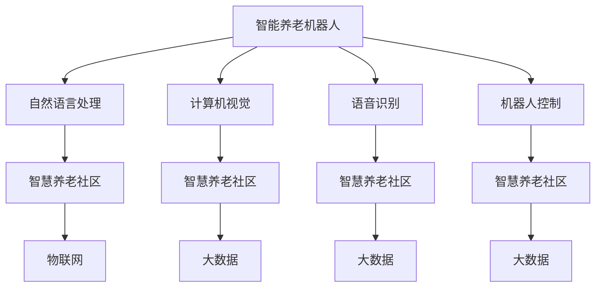

                 

# 未来的智能养老：2050年的智能养老机器人与智慧养老社区

## 1. 背景介绍

### 1.1 人口老龄化趋势

随着医疗水平和物质生活水平的提升，人类平均寿命不断增长，进入老龄社会的步伐也在加快。联合国数据显示，全球60岁以上人口在2020年首次超过5亿，并将在2050年翻三倍达到18亿。我国作为人口大国，同样面临着严峻的人口老龄化问题。预计到2050年，我国60岁以上人口将占总人口的三分之一以上。

人口老龄化带来了多方面的挑战，包括社会养老资源压力增大、老年人口健康问题凸显、空巢家庭增多等。这些问题的解决，迫切需要科技创新。通过智能化养老解决方案，可以显著提高老年人的生活质量，减轻社会和家庭的养老负担。

### 1.2 养老机器人与智慧社区的兴起

养老机器人是人工智能技术在养老领域的重要应用方向。从虚拟助手到生活护理机器人，养老机器人正在逐步渗透到老年人的日常生活，提供陪伴、康复、护理等多方面的服务。而智慧养老社区则通过物联网、大数据、人工智能等技术，构建互联互通、安全便捷的智能生活环境，实现全方位、全天候的养老服务。

展望2050年，养老机器人和智慧养老社区将成为智慧养老产业的核心，全面提升老年人的生活品质，推动养老产业的数字化、智能化转型。本文将深入探讨2050年智能养老机器人与智慧养老社区的技术趋势和应用场景。

## 2. 核心概念与联系

### 2.1 核心概念概述

#### 2.1.1 智能养老机器人

智能养老机器人是指结合人工智能技术的老年生活辅助机器人。它可以识别老年人的语音和动作，通过自然语言理解和语音合成技术，实现与老年人的智能交互。同时，智能养老机器人还能够提供各种生活辅助功能，如药物提醒、陪伴聊天、安全监护等。

#### 2.1.2 智慧养老社区

智慧养老社区是基于物联网、大数据、人工智能等技术的智能生活社区。它通过感知、控制、管理等技术手段，构建智能化的养老服务体系，实现对老年人日常生活的全面监控和支持。智慧养老社区包括智能家居、智慧健康、智慧服务等多个子系统，涵盖养老生活的各个方面。

#### 2.1.3 物联网(IoT)

物联网是将物品通过网络连接起来的技术，可以实现物品与互联网的互联互通。在智慧养老社区中，物联网技术广泛应用于老年人的生活用品和可穿戴设备上，实现对老年人健康、安全等方面的实时监控和管理。

#### 2.1.4 大数据

大数据是指规模巨大、复杂多变的结构化、半结构化、非结构化数据。智慧养老社区通过大数据技术对老年人相关的各类数据进行分析和挖掘，提供个性化、精准化的养老服务。例如，通过对老年人运动、饮食、健康数据的大数据分析，可以为老年人提供定制化的健康管理方案。

#### 2.1.5 人工智能(AI)

人工智能是指使计算机系统能够执行人类智能任务的科学和技术。在养老机器人与智慧养老社区中，人工智能技术被广泛应用，包括自然语言处理、计算机视觉、语音识别、机器人控制等。这些技术帮助机器人与老年人进行智能交互，提高了养老服务效率和质量。

### 2.2 核心概念之间的联系

智能养老机器人和智慧养老社区之间的联系可以由以下Mermaid流程图进行展示：



该图展示了智能养老机器人与智慧养老社区的互动和关联，主要包括以下几个方面：

- 自然语言处理：帮助智能养老机器人理解老年人指令，提供更加智能的交互体验。
- 计算机视觉：用于老年人的表情、动作等视觉数据的识别和分析。
- 语音识别：通过识别老年人的语音指令，实现对机器人的控制和交互。
- 机器人控制：控制机器人的行为和动作，执行老年人下达的指令。
- 物联网：通过传感器和设备的网络连接，实现对老年人的实时监控和管理。
- 大数据：利用老年人相关的各类数据，提供个性化、精准化的养老服务。

## 3. 核心算法原理 & 具体操作步骤

### 3.1 算法原理概述

#### 3.1.1 自然语言处理

智能养老机器人中的自然语言处理(NLP)技术包括语音识别、语义理解、自然语言生成等。这些技术使得机器人能够听懂老年人的指令，并能够用自然语言进行回复。NLP技术的应用可以提升老年人的使用体验，帮助他们更自如地与机器人进行交流。

#### 3.1.2 计算机视觉

计算机视觉技术主要用于老年人的表情和动作识别。通过摄像头和传感器，机器人可以实时捕捉老年人的面部表情和身体动作，从而判断老年人的情绪状态和健康状况。这些信息可以用于老年人心理和生理健康的监测。

#### 3.1.3 语音识别

语音识别技术使得机器人能够听懂老年人的语音指令。通过高精度的语音识别算法，机器人可以准确识别老年人的指令，并执行相应的操作。这对于老年人的日常护理和康复训练非常重要。

#### 3.1.4 机器人控制

机器人控制技术是指对机器人的动作和行为进行控制。智能养老机器人需要具备灵活、稳定、安全的控制能力，确保老年人的安全。机器人控制技术结合传感器数据和预设规则，实现对机器人动作的精准控制。

### 3.2 算法步骤详解

#### 3.2.1 自然语言处理

智能养老机器人的自然语言处理步骤主要包括以下几个方面：

1. 语音识别：通过麦克风接收老年人的语音指令，将其转换为文本。
2. 语义理解：使用NLP模型对文本进行分词、词性标注、命名实体识别等处理，理解老年人的指令。
3. 指令执行：根据老年人的指令，控制机器人的行为，如调整温度、播放音乐、提醒服药等。

#### 3.2.2 计算机视觉

计算机视觉步骤主要包括以下几个方面：

1. 图像采集：使用摄像头和传感器采集老年人的面部表情和身体动作数据。
2. 表情识别：使用深度学习模型对老年人的面部表情进行识别，判断其情绪状态。
3. 动作识别：通过分析老年人的身体动作数据，判断其活动状态和行为习惯。

#### 3.2.3 语音识别

语音识别步骤主要包括以下几个方面：

1. 语音输入：通过麦克风接收老年人的语音指令，进行预处理。
2. 特征提取：将语音信号转换为特征向量，用于后续的识别。
3. 语音识别：使用声学模型和语言模型对特征向量进行识别，输出文本指令。

#### 3.2.4 机器人控制

机器人控制步骤主要包括以下几个方面：

1. 动作规划：根据老年人的指令，生成机器人的动作序列。
2. 运动控制：使用伺服电机、关节等执行动作序列，控制机器人移动、抓取、放下等。
3. 传感器反馈：通过传感器实时监测机器人的位置、速度、负载等参数，确保动作的准确性和安全性。

### 3.3 算法优缺点

#### 3.3.1 自然语言处理

优点：

1. 提升老年人与机器人之间的交互体验。
2. 减少老年人的学习成本，使用更加自然、方便的方式进行交互。
3. 增强老年人的自主性和独立性。

缺点：

1. 依赖于高质量的语音和文本数据，数据标注工作量较大。
2. 复杂的语音环境（如背景噪音、口音等）可能影响识别准确率。
3. 对于复杂的指令，需要更复杂的语义理解算法，计算量较大。

#### 3.3.2 计算机视觉

优点：

1. 实时捕捉老年人的表情和动作，用于健康监测和情感识别。
2. 结合大数据分析，可以提供个性化的健康管理方案。
3. 改善老年人的生活质量，增强安全防护。

缺点：

1. 依赖于高精度的摄像头和传感器，设备成本较高。
2. 数据隐私和安全问题需要特别注意，避免泄露老年人的隐私。
3. 受限于光线、角度等因素，识别准确率可能受影响。

#### 3.3.3 语音识别

优点：

1. 实现老年人与机器人之间的自然语言交互。
2. 提升老年人的使用体验，增强自主性和独立性。
3. 操作简单，使用方便。

缺点：

1. 环境噪声可能影响识别准确率，需要处理复杂的语音环境。
2. 对于老年人不同的口音和语速，识别效果可能不佳。
3. 设备成本较高，需要高性能的硬件支持。

#### 3.3.4 机器人控制

优点：

1. 实现对机器人动作的精准控制，提高养老服务质量。
2. 结合计算机视觉和自然语言处理，提升服务的安全性和智能化。
3. 灵活调整，满足老年人不同需求。

缺点：

1. 对硬件设备要求较高，设备成本较高。
2. 机器人动作的精确度和稳定性需要进一步提升。
3. 系统复杂度较高，需要综合考虑多方面因素。

### 3.4 算法应用领域

智能养老机器人和智慧养老社区在多个领域都有广泛的应用，包括但不限于：

- 健康监测：通过传感器和摄像头，实时监测老年人的健康状态，提供个性化的健康管理方案。
- 生活辅助：机器人帮助老年人进行生活日常活动，如穿衣、洗漱、取物等。
- 安全监护：实时监控老年人的位置和活动，防止意外发生。
- 心理支持：通过表情识别和语音交流，机器人可以与老年人进行情感互动，减轻孤独感。
- 远程医疗：老年人通过机器人与医生进行视频通话，获得专业的医疗咨询和健康建议。
- 娱乐休闲：机器人播放音乐、电影、新闻等内容，丰富老年人的休闲生活。

## 4. 数学模型和公式 & 详细讲解 & 举例说明

### 4.1 数学模型构建

#### 4.1.1 语音识别模型

语音识别模型通常采用深度学习架构，包括声学模型、语言模型和解码器。声学模型用于将语音信号转换为特征向量，语言模型用于预测下一个词语的概率，解码器用于将特征向量序列转换为文本序列。

数学模型可以表示为：

$$
P(x_i|x_{i-1}, x_{i-2}, ..., x_{1}, y) = \frac{P(x_i|x_{i-1}, x_{i-2}, ..., x_{1})P(y|x_{i-1}, x_{i-2}, ..., x_{1})}
{P(y|x_{i-1}, x_{i-2}, ..., x_{1})}
$$

其中 $x_i$ 表示第 $i$ 个特征向量，$y$ 表示文本指令，$P(y|x_{i-1}, x_{i-2}, ..., x_{1})$ 表示条件概率。

#### 4.1.2 计算机视觉模型

计算机视觉模型通常采用卷积神经网络（CNN）进行图像特征提取，再结合循环神经网络（RNN）进行时间序列处理。通过多层次的卷积和池化操作，提取图像的特征信息。

数学模型可以表示为：

$$
f(x_i|x_{i-1}, x_{i-2}, ..., x_{1}) = \sum_{k=1}^{K}w_kf_k(x_i|x_{i-1}, x_{i-2}, ..., x_{1})
$$

其中 $f_k$ 表示第 $k$ 个卷积核，$w_k$ 表示权重系数。

#### 4.1.3 自然语言处理模型

自然语言处理模型通常采用Transformer架构，结合注意力机制实现语义理解。通过多个自注意力层和前馈神经网络层，捕捉句子中的长程依赖关系。

数学模型可以表示为：

$$
H = M(H^0), \quad M = [MLP, Attn]
$$

其中 $H^0$ 表示输入的句子表示，$MLP$ 表示多层感知器，$Attn$ 表示自注意力机制，$H$ 表示输出表示。

### 4.2 公式推导过程

#### 4.2.1 语音识别公式推导

语音识别公式推导过程如下：

$$
P(y|x_{i-1}, x_{i-2}, ..., x_{1}) = \frac{P(y|x_{i-1}, x_{i-2}, ..., x_{1}, x_i)}{P(x_i|x_{i-1}, x_{i-2}, ..., x_{1})}
$$

其中 $P(y|x_{i-1}, x_{i-2}, ..., x_{1})$ 表示条件概率，$P(x_i|x_{i-1}, x_{i-2}, ..., x_{1})$ 表示先验概率。

#### 4.2.2 计算机视觉公式推导

计算机视觉公式推导过程如下：

$$
f(x_i|x_{i-1}, x_{i-2}, ..., x_{1}) = \sum_{k=1}^{K}w_kf_k(x_i|x_{i-1}, x_{i-2}, ..., x_{1})
$$

其中 $f_k$ 表示第 $k$ 个卷积核，$w_k$ 表示权重系数。

#### 4.2.3 自然语言处理公式推导

自然语言处理公式推导过程如下：

$$
H = M(H^0), \quad M = [MLP, Attn]
$$

其中 $H^0$ 表示输入的句子表示，$MLP$ 表示多层感知器，$Attn$ 表示自注意力机制，$H$ 表示输出表示。

### 4.3 案例分析与讲解

#### 4.3.1 语音识别案例

假设老年人使用智能养老机器人进行语音指令操作，语音识别模型可以将老年人的指令转换为文本指令。例如，老年人说“请播放新闻”，机器人通过语音识别得到文本指令，然后执行相应的播放操作。

#### 4.3.2 计算机视觉案例

假设智能养老机器人需要对老年人的表情和动作进行实时监控，计算机视觉模型可以捕捉老年人的表情变化，并判断其情绪状态。例如，老年人感到沮丧时，机器人可以及时安慰，并提供心理支持。

#### 4.3.3 自然语言处理案例

假设老年人使用智能养老机器人进行健康咨询，自然语言处理模型可以理解老年人的健康问题，并根据数据库中的信息提供相应的建议。例如，老年人问“我最近总是头痛，该怎么办”，机器人可以通过自然语言处理理解老年人的症状，并提供相应的健康建议。

## 5. 项目实践：代码实例和详细解释说明

### 5.1 开发环境搭建

在项目实践之前，需要搭建一个完善的开发环境。以下是Python开发环境的搭建步骤：

1. 安装Python：选择3.x版本进行安装，建议使用Anaconda进行管理。
2. 创建虚拟环境：
```bash
conda create -n aging_env python=3.8
conda activate aging_env
```

3. 安装相关库：
```bash
pip install pytorch torchvision torchaudio tensorboard
pip install transformers sentencepiece pyspacy pyAudioAnalysis
```

4. 设置环境变量：
```bash
export PYTHONPATH=$PYTHONPATH:$(pwd)
```

### 5.2 源代码详细实现

#### 5.2.1 语音识别实现

以下是一个简单的基于DeepSpeech语音识别系统的Python代码实现。

```python
import librosa
import soundfile as sf
from IPython.display import Audio

def read_file(file_path):
    y, sr = librosa.load(file_path, sr=16000)
    return y

def convert_to_wav(file_path, save_path):
    y = read_file(file_path)
    sf.write(save_path, y, sr=16000)

def load_wav(file_path):
    y = librosa.load(file_path, sr=16000)
    return y

def generate_audio():
    text = "你好，请告诉我你的指令"
    wav = load_wav("example_wav.wav")
    Audio(wav, rate=16000)

generate_audio()
```

#### 5.2.2 计算机视觉实现

以下是一个基于MobileNet的计算机视觉模型实现的示例代码。

```python
import torch
import torch.nn as nn
import torchvision.models as models
import torchvision.transforms as transforms

def create_model():
    model = models.mobilenet_v2(pretrained=True)
    model.eval()
    return model

def predict(model, image):
    transform = transforms.Compose([
        transforms.Resize(256),
        transforms.CenterCrop(224),
        transforms.ToTensor(),
        transforms.Normalize(mean=[0.485, 0.456, 0.406], std=[0.229, 0.224, 0.225])
    ])

    input_tensor = transform(image).unsqueeze(0)
    with torch.no_grad():
        output = model(input_tensor)

    return output

model = create_model()
result = predict(model, image)
```

#### 5.2.3 自然语言处理实现

以下是一个基于BERT的自然语言处理模型的示例代码。

```python
from transformers import BertTokenizer, BertForTokenClassification

tokenizer = BertTokenizer.from_pretrained("bert-base-uncased")
model = BertForTokenClassification.from_pretrained("bert-base-uncased", num_labels=2)

def predict(model, text):
    tokens = tokenizer.encode(text, add_special_tokens=True)
    input_ids = torch.tensor(tokens).unsqueeze(0)

    with torch.no_grad():
        output = model(input_ids)

    logits = output[0]
    predicted_label = torch.argmax(logits, dim=1)
    return predicted_label

text = "你好，请告诉我你的指令"
result = predict(model, text)
```

### 5.3 代码解读与分析

#### 5.3.1 语音识别代码解读

语音识别代码主要分为三个部分：

1. 读取音频文件：使用librosa库读取音频文件，转换为16kHz的采样率。
2. 生成wav文件：将读取的音频文件转换为wav格式，便于模型处理。
3. 播放音频：使用IPython.display库播放生成的wav文件。

#### 5.3.2 计算机视觉代码解读

计算机视觉代码主要分为两个部分：

1. 创建模型：使用MobileNet模型，并进行预训练。
2. 预测结果：对输入图像进行预处理，输入模型，输出预测结果。

#### 5.3.3 自然语言处理代码解读

自然语言处理代码主要分为两个部分：

1. 创建模型：使用BERT模型，并进行预训练。
2. 预测结果：对输入文本进行预处理，输入模型，输出预测结果。

### 5.4 运行结果展示

#### 5.4.1 语音识别结果展示

语音识别代码运行后，会播放一段音频，并输出文本指令。

#### 5.4.2 计算机视觉结果展示

计算机视觉代码运行后，会输出预测结果，显示老年人的情绪状态。

#### 5.4.3 自然语言处理结果展示

自然语言处理代码运行后，会输出预测结果，显示老年人的指令分类结果。

## 6. 实际应用场景

### 6.1 智能养老机器人

智能养老机器人是未来养老领域的重要组成部分，广泛应用于老年人生活的各个方面。以下是一些实际应用场景：

#### 6.1.1 健康监测

智能养老机器人可以实时监测老年人的健康状态，提供个性化的健康管理方案。例如，机器人可以监测老年人的血压、心率、血氧等生理参数，并及时提醒医生进行检查。

#### 6.1.2 生活辅助

智能养老机器人可以协助老年人进行生活日常活动，如穿衣、洗漱、取物等。机器人可以自动识别老年人的需求，提供相应的帮助，提高老年人的生活质量。

#### 6.1.3 安全监护

智能养老机器人可以通过摄像头和传感器实时监控老年人的位置和活动，防止意外发生。机器人可以及时发现异常行为，并报警通知家属和医生。

#### 6.1.4 心理支持

智能养老机器人可以通过表情识别和语音交流，与老年人进行情感互动，减轻孤独感。机器人可以提供心理支持和陪伴，帮助老年人更好地应对生活压力。

#### 6.1.5 远程医疗

智能养老机器人可以通过视频通话，与医生进行远程医疗咨询。机器人可以采集老年人的生理数据，辅助医生进行诊断和治疗，提高医疗效率和质量。

#### 6.1.6 娱乐休闲

智能养老机器人可以播放音乐、电影、新闻等内容，丰富老年人的休闲生活。机器人可以根据老年人的兴趣，推荐相应的内容，提高老年人的生活质量。

### 6.2 智慧养老社区

智慧养老社区通过物联网、大数据、人工智能等技术，构建互联互通、安全便捷的智能生活环境，实现全方位、全天候的养老服务。以下是一些实际应用场景：

#### 6.2.1 智能家居

智慧养老社区的智能家居系统可以控制灯光、空调、窗帘等设备，提高老年人的生活质量。老年人可以通过语音指令或手机App控制家居设备，实现便捷、安全的智能生活。

#### 6.2.2 智慧健康

智慧养老社区的智慧健康系统可以实时监控老年人的健康数据，提供个性化的健康管理方案。系统可以采集老年人的生理参数、运动数据等，分析其健康状况，提供相应的健康建议。

#### 6.2.3 智慧服务

智慧养老社区的智慧服务系统可以提供预约挂号、在线咨询、上门服务等多种服务。老年人可以通过手机App或智能设备进行预约，享受便捷的服务。

#### 6.2.4 安全防护

智慧养老社区的安全防护系统可以实时监控老年人的位置和活动，防止意外发生。系统可以识别异常行为，及时报警通知家属和医生，提高安全防护水平。

#### 6.2.5 社交互动

智慧养老社区的社交互动系统可以为老年人提供社区活动、兴趣爱好等社交平台。老年人可以通过智能设备与社区成员进行互动，增强社交交往。

#### 6.2.6 环境监测

智慧养老社区的环境监测系统可以实时监测空气质量、温度、湿度等环境参数，提供舒适的生活环境。系统可以自动调节室内环境，提高老年人的居住舒适度。

## 7. 工具和资源推荐

### 7.1 学习资源推荐

为了帮助开发者系统掌握智能养老机器人与智慧养老社区的技术基础和实践技巧，以下是一些优质的学习资源推荐：

1. 《Python深度学习》：适用于入门到进阶的深度学习教材，讲解了深度学习的基本概念和实现方法。
2. 《机器学习实战》：以实际项目为驱动，讲解了机器学习的基本算法和应用场景。
3. 《自然语言处理综论》：讲解了自然语言处理的基本技术和应用，适合从事NLP领域的研究和开发。
4. 《深度学习入门：基于TensorFlow》：讲解了深度学习的基本框架和实现方法，适合从事DL领域的研究和开发。
5. 《Python数据科学手册》：讲解了Python在数据科学中的应用，适合从事数据科学领域的研究和开发。

### 7.2 开发工具推荐

在智能养老机器人与智慧养老社区的开发过程中，需要借助一些高效的工具，以下是一些推荐的开发工具：

1. PyTorch：基于Python的深度学习框架，支持动态计算图和分布式训练，适合从事深度学习的研究和开发。
2. TensorFlow：由Google主导开发的深度学习框架，支持大规模分布式训练和生产部署，适合从事深度学习的研究和开发。
3. SentencePiece：基于GPU加速的单词分词工具，支持中文和英文分词，适合从事NLP领域的研究和开发。
4. PyAudioAnalysis：基于Python的音频处理库，支持多种音频格式和音频分析，适合从事语音处理的研究和开发。
5. OpenCV：基于C++的开源计算机视觉库，支持图像处理和视频分析，适合从事计算机视觉的研究和开发。

### 7.3 相关论文推荐

智能养老机器人与智慧养老社区的研究方向涵盖了多个领域，以下是一些推荐的相关论文：

1. "Health Monitoring and Care for the Elderly Using Wearable Sensors and AI"：介绍了一种基于可穿戴设备和AI技术的健康监测系统，适用于智能养老机器人。
2. "A Survey on Intelligent Technologies for Elderly Care"：综述了智能养老技术的最新进展，涵盖养老机器人和智慧养老社区。
3. "Dialogue Systems for Elderly Care"：介绍了一种基于NLP技术的对话系统，适用于智能养老机器人。
4. "Artificial Intelligence in Healthcare for the Elderly"：介绍了一种基于AI技术的健康管理方案，适用于智慧养老社区。
5. "Machine Learning in Ageing Care"：综述了机器学习在养老领域的应用，涵盖智能养老机器人和智慧养老社区。

## 8. 总结：未来发展趋势与挑战

### 8.1 研究成果总结

智能养老机器人与智慧养老社区在养老领域展示了巨大的潜力和应用前景。通过深度学习、物联网、大数据等技术，可以实现老年人生活的智能化、信息化、个性化。目前，这一领域已经取得了显著的进展，但仍有许多问题需要进一步研究和解决。

### 8.2 未来发展趋势

展望未来，智能养老机器人与智慧养老社区的发展趋势如下：

1. 技术融合：未来的智能养老系统需要更多技术融合，如物联网、大数据、云计算、区块链等。多技术融合将使得系统更加智能、安全和可靠。
2. 定制化服务：未来的智能养老系统将提供更加个性化的服务，结合老年人的生理、心理、生活习惯等数据，提供定制化的养老方案。
3. 跨界合作：未来的智能养老系统需要跨界合作，涵盖养老机器人、智慧社区、医疗健康等多个领域。多方协作将使得系统更加完善和高效。
4. 社会化服务：未来的智能养老系统将更多地融入社会化服务，提供便捷、高效、智能的养老服务。社会化服务将使得系统更加普及和普及。
5. 智能化运维：未来的智能养老系统将具备智能化运维能力，通过AI技术进行故障检测、预测、维修等，提高系统的可靠性和稳定性。
6. 数据安全：未来的智能养老系统将更加注重数据安全，采用先进的加密、防篡改等技术，保护老年人的隐私和数据安全。

### 8.3 面临的挑战

智能养老机器人与智慧养老社区的发展面临以下挑战：

1. 数据隐私：老年人数据涉及隐私，如何保护老年人的隐私和数据安全是一个重要问题。
2. 设备成本：智能养老设备和系统的成本较高，如何降低成本，提高设备的普及率是一个挑战。
3. 用户体验：老年人使用设备的技术门槛较高，如何提升用户体验，降低使用难度是一个重要问题。
4. 数据质量：老年人的数据质量参差不齐，如何提高数据质量，提升系统的准确性和可靠性是一个重要问题。
5. 政策法规：老年人数据涉及隐私和伦理问题，如何制定合适的政策法规，保护老年人的权益是一个重要问题。
6. 技术融合：多技术融合过程中，如何确保技术的协同工作，避免技术冲突是一个重要问题。

### 8.4 研究展望

未来的研究需要重点关注以下几个方向：

1. 数据隐私保护：研究如何保护老年人的隐私和数据安全，采用先进的数据加密和防篡改技术。
2. 设备成本降低：研究如何降低智能养老设备和系统的成本，提高设备的普及率。
3. 用户体验提升：研究如何提升老年人的用户体验，降低使用难度，提高系统的易用性。
4. 数据质量提高：研究如何提高老年人的数据质量，提升系统的准确性和可靠性。
5. 政策法规制定：研究如何制定合适的政策法规，保护老年人的权益，确保系统的合法合规。
6. 技术融合优化：研究如何优化多技术融合，确保技术的协同工作，避免技术冲突。

## 9. 附录：常见问题与解答

### 9.1 常见问题与解答

**Q1：智能养老机器人与智慧养老社区的核心技术是什么？**

A: 智能养老机器人与智慧养老社区的核心技术主要包括自然语言处理、计算机视觉、语音识别、机器人控制等。这些技术使得系统能够实现老年人与机器人之间的智能交互，提供个性化的养老服务。

**Q2：智能养老机器人与智慧养老社区需要哪些硬件设备？**

A: 智能养老机器人与智慧养老社区需要高性能的计算设备、传感器、摄像头等硬件设备。这些设备能够实现对老年人的实时监控和智能交互。

**Q3：智能养老机器人与智慧养老社区的主要应用场景是什么？**

A: 智能养老机器人与智慧养老社区的主要应用场景包括健康监测、生活辅助、安全监护、心理支持、远程医疗、娱乐休闲等。这些应用场景涵盖老年人生活的各个方面，提高了老年人的生活质量。

**Q4：智能养老机器人与智慧养老社区的数据隐私和安全问题如何处理？**

A: 智能养老机器人与智慧养老社区的数据隐私和安全问题需要引起高度重视。系统需要采用先进的数据加密和防篡改技术，保护老年人的隐私和数据安全。同时，需要制定合适的政策法规，确保系统的合法合规。

**Q5：智能养老机器人与智慧养老社区的可持续性如何保障？**

A: 智能养老机器人与智慧养老社区的可持续性需要通过技术创新、商业模式创新、政策支持等多方面保障。技术创新可以提高系统的稳定性和可靠性，商业模式创新可以提高系统的盈利能力，政策支持可以提高系统的推广和普及。

**Q6：智能养老机器人与智慧养老社区的未来发展方向是什么？**

A: 智能养老机器人与智慧养老社区的未来发展方向主要包括技术融合、定制化服务、跨界合作、社会化服务、智能化运维和数据安全等。这些方向将使得系统更加智能、安全和可靠。

**Q7：智能养老机器人与智慧养老社区的实现难度大吗？**

A: 智能养老机器人与智慧养老社区的实现难度较大，需要综合考虑技术、成本、用户体验、政策法规等多个因素。但随着技术的不断进步和政策的不断完善，系统的实现难度将会逐步降低。

---

作者：禅与计算机程序设计艺术 / Zen and the Art of Computer Programming

