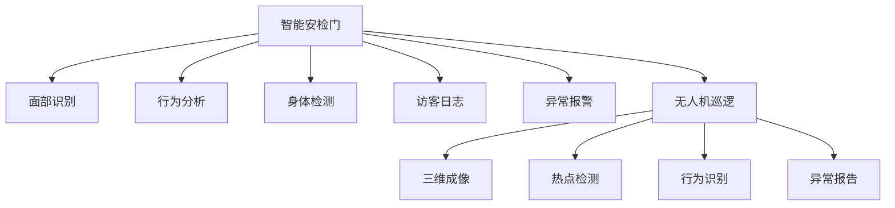

                 

# 未来的智能安防：2050年的智能安检门与无人机巡逻

> 关键词：人工智能,智能安检门,无人机巡逻,深度学习,深度摄像头,面部识别,行人流检测,三维成像

## 1. 背景介绍

### 1.1 问题由来
随着社会的发展，安全与隐私的问题日益突显。特别是在2050年，随着人口的剧增和技术的进步，城市中的安防需求变得前所未有的高。传统的安防手段如监控摄像头、门卫巡守等，由于人力成本高、覆盖面有限，已经无法满足现代城市的复杂需求。

因此，未来的智能安防系统需要引入先进的技术，如人工智能、机器学习、物联网等，实现更高效、更智能、更全面的安防监控。其中，智能安检门和无人机巡逻便是两个关键的应用方向。

## 2. 核心概念与联系

### 2.1 核心概念概述

- **智能安检门**：结合深度学习、计算机视觉等技术，通过面部识别、身体检测、行为分析等手段，对进出人员进行实时监控和安全检查。
- **无人机巡逻**：使用无人驾驶飞行器，搭载传感器、摄像头等设备，对空中及地面进行高清视频监控，覆盖范围广，可实时识别异常行为，具备高度的自主性。

### 2.2 核心概念原理和架构的 Mermaid 流程图



从图中可以看出，智能安检门通过面部识别、行为分析、身体检测等技术，对进出人员进行全面监控，同时记录访客日志，并在异常情况下发出报警。而无人机巡逻则通过三维成像、热点检测、行为识别等手段，对更广范围的空间进行监控，并将异常报告及时传递给安保人员。

## 3. 核心算法原理 & 具体操作步骤

### 3.1 算法原理概述

智能安检门和无人机巡逻系统均基于深度学习和大数据技术，通过对实时采集的视频、图像等数据进行分析，实现智能监控。

### 3.2 算法步骤详解

#### 3.2.1 智能安检门

1. **数据采集**：智能安检门通过高清摄像头、红外传感器等设备，采集进出人员的面部图像、行为视频、身体轮廓等数据。

2. **数据预处理**：对采集到的数据进行去噪、归一化等处理，确保输入数据的质量和一致性。

3. **模型训练**：使用大规模标注数据集，如LFW（Labeled Faces in the Wild）、CASIA-WebFace等，训练深度神经网络模型，如ResNet、VGG等，实现面部识别、行为分析和身体检测等任务。

4. **实时监控与报警**：将训练好的模型部署在安检门上，对实时采集的数据进行检测和分析。一旦检测到异常行为或面部，立即触发报警，通知安保人员或系统进行处理。

5. **访客日志管理**：记录每个进出人员的身份信息、访问时间、行为特征等，便于后续的分析和统计。

#### 3.2.2 无人机巡逻

1. **数据采集**：无人机通过搭载的高清摄像头、红外传感器等设备，采集飞行区域内的三维图像、热点分布、行为数据等。

2. **数据预处理**：对采集到的数据进行去噪、滤波、降维等处理，减少数据量，提高处理效率。

3. **模型训练**：使用大规模数据集，如Cityscapes、KITTI等，训练深度神经网络模型，如U-Net、YOLO等，实现三维成像、热点检测、行为识别等任务。

4. **实时监控与报告**：将训练好的模型部署在无人机上，对实时采集的数据进行检测和分析。一旦检测到异常行为或热点，立即生成报告，通知安保人员或系统进行处理。

5. **自动飞行路径规划**：通过算法优化无人机的飞行路径，确保覆盖范围最大化，同时避免与其他无人机或障碍物的碰撞。

### 3.3 算法优缺点

#### 3.3.1 智能安检门

**优点**：
- 实时性强：能够实时监控进出人员的行为，及时发现异常。
- 准确度高：深度学习模型在面部识别、行为分析等任务中表现优异，准确度较高。
- 数据丰富：智能安检门采集的数据种类多样，包括面部、行为、身体等，可用于多方面的分析。

**缺点**：
- 设备成本高：智能安检门设备通常较为昂贵，对一些中小型场所可能不适用。
- 隐私问题：面部识别等技术可能涉及隐私问题，需特别注意。
- 误报率高：在复杂环境下，模型可能出现误报，导致不必要的麻烦。

#### 3.3.2 无人机巡逻

**优点**：
- 覆盖范围广：无人机可以飞至高处，覆盖更广的监控区域。
- 自主性强：无人机能自主飞行和检测，减少人力成本。
- 灵活性高：可根据任务需求，灵活调整飞行高度、速度等参数。

**缺点**：
- 设备成本高：高精度的无人机设备成本较高。
- 飞行限制：受天气、地形等因素影响，无人机可能无法在恶劣环境下正常工作。
- 电池续航短：当前的电池技术无法支持长时间的飞行，需定期充电或更换电池。

### 3.4 算法应用领域

智能安检门和无人机巡逻技术可以应用于多种领域，如机场、火车站、大型商场、公园、公共场所等，实现全面的安防监控和应急处理。

## 4. 数学模型和公式 & 详细讲解 & 举例说明

### 4.1 数学模型构建

智能安检门和无人机巡逻系统均基于深度学习模型，其数学模型可以表示为：

$$
M(x)=\sum_{i=1}^n w_i f_i(x)
$$

其中 $x$ 为输入数据，$M(x)$ 为模型的输出，$f_i(x)$ 为第 $i$ 层的激活函数，$w_i$ 为第 $i$ 层的权重。

### 4.2 公式推导过程

以智能安检门的面部识别模型为例，假设输入为 $x$，输出为 $y$，则目标函数可以表示为：

$$
\min_{w} \sum_{i=1}^N ||M(x_i)-y_i||^2
$$

其中 $N$ 为训练数据集的样本数，$||\cdot||$ 为 L2 范数。

### 4.3 案例分析与讲解

在实际应用中，可以使用如CTC（Connectionist Temporal Classification）、Focal Loss等损失函数，以及数据增强、梯度裁剪、学习率衰减等技术来优化模型。

以 Focal Loss 为例，其在样本不均衡时表现优异，能够对少数类样本给予更多关注，提高模型对少数类的识别能力。

$$
\mathcal{L}=\sum_{i=1}^N \alpha_i [1-\hat{y}_i]^{p} \log \hat{y}_i + \sum_{i=1}^N (1-\alpha_i) \hat{y}_i^{p} \log [1-\hat{y}_i]
$$

其中 $\alpha_i$ 为样本权重，$p$ 为 Focal 系数，$\hat{y}_i$ 为模型预测概率。

## 5. 项目实践：代码实例和详细解释说明

### 5.1 开发环境搭建

- **环境准备**：安装 Python 3.7 及以上版本，安装 TensorFlow、Keras、OpenCV 等库。

- **环境配置**：配置开发环境，如安装 GPU 驱动，设置 CUDA 版本等。

### 5.2 源代码详细实现

以智能安检门为例，实现面部识别模型的代码如下：

```python
import tensorflow as tf
from tensorflow.keras.models import Sequential
from tensorflow.keras.layers import Conv2D, MaxPooling2D, Flatten, Dense
from tensorflow.keras.optimizers import Adam

# 构建模型
model = Sequential([
    Conv2D(64, (3, 3), activation='relu', input_shape=(224, 224, 3)),
    MaxPooling2D((2, 2)),
    Conv2D(128, (3, 3), activation='relu'),
    MaxPooling2D((2, 2)),
    Flatten(),
    Dense(256, activation='relu'),
    Dense(1, activation='sigmoid')
])

# 编译模型
model.compile(optimizer=Adam(lr=0.001), loss='binary_crossentropy', metrics=['accuracy'])

# 训练模型
model.fit(x_train, y_train, epochs=10, batch_size=32, validation_data=(x_val, y_val))
```

### 5.3 代码解读与分析

- **数据准备**：使用 TensorFlow 和 Keras 进行数据预处理，将采集到的图像数据进行归一化、增强等操作。

- **模型构建**：使用卷积神经网络（CNN）构建面部识别模型，包括卷积层、池化层、全连接层等。

- **训练过程**：通过 Adam 优化器和交叉熵损失函数训练模型，并在验证集上进行评估。

### 5.4 运行结果展示

训练过程中，可以使用 TensorBoard 进行可视化，监测模型损失和精度等指标。训练完成后，保存模型权重，以便后续部署和使用。

## 6. 实际应用场景

### 6.1 智能安检门

智能安检门可以应用于机场、火车站、商场等高流量的场所，实时监控进出人员的行为，预防犯罪行为的发生。在实际应用中，智能安检门可结合人体检测、行为分析等技术，进一步提升安全性和准确度。

### 6.2 无人机巡逻

无人机巡逻可以应用于公园、森林、景区等区域，对高危区域进行高效监控。在实际应用中，无人机可搭载多光谱相机、红外传感器等设备，实现复杂环境下的监控需求。

### 6.3 未来应用展望

未来，智能安检门和无人机巡逻将结合更多先进技术，如物联网、边缘计算、云计算等，实现更全面的安防监控系统。例如，将智能安检门与物联网传感器结合，实现对人员的全面监控和行为分析；将无人机与云计算平台结合，实现实时数据分析和预警。

## 7. 工具和资源推荐

### 7.1 学习资源推荐

- **课程与教程**：
  - Udacity 的深度学习课程：涵盖深度学习基础、卷积神经网络、循环神经网络等内容。
  - Coursera 的计算机视觉课程：介绍计算机视觉的基础知识和应用案例。

- **书籍**：
  - 《深度学习》（Goodfellow 等著）：全面介绍深度学习的基本概念和算法。
  - 《计算机视觉：算法与应用》（Hastie 等著）：介绍计算机视觉中的各种技术，如物体检测、图像分割等。

### 7.2 开发工具推荐

- **深度学习框架**：
  - TensorFlow：强大的深度学习框架，支持多种模型的构建和训练。
  - PyTorch：灵活的深度学习框架，易于调试和部署。

- **数据处理工具**：
  - OpenCV：开源计算机视觉库，支持图像处理、视频分析等功能。
  - NLTK：自然语言处理工具包，支持文本数据的处理和分析。

### 7.3 相关论文推荐

- **智能安检门**：
  - "Real-Time Face Detection using Deep Learning"（Huang et al.）
  - "Pedestrian Detection in Surveillance Video using Deep Learning"（Song et al.）

- **无人机巡逻**：
  - "Unmanned Aerial Vehicle Detection in Natural Environments"（Lin et al.）
  - "Robust Object Detection in Remote Sensing Images"（Zhang et al.）

## 8. 总结：未来发展趋势与挑战

### 8.1 研究成果总结

智能安检门和无人机巡逻技术在安防领域有着广泛的应用前景。通过深度学习和计算机视觉等技术，可以实现更高效、更智能的安防监控。

### 8.2 未来发展趋势

未来，智能安防将结合更多先进技术，如边缘计算、物联网、区块链等，实现更全面、更智能的监控系统。例如，通过边缘计算实现实时数据处理和分析，通过物联网实现设备互联互通，通过区块链确保数据的安全性和透明性。

### 8.3 面临的挑战

智能安防技术在发展过程中面临诸多挑战，如隐私保护、模型泛化、计算效率等。为应对这些挑战，需要加强隐私保护技术、提高模型的泛化能力、优化计算资源等。

### 8.4 研究展望

未来的研究方向包括：
- 深度学习模型的优化与改进，如结构优化、参数压缩等。
- 结合更多先进技术，如边缘计算、物联网等，实现更高效、更智能的安防监控。
- 加强隐私保护技术的研究，确保安防监控系统的合法合规性。

## 9. 附录：常见问题与解答

**Q1：智能安检门和无人机巡逻对隐私是否有影响？**

A: 智能安检门和无人机巡逻确实涉及隐私问题。面部识别等技术可能侵犯个人隐私，需在设计和使用中特别注意隐私保护。可以使用匿名化处理、数据加密等技术，保护用户隐私。

**Q2：模型泛化能力如何提升？**

A: 提升模型泛化能力可以从以下几个方面入手：
- 增加数据量：通过数据增强、多源数据融合等手段，增加训练数据的多样性。
- 优化模型结构：采用更先进的网络结构，如残差网络、卷积神经网络等。
- 引入正则化技术：如L2正则化、Dropout等，防止模型过拟合。

**Q3：如何在恶劣环境下使用无人机巡逻？**

A: 无人机巡逻在恶劣环境下可能会受到影响，例如强风、下雨等。可以通过搭载更多的传感器、优化飞行路径、引入多无人机协作等手段，提高无人机在恶劣环境下的适应能力。

---

作者：禅与计算机程序设计艺术 / Zen and the Art of Computer Programming

