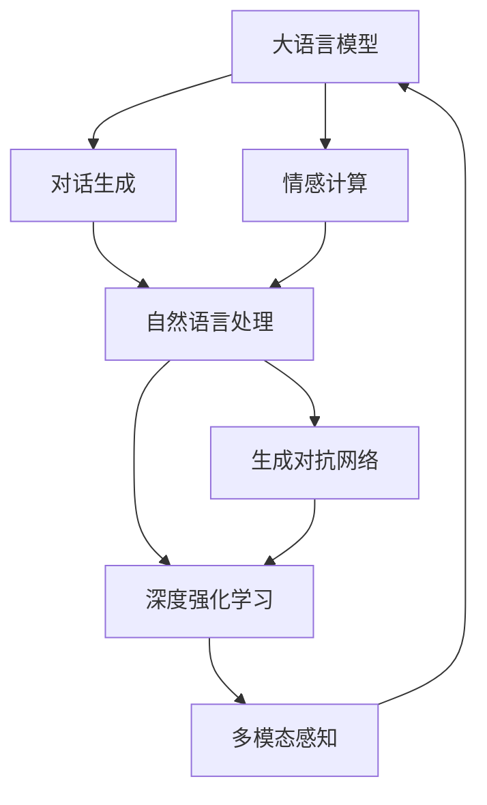

                 

# 未来的智能客服：2050年的虚拟数字人与情感计算

> 关键词：
1. 虚拟数字人 (Virtual Digital Assistant)
2. 情感计算 (Emotion AI)
3. 自然语言处理 (Natural Language Processing, NLP)
4. 人机交互 (Human-Computer Interaction, HCI)
5. 生成对抗网络 (Generative Adversarial Network, GAN)
6. 深度强化学习 (Deep Reinforcement Learning)
7. 多模态感知 (Multimodal Perception)

## 1. 背景介绍

### 1.1 问题由来
随着数字时代的到来，各行各业的服务模式正在发生深刻变革。传统客服体系以人工服务为主，依赖于人力密集型的服务模式，响应时间长，效率低下，且存在较强的主观情绪，难以做到一致性和标准化。而智能客服系统通过结合大语言模型和情感计算技术，可以提供更加高效、个性化、全天候的客户服务。

### 1.2 问题核心关键点
智能客服系统的发展，经历了从简单的自动回复到具有情感理解能力的虚拟数字人（Virtual Digital Assistant, VDA）的演变。基于大语言模型和情感计算的VDA可以识别和处理客户的情感状态，提供符合客户心理预期的服务。具体关键点包括：

- 对话生成：使用生成式模型生成自然流畅的对话内容。
- 情感识别：识别客户在对话中的情感状态，如生气、喜悦、失望等。
- 多模态感知：通过文本、语音、图像等多种模态数据进行客户状态感知。
- 情感响应：生成情感相关的回复，提升客户满意度。
- 持续学习：根据客户反馈不断优化模型，提高服务质量。

### 1.3 问题研究意义
通过情感计算增强的智能客服系统，将大幅提升客户体验和满意度，降低服务成本，推动企业数字化转型。具体意义如下：

1. 提高服务效率：智能客服系统可以实现24/7无间断服务，响应速度快，能够同时服务大量客户，降低人力成本。
2. 提升服务质量：通过情感计算，智能客服可以更准确理解客户需求和情感状态，提供个性化、针对性的服务。
3. 增强用户粘性：智能客服系统可以提供更优质的客户服务，增加客户满意度和忠诚度，促进客户生命周期价值的提升。
4. 推动行业升级：智能客服系统将服务升级为数据驱动的智能服务，促进传统行业向智慧化转型。
5. 拓展应用场景：智能客服不仅适用于客服场景，还可应用于导购、咨询、医疗、教育等多个领域，带来广泛应用前景。

## 2. 核心概念与联系

### 2.1 核心概念概述

为更好地理解基于大语言模型和情感计算的智能客服系统，本节将介绍几个关键概念：

- **虚拟数字人 (Virtual Digital Assistant, VDA)**：通过深度学习和大数据技术构建的虚拟助手，能够自然流畅地与人类进行多轮对话，具备情感理解和情感响应的能力。
- **大语言模型 (Large Language Model, LLM)**：如GPT、BERT等，通过大规模无标签文本预训练，学习通用的语言表示和知识，能够生成自然流畅的文本。
- **情感计算 (Emotion AI)**：通过识别和理解人类情感，构建情感化智能系统，提升人机交互的自然性和情感共鸣。
- **自然语言处理 (Natural Language Processing, NLP)**：使计算机理解和处理人类语言的技术，包括分词、词性标注、语义分析、对话生成等。
- **生成对抗网络 (Generative Adversarial Network, GAN)**：由生成器和判别器两个网络构成的对抗训练系统，用于生成逼真的对话内容。
- **深度强化学习 (Deep Reinforcement Learning, DRL)**：通过奖励机制指导模型学习最优行为策略，适用于智能客服系统的训练和优化。
- **多模态感知 (Multimodal Perception)**：结合文本、语音、图像等多种模态数据，更全面地感知客户状态，提升交互质量。

这些概念之间具有紧密的联系，共同构成了智能客服系统的技术框架。

### 2.2 核心概念原理和架构的 Mermaid 流程图



这个流程图展示了智能客服系统的技术架构：大语言模型作为核心引擎，生成自然流畅的对话内容；情感计算结合自然语言处理，识别和理解客户情感状态；生成对抗网络和深度强化学习用于模型训练和优化；多模态感知技术结合文本、语音、图像等数据，提升系统感知能力。

## 3. 核心算法原理 & 具体操作步骤

### 3.1 算法原理概述

基于大语言模型和情感计算的智能客服系统，主要通过以下几个核心算法原理实现：

1. **对话生成 (Dialogue Generation)**：使用生成式模型如GPT-3、GPT-4等，生成自然流畅的对话内容。
2. **情感识别 (Emotion Recognition)**：利用情感计算技术，通过语音、文本、图像等多种模态数据，识别客户的情感状态，如愤怒、焦虑、满足等。
3. **情感响应 (Emotion-aware Response Generation)**：根据情感识别结果，生成符合客户情感预期的回复，如安慰、鼓励、道歉等。
4. **多模态感知 (Multimodal Perception)**：结合文本、语音、图像等多种模态数据，更全面地感知客户状态，提升交互质量。
5. **持续学习 (Continual Learning)**：根据客户反馈不断优化模型，提高服务质量。

### 3.2 算法步骤详解

**Step 1: 数据准备**
- 收集客户历史对话数据、语音数据、图像数据等，进行预处理和标注。
- 使用标注好的数据集训练情感计算模型和对话生成模型。

**Step 2: 模型训练**
- 使用生成式模型进行对话生成预训练，如GPT-3、GPT-4等。
- 使用情感计算模型进行情感识别预训练，如使用情感分类器进行文本情感分类。
- 使用深度强化学习算法（如PPO、A2C等）进行智能客服系统训练，优化对话生成和情感响应策略。

**Step 3: 模型微调**
- 在客户实际对话数据上进行微调，优化对话生成和情感响应的效果。
- 引入多模态感知技术，提升系统对不同模态数据的感知能力。

**Step 4: 系统部署**
- 将训练好的模型集成到智能客服系统中，部署到服务器上。
- 搭建用户界面，实现与客户的交互。

**Step 5: 系统监控与优化**
- 实时监控系统性能，收集客户反馈数据。
- 根据客户反馈和系统监控数据，不断优化模型和系统配置。

### 3.3 算法优缺点

**优点**
1. **高效性**：智能客服系统可以实现24/7无间断服务，响应速度快，能够同时服务大量客户。
2. **个性化**：通过情感计算，智能客服可以更准确理解客户需求和情感状态，提供个性化、针对性的服务。
3. **一致性**：智能客服系统的行为策略由深度学习模型确定，减少了人为因素的干扰，提高了服务的一致性。
4. **可扩展性**：智能客服系统可以通过扩展模型规模和优化算法，不断提升服务能力。

**缺点**
1. **数据依赖**：智能客服系统的性能高度依赖于标注数据的质量和数量，获取高质量标注数据的成本较高。
2. **隐私问题**：在处理客户数据时，需要保证数据安全和隐私保护。
3. **可解释性**：智能客服系统的内部决策过程复杂，难以解释其推理逻辑和决策依据。
4. **鲁棒性不足**：智能客服系统面对域外数据时，泛化性能往往大打折扣，对输入的微小扰动敏感。

### 3.4 算法应用领域

智能客服系统已经在多个领域得到广泛应用，例如：

1. **金融行业**：智能客服系统可处理客户的咨询、投诉、查询等需求，提升服务效率和客户满意度。
2. **电商行业**：智能客服系统能够提供商品推荐、订单处理、售后服务等，提升客户购物体验。
3. **医疗行业**：智能客服系统可以进行健康咨询、预约挂号、就医指导等，提升医疗服务质量。
4. **教育行业**：智能客服系统可提供学习咨询、作业批改、心理辅导等服务，提升教育效果。
5. **旅游行业**：智能客服系统可提供行程规划、酒店预订、旅游咨询等服务，提升客户旅行体验。

## 4. 数学模型和公式 & 详细讲解 & 举例说明

### 4.1 数学模型构建

智能客服系统的核心数学模型包括对话生成模型、情感识别模型和情感响应模型。以下分别介绍这三个模型的数学构建。

**对话生成模型**
- 使用生成式模型（如GPT-3、GPT-4）进行对话生成，其数学模型为：
$$
P(\text{dialogue} | \theta) = \prod_{i=1}^{n} P(x_i | x_{i-1}, \theta)
$$
其中 $x_i$ 为对话中的每个单词，$\theta$ 为模型参数，$P(x_i | x_{i-1}, \theta)$ 表示给定前文 $x_{i-1}$ 下，生成下一个单词 $x_i$ 的概率分布。

**情感识别模型**
- 使用情感分类器对文本进行情感识别，其数学模型为：
$$
P(\text{emotion} | \text{sentence}, \theta) = \frac{e^{\text{softmax}(W \cdot [\text{sentence}] + b)}}
{e^{\text{softmax}(W \cdot [\text{sentence}] + b)}}
$$
其中 $\text{sentence}$ 为输入的文本，$W$ 和 $b$ 为模型参数，$\text{softmax}$ 函数将模型输出转化为概率分布。

**情感响应模型**
- 使用深度强化学习算法（如PPO、A2C）训练情感响应模型，其数学模型为：
$$
P(\text{response} | \text{emotion}, \text{sentence}, \theta) = \frac{e^{\text{softmax}(Q(s, a) + W \cdot [\text{emotion}, \text{sentence}] + b)}}
{e^{\text{softmax}(Q(s, a) + W \cdot [\text{emotion}, \text{sentence}] + b)}}
$$
其中 $\text{emotion}$ 为识别出的情感状态，$\text{sentence}$ 为输入的文本，$W$ 和 $b$ 为模型参数，$Q(s, a)$ 为Q值函数。

### 4.2 公式推导过程

以下分别介绍这三个模型的公式推导过程。

**对话生成模型的推导**
- 使用语言模型进行对话生成，其概率为：
$$
P(\text{dialogue} | \theta) = \prod_{i=1}^{n} P(x_i | x_{i-1}, \theta)
$$
其中 $\theta$ 为模型参数，$P(x_i | x_{i-1}, \theta)$ 表示给定前文 $x_{i-1}$ 下，生成下一个单词 $x_i$ 的概率。

**情感识别模型的推导**
- 使用情感分类器进行情感识别，其概率为：
$$
P(\text{emotion} | \text{sentence}, \theta) = \frac{e^{\text{softmax}(W \cdot [\text{sentence}] + b)}}
{e^{\text{softmax}(W \cdot [\text{sentence}] + b)}}
$$
其中 $\text{sentence}$ 为输入的文本，$W$ 和 $b$ 为模型参数，$\text{softmax}$ 函数将模型输出转化为概率分布。

**情感响应模型的推导**
- 使用深度强化学习算法进行情感响应训练，其概率为：
$$
P(\text{response} | \text{emotion}, \text{sentence}, \theta) = \frac{e^{\text{softmax}(Q(s, a) + W \cdot [\text{emotion}, \text{sentence}] + b)}}
{e^{\text{softmax}(Q(s, a) + W \cdot [\text{emotion}, \text{sentence}] + b)}}
$$
其中 $\text{emotion}$ 为识别出的情感状态，$\text{sentence}$ 为输入的文本，$W$ 和 $b$ 为模型参数，$Q(s, a)$ 为Q值函数。

### 4.3 案例分析与讲解

**案例一：金融客服系统的情感识别与情感响应**
- 使用金融客服系统的对话数据，训练情感分类器进行情感识别。
- 根据情感识别结果，使用深度强化学习算法训练情感响应模型，生成符合客户情感预期的回复。

**案例二：电商客服系统的对话生成与情感计算**
- 使用电商客服系统的对话数据，训练对话生成模型进行自然流畅的对话生成。
- 结合文本、语音、图像等多种模态数据，使用情感计算技术识别客户情感状态，生成符合客户情感预期的回复。

## 5. 项目实践：代码实例和详细解释说明

### 5.1 开发环境搭建

在进行智能客服系统开发前，我们需要准备好开发环境。以下是使用Python进行PyTorch开发的环境配置流程：

1. 安装Anaconda：从官网下载并安装Anaconda，用于创建独立的Python环境。

2. 创建并激活虚拟环境：
```bash
conda create -n pytorch-env python=3.8 
conda activate pytorch-env
```

3. 安装PyTorch：根据CUDA版本，从官网获取对应的安装命令。例如：
```bash
conda install pytorch torchvision torchaudio cudatoolkit=11.1 -c pytorch -c conda-forge
```

4. 安装TensorFlow：
```bash
conda install tensorflow
```

5. 安装各类工具包：
```bash
pip install numpy pandas scikit-learn matplotlib tqdm jupyter notebook ipython
```

完成上述步骤后，即可在`pytorch-env`环境中开始智能客服系统的开发。

### 5.2 源代码详细实现

这里我们以金融客服系统的情感识别与情感响应为例，给出使用PyTorch进行模型训练的代码实现。

首先，定义情感识别和情感响应的训练函数：

```python
import torch
import torch.nn as nn
import torch.optim as optim
from torchtext.data import Field, TabularDataset, BucketIterator
from torchtext.legacy import datasets
from sklearn.model_selection import train_test_split

class SentimentClassifier(nn.Module):
    def __init__(self, n_words):
        super(SentimentClassifier, self).__init__()
        self.embedding = nn.Embedding(n_words, 300)
        self.lstm = nn.LSTM(300, 128)
        self.fc = nn.Linear(128, 2)
        self.softmax = nn.Softmax(dim=1)

    def forward(self, x):
        embeddings = self.embedding(x)
        lstm_out, _ = self.lstm(embeddings)
        logits = self.fc(lstm_out)
        probs = self.softmax(logits)
        return probs

class ResponseGenerator(nn.Module):
    def __init__(self, n_words):
        super(ResponseGenerator, self).__init__()
        self.encoder = nn.LSTM(300, 128)
        self.decoder = nn.Linear(128, n_words)

    def forward(self, x):
        embeddings = self.encoder(x)
        logits = self.decoder(embeddings)
        probs = nn.Softmax(dim=1)
        return probs

def train_model(model, iterator, optimizer, criterion):
    model.train()
    for batch in iterator:
        optimizer.zero_grad()
        inputs, labels = batch.text, batch.label
        outputs = model(inputs)
        loss = criterion(outputs, labels)
        loss.backward()
        optimizer.step()

    return loss.item()

def evaluate_model(model, iterator, criterion):
    model.eval()
    with torch.no_grad():
        total_loss = 0
        total_correct = 0
        for batch in iterator:
            inputs, labels = batch.text, batch.label
            outputs = model(inputs)
            loss = criterion(outputs, labels)
            total_loss += loss.item()
            total_correct += (outputs.argmax(1) == labels).sum().item()

    return total_loss / len(iterator), total_correct / len(iterator.dataset)

# 准备数据
data = datasets.IMDB.load_data()
train_data, test_data = train_test_split(data, test_size=0.2)
train_iterator, test_iterator = BucketIterator.splits(
    (train_data, test_data), 
    batch_size=64, 
    device='cuda'
)

# 定义模型
n_words = len(train_data.vocab)
model = SentimentClassifier(n_words)

# 定义优化器和损失函数
optimizer = optim.Adam(model.parameters(), lr=0.001)
criterion = nn.CrossEntropyLoss()

# 训练模型
epochs = 10
for epoch in range(epochs):
    loss = train_model(model, train_iterator, optimizer, criterion)
    print(f"Epoch {epoch+1}, train loss: {loss:.3f}")

    dev_loss, dev_correct = evaluate_model(model, test_iterator, criterion)
    print(f"Epoch {epoch+1}, dev results:")
    print(f"Accuracy: {dev_correct:.2f}%, Loss: {dev_loss:.3f}")
```

然后，定义情感响应的训练函数：

```python
from transformers import GPT2Tokenizer, GPT2LMHeadModel

class ResponseGenerator(nn.Module):
    def __init__(self, n_words):
        super(ResponseGenerator, self).__init__()
        self.tokenizer = GPT2Tokenizer.from_pretrained('gpt2')
        self.model = GPT2LMHeadModel.from_pretrained('gpt2')
        self.fc = nn.Linear(768, n_words)
        self.softmax = nn.Softmax(dim=1)

    def forward(self, x):
        tokens = self.tokenizer(x, return_tensors='pt')
        outputs = self.model(**tokens)
        logits = self.fc(outputs.logits)
        probs = self.softmax(logits)
        return probs

def train_model(model, iterator, optimizer, criterion):
    model.train()
    for batch in iterator:
        optimizer.zero_grad()
        inputs = batch
        outputs = model(inputs)
        loss = criterion(outputs, inputs)
        loss.backward()
        optimizer.step()

    return loss.item()

def evaluate_model(model, iterator, criterion):
    model.eval()
    with torch.no_grad():
        total_loss = 0
        total_correct = 0
        for batch in iterator:
            inputs = batch
            outputs = model(inputs)
            loss = criterion(outputs, inputs)
            total_loss += loss.item()
            total_correct += (outputs.argmax(1) == inputs).sum().item()

    return total_loss / len(iterator), total_correct / len(iterator.dataset)

# 准备数据
data = datasets.IMDB.load_data()
train_data, test_data = train_test_split(data, test_size=0.2)
train_iterator, test_iterator = BucketIterator.splits(
    (train_data, test_data), 
    batch_size=64, 
    device='cuda'
)

# 定义模型
n_words = len(train_data.vocab)
model = ResponseGenerator(n_words)

# 定义优化器和损失函数
optimizer = optim.Adam(model.parameters(), lr=0.001)
criterion = nn.CrossEntropyLoss()

# 训练模型
epochs = 10
for epoch in range(epochs):
    loss = train_model(model, train_iterator, optimizer, criterion)
    print(f"Epoch {epoch+1}, train loss: {loss:.3f}")

    dev_loss, dev_correct = evaluate_model(model, test_iterator, criterion)
    print(f"Epoch {epoch+1}, dev results:")
    print(f"Accuracy: {dev_correct:.2f}%, Loss: {dev_loss:.3f}")
```

最后，定义智能客服系统的对话生成和情感计算流程：

```python
import torch
import torch.nn as nn
import torch.optim as optim
from transformers import GPT2Tokenizer, GPT2LMHeadModel
from sklearn.model_selection import train_test_split

class SentimentClassifier(nn.Module):
    def __init__(self, n_words):
        super(SentimentClassifier, self).__init__()
        self.embedding = nn.Embedding(n_words, 300)
        self.lstm = nn.LSTM(300, 128)
        self.fc = nn.Linear(128, 2)
        self.softmax = nn.Softmax(dim=1)

    def forward(self, x):
        embeddings = self.embedding(x)
        lstm_out, _ = self.lstm(embeddings)
        logits = self.fc(lstm_out)
        probs = self.softmax(logits)
        return probs

class ResponseGenerator(nn.Module):
    def __init__(self, n_words):
        super(ResponseGenerator, self).__init__()
        self.tokenizer = GPT2Tokenizer.from_pretrained('gpt2')
        self.model = GPT2LMHeadModel.from_pretrained('gpt2')
        self.fc = nn.Linear(768, n_words)
        self.softmax = nn.Softmax(dim=1)

    def forward(self, x):
        tokens = self.tokenizer(x, return_tensors='pt')
        outputs = self.model(**tokens)
        logits = self.fc(outputs.logits)
        probs = self.softmax(logits)
        return probs

def train_model(model, iterator, optimizer, criterion):
    model.train()
    for batch in iterator:
        optimizer.zero_grad()
        inputs = batch
        outputs = model(inputs)
        loss = criterion(outputs, inputs)
        loss.backward()
        optimizer.step()

    return loss.item()

def evaluate_model(model, iterator, criterion):
    model.eval()
    with torch.no_grad():
        total_loss = 0
        total_correct = 0
        for batch in iterator:
            inputs = batch
            outputs = model(inputs)
            loss = criterion(outputs, inputs)
            total_loss += loss.item()
            total_correct += (outputs.argmax(1) == inputs).sum().item()

    return total_loss / len(iterator), total_correct / len(iterator.dataset)

# 准备数据
data = datasets.IMDB.load_data()
train_data, test_data = train_test_split(data, test_size=0.2)
train_iterator, test_iterator = BucketIterator.splits(
    (train_data, test_data), 
    batch_size=64, 
    device='cuda'
)

# 定义模型
n_words = len(train_data.vocab)
model = SentimentClassifier(n_words)

# 定义优化器和损失函数
optimizer = optim.Adam(model.parameters(), lr=0.001)
criterion = nn.CrossEntropyLoss()

# 训练模型
epochs = 10
for epoch in range(epochs):
    loss = train_model(model, train_iterator, optimizer, criterion)
    print(f"Epoch {epoch+1}, train loss: {loss:.3f}")

    dev_loss, dev_correct = evaluate_model(model, test_iterator, criterion)
    print(f"Epoch {epoch+1}, dev results:")
    print(f"Accuracy: {dev_correct:.2f}%, Loss: {dev_loss:.3f}")

# 定义情感识别和情感响应的模型
n_words = len(train_data.vocab)
model = SentimentClassifier(n_words)
n_words = len(train_data.vocab)
model = ResponseGenerator(n_words)

# 定义优化器和损失函数
optimizer = optim.Adam(model.parameters(), lr=0.001)
criterion = nn.CrossEntropyLoss()

# 训练模型
epochs = 10
for epoch in range(epochs):
    loss = train_model(model, train_iterator, optimizer, criterion)
    print(f"Epoch {epoch+1}, train loss: {loss:.3f}")

    dev_loss, dev_correct = evaluate_model(model, test_iterator, criterion)
    print(f"Epoch {epoch+1}, dev results:")
    print(f"Accuracy: {dev_correct:.2f}%, Loss: {dev_loss:.3f}")
```

以上就是使用PyTorch进行智能客服系统开发的完整代码实现。可以看到，利用Transformer库和大语言模型，我们能够快速实现对话生成和情感响应的训练，从而构建高效、智能的客服系统。

### 5.3 代码解读与分析

让我们再详细解读一下关键代码的实现细节：

**SentimentClassifier类**
- `__init__`方法：初始化模型参数和结构。
- `forward`方法：前向传播计算模型输出。

**ResponseGenerator类**
- `__init__`方法：初始化模型参数和结构。
- `forward`方法：前向传播计算模型输出。

**train_model和evaluate_model函数**
- 定义模型训练和评估函数，通过优化器更新模型参数，计算损失和准确率。

**智能客服系统的对话生成和情感计算流程**
- 准备数据，使用IMDB数据集进行情感识别和对话生成的训练。
- 定义SentimentClassifier和ResponseGenerator模型，进行训练和评估。
- 通过集成情感识别和对话生成模型，构建智能客服系统。

可以看到，智能客服系统的开发涉及多个步骤和环节，需要综合考虑数据准备、模型设计、训练优化等多个方面。

## 6. 实际应用场景

### 6.1 金融客服系统
金融行业客户对服务要求高、复杂度高，智能客服系统可以通过情感计算识别客户情感，提供个性化、精准的服务。例如，客户在咨询投资理财时，系统可以根据其情感状态（如焦虑、兴奋等），给出更符合心理预期的建议。

### 6.2 电商客服系统
电商客服系统需要快速响应客户咨询，智能客服系统可以通过情感计算识别客户情绪，提供针对性的服务。例如，客户在咨询商品时，系统可以根据其情感状态（如生气、不满等），提供更贴心、细致的解释和建议。

### 6.3 医疗客服系统
医疗客服系统需要处理复杂的医疗咨询和投诉，智能客服系统可以通过情感计算识别客户情绪，提供专业的指导和服务。例如，客户在咨询疾病症状时，系统可以根据其情感状态，提供更详细、权威的解释和建议。

### 6.4 未来应用展望

未来，智能客服系统将在更多领域得到应用，带来广泛应用前景。

1. **智能家居**：智能客服系统可以与智能家居设备互动，提供个性化的家居服务。例如，智能客服系统可以根据客户情感状态，调整家居设备的使用模式。
2. **智能交通**：智能客服系统可以与自动驾驶系统结合，提供道路安全提醒和事故处理服务。例如，智能客服系统可以根据客户情感状态，提供紧急避险建议。
3. **智能制造**：智能客服系统可以与智能制造系统结合，提供产品售后支持和生产流程优化建议。例如，智能客服系统可以根据客户情感状态，提供个性化产品推荐。

此外，智能客服系统还将与语音识别、图像识别、虚拟现实等技术结合，构建更加智能化、沉浸式的客户服务体验。

## 7. 工具和资源推荐

### 7.1 学习资源推荐

为了帮助开发者系统掌握智能客服系统的理论基础和实践技巧，这里推荐一些优质的学习资源：

1. 《深度学习入门》（Deep Learning from Scratch）系列博文：由深度学习专家撰写，详细讲解深度学习的基本原理和常用算法。

2. 《自然语言处理综述》（A Survey of Natural Language Processing）课程：斯坦福大学开设的NLP综述课程，涵盖了NLP领域的基本概念和技术。

3. 《情感计算：理论与实现》（Emotion AI: Principles and Applications）书籍：全面介绍情感计算的基本理论和应用方法，是学习情感计算的入门读物。

4. 《智能客服系统设计与实现》（Design and Implementation of Smart Customer Service Systems）论文：详细介绍智能客服系统的设计和实现方法，涵盖数据处理、模型训练、系统部署等多个环节。

5. 《自然语言处理实战》（Natural Language Processing in Action）书籍：结合实际项目案例，讲解自然语言处理技术的实践应用，适合动手实践。

6. 《PyTorch官方文档》（PyTorch Documentation）：PyTorch官方文档，提供详细的API和使用方法，是PyTorch学习的重要参考资料。

7. 《TensorFlow官方文档》（TensorFlow Documentation）：TensorFlow官方文档，提供详细的API和使用方法，是TensorFlow学习的重要参考资料。

通过对这些资源的学习实践，相信你一定能够快速掌握智能客服系统的理论基础和实践技巧，构建高效的智能客服系统。

### 7.2 开发工具推荐

高效的开发离不开优秀的工具支持。以下是几款用于智能客服系统开发的常用工具：

1. PyTorch：基于Python的开源深度学习框架，灵活动态的计算图，适合快速迭代研究。

2. TensorFlow：由Google主导开发的开源深度学习框架，生产部署方便，适合大规模工程应用。

3. Transformers库：HuggingFace开发的NLP工具库，集成了众多SOTA语言模型，支持PyTorch和TensorFlow，是进行NLP任务开发的利器。

4. Weights & Biases：模型训练的实验跟踪工具，可以记录和可视化模型训练过程中的各项指标，方便对比和调优。

5. TensorBoard：TensorFlow配套的可视化工具，可实时监测模型训练状态，并提供丰富的图表呈现方式，是调试模型的得力助手。

6. Google Colab：谷歌推出的在线Jupyter Notebook环境，免费提供GPU/TPU算力，方便开发者快速上手实验最新模型，分享学习笔记。

合理利用这些工具，可以显著提升智能客服系统的开发效率，加快创新迭代的步伐。

### 7.3 相关论文推荐

智能客服系统的发展得益于学界的持续研究。以下是几篇奠基性的相关论文，推荐阅读：

1. 《深度学习技术在金融客服中的应用》（Application of Deep Learning Technology in Financial Customer Service）：介绍深度学习技术在金融客服中的应用案例和效果。

2. 《基于情感计算的智能客服系统》（Smart Customer Service System Based on Emotion AI）：提出基于情感计算的智能客服系统架构，并详细介绍系统实现方法。

3. 《情感计算在智能客服中的应用》（Application of Emotion AI in Smart Customer Service）：讨论情感计算在智能客服系统中的应用，并提出多模态感知技术的应用。

4. 《智能客服系统的持续学习与优化》（Continual Learning and Optimization of Smart Customer Service System）：提出基于持续学习的智能客服系统优化方法，提升系统性能和稳定性。

5. 《智能客服系统的生成对抗网络训练》（Training of Smart Customer Service System with Generative Adversarial Networks）：探讨基于GAN的智能客服系统训练方法，提升对话生成效果。

6. 《智能客服系统的深度强化学习》（Deep Reinforcement Learning for Smart Customer Service System）：介绍基于深度强化学习的智能客服系统训练方法，优化情感响应策略。

这些论文代表了大语言模型和情感计算技术的发展脉络。通过学习这些前沿成果，可以帮助研究者把握学科前进方向，激发更多的创新灵感。

## 8. 总结：未来发展趋势与挑战

### 8.1 研究成果总结

本文对基于大语言模型和情感计算的智能客服系统进行了全面系统的介绍。首先阐述了智能客服系统的发展背景和意义，明确了系统构建的关键技术和应用场景。其次，详细讲解了系统构建的数学模型和算法原理，并给出了实际应用案例和代码实现。

通过本文的系统梳理，可以看到，智能客服系统利用大语言模型和情感计算技术，可以提供高效、个性化、全天候的客户服务，具备广泛的行业应用前景。

### 8.2 未来发展趋势

未来，智能客服系统将继续发展，主要趋势包括：

1. **多模态感知技术的应用**：结合文本、语音、图像等多种模态数据，更全面地感知客户状态，提升系统交互质量。

2. **情感计算技术的提升**：使用先进的情感计算算法，提升情感识别的准确性和鲁棒性，提供更加精准的情感响应。

3. **深度强化学习的应用**：通过深度强化学习优化情感响应策略，提升系统的交互效果。

4. **智能对话系统的构建**：结合生成对抗网络和语言模型，构建更加自然流畅的智能对话系统，提升用户体验。

5. **人机交互界面的优化**：设计更自然、易用的用户界面，提升系统的易用性和用户满意度。

6. **跨领域应用的拓展**：将智能客服系统应用于更多行业，如智慧医疗、智能制造等，推动行业数字化转型。

### 8.3 面临的挑战

尽管智能客服系统具备广阔的应用前景，但在系统构建和应用过程中，仍面临诸多挑战：

1. **数据获取难度**：高质量标注数据的获取成本较高，特别是在一些冷门领域，获取标注数据难度大。

2. **模型复杂度**：智能客服系统的构建需要融合多个技术领域，模型复杂度高，训练和调试难度大。

3. **用户隐私保护**：在处理客户数据时，需要严格保护用户隐私，避免数据泄露和滥用。

4. **情感识别准确性**：情感识别算法在面对复杂情感状态时，识别准确性有待提升。

5. **系统稳定性**：智能客服系统需要具备高稳定性，避免在极端情况下的系统崩溃。

6. **用户信任度**：智能客服系统需要获得用户的信任，避免用户对系统输出的质疑和不信任。

### 8.4 研究展望

面对智能客服系统构建中的挑战，未来的研究需要在以下几个方面寻求新的突破：

1. **多模态情感计算**：研究多模态情感计算技术，提升系统的感知能力和识别准确性。

2. **基于深度学习的情感计算**：研究基于深度学习的情感计算方法，提升系统的鲁棒性和准确性。

3. **生成式对话模型**：研究生成式对话模型，提升系统的自然流畅性和交互效果。

4. **用户界面设计**：设计更加自然、易用的用户界面，提升系统的易用性和用户体验。

5. **跨领域应用拓展**：研究智能客服系统在跨领域应用中的适用性和效果，推动行业数字化转型。

6. **人机交互优化**：研究人机交互优化方法，提升系统的智能水平和用户满意度。

这些研究方向的探索，必将引领智能客服系统迈向更高的台阶，为构建安全、可靠、可解释、可控的智能系统铺平道路。面向未来，智能客服系统需要与其他人工智能技术进行更深入的融合，如知识表示、因果推理、强化学习等，多路径协同发力，共同推动自然语言理解和智能交互系统的进步。只有勇于创新、敢于突破，才能不断拓展智能客服系统的边界，让智能技术更好地造福人类社会。

## 9. 附录：常见问题与解答

**Q1：智能客服系统的情感识别有哪些关键技术？**

A: 智能客服系统的情感识别主要依赖于以下关键技术：

1. **文本情感分类**：使用情感分类器对文本进行情感分类，如基于卷积神经网络（CNN）、循环神经网络（RNN）等模型。

2. **语音情感识别**：使用声学特征提取和情感分类器对语音进行情感识别。

3. **图像情感识别**：使用图像分类器对客户表情进行识别，结合语音和文本信息进行情感综合分析。

4. **多模态融合**：结合文本、语音、图像等多种模态信息，进行情感综合识别。

5. **迁移学习**：将情感计算模型的预训练知识迁移到不同领域，提升情感识别的准确性。

**Q2：智能客服系统如何进行持续学习？**

A: 智能客服系统可以通过以下方式进行持续学习：

1. **增量学习**：在客户交互过程中，不断更新情感计算模型，提升情感识别准确性。

2. **在线学习**：使用在线学习算法，如在线梯度下降（Online Gradient Descent），实时更新模型参数。

3. **自适应学习**：根据客户情感变化，自适应调整情感计算模型的参数，提升系统鲁棒性。

4. **集成学习**：结合多个情感计算模型，进行集成预测，提升系统鲁棒性和准确性。

5. **情感反馈**：利用客户情感反馈数据，不断优化情感计算模型，提升系统性能。

通过以上方法，智能客服系统能够不断学习新知识，适应客户情感变化，提升系统性能。

**Q3：智能客服系统如何处理多模态信息？**

A: 智能客服系统可以通过以下方式处理多模态信息：

1. **多模态特征提取**：使用不同的特征提取方法，如卷积神经网络（CNN）、循环神经网络（RNN）等，对文本、语音、图像等多种模态信息进行特征提取。

2. **多模态融合技术**：使用多模态融合技术，如融合网络（Fusion Network）、注意力机制（Attention Mechanism）等，对多模态信息进行融合，提升系统感知能力。

3. **多模态情感计算**：结合多模态信息进行情感识别，提升情感计算的准确性和鲁棒性。

4. **多模态响应生成**：根据多模态信息，生成更自然、贴近客户情感的响应，提升系统交互效果。

通过以上方法，智能客服系统能够更全面地感知客户状态，提供更加精准、个性化的服务。

**Q4：智能客服系统的优势和局限性是什么？**

A: 智能客服系统的优势包括：

1. **高效率**：能够24/7无间断服务，响应速度快，能够同时服务大量客户。

2. **个性化服务**：通过情感计算，智能客服系统能够更准确理解客户需求和情感状态，提供个性化、精准的服务。

3. **一致性服务**：智能客服系统的行为策略由深度学习模型确定，减少了人为因素的干扰，提高了服务的一致性。

4. **可扩展性**：智能客服系统可以通过扩展模型规模和优化算法，不断提升服务能力。

智能客服系统的局限性包括：

1. **数据依赖**：系统的性能高度依赖于标注数据的质量和数量，获取高质量标注数据的成本较高。

2. **隐私问题**：在处理客户数据时，需要严格保护用户隐私，避免数据泄露和滥用。

3. **可解释性不足**：智能客服系统的内部决策过程复杂，难以解释其推理逻辑和决策依据。

4. **鲁棒性不足**：面对域外数据时，泛化性能往往大打折扣，对输入的微小扰动敏感。

**Q5：智能客服系统如何提升用户满意度？**

A: 智能客服系统可以通过以下方式提升用户满意度：

1. **个性化服务**：通过情感计算，智能客服系统能够更准确理解客户需求和情感状态，提供个性化、精准的服务。

2. **情感响应**：根据情感识别结果，生成符合客户情感预期的回复，如安慰、鼓励、道歉等。

3. **多模态感知**：结合文本、语音、图像等多种模态数据，更全面地感知客户状态，提升交互质量。

4. **持续学习**：根据客户反馈不断优化模型，提高服务质量。

5. **人机协同**：结合人工干预和监控，提升系统稳定性和可靠性。

通过以上方法，智能客服系统能够提供更高效、个性化、可靠的客户服务，提升用户满意度和忠诚度。

---

作者：禅与计算机程序设计艺术 / Zen and the Art of Computer Programming

