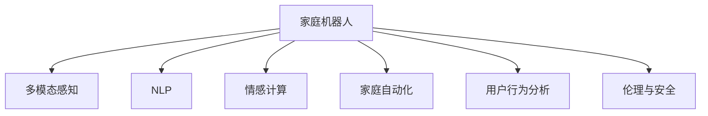

                 

# 未来的智能家居：2050年的家庭机器人与情感陪伴

## 1. 背景介绍

### 1.1 问题由来

随着科技的飞速发展，人工智能(AI)、物联网(IoT)和机器学习等技术的日渐成熟，智能家居领域正经历着一场深刻的变革。从智能音箱、智能灯光到智能温控器，从家电联动到场景自适应，智能家居的每个环节都在向更高效、更智能、更人性化迈进。

2050年的家庭机器人将继承并超越这一愿景，通过与用户的深度交互，实现从物理到认知、从实体到情感的全方位智能化。这些机器人不仅能够实现对家居环境的精准控制，更能通过情感理解与表达，成为用户的忠实伙伴，提供全方位的智能陪伴服务。

### 1.2 问题核心关键点

面向未来，智能家居的核心挑战包括：
- 如何构建能够理解复杂情感的家庭机器人，提供更个性化的情感陪伴？
- 如何实现家庭机器人在多维度环境下的精准感知与智能控制？
- 如何确保家庭机器人的安全与隐私保护，避免出现伦理风险？
- 如何构建可持续发展的智能家居生态系统，推动技术创新与行业发展？

## 2. 核心概念与联系

### 2.1 核心概念概述

为更好地理解2050年家庭机器人与情感陪伴的实现，本节将介绍几个密切相关的核心概念：

- 家庭机器人：具备自主决策、人机交互和物理操控能力的智能设备。
- 多模态感知：通过视觉、听觉、触觉等多种感官进行环境感知的技术。
- 自然语言处理(NLP)：使计算机能够理解和生成自然语言的技术，支持机器人进行情感交流。
- 情感计算：研究如何使计算机理解和生成人类情感的技术，是实现情感陪伴的关键。
- 家庭自动化：实现家居环境智能化的技术，支持机器人对家居环境的控制与优化。
- 用户行为分析：通过对用户行为数据的分析，实现对用户需求的精准预测与响应。
- 伦理与安全：确保家庭机器人在运行过程中的安全性与隐私保护，避免伦理风险。

这些核心概念之间的逻辑关系可以通过以下Mermaid流程图来展示：



这个流程图展示了个体机器人实现情感陪伴的关键技术路径：

1. 家庭机器人通过多模态感知技术，实现对环境信息的全面采集。
2. 利用自然语言处理技术，理解用户的语言指令和情感表达。
3. 通过情感计算技术，机器人能够识别人类情感并做出回应。
4. 结合家庭自动化技术，对家居环境进行精准控制与优化。
5. 通过用户行为分析技术，预测用户需求并主动响应。
6. 通过伦理与安全技术，确保机器人行为的合规性。

## 3. 核心算法原理 & 具体操作步骤
### 3.1 算法原理概述

2050年的家庭机器人与情感陪伴技术，是基于深度学习、多模态感知和自然语言处理等多种技术的综合应用。其核心算法原理如下：

**多模态感知与融合**：
- 家庭机器人通过摄像头、麦克风、传感器等设备，采集视觉、听觉、触觉等多模态信息。
- 利用深度学习技术，对采集到的信息进行特征提取和融合，形成综合的感知表示。

**情感理解与生成**：
- 利用自然语言处理技术，对用户的语言指令进行情感分析，识别用户情绪。
- 通过深度学习模型，生成与用户情感匹配的自然语言回复。

**行为预测与自适应**：
- 通过用户行为数据分析，预测用户需求和偏好。
- 结合当前情境和历史行为数据，调整机器人的行为策略，实现自适应。

**伦理与安全保障**：
- 通过数据匿名化、隐私保护等技术，确保用户数据的安全。
- 结合安全监控和异常检测机制，防止机器人误操作和不当行为。

### 3.2 算法步骤详解

面向2050年，家庭机器人与情感陪伴的实现步骤如下：

**Step 1: 传感器配置与数据采集**：
- 选择合适的多模态传感器配置，如摄像头、麦克风、红外传感器等。
- 使用深度学习模型对传感器数据进行特征提取与融合，形成统一的感知表示。

**Step 2: 情感分析与识别**：
- 利用NLP技术对用户的语言指令进行情感分析，识别用户的情感状态。
- 使用预训练的情感分类模型，将用户语言指令转化为情感标签。

**Step 3: 自然语言生成**：
- 使用语言生成模型，如GPT-4，生成与用户情感匹配的自然语言回复。
- 通过模型的自回归生成特性，确保回复的流畅性和自然性。

**Step 4: 行为预测与决策**：
- 收集用户历史行为数据，使用机器学习算法进行建模。
- 结合当前情境和行为模型，预测用户需求，并生成相应的行为决策。

**Step 5: 行为执行与反馈**：
- 根据行为决策，控制家居设备执行相应的操作。
- 收集执行结果和用户反馈，优化行为模型。

**Step 6: 伦理与安全监控**：
- 对用户数据进行匿名化和隐私保护，确保数据安全。
- 部署安全监控和异常检测机制，防止不当行为。

### 3.3 算法优缺点

面向2050年的家庭机器人与情感陪伴技术，具有以下优点：

1. **全面感知与理解**：通过多模态感知和情感计算技术，实现对用户多维度信息的全面理解，提供更精准的情感陪伴服务。
2. **高度自适应**：结合行为预测与自适应技术，机器人能够根据用户行为动态调整行为策略，提升用户体验。
3. **自然语言交互**：利用自然语言处理技术，实现流畅的自然语言交互，提升人机交互的便利性。
4. **隐私保护与安全**：通过数据匿名化和安全监控，确保用户隐私保护，防止伦理风险。

同时，该技术也存在一些局限性：

1. **高成本与技术难度**：多模态感知和深度学习模型的训练与部署需要高性能硬件和大量数据，成本较高。
2. **数据隐私与安全风险**：虽然数据匿名化和隐私保护技术有所进步，但数据泄露和滥用风险依然存在。
3. **模型泛化与鲁棒性**：深度学习模型在特定环境下的泛化能力和鲁棒性仍需进一步提升。
4. **伦理与道德挑战**：如何定义机器人的权利与责任，避免出现伦理与道德上的争议，是需要深入探讨的问题。

### 3.4 算法应用领域

面向2050年的家庭机器人与情感陪伴技术，主要应用于以下领域：

1. **智能家居控制**：通过多模态感知和情感计算技术，机器人能够实现对家居环境的精准控制与优化。
2. **医疗护理陪伴**：利用情感计算技术，机器人可以陪伴老年人和特殊人群，提供心理支持与陪伴。
3. **教育与辅导**：通过情感理解与自然语言交互，机器人能够辅助教育与辅导，提供个性化学习服务。
4. **娱乐与陪伴**：结合自然语言生成与行为预测，机器人能够提供丰富的娱乐与陪伴服务，提升用户生活品质。

## 4. 数学模型和公式 & 详细讲解  
### 4.1 数学模型构建

面向2050年的家庭机器人与情感陪伴技术，涉及多个数学模型与算法。

**多模态感知与融合**：
- 使用卷积神经网络(CNN)对视觉数据进行特征提取，使用循环神经网络(RNN)对语音数据进行特征提取。
- 将两者提取的特征向量进行拼接，并输入到一个融合网络中，形成综合感知表示。

**情感理解与生成**：
- 使用预训练的情感分类模型，将用户的语言指令转化为情感标签。
- 使用生成式对抗网络(GAN)或语言生成模型，生成与用户情感匹配的自然语言回复。

**行为预测与决策**：
- 使用时间序列模型，如长短期记忆网络(LSTM)，对用户行为数据进行建模。
- 结合当前情境和历史行为数据，进行行为预测与决策。

**伦理与安全保障**：
- 使用差分隐私技术，对用户数据进行匿名化处理。
- 部署异常检测算法，监控机器人行为并及时采取措施。

### 4.2 公式推导过程

以下是情感理解与生成模型的详细公式推导过程：

**情感分类模型**：
- 输入用户语言指令 $x$，使用预训练的BERT模型提取特征表示 $h$。
- 将特征表示 $h$ 输入到一个情感分类器 $f$，得到情感标签 $y$。

$$
y = f(h) = \text{softmax}(W^T \cdot h + b)
$$

其中，$W$ 和 $b$ 为模型参数，$\text{softmax}$ 函数用于输出情感标签的概率分布。

**自然语言生成模型**：
- 使用语言生成模型，如GPT-4，将情感标签 $y$ 作为输入，生成自然语言回复 $z$。

$$
z = g(y) = \text{softmax}(W^T \cdot y + b)
$$

其中，$W$ 和 $b$ 为模型参数，$\text{softmax}$ 函数用于输出每个词语的概率分布。

## 5. 项目实践：代码实例和详细解释说明
### 5.1 开发环境搭建

在进行家庭机器人与情感陪伴技术开发前，我们需要准备好开发环境。以下是使用Python进行TensorFlow和PyTorch开发的环境配置流程：

1. 安装Anaconda：从官网下载并安装Anaconda，用于创建独立的Python环境。

2. 创建并激活虚拟环境：
```bash
conda create -n robotics-env python=3.8 
conda activate robotics-env
```

3. 安装TensorFlow和PyTorch：根据CUDA版本，从官网获取对应的安装命令。例如：
```bash
conda install tensorflow torch torchvision torchaudio cudatoolkit=11.1 -c pytorch -c conda-forge
```

4. 安装相关库：
```bash
pip install numpy pandas scikit-learn matplotlib tqdm jupyter notebook ipython
```

完成上述步骤后，即可在`robotics-env`环境中开始开发实践。

### 5.2 源代码详细实现

这里我们以一个简单的情感分类模型为例，给出TensorFlow和PyTorch的代码实现。

**TensorFlow版本**：

```python
import tensorflow as tf
from tensorflow.keras.layers import Input, Dense, Embedding, LSTM, Dense
from tensorflow.keras.models import Model

# 定义模型架构
input_text = Input(shape=(max_len,), dtype='int32')
x = Embedding(vocab_size, emb_dim)(input_text)
x = LSTM(128, return_sequences=True)(x)
x = Dense(32, activation='relu')(x)
output = Dense(num_classes, activation='softmax')(x)

# 定义模型
model = Model(inputs=input_text, outputs=output)
model.compile(loss='categorical_crossentropy', optimizer='adam', metrics=['accuracy'])

# 训练模型
model.fit(x_train, y_train, validation_data=(x_val, y_val), epochs=num_epochs, batch_size=batch_size)
```

**PyTorch版本**：

```python
import torch
import torch.nn as nn
import torch.optim as optim

# 定义模型架构
class SentimentClassifier(nn.Module):
    def __init__(self, vocab_size, emb_dim, num_classes):
        super(SentimentClassifier, self).__init__()
        self.embedding = nn.Embedding(vocab_size, emb_dim)
        self.lstm = nn.LSTM(emb_dim, 128, batch_first=True)
        self.dense = nn.Linear(128, num_classes)
        
    def forward(self, x):
        x = self.embedding(x)
        x, _ = self.lstm(x)
        x = self.dense(x)
        return x

# 定义损失函数与优化器
criterion = nn.CrossEntropyLoss()
optimizer = optim.Adam(model.parameters(), lr=0.001)

# 训练模型
for epoch in range(num_epochs):
    for i, (x, y) in enumerate(train_loader):
        optimizer.zero_grad()
        y_pred = model(x)
        loss = criterion(y_pred, y)
        loss.backward()
        optimizer.step()
```

以上代码实现了基于LSTM的情感分类模型，并使用TensorFlow和PyTorch框架进行训练。在实际应用中，还可以结合多模态感知和自然语言处理技术，构建更复杂的情感交互系统。

### 5.3 代码解读与分析

让我们再详细解读一下关键代码的实现细节：

**情感分类模型**：
- `Input`层：定义输入文本的维度为`max_len`，表示输入的最大长度。
- `Embedding`层：将输入文本转化为固定长度的词向量。
- `LSTM`层：使用LSTM网络对词向量序列进行建模，形成时序特征表示。
- `Dense`层：使用全连接层对LSTM输出进行分类，输出情感标签。

**TensorFlow**：
- `compile`方法：定义模型的优化器、损失函数和评估指标。
- `fit`方法：使用训练数据集对模型进行训练，验证集上进行评估。

**PyTorch**：
- `SentimentClassifier`类：继承`nn.Module`，定义模型架构。
- `forward`方法：定义前向传播过程，将输入文本转化为情感标签。
- `criterion`：定义交叉熵损失函数。
- `optimizer`：定义Adam优化器。

这些代码展示了情感分类模型的核心实现，利用LSTM对文本数据进行建模，使用交叉熵损失函数进行训练。在实际应用中，可以通过进一步的优化和改进，实现更精准的情感分类与自然语言生成。

## 6. 实际应用场景
### 6.1 智能家居控制

2050年的家庭机器人可以通过多模态感知技术，对家居环境进行精准控制。例如，通过视觉传感器检测房间的亮度，自动调整灯光亮度和颜色。通过听觉传感器检测环境噪音，自动关闭窗户或调节空调音量。通过触觉传感器检测温度和湿度，自动调节温控器和加湿器等设备。

### 6.2 医疗护理陪伴

在医疗护理领域，家庭机器人可以伴随老年人或特殊人群，提供心理支持和陪伴。例如，通过视觉传感器监测用户的健康状况，提醒其按时服药。通过听觉传感器与用户进行互动，缓解孤独感。通过自然语言生成技术，提供健康咨询和心理疏导服务。

### 6.3 教育与辅导

在教育领域，家庭机器人可以通过自然语言生成和情感计算技术，辅助学生进行学习和辅导。例如，通过情感分析理解学生的情绪状态，调整教学策略和语言风格。通过生成式对话模型，与学生进行互动，解答学习问题。通过行为预测技术，预测学生的学习需求，提供个性化的学习建议。

### 6.4 娱乐与陪伴

在娱乐领域，家庭机器人可以提供丰富的娱乐和陪伴服务。例如，通过自然语言生成技术，生成个性化的娱乐节目推荐。通过情感理解技术，与用户进行情感交流，提供情感陪伴服务。通过多模态感知技术，实时监控用户的情绪变化，提供心理支持。

## 7. 工具和资源推荐
### 7.1 学习资源推荐

为了帮助开发者系统掌握家庭机器人与情感陪伴的理论基础和实践技巧，这里推荐一些优质的学习资源：

1. **《机器人学与人工智能》**：一本系统介绍机器人学和人工智能技术的经典教材，涵盖多模态感知、情感计算、自然语言处理等多个领域。
2. **Stanford CS231n课程**：斯坦福大学开设的计算机视觉课程，涵盖深度学习与多模态感知技术，是学习家庭机器人感知与控制的重要资源。
3. **OpenAI GPT-4论文**：OpenAI团队发布的GPT-4生成式模型论文，详细介绍了自然语言生成与情感理解技术的最新进展。
4. **RoboCup竞赛资源**：RoboCup是国际机器人足球竞赛，提供了丰富的家庭机器人与情感计算相关资源和教程。
5. **HuggingFace Transformers库**：提供了大量预训练语言模型和相关工具，方便开发者进行自然语言处理和情感计算。

通过对这些资源的学习实践，相信你一定能够快速掌握家庭机器人与情感陪伴的精髓，并用于解决实际的NLP问题。

### 7.2 开发工具推荐

高效的开发离不开优秀的工具支持。以下是几款用于家庭机器人与情感陪伴开发的常用工具：

1. **TensorFlow**：基于Python的开源深度学习框架，灵活动态的计算图，适合研究与实验。
2. **PyTorch**：基于Python的开源深度学习框架，动态图与静态图并存，适合快速迭代与部署。
3. **RoboCup**：国际机器人足球竞赛，提供了丰富的实验平台和开发环境，支持家庭机器人的多模态感知与控制。
4. **Gazebo**：一个开源的机器人仿真环境，可以模拟多种家庭环境，方便测试和优化机器人行为。
5. **ROS（Robot Operating System）**：一个机器人操作系统，提供了丰富的模块和工具，方便进行机器人编程与控制。

合理利用这些工具，可以显著提升家庭机器人与情感陪伴的开发效率，加快创新迭代的步伐。

### 7.3 相关论文推荐

家庭机器人与情感陪伴技术的发展源于学界的持续研究。以下是几篇奠基性的相关论文，推荐阅读：

1. **《情感机器人：设计与实现》**：详细介绍了情感机器人的设计与实现技术，涵盖了情感理解与生成、人机交互等多个方面。
2. **《情感计算：理论与应用》**：一本系统介绍情感计算技术的经典教材，涵盖情感识别、情感生成等多个领域。
3. **《智能家居环境感知与控制》**：一篇关于智能家居感知与控制技术的综述论文，详细介绍了多模态感知与行为预测技术的最新进展。
4. **《自然语言生成与情感计算》**：一篇关于自然语言生成与情感计算技术的综述论文，详细介绍了语言生成模型和情感分类模型的最新进展。
5. **《机器人行为预测与自适应》**：一篇关于机器人行为预测与自适应技术的综述论文，详细介绍了时间序列模型和行为预测算法的最新进展。

这些论文代表了大语言模型微调技术的发展脉络。通过学习这些前沿成果，可以帮助研究者把握学科前进方向，激发更多的创新灵感。

## 8. 总结：未来发展趋势与挑战

### 8.1 总结

本文对2050年家庭机器人与情感陪伴技术进行了全面系统的介绍。首先阐述了未来智能家居的愿景与挑战，明确了情感计算在实现家庭陪伴中的重要价值。其次，从原理到实践，详细讲解了情感理解与生成的数学模型和操作步骤，给出了实际应用场景的代码实现。同时，本文还广泛探讨了家庭机器人与情感计算在多个行业领域的应用前景，展示了其广阔的潜力和影响力。此外，本文精选了情感计算技术的各类学习资源，力求为开发者提供全方位的技术指引。

通过本文的系统梳理，可以看到，面向2050年的家庭机器人与情感陪伴技术正在成为智能家居领域的重要范式，极大地拓展了机器人对环境的感知与理解能力，推动了人机交互的深度融合。未来，伴随感知、计算与控制技术的不断演进，家庭机器人的应用范围将不断扩大，为人类生活带来更便捷、更智能、更人性化的体验。

### 8.2 未来发展趋势

展望未来，家庭机器人与情感陪伴技术将呈现以下几个发展趋势：

1. **全面感知与理解**：通过多模态感知和深度学习技术，实现对用户多维度信息的全面理解，提供更精准的情感陪伴服务。
2. **高度自适应**：结合行为预测与自适应技术，机器人能够根据用户行为动态调整行为策略，提升用户体验。
3. **自然语言交互**：利用自然语言处理技术，实现流畅的自然语言交互，提升人机交互的便利性。
4. **隐私保护与安全**：通过数据匿名化和安全监控，确保用户隐私保护，防止伦理风险。
5. **多模态融合**：结合视觉、听觉、触觉等多种感官信息，实现更全面、更准确的环境感知与行为控制。
6. **跨领域应用**：结合多学科知识，推动家庭机器人在医疗、教育、娱乐等领域的应用创新。

这些趋势凸显了家庭机器人与情感计算技术的广阔前景。这些方向的探索发展，必将进一步提升智能家居系统的性能和应用范围，为人类生活带来更便捷、更智能、更人性化的体验。

### 8.3 面临的挑战

尽管家庭机器人与情感计算技术已经取得了瞩目成就，但在迈向更加智能化、普适化应用的过程中，它仍面临着诸多挑战：

1. **高成本与技术难度**：多模态感知和深度学习模型的训练与部署需要高性能硬件和大量数据，成本较高。
2. **数据隐私与安全风险**：虽然数据匿名化和隐私保护技术有所进步，但数据泄露和滥用风险依然存在。
3. **模型泛化与鲁棒性**：深度学习模型在特定环境下的泛化能力和鲁棒性仍需进一步提升。
4. **伦理与道德挑战**：如何定义机器人的权利与责任，避免出现伦理与道德上的争议，是需要深入探讨的问题。
5. **系统集成与协同**：如何实现多模态感知、自然语言处理和行为预测技术的无缝集成，形成协同工作系统，是技术发展的关键。

这些挑战需要我们从技术、伦理、经济等多个维度协同发力，才能实现家庭机器人与情感计算技术的可持续发展。相信随着学界和产业界的共同努力，这些挑战终将一一被克服，家庭机器人与情感计算必将在构建智能家居生态系统中扮演越来越重要的角色。

### 8.4 研究展望

面向未来，家庭机器人与情感计算技术的持续发展方向包括：

1. **跨模态感知与融合**：通过多模态感知与深度学习技术，实现视觉、听觉、触觉等信息的全面感知与融合。
2. **情感生成与交互**：通过生成式对抗网络和自然语言处理技术，实现更加自然、丰富的情感交流。
3. **行为预测与自适应**：结合时间序列模型和用户行为数据，实现更精准的行为预测与自适应。
4. **隐私保护与安全保障**：通过差分隐私和数据加密技术，确保用户数据的安全。
5. **伦理与安全约束**：建立伦理导向的评估指标，确保机器人行为的合规性。

这些研究方向将引领家庭机器人与情感计算技术的不断创新，推动智能家居生态系统的发展，为人类生活带来更便捷、更智能、更人性化的体验。

## 9. 附录：常见问题与解答

**Q1：家庭机器人能够完全替代人工陪伴吗？**

A: 目前的技术水平下，家庭机器人可以提供基本的陪伴服务，如情感交流、生活照料等，但在深度理解和复杂互动方面仍难以完全替代人工陪伴。未来，随着技术的发展和算法的进步，家庭机器人将能够提供更加丰富、多样化的陪伴体验。

**Q2：家庭机器人是否会对用户隐私构成威胁？**

A: 通过数据匿名化和隐私保护技术，家庭机器人的隐私风险可以降到最低。但用户也需要主动配合，确保数据的安全性和隐私性。同时，机器人系统需要定期更新和维护，以应对新出现的安全威胁。

**Q3：家庭机器人如何理解人类的情感？**

A: 家庭机器人通过自然语言处理技术，理解用户的语言指令和情感表达。利用深度学习模型，对情感标签进行分类和生成，实现情感理解和回复。在实际应用中，可以通过不断优化模型和增加训练数据，提高情感识别的准确性。

**Q4：家庭机器人如何实现自适应行为？**

A: 家庭机器人通过用户行为数据分析，预测用户需求和偏好。结合当前情境和历史行为数据，动态调整行为策略，实现自适应。在实际应用中，可以通过时间序列模型和机器学习算法，实现更精准的行为预测与决策。

**Q5：家庭机器人如何应对异常行为？**

A: 通过部署安全监控和异常检测机制，家庭机器人能够实时监控用户行为，并及时采取措施。例如，检测到异常行为时，自动暂停操作并通知用户或相关人员。在实际应用中，可以通过异常检测算法和告警系统，保障系统的安全性。

**Q6：家庭机器人如何保证用户的伦理与安全？**

A: 通过差分隐私技术，对用户数据进行匿名化处理，确保数据安全。部署安全监控和异常检测机制，防止不当行为。在实际应用中，需要建立伦理导向的评估指标，确保机器人行为的合规性。

通过回答这些问题，希望能够进一步澄清家庭机器人与情感计算技术的实际应用场景和潜在风险，帮助用户更好地理解和使用这些前沿技术。

