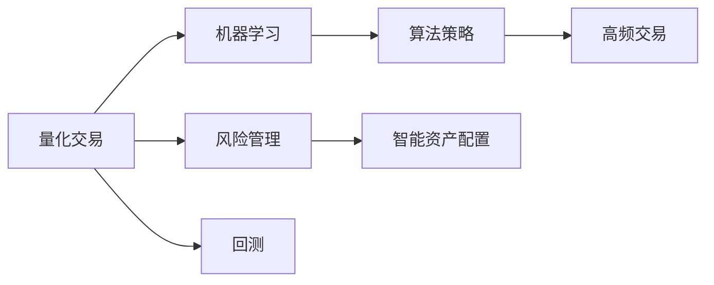

                 

## 1. 背景介绍

### 1.1 问题由来

在未来的2050年，随着科技的飞速发展，人工智能、量子计算、区块链等前沿技术已经深入到金融市场的各个层面。与此同时，人类社会对金融服务的需求也在持续增长。如何高效地投资资产，降低风险，成为了金融行业亟待解决的问题。

在此背景下，量化交易与风险管理技术的融合，成为金融领域的一大热门话题。量化交易基于数学模型、统计分析和算法策略，可以大幅提升交易效率和盈利能力。而风险管理则通过模型构建、量化分析和智能监控，帮助投资者规避风险，实现稳健的资产配置。

### 1.2 问题核心关键点

量化交易与风险管理的关键点在于通过数据驱动的方法，实现交易策略的优化和风险的控制。具体包括以下几个方面：

1. **数据驱动决策**：基于历史和实时数据，构建机器学习模型，预测市场趋势和价格波动。
2. **智能交易算法**：通过设计复杂的算法策略，自动化交易，实现高效率的买卖操作。
3. **风险量化分析**：利用量化手段，对交易风险进行全面评估和监控，制定风险控制策略。
4. **智能资产配置**：根据市场变化，动态调整资产配置，优化投资组合。
5. **模型更新与优化**：持续收集市场数据，实时更新和优化模型，保证模型的有效性和准确性。

这些关键点构成了量化交易与风险管理的核心框架，使得金融市场更加高效、透明和可预测。

### 1.3 问题研究意义

研究量化交易与风险管理技术，对于提升金融市场的运行效率、降低投资风险、促进金融科技创新，具有重要意义：

1. **提升交易效率**：量化交易基于算法策略，可以实现高频交易和自动化执行，大幅提升交易速度和执行效率。
2. **降低投资风险**：通过量化手段，投资者可以更全面地分析市场风险，制定合理的风险控制策略。
3. **促进金融创新**：量化技术为金融市场带来了新的分析工具和交易策略，推动了金融科技的进步。
4. **提高市场透明度**：量化分析可以帮助投资者更好地理解市场变化，增强市场的透明度和公正性。
5. **优化资产配置**：通过智能资产配置，投资者可以更有效地管理投资组合，实现收益最大化。

## 2. 核心概念与联系

### 2.1 核心概念概述

在量化交易与风险管理中，涉及多个关键概念和技术，以下将进行详细阐述：

1. **量化交易（Quantitative Trading）**：基于数学模型和算法策略，自动化进行交易操作，以追求高效和精准的交易决策。
2. **风险管理（Risk Management）**：通过量化手段，对交易风险进行全面评估和监控，制定风险控制策略。
3. **算法策略（Algorithmic Strategy）**：设计用于自动化交易的算法规则，涵盖多种策略类型，如套利、动量、趋势跟踪等。
4. **机器学习（Machine Learning）**：使用数据驱动的方法，训练模型预测市场趋势和风险，优化交易决策。
5. **智能资产配置（Smart Asset Allocation）**：利用量化手段，根据市场变化，动态调整资产配置，优化投资组合。
6. **高频交易（High-Frequency Trading）**：利用计算机算法，在极短的时间内完成大量交易，追求微小的利润空间。
7. **回测（Backtesting）**：对量化策略进行历史数据测试，评估其有效性和稳定性。

这些概念之间存在密切联系，共同构成了量化交易与风险管理的完整框架。

### 2.2 核心概念原理和架构的 Mermaid 流程图



通过上述流程图可以看出，量化交易与风险管理涉及多个环节的协同工作：

1. **量化交易与机器学习**：基于历史和实时数据，使用机器学习模型预测市场趋势和价格波动，生成算法策略。
2. **算法策略与高频交易**：利用设计好的算法策略，进行高频交易，实现自动化交易。
3. **风险管理与智能资产配置**：对交易风险进行量化评估，制定风险控制策略，根据市场变化动态调整资产配置。
4. **回测验证**：对量化策略进行历史数据测试，评估其有效性和稳定性。

这些环节相辅相成，共同支撑量化交易与风险管理的运行。

## 3. 核心算法原理 & 具体操作步骤

### 3.1 算法原理概述

量化交易与风险管理技术的核心在于数据驱动的决策和智能化的风险控制。其基本算法原理包括以下几个方面：

1. **市场预测模型**：通过收集历史和实时市场数据，构建机器学习模型，预测市场趋势和价格波动。常见的模型包括线性回归、支持向量机、神经网络等。
2. **交易策略设计**：基于预测模型，设计算法策略，涵盖多种策略类型，如套利、动量、趋势跟踪等。常见的策略包括均值回归、动量策略、趋势跟踪策略等。
3. **风险量化分析**：通过量化手段，对交易风险进行全面评估和监控，制定风险控制策略。常用的量化指标包括VaR（Value at Risk）、ES（Expected Shortfall）、波动率等。
4. **智能资产配置**：利用量化手段，根据市场变化，动态调整资产配置，优化投资组合。常见的配置方法包括最小方差优化、风险平价配置等。
5. **模型更新与优化**：持续收集市场数据，实时更新和优化模型，保证模型的有效性和准确性。

### 3.2 算法步骤详解

以下是量化交易与风险管理的具体操作步骤：

**Step 1: 数据收集与预处理**

1. **数据源**：收集历史和实时市场数据，涵盖股票、期货、外汇等多种资产。
2. **数据清洗**：对数据进行去重、填补缺失值、标准化等预处理操作。
3. **特征工程**：提取有意义的特征，如价格变化、波动率、交易量等，构建特征向量。

**Step 2: 模型训练与预测**

1. **选择模型**：根据数据特点，选择适合的机器学习模型，如线性回归、决策树、随机森林等。
2. **数据分割**：将数据集分为训练集和测试集，进行交叉验证。
3. **模型训练**：使用训练集数据，训练机器学习模型，生成预测结果。
4. **模型评估**：使用测试集数据，评估模型预测效果，调整模型参数。

**Step 3: 策略设计与回测**

1. **策略设计**：基于预测模型，设计算法策略，涵盖多种策略类型，如套利、动量、趋势跟踪等。
2. **策略回测**：对设计好的策略进行历史数据测试，评估其有效性和稳定性。
3. **参数优化**：通过回测结果，优化策略参数，提高策略的盈利能力。

**Step 4: 风险控制与资产配置**

1. **风险量化**：使用量化手段，对交易风险进行全面评估，计算VaR、ES等风险指标。
2. **风险控制**：根据风险评估结果，制定风险控制策略，设定止损、止盈等条件。
3. **资产配置**：利用量化手段，动态调整资产配置，优化投资组合。

**Step 5: 模型部署与监控**

1. **模型部署**：将训练好的模型和策略部署到交易系统中，实现自动化交易。
2. **实时监控**：实时收集市场数据，持续监控模型预测和交易执行情况。
3. **动态调整**：根据市场变化，动态调整模型参数和策略，优化交易决策。

### 3.3 算法优缺点

量化交易与风险管理技术的优缺点如下：

**优点**：

1. **高效性**：利用计算机算法，实现高频交易和自动化执行，大幅提升交易速度和执行效率。
2. **精准性**：基于数据驱动的决策，提高交易决策的准确性和可靠性。
3. **系统性**：通过系统化的量化分析，提升交易策略的科学性和稳定性。
4. **实时性**：实时监控市场变化，及时调整交易策略，提高风险控制能力。

**缺点**：

1. **数据依赖**：高度依赖历史和实时市场数据，数据质量对模型效果影响较大。
2. **模型风险**：模型构建和训练过程中，可能存在过拟合或模型失效的风险。
3. **技术门槛**：需要较强的数学和编程能力，技术门槛较高。
4. **系统风险**：交易系统复杂性高，可能面临系统故障和网络延迟等问题。

### 3.4 算法应用领域

量化交易与风险管理技术已经在多个领域得到广泛应用：

1. **股票交易**：基于市场预测模型和交易策略，进行股票买卖操作，追求高效盈利。
2. **期货交易**：利用高频交易和高风险策略，捕捉期货市场的套利机会。
3. **外汇交易**：使用量化手段，预测货币汇率变化，进行外汇买卖操作。
4. **债券交易**：通过风险量化分析和智能资产配置，优化债券组合，实现收益最大化。
5. **衍生品交易**：利用复杂算法策略，进行期权、期货等衍生品交易，实现风险对冲和套利。
6. **商品交易**：使用量化手段，分析商品市场变化，进行商品买卖操作。

这些领域的应用，展示了量化交易与风险管理技术的强大生命力和广泛适用性。

## 4. 数学模型和公式 & 详细讲解

### 4.1 数学模型构建

量化交易与风险管理模型的构建，通常基于以下几个数学模型：

1. **线性回归模型**：用于预测市场趋势和价格波动，公式为：
   $$
   y = \beta_0 + \beta_1 x_1 + \beta_2 x_2 + \cdots + \beta_n x_n + \epsilon
   $$
   其中，$y$ 为预测值，$x_i$ 为特征向量，$\beta_i$ 为回归系数，$\epsilon$ 为误差项。

2. **决策树模型**：用于分类市场变化，公式为：
   $$
   T_t = \begin{cases}
   T_{t_1}, & \text{if} \, x_1 > \theta_1 \\
   T_{t_2}, & \text{if} \, x_1 \leq \theta_1
   \end{cases}
   $$
   其中，$T_t$ 为分类结果，$x_1$ 为特征，$\theta_1$ 为决策阈值。

3. **随机森林模型**：用于集成多个决策树，提高预测准确性，公式为：
   $$
   y = \frac{1}{N} \sum_{i=1}^N y_i
   $$
   其中，$y_i$ 为第 $i$ 棵决策树的结果，$N$ 为决策树数量。

4. **神经网络模型**：用于复杂市场预测，公式为：
   $$
   y = \sum_{i=1}^n \omega_i f(x_i + b)
   $$
   其中，$f$ 为激活函数，$\omega_i$ 为权重，$b$ 为偏置。

### 4.2 公式推导过程

以下以线性回归模型为例，详细推导其公式：

1. **最小二乘法（Least Squares）**：最小化预测误差平方和，求解回归系数，公式为：
   $$
   \beta = (X^TX)^{-1}X^Ty
   $$
   其中，$X$ 为特征矩阵，$y$ 为样本向量，$\beta$ 为回归系数。

2. **正则化最小二乘法（Ridge Regression）**：加入正则化项，防止过拟合，公式为：
   $$
   \beta = (X^TX + \lambda I)^{-1}X^Ty
   $$
   其中，$I$ 为单位矩阵，$\lambda$ 为正则化系数。

3. **偏最小二乘法（Partial Least Squares）**：通过主成分分析，降低特征维度，公式为：
   $$
   \beta = P_w^{-1}P_b P_w^T X^T y
   $$
   其中，$P_w$ 和 $P_b$ 为主成分矩阵。

### 4.3 案例分析与讲解

以股票交易中的线性回归模型为例，进行详细分析：

1. **模型构建**：假设已知股票价格 $y$ 和历史数据 $x_1, x_2, \cdots, x_n$，使用线性回归模型预测未来价格。
2. **数据准备**：收集历史数据，提取特征，如交易量、市值、财务指标等。
3. **模型训练**：使用历史数据训练模型，求解回归系数 $\beta$。
4. **预测验证**：使用测试数据验证模型预测效果，计算均方误差（MSE）和决定系数（R²）。
5. **策略回测**：根据模型预测结果，设计交易策略，进行历史回测，评估策略盈利能力。
6. **参数优化**：通过回测结果，调整模型参数，如正则化系数 $\lambda$，优化模型预测效果。

## 5. 项目实践：代码实例和详细解释说明

### 5.1 开发环境搭建

在进行量化交易与风险管理实践前，需要准备好开发环境。以下是使用Python进行Python代码编写和部署的环境配置流程：

1. **安装Python**：从官网下载并安装最新版本的Python。
2. **创建虚拟环境**：使用`virtualenv`或`conda`创建Python虚拟环境。
3. **安装依赖库**：安装必要的依赖库，如Pandas、NumPy、Scikit-Learn、TensorFlow等。
4. **安装交易平台API**：根据交易平台，安装对应的API库，如Interactive Brokers API、Alpaca API等。

完成上述步骤后，即可在虚拟环境中进行量化交易与风险管理开发。

### 5.2 源代码详细实现

下面以股票交易中的线性回归模型为例，给出使用Python实现的量化交易代码：

```python
import pandas as pd
from sklearn.linear_model import LinearRegression
from sklearn.metrics import mean_squared_error

# 加载数据
data = pd.read_csv('stock_data.csv')

# 数据预处理
X = data[['Volume', 'Market_Cap', 'EPS']] # 特征向量
y = data['Price'] # 目标变量

# 模型训练
model = LinearRegression()
model.fit(X, y)

# 预测验证
test_data = pd.read_csv('test_data.csv')
X_test = test_data[['Volume', 'Market_Cap', 'EPS']]
y_pred = model.predict(X_test)

# 计算均方误差
mse = mean_squared_error(y_test, y_pred)
print('均方误差：', mse)

# 交易策略设计
def trading_strategy(model, X, y, threshold=0.1):
    preds = model.predict(X)
    buy_signals = preds > threshold
    sell_signals = preds < threshold
    return buy_signals, sell_signals

# 回测
def backtest(strategy, X, y, N=1000):
    buy_signals, sell_signals = strategy(X, y)
    start_money = 10000
    result = []
    for i in range(N):
        if buy_signals[i]:
            price = X.iloc[i]['Price']
            invest = min(price, start_money)
            start_money -= invest
            result.append((price, invest))
        elif sell_signals[i]:
            price = X.iloc[i]['Price']
            start_money += price * result[-1][1]
            result.append((price, -result[-1][1]))
    return pd.DataFrame(result)

# 参数优化
def optimize_params(X, y, params):
    mse = []
    for lambda_ in params['lambda']:
        model = LinearRegression(alpha=lambda_)
        model.fit(X, y)
        y_pred = model.predict(X_test)
        mse.append(mean_squared_error(y_test, y_pred))
    return params['lambda'][mse.index(min(mse))]

# 使用示例
params = {'lambda': [0.01, 0.1, 1]}
best_params = optimize_params(X, y, params)
X = X.drop(['Price'], axis=1)
model = LinearRegression(alpha=best_params)
model.fit(X, y)
test_data = pd.read_csv('test_data.csv')
X_test = test_data.drop(['Price'], axis=1)
y_pred = model.predict(X_test)
```

### 5.3 代码解读与分析

让我们再详细解读一下关键代码的实现细节：

**数据加载与预处理**：
- `pd.read_csv`：使用Pandas库读取CSV文件，加载历史和测试数据。
- `X = data[['Volume', 'Market_Cap', 'EPS']]`：提取特征向量，包括交易量、市值、EPS等。
- `y = data['Price']`：提取目标变量，即股票价格。

**模型训练与验证**：
- `model = LinearRegression()`：初始化线性回归模型。
- `model.fit(X, y)`：使用历史数据训练模型。
- `y_pred = model.predict(X_test)`：使用训练好的模型预测测试数据。
- `mean_squared_error(y_test, y_pred)`：计算预测值和真实值之间的均方误差。

**交易策略设计**：
- `def trading_strategy(model, X, y, threshold=0.1)`：定义交易策略函数，根据模型预测结果设计买入和卖出信号。
- `buy_signals = preds > threshold`：根据预测结果生成买入信号。
- `sell_signals = preds < threshold`：根据预测结果生成卖出信号。

**回测**：
- `def backtest(strategy, X, y, N=1000)`：定义回测函数，模拟交易过程，生成回测结果。
- `start_money = 10000`：初始资金。
- `result = []`：回测结果列表。
- `if buy_signals[i]`：根据买入信号进行买卖操作。
- `start_money -= invest`：卖出股票，扣除资金。
- `start_money += price * result[-1][1]`：买入股票，补回资金。

**参数优化**：
- `def optimize_params(X, y, params)`：定义参数优化函数，计算不同正则化系数下的均方误差。
- `mse = []`：均方误差列表。
- `for lambda_ in params['lambda']`：遍历不同的正则化系数。
- `model = LinearRegression(alpha=lambda_)`：使用不同正则化系数训练模型。
- `y_pred = model.predict(X_test)`：预测测试数据。
- `mse.append(mean_squared_error(y_test, y_pred))`：计算均方误差，加入列表。

以上代码展示了量化交易与风险管理的基本流程：数据加载、模型训练、策略设计、回测和参数优化。开发者可以根据具体需求，进一步完善和优化模型和策略。

## 6. 实际应用场景

### 6.1 智能投资平台

在未来的智能投资平台中，量化交易与风险管理技术将发挥重要作用：

1. **市场预测**：基于历史和实时市场数据，构建机器学习模型，预测市场趋势和价格波动，指导投资决策。
2. **交易策略**：使用设计好的交易策略，自动化进行买卖操作，追求高效盈利。
3. **风险控制**：通过量化手段，对交易风险进行全面评估，制定风险控制策略，保障资产安全。
4. **智能配置**：利用量化手段，动态调整资产配置，优化投资组合，实现收益最大化。
5. **模型更新**：持续收集市场数据，实时更新和优化模型，保证模型的有效性和准确性。

### 6.2 私募基金管理

私募基金管理公司将大量采用量化交易与风险管理技术：

1. **策略优化**：通过数据驱动的方法，优化交易策略，提升投资回报率。
2. **风险管理**：利用量化手段，全面评估交易风险，制定风险控制策略，降低投资风险。
3. **动态调整**：根据市场变化，动态调整资产配置，优化投资组合，实现收益最大化。
4. **智能决策**：使用人工智能技术，辅助基金经理做出更科学的投资决策。

### 6.3 量化金融顾问

量化金融顾问将为个人投资者提供个性化的投资建议：

1. **市场分析**：基于历史和实时数据，构建机器学习模型，预测市场趋势和价格波动，提供市场分析报告。
2. **策略推荐**：根据投资者风险偏好，设计适合的交易策略，提供投资建议。
3. **风险控制**：通过量化手段，评估投资风险，制定风险控制策略，确保投资安全。
4. **资产配置**：利用量化手段，动态调整资产配置，优化投资组合，实现收益最大化。

### 6.4 未来应用展望

展望未来，量化交易与风险管理技术将呈现以下几个发展趋势：

1. **深度学习应用**：引入深度学习技术，提高模型的预测准确性和泛化能力。
2. **多模态融合**：融合文本、图像、语音等多种数据类型，提升模型的全面性和鲁棒性。
3. **实时交易**：利用高速通信和计算技术，实现高频交易和实时决策。
4. **边缘计算**：将计算任务分布到边缘设备，降低数据传输延迟，提高系统响应速度。
5. **AI金融顾问**：结合人工智能技术，提供个性化的投资建议和风险管理服务。

## 7. 工具和资源推荐

### 7.1 学习资源推荐

为了帮助开发者系统掌握量化交易与风险管理技术的理论基础和实践技巧，这里推荐一些优质的学习资源：

1. **《量化交易策略》（Quantitative Trading Strategies）**：这本书详细介绍了多种量化交易策略，涵盖股票、期货、外汇等多种资产。
2. **《Python for Quantitative Finance》**：这本书介绍了如何使用Python进行量化金融分析，包括数据处理、模型构建、策略设计等。
3. **Coursera《Quantitative Finance》课程**：Coursera平台上的量化金融课程，涵盖市场预测、交易策略、风险管理等多个方面。
4. **Kaggle量化金融竞赛**：Kaggle平台上的量化金融竞赛，提供大量数据集和模型，供开发者学习和实践。
5. **QuantConnect社区**：QuantConnect社区是一个量化交易的学习平台，提供丰富的量化交易资源和交流渠道。

通过对这些资源的学习实践，相信你一定能够快速掌握量化交易与风险管理技术的精髓，并用于解决实际的金融问题。

### 7.2 开发工具推荐

高效的开发离不开优秀的工具支持。以下是几款用于量化交易与风险管理开发的常用工具：

1. **PyTorch**：基于Python的深度学习框架，支持高效的数据处理和模型训练。
2. **TensorFlow**：由Google主导开发的深度学习框架，适合大规模工程应用。
3. **Scikit-Learn**：Python机器学习库，提供丰富的机器学习算法和工具。
4. **Pandas**：Python数据处理库，支持高效的数据加载、清洗和分析。
5. **NumPy**：Python科学计算库，支持高效的数据处理和数学运算。
6. **Qlib**：量化交易框架，提供丰富的量化交易工具和库。

合理利用这些工具，可以显著提升量化交易与风险管理开发的效率，加快创新迭代的步伐。

### 7.3 相关论文推荐

量化交易与风险管理技术的发展源于学界的持续研究。以下是几篇奠基性的相关论文，推荐阅读：

1. **“Machine Learning in Finance”（机器学习在金融中的应用）**：这篇论文综述了机器学习在金融中的应用，包括市场预测、信用评估、欺诈检测等多个方面。
2. **“Quantitative Trading: How to Build Your Own Algorithmic Trading Business”**：这本书详细介绍了量化交易的构建和运营，涵盖数据采集、模型构建、策略设计等多个环节。
3. **“Algorithms for Trading: Winning Strategies and Their Rationale”**：这本书介绍了多种量化交易策略，涵盖套利、动量、趋势跟踪等。
4. **“Quantitative Finance: Theory, Algorithms, and Computations”**：这本书介绍了量化金融的基本理论和实践技术，涵盖市场预测、交易策略、风险管理等多个方面。
5. **“Portfolio Optimization with Risk Constraints”**：这篇论文介绍了多目标优化在资产配置中的应用，探讨了风险控制和收益最大化的平衡。

这些论文代表了大量化交易与风险管理技术的发展脉络。通过学习这些前沿成果，可以帮助研究者把握学科前进方向，激发更多的创新灵感。

## 8. 总结：未来发展趋势与挑战

### 8.1 研究成果总结

量化交易与风险管理技术的综合应用，已经成为金融市场的重要组成部分。通过数据驱动的方法，显著提升了投资效率和风险管理能力。目前，该技术在多个领域得到了广泛应用，包括股票、期货、外汇、债券、商品等多个资产类别。

### 8.2 未来发展趋势

展望未来，量化交易与风险管理技术将呈现以下几个发展趋势：

1. **深度学习应用**：引入深度学习技术，提高模型的预测准确性和泛化能力。
2. **多模态融合**：融合文本、图像、语音等多种数据类型，提升模型的全面性和鲁棒性。
3. **实时交易**：利用高速通信和计算技术，实现高频交易和实时决策。
4. **边缘计算**：将计算任务分布到边缘设备，降低数据传输延迟，提高系统响应速度。
5. **AI金融顾问**：结合人工智能技术，提供个性化的投资建议和风险管理服务。

### 8.3 面临的挑战

尽管量化交易与风险管理技术已经取得了显著进展，但在迈向更加智能化、普适化应用的过程中，它仍面临着诸多挑战：

1. **数据依赖**：高度依赖历史和实时市场数据，数据质量对模型效果影响较大。
2. **模型风险**：模型构建和训练过程中，可能存在过拟合或模型失效的风险。
3. **技术门槛**：需要较强的数学和编程能力，技术门槛较高。
4. **系统风险**：交易系统复杂性高，可能面临系统故障和网络延迟等问题。
5. **伦理风险**：交易策略可能存在不公平性，需要关注伦理和道德问题。

### 8.4 研究展望

面向未来，量化交易与风险管理技术还需要在其他领域寻求新的突破：

1. **区块链技术**：结合区块链技术，提升交易的透明性和安全性。
2. **自然语言处理**：利用自然语言处理技术，提供更自然的交易接口和风险评估。
3. **智能合约**：结合智能合约技术，实现自动化的交易执行和风险控制。
4. **人工智能**：结合人工智能技术，提供更智能化的交易策略和风险管理服务。

通过持续的研究和创新，量化交易与风险管理技术必将进一步提升金融市场的运行效率和风险管理能力，推动金融科技的进步。

## 9. 附录：常见问题与解答

**Q1：量化交易与风险管理技术是否适用于所有金融资产？**

A: 量化交易与风险管理技术适用于大部分金融资产，包括股票、期货、外汇、债券、商品等。但对于一些特殊资产，如加密货币等，可能存在数据获取和模型构建的难度。

**Q2：量化交易与风险管理技术如何降低投资风险？**

A: 量化交易与风险管理技术通过全面评估市场风险，制定合理的风险控制策略，降低投资风险。具体方法包括：
1. **风险量化**：使用量化手段，评估交易风险，计算VaR、ES等风险指标。
2. **风险控制**：根据风险评估结果，制定止损、止盈等条件，防止过度风险暴露。
3. **资产配置**：利用量化手段，动态调整资产配置，分散投资风险。

**Q3：量化交易与风险管理技术是否适用于高频交易？**

A: 量化交易与风险管理技术适用于高频交易，通过设计高效的算法策略和实时监控系统，可以大幅提升交易速度和执行效率。但高频交易对系统延迟和计算能力有较高要求，需要优化系统架构和算法设计。

**Q4：量化交易与风险管理技术是否适用于非线性资产？**

A: 量化交易与风险管理技术对非线性资产的处理能力有限。非线性资产如期权、期货等，其价格变化具有非线性特性，需要引入复杂的定价模型和风险管理策略。

**Q5：量化交易与风险管理技术是否适用于新兴市场？**

A: 量化交易与风险管理技术在处理新兴市场时面临更多挑战。新兴市场数据质量较低，市场变化复杂多变，需要更复杂的模型和策略。

---

作者：禅与计算机程序设计艺术 / Zen and the Art of Computer Programming

