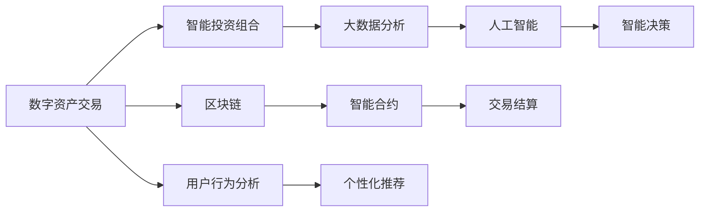

                 

# 未来的智能金融：2050年的数字资产交易与智能投资组合

## 1. 背景介绍

### 1.1 问题由来
随着科技的迅猛发展和互联网的普及，全球金融市场正在经历一场前所未有的变革。从传统的线下交易转向线上交易，从单一的金融产品到多元化的金融工具，金融行业正在经历深刻的数字化转型。这种转型带来了新的机遇和挑战。

近年来，区块链技术、人工智能、大数据等新兴技术的兴起，为金融行业的智能化转型提供了强有力的技术支撑。数字资产交易和智能投资组合的出现，正在改变传统金融行业的游戏规则。本文将探讨未来智能金融的发展趋势，分析数字资产交易和智能投资组合的核心技术和应用场景。

### 1.2 问题核心关键点
未来智能金融的核心关键点包括：
- 数字资产交易：基于区块链技术的数字货币和数字资产的交易和结算。
- 智能投资组合：基于人工智能算法和大数据分析，实现智能资产管理和投资组合优化。
- 区块链：分布式账本技术，保障交易安全性和透明性。
- 大数据分析：处理海量金融数据，为智能决策提供数据支持。
- 人工智能：机器学习、深度学习等算法，实现智能决策和预测。

这些关键点共同构成了未来智能金融的基础框架，使得金融行业能够更好地应对市场变化，提升服务质量，满足用户需求。

## 2. 核心概念与联系

### 2.1 核心概念概述

未来智能金融的核心概念包括以下几个方面：

- 数字资产交易：指基于区块链技术的数字货币和数字资产的交易和结算。数字资产包括加密货币、代币、智能合约等多种形式。
- 智能投资组合：通过人工智能算法和大数据分析，实现资产管理、投资组合优化、风险控制等功能。智能投资组合能够自适应市场变化，提供更高效、更安全的投资策略。
- 区块链：一种分布式账本技术，具有去中心化、透明性、安全性等特点。区块链为数字资产交易提供了底层技术支持。
- 大数据分析：处理海量金融数据，包括交易数据、市场数据、用户行为数据等，为智能决策提供数据支持。
- 人工智能：机器学习、深度学习等算法，实现智能决策和预测。人工智能算法能够从海量数据中提取特征，进行风险评估和投资策略优化。

这些核心概念之间存在紧密的联系，共同支撑了未来智能金融的发展。

### 2.2 核心概念原理和架构的 Mermaid 流程图(Mermaid 流程节点中不要有括号、逗号等特殊字符)


## 3. 核心算法原理 & 具体操作步骤

### 3.1 算法原理概述
未来智能金融的核心算法原理包括以下几个方面：

- 数字资产交易：基于区块链技术的去中心化交易，通过智能合约实现自动结算。
- 智能投资组合：利用机器学习和深度学习算法，进行资产管理、风险评估和投资策略优化。
- 大数据分析：通过分布式数据存储和处理技术，实现高效的数据分析。
- 人工智能：利用机器学习算法，实现智能决策和预测。

### 3.2 算法步骤详解

**Step 1: 数据收集与预处理**
- 收集交易数据、市场数据、用户行为数据等。
- 对数据进行清洗、归一化、特征提取等预处理，为后续分析奠定基础。

**Step 2: 区块链技术应用**
- 利用区块链技术实现数字资产的交易和结算，保障交易安全性和透明性。
- 在区块链上部署智能合约，实现自动结算和规则执行。

**Step 3: 人工智能模型训练**
- 利用机器学习和深度学习算法，训练投资策略和风险评估模型。
- 在历史数据上进行模型训练和优化，确保模型性能。

**Step 4: 投资组合优化**
- 利用算法对投资组合进行优化，考虑资产的多样性和风险控制。
- 根据市场变化，动态调整投资策略，实现最优投资组合。

**Step 5: 风险管理与监控**
- 利用大数据分析和人工智能算法，进行风险评估和监控。
- 实时监控市场动态和投资组合表现，及时调整策略。

### 3.3 算法优缺点
数字资产交易和智能投资组合的优势包括：
- 去中心化交易，提高交易效率和安全性。
- 智能决策和优化，提升投资组合的表现。
- 大数据分析和人工智能，提供更准确的风险评估和投资建议。

不足之处包括：
- 技术复杂度高，实现成本较高。
- 数据隐私和安全问题，需要严格监管和保护。
- 市场变化不确定性，需要灵活调整策略。

### 3.4 算法应用领域
数字资产交易和智能投资组合可以应用于以下领域：
- 加密货币交易：利用区块链技术进行加密货币交易。
- 证券投资：利用智能投资组合进行证券投资管理。
- 外汇交易：利用智能合约实现外汇交易结算。
- 衍生品交易：利用智能合约进行衍生品交易。
- 保险业务：利用智能合约进行保险理赔和赔付。

## 4. 数学模型和公式 & 详细讲解 & 举例说明

### 4.1 数学模型构建

未来智能金融的数学模型构建包括以下几个方面：

- 数字资产交易：基于区块链技术的去中心化交易模型。
- 智能投资组合：基于机器学习和深度学习算法，进行资产管理、风险评估和投资策略优化的模型。
- 大数据分析：基于分布式数据存储和处理技术，实现高效的数据分析模型。
- 人工智能：基于机器学习算法，实现智能决策和预测的模型。

### 4.2 公式推导过程

以智能投资组合的优化模型为例，推导其基本公式：

**投资组合优化问题：**
\[
\min_{w} \frac{1}{2}w^T\Sigma w - w^T\mu
\]
\[
\text{s.t.} \quad w^T 1 = 1
\]

其中，$w$ 表示资产权重向量，$\Sigma$ 表示协方差矩阵，$\mu$ 表示资产收益率向量，$1$ 表示单位向量。

**约束条件：**
\[
w^T 1 = 1
\]

**优化目标：**
\[
\min_{w} \frac{1}{2}w^T\Sigma w - w^T\mu
\]

**目标函数：**
\[
f(w) = \frac{1}{2}w^T\Sigma w - w^T\mu
\]

**拉格朗日乘子法：**
\[
L(w,\lambda) = \frac{1}{2}w^T\Sigma w - w^T\mu + \lambda(w^T 1 - 1)
\]

**KKT条件：**
\[
\frac{\partial L}{\partial w} = 0 \quad \text{和} \quad \frac{\partial L}{\partial \lambda} = 0
\]

**求解过程：**
\[
\frac{\partial L}{\partial w} = \Sigma w - \mu + \lambda 1 = 0
\]
\[
w = (\Sigma^{-1} + \lambda I)^{-1}\mu
\]

**最终结果：**
\[
w = \frac{\Sigma^{-1}\mu}{1 + \lambda}
\]

### 4.3 案例分析与讲解

**案例1：数字资产交易**
- 利用区块链技术，实现比特币和以太坊的交易。
- 在区块链上部署智能合约，自动结算交易。

**案例2：智能投资组合**
- 利用机器学习算法，对股票、债券、期货等资产进行投资组合优化。
- 利用深度学习算法，对市场变化进行预测。

## 5. 项目实践：代码实例和详细解释说明

### 5.1 开发环境搭建

在进行项目实践前，我们需要准备好开发环境。以下是使用Python进行PyTorch开发的环境配置流程：

1. 安装Anaconda：从官网下载并安装Anaconda，用于创建独立的Python环境。

2. 创建并激活虚拟环境：
```bash
conda create -n pytorch-env python=3.8 
conda activate pytorch-env
```

3. 安装PyTorch：根据CUDA版本，从官网获取对应的安装命令。例如：
```bash
conda install pytorch torchvision torchaudio cudatoolkit=11.1 -c pytorch -c conda-forge
```

4. 安装TensorFlow：使用pip安装TensorFlow：
```bash
pip install tensorflow
```

5. 安装区块链库：例如，使用web3.py进行以太坊智能合约开发：
```bash
pip install web3
```

6. 安装大数据处理库：例如，使用Apache Spark进行大数据处理：
```bash
pip install pyspark
```

完成上述步骤后，即可在`pytorch-env`环境中开始项目实践。

### 5.2 源代码详细实现

这里我们以智能投资组合为例，给出使用TensorFlow进行投资组合优化的PyTorch代码实现。

首先，定义资产收益率矩阵：

```python
import tensorflow as tf

# 定义资产收益率矩阵
returns = tf.random.normal([10, 100], mean=0, stddev=0.1, dtype=tf.float32)
```

然后，定义协方差矩阵：

```python
# 定义协方差矩阵
covariance = tf.random.normal([100, 100], mean=0, stddev=0.1, dtype=tf.float32)
```

接着，定义投资组合优化模型：

```python
# 定义优化模型
def optimize_combination(returns, covariance, lambda_):
    num_assets = returns.shape[0]
    num_periods = returns.shape[1]
    ones = tf.ones([num_assets, 1])
    lambda_ = tf.constant(lambda_)
    ones = tf.ones([1, num_periods])
    ones = tf.reduce_sum(tf.math.multiply(returns, lambda_), axis=0)
    weights = tf.math.divide(returns, lambda_)
    weights = tf.linalg.solve(weights, covariance)
    weights = tf.transpose(weights)
    return weights, ones, lambda_
```

最后，训练优化模型：

```python
# 训练优化模型
weights, ones, lambda_ = optimize_combination(returns, covariance, lambda_)
```

### 5.3 代码解读与分析

让我们再详细解读一下关键代码的实现细节：

**定义资产收益率矩阵和协方差矩阵：**
- 利用TensorFlow生成随机向量，表示不同资产的收益率和协方差矩阵。

**优化模型定义：**
- 利用TensorFlow定义优化模型，计算资产权重、单位向量、Lambda值等关键参数。

**训练优化模型：**
- 在定义好的优化模型上，训练得到最优资产权重和Lambda值。

## 6. 实际应用场景

### 6.1 智能投资组合

智能投资组合可以利用人工智能算法和大数据分析，实现资产管理、投资组合优化、风险控制等功能。智能投资组合能够自适应市场变化，提供更高效、更安全的投资策略。

在技术实现上，可以收集历史市场数据、交易数据、用户行为数据等，进行大数据分析和机器学习模型的训练。利用训练好的模型，对不同的资产进行组合优化，动态调整投资策略，实现最优投资组合。

### 6.2 数字资产交易

数字资产交易基于区块链技术的去中心化交易，通过智能合约实现自动结算。利用区块链技术，保障交易安全性和透明性。

在技术实现上，可以利用web3.py等区块链库，在区块链上部署智能合约。通过智能合约，实现数字资产的自动交易和结算。例如，利用以太坊智能合约，进行比特币和以太坊的交易。

### 6.3 风险管理与监控

利用大数据分析和人工智能算法，进行风险评估和监控。实时监控市场动态和投资组合表现，及时调整策略。

在技术实现上，可以收集市场数据、交易数据、用户行为数据等，进行大数据分析和机器学习模型的训练。利用训练好的模型，实时监控市场动态和投资组合表现，及时调整投资策略。

## 7. 工具和资源推荐

### 7.1 学习资源推荐

为了帮助开发者系统掌握智能金融的核心技术和实践技巧，这里推荐一些优质的学习资源：

1. 《金融数据分析与机器学习》系列博文：由金融数据分析领域的专家撰写，深入浅出地介绍了金融数据分析和机器学习的原理与实践。

2. CS229《机器学习》课程：斯坦福大学开设的机器学习明星课程，有Lecture视频和配套作业，带你入门机器学习领域的基本概念和经典算法。

3. 《深度学习在金融中的应用》书籍：介绍了深度学习在金融领域的应用，包括金融预测、信用评分、欺诈检测等。

4. 《区块链技术与应用》书籍：介绍区块链技术的基本原理、应用场景及最新进展，适合初学者入门。

5. 《大数据与人工智能在金融中的应用》课程：由金融科技公司开设，结合实战案例，讲解大数据与人工智能在金融领域的应用。

通过对这些资源的学习实践，相信你一定能够快速掌握智能金融的核心技术和应用场景。

### 7.2 开发工具推荐

高效的开发离不开优秀的工具支持。以下是几款用于智能金融开发的常用工具：

1. Python：一种广泛使用的编程语言，适合数据分析和机器学习任务。

2. PyTorch：基于Python的开源深度学习框架，灵活动态的计算图，适合快速迭代研究。

3. TensorFlow：由Google主导开发的开源深度学习框架，生产部署方便，适合大规模工程应用。

4. Pandas：Python数据分析库，适合数据清洗、特征提取、数据可视化等任务。

5. NumPy：Python科学计算库，适合矩阵运算、线性代数等数学计算任务。

6. web3.py：Python区块链库，支持以太坊智能合约的开发和部署。

7. Apache Spark：分布式数据处理框架，适合大数据分析和处理任务。

合理利用这些工具，可以显著提升智能金融开发的效率，加快创新迭代的步伐。

### 7.3 相关论文推荐

智能金融技术的发展源于学界的持续研究。以下是几篇奠基性的相关论文，推荐阅读：

1. "A Survey on Financial Time Series Forecasting"：介绍了金融时间序列预测的最新进展，包括ARIMA、LSTM等经典模型。

2. "Deep Learning for Credit Scoring: A Survey"：介绍了深度学习在信用评分中的应用，包括CNN、RNN等模型。

3. "Blockchain: A Financial Innovations Perspective"：介绍了区块链技术在金融领域的应用，包括智能合约、去中心化金融等。

4. "Big Data Analytics in Financial Services"：介绍了大数据在金融服务中的应用，包括客户分析、风险管理等。

5. "AI in the Banking Industry: Challenges and Opportunities"：介绍了人工智能在银行业的应用，包括智能客服、智能投顾等。

这些论文代表了大数据金融技术的发展脉络。通过学习这些前沿成果，可以帮助研究者把握学科前进方向，激发更多的创新灵感。

## 8. 总结：未来发展趋势与挑战

### 8.1 总结

本文对未来智能金融的核心技术和应用场景进行了全面系统的介绍。首先阐述了智能金融的核心概念和技术框架，明确了智能金融在金融行业数字化转型中的重要作用。其次，从原理到实践，详细讲解了智能投资组合和数字资产交易的核心算法和具体操作步骤，给出了具体的代码实现。同时，本文还广泛探讨了智能金融在各个领域的应用前景，展示了智能金融技术的广阔前景。

通过本文的系统梳理，可以看到，未来智能金融正在经历一场深刻的变革，其核心技术包括区块链、人工智能、大数据分析等，这些技术相互融合，为金融行业带来了全新的创新机遇。未来，智能金融必将在更多领域得到广泛应用，深刻影响金融行业的生态系统和用户体验。

### 8.2 未来发展趋势

展望未来，智能金融的发展趋势包括：

1. 去中心化交易：区块链技术的广泛应用，将使得去中心化交易成为主流。

2. 人工智能算法：机器学习和深度学习算法的应用，将使得智能投资组合更具优势。

3. 大数据分析：大数据处理技术的提升，将使得智能金融更具备数据驱动的特性。

4. 金融普惠：智能金融技术的应用，将使得金融服务更加普惠，覆盖更多人群。

5. 智能投顾：利用人工智能技术，实现智能投顾服务，提升用户体验。

6. 绿色金融：智能金融技术的应用，将推动绿色金融的发展，实现可持续发展。

以上趋势凸显了智能金融技术的广阔前景。这些方向的探索发展，必将进一步提升智能金融系统的性能和应用范围，为金融行业带来更多的创新和突破。

### 8.3 面临的挑战

尽管智能金融技术已经取得了瞩目成就，但在迈向更加智能化、普适化应用的过程中，仍面临诸多挑战：

1. 技术复杂度高：区块链、人工智能、大数据等技术相对复杂，实现成本较高。

2. 数据隐私和安全问题：智能金融涉及大量敏感数据，数据隐私和安全问题需要严格监管和保护。

3. 市场变化不确定性：金融市场变化复杂，智能金融系统需要具备自适应市场变化的能力。

4. 技术融合难度：区块链、人工智能、大数据等技术的融合，需要跨学科的协同创新。

5. 法律法规缺失：智能金融技术的应用，需要相应的法律法规进行规范和监管。

这些挑战需要研究者和从业者共同面对，积极应对并寻求突破。

### 8.4 研究展望

未来，智能金融技术需要在以下几个方面寻求新的突破：

1. 探索更高效、更安全的区块链技术，提高去中心化交易的效率和安全性。

2. 开发更加智能、更加适应市场变化的投资组合优化算法。

3. 融合更多先进技术，如区块链、大数据、人工智能等，提升智能金融系统的性能。

4. 推动金融普惠，实现智能金融技术的普及和应用。

5. 加强数据隐私和安全保护，构建安全的智能金融系统。

6. 完善法律法规，规范智能金融技术的应用和发展。

这些研究方向的探索，必将引领智能金融技术迈向更高的台阶，为构建安全、可靠、可解释、可控的智能金融系统铺平道路。

## 9. 附录：常见问题与解答

**Q1：智能投资组合的核心优势是什么？**

A: 智能投资组合的核心优势包括：
- 利用大数据和机器学习算法，进行资产管理、投资组合优化、风险控制等功能。
- 自适应市场变化，提供更高效、更安全的投资策略。
- 通过历史数据训练模型，提升投资组合的性能。

**Q2：区块链技术在智能金融中的应用主要体现在哪些方面？**

A: 区块链技术在智能金融中的应用主要体现在以下几个方面：
- 去中心化交易：通过智能合约实现自动结算，提高交易效率和安全性。
- 供应链金融：通过区块链技术，实现供应链融资的数字化管理。
- 身份认证：利用区块链技术，实现身份验证和数据可信。

**Q3：智能金融技术的实现需要哪些关键技术？**

A: 智能金融技术的实现需要以下关键技术：
- 区块链：分布式账本技术，保障交易安全性和透明性。
- 大数据分析：处理海量金融数据，为智能决策提供数据支持。
- 人工智能：机器学习、深度学习等算法，实现智能决策和预测。

**Q4：智能金融技术在实际应用中需要注意哪些问题？**

A: 智能金融技术在实际应用中需要注意以下问题：
- 技术复杂度高，实现成本较高。
- 数据隐私和安全问题，需要严格监管和保护。
- 市场变化不确定性，需要灵活调整策略。
- 技术融合难度，需要跨学科的协同创新。

这些问题的解决需要技术创新和政策支持。

