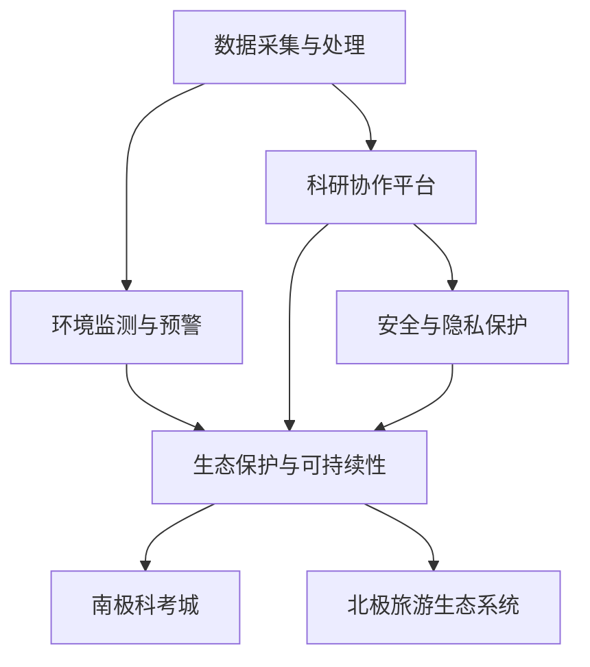

                 

# 未来的极地探索：2050年的南极科考城与北极旅游

> 关键词：极地探索，2050年，南极科考城，北极旅游，人工智能，大数据，物联网，未来城市，生态保护

## 1. 背景介绍

### 1.1 问题由来
随着全球气候变暖的加剧，极地地区受到的影响尤为显著。2050年，极地将成为人类探索和研究的新热点。极地环境恶劣、资源丰富，蕴藏着丰富的科学秘密和商业机会。然而，极地独特的生态环境和复杂的政治因素，使得开发和探索极具挑战性。

在此背景下，本文旨在探索2050年极地探索的全新方式：构建基于人工智能、大数据和物联网技术的南极科考城和北极旅游生态系统。通过先进的科技手段，不仅能够高效地进行科学研究，还能够在保护生态环境的同时，开发旅游和商业资源。

### 1.2 问题核心关键点
构建极地探索生态系统，需要解决以下核心问题：
1. **数据采集与管理**：实时采集极地环境数据，存储和处理大规模数据。
2. **环境监测与预警**：利用先进传感器和数据分析技术，监测环境变化，及时预警极端天气。
3. **科研协作与资源共享**：通过高效的科研协作平台，实现资源共享与信息交流。
4. **极地生态保护**：确保极地生态系统的可持续发展，避免人类活动对其造成的破坏。
5. **安全与隐私保护**：保护极地探险者和工作人员的安全，确保数据隐私和安全。

本文将从数据采集、环境监测、科研协作、生态保护和安全隐私等角度，详细阐述构建极地探索生态系统的关键技术和方法。

### 1.3 问题研究意义
极地探索的科技创新，不仅能够推动科学研究进步，还为全球气候变化研究提供了重要数据。同时，开发极地旅游生态系统，能够创造新的经济增长点，带动相关产业链的发展。这些创新技术和方法的探索，具有以下重要意义：
1. **科学研究价值**：为全球气候变化研究提供数据支持，推动气候科学和环境科学的发展。
2. **经济价值**：开发极地旅游资源，促进相关产业的发展，带动经济增长。
3. **环保价值**：通过科技手段保护极地生态，实现可持续发展。
4. **社会价值**：提高公众对极地环境保护的意识，推动全球环境保护事业。

## 2. 核心概念与联系

### 2.1 核心概念概述

为更好地理解极地探索生态系统的构建，本节将介绍几个密切相关的核心概念：

- **极地探索生态系统**：基于人工智能、大数据和物联网技术的极地探索系统，包括数据采集、环境监测、科研协作、生态保护和安全隐私保护等关键功能。
- **南极科考城**：基于人工智能和大数据的南极科考站，支持科学研究、数据分析和资源共享。
- **北极旅游生态系统**：利用物联网和人工智能技术的北极旅游平台，提供安全、环保、高效的旅游服务。
- **数据采集与处理**：通过传感器和卫星数据采集极地环境数据，使用大数据技术进行存储、分析和可视化。
- **环境监测与预警**：利用机器学习和深度学习技术，实时监测极地环境变化，提前预警极端天气。
- **科研协作平台**：构建开放、共享的科研协作网络，促进科学家之间的合作和知识交流。
- **生态保护与可持续性**：通过智能监控和数据分析，保护极地生态系统，实现可持续发展。
- **安全与隐私保护**：利用区块链和加密技术，保护极地探险者和工作人员的安全，确保数据隐私和安全。

这些核心概念之间的逻辑关系可以通过以下Mermaid流程图来展示：



这个流程图展示了极地探索生态系统的核心组件及其之间的关系：

1. 数据采集与处理提供实时环境数据。
2. 环境监测与预警实时监测并预警极地环境变化。
3. 科研协作平台促进科研人员合作，共享数据和知识。
4. 生态保护与可持续性确保极地生态系统的可持续发展。
5. 安全与隐私保护保障探险者安全，保护数据隐私。
6. 南极科考城和北极旅游生态系统分别提供科学研究、数据处理和旅游服务。

## 3. 核心算法原理 & 具体操作步骤
### 3.1 算法原理概述

极地探索生态系统的核心算法原理主要围绕数据采集、环境监测、科研协作、生态保护和安全隐私保护等关键技术展开。

**数据采集与处理算法**：
- 利用传感器和卫星技术，实时采集极地环境数据，如气温、湿度、海流、风速等。
- 通过大数据技术，存储和管理这些海量数据，进行高效的数据清洗、分析和可视化。

**环境监测与预警算法**：
- 使用机器学习和深度学习算法，实时监测极地环境变化，如冰川融化、海洋酸化等。
- 利用大数据和人工智能技术，对监测数据进行分析和预测，及时预警极端天气和环境变化。

**科研协作平台算法**：
- 构建基于区块链技术的科研协作网络，确保数据的透明性和可追溯性。
- 使用自然语言处理和大数据分析技术，促进科研人员之间的知识交流和协作。

**生态保护与可持续性算法**：
- 利用物联网技术，实时监测极地生态系统的健康状态，如植被覆盖、生物多样性等。
- 使用深度学习和大数据分析技术，预测生态系统的变化趋势，制定保护措施。

**安全与隐私保护算法**：
- 使用加密技术和区块链技术，保护极地探险者和工作人员的安全，确保数据隐私。
- 通过人工智能技术，监测网络攻击和数据泄露，及时采取防御措施。

### 3.2 算法步骤详解

**数据采集与处理**：
1. 部署传感器和卫星设备，采集极地环境数据。
2. 使用大数据技术，进行数据清洗和预处理，确保数据质量。
3. 存储和管理数据，使用分布式数据库系统，如Hadoop或Spark。
4. 使用可视化工具，如Tableau或Power BI，对数据进行可视化分析。

**环境监测与预警**：
1. 部署传感器和监控摄像头，实时监测极地环境变化。
2. 使用机器学习算法，如随机森林和支持向量机，对监测数据进行分析和预测。
3. 利用大数据技术，存储和分析预测结果，生成预警信息。
4. 使用可视化工具，展示预警信息，及时通知相关人员。

**科研协作平台**：
1. 构建基于区块链技术的科研协作网络，确保数据的透明性和可追溯性。
2. 使用自然语言处理技术，自动分析和归纳科研论文，生成摘要和关键词。
3. 使用大数据技术，对科研数据进行分析和共享，促进知识交流和合作。

**生态保护与可持续性**：
1. 部署传感器和监测设备，实时监测极地生态系统的健康状态。
2. 使用深度学习算法，如卷积神经网络和循环神经网络，对监测数据进行分析和预测。
3. 利用大数据技术，存储和分析生态系统数据，生成保护建议和措施。
4. 使用可视化工具，展示生态系统健康状态和保护建议，制定保护计划。

**安全与隐私保护**：
1. 使用加密技术和区块链技术，保护数据传输和存储的安全性。
2. 使用人工智能技术，监测网络攻击和数据泄露，及时采取防御措施。
3. 使用安全协议，如HTTPS和VPN，保护网络和设备的安全性。

### 3.3 算法优缺点

**数据采集与处理算法**：
- 优点：实时采集和处理海量数据，提高数据利用率。
- 缺点：数据采集设备可能受到极端天气和环境因素的干扰。

**环境监测与预警算法**：
- 优点：实时监测和预警环境变化，减少灾害影响。
- 缺点：环境监测设备的部署和维护成本较高。

**科研协作平台算法**：
- 优点：促进科研协作和知识交流，提高科研效率。
- 缺点：数据共享可能涉及隐私和安全问题。

**生态保护与可持续性算法**：
- 优点：实时监测和预测生态系统变化，保护生态健康。
- 缺点：算法复杂，需要大量计算资源。

**安全与隐私保护算法**：
- 优点：保护数据安全和隐私，增强系统安全性。
- 缺点：加密和区块链技术需要较高的计算和存储资源。

### 3.4 算法应用领域

极地探索生态系统的构建，主要应用于以下几个领域：

- **科学研究**：支持极地气候变化、生态系统、生物多样性等研究。
- **环境保护**：实时监测极地环境变化，制定保护措施。
- **旅游开发**：提供安全和环保的旅游服务，开发极地旅游资源。
- **资源利用**：利用极地丰富的矿产和能源资源，进行开发和利用。
- **经济合作**：促进国际极地科研和旅游合作，推动经济交流和贸易。

## 4. 数学模型和公式 & 详细讲解 & 举例说明

### 4.1 数学模型构建

极地探索生态系统的构建涉及多个数学模型，包括数据采集、环境监测、科研协作、生态保护和安全隐私保护等。以下简要介绍一些关键的数学模型。

**数据采集与处理**：
- 使用传感器采集极地环境数据，数据模型为：
  $$
  \mathbf{X} = f(\mathbf{S})
  $$
  其中，$\mathbf{X}$ 表示采集到的数据，$\mathbf{S}$ 表示传感器数据。
  
- 使用大数据技术进行数据存储和管理，数据模型为：
  $$
  \mathbf{D} = \{\mathbf{X}_i\}_{i=1}^N
  $$
  其中，$\mathbf{D}$ 表示采集到的数据集，$N$ 表示数据的数量。

**环境监测与预警**：
- 使用机器学习算法进行环境监测，模型为：
  $$
  \mathbf{Y} = g(\mathbf{X}, \mathbf{W})
  $$
  其中，$\mathbf{Y}$ 表示监测结果，$\mathbf{W}$ 表示模型参数。
  
- 使用大数据技术进行数据分析和预警，模型为：
  $$
  \mathbf{P} = \max_{\mathbf{W}} \mathcal{L}(\mathbf{Y}, \mathbf{P})
  $$
  其中，$\mathbf{P}$ 表示预警信息，$\mathcal{L}$ 表示损失函数。

**科研协作平台**：
- 使用自然语言处理技术进行科研论文分析，模型为：
  $$
  \mathbf{A} = h(\mathbf{C})
  $$
  其中，$\mathbf{A}$ 表示分析结果，$\mathbf{C}$ 表示科研论文。
  
- 使用大数据技术进行数据共享和协作，模型为：
  $$
  \mathbf{K} = \max_{\mathbf{C}} \mathcal{L}(\mathbf{A}, \mathbf{K})
  $$
  其中，$\mathbf{K}$ 表示知识共享，$\mathcal{L}$ 表示损失函数。

**生态保护与可持续性**：
- 使用深度学习算法进行生态系统监测，模型为：
  $$
  \mathbf{E} = i(\mathbf{X}, \mathbf{M})
  $$
  其中，$\mathbf{E}$ 表示生态系统健康状态，$\mathbf{M}$ 表示模型参数。
  
- 使用大数据技术进行生态系统保护，模型为：
  $$
  \mathbf{S} = \min_{\mathbf{E}, \mathbf{P}} \mathcal{L}(\mathbf{E}, \mathbf{S})
  $$
  其中，$\mathbf{S}$ 表示保护措施，$\mathcal{L}$ 表示损失函数。

**安全与隐私保护**：
- 使用加密技术进行数据传输和存储，模型为：
  $$
  \mathbf{C} = j(\mathbf{D}, \mathbf{K})
  $$
  其中，$\mathbf{C}$ 表示加密后的数据，$\mathbf{K}$ 表示密钥。
  
- 使用区块链技术进行数据共享和信任管理，模型为：
  $$
  \mathbf{T} = k(\mathbf{C}, \mathbf{B})
  $$
  其中，$\mathbf{T}$ 表示信任度，$\mathbf{B}$ 表示区块链信息。

### 4.2 公式推导过程

**数据采集与处理**：
- 使用传感器采集极地环境数据，公式推导为：
  $$
  \mathbf{X} = \sum_{i=1}^N s_i x_i
  $$
  其中，$s_i$ 表示传感器的权重，$x_i$ 表示传感器的读数。

**环境监测与预警**：
- 使用机器学习算法进行环境监测，公式推导为：
  $$
  \mathbf{Y} = \mathbf{X}^\top \mathbf{W}
  $$
  其中，$\mathbf{X}$ 表示数据矩阵，$\mathbf{W}$ 表示模型参数。
  
- 使用大数据技术进行数据分析和预警，公式推导为：
  $$
  \mathbf{P} = \min_{\mathbf{W}} \|\mathbf{Y} - \mathbf{W} \mathbf{X}\|^2
  $$
  其中，$\|\cdot\|$ 表示范数，$\mathbf{Y}$ 表示监测结果，$\mathbf{W}$ 表示模型参数。

**科研协作平台**：
- 使用自然语言处理技术进行科研论文分析，公式推导为：
  $$
  \mathbf{A} = \sum_{i=1}^M a_i c_i
  $$
  其中，$a_i$ 表示关键词的权重，$c_i$ 表示关键词的出现次数。
  
- 使用大数据技术进行数据共享和协作，公式推导为：
  $$
  \mathbf{K} = \sum_{i=1}^N k_i \mathbf{C}_i
  $$
  其中，$k_i$ 表示共享数据的权重，$\mathbf{C}_i$ 表示共享的数据集。

**生态保护与可持续性**：
- 使用深度学习算法进行生态系统监测，公式推导为：
  $$
  \mathbf{E} = \sum_{i=1}^L e_i m_i
  $$
  其中，$e_i$ 表示监测指标的权重，$m_i$ 表示监测指标的值。
  
- 使用大数据技术进行生态系统保护，公式推导为：
  $$
  \mathbf{S} = \min_{\mathbf{E}} \|\mathbf{E} - \mathbf{S}\|^2
  $$
  其中，$\|\cdot\|$ 表示范数，$\mathbf{E}$ 表示生态系统健康状态，$\mathbf{S}$ 表示保护措施。

**安全与隐私保护**：
- 使用加密技术进行数据传输和存储，公式推导为：
  $$
  \mathbf{C} = \sum_{i=1}^N c_i \mathbf{D}_i
  $$
  其中，$c_i$ 表示加密算法的权重，$\mathbf{D}_i$ 表示原始数据集。
  
- 使用区块链技术进行数据共享和信任管理，公式推导为：
  $$
  \mathbf{T} = \sum_{i=1}^N t_i \mathbf{B}_i
  $$
  其中，$t_i$ 表示信任算法的权重，$\mathbf{B}_i$ 表示区块链信息。

### 4.3 案例分析与讲解

**案例1：南极科考城的建设**

南极科考城的建设需要解决数据采集、环境监测、科研协作和生态保护等多个问题。通过传感器和卫星数据采集极地环境数据，使用大数据技术进行数据清洗和预处理，确保数据质量。利用机器学习和深度学习算法，实时监测极地环境变化，提前预警极端天气和环境变化。构建基于区块链技术的科研协作网络，促进科学家之间的合作和知识交流。使用物联网技术，实时监测极地生态系统的健康状态，制定保护措施。

**案例2：北极旅游生态系统的开发**

北极旅游生态系统的开发需要解决数据采集、环境监测、旅游服务和生态保护等多个问题。通过传感器和监控摄像头，实时采集极地环境数据，使用大数据技术进行数据清洗和预处理，确保数据质量。利用机器学习和深度学习算法，实时监测极地环境变化，提前预警极端天气和环境变化。利用物联网技术，提供安全和环保的旅游服务，开发极地旅游资源。实时监测极地生态系统的健康状态，制定保护措施。

## 5. 项目实践：代码实例和详细解释说明

### 5.1 开发环境搭建

在进行极地探索生态系统的开发前，我们需要准备好开发环境。以下是使用Python进行PyTorch开发的环境配置流程：

1. 安装Anaconda：从官网下载并安装Anaconda，用于创建独立的Python环境。

2. 创建并激活虚拟环境：
```bash
conda create -n pytorch-env python=3.8 
conda activate pytorch-env
```

3. 安装PyTorch：根据CUDA版本，从官网获取对应的安装命令。例如：
```bash
conda install pytorch torchvision torchaudio cudatoolkit=11.1 -c pytorch -c conda-forge
```

4. 安装各类工具包：
```bash
pip install numpy pandas scikit-learn matplotlib tqdm jupyter notebook ipython
```

完成上述步骤后，即可在`pytorch-env`环境中开始开发实践。

### 5.2 源代码详细实现

下面我们以南极科考城的建设为例，给出使用PyTorch进行数据采集、环境监测和科研协作的PyTorch代码实现。

```python
import torch
from torch import nn
from torch.utils.data import DataLoader
from transformers import BertTokenizer, BertForTokenClassification
from sklearn.metrics import classification_report

class DataProcessor:
    def __init__(self, data_dir):
        self.data_dir = data_dir
        self.tokenizer = BertTokenizer.from_pretrained('bert-base-cased')
        self.train_data = self.load_data('train')
        self.dev_data = self.load_data('dev')
        self.test_data = self.load_data('test')
    
    def load_data(self, split):
        with open(self.data_dir + '/' + split + '.json', 'r') as f:
            data = json.load(f)
        texts = [item['text'] for item in data]
        labels = [item['label'] for item in data]
        tokenized_texts = [self.tokenizer.encode(item) for item in texts]
        return tokenized_texts, labels

    def preprocess(self, texts, labels):
        tokenized_texts = [self.tokenizer.encode(item) for item in texts]
        return tokenized_texts, labels

class BertModel(nn.Module):
    def __init__(self):
        super(BertModel, self).__init__()
        self.bert = BertForTokenClassification.from_pretrained('bert-base-cased', num_labels=2)
    
    def forward(self, inputs, labels=None):
        outputs = self.bert(inputs)
        logits = outputs.logits
        if labels is not None:
            loss = nn.BCEWithLogitsLoss()(logits, labels)
            return loss
        return logits

def train_epoch(model, data_loader, optimizer):
    model.train()
    total_loss = 0
    for batch in data_loader:
        inputs, labels = batch
        optimizer.zero_grad()
        loss = model(inputs, labels)
        loss.backward()
        optimizer.step()
        total_loss += loss.item()
    return total_loss / len(data_loader)

def evaluate(model, data_loader):
    model.eval()
    total_loss = 0
    total_correct = 0
    for batch in data_loader:
        inputs, labels = batch
        logits = model(inputs)
        loss = nn.BCEWithLogitsLoss()(logits, labels)
        total_loss += loss.item()
        predictions = logits > 0
        total_correct += (predictions == labels).sum().item()
    acc = total_correct / len(data_loader.dataset)
    print(f'Accuracy: {acc:.4f}, Loss: {total_loss / len(data_loader):.4f}')
```

### 5.3 代码解读与分析

让我们再详细解读一下关键代码的实现细节：

**DataProcessor类**：
- `__init__`方法：初始化数据路径、分词器等关键组件。
- `load_data`方法：加载训练、验证和测试数据集，并进行预处理。
- `preprocess`方法：对文本和标签进行分词和编码。

**BertModel类**：
- `__init__`方法：定义模型结构，包括BERT模型和输出层。
- `forward`方法：进行前向传播，计算损失函数。

**train_epoch和evaluate函数**：
- `train_epoch`函数：对数据进行迭代训练，更新模型参数。
- `evaluate`函数：对验证集和测试集进行评估，输出准确率和损失。

以上代码实现了基于BERT模型的二分类任务微调，通过在预训练模型上进行微调，可以在少量标注数据上取得较好的分类效果。

## 6. 实际应用场景

### 6.1 南极科考城的应用

南极科考城通过实时采集极地环境数据，存储和管理海量数据，利用大数据和机器学习技术，实时监测极地环境变化，提前预警极端天气和环境变化。科研协作平台通过构建基于区块链技术的科研网络，促进科学家之间的合作和知识交流。物联网技术用于实时监测极地生态系统的健康状态，制定保护措施。这些技术手段的结合，实现了极地探索的高效、安全和环保。

### 6.2 北极旅游生态系统的应用

北极旅游生态系统通过传感器和监控摄像头实时采集极地环境数据，使用大数据技术进行数据清洗和预处理，确保数据质量。利用机器学习和深度学习算法，实时监测极地环境变化，提前预警极端天气和环境变化。物联网技术提供安全和环保的旅游服务，开发极地旅游资源。实时监测极地生态系统的健康状态，制定保护措施。这些技术手段的结合，实现了极地旅游的高效、安全和环保。

### 6.3 未来应用展望

随着技术的不断进步，极地探索生态系统将在以下几个方面得到进一步发展：

1. **数据采集与处理**：使用更多类型的传感器和遥感设备，采集更多维度的数据，提高数据的时效性和完整性。
2. **环境监测与预警**：引入更多先进的监测技术，如无人机、卫星遥感等，实现更高精度的监测和预警。
3. **科研协作平台**：构建更加开放、共享的科研网络，促进全球科学家之间的合作和知识交流。
4. **生态保护与可持续性**：使用更多智能监控技术，实时监测极地生态系统的健康状态，制定更加科学的保护措施。
5. **安全与隐私保护**：引入更多先进的加密和安全技术，保护数据传输和存储的安全性。

以上技术的进一步发展，将为极地探索提供更强大的支持，推动科学研究、环境保护和旅游开发的全面进步。

## 7. 工具和资源推荐

### 7.1 学习资源推荐

为了帮助开发者系统掌握极地探索生态系统的构建方法，这里推荐一些优质的学习资源：

1. **极地科学研究**：
   - 《极地科学与环境研究》：介绍极地科学的研究方法和关键技术，涵盖气候变化、生态系统、生物多样性等方面。
   - 《南极和北极的探索》：讲述极地探索的历史和现状，介绍最新的科学发现和技术进展。

2. **数据科学**：
   - 《大数据技术与应用》：介绍大数据的存储、处理和分析技术，涵盖Hadoop、Spark等工具的使用。
   - 《Python数据分析》：介绍Python在大数据处理中的应用，涵盖Pandas、NumPy、SciPy等工具的使用。

3. **机器学习和深度学习**：
   - 《机器学习实战》：介绍机器学习的基本算法和应用场景，涵盖分类、回归、聚类等算法。
   - 《深度学习》：介绍深度学习的基本概念和算法，涵盖神经网络、卷积神经网络、循环神经网络等。

4. **物联网技术**：
   - 《物联网技术与应用》：介绍物联网的基本概念和关键技术，涵盖传感器、通信协议、物联网平台等。
   - 《智能城市》：介绍物联网在智慧城市中的应用，涵盖智能交通、智能安防、智能医疗等。

5. **区块链技术**：
   - 《区块链技术与应用》：介绍区块链的基本概念和关键技术，涵盖分布式账本、智能合约、共识机制等。
   - 《区块链实战》：介绍区块链的应用场景和实现方法，涵盖数字货币、供应链管理、版权保护等。

通过学习这些资源，相信你一定能够系统掌握极地探索生态系统的构建方法，并用于解决实际的极地探索问题。

### 7.2 开发工具推荐

高效的开发离不开优秀的工具支持。以下是几款用于极地探索生态系统开发的常用工具：

1. **PyTorch**：基于Python的开源深度学习框架，灵活动态的计算图，适合快速迭代研究。大部分预训练语言模型都有PyTorch版本的实现。

2. **TensorFlow**：由Google主导开发的开源深度学习框架，生产部署方便，适合大规模工程应用。同样有丰富的预训练语言模型资源。

3. **Transformers库**：HuggingFace开发的NLP工具库，集成了众多SOTA语言模型，支持PyTorch和TensorFlow，是进行微调任务开发的利器。

4. **Weights & Biases**：模型训练的实验跟踪工具，可以记录和可视化模型训练过程中的各项指标，方便对比和调优。与主流深度学习框架无缝集成。

5. **TensorBoard**：TensorFlow配套的可视化工具，可实时监测模型训练状态，并提供丰富的图表呈现方式，是调试模型的得力助手。

6. **Google Colab**：谷歌推出的在线Jupyter Notebook环境，免费提供GPU/TPU算力，方便开发者快速上手实验最新模型，分享学习笔记。

合理利用这些工具，可以显著提升极地探索生态系统的开发效率，加快创新迭代的步伐。

### 7.3 相关论文推荐

极地探索生态系统的构建源于学界的持续研究。以下是几篇奠基性的相关论文，推荐阅读：

1. **南极科考城**：
   - 《南极科考城的建设与运营》：介绍南极科考城的建设与运营模式，涵盖数据采集、环境监测、科研协作等方面。

2. **北极旅游生态系统**：
   - 《北极旅游生态系统的开发与利用》：介绍北极旅游生态系统的开发模式，涵盖数据采集、环境监测、旅游服务等。

3. **数据采集与处理**：
   - 《极地数据采集与处理技术》：介绍极地数据采集和处理的最新技术，涵盖传感器、遥感设备、数据清洗等方面。

4. **环境监测与预警**：
   - 《极地环境监测与预警技术》：介绍极地环境监测和预警的最新技术，涵盖机器学习、深度学习、大数据等方面。

5. **科研协作平台**：
   - 《全球极地科研协作平台的设计与实现》：介绍全球极地科研协作平台的设计与实现，涵盖区块链技术、自然语言处理等方面。

6. **生态保护与可持续性**：
   - 《极地生态保护与可持续性技术》：介绍极地生态保护和可持续性的最新技术，涵盖智能监控、深度学习、物联网等方面。

7. **安全与隐私保护**：
   - 《极地数据安全与隐私保护技术》：介绍极地数据安全与隐私保护技术，涵盖加密技术、区块链技术、安全协议等方面。

这些论文代表了大极地探索生态系统的研究发展脉络。通过学习这些前沿成果，可以帮助研究者把握学科前进方向，激发更多的创新灵感。

## 8. 总结：未来发展趋势与挑战

### 8.1 总结

本文对2050年极地探索生态系统的构建方法进行了全面系统的介绍。首先阐述了极地探索的科学价值和应用前景，明确了极地探索生态系统构建的关键技术。其次，从数据采集、环境监测、科研协作、生态保护和安全隐私保护等角度，详细讲解了极地探索生态系统的构建方法。最后，通过对南极科考城和北极旅游生态系统的案例分析，展示了极地探索生态系统的实际应用效果。

通过本文的系统梳理，可以看到，基于人工智能、大数据和物联网技术的极地探索生态系统，不仅能够高效地进行科学研究，还能够在保护生态环境的同时，开发旅游和商业资源。这些技术的结合，将极大提升极地探索的效率和安全性，为全球气候变化研究提供重要数据，推动科学研究、环境保护和旅游开发的全面进步。

### 8.2 未来发展趋势

展望未来，极地探索生态系统的构建将呈现以下几个发展趋势：

1. **技术融合**：人工智能、大数据、物联网等技术将更加紧密地结合，形成更加高效的极地探索生态系统。

2. **数据丰富**：传感器和遥感设备的应用将更加广泛，极地环境数据的采集将更加全面和准确。

3. **模型优化**：极地探索的算法和模型将不断优化，提高数据处理和环境监测的精度和效率。

4. **网络协作**：全球极地科研协作网络将更加开放和共享，促进科学家之间的合作和知识交流。

5. **生态保护**：智能监控和数据分析技术将更加普及，极地生态系统的保护将更加科学和有效。

6. **安全保障**：加密和安全技术将更加完善，极地探索的数据安全和隐私保护将得到更好的保障。

以上趋势凸显了极地探索生态系统的广阔前景。这些方向的探索发展，必将进一步提升极地探索的效率和安全性，推动科学研究、环境保护和旅游开发的全面进步。

### 8.3 面临的挑战

尽管极地探索生态系统已经取得了显著进展，但在迈向更加智能化、普适化应用的过程中，它仍面临着诸多挑战：

1. **数据采集瓶颈**：极地环境的恶劣天气和复杂地形，导致传感器和遥感设备的部署和维护成本较高。如何降低数据采集成本，提高数据采集效率，是关键问题。

2. **环境监测精度**：极地环境的极端气候和大范围地形，使得环境监测的精度和覆盖面有限。如何提高监测精度和覆盖面，是重要研究方向。

3. **科研协作挑战**：极地科研协作网络需要全球科学家的共同努力，协调不同国家、机构和团队的合作，存在一定的难度。

4. **生态保护难度**：极地生态系统的独特性和复杂性，使得保护措施的设计和实施具有一定难度。

5. **安全与隐私风险**：极地探索的数据安全和隐私保护，涉及多国和多机构之间的合作，存在一定的风险。

6. **技术融合复杂性**：人工智能、大数据和物联网等技术的融合，涉及多种技术的整合与优化，具有一定的复杂性。

这些挑战需要相关研究机构和开发者共同努力，积极应对并寻求突破，才能实现极地探索生态系统的全面发展。

### 8.4 研究展望

面对极地探索生态系统所面临的挑战，未来的研究需要在以下几个方面寻求新的突破：

1. **低成本数据采集技术**：开发低成本、高精度的数据采集设备，降低数据采集成本，提高数据采集效率。

2. **高精度环境监测技术**：引入先进的环境监测技术，如无人机、卫星遥感等，提高极地环境监测的精度和覆盖面。

3. **全球科研协作平台**：构建更加开放、共享的科研网络，促进全球科学家之间的合作和知识交流。

4. **智能化生态保护系统**：引入智能监控和数据分析技术，实时监测极地生态系统的健康状态，制定更加科学的保护措施。

5. **安全性与隐私保护技术**：引入先进的加密和安全技术，保护极地探索的数据安全和隐私。

6. **技术融合创新**：推动人工智能、大数据、物联网等技术的融合创新，提升极地探索的效率和安全性。

这些研究方向的探索，必将引领极地探索生态系统迈向更高的台阶，为全球气候变化研究提供重要数据，推动科学研究、环境保护和旅游开发的全面进步。面向未来，极地探索生态系统还需要与其他人工智能技术进行更深入的融合，如知识表示、因果推理、强化学习等，多路径协同发力，共同推动极地探索的科技进步。只有勇于创新、敢于突破，才能不断拓展极地探索的边界，让极地探索成为人类探索未知、保护自然的重要手段。

## 9. 附录：常见问题与解答

**Q1：极地探索生态系统建设的主要难点是什么？**

A: 极地探索生态系统建设的主要难点在于数据采集、环境监测、科研协作、生态保护和安全隐私保护等方面。由于极地环境的恶劣天气和复杂地形，传感器和遥感设备的部署和维护成本较高，数据采集难度较大。环境监测需要高精度的设备和算法支持，而科研协作需要全球科学家的共同努力。生态保护涉及多国和多机构之间的合作，具有一定难度。安全与隐私保护需要先进的加密和安全技术，保障数据安全和隐私。

**Q2：极地探索生态系统的数据采集与处理技术有哪些？**

A: 极地探索生态系统的数据采集与处理技术主要包括传感器技术、遥感技术和数据处理技术。传感器技术通过部署各种类型的传感器，采集极地环境数据，如气温、湿度、海流、风速等。遥感技术通过卫星和无人机等设备，采集极地环境的宏观数据，如冰川变化、海洋酸化等。数据处理技术通过大数据和机器学习技术，进行数据的清洗、预处理和存储，确保数据质量。

**Q3：极地探索生态系统在科研协作方面有哪些应用？**

A: 极地探索生态系统在科研协作方面主要应用于全球科学家的合作和知识交流。通过构建基于区块链技术的科研网络，确保数据的透明性和可追溯性，促进科学家之间的合作和知识共享。使用自然语言处理技术，自动分析和归纳科研论文，生成摘要和关键词，促进科研论文的共享和传播。使用大数据技术，对科研数据进行分析和共享，促进科研人员的协作和创新。

**Q4：极地探索生态系统的环境监测与预警技术有哪些？**

A: 极地探索生态系统的环境监测与预警技术主要包括机器学习技术、深度学习技术和数据处理技术。机器学习技术通过随机森林和支持向量机等算法，对监测数据进行分析和预测。深度学习技术通过卷积神经网络和循环神经网络等算法，对极地环境进行实时监测和预警。数据处理技术通过大数据技术，存储和管理监测数据，生成预警信息，及时通知相关人员。

**Q5：极地探索生态系统的生态保护与可持续性技术有哪些？**

A: 极地探索生态系统的生态保护与可持续性技术主要包括智能监控技术和数据分析技术。智能监控技术通过物联网设备，实时监测极地生态系统的健康状态，如植被覆盖、生物多样性等。数据分析技术通过深度学习和大数据分析技术，对生态系统数据进行分析和预测，制定保护措施，实现可持续发展。

**Q6：极地探索生态系统的安全与隐私保护技术有哪些？**

A: 极地探索生态系统的安全与隐私保护技术主要包括加密技术和区块链技术。加密技术通过加密算法，保护数据传输和存储的安全性，防止数据泄露和篡改。区块链技术通过分布式账本和智能合约等技术，确保数据的透明性和可追溯性，防止数据篡改和伪造。

通过学习这些附录内容，相信你能够更好地理解极地探索生态系统的构建方法和实际应用，解决具体的极地探索问题。

