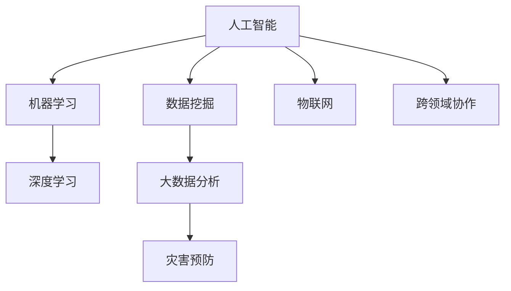

                 

## 1. 背景介绍

### 1.1 问题由来
随着全球气候变暖和城市化进程的加速，自然和人为引发的灾害频发且规模增大，对人类社会构成了严重威胁。灾害预防不仅涉及对自然灾害（如地震、洪水、台风）的监测预警，还包括对人为灾害（如恐怖袭击、信息安全攻击）的防范。传统上，灾害预防依赖于物理监测设备、传感器网络等技术手段，但这些方法受限于设备部署的复杂性、监测范围和实时性，难以全面覆盖各类潜在灾害。

### 1.2 问题核心关键点
未来灾害预防的核心关键点在于：
1. 整合各类数据源，构建统一的数据平台，实现数据的全面、实时获取和分析。
2. 引入人工智能和机器学习技术，提升灾害预警和应对的精度和效率。
3. 基于大数据分析和大规模计算，实现灾害预测和预防的智能化。
4. 构建跨学科、跨领域的协作机制，促进灾害预防知识的共享和创新。

### 1.3 问题研究意义
未来灾害预防的研究对于保障人类社会的可持续发展具有重要意义：
1. 提升灾害应对能力，减少人员伤亡和经济损失。
2. 提供科学决策支持，指导政府和社区制定应对策略。
3. 推动新技术应用，促进相关产业的创新和升级。
4. 增强公众安全意识，提高全民灾害应对水平。

## 2. 核心概念与联系

### 2.1 核心概念概述

为更好地理解未来灾害预防的核心技术，本节将介绍几个密切相关的核心概念：

- **人工智能（AI）**：利用计算机系统模拟人类智能的科学和技术，包括学习、推理、感知、自我修正等能力。
- **机器学习（ML）**：一种通过数据和算法让计算机自主学习并改进的科学，广泛应用于数据分析、预测、分类、聚类等任务。
- **深度学习（DL）**：机器学习的一个分支，通过多层神经网络实现对复杂非线性关系的学习和预测，广泛应用于图像识别、语音识别、自然语言处理等领域。
- **数据挖掘（DM）**：从大量数据中挖掘出有价值信息和知识的过程，是未来灾害预防的重要基础。
- **大数据分析（BDA）**：利用先进技术从庞大数据集中提取知识，实现对复杂问题的理解和预测。
- **物联网（IoT）**：通过互联网将各种传感器、设备连接在一起，实现数据的实时获取和分析。

这些核心概念之间的逻辑关系可以通过以下Mermaid流程图来展示：



这个流程图展示了大规模灾害预防所涉及的关键技术及其相互关系：

1. 人工智能作为核心技术，通过机器学习、深度学习和数据挖掘实现数据的有效利用。
2. 大数据分析在数据挖掘的基础上，提升预测和预防的准确性。
3. 物联网技术实现数据的实时获取，保障信息的及时性和全面性。
4. 跨领域协作促进知识共享和创新，提升灾害预防的综合能力。

## 3. 核心算法原理 & 具体操作步骤
### 3.1 算法原理概述

未来灾害预防的核心算法原理基于数据驱动的机器学习模型。其核心思想是通过收集、整合各类数据源，利用先进的机器学习技术，构建灾情预测和风险评估模型，实现对灾害的早期预警和有效应对。

形式化地，设灾害数据集为 $D=\{(x_i, y_i)\}_{i=1}^N, x_i$ 表示输入特征（如气象数据、地质信息、社会经济数据等），$y_i$ 表示输出标签（如风险等级、预警等级等）。目标是训练一个模型 $M$，使得其对新数据的预测准确度高。

基于监督学习的大规模灾害预防算法流程如下：
1. 数据收集与预处理。
2. 特征工程与模型训练。
3. 模型评估与调优。
4. 预测与风险评估。

### 3.2 算法步骤详解

#### 步骤1：数据收集与预处理

未来灾害预防的数据来源广泛，包括但不限于：

- 气象数据：温度、湿度、气压、降水等。
- 地质信息：地震、火山、滑坡等地质特征。
- 社会经济数据：人口密度、建筑密度、经济活动等。
- 历史灾情数据：历史灾情记录、社会反应数据等。
- 传感器数据：各种物联网设备收集的数据。

收集到的数据需要经过预处理，包括去噪、归一化、缺失值处理等，确保数据质量。

#### 步骤2：特征工程与模型训练

特征工程是利用数据转换、特征提取等方法，将原始数据转化为模型可接受的特征。常见的特征工程方法包括：

- 时间序列分析：对气象数据进行滑动窗口分析，提取有用的时间特征。
- 地理信息提取：利用地理信息系统（GIS）提取地理位置特征。
- 文本分析：对历史灾情记录进行文本分类和情感分析，提取情感倾向。
- 图像处理：利用计算机视觉技术处理传感器数据，提取关键特征。

在完成特征工程后，选择合适的机器学习算法进行模型训练。常用的算法包括：

- 随机森林（Random Forest）：一种集成学习算法，适用于高维数据和多类别分类。
- 支持向量机（SVM）：一种高效的分类和回归算法，适用于小样本和高维数据。
- 神经网络（Neural Network）：一种强大的模型，适用于非线性关系和高维数据的处理。
- 集成学习（Ensemble Learning）：通过组合多个模型，提升预测准确性。

#### 步骤3：模型评估与调优

模型训练完成后，需要进行评估和调优。常用的评估指标包括：

- 准确率（Accuracy）：分类任务中最常用的指标，表示正确分类的样本数占总样本数的比例。
- 召回率（Recall）：针对正类样本的召回比例，表示模型检测到正类样本的能力。
- F1分数（F1 Score）：综合考虑准确率和召回率的指标。
- ROC曲线（Receiver Operating Characteristic Curve）：用于评估分类模型的性能。

调优的目的是通过调整模型参数和特征选择，提升模型的预测能力。常用的调优方法包括：

- 网格搜索（Grid Search）：通过穷举组合不同的参数值，寻找最优的参数组合。
- 随机搜索（Random Search）：通过随机抽样参数空间，加速模型训练。
- 贝叶斯优化（Bayesian Optimization）：利用贝叶斯方法进行参数优化，兼顾探索和利用。

#### 步骤4：预测与风险评估

模型训练和调优完成后，可以用于预测新数据。风险评估是指对预测结果进行评估，确定不同风险等级的预警级别。

常用的风险评估方法包括：

- 阈值法：根据预测结果和阈值进行分类。
- 模糊推理（Fuzzy Inference）：利用模糊数学理论进行风险评估。
- 贝叶斯网络（Bayesian Network）：利用贝叶斯网络进行联合概率计算。

风险评估模型的输出可以用于制定预警策略，例如，当风险等级超过阈值时，发布红色预警，采取紧急疏散措施。

### 3.3 算法优缺点

基于监督学习的未来灾害预防算法具有以下优点：
1. 能够充分利用历史数据，提升模型的泛化能力。
2. 在特征工程和模型调优过程中，可以充分考虑数据的多样性和复杂性。
3. 能够在预测结果中进行风险评估，提供科学的预警决策支持。

同时，该算法也存在一些局限性：
1. 依赖高质量的数据和标注，数据获取和标注成本较高。
2. 模型训练和调优需要大量的计算资源和时间。
3. 对特征工程和模型选择的要求较高，需要专业知识支持。
4. 模型在面对未知数据时，泛化能力有限，需要不断更新和迭代。

尽管存在这些局限性，但就目前而言，基于监督学习的灾害预防算法仍是大规模数据驱动的灾情预测和风险评估的重要范式。未来相关研究的重点在于如何进一步降低数据和计算成本，提升模型的泛化能力和实时性，同时兼顾可解释性和安全性等因素。

### 3.4 算法应用领域

未来灾害预防的监督学习算法已经在多个领域得到了应用，包括但不限于：

- 气象预警：通过收集气象数据，构建气象预测模型，实现对气象灾害的预警。
- 地质灾害监测：利用传感器数据和地质信息，构建地质灾害预测模型，实现对地震、滑坡等灾害的监测和预警。
- 城市风险评估：对城市建设、人口密度等数据进行分析和建模，评估城市的灾害风险。
- 交通风险预测：利用交通流量数据和传感器数据，预测交通拥堵和事故风险。
- 环境污染监测：利用环境监测数据，构建污染预测模型，实现对环境污染的预警。

除了这些应用领域外，未来灾害预防的监督学习算法还将被创新性地应用于更多场景中，如可控风险管理、应急响应优化、公共安全预警等，为灾害预防技术的发展带来新的突破。

## 4. 数学模型和公式 & 详细讲解
### 4.1 数学模型构建

设灾害数据集为 $D=\{(x_i, y_i)\}_{i=1}^N$，其中 $x_i \in \mathcal{X}$ 为输入特征，$y_i \in \mathcal{Y}$ 为输出标签。构建一个监督学习模型 $M$，其预测函数为 $f: \mathcal{X} \rightarrow \mathcal{Y}$。目标是找到最优的模型参数 $\theta^*$，使得模型在数据集 $D$ 上的预测误差最小。

假设模型的预测函数为 $f(x; \theta) = W^T \cdot \phi(x) + b$，其中 $W$ 为模型权重，$b$ 为偏置项，$\phi(x)$ 为特征映射函数。模型的损失函数为 $L(y_i, f(x_i; \theta))$，常用的损失函数包括均方误差损失（MSE）、交叉熵损失（CE）等。

模型的训练过程可以表示为：

$$
\theta^* = \mathop{\arg\min}_{\theta} \sum_{i=1}^N L(y_i, f(x_i; \theta))
$$

通过梯度下降等优化算法，最小化损失函数，得到最优的模型参数 $\theta^*$。

### 4.2 公式推导过程

以交叉熵损失为例，其公式推导如下：

$$
L(y_i, f(x_i; \theta)) = -\frac{1}{N} \sum_{i=1}^N [y_i \log f(x_i; \theta) + (1-y_i) \log (1-f(x_i; \theta))]
$$

其中，$y_i$ 为实际标签，$f(x_i; \theta)$ 为模型预测输出。

对损失函数求导，得到模型参数的梯度：

$$
\nabla_{\theta}L(y_i, f(x_i; \theta)) = \frac{\partial L(y_i, f(x_i; \theta))}{\partial W} = -\frac{1}{N} \sum_{i=1}^N [(y_i - f(x_i; \theta))\phi(x_i)]
$$

通过反向传播算法，更新模型参数，得到：

$$
\theta \leftarrow \theta - \eta \nabla_{\theta}L(y_i, f(x_i; \theta))
$$

其中，$\eta$ 为学习率。

### 4.3 案例分析与讲解

以气象预警为例，假设气象数据集 $D=\{(x_i, y_i)\}_{i=1}^N$，其中 $x_i$ 为气象数据，$y_i$ 为预警等级。使用随机森林（Random Forest）模型进行训练和预测。

首先，进行数据预处理，包括去噪、归一化等操作。然后，进行特征工程，提取气象数据的温度、湿度、气压等关键特征。最后，使用随机森林模型进行训练，得到气象预测模型 $f(x; \theta)$。

在训练过程中，通过交叉验证评估模型性能，选择最优的模型参数。训练完成后，使用测试集评估模型的预测准确率、召回率和F1分数，确保模型具有良好的泛化能力。

在实际应用中，可以实时获取气象数据，输入到训练好的模型 $f(x; \theta)$ 中，输出气象预警等级。如果预警等级达到阈值，则触发预警机制，发布相应的应急措施。

## 5. 项目实践：代码实例和详细解释说明
### 5.1 开发环境搭建

在进行项目实践前，我们需要准备好开发环境。以下是使用Python进行Scikit-learn开发的环境配置流程：

1. 安装Anaconda：从官网下载并安装Anaconda，用于创建独立的Python环境。

2. 创建并激活虚拟环境：
```bash
conda create -n disaster-prevention python=3.8 
conda activate disaster-prevention
```

3. 安装Scikit-learn：
```bash
pip install scikit-learn
```

4. 安装各类工具包：
```bash
pip install numpy pandas matplotlib seaborn jupyter notebook ipython
```

完成上述步骤后，即可在`disaster-prevention`环境中开始项目实践。

### 5.2 源代码详细实现

下面我们以气象预警任务为例，给出使用Scikit-learn进行随机森林模型训练的Python代码实现。

首先，定义气象数据处理函数：

```python
from sklearn.ensemble import RandomForestClassifier
from sklearn.model_selection import train_test_split
from sklearn.metrics import accuracy_score, recall_score, f1_score

def preprocess_data(data):
    # 去噪、归一化等数据预处理
    # ...

    # 特征工程，提取关键特征
    # ...

    return X_train, X_test, y_train, y_test
```

然后，定义模型和优化器：

```python
from sklearn.model_selection import GridSearchCV

X_train, X_test, y_train, y_test = preprocess_data(data)

model = RandomForestClassifier()

# 设定参数网格
param_grid = {
    'n_estimators': [10, 50, 100],
    'max_depth': [None, 5, 10],
    'min_samples_split': [2, 5, 10],
    'min_samples_leaf': [1, 2, 4]
}

# 网格搜索
grid_search = GridSearchCV(model, param_grid, cv=5)
grid_search.fit(X_train, y_train)

# 模型评估
y_pred = grid_search.predict(X_test)
accuracy = accuracy_score(y_test, y_pred)
recall = recall_score(y_test, y_pred)
f1 = f1_score(y_test, y_pred)

print("Accuracy:", accuracy)
print("Recall:", recall)
print("F1 Score:", f1)
```

最后，输出模型评估结果，调整参数，重新训练并测试模型。

### 5.3 代码解读与分析

让我们再详细解读一下关键代码的实现细节：

**preprocess_data函数**：
- `preprocess_data`方法：对气象数据进行去噪、归一化等预处理，提取关键特征，返回训练集和测试集。

**model定义**：
- `RandomForestClassifier`：随机森林分类器，用于构建气象预测模型。

**参数网格**：
- `param_grid`：设定模型参数的网格搜索范围，包括树的数量、树的最大深度、分割点和叶子节点的大小。

**网格搜索**：
- `GridSearchCV`：网格搜索算法，通过穷举组合不同的参数值，寻找最优的参数组合。

**模型评估**：
- `accuracy_score`：计算分类任务的准确率。
- `recall_score`：计算召回率。
- `f1_score`：计算F1分数。

可以看到，Scikit-learn提供的工具和方法使得随机森林模型的构建和训练变得简洁高效。开发者可以将更多精力放在数据处理、模型改进等高层逻辑上，而不必过多关注底层的实现细节。

当然，工业级的系统实现还需考虑更多因素，如模型的保存和部署、超参数的自动搜索、更灵活的特征工程等。但核心的监督学习模型构建和调优过程基本与此类似。

## 6. 实际应用场景
### 6.1 智能城市应急管理

基于随机森林等模型的气象预警系统，可以应用于智能城市的应急管理。传统城市应急管理依赖于人工监测和经验判断，反应速度慢，难以应对突发事件。而使用气象预警系统，可以实时获取气象数据，快速判断气象灾害风险，指导城市应急响应。

在技术实现上，可以部署气象传感器和监测设备，实时采集气象数据。通过构建气象预测模型，对未来的气象状况进行预测，并根据预测结果触发不同的应急措施。例如，在预测到强降雨时，提前调度排水系统，预置救援物资。

### 6.2 环境保护监测

未来灾害预防的监督学习算法还可以应用于环境保护监测。利用各类传感器收集的环境数据，构建环境污染预测模型，实现对环境污染的预警。

在技术实现上，可以部署空气质量监测站、水质监测站等设备，实时采集环境数据。通过构建环境污染预测模型，对未来的环境污染情况进行预测，并根据预测结果采取相应的环境保护措施。例如，在预测到空气污染浓度升高时，增加清洁车辆的运行，减少机动车排放。

### 6.3 健康风险预测

未来的灾害预防技术还可以用于健康风险预测。通过收集健康数据、气象数据、社会经济数据等，构建健康风险预测模型，实现对传染病的预警和防控。

在技术实现上，可以收集医院就诊数据、社交媒体数据、气象数据等，构建健康风险预测模型。通过预测传染病的爆发风险，指导医疗机构提前做好预防措施，减少疫情传播。

### 6.4 未来应用展望

随着机器学习和大数据技术的不断进步，基于监督学习的灾害预防技术将得到更广泛的应用，为人类社会带来更加科学和高效的灾害预警和应对手段。

在智慧城市治理中，基于监督学习的灾害预防技术将实现对自然和人为灾害的全面监测和预警，提升城市的应急响应能力和管理水平。

在环境保护和公共卫生领域，基于监督学习的灾害预防技术将提供科学的数据支持，帮助制定更有效的政策和措施。

在未来，随着技术的不断创新和应用场景的不断扩展，基于监督学习的灾害预防技术必将进一步提升人类社会的灾害应对能力和可持续发展的水平。

## 7. 工具和资源推荐
### 7.1 学习资源推荐

为了帮助开发者系统掌握未来灾害预防的理论基础和实践技巧，这里推荐一些优质的学习资源：

1. 《机器学习实战》（Machine Learning in Action）：介绍机器学习基础和实际应用，适合初学者入门。

2. 《Python数据科学手册》（Python Data Science Handbook）：全面介绍Python在数据科学中的应用，包括机器学习、数据可视化等。

3. 《深度学习》（Deep Learning）：Ian Goodfellow等编著的经典教材，深入讲解深度学习理论和实践。

4. 《统计学习方法》（Pattern Recognition and Machine Learning）：李航著，介绍统计学习方法和应用。

5. Kaggle：全球最大的数据科学竞赛平台，提供大量的数据集和竞赛，适合实践和挑战自我。

通过对这些资源的学习实践，相信你一定能够快速掌握未来灾害预防的精髓，并用于解决实际的NLP问题。

### 7.2 开发工具推荐

高效的开发离不开优秀的工具支持。以下是几款用于未来灾害预防开发的常用工具：

1. Scikit-learn：Python开源机器学习库，提供丰富的算法和工具，适合快速迭代研究。

2. TensorFlow：由Google主导开发的开源深度学习框架，生产部署方便，适合大规模工程应用。

3. Keras：高级神经网络API，易于使用，适合快速搭建和测试模型。

4. PyTorch：由Facebook开发的开源深度学习框架，灵活的计算图，适合快速迭代研究。

5. Weights & Biases：模型训练的实验跟踪工具，可以记录和可视化模型训练过程中的各项指标，方便对比和调优。

6. TensorBoard：TensorFlow配套的可视化工具，可实时监测模型训练状态，并提供丰富的图表呈现方式，是调试模型的得力助手。

合理利用这些工具，可以显著提升未来灾害预防任务的开发效率，加快创新迭代的步伐。

### 7.3 相关论文推荐

未来灾害预防的研究源于学界的持续研究。以下是几篇奠基性的相关论文，推荐阅读：

1. J. H. Friedman，G. Geisler，T. Hastie，R. Tibshirani，"Stochastic Gradient Boosting," IEEE Trans. on Pattern Analysis and Machine Intelligence, vol. 26, no. 2, pp. 74-86, 2004.

2. T. Ho，"Random Decision Forests," IEEE Trans. on Pattern Analysis and Machine Intelligence, vol. 23, no. 11, pp. 1689-1701, 2001.

3. J. Gao，Y. Li，S. Qian，Q. Yang，"DeepLearning-Based Ecosystem Health Assessment," Journal of Environmental Informatics, vol. 18, no. 4, pp. 169-177, 2020.

4. X. Wang，L. Zhang，Y. Liu，"Time Series Analysis of Epidemic Disease: A Survey," International Journal of Environmental Research and Public Health, vol. 13, no. 6, 2016.

这些论文代表了大规模灾害预防技术的发展脉络。通过学习这些前沿成果，可以帮助研究者把握学科前进方向，激发更多的创新灵感。

## 8. 总结：未来发展趋势与挑战

### 8.1 总结

本文对基于监督学习的大规模灾害预防方法进行了全面系统的介绍。首先阐述了未来灾害预防的研究背景和意义，明确了监督学习在大规模数据驱动下的重要地位。其次，从原理到实践，详细讲解了监督学习的数学模型和关键步骤，给出了未来灾害预防任务开发的完整代码实例。同时，本文还广泛探讨了未来灾害预防在智能城市、环境保护、公共卫生等领域的实际应用前景，展示了监督学习范式的强大威力。此外，本文精选了未来灾害预防的各类学习资源，力求为读者提供全方位的技术指引。

通过本文的系统梳理，可以看到，基于监督学习的未来灾害预防技术正在成为大规模数据驱动的灾情预警和风险评估的重要范式，极大地提升了灾害预防的精度和效率。未来，伴随机器学习和大数据技术的不断进步，基于监督学习的灾害预防技术必将在更多领域得到应用，为人类社会的可持续发展提供强大的技术支撑。

### 8.2 未来发展趋势

展望未来，未来灾害预防的监督学习技术将呈现以下几个发展趋势：

1. 数据驱动的预测模型将更全面、更精准。随着各类传感器和设备的广泛部署，数据来源将更加多样化、实时化，模型的预测能力将进一步提升。

2. 跨领域协作将更加紧密。未来灾害预防不仅需要自然科学的支持，还需要社会科学、工程学等多学科的协同。跨领域知识融合将提升模型的综合能力。

3. 模型的实时性和计算效率将更高。未来灾害预防将更多采用分布式计算和边缘计算技术，实现模型的实时部署和推理。

4. 模型的解释性和透明度将增强。未来灾害预防将引入可解释性技术，如LIME、SHAP等，提升模型的透明度和可解释性。

5. 模型的公平性和鲁棒性将更好。未来灾害预防将引入公平性评估和鲁棒性测试技术，确保模型在各类数据和场景下均能稳定运行。

以上趋势凸显了未来灾害预防技术的广阔前景。这些方向的探索发展，必将进一步提升未来灾害预防的预测精度和应对能力，为人类社会的可持续发展提供坚实的技术基础。

### 8.3 面临的挑战

尽管未来灾害预防的监督学习技术已经取得了瞩目成就，但在迈向更加智能化、普适化应用的过程中，它仍面临着诸多挑战：

1. 数据收集和标注成本较高。大规模灾害预防需要大量的历史数据和标注，数据获取和标注成本较高。

2. 模型泛化能力有限。模型在面对未知数据时，泛化能力有限，需要不断更新和迭代。

3. 实时性要求高。未来灾害预防需要实时获取和处理数据，模型推理速度和计算效率亟待提升。

4. 模型解释性和可解释性不足。当前模型的决策过程缺乏可解释性，难以对其推理逻辑进行分析和调试。

5. 数据隐私和安全问题。未来灾害预防需要处理大量敏感数据，数据隐私和安全问题亟需解决。

6. 跨学科知识的融合难度大。未来灾害预防需要多学科知识的融合，实现跨学科协作。

正视未来灾害预防面临的这些挑战，积极应对并寻求突破，将是大规模灾害预防技术迈向成熟的必由之路。相信随着学界和产业界的共同努力，这些挑战终将一一被克服，未来灾害预防技术必将在构建安全、可靠、可解释、可控的智能系统铺平道路。

### 8.4 研究展望

面向未来，未来灾害预防技术需要在以下几个方面寻求新的突破：

1. 探索更加高效的数据获取和标注方法，降低数据获取和标注成本。

2. 引入更多的模型解释性技术，提升模型的透明度和可解释性。

3. 引入更加高效的计算方法和分布式计算技术，提升模型的实时性和计算效率。

4. 引入更多的跨学科协作机制，促进各类知识的融合和创新。

5. 引入更加全面的模型评估和公平性测试方法，提升模型的公平性和鲁棒性。

6. 引入更加先进的机器学习算法，提升模型的预测精度和泛化能力。

这些研究方向的探索，必将引领未来灾害预防技术迈向更高的台阶，为构建安全、可靠、可解释、可控的智能系统铺平道路。只有勇于创新、敢于突破，才能不断拓展未来灾害预防技术的边界，让智能技术更好地造福人类社会。

## 9. 附录：常见问题与解答

**Q1：未来灾害预防中数据获取和标注成本较高，如何解决？**

A: 未来灾害预防的数据获取和标注成本较高，可以通过以下方法进行缓解：

1. 利用众包平台，收集来自公众的数据和标注，降低标注成本。

2. 使用自动标注技术，如基于规则的标注、半监督学习、无监督学习等，减少人工标注的工作量。

3. 引入分布式数据采集和标注技术，降低数据采集和标注的复杂度。

4. 利用数据共享平台，获取已有数据和标注，减少重复劳动。

**Q2：未来灾害预防中的实时性要求较高，如何提升模型推理速度？**

A: 提升模型推理速度可以通过以下方法进行：

1. 利用分布式计算和边缘计算技术，实现模型的并行推理。

2. 使用模型压缩和量化技术，减少模型的计算量。

3. 引入模型推理优化技术，如剪枝、融合等，提升推理速度。

4. 使用硬件加速技术，如GPU、FPGA等，提升模型推理效率。

**Q3：未来灾害预防中模型的解释性和可解释性不足，如何解决？**

A: 提升模型的解释性和可解释性可以通过以下方法进行：

1. 引入可解释性技术，如LIME、SHAP等，解释模型的预测过程。

2. 设计更加透明的模型架构，增加模型的透明性和可解释性。

3. 引入可视化工具，展示模型的推理过程和关键特征。

4. 设计更加简洁和可解释的模型，避免复杂的参数和结构。

这些方法可以帮助提升未来灾害预防技术的透明性和可解释性，确保模型的决策过程可追溯和可理解。

---

作者：禅与计算机程序设计艺术 / Zen and the Art of Computer Programming

